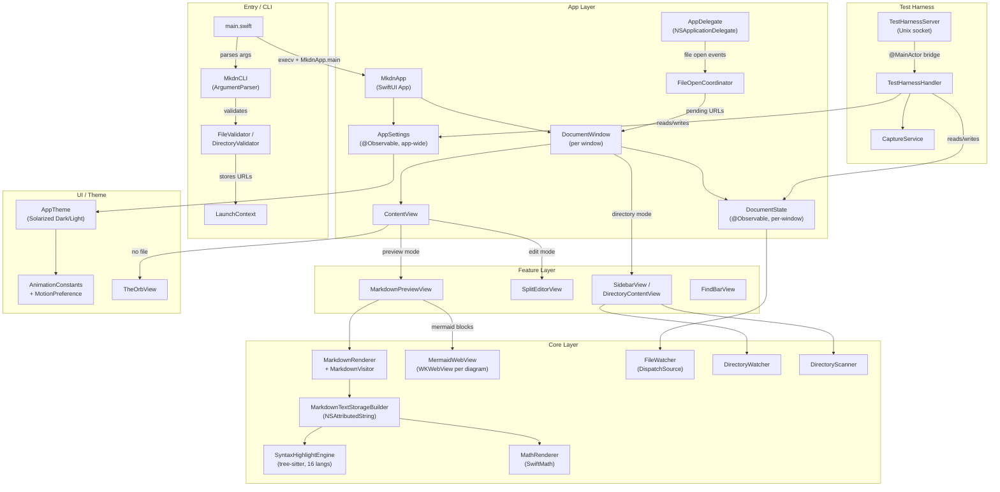

# System Architecture

**Project**: mkdn
**Architecture Pattern**: Feature-Based MVVM
**Last Updated**: 2026-02-25

## High-Level Architecture

## Architectural Patterns

### Two-Target Split (Library + Executable)
All source lives in `mkdnLib` (library target). A thin executable target (`mkdnEntry/main.swift`) provides the `@main`-free entry point, avoiding Swift test-runner crashes from `@main` in executable targets. Tests import `@testable import mkdnLib`.

### Environment-Based Dependency Injection
SwiftUI environment is the sole DI mechanism. `AppSettings` is app-wide; `DocumentState` and `FindState` are per-window. No service locator or external DI framework.

### Rendering Pipeline (Visitor + Builder)
Two-phase rendering: `MarkdownVisitor` converts parsed AST into domain-level `MarkdownBlock` enum cases, then `MarkdownTextStorageBuilder` produces a single NSAttributedString with TextKit 2 for display in a unified NSTextView.

### Overlay Composition for Complex Blocks
Complex rendered content (tables, Mermaid WKWebView, math images) is composited as overlay views positioned over placeholder regions in the base text storage, enabling native text selection to coexist with rich visual rendering.

### execv Re-launch for Clean Argv
CLI file arguments are validated, stored in environment variables, and the process re-execs itself with a clean argv to prevent NSApplication from interpreting positional args as kAEOpenDocuments AppleEvents.

### Unix Socket Test Harness
In-process test harness activated by `--test-harness` flag. A Unix domain socket accepts line-delimited JSON commands (load, capture, scroll, theme, quit), bridged to `@MainActor` for deterministic UI testing.

## Layer Structure

### Entry / CLI Layer
Process entry point, argument parsing, and launch context resolution.
- `mkdnEntry/main.swift` — Process entry, argument parsing, execv re-launch
- `Core/CLI/MkdnCLI.swift` — ArgumentParser command definition
- `Core/CLI/FileValidator.swift`, `DirectoryValidator.swift` — Path validation
- `Core/CLI/LaunchContext.swift` — Static URL container consumed at startup

### App Layer
SwiftUI lifecycle, window management, app-wide settings, system event routing.
- `App/AppDelegate.swift` — NSApplicationDelegate for Finder file-open events
- `App/AppSettings.swift` — App-wide `@Observable` (theme, zoom, auto-reload)
- `App/DocumentState.swift` — Per-window `@Observable` (file I/O, view mode)
- `App/DocumentWindow.swift` — WindowGroup scene with environment injection
- `App/ContentView.swift` — Root view switching between welcome/preview/editor
- `App/MkdnCommands.swift` — Menu bar commands (Save, Find, Zoom, etc.)
- `App/FileOpenCoordinator.swift` — Routes Finder-opened files to windows

### Feature Layer
Feature-specific views and view models organized by domain.
- **Viewer**: `MarkdownPreviewView`, `SelectableTextView`, `OverlayCoordinator`, `FindBarView`, `CodeBlockView`, `MermaidBlockView`, `MathBlockView`, `TableBlockView`, `EntranceAnimator`
- **Editor**: `SplitEditorView`, `MarkdownEditorView`, `ResizableSplitView`
- **Sidebar**: `DirectoryContentView`, `SidebarView`, `SidebarRowView`, `DirectoryState`
- **Theming**: `ThemePickerView`

### Core Layer
Domain logic: parsing, rendering, highlighting, file watching, directory scanning.
- **Markdown**: Visitor, Renderer, TextStorageBuilder (+ extensions for blocks, math, tables), TableCellMap, TableColumnSizer
- **Highlighting**: SyntaxHighlightEngine, TreeSitterLanguageMap, TokenType, HighlightQueries
- **Mermaid**: MermaidWebView, MermaidThemeMapper, MermaidRenderState
- **Math**: MathRenderer, MathAttributes
- **FileWatcher**: DispatchSource-based per-document change detection
- **DirectoryWatcher**: Filesystem monitoring for sidebar directory mode
- **DirectoryScanner**: Recursive file tree builder

### UI Layer (Cross-Cutting)
Shared components, theme definitions, animation constants.
- **Theme**: AppTheme, ThemeColors, SolarizedDark/Light, PrintPalette, AnimationConstants, MotionPreference
- **Components**: TheOrbView, OrbState, WelcomeView, WindowAccessor, ModeTransitionOverlay, PulsingSpinner

### Test Harness Layer
In-process test automation via Unix domain socket (active only with `--test-harness` flag).
- `TestHarnessServer.swift` — Socket server with JSON protocol
- `TestHarnessHandler.swift` — Command dispatch on `@MainActor`
- `CaptureService.swift` — Window screenshot capture
- `FrameCaptureSession.swift` — SCStream-based animation frame capture

## Key Data Flows

### File Open → Render
1. File path received (CLI, Finder, drag-drop, or open dialog)
2. `FileValidator` validates path → `DocumentState.loadFile()` reads content
3. `MarkdownRenderer.render()` parses → `MarkdownVisitor` walks AST → `[MarkdownBlock]`
4. `MarkdownTextStorageBuilder.build()` → NSAttributedString + attachment/overlay info
5. `SelectableTextView` displays text; `OverlayCoordinator` positions overlay views

### Finder File Open
1. macOS sends kAEOpenDocuments → `AppDelegate.application(_:open:)` filters Markdown URLs
2. URLs pushed to `FileOpenCoordinator.shared.pendingURLs`
3. If no visible windows, forces new window creation
4. `DocumentWindow.onChange(of: pendingURLs)` consumes and opens each URL

### File Change Detection
1. `DocumentState.loadFile()` starts `FileWatcher` (DispatchSource on file descriptor)
2. Kernel fires write/rename/delete events → bridged via AsyncStream to MainActor
3. `FileWatcher.isOutdated` set → UI shows reload prompt or auto-reloads

### Theme Change
1. User cycles theme (Cmd+T) → `AppSettings.themeMode` updated
2. `.onChange(of: theme)` triggers full re-render of NSAttributedString
3. Mermaid diagrams re-rendered via JS with new theme variables

## External Dependencies

| Dependency | Purpose | Integration |
|-----------|---------|-------------|
| apple/swift-markdown | Markdown AST parsing | Library — MarkdownVisitor walks Document AST |
| SwiftTreeSitter + 16 grammars | Syntax highlighting | Library — SyntaxHighlightEngine creates parser/query per call |
| Mermaid.js (bundled) | Diagram rendering | Bundled JS — loaded into per-diagram WKWebView |
| SwiftMath (mgriebling) | LaTeX math rendering | Library — MathRenderer converts to NSImage |
| swift-argument-parser | CLI argument parsing | Library — MkdnCLI struct |
| ScreenCaptureKit | Animation frame capture | System framework — test harness only |
