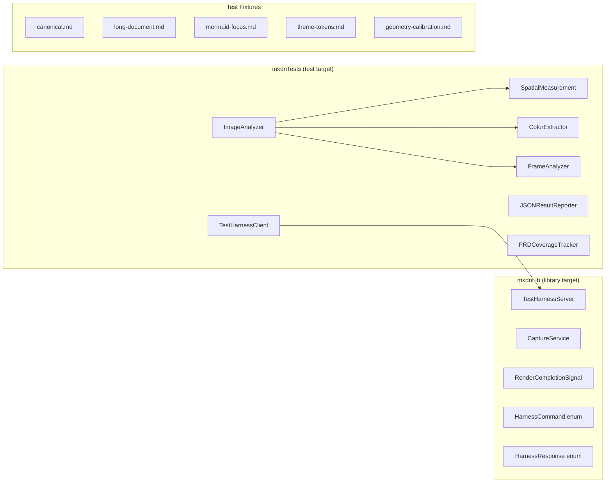
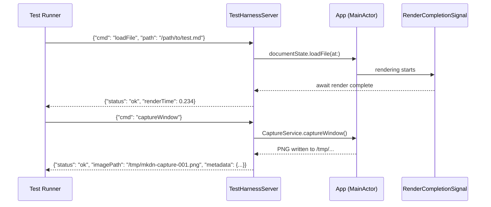

# Design: Automated UI Testing

**Feature ID**: automated-ui-testing
**Version**: 1.0.0
**Created**: 2026-02-08

## 1. Design Overview

This design defines an automated UI testing infrastructure for mkdn that enables an AI coding agent (and the human developer) to programmatically launch the application, exercise all user-facing interactions, capture rendered output as images and frame sequences, and verify compliance with spatial, visual, and animation design specifications.

The core architectural decision is a **process-based test harness with app-side cooperation** rather than XCUITest. The mkdn project is a pure SPM build (no `.xcodeproj`), which makes XCUITest impractical without introducing Xcode project infrastructure. Instead, the app gains a lightweight test harness mode activated by a launch argument. A Unix domain socket provides bidirectional communication between the test runner (Swift Testing in `mkdnTests`) and the running app. The app executes commands (load file, switch mode, cycle theme, capture window) on its main thread and responds with structured results, including file paths to captured images.

This approach gives us:
- **Deterministic render completion**: The app knows when rendering finishes and signals the test runner directly.
- **No accessibility permission requirements** for basic control (the app controls itself).
- **Reliable capture**: The app captures its own window via `CGWindowListCreateImage` with its own window ID.
- **Full SPM compatibility**: No Xcode project changes needed; everything is Swift code in existing targets.

### High-Level Architecture

```mermaid
graph TB
    subgraph "Test Process (swift test)"
        TR[Swift Testing Suites]
        TC[TestHarnessClient]
        IA[ImageAnalyzer]
        JR[JSONResultReporter]
    end

    subgraph "App Process (mkdn --test-harness)"
        THS[TestHarnessServer]
        CS[CaptureService]
        DS[DocumentState]
        AS[AppSettings]
        RCS[RenderCompletionSignal]
    end

    TR -->|drives| TC
    TC <-->|Unix domain socket<br/>JSON commands/responses| THS
    THS -->|@MainActor dispatch| DS
    THS -->|@MainActor dispatch| AS
    THS -->|capture request| CS
    CS -->|CGWindowListCreateImage| CS
    CS -->|PNG to disk| TC
    RCS -->|render done signal| THS
    TC -->|image paths| IA
    IA -->|measurements| TR
    TR -->|results| JR
    JR -->|JSON file| TR
```

## 2. Architecture

### 2.1 Component Architecture

The infrastructure spans two processes: the test runner (`swift test`) and the app under test (`mkdn --test-harness`). Communication uses a Unix domain socket with a synchronous request/response JSON protocol.



### 2.2 Communication Protocol

The test harness uses a line-delimited JSON protocol over a Unix domain socket at a deterministic path (`/tmp/mkdn-test-harness-{pid}.sock`).

**Request flow**:
1. Test runner sends a JSON command (one line, newline-terminated)
2. App receives, dispatches to `@MainActor`, executes
3. App waits for render completion (if applicable)
4. App sends JSON response (one line, newline-terminated)

**Render completion detection**: The app posts a notification when the `SelectableTextView` coordinator finishes applying attributed text and overlay updates. The `TestHarnessServer` observes this notification and waits for it before responding to commands that trigger re-rendering (load file, switch theme, switch mode).



### 2.3 Test Mode Activation

The entry point (`mkdnEntry/main.swift`) gains a `--test-harness` argument path:

```
mkdn --test-harness [--socket-path /tmp/custom.sock]
```

When `--test-harness` is detected:
1. Skip the normal CLI file-argument handling (no `execv`)
2. Launch the SwiftUI app normally
3. Start `TestHarnessServer` on a background thread
4. Server listens on Unix domain socket
5. App renders the welcome screen and awaits commands

The `--test-harness` flag is consumed before `MkdnCLI.parse()` to avoid argument parser conflicts.

### 2.4 Integration with Existing Architecture

The test harness integrates with existing app architecture via the same mechanisms views use:

| App Component | Test Harness Access | Purpose |
|---------------|-------------------|---------|
| `DocumentState` | Direct `@MainActor` access via `focusedSceneValue` | Load files, switch modes, reload |
| `AppSettings` | Direct `@MainActor` access via environment | Cycle themes, read current theme |
| `NSWindow` | Window ID from `NSApp.windows` | Capture target for `CGWindowListCreateImage` |
| `SelectableTextView.Coordinator` | Notification-based render completion | Deterministic capture timing |
| `AnimationConstants` | Static references in test assertions | Expected animation values |
| `ThemeColors` | Via `AppTheme.colors` / `.syntaxColors` | Expected color values |

## 3. Detailed Design

### 3.1 Command Schema

All commands and responses are `Codable` Swift types, serialized as JSON.

```swift
enum HarnessCommand: Codable {
    case loadFile(path: String)
    case switchMode(mode: String)          // "previewOnly" | "sideBySide"
    case cycleTheme
    case setTheme(theme: String)           // "solarizedDark" | "solarizedLight"
    case reloadFile
    case captureWindow(outputPath: String?)
    case captureRegion(region: CaptureRegion, outputPath: String?)
    case startFrameCapture(fps: Int, duration: Double, outputDir: String?)
    case stopFrameCapture
    case getWindowInfo
    case getThemeColors
    case setReduceMotion(enabled: Bool)    // test-mode override
    case ping
    case quit
}

struct CaptureRegion: Codable {
    let x: Double
    let y: Double
    let width: Double
    let height: Double
}
```

```swift
struct HarnessResponse: Codable {
    let status: String                     // "ok" | "error"
    let message: String?
    let data: ResponseData?
}

enum ResponseData: Codable {
    case capture(CaptureResult)
    case frameCapture(FrameCaptureResult)
    case windowInfo(WindowInfoResult)
    case themeColors(ThemeColorsResult)
    case pong
}

struct CaptureResult: Codable {
    let imagePath: String
    let width: Int
    let height: Int
    let scaleFactor: Double
    let timestamp: Date
    let theme: String
    let viewMode: String
}

struct FrameCaptureResult: Codable {
    let frameDir: String
    let frameCount: Int
    let fps: Int
    let duration: Double
    let framePaths: [String]
}
```

### 3.2 CaptureService

The `CaptureService` uses `CGWindowListCreateImage` with the app's own window ID for window-level capture. This captures all composited content including WKWebView (Mermaid diagrams).

```swift
@MainActor
final class CaptureService {
    func captureWindow(
        _ window: NSWindow,
        outputPath: String
    ) throws -> CaptureResult

    func captureRegion(
        _ window: NSWindow,
        region: CGRect,
        outputPath: String
    ) throws -> CaptureResult

    func startFrameCapture(
        _ window: NSWindow,
        fps: Int,
        duration: TimeInterval,
        outputDir: String
    ) async throws -> FrameCaptureResult
}
```

Frame capture uses a `DispatchSourceTimer` firing at the target FPS, with each tick calling `CGWindowListCreateImage`. Frames are written to disk as numbered PNGs (`frame_0001.png`, `frame_0002.png`, ...).

### 3.3 RenderCompletionSignal

A lightweight notification mechanism that allows the test harness to await render completion.

```swift
@MainActor
final class RenderCompletionSignal {
    static let shared = RenderCompletionSignal()

    private var continuation: CheckedContinuation<Void, Never>?

    func awaitRenderComplete(timeout: Duration = .seconds(10)) async throws {
        try await withThrowingTaskGroup(of: Void.self) { group in
            group.addTask {
                await withCheckedContinuation { cont in
                    self.continuation = cont
                }
            }
            group.addTask {
                try await Task.sleep(for: timeout)
                throw HarnessError.renderTimeout
            }
            try await group.next()
            group.cancelAll()
        }
    }

    func signalRenderComplete() {
        continuation?.resume()
        continuation = nil
    }
}
```

Integration point: `SelectableTextView.Coordinator.updateNSView` calls `RenderCompletionSignal.shared.signalRenderComplete()` after applying text content and overlays.

### 3.4 ImageAnalyzer

Pure utility library for analyzing captured images. Lives in the test target. No app dependency.

```swift
struct ImageAnalyzer {
    let image: CGImage
    let scaleFactor: CGFloat

    // Spatial measurement
    func measureEdge(from: CGPoint, direction: Direction,
                     targetColor: PixelColor, tolerance: Int) -> CGFloat?
    func measureDistance(between: PixelColor, and: PixelColor,
                        along: ScanAxis, at: CGFloat) -> CGFloat?
    func findColorBoundary(from: CGPoint, direction: Direction,
                           sourceColor: PixelColor, tolerance: Int) -> CGPoint?

    // Color sampling
    func sampleColor(at: CGPoint) -> PixelColor
    func averageColor(in: CGRect) -> PixelColor
    func dominantColor(in: CGRect) -> PixelColor
    func matchesColor(_ expected: PixelColor, at: CGPoint,
                      tolerance: Int) -> Bool

    // Region analysis
    func findRegion(matching: PixelColor, tolerance: Int) -> CGRect?
    func contentBounds(background: PixelColor, tolerance: Int) -> CGRect
}

struct PixelColor: Equatable {
    let red: UInt8
    let green: UInt8
    let blue: UInt8
    let alpha: UInt8

    func distance(to other: PixelColor) -> Int
    static func from(swiftUIColor: (Double, Double, Double)) -> PixelColor
}
```

### 3.5 FrameAnalyzer (Animation Timing)

Analyzes sequences of captured frames to extract animation timing curves.

```swift
struct FrameAnalyzer {
    let frames: [CGImage]
    let fps: Int
    let scaleFactor: CGFloat

    // Orb breathing analysis
    func measureOrbPulse(orbRegion: CGRect) -> PulseAnalysis

    // Transition timing
    func measureTransitionDuration(
        region: CGRect,
        startColor: PixelColor,
        endColor: PixelColor
    ) -> TransitionAnalysis

    // Spring analysis
    func measureSpringCurve(
        region: CGRect,
        property: AnimatableProperty
    ) -> SpringAnalysis

    // Stagger analysis
    func measureStaggerDelays(
        regions: [CGRect],
        revealColor: PixelColor,
        background: PixelColor
    ) -> [TimeInterval]
}

struct PulseAnalysis {
    let cyclesPerMinute: Double
    let isStationary: Bool        // true when Reduce Motion is on
    let amplitudeRange: ClosedRange<Double>
}

struct TransitionAnalysis {
    let duration: TimeInterval
    let curve: AnimationCurve     // easeIn, easeOut, easeInOut, linear, spring
}

struct SpringAnalysis {
    let response: TimeInterval
    let dampingFraction: Double
    let settleTime: TimeInterval
}
```

### 3.6 JSONResultReporter

Collects test results and writes a structured JSON report at suite completion.

```swift
@MainActor
final class JSONResultReporter {
    static let shared = JSONResultReporter()

    func record(_ result: TestResult)
    func writReport(to path: String) throws

    struct TestResult: Codable {
        let name: String
        let status: TestStatus
        let prdReference: String           // e.g., "spatial-design-language FR-3"
        let expected: String?
        let actual: String?
        let imagePaths: [String]
        let duration: TimeInterval
        let message: String?
    }

    struct TestReport: Codable {
        let timestamp: Date
        let totalTests: Int
        let passed: Int
        let failed: Int
        let results: [TestResult]
        let coverage: PRDCoverageReport
    }
}
```

### 3.7 Data Model: PRD Coverage

```swift
struct PRDCoverageReport: Codable {
    let prds: [PRDCoverage]
}

struct PRDCoverage: Codable {
    let prdName: String
    let totalFRs: Int
    let coveredFRs: Int
    let uncoveredFRs: [String]
    let coveragePercent: Double
}
```

### 3.8 Test Fixture Structure

```
mkdnTests/
  Fixtures/
    UITest/
      canonical.md          -- all Markdown element types
      long-document.md      -- 20+ blocks for stagger testing
      mermaid-focus.md      -- multiple Mermaid diagrams
      theme-tokens.md       -- code blocks with known Swift tokens
      geometry-calibration.md -- known-spacing elements for calibration
```

Each fixture is a static Markdown file with documented purpose and expected rendering characteristics.

## 4. Technology Stack

| Layer | Technology | Rationale |
|-------|-----------|-----------|
| Test framework | Swift Testing (`@Suite`, `@Test`, `#expect`) | Existing project pattern; all unit tests use this |
| App control | Unix domain socket + JSON protocol | SPM-compatible; no XCUITest dependency; deterministic |
| Window capture | `CGWindowListCreateImage` (Quartz) | macOS native; captures composited content including WKWebView |
| Frame capture | `DispatchSourceTimer` + `CGWindowListCreateImage` | Simple, direct; each frame is a discrete capture |
| Image analysis | `CGImage` pixel access via `CGDataProvider` | No external dependencies; direct pixel-level control |
| IPC serialization | `JSONEncoder`/`JSONDecoder` (Foundation) | Built-in; no external dependency |
| Socket transport | `Foundation.FileHandle` + POSIX socket APIs | Built-in; no external dependency |
| Test report output | `Codable` structs -> JSON file | Consistent with agent consumption model |

No new external dependencies are introduced. All technology is macOS system frameworks and Swift standard library.

## 5. Implementation Plan

### Phase 1: Foundation (Must Have -- REQ-001, REQ-002, REQ-009)

**T1: Test Harness Protocol and Shared Types**
- Define `HarnessCommand`, `HarnessResponse`, and all `Codable` types in `mkdn/Core/TestHarness/`
- Define `RenderCompletionSignal` in `mkdn/Core/TestHarness/`
- Define socket path convention and protocol specification

**T2: App-Side Test Harness Integration**
- Add `TestHarnessServer` in `mkdn/Core/TestHarness/` -- Unix domain socket listener, command dispatcher
- Modify `mkdnEntry/main.swift` to detect `--test-harness` and activate server
- Integrate `RenderCompletionSignal` into `SelectableTextView.Coordinator`
- Implement `CaptureService` for single-frame window capture
- Implement all `HarnessCommand` handlers (load, mode switch, theme cycle, etc.)

**T3: Test Harness Client**
- Add `TestHarnessClient` in `mkdnTests/Support/` -- connects to socket, sends commands, awaits responses
- Add `AppLauncher` utility to build and launch `mkdn --test-harness`, wait for socket readiness
- Add teardown logic to terminate app process and clean up socket file

**T4: Test Fixtures**
- Create `mkdnTests/Fixtures/UITest/canonical.md` with all element types
- Create focused fixtures: `long-document.md`, `mermaid-focus.md`, `theme-tokens.md`, `geometry-calibration.md`
- Document each fixture's purpose and expected rendering

### Phase 2: Spatial and Visual Compliance (Must Have -- REQ-003, REQ-004, REQ-006, REQ-007, REQ-008)

**T5: Image Analysis Library**
- Add `ImageAnalyzer` in `mkdnTests/Support/` -- pixel access, color sampling, edge detection
- Add `SpatialMeasurement` utilities -- distance measurement between color boundaries
- Add `ColorExtractor` -- color comparison with configurable tolerance
- Unit tests for analyzer accuracy against synthetic test images

**T6: Spatial Compliance Test Suite**
- Add `mkdnTests/UITest/SpatialComplianceTests.swift`
- Tests for: document margins, block spacing, heading spacing (H1-H3), component padding, window chrome insets, content max width, 8pt grid alignment
- Each test references its PRD FR and uses named constants (or PRD values until SpacingConstants exists)
- Tests follow naming convention: `test_spatialDesignLanguage_FR{N}_{aspect}`

**T7: Visual Compliance Test Suite**
- Add `mkdnTests/UITest/VisualComplianceTests.swift`
- Tests for: background color, heading text color, body text color, code syntax token colors, selection highlight
- Both Solarized Dark and Solarized Light tested
- Color assertions use `ThemeColors` and `SyntaxColors` as expected values

**T8: JSON Test Reporter and PRD Coverage**
- Add `JSONResultReporter` in `mkdnTests/Support/`
- Add `PRDCoverageTracker` that maps test names to PRD FRs
- Wire into test suite lifecycle to produce JSON output file
- Add CLI runner script that invokes `swift test --filter UITest` and reports results

### Phase 3: Animation Compliance (Should Have -- REQ-005)

**T9: Frame Sequence Capture**
- Add frame capture support to `CaptureService` (timer-based multi-frame capture)
- Add `FrameAnalyzer` in `mkdnTests/Support/` -- pulse detection, transition timing, spring curve fitting, stagger measurement

**T10: Animation Compliance Test Suite**
- Add `mkdnTests/UITest/AnimationComplianceTests.swift`
- Tests for: breathing orb rhythm, spring-settle curves, fade durations, stagger delays, Reduce Motion compliance
- Each test captures frame sequences and uses curve-fitting analysis per BR-004
- Animation expected values reference `AnimationConstants` static properties

### Phase 4: CI and Polish (Should Have -- REQ-010)

**T11: CI Configuration and Documentation**
- Document CI setup requirements (window server, screen resolution, permissions)
- Add CI-specific tolerance configuration
- Document test execution workflow for both agent and human developer

## 6. Implementation DAG

**Parallel Groups** (tasks with no inter-dependencies):

1. [T1, T4] - Protocol schema and test fixtures are independent foundational artifacts
2. [T2, T3, T5] - App harness depends on T1; client depends on T1; image analysis is independent
3. [T6, T7, T8] - All compliance suites depend on T2+T3+T4+T5; reporter depends on nothing specific
4. [T9] - Frame capture depends on T2 (app harness)
5. [T10] - Animation suite depends on T9+T4
6. [T11] - CI docs depend on all previous phases being functional

**Dependencies**:

- T2 -> T1 (interface: implements protocol defined in T1)
- T3 -> T1 (interface: client implements protocol defined in T1)
- T6 -> [T2, T3, T4, T5] (data+interface: needs running harness, fixtures, and image analysis)
- T7 -> [T2, T3, T4, T5] (data+interface: needs running harness, fixtures, and image analysis)
- T8 -> [T6, T7] (sequential: reporter wired after compliance suites exist)
- T9 -> T2 (interface: frame capture uses harness server's capture service)
- T10 -> [T9, T4] (data+interface: needs frame analyzer and test fixtures)
- T11 -> [T6, T7, T10] (sequential: documents the complete test infrastructure)

**Critical Path**: T1 -> T2 -> T6 -> T8 -> T11

## 7. Testing Strategy

### Test Value Assessment

| Valuable (design for) | Avoid |
|-----------------------|-------|
| Spatial measurement accuracy (calibration tests against known geometry) | Testing CGWindowListCreateImage API behavior |
| Color comparison accuracy (known color at known pixel) | Testing JSONEncoder/JSONDecoder |
| Harness command round-trip (send command, verify app state change) | Testing Unix socket library APIs |
| Image analyzer edge detection against synthetic test images | Testing Foundation FileHandle |
| Animation curve extraction from known synthetic frame sequences | Testing DispatchSourceTimer precision |
| PRD-anchored compliance assertions (the core value) | Testing Swift concurrency primitives |

### Test Layers

| Layer | Framework | What | Location |
|-------|-----------|------|----------|
| Unit | Swift Testing | ImageAnalyzer, ColorExtractor, SpatialMeasurement, FrameAnalyzer against synthetic images | `mkdnTests/Unit/Support/` |
| Integration | Swift Testing | TestHarnessClient <-> TestHarnessServer round-trip; command dispatch; render completion | `mkdnTests/Integration/` |
| UI Compliance | Swift Testing | Full spatial, visual, animation compliance against running app | `mkdnTests/UITest/` |

### Calibration Tests

Before running compliance tests, a calibration suite verifies measurement accuracy:

1. **Spatial calibration**: Load `geometry-calibration.md` (known elements with unambiguous spacing), measure distances, verify accuracy within 1pt.
2. **Color calibration**: Capture with known theme, sample background color at center of window, verify exact match to `ThemeColors.background` RGB values.
3. **Timing calibration**: Capture a known-duration animation (e.g., crossfade at 0.35s), analyze frames, verify measured duration is within one frame of expected.

Calibration failures block the compliance suite from running (prevents false positives/negatives from broken measurement infrastructure).

## 8. Deployment Design

### Build Integration

No changes to `Package.swift` are required for the core harness. The test harness code lives in `mkdnLib` and is always compiled but only activated at runtime by the `--test-harness` launch argument.

The `ImageAnalyzer`, `TestHarnessClient`, and all test suites live in `mkdnTests` and are only compiled for testing.

### Execution

```bash
# Full compliance suite
swift test --filter UITest

# Spatial only
swift test --filter SpatialCompliance

# Visual only
swift test --filter VisualCompliance

# Animation only
swift test --filter AnimationCompliance

# JSON report is written to:
# .build/test-results/mkdn-ui-test-report.json
```

### Permissions Required

| Permission | Needed For | How to Grant |
|------------|-----------|--------------|
| Screen Recording | `CGWindowListCreateImage` window capture | System Preferences > Privacy > Screen Recording > Terminal (or CI agent) |
| Accessibility | Not required (app controls itself) | N/A |

### Artifact Outputs

| Artifact | Path | Purpose |
|----------|------|---------|
| JSON test report | `.build/test-results/mkdn-ui-test-report.json` | Agent-consumable structured results |
| Captured images | `.build/test-results/captures/` | Visual evidence for failures |
| Frame sequences | `.build/test-results/frames/` | Animation verification data |
| PRD coverage report | `.build/test-results/prd-coverage.json` | Which PRD FRs have test coverage |

## 9. Documentation Impact

| Type | Target | Section | KB Source | Rationale |
|------|--------|---------|-----------|-----------|
| add | `.rp1/context/modules.md` | Core Layer | modules.md:Core | New `Core/TestHarness/` module with TestHarnessServer, CaptureService, RenderCompletionSignal, HarnessCommand, HarnessResponse |
| edit | `.rp1/context/architecture.md` | System Overview | architecture.md:overview | Add test harness mode to system overview; document socket-based control flow |
| edit | `.rp1/context/patterns.md` | Testing Pattern | patterns.md:testing | Add UI test pattern documentation (harness-based, PRD-anchored, calibration-first) |
| add | `.rp1/context/modules.md` | Test Layer | modules.md:dependencies | Document mkdnTests/UITest/ and mkdnTests/Support/ structure |

## 10. Design Decisions Log

| ID | Decision | Choice | Rationale | Alternatives Considered |
|----|----------|--------|-----------|------------------------|
| D1 | App control mechanism | Unix domain socket + JSON protocol (app-side harness) | SPM project has no .xcodeproj; XCUITest requires Xcode UI test target. Socket-based control is deterministic, requires no accessibility permissions, and gives direct access to render completion signals. | XCUITest (requires Xcode project), Accessibility API (requires permissions, no render completion), AppleScript (fragile, slow), stdin/stdout pipes (conflicts with SwiftUI run loop) |
| D2 | Window capture mechanism | `CGWindowListCreateImage` with app's own window ID | Captures composited content including WKWebView Mermaid diagrams. App knows its own window ID, eliminating window-matching ambiguity. | `NSView.cacheDisplay` (may miss WKWebView content), `NSWindow.backingAlignedRect` + `NSBitmapImageRep` (may miss composited layers), AVFoundation screen recording (overkill for single-frame) |
| D3 | Frame capture for animation | `DispatchSourceTimer` + per-frame `CGWindowListCreateImage` | Simple, each frame is independent. Timer precision on macOS is sufficient for 60fps. No dependency on AVFoundation or Metal. | AVFoundation `AVCaptureSession` (complex setup, video encoding overhead), `CADisplayLink` (not available on macOS for window capture), Metal layer capture (requires GPU pipeline changes) |
| D4 | Test framework for UI tests | Swift Testing (`@Suite`, `@Test`, `#expect`) | Consistent with existing project pattern. All 21 existing test files use Swift Testing. No framework mixing required. | XCTest (different assertion style, would be the only XCTest in project), separate test executable (loses `swift test` integration) |
| D5 | Render completion detection | Notification-based signal from `SelectableTextView.Coordinator` | Deterministic; the coordinator already knows when text storage is applied and overlays are positioned. Single integration point. | Polling-based (wasteful, non-deterministic), fixed delays (explicitly prohibited by REQ-001 AC-001f), accessibility property observation (complex, fragile) |
| D6 | Image analysis approach | Direct pixel analysis via `CGDataProvider` | Zero external dependencies. Full control over measurement algorithms. Pixel-level precision for spatial and color verification. | Vision framework (overkill for color/distance measurement), OpenCV via SPM (large dependency), perceptual hash libraries (not needed for precise measurement) |
| D7 | SpacingConstants reference | Use PRD-specified values with comments indicating future constant names | SpacingConstants.swift does not yet exist. Hardcoded PRD values with clear migration path when constants are implemented. | Block on SpacingConstants implementation (delays testing infrastructure), use approximate values (loses precision) |
| D8 | Reduce Motion testing | App-side override via test harness command | The test harness can set a test-mode override for `accessibilityReduceMotion` without changing system preferences. Isolated to the test session. | System preference change (affects entire system, non-isolated), SwiftUI environment injection (not accessible from outside the view hierarchy) |
| D9 | JSON output mechanism | Dedicated `JSONResultReporter` writing to file alongside `swift test` output | Decouples structured agent output from Swift Testing's own console output. Agent reads the JSON file; human reads console. | Custom Swift Testing trait/reporter (not yet a stable API), parsing `swift test` stdout (fragile, format not guaranteed), XCTest XML output (wrong framework) |
| D10 | Test target structure | All UI tests in `mkdnTests` target (no new target) | SPM test target already exists. Adding test files to existing target avoids Package.swift changes and keeps `swift test` as the single entry point. | Separate `mkdnUITests` target (requires Package.swift changes, separate build), Xcode UI test target (requires .xcodeproj) |
