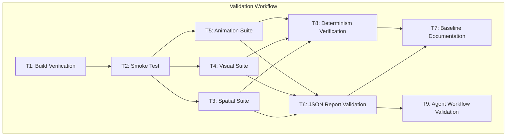
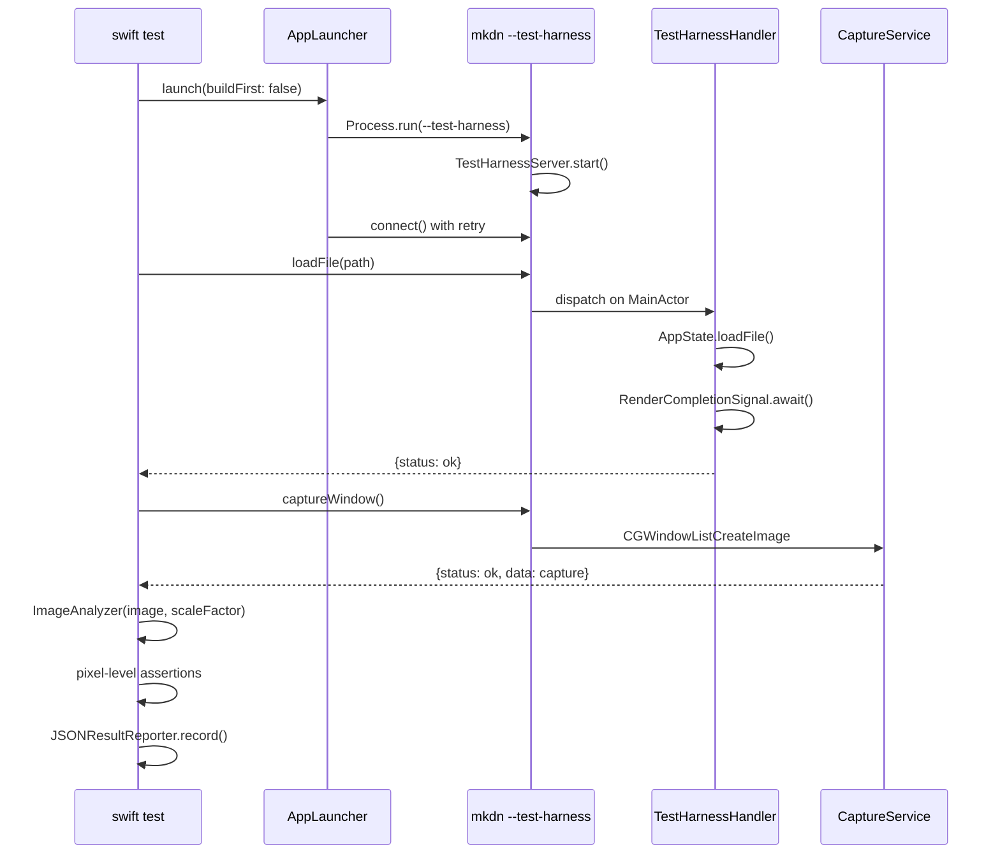

# Design: Automated UI Testing -- End-to-End Validation

**Feature ID**: automated-ui-testing
**Version**: 1.0.0
**Created**: 2026-02-08

## 1. Design Overview

This feature validates the existing automated UI testing infrastructure by executing all 41 compliance tests for the first time with Screen Recording permission enabled. The work is an iterative validation cycle -- run, diagnose, fix, re-run, document -- not a traditional code-writing feature. All fixes must be minimal and targeted, preserving the existing two-process test harness architecture.

The existing infrastructure consists of:
- **App-side**: `TestHarnessServer` (Unix socket), `TestHarnessHandler` (command dispatch), `CaptureService` (CGWindowListCreateImage), `FrameCaptureSession` (ScreenCaptureKit SCStream), `RenderCompletionSignal` (render timing)
- **Test-side**: `AppLauncher` (build + launch), `TestHarnessClient` (socket client), `ImageAnalyzer` (pixel analysis), `FrameAnalyzer` (animation curves), `JSONResultReporter` (structured output), `PRDCoverageTracker` (FR coverage)
- **Test suites**: `SpatialComplianceTests` (16 tests), `VisualComplianceTests` (12 tests), `AnimationComplianceTests` (13 tests)

### High-Level Architecture



## 2. Architecture

The existing test architecture is preserved without modification. This section documents the architecture as-is for reference during validation.

### Two-Process Test Architecture



### Suite Execution Model

Each compliance suite (`SpatialComplianceTests`, `VisualComplianceTests`, `AnimationComplianceTests`) operates independently:

- Each has its own harness singleton (`SpatialHarness`, `VisualHarness`, `AnimationHarness`) managing a separate `AppLauncher` and `TestHarnessClient`.
- Each uses `@Suite(.serialized)` ensuring internal test ordering.
- Each starts with a calibration gate. If calibration fails, downstream tests skip via `try #require(Self.calibrationPassed)`.
- Each uses `buildFirst: false` -- the mkdn binary must be pre-built.

Swift Testing may run suites in parallel (`.serialized` only applies within a suite). This means up to 3 mkdn processes could run concurrently. Socket paths are unique per PID so there is no IPC conflict.

### Capture Paths

| Path | Mechanism | Used By | Output |
|------|-----------|---------|--------|
| Static | `CGWindowListCreateImage` | Spatial, Visual | Single PNG at Retina resolution |
| Frame Sequence | `ScreenCaptureKit SCStream` | Animation | Numbered PNGs at 30/60fps |

## 3. Detailed Design

### 3.1 Validation Execution Order

The requirements specify a risk-based ordering: spatial (simplest) first, then visual (theme switching), then animation (frame capture, highest risk). Each phase follows the same diagnostic loop:

```
Run suite -> Categorize failures -> Fix infrastructure issues -> Re-run -> Document
```

**Failure Categories:**

| Category | Action | Example |
|----------|--------|---------|
| Infrastructure error | Fix in code, re-run | Socket timeout, capture returns nil, image load crash |
| Calibration failure | Fix infrastructure or tolerance, re-run | Background color mismatch, measurement outside 1pt |
| Pre-migration gap | Document as baseline, optionally adjust test expectation | Document margin 24pt vs PRD 32pt |
| Genuine compliance bug | Document, may fix if minimal | Incorrect color in ThemeColors |

### 3.2 Infrastructure Fix Patterns

Fixes must be minimal and targeted. Expected fix categories:

**Timing fixes**: Adjust `Task.sleep` durations or timeout values if render completion is slower under real conditions. The `RenderCompletionSignal` uses `CheckedContinuation` with timeout -- if the signal fires late, increase the timeout rather than redesigning the mechanism.

**Capture fixes**: If `CGWindowListCreateImage` returns nil, verify the window is on-screen and not minimized. The app launches with `standardOutput: FileHandle.nullDevice` -- confirm this does not suppress window creation. If blank images appear, check that the window has rendered content before capture.

**Tolerance adjustments**: Per BR-005, tolerance changes must be justified by empirical measurement. Run multiple captures, measure variance, set tolerance to observed variance + margin. Document justification in field notes.

**Byte order fixes**: `ImageAnalyzer` handles 4 macOS pixel byte orders. If colors appear wrong (e.g., red/blue swapped), the byte order detection in `pixelFromBytes` may need adjustment for the specific `CGImage` source (CGWindowListCreateImage vs ScreenCaptureKit).

### 3.3 Pre-Migration Gap Handling

Per CL-001 and BR-002, spatial tests that fail because current rendering uses hardcoded spacing values (not yet migrated to `SpacingConstants`) are documented, not fixed. Test expectations may be adjusted to match current rendering with migration comments:

```swift
// Current: 24pt. Target: SpacingConstants.documentMargin (32pt)
// after spatial-design-language migration.
static let documentMargin: CGFloat = 24  // was 32
```

### 3.4 Determinism Verification

Three consecutive full-suite runs. For each test, record pass/fail across all 3 runs. Any test that produces different results is flagged as flaky. Root cause analysis:

| Likely Cause | Detection | Mitigation |
|-------------|-----------|------------|
| SCStream startup latency | First N frames blank | Discard initial frames, add warmup capture |
| Render timing jitter | Capture before render completes | Increase sleep/timeout before capture |
| Tolerance too tight | Measurement varies by 1-2 units across runs | Widen tolerance with empirical justification |
| Window occlusion | Another window covers mkdn | Ensure no overlapping windows during test |

## 4. Technology Stack

No new technologies. All existing:

| Layer | Technology | Existing |
|-------|-----------|----------|
| Test framework | Swift Testing (@Suite, @Test, #expect) | Yes |
| IPC | Unix domain socket (POSIX APIs) | Yes |
| Static capture | CGWindowListCreateImage | Yes |
| Frame capture | ScreenCaptureKit (SCStream) | Yes |
| Image analysis | CoreGraphics (CGImage, CGImageSource) | Yes |
| Report output | JSONEncoder -> .build/test-results/ | Yes |
| App framework | SwiftUI + @Observable | Yes |

## 5. Implementation Plan

### T1: Build Verification and Prerequisite Check
**REQ**: Foundation for all subsequent tasks
**Scope**: Verify `swift build --product mkdn` succeeds. Verify test fixtures exist in `mkdnTests/Fixtures/UITest/`. Verify Screen Recording permission is granted by running a minimal CGWindowListCreateImage test. Verify `--test-harness` flag launches the app and binds the socket.
**Files**: No code changes expected. Diagnostic verification only.
**Estimated effort**: Small

### T2: Harness Smoke Test (REQ-001)
**REQ**: REQ-001
**Scope**: Execute the full harness lifecycle: build, launch, connect, ping, loadFile, captureWindow, quit. Verify each step produces the expected response. Verify the captured PNG is a valid Retina image with real content. This is the first end-to-end validation of the IPC mechanism.
**Files**: Potentially `mkdnTests/Support/AppLauncher.swift`, `mkdnTests/Support/TestHarnessClient.swift`, `mkdn/Core/TestHarness/TestHarnessServer.swift`, `mkdn/Core/TestHarness/TestHarnessHandler.swift`, `mkdn/Core/TestHarness/CaptureService.swift` (if infrastructure fixes needed)
**Estimated effort**: Medium (high diagnostic effort, low code change effort)

### T3: Spatial Compliance Suite -- Execute, Diagnose, Fix (REQ-002 partial, REQ-003, REQ-006 partial)
**REQ**: REQ-002 (AC-002a), REQ-003, REQ-006
**Scope**: Run `swift test --filter SpatialCompliance`. Validate calibration gate passes (measurement accuracy within 1pt). Diagnose and fix any infrastructure failures. Categorize compliance failures as pre-migration gaps or genuine bugs. Document all findings.
**Files**: `mkdnTests/UITest/SpatialComplianceTests.swift`, `mkdnTests/UITest/SpatialComplianceTests+Typography.swift`, `mkdnTests/UITest/SpatialPRD.swift` (tolerance/expected value adjustments if needed)
**Estimated effort**: Medium-Large

### T4: Visual Compliance Suite -- Execute, Diagnose, Fix (REQ-002 partial, REQ-004, REQ-006 partial)
**REQ**: REQ-002 (AC-002b), REQ-004, REQ-006
**Scope**: Run `swift test --filter VisualCompliance`. Validate calibration gate passes (background color matches ThemeColors.background). Verify theme switching works (setTheme command). Diagnose and fix infrastructure failures. Verify syntax token detection.
**Files**: `mkdnTests/UITest/VisualComplianceTests.swift`, `mkdnTests/UITest/VisualComplianceTests+Syntax.swift`, `mkdnTests/UITest/VisualPRD.swift` (tolerance adjustments if needed)
**Estimated effort**: Medium

### T5: Animation Compliance Suite -- Execute, Diagnose, Fix (REQ-002 partial, REQ-005, REQ-006 partial)
**REQ**: REQ-002 (AC-002c), REQ-005, REQ-006
**Scope**: Run `swift test --filter AnimationCompliance`. Validate calibration gate passes both phases (frame capture infrastructure + crossfade timing). Diagnose ScreenCaptureKit frame delivery issues. Validate orb pulse detection, fade duration measurement, spring curve analysis, stagger delay measurement, and Reduce Motion compliance. This is the highest-risk suite.
**Files**: `mkdnTests/UITest/AnimationComplianceTests.swift`, `mkdnTests/UITest/AnimationComplianceTests+FadeDurations.swift`, `mkdnTests/UITest/AnimationComplianceTests+ReduceMotion.swift`, `mkdnTests/UITest/AnimationPRD.swift`, `mkdn/Core/TestHarness/FrameCaptureSession.swift`, `mkdnTests/Support/FrameAnalyzer.swift` (tolerance/timing adjustments if needed)
**Estimated effort**: Large (highest risk, most complex diagnostics)

### T6: JSON Report Validation (REQ-007)
**REQ**: REQ-007
**Scope**: After a full test run, verify the JSON report at `.build/test-results/mkdn-ui-test-report.json`. Validate structure (valid JSON, totalTests matches, each result has prdReference, failures have expected/actual, coverage section is accurate). Fix JSONResultReporter or PRDCoverageTracker if report is incomplete or malformed.
**Files**: `mkdnTests/Support/JSONResultReporter.swift`, `mkdnTests/Support/PRDCoverageTracker.swift` (fixes if needed)
**Estimated effort**: Small

### T7: Compliance Baseline Documentation (REQ-008)
**REQ**: REQ-008
**Scope**: Compile the baseline: total tests, passing count, failing count, category of each failure. Document pre-migration gaps with test name, PRD reference, expected value, measured value, and migration dependency. Record in field notes.
**Files**: `.rp1/work/features/automated-ui-testing/field-notes.md` (new)
**Estimated effort**: Small

### T8: Determinism Verification (REQ-010)
**REQ**: REQ-010
**Scope**: Run `swift test --filter UITest` 3 consecutive times. Compare pass/fail results across runs. Flag flaky tests. Diagnose root cause of non-determinism. Fix or document mitigation.
**Files**: Potentially any test file (if flaky test needs tolerance adjustment)
**Estimated effort**: Medium (execution time + diagnosis)

### T9: Agent Workflow Validation (REQ-009)
**REQ**: REQ-009
**Scope**: Demonstrate one complete agent loop: run suite via CLI, parse JSON report, identify failing test, trace to PRD requirement, make targeted fix, re-run, confirm fix. Document the workflow.
**Files**: Any test or source file (one targeted change to demonstrate the loop)
**Estimated effort**: Small-Medium

## 6. Implementation DAG

**Parallel Groups** (tasks with no inter-dependencies):

1. [T1] - Build verification, prerequisite check (no dependencies)
2. [T2] - Smoke test (validates harness infrastructure end-to-end)
3. [T3, T4, T5] - Suite execution (independent suites, though recommended order is T3->T4->T5 for risk management)
4. [T6] - JSON report validation (needs test results from suites)
5. [T7, T8, T9] - Baseline, determinism, agent workflow (all need completed suite runs + report)

**Dependencies**:

- T2 -> T1 (build must succeed before launching app)
- T3 -> T2 (smoke test validates infrastructure before running suites)
- T4 -> T2 (same infrastructure dependency)
- T5 -> T2 (same infrastructure dependency)
- T6 -> [T3, T4, T5] (report must contain real test results)
- T7 -> [T3, T4, T5, T6] (baseline needs all suite results + validated report)
- T8 -> [T3, T4, T5] (determinism needs passing suites)
- T9 -> T6 (agent workflow needs parseable JSON report)

**Recommended Execution Order** (respecting risk ordering within parallel group 3):

T1 -> T2 -> T3 -> T4 -> T5 -> T6 -> [T7, T8, T9]

**Critical Path**: T1 -> T2 -> T5 -> T6 -> T7

Note: T3/T4/T5 are technically parallelizable (no data dependency) but recommended sequential for diagnostic clarity. If T3 reveals infrastructure issues that T4/T5 would also hit, fixing them once in T3 avoids duplicate diagnosis in T4/T5.

## 7. Testing Strategy

### Test Value Assessment

This feature is inherently about testing. The "tests" are the compliance suites themselves. The testing strategy for this feature is:

| Test Type | Approach | Value |
|-----------|----------|-------|
| Harness smoke test | Run AppLauncher -> TestHarnessClient -> full lifecycle | HIGH: validates IPC infrastructure |
| Calibration gates | Run each suite's calibration test | HIGH: trust foundation for all assertions |
| Compliance assertions | Run all 41 tests | HIGH: validates design system enforcement |
| Determinism check | 3 consecutive runs | HIGH: validates test reliability |
| JSON report validation | Parse and verify report structure | MEDIUM: validates agent interface |

**Tests NOT needed (avoid):**
- Unit tests for ImageAnalyzer/FrameAnalyzer (already exist in prior iteration)
- Tests verifying Swift Testing framework behavior
- Tests for POSIX socket API behavior
- Tests for CGWindowListCreateImage API behavior

### Per-Suite Execution Commands

```bash
# Build first (required since all suites use buildFirst: false)
swift build --product mkdn

# Run all UI tests
swift test --filter UITest

# Run individual suites
swift test --filter SpatialCompliance
swift test --filter VisualCompliance
swift test --filter AnimationCompliance
```

### Diagnostic Capture Strategy

When a test fails, the diagnostic information sources are:

1. **Swift Testing output**: `#expect` and `#require` failure messages include PRD reference, expected value, measured value
2. **JSON report**: `.build/test-results/mkdn-ui-test-report.json` for structured results
3. **Captured images**: PNG files at paths in CaptureResult.imagePath (for visual inspection)
4. **Frame sequences**: Numbered PNGs in frame capture output directories (for animation inspection)
5. **Console output**: TestHarnessServer logs (currently sent to nullDevice -- may need to redirect for diagnosis)

## 8. Deployment Design

No deployment required. This feature operates entirely in the local development environment.

**Prerequisites**:
- Screen Recording permission granted for the terminal process (System Settings > Privacy & Security > Screen Recording)
- ScreenCaptureKit permission accepted (may prompt on first use)
- GUI session with window server (not headless)
- Retina display (2x scale factor assumed)
- Pre-built mkdn binary via `swift build --product mkdn`

**Artifacts produced**:
- JSON report at `.build/test-results/mkdn-ui-test-report.json`
- Captured PNGs in temporary directories
- Field notes with baseline documentation

## 9. Documentation Impact

| Type | Target | Section | KB Source | Rationale |
|------|--------|---------|-----------|-----------|
| edit | `.rp1/context/patterns.md` | UI Test Pattern | patterns.md:UI Test Pattern | Update with validated tolerances, any discovered gotchas |
| edit | `.rp1/context/architecture.md` | Test Harness Mode | architecture.md:Test Harness Mode | Update with empirically validated behavior, any timing adjustments |
| edit | `docs/ui-testing.md` | Tolerances, Known Issues | N/A | Update tolerances if adjusted, add known issues section |
| add | `.rp1/work/features/automated-ui-testing/field-notes.md` | Baseline | N/A | Compliance baseline, infrastructure fix log |

## 10. Design Decisions Log

| ID | Decision | Choice | Rationale | Alternatives Considered |
|----|----------|--------|-----------|------------------------|
| D1 | Suite execution order | Sequential: spatial -> visual -> animation | Risk-based ordering per CL-003. Spatial is simplest (single static capture), animation is highest risk (SCStream frame capture). Infrastructure fixes discovered in earlier suites benefit later ones. | Parallel execution (faster but harder to diagnose), reverse order (riskiest first to fail fast) |
| D2 | Pre-migration gap handling | Document and optionally adjust test expectations with migration comments | Per BR-002 and CL-001. The goal is infrastructure validation, not pre-migration compliance enforcement. Adjusting expectations allows the suite to serve as a green baseline. | Leave tests failing (clutters results, harder to spot real regressions), fix rendering code (out of scope) |
| D3 | Tolerance adjustment policy | Only in response to empirical failure, justified by measured variance | Per BR-005. Starting with configured tolerances (1pt spatial, 10/15/25 color, 1-frame animation). Widening requires documenting observed variance across multiple measurements. | Proactive loosening (risks masking real issues), keeping tight and accepting flakiness (undermines agent confidence) |
| D4 | Determinism target | 3 consecutive runs (reduced from 10) | Per CL-002. Priority is validating infrastructure works at all. 3 runs catches obvious flakiness while keeping iteration time reasonable. | 10 runs (prior iteration target, too time-consuming for this iteration), 1 run (insufficient for flakiness detection) |
| D5 | Console output for diagnosis | Redirect stderr to pipe during smoke test, nullDevice for suite runs | AppLauncher sets stdout/stderr to nullDevice. For smoke test diagnosis, temporarily capture stderr to see harness server logs. For suite runs, rely on JSON report and captured images. | Always capture (noise in test output), never capture (blind to server-side errors) |
| D6 | Build strategy | Pre-build once, all suites use buildFirst:false | Existing pattern. AppLauncher in each harness singleton uses `launch(buildFirst: false)`. Build happens once as T1 prerequisite. | Build per suite (wastes 30-60s per suite), modify harness to share one app instance (architectural change, out of scope) |
