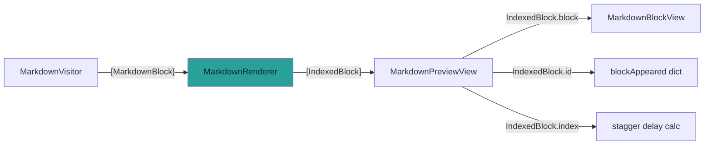
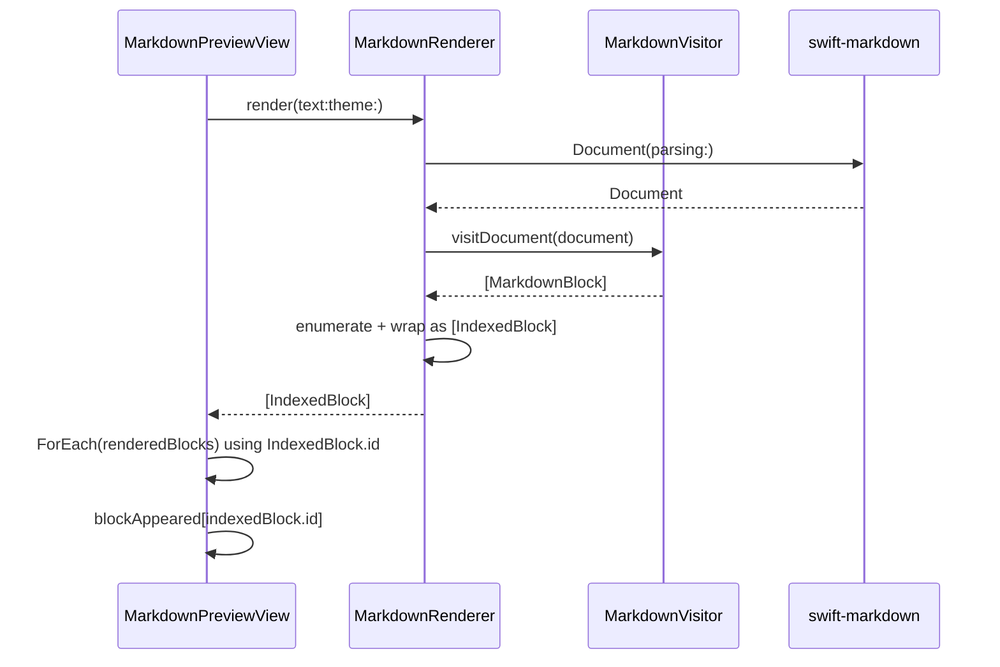

# Technical Design: Block Rendering Fix

**Feature ID**: block-rendering-fix
**Version**: 1.0.0
**Created**: 2026-02-07

## 1. Design Overview

This design addresses two rendering bugs in the Markdown preview pipeline:

1. **Duplicate block IDs**: The `MarkdownBlock.id` computed property is content-based. Blocks with identical content (e.g., multiple thematic breaks all returning `"hr"`, or two identical paragraphs) produce duplicate IDs, corrupting SwiftUI's `ForEach` view diffing and the stagger animation state dictionary.

2. **Missing whitespace foreground color**: `ThemeOutputFormat.Builder.addWhitespace` creates `AttributedString` runs without a `foregroundColor` attribute, breaking color continuity in syntax-highlighted code blocks.

The fix introduces an `IndexedBlock` wrapper that pairs each `MarkdownBlock` with its array position, producing IDs that are both unique and deterministic. The whitespace fix is a single-line addition to set `foregroundColor` on whitespace runs.

### High-Level Architecture



## 2. Architecture

### Component Interaction

The change is localized to the boundary between the renderer and its consumers. The `MarkdownVisitor` continues producing `[MarkdownBlock]` (content-based enum values). The `MarkdownRenderer` wraps each block with its array index into an `IndexedBlock`, which provides the unique `Identifiable.id`. The `MarkdownPreviewView` consumes `[IndexedBlock]` instead of `[MarkdownBlock]`.



### Why a Wrapper Instead of Restructuring the Enum

Three alternatives were considered:

1. **Restructure `MarkdownBlock` from enum to struct**: Would require changing every pattern match across views and tests (30+ sites). Violates the scope constraint against UI component changes.
2. **Add index as associated value to every enum case**: Ugly, error-prone, and requires changing the visitor to thread indices through all conversion methods including nested blocks.
3. **Wrapper struct at the renderer boundary** (chosen): One new 6-line struct. Renderer wraps blocks. Consumer unwraps with `.block`. Enum and all nested `ForEach` loops in `MarkdownBlockView` remain unchanged.

The wrapper approach solves the top-level duplicate ID problem (which causes the visible bugs) with minimal code churn. Nested duplicate blocks (e.g., two identical paragraphs inside a single blockquote) remain content-ID-based via the inner enum's `Identifiable` conformance -- this is acceptable because the nested case is not reported and the scope excludes `MarkdownBlockView` changes.

## 3. Detailed Design

### 3.1 IndexedBlock Struct

Added to `MarkdownBlock.swift`:

```swift
/// Pairs a MarkdownBlock with its position in the rendered document,
/// producing a unique ID for SwiftUI view identity.
struct IndexedBlock: Identifiable {
    let index: Int
    let block: MarkdownBlock

    var id: String {
        "\(index)-\(block.id)"
    }
}
```

**ID composition**: `"{array_index}-{content_based_id}"`

Examples:
- Three thematic breaks: `"0-hr"`, `"2-hr"`, `"4-hr"` (unique)
- Two identical paragraphs: `"1-paragraph-{hash}"`, `"3-paragraph-{hash}"` (unique)
- Same content re-rendered: `"1-paragraph-{hash}"` both times (deterministic)

`MarkdownBlock` enum is unchanged. It retains its `Identifiable` conformance with content-based `id` for nested `ForEach` loops in `MarkdownBlockView`.

### 3.2 MarkdownRenderer Return Type

Both public `render` methods change return type from `[MarkdownBlock]` to `[IndexedBlock]`:

```swift
enum MarkdownRenderer {
    static func parse(_ text: String) -> Document {
        Document(parsing: text)
    }

    static func render(document: Document, theme: AppTheme) -> [IndexedBlock] {
        let visitor = MarkdownVisitor(theme: theme)
        let blocks = visitor.visitDocument(document)
        return blocks.enumerated().map { IndexedBlock(index: $0.offset, block: $0.element) }
    }

    static func render(text: String, theme: AppTheme) -> [IndexedBlock] {
        let document = parse(text)
        return render(document: document, theme: theme)
    }
}
```

### 3.3 MarkdownPreviewView Updates

The view's state and iteration update to use `IndexedBlock`:

| Current | After |
|---------|-------|
| `@State private var renderedBlocks: [MarkdownBlock] = []` | `@State private var renderedBlocks: [IndexedBlock] = []` |
| `ForEach(Array(renderedBlocks.enumerated()), id: \.element.id) { index, block in` | `ForEach(renderedBlocks) { indexedBlock in` |
| `MarkdownBlockView(block: block)` | `MarkdownBlockView(block: indexedBlock.block)` |
| `blockAppeared[block.id]` | `blockAppeared[indexedBlock.id]` |
| `Double(index) * motion.staggerDelay` | `Double(indexedBlock.index) * motion.staggerDelay` |

The `ForEach` simplifies: `IndexedBlock` is `Identifiable` with unique IDs, so no need for `enumerated()` or explicit `id:` keypath. The `index` for stagger delay is available as `indexedBlock.index`.

All `blockAppeared` dictionary operations use `indexedBlock.id` (unique) instead of `block.id` (potentially duplicate). The stagger logic, cleanup pass, and theme-change handler all work unchanged because they only access `.id` and `.index`.

### 3.4 Whitespace Foreground Color Fix

In `ThemeOutputFormat.Builder.addWhitespace`:

```swift
// Before:
mutating func addWhitespace(_ whitespace: String) {
    result.append(AttributedString(whitespace))
}

// After:
mutating func addWhitespace(_ whitespace: String) {
    var attributed = AttributedString(whitespace)
    attributed.foregroundColor = plainTextColor
    result.append(attributed)
}
```

This ensures every run in the `AttributedString` produced by syntax highlighting carries a non-nil `foregroundColor`, preventing SwiftUI's `Text` view from inheriting inconsistent colors across run boundaries.

## 4. Technology Stack

No changes. All work uses existing Swift, SwiftUI, and Splash dependencies.

| Layer | Technology | Change |
|-------|-----------|--------|
| Model | Swift enum + struct | New `IndexedBlock` struct |
| Renderer | `MarkdownRenderer` | Return type change |
| View | SwiftUI `ForEach` | Identity source change |
| Syntax Highlighting | Splash `OutputBuilder` | One-line fix |

## 5. Implementation Plan

### T1: Add IndexedBlock to MarkdownBlock.swift

**File**: `mkdn/Core/Markdown/MarkdownBlock.swift`

- Add `IndexedBlock` struct after the `MarkdownBlock` enum
- No changes to `MarkdownBlock` enum itself
- No changes to `ListItem`

### T2: Update MarkdownRenderer Return Type

**File**: `mkdn/Core/Markdown/MarkdownRenderer.swift`

- Change `render(document:theme:)` to return `[IndexedBlock]`
- Add `.enumerated().map { IndexedBlock(...) }` wrapping
- Change `render(text:theme:)` return type to match

### T3: Update MarkdownPreviewView Consumer

**File**: `mkdn/Features/Viewer/Views/MarkdownPreviewView.swift`

- Change `renderedBlocks` type to `[IndexedBlock]`
- Simplify `ForEach` to use `IndexedBlock` directly (no `enumerated()`)
- Update all `block.id` references to `indexedBlock.id`
- Update `MarkdownBlockView(block:)` calls to pass `indexedBlock.block`
- Update stagger delay to use `indexedBlock.index`

### T4: Fix Whitespace Foreground Color

**File**: `mkdn/Core/Markdown/ThemeOutputFormat.swift`

- Set `attributed.foregroundColor = plainTextColor` in `addWhitespace`

### T5: Update and Add Tests

**Files**:
- `mkdnTests/Unit/Core/MarkdownBlockTests.swift` -- add `IndexedBlock` uniqueness and determinism tests
- `mkdnTests/Unit/Core/ThemeOutputFormatTests.swift` -- update whitespace test to assert `foregroundColor == red` (was `nil`)
- `mkdnTests/Unit/Core/MarkdownRendererTests.swift` -- update pattern matches (`blocks.first?.block`), add multi-thematic-break uniqueness test
- `mkdnTests/Unit/Core/MarkdownVisitorTests.swift` -- update pattern matches (`blocks.first?.block`)

## 6. Implementation DAG

**Parallel Groups** (tasks with no inter-dependencies):

1. [T1, T4] - IndexedBlock struct and whitespace fix have no shared code paths
2. [T2] - Renderer depends on IndexedBlock type from T1
3. [T3, T5] - Preview view and tests depend on renderer returning IndexedBlock

**Dependencies**:

- T2 -> T1 (interface: T2 uses IndexedBlock type defined in T1)
- T3 -> T2 (interface: T3 consumes [IndexedBlock] returned by T2)
- T5 -> [T1, T2, T4] (data: tests verify IndexedBlock uniqueness, renderer output, and whitespace color)

**Critical Path**: T1 -> T2 -> T3

## 7. Testing Strategy

### Test Value Assessment

All tests trace to application-specific requirements -- no library behavior verification.

| Test | Traces To | Value |
|------|-----------|-------|
| IndexedBlock uniqueness for thematic breaks | REQ-001, AC-001a | App-specific ID contract |
| IndexedBlock uniqueness for identical paragraphs | REQ-002, AC-002a | App-specific ID contract |
| IndexedBlock determinism across re-renders | REQ-003, AC-003a | App-specific diffing correctness |
| Whitespace run has foregroundColor | REQ-004, AC-004a | App-specific rendering fix |
| Whitespace foregroundColor matches plainTextColor | REQ-004, AC-004b | App-specific color contract |
| Multiple thematic breaks produce unique renderer output | REQ-001 | End-to-end rendering pipeline |

### New Tests

**MarkdownBlockTests** (add to existing suite):

```swift
@Test("IndexedBlock produces unique IDs for thematic breaks at different indices")
func indexedBlockThematicBreakUniqueness() {
    let block1 = IndexedBlock(index: 0, block: .thematicBreak)
    let block2 = IndexedBlock(index: 1, block: .thematicBreak)
    let block3 = IndexedBlock(index: 2, block: .thematicBreak)
    #expect(block1.id != block2.id)
    #expect(block2.id != block3.id)
    #expect(block1.id != block3.id)
}

@Test("IndexedBlock produces unique IDs for identical paragraphs at different indices")
func indexedBlockParagraphUniqueness() {
    let text = AttributedString("same content")
    let block1 = IndexedBlock(index: 0, block: .paragraph(text: text))
    let block2 = IndexedBlock(index: 3, block: .paragraph(text: text))
    #expect(block1.id != block2.id)
}

@Test("IndexedBlock ID is deterministic for same content and index")
func indexedBlockDeterminism() {
    let block1 = IndexedBlock(index: 5, block: .thematicBreak)
    let block2 = IndexedBlock(index: 5, block: .thematicBreak)
    #expect(block1.id == block2.id)
}
```

**MarkdownRendererTests** (add to existing suite):

```swift
@Test("Multiple thematic breaks produce unique IDs")
func multipleThematicBreaksUniqueIDs() {
    let markdown = "---\n\n---\n\n---"
    let blocks = MarkdownRenderer.render(text: markdown, theme: .solarizedDark)
    #expect(blocks.count == 3)
    let ids = Set(blocks.map(\.id))
    #expect(ids.count == 3)
}
```

**ThemeOutputFormatTests** (update existing test):

```swift
@Test("addWhitespace applies plainTextColor as foreground color")
func whitespaceHasForegroundColor() {
    let format = ThemeOutputFormat(plainTextColor: red, tokenColorMap: [:])
    var builder = format.makeBuilder()
    builder.addWhitespace("  \n")
    let result = builder.build()
    #expect(String(result.characters) == "  \n")
    let runs = Array(result.runs)
    #expect(runs.count == 1)
    #expect(runs[0].foregroundColor == red)
}
```

### Existing Test Updates

All existing tests that pattern-match on `MarkdownRenderer.render()` output need to unwrap `.block`:

- `blocks.first` pattern matches become `blocks.first?.block`
- `blocks[index]` pattern matches become `blocks[index].block`
- `.id` access continues to work on `IndexedBlock`

Affected test files:
- `MarkdownRendererTests.swift` (~10 pattern matches)
- `MarkdownVisitorTests.swift` (~15 pattern matches)

## 8. Deployment Design

No deployment changes. This is a bug fix in the rendering pipeline with no infrastructure, configuration, or release-process implications. Standard build-test-commit cycle.

## 9. Documentation Impact

| Type | Target | Section | KB Source | Rationale |
|------|--------|---------|-----------|-----------|
| edit | `.rp1/context/modules.md` | Core Layer > Markdown | modules.md:MarkdownBlock.swift | Add IndexedBlock to file purpose description |
| edit | `.rp1/context/architecture.md` | Rendering Pipeline > Markdown | architecture.md:Markdown | Update pipeline to show IndexedBlock wrapping step |

## 10. Design Decisions Log

| ID | Decision | Choice | Rationale | Alternatives Considered |
|----|----------|--------|-----------|------------------------|
| D1 | How to make block IDs unique | Wrapper struct (`IndexedBlock`) at renderer boundary | Minimal code churn; enum stays unchanged; all nested ForEach loops unaffected; 6-line struct | (a) Restructure enum to struct -- 30+ pattern match changes, (b) Add index to every enum case -- verbose and error-prone, (c) Post-process IDs -- impossible with computed property |
| D2 | ID composition format | `"{index}-{contentID}"` | Simple, deterministic, human-readable; index guarantees uniqueness; contentID preserves stability for unchanged blocks | (a) Index only -- loses content stability, (b) UUID -- non-deterministic, (c) Hash of index+content -- less readable |
| D3 | Scope of uniqueness fix | Top-level blocks only (via IndexedBlock); nested blocks retain content-based IDs | Fixes reported bugs; nested duplicates are unreported edge case; avoids MarkdownBlockView changes (out of scope) | Full-depth uniqueness via enum restructure -- too invasive |
| D4 | Whitespace color value | Use `plainTextColor` parameter | Matches existing `addPlainText` behavior; whitespace glyphs are invisible so exact color is irrelevant; ensures non-nil for run continuity | (a) Hardcoded color -- not theme-aware, (b) Leave nil -- the bug |
| D5 | ForEach identity approach | Direct `ForEach(renderedBlocks)` using IndexedBlock.Identifiable | Simpler than current `ForEach(Array(renderedBlocks.enumerated()), id: \.element.id)`; index available via `indexedBlock.index` | Keep enumerated -- unnecessary now that IndexedBlock carries index |
