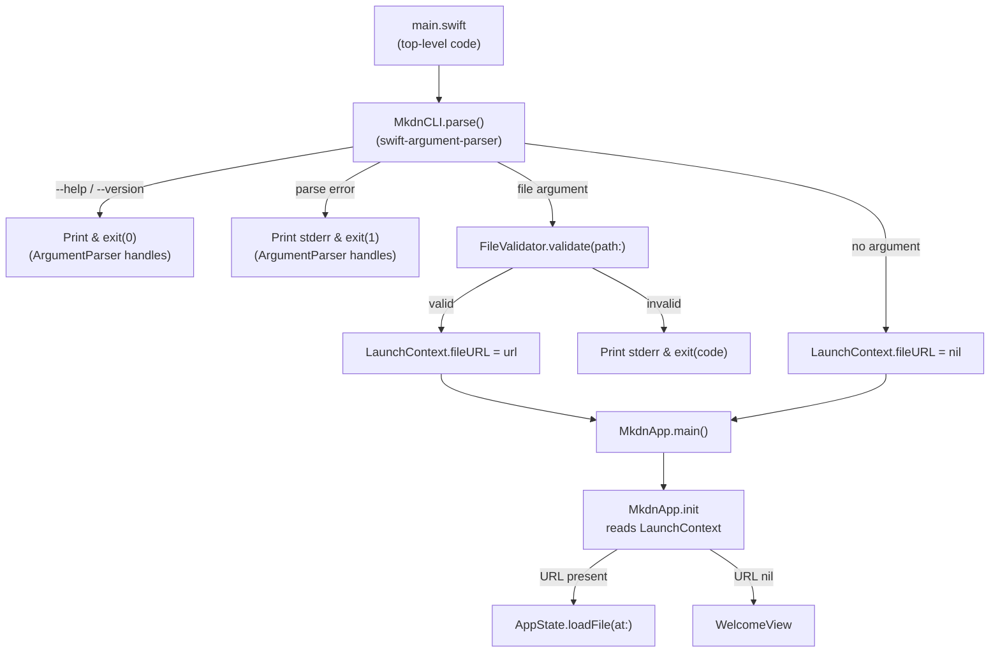
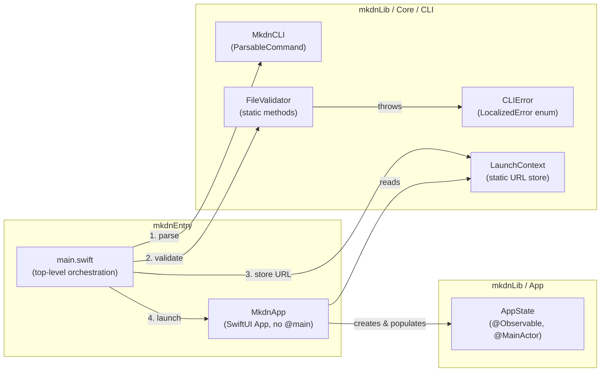
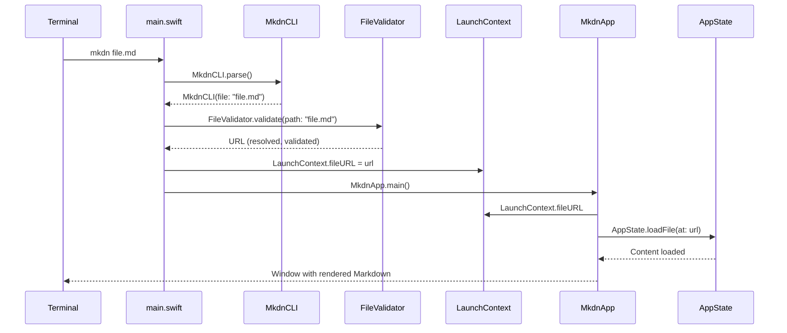
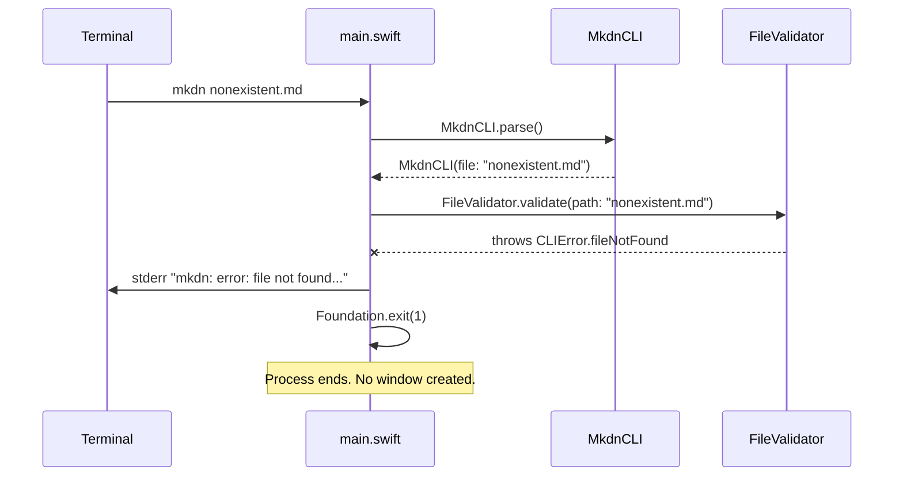

# Design: CLI Launch

**Feature ID**: cli-launch
**Version**: 1.0.0
**Status**: Draft
**Created**: 2026-02-06

## 1. Design Overview

CLI Launch replaces the existing `CLIHandler` with a structured argument-parsing pipeline built on `swift-argument-parser`. The key architectural change is restructuring `mkdnEntry/main.swift` from an `@main` SwiftUI App declaration into top-level orchestration code that validates arguments **before** the SwiftUI lifecycle starts. This ensures error cases exit cleanly to stderr without ever creating a GUI window.

The pipeline flow is: **parse arguments -> validate file -> launch app or exit with error**.

### High-Level Architecture



## 2. Architecture

### Component Architecture



### Sequence: Successful File Open



### Sequence: Error Case (No GUI Window)



## 3. Detailed Design

### 3.1 MkdnCLI (ParsableCommand)

**File**: `mkdn/Core/CLI/MkdnCLI.swift`

A `ParsableCommand` struct that declares the CLI interface. It does NOT implement `run()` -- it is used purely for parsing via `MkdnCLI.parse()`.

```swift
import ArgumentParser

struct MkdnCLI: ParsableCommand {
    static let configuration = CommandConfiguration(
        commandName: "mkdn",
        abstract: "A Mac-native Markdown viewer.",
        version: "1.0.0"
    )

    @Argument(help: "Path to a Markdown file (.md or .markdown).")
    var file: String?
}
```

- `--help` and `--version` are handled automatically by ArgumentParser (prints to stdout, exits with code 0).
- Unknown flags cause ArgumentParser to print an error to stderr and exit with non-zero code.
- The `file` argument is optional to support no-argument launch (FR-7).

### 3.2 CLIError

**File**: `mkdn/Core/CLI/CLIError.swift`

Typed error enum following the project's error-handling pattern (LocalizedError conformance).

```swift
import Foundation

enum CLIError: LocalizedError {
    case unsupportedExtension(path: String, ext: String)
    case fileNotFound(resolvedPath: String)
    case fileNotReadable(resolvedPath: String, reason: String)

    var errorDescription: String? {
        switch self {
        case .unsupportedExtension(let path, let ext):
            let extText = ext.isEmpty ? "no extension" : ".\(ext)"
            return "unsupported file type '\(extText)' for '\(path)'. Accepted: .md, .markdown"
        case .fileNotFound(let resolvedPath):
            return "file not found: \(resolvedPath)"
        case .fileNotReadable(let resolvedPath, let reason):
            return "cannot read file: \(resolvedPath) (\(reason))"
        }
    }

    var exitCode: Int32 {
        switch self {
        case .unsupportedExtension, .fileNotFound:
            return 1  // User error
        case .fileNotReadable:
            return 2  // System error
        }
    }
}
```

### 3.3 FileValidator

**File**: `mkdn/Core/CLI/FileValidator.swift`

Static methods for the validation pipeline. Validation order follows BR-2: extension -> existence -> readability.

```swift
import Foundation

enum FileValidator {
    /// Resolve a raw path string to a validated file URL.
    /// Performs: tilde expansion, path resolution, symlink resolution,
    /// extension validation, existence check, and readability check.
    /// Throws CLIError on any failure.
    static func validate(path: String) throws -> URL {
        let resolved = resolvePath(path)
        try validateExtension(url: resolved, originalPath: path)
        try validateExistence(url: resolved)
        try validateReadability(url: resolved)
        return resolved
    }

    /// Expand tilde, resolve relative paths against cwd, resolve symlinks.
    static func resolvePath(_ path: String) -> URL {
        let expanded = NSString(string: path).expandingTildeInPath
        let url: URL
        if expanded.hasPrefix("/") {
            url = URL(fileURLWithPath: expanded)
        } else {
            let cwd = FileManager.default.currentDirectoryPath
            url = URL(fileURLWithPath: cwd)
                .appendingPathComponent(expanded)
        }
        return url.standardized.resolvingSymlinksInPath()
    }

    /// Check that the file has a .md or .markdown extension (case-insensitive).
    static func validateExtension(url: URL, originalPath: String) throws {
        let ext = url.pathExtension.lowercased()
        guard ext == "md" || ext == "markdown" else {
            throw CLIError.unsupportedExtension(path: originalPath, ext: url.pathExtension)
        }
    }

    /// Check that the file exists on disk.
    static func validateExistence(url: URL) throws {
        guard FileManager.default.fileExists(atPath: url.path) else {
            throw CLIError.fileNotFound(resolvedPath: url.path)
        }
    }

    /// Check that the file is readable and valid UTF-8.
    static func validateReadability(url: URL) throws {
        guard FileManager.default.isReadableFile(atPath: url.path) else {
            throw CLIError.fileNotReadable(
                resolvedPath: url.path,
                reason: "permission denied"
            )
        }
        // Verify UTF-8 encoding
        do {
            _ = try String(contentsOf: url, encoding: .utf8)
        } catch {
            throw CLIError.fileNotReadable(
                resolvedPath: url.path,
                reason: "file is not valid UTF-8 text"
            )
        }
    }
}
```

### 3.4 LaunchContext

**File**: `mkdn/Core/CLI/LaunchContext.swift`

A simple static store to communicate the validated file URL from the CLI parsing phase (top-level code in main.swift) to the SwiftUI App init. This is set once before `MkdnApp.main()` is called and read once during `MkdnApp.init()`, so there is no concurrency concern.

```swift
import Foundation

/// Stores the validated file URL from CLI parsing for the App to read at launch.
/// Set once in main.swift before MkdnApp.main() is called.
enum LaunchContext {
    /// The validated file URL, or nil for no-argument launch.
    nonisolated(unsafe) static var fileURL: URL?
}
```

`nonisolated(unsafe)` is used because this static property is written once before the App starts and read once during App.init -- a sequential access pattern with no concurrency. This follows the project's pattern for `nonisolated(unsafe)` on static properties per the MEMORY.md notes.

### 3.5 Entry Point Refactor (main.swift)

**File**: `mkdnEntry/main.swift`

The entry point becomes top-level orchestration code. `MkdnApp` is defined in the same file (maintaining the current two-target pattern) but without `@main`.

```swift
import mkdnLib
import SwiftUI

// MARK: - SwiftUI App (no @main)

struct MkdnApp: App {
    @State private var appState: AppState

    init() {
        let state = AppState()
        if let url = LaunchContext.fileURL {
            try? state.loadFile(at: url)
        }
        _appState = State(initialValue: state)
    }

    var body: some Scene {
        WindowGroup {
            ContentView()
                .environment(appState)
        }
        .commands {
            CommandGroup(replacing: .newItem) {}
            MkdnCommands(appState: appState)
        }
    }
}

// MARK: - CLI Entry Point

do {
    let cli = try MkdnCLI.parse()

    if let filePath = cli.file {
        let url = try FileValidator.validate(path: filePath)
        LaunchContext.fileURL = url
    }
    // If no file argument: LaunchContext.fileURL remains nil -> WelcomeView

    MkdnApp.main()
} catch let error as CLIError {
    FileHandle.standardError.write(
        Data("mkdn: error: \(error.localizedDescription)\n".utf8)
    )
    Foundation.exit(error.exitCode)
} catch {
    // ArgumentParser errors (--help, --version, unknown flags)
    // ArgumentParser's exit(withError:) handles printing and exit codes.
    MkdnCLI.exit(withError: error)
}
```

Key design decisions in this orchestration:
- `MkdnCLI.parse()` throws for `--help`, `--version`, and unknown flags. ArgumentParser's `exit(withError:)` handles these correctly (stdout for help/version with exit 0, stderr for errors with non-zero exit).
- `FileValidator.validate(path:)` throws `CLIError` for file-related failures. We catch these separately to format with the `mkdn: error:` prefix and use our custom exit codes.
- `MkdnApp.main()` is only called after all validation passes. No GUI window is ever created on error paths.

### 3.6 Old CLIHandler Removal

**File to remove**: `mkdn/Core/CLI/CLIHandler.swift`
**File to remove**: `mkdnTests/Unit/Core/CLIHandlerTests.swift`

The existing `CLIHandler.fileURLFromArguments()` is fully replaced by `MkdnCLI` + `FileValidator`. It is not called from anywhere in the current codebase (the entry point does not reference it), so removal is clean.

### 3.7 mkdnApp.swift (Library Copy)

**File**: `mkdn/App/mkdnApp.swift`

This file is currently excluded from `mkdnLib` via `exclude: ["App/mkdnApp.swift"]` in Package.swift. It is the library-side `@main` App definition that is not compiled. With the entry point now in `mkdnEntry/main.swift` (without `@main`), this file becomes fully dead code. It should be deleted to avoid confusion.

## 4. Technology Stack

| Category | Choice | Rationale |
|----------|--------|-----------|
| Argument Parsing | swift-argument-parser 1.5.0+ | Already a dependency. Provides --help, --version, typed parsing, error formatting. |
| Path Resolution | Foundation (NSString, URL, FileManager) | Standard library. Already used in existing CLIHandler. |
| Error Types | CLIError enum + LocalizedError | Follows project error-handling pattern (see MermaidError). |
| Entry Point | Top-level code in main.swift | Required to intercept arguments before SwiftUI lifecycle. |
| State Communication | LaunchContext static property | Simplest mechanism for sequential set-once/read-once pattern. |

No new dependencies are introduced. All technology choices use existing project dependencies and patterns.

## 5. Implementation Plan

| # | Component | File(s) | Description |
|---|-----------|---------|-------------|
| T1 | CLIError enum | `mkdn/Core/CLI/CLIError.swift` | Typed error cases for extension, existence, readability failures. Exit code mapping. |
| T2 | MkdnCLI | `mkdn/Core/CLI/MkdnCLI.swift` | ParsableCommand with optional file argument. CommandConfiguration with name, abstract, version. |
| T3 | LaunchContext | `mkdn/Core/CLI/LaunchContext.swift` | Static URL store for CLI-to-App communication. |
| T4 | FileValidator | `mkdn/Core/CLI/FileValidator.swift` | Path resolution (tilde, relative, symlinks) and validation pipeline (extension, existence, readability). |
| T5 | Refactor main.swift | `mkdnEntry/main.swift` | Top-level orchestration: parse -> validate -> set LaunchContext -> MkdnApp.main(). MkdnApp without @main, init reads LaunchContext. |
| T6 | Unit tests | `mkdnTests/Unit/Core/FileValidatorTests.swift`, `mkdnTests/Unit/Core/CLIErrorTests.swift` | Test FileValidator (path resolution, each validation step), CLIError messages and exit codes. |
| T7 | Remove old CLIHandler | Delete `mkdn/Core/CLI/CLIHandler.swift`, delete `mkdnTests/Unit/Core/CLIHandlerTests.swift`, delete `mkdn/App/mkdnApp.swift` | Remove replaced code and dead library-side App definition. |

## 6. Implementation DAG

**Parallel Groups** (tasks with no inter-dependencies):

1. [T1, T2, T3] - Independent type definitions: CLIError enum, MkdnCLI ParsableCommand, and LaunchContext are self-contained structs/enums with no cross-dependencies
2. [T4, T6] - FileValidator uses CLIError (from T1); tests validate T1+T2+T4 logic. T4 and T6 are independent of each other
3. [T5] - Entry point refactor requires all of T1-T4 plus reads LaunchContext (T3) and defines MkdnApp
4. [T7] - Cleanup of old code after new system is fully wired

**Dependencies**:

- T4 -> T1 (interface: FileValidator throws CLIError)
- T5 -> [T1, T2, T3, T4] (interface: orchestrates all CLI components)
- T6 -> [T1, T2, T4] (interface: tests validate these components)
- T7 -> T5 (sequential workflow: old code removed after replacement is wired)

**Critical Path**: T1 -> T4 -> T5 -> T7

## 7. Testing Strategy

### Test Value Assessment

| Test Category | Value | Rationale |
|---------------|-------|-----------|
| FileValidator path resolution | HIGH | App-specific logic: tilde expansion, relative path resolution, symlink handling |
| FileValidator extension check | HIGH | Business rule enforcement (BR-1) |
| FileValidator existence check | HIGH | App-specific error handling with resolved paths |
| FileValidator readability check | MEDIUM | App-specific error differentiation (permissions vs encoding) |
| CLIError message formatting | MEDIUM | App requirement FR-10 (error message quality) |
| CLIError exit codes | HIGH | App requirement FR-9 (Unix conventions) |
| MkdnCLI argument parsing | LOW | Library behavior verification -- ArgumentParser is well-tested. Only test integration aspects. |

### Test Plan

**File**: `mkdnTests/Unit/Core/FileValidatorTests.swift`

```swift
@Suite("FileValidator")
struct FileValidatorTests {
    // Path resolution
    @Test("Resolves absolute path as-is")
    @Test("Resolves relative path against cwd")
    @Test("Expands tilde to home directory")
    @Test("Resolves .. path segments")
    @Test("Resolves symlinks")

    // Extension validation
    @Test("Accepts .md extension")
    @Test("Accepts .markdown extension")
    @Test("Accepts uppercase .MD extension")
    @Test("Rejects .txt extension with descriptive error")
    @Test("Rejects file with no extension")

    // Existence validation
    @Test("Passes for existing file")
    @Test("Throws fileNotFound for missing file with resolved path in message")

    // Readability validation (requires temp file setup)
    @Test("Passes for readable UTF-8 file")
    @Test("Throws fileNotReadable for unreadable file")

    // Full pipeline
    @Test("validate(path:) returns URL for valid Markdown file")
    @Test("validate(path:) checks extension before existence")
}
```

**File**: `mkdnTests/Unit/Core/CLIErrorTests.swift`

```swift
@Suite("CLIError")
struct CLIErrorTests {
    @Test("unsupportedExtension exit code is 1")
    @Test("fileNotFound exit code is 1")
    @Test("fileNotReadable exit code is 2")
    @Test("unsupportedExtension message includes extension and accepted types")
    @Test("fileNotFound message includes resolved path")
    @Test("fileNotReadable message includes reason")
}
```

### Tests NOT designed (low value):

- ArgumentParser's `--help`/`--version` output format (library behavior).
- ArgumentParser's unknown flag error handling (library behavior).
- SwiftUI App lifecycle behavior (framework behavior).
- LaunchContext static property read/write (trivial assignment, no logic).

## 8. Deployment Design

No deployment changes required. The executable target name remains `mkdn`. The Package.swift `executableTarget` configuration is unchanged. The `swift build` and `swift run mkdn` commands continue to work as before.

The only build-related consideration: `mkdn/App/mkdnApp.swift` is currently in the `exclude` list for `mkdnLib`. After deleting this file (T7), the exclude entry in Package.swift should also be removed.

**Package.swift change** (T7):

```swift
// Remove this line from mkdnLib target:
exclude: ["App/mkdnApp.swift"],
// After deletion, the exclude array can be removed entirely (or kept empty).
```

## 9. Documentation Impact

| Type | Target | Section | KB Source | Rationale |
|------|--------|---------|-----------|-----------|
| edit | `.rp1/context/architecture.md` | System Overview, Data Flow | architecture.md:System Overview | CLI flow now has pre-launch validation step; diagram needs update |
| edit | `.rp1/context/modules.md` | Core / CLI section | modules.md:CLI | CLIHandler replaced by MkdnCLI, FileValidator, CLIError, LaunchContext |
| edit | `.rp1/context/index.md` | Quick Reference | index.md:Quick Reference | Entry point description changes (no longer @main in mkdnApp.swift) |

## 10. Design Decisions Log

| ID | Decision | Choice | Rationale | Alternatives Considered |
|----|----------|--------|-----------|------------------------|
| D1 | Entry point architecture | Top-level code in main.swift with explicit MkdnApp.main() call | Allows intercepting arguments before SwiftUI lifecycle starts, preventing GUI window on errors (FR-8). | (a) Parse in App.init and call exit() -- risky, SwiftUI may have already created window infrastructure. (b) NSApplicationDelegate approach -- heavier, breaks SwiftUI App pattern. |
| D2 | Argument parser | swift-argument-parser (existing dependency) | Already in Package.swift. Provides --help, --version, typed parsing, automatic error formatting to stderr. | (a) Manual CommandLine.arguments parsing -- error-prone, no --help generation. (b) Third-party CLI framework -- unnecessary, ArgumentParser is the Swift standard. |
| D3 | CLI-to-App communication | LaunchContext static property | Simplest mechanism for sequential set-once/read-once. No concurrency issues since set before App.main() and read in App.init. | (a) Environment variable -- stringly typed, parsing overhead. (b) UserDefaults -- persistent side effect, overkill. (c) Global actor-isolated property -- unnecessary for sequential access. |
| D4 | Validation order | Extension -> existence -> readability | Per BR-2: cheapest check first (string comparison before filesystem call). Provides most specific error message for each failure mode. | (a) Existence first -- wastes a filesystem call for files that would be rejected by extension. |
| D5 | Error type design | CLIError enum with LocalizedError | Follows project pattern (MermaidError). Typed errors enable exit code mapping and structured error messages. | (a) String errors -- no type safety, no exit code mapping. (b) NSError -- not idiomatic Swift. |
| D6 | MkdnApp file loading | Call AppState.loadFile(at:) in MkdnApp.init | Pre-populates state before first render, avoiding WelcomeView flash. File is already validated by FileValidator so loadFile failure is unlikely. | (a) .task modifier on ContentView -- causes visible flash of WelcomeView. (b) .onAppear -- same flash issue, also synchronous vs async concerns. |
| D7 | Old CLIHandler disposition | Delete entirely | Fully replaced by MkdnCLI + FileValidator. Not referenced from any code path. Keeping it creates dead code confusion. | (a) Keep as deprecated -- adds maintenance burden with no benefit. |
| D8 | Version string source | Hardcoded in MkdnCLI.configuration | Simple and explicit. No runtime version detection mechanism exists yet. | (a) Info.plist bundle version -- SPM CLI executables don't have Info.plist by default. (b) Git tag at build time -- adds build complexity. |
