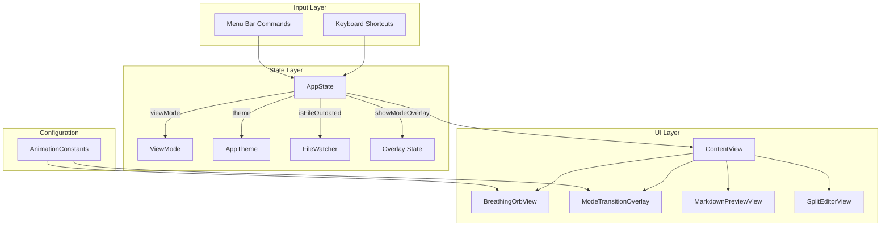
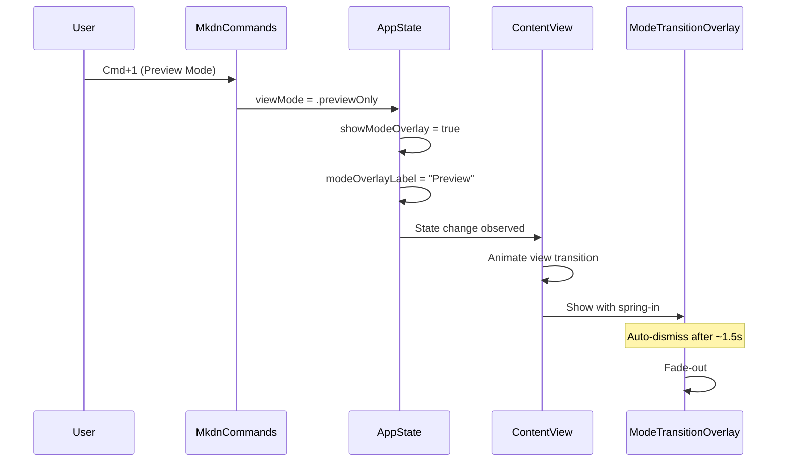
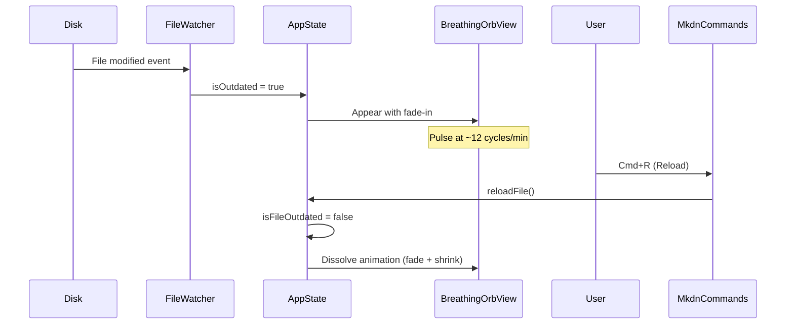

# Design: Controls

**Feature ID**: controls
**Version**: 1.0.0
**Status**: Draft
**Created**: 2026-02-06

## 1. Design Overview

Replace mkdn's toolbar-based interaction model with a chrome-less, keyboard-driven control philosophy. All navigation and actions are driven by keyboard shortcuts and macOS menu bar commands. Visual feedback is delivered through a breathing orb for file-change notification and ephemeral overlays for mode transitions.

### High-Level Architecture



## 2. Architecture

### Component Architecture

The design follows the existing Feature-Based MVVM pattern. No new architectural patterns are introduced. Changes are scoped to the App layer (commands, state) and UI layer (components, overlays).

**Modified Components:**

| Component | Change | Rationale |
|-----------|--------|-----------|
| `AppState` | Add `cycleTheme()`, overlay state properties | Centralizes new state following existing pattern |
| `MkdnCommands` | Add Open, Theme Cycle menu items; refine Reload disable logic | Menu bar becomes primary discoverability surface |
| `ContentView` | Remove `.toolbar`, add overlay layers | Toolbar removal + overlay integration |

**New Components:**

| Component | Location | Purpose |
|-----------|----------|---------|
| `BreathingOrbView` | `mkdn/UI/Components/` | Replaces OutdatedIndicator |
| `ModeTransitionOverlay` | `mkdn/UI/Components/` | Ephemeral mode label overlay |
| `AnimationConstants` | `mkdn/UI/Theme/` | Centralized timing constants |

**Removed/Archived Components:**

| Component | Action | Rationale |
|-----------|--------|-----------|
| `ViewModePicker` | Remove from UI hierarchy | Replaced by keyboard shortcuts + menu bar |
| `OutdatedIndicator` | Replace with BreathingOrbView | Text badge replaced by breathing orb |
| `MkdnToolbarContent` | Remove entirely | Toolbar is eliminated |

### Sequence: Mode Switch via Keyboard



### Sequence: File Change and Reload



## 3. Detailed Design

### 3.1 AppState Extensions

Add the following to `AppState`:

```swift
// MARK: - Mode Overlay State

/// Label text for the ephemeral mode transition overlay.
public var modeOverlayLabel: String?

/// Cycle to the next available theme.
public func cycleTheme() {
    let allThemes = AppTheme.allCases
    guard let currentIndex = allThemes.firstIndex(of: theme) else { return }
    let nextIndex = (currentIndex + 1) % allThemes.count
    theme = allThemes[nextIndex]
}

/// Switch view mode and trigger the ephemeral overlay.
public func switchMode(to mode: ViewMode) {
    viewMode = mode
    modeOverlayLabel = mode == .previewOnly ? "Preview" : "Edit"
}
```

The `modeOverlayLabel` property serves double duty: when non-nil, it signals the overlay should be visible and provides the display text. The overlay view is responsible for auto-clearing it after the dismiss delay.

### 3.2 MkdnCommands Expansion

Expand the existing `MkdnCommands` to include all five shortcuts and proper menu grouping:

```swift
public var body: some Commands {
    // File menu: Open, Reload, Save
    CommandGroup(replacing: .saveItem) {
        Button("Save") {
            try? appState.saveFile()
        }
        .keyboardShortcut("s", modifiers: .command)
        .disabled(appState.currentFileURL == nil || !appState.hasUnsavedChanges)
    }

    CommandGroup(after: .importExport) {
        Button("Open...") {
            openFile()
        }
        .keyboardShortcut("o", modifiers: .command)

        Button("Reload") {
            try? appState.reloadFile()
        }
        .keyboardShortcut("r", modifiers: .command)
        .disabled(appState.currentFileURL == nil || !appState.isFileOutdated)
    }

    // View menu: Preview Mode, Edit Mode, Cycle Theme
    CommandGroup(after: .sidebar) {
        Section {
            Button("Preview Mode") {
                appState.switchMode(to: .previewOnly)
            }
            .keyboardShortcut("1", modifiers: .command)

            Button("Edit Mode") {
                appState.switchMode(to: .sideBySide)
            }
            .keyboardShortcut("2", modifiers: .command)
        }

        Section {
            Button("Cycle Theme") {
                withAnimation(AnimationConstants.themeCrossfade) {
                    appState.cycleTheme()
                }
            }
            .keyboardShortcut("t", modifiers: .command)
        }
    }
}
```

**Key changes from current:**
- `Cmd+O` moved from toolbar button to menu command with `openFile()` helper
- `Cmd+T` added for theme cycling
- `Reload` disabled when file is not outdated (was only checking for nil URL)
- Mode switching calls `switchMode(to:)` to trigger overlay
- `Open...` added to File menu group (standard macOS position)

The `openFile()` helper method containing NSOpenPanel logic is extracted into MkdnCommands as a private method (moved from the removed MkdnToolbarContent).

### 3.3 BreathingOrbView

New component replacing `OutdatedIndicator`. Located at `mkdn/UI/Components/BreathingOrbView.swift`.

**Visual Design:**
- Small circle (approximately 10pt diameter) in the bottom-right corner of the content area
- Color: theme accent color (adapts to both Solarized Dark and Light)
- Glow effect via `.shadow(color:radius:)` with animated radius
- Pulse animation: sinusoidal opacity (0.4 to 1.0) and scale (0.85 to 1.0) at ~12 cycles/min (~5 seconds per cycle)
- Appear: fade-in over 0.5s
- Dissolve (on reload): fade-out + scale-down over 0.4s, then removal from hierarchy

**Implementation Approach:**
```swift
struct BreathingOrbView: View {
    @Environment(AppState.self) private var appState
    @State private var isPulsing = false

    var body: some View {
        Circle()
            .fill(appState.theme.colors.accent)
            .frame(width: 10, height: 10)
            .shadow(
                color: appState.theme.colors.accent.opacity(0.6),
                radius: isPulsing ? 8 : 4
            )
            .scaleEffect(isPulsing ? 1.0 : 0.85)
            .opacity(isPulsing ? 1.0 : 0.4)
            .onAppear {
                withAnimation(AnimationConstants.orbPulse) {
                    isPulsing = true
                }
            }
    }
}
```

The pulse uses `.easeInOut(duration: ~2.5).repeatForever(autoreverses: true)` -- driven entirely by SwiftUI's animation system, not manual timers, satisfying NFR-CTRL-003.

**Integration in ContentView:**
The orb is overlaid on the content area using `.overlay(alignment: .bottomTrailing)` with padding, wrapped in a conditional on `appState.isFileOutdated` with a `.transition(.asymmetric(insertion: .opacity, removal: .scale.combined(with: .opacity)))`.

### 3.4 ModeTransitionOverlay

New component at `mkdn/UI/Components/ModeTransitionOverlay.swift`.

**Visual Design:**
- Centered overlay label with the mode name ("Preview" or "Edit")
- Semi-transparent background capsule (using `.ultraThinMaterial`)
- Large, readable font (`.title2` or `.title3`, medium weight)
- Appear: spring animation (scale from 0.8 + opacity from 0)
- Dismiss: smooth fade-out after ~1.5s
- Rapid switching: cancels previous dismiss timer, restarts with new label

**Implementation Approach:**
```swift
struct ModeTransitionOverlay: View {
    let label: String
    let onDismiss: () -> Void

    @State private var isVisible = false

    var body: some View {
        Text(label)
            .font(.title2.weight(.medium))
            .foregroundStyle(.primary)
            .padding(.horizontal, 24)
            .padding(.vertical, 12)
            .background(.ultraThinMaterial)
            .clipShape(RoundedRectangle(cornerRadius: 12))
            .scaleEffect(isVisible ? 1.0 : 0.8)
            .opacity(isVisible ? 1.0 : 0)
            .onAppear {
                withAnimation(AnimationConstants.overlaySpringIn) {
                    isVisible = true
                }
                Task { @MainActor in
                    try? await Task.sleep(for: AnimationConstants.overlayDisplayDuration)
                    withAnimation(AnimationConstants.overlayFadeOut) {
                        isVisible = false
                    }
                    try? await Task.sleep(for: AnimationConstants.overlayFadeOutDuration)
                    onDismiss()
                }
            }
    }
}
```

**Rapid Input Handling:** In ContentView, the overlay is keyed by `modeOverlayLabel` using `.id(appState.modeOverlayLabel)`. When the label changes rapidly, SwiftUI destroys and recreates the overlay view, naturally cancelling the previous dismiss task and starting a fresh one. This avoids stacking or visual artifacts per BR-003.

### 3.5 ContentView Refactor

```swift
public var body: some View {
    ZStack {
        Group {
            if appState.currentFileURL == nil {
                WelcomeView()
            } else {
                switch appState.viewMode {
                case .previewOnly:
                    MarkdownPreviewView()
                        .transition(.opacity)
                case .sideBySide:
                    SplitEditorView()
                        .transition(.move(edge: .leading).combined(with: .opacity))
                }
            }
        }
        .animation(.spring(response: 0.4, dampingFraction: 0.85), value: appState.viewMode)

        // Breathing orb overlay
        if appState.isFileOutdated {
            BreathingOrbView()
                .frame(maxWidth: .infinity, maxHeight: .infinity, alignment: .bottomTrailing)
                .padding(16)
                .transition(
                    .asymmetric(
                        insertion: .opacity.animation(AnimationConstants.orbAppear),
                        removal: .scale(scale: 0.5)
                            .combined(with: .opacity)
                            .animation(AnimationConstants.orbDissolve)
                    )
                )
        }

        // Mode transition overlay
        if let label = appState.modeOverlayLabel {
            ModeTransitionOverlay(label: label) {
                appState.modeOverlayLabel = nil
            }
            .id(label)
        }
    }
    .frame(minWidth: 600, minHeight: 400)
    // NO .toolbar modifier
    .onDrop(of: [.fileURL], isTargeted: nil) { providers in
        handleFileDrop(providers)
    }
}
```

Key changes:
- `.toolbar` block removed entirely
- `MkdnToolbarContent` struct removed
- Content wrapped in `ZStack` for overlay layering
- Breathing orb and mode overlay added as conditional overlays

### 3.6 AnimationConstants

New file at `mkdn/UI/Theme/AnimationConstants.swift`.

```swift
import SwiftUI

/// Centralized animation timing constants for the Controls feature.
/// Single source of truth for all animation tuning.
enum AnimationConstants {
    // MARK: - Breathing Orb

    /// Pulse animation: sinusoidal, ~12 cycles/min = ~5s per full cycle = ~2.5s per half.
    static let orbPulse: Animation = .easeInOut(duration: 2.5).repeatForever(autoreverses: true)

    /// Orb appear fade-in.
    static let orbAppear: Animation = .easeOut(duration: 0.5)

    /// Orb dissolve on reload (fade + shrink).
    static let orbDissolve: Animation = .easeIn(duration: 0.4)

    // MARK: - Mode Transition Overlay

    /// Overlay spring-in animation.
    static let overlaySpringIn: Animation = .spring(response: 0.35, dampingFraction: 0.7)

    /// Overlay fade-out animation.
    static let overlayFadeOut: Animation = .easeOut(duration: 0.3)

    /// How long the overlay remains visible before auto-dismiss.
    static let overlayDisplayDuration: Duration = .milliseconds(1500)

    /// Duration of the fade-out animation (for scheduling cleanup after fade completes).
    static let overlayFadeOutDuration: Duration = .milliseconds(300)

    // MARK: - Theme Crossfade

    /// Crossfade animation for theme transitions.
    static let themeCrossfade: Animation = .easeInOut(duration: 0.35)
}
```

### 3.7 Theme Crossfade

The theme crossfade is implemented at the point of invocation in MkdnCommands via `withAnimation(AnimationConstants.themeCrossfade)` wrapping the `cycleTheme()` call. Because `AppTheme.colors` returns `Color` values used directly in SwiftUI views, and SwiftUI natively interpolates `Color` values during animations, the crossfade works without additional infrastructure. All views reading `appState.theme.colors` will see their colors transition smoothly.

No changes needed to theme files, ThemeColors, or individual views. The `withAnimation` at the mutation site propagates through the entire view hierarchy.

## 4. Technology Stack

No new external dependencies. All implementation uses:

| Technology | Purpose | Already in Project |
|------------|---------|-------------------|
| SwiftUI | All UI components, animations, overlays | Yes |
| Swift Observation | @Observable AppState | Yes |
| AppKit (NSOpenPanel) | File open dialog | Yes |

## 5. Implementation Plan

| # | Component | Description | Files Modified/Created | Est. Effort |
|---|-----------|-------------|----------------------|-------------|
| T1 | AnimationConstants | Centralized timing constants | Create `mkdn/UI/Theme/AnimationConstants.swift` | Small |
| T2 | AppState Extensions | Add `cycleTheme()`, `switchMode(to:)`, `modeOverlayLabel` | Modify `mkdn/App/AppState.swift` | Small |
| T3 | MkdnCommands Expansion | Add Open, Theme Cycle; refine Reload disable; use `switchMode(to:)` | Modify `mkdn/App/MkdnCommands.swift` | Small |
| T4 | BreathingOrbView | New breathing orb component | Create `mkdn/UI/Components/BreathingOrbView.swift` | Medium |
| T5 | ModeTransitionOverlay | New ephemeral overlay component | Create `mkdn/UI/Components/ModeTransitionOverlay.swift` | Medium |
| T6 | ContentView Refactor | Remove toolbar, add overlay layers, integrate orb and overlay | Modify `mkdn/App/ContentView.swift` | Medium |
| T7 | Theme Crossfade | `withAnimation` wrapper in commands (already covered in T3) | (covered by T3) | Trivial |
| T8 | Tests | Unit tests for AppState extensions, AnimationConstants | Create `mkdnTests/Unit/Features/ControlsTests.swift` | Small |

Note: T7 (theme crossfade) is implemented as part of T3 (MkdnCommands) since it is a single `withAnimation` wrapper around the `cycleTheme()` call. No separate component needed.

**Cleanup:**
- Remove `OutdatedIndicator.swift` usage from ContentView (file can be deleted)
- Remove `ViewModePicker.swift` usage from ContentView (file can be deleted)
- Remove `MkdnToolbarContent` struct from ContentView
- `ThemePickerView.swift` can remain (not used in toolbar currently, may be useful elsewhere)

## 6. Implementation DAG

**Parallel Groups** (tasks with no inter-dependencies):

1. [T1, T2] - AnimationConstants and AppState extensions have no data or interface dependencies on each other
2. [T3, T4, T5, T8] - All depend on T1/T2 but not on each other: MkdnCommands calls AppState methods, BreathingOrbView reads AppState and uses AnimationConstants, ModeTransitionOverlay uses AnimationConstants, Tests verify AppState logic
3. [T6] - ContentView refactor integrates all prior components

**Dependencies:**

- T3 -> T2 (interface: commands call `switchMode(to:)` and `cycleTheme()` on AppState)
- T3 -> T1 (data: uses `AnimationConstants.themeCrossfade`)
- T4 -> T1 (data: uses `AnimationConstants.orbPulse`, `orbAppear`)
- T4 -> T2 (interface: reads `appState.isFileOutdated`, `appState.theme.colors.accent`)
- T5 -> T1 (data: uses `AnimationConstants.overlaySpringIn`, `overlayDisplayDuration`, etc.)
- T6 -> [T3, T4, T5] (build: imports and composes all new components)
- T8 -> T2 (interface: tests `cycleTheme()`, `switchMode(to:)`)

**Critical Path:** T2 -> T3 -> T6

## 7. Testing Strategy

### Test Value Assessment

| Test Category | Value | Rationale |
|---------------|-------|-----------|
| AppState.cycleTheme() logic | HIGH | App-specific business logic: theme cycling order |
| AppState.switchMode(to:) logic | HIGH | App-specific: mode + overlay label coordination |
| Reload disable condition | HIGH | Business rule: Reload disabled when file is current |
| AnimationConstants type safety | LOW | Compile-time verification sufficient; no runtime logic |
| SwiftUI animation rendering | AVOID | Framework behavior; verified visually, not via unit tests |
| BreathingOrbView rendering | AVOID | SwiftUI view rendering; visual verification only |

### Test Design

**File:** `mkdnTests/Unit/Features/ControlsTests.swift`

```swift
@Suite("Controls")
struct ControlsTests {
    @Test("cycleTheme toggles from dark to light")
    @MainActor func cycleThemeDarkToLight() { ... }

    @Test("cycleTheme toggles from light to dark")
    @MainActor func cycleThemeLightToDark() { ... }

    @Test("switchMode sets viewMode and overlay label")
    @MainActor func switchModeSetsState() { ... }

    @Test("switchMode to previewOnly sets Preview label")
    @MainActor func switchModePreviewLabel() { ... }

    @Test("switchMode to sideBySide sets Edit label")
    @MainActor func switchModeEditLabel() { ... }

    @Test("isFileOutdated reflects FileWatcher state")
    @MainActor func isFileOutdatedDelegation() { ... }
}
```

**Existing test impact:** `AppStateTests` already covers `viewMode`, `theme`, `reloadFile()`. New tests supplement, not duplicate.

**Manual/Visual Testing Checklist:**
- Breathing orb appears when file changes on disk
- Orb pulse rate feels calming (~12 cycles/min)
- Orb dissolves smoothly on Cmd+R
- Mode overlay appears on Cmd+1/Cmd+2 with spring animation
- Mode overlay auto-dismisses after ~1.5s
- Rapid Cmd+1/Cmd+2 switching does not stack overlays
- Theme crossfade is smooth on Cmd+T
- Menu bar shows all shortcuts with correct key equivalents
- Reload menu item disabled when file is current
- No toolbar visible in window

## 8. Deployment Design

No deployment changes. This feature modifies the existing application binary. No new build targets, schemes, or deployment configurations.

**Build verification:**
```bash
swift build          # Verify compilation
swift test           # Run unit tests
swiftlint lint       # Lint compliance
swiftformat .        # Format compliance
```

## 9. Documentation Impact

| Type | Target | Section | KB Source | Rationale |
|------|--------|---------|-----------|-----------|
| edit | `.rp1/context/modules.md` | UI Components | modules.md:UI-Components | Add BreathingOrbView, ModeTransitionOverlay; remove OutdatedIndicator, ViewModePicker; add AnimationConstants |
| edit | `.rp1/context/modules.md` | App Layer | modules.md:App-Layer | Note MkdnCommands expansion |
| edit | `.rp1/context/architecture.md` | System Overview | architecture.md:System-Overview | Remove toolbar from ASCII diagram; add overlay layer |
| edit | `.rp1/context/patterns.md` | (new section) | patterns.md | Add Animation Constants pattern |

## 10. Design Decisions Log

See [design-decisions.md](design-decisions.md) for the full decision log.

| ID | Decision | Choice |
|----|----------|--------|
| D1 | Overlay state management | `modeOverlayLabel: String?` on AppState |
| D2 | Rapid input handling | SwiftUI `.id()` keying for natural view lifecycle |
| D3 | Orb animation driver | SwiftUI `.animation()` with `.repeatForever()` |
| D4 | Theme crossfade approach | `withAnimation` at mutation site in MkdnCommands |
| D5 | Orb color | Theme accent color (adaptive) |
| D6 | Orb position | Bottom-right corner with padding |
| D7 | Animation constants location | `mkdn/UI/Theme/AnimationConstants.swift` |
| D8 | Open file logic | Moved from toolbar to MkdnCommands |
