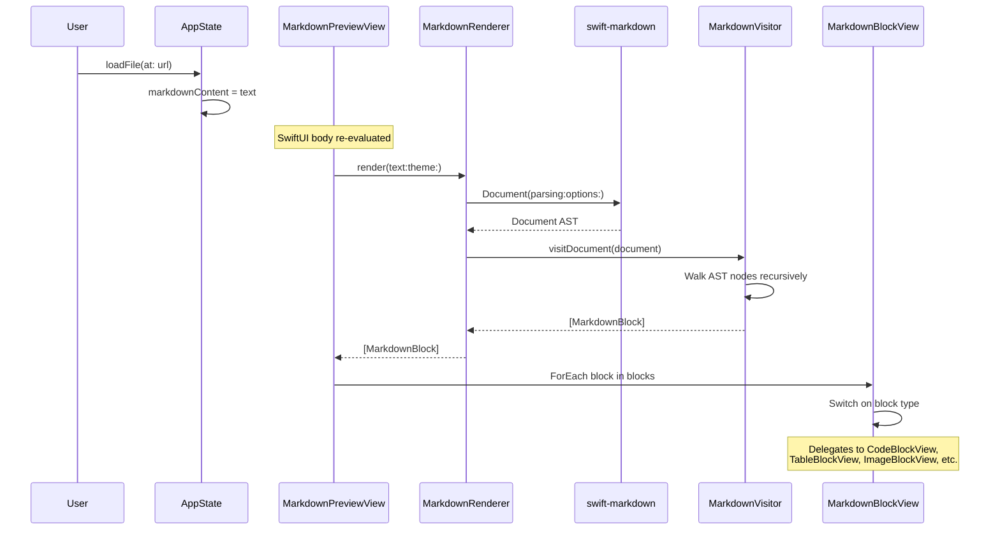

# Technical Design: Core Markdown Rendering

**Feature ID**: core-markdown-rendering
**Version**: 1.0.0
**Status**: Draft
**Created**: 2026-02-06

## 1. Design Overview

This design extends the existing Markdown rendering pipeline in mkdn to achieve complete coverage of all standard CommonMark block and inline types, with GFM table and strikethrough support, image display, link interaction, and full theming integration. The approach follows the established architecture: extend the model, extend the visitor, extend the views.

The existing codebase already contains a working skeleton of the entire pipeline (MarkdownBlock, MarkdownVisitor, MarkdownBlockView, CodeBlockView, TableBlockView). This design fills the identified gaps rather than replacing any existing component.

### High-Level Architecture

```mermaid
graph TB
    subgraph Input
        MD[Raw Markdown Text]
    end

    subgraph "Core/Markdown"
        MR[MarkdownRenderer<br/>Static Coordinator]
        MV[MarkdownVisitor<br/>AST Walker]
        MB[MarkdownBlock<br/>Typed Model Enum]
    end

    subgraph "External"
        SWM[apple/swift-markdown<br/>AST Parser]
        SPL[Splash<br/>Syntax Highlighter]
    end

    subgraph "Features/Viewer/Views"
        MPV[MarkdownPreviewView<br/>ScrollView + LazyVStack]
        MBV[MarkdownBlockView<br/>Block Dispatcher]
        CBV[CodeBlockView]
        TBV[TableBlockView]
        IBV[ImageBlockView<br/>NEW]
    end

    subgraph "UI/Theme"
        AT[AppTheme Enum]
        TC[ThemeColors Struct]
        SC[SyntaxColors Struct]
    end

    subgraph "App"
        AS[AppState<br/>@Observable @MainActor]
    end

    MD --> MR
    MR --> SWM
    SWM -->|Document AST| MV
    MV -->|"[MarkdownBlock]"| MB
    MB --> MPV
    MPV --> MBV
    MBV --> CBV
    MBV --> TBV
    MBV --> IBV
    CBV --> SPL
    AS -->|theme| AT
    AT --> TC
    AT --> SC
    TC --> MBV
    TC --> CBV
    TC --> TBV
    TC --> IBV
    SC --> CBV
```

## 2. Architecture

### 2.1 Pipeline Flow

The rendering pipeline is strictly unidirectional and stateless:

```
Raw Markdown String
  -> MarkdownRenderer.render(text:theme:)
    -> Document(parsing:options:)          [swift-markdown]
      -> MarkdownVisitor.visitDocument()   [AST -> Model]
        -> [MarkdownBlock]                 [Typed Model Array]
          -> MarkdownPreviewView           [SwiftUI View Tree]
```

No caching layer is introduced at this stage. The pipeline re-runs on every content or theme change. The LazyVStack in MarkdownPreviewView provides view-level virtualization, and swift-markdown parsing is fast enough for the < 100ms target on typical documents (< 500 lines).

### 2.2 Component Responsibilities

| Component | Layer | Responsibility |
|-----------|-------|----------------|
| MarkdownRenderer | Core/Markdown | Static coordinator: parse + visit in a single call |
| MarkdownVisitor | Core/Markdown | Walk AST, produce [MarkdownBlock]. Stateless struct. |
| MarkdownBlock | Core/Markdown | Typed enum modeling all block variants with associated data |
| ListItem | Core/Markdown | Child container for list items, holds [MarkdownBlock] |
| MarkdownPreviewView | Features/Viewer | Top-level ScrollView, iterates blocks via LazyVStack |
| MarkdownBlockView | Features/Viewer | Switch dispatcher: routes each MarkdownBlock case to a sub-view |
| CodeBlockView | Features/Viewer | Syntax-highlighted code with Splash, language label |
| TableBlockView | Features/Viewer | Grid table with alignment, header styling, row striping |
| ImageBlockView | Features/Viewer | **NEW** -- async image loading with placeholder/error states |
| PreviewViewModel | Features/Viewer | @Observable ViewModel managing blocks + theme (existing, unused by MarkdownPreviewView directly -- design note below) |

**Design Note on PreviewViewModel**: The existing `MarkdownPreviewView` calls `MarkdownRenderer.render()` directly in its `body` rather than going through `PreviewViewModel`. This is intentional for simplicity -- the pipeline is stateless and fast. `PreviewViewModel` exists for the editor's live-preview use case (SplitEditorView). This design preserves that pattern.

### 2.3 Sequence: Rendering a Document



## 3. Detailed Design

### 3.1 Model Changes: MarkdownBlock

**File**: `mkdn/Core/Markdown/MarkdownBlock.swift`

Extend the existing enum with the following changes:

| Change | Current | Proposed |
|--------|---------|----------|
| Add image case | N/A | `.image(source: String, alt: String)` |
| Add htmlBlock case | N/A (silently dropped) | `.htmlBlock(content: String)` -- rendered as raw monospace text per BR-005 |
| Enrich table case | `.table(headers: [String], rows: [[String]])` | `.table(columns: [TableColumn], rows: [[AttributedString]])` |
| Improve ID stability | Uses `UUID()` for thematicBreak, `.hashValue` for others | Use deterministic content-based hashing with index fallback |

**New supporting types**:

```swift
/// Column definition for a Markdown table.
struct TableColumn: Sendable {
    let header: AttributedString
    let alignment: TableColumnAlignment
}

/// Column alignment matching Markdown table syntax.
enum TableColumnAlignment: Sendable {
    case left
    case center
    case right
}
```

**ListItem**: No model changes needed. Nesting depth is tracked via the view hierarchy (recursive MarkdownBlockView calls), not the model. This keeps the model flat and simple.

### 3.2 Model Changes: MarkdownBlock.id

Replace the current ID computation with a stable, deterministic scheme:

```swift
var id: String {
    switch self {
    case let .heading(level, text):
        "heading-\(level)-\(stableHash(String(text.characters)))"
    case let .paragraph(text):
        "paragraph-\(stableHash(String(text.characters)))"
    case let .codeBlock(language, code):
        "code-\(language ?? "none")-\(stableHash(code))"
    case let .mermaidBlock(code):
        "mermaid-\(stableHash(code))"
    case let .blockquote(blocks):
        "blockquote-\(blocks.map(\.id).joined(separator: "-"))"
    case let .orderedList(items):
        "ol-\(items.count)-\(stableHash(items.map { $0.blocks.first?.id ?? "" }.joined()))"
    case let .unorderedList(items):
        "ul-\(items.count)-\(stableHash(items.map { $0.blocks.first?.id ?? "" }.joined()))"
    case .thematicBreak:
        "hr"  // Note: multiple thematic breaks need index-based disambiguation at the container level
    case let .table(columns, _):
        "table-\(stableHash(columns.map { String($0.header.characters) }.joined()))"
    case let .image(source, _):
        "image-\(stableHash(source))"
    case let .htmlBlock(content):
        "html-\(stableHash(content))"
    }
}
```

Use a simple deterministic hash helper (DJB2 or similar) instead of `.hashValue` which is not stable across runs.

**Thematic break disambiguation**: When multiple thematic breaks exist in a document, the ForEach loop should use `enumerated()` to provide index-based uniqueness. Alternatively, accept that consecutive thematic breaks are visually identical and the performance impact of duplicate IDs is negligible.

### 3.3 Visitor Changes: MarkdownVisitor

**File**: `mkdn/Core/Markdown/MarkdownVisitor.swift`

| Change | Detail |
|--------|--------|
| Enable GFM parsing | Pass `options` to `Document(parsing:options:)` including `.parseBlockDirectives` or handle Table/Strikethrough GFM nodes which swift-markdown supports natively |
| Handle Image nodes | `case let image as Markdown.Image` -> `.image(source:alt:)` |
| Handle Strikethrough | `case let strikethrough as Strikethrough` -> apply `.strikethrough` attribute |
| Handle HTMLBlock | `case let html as HTMLBlock` -> `.htmlBlock(content: html.rawHTML)` |
| Enrich table conversion | Extract column alignment from `table.columnAlignments`, use `AttributedString` for cell content |
| Combined inline formatting | Use bitwise OR for `inlinePresentationIntent` to support bold+italic combinations |

**Strikethrough inline handling**:

```swift
case let strikethrough as Strikethrough:
    var result = inlineText(from: strikethrough)
    result.strikethroughStyle = .single
    return result
```

**Combined formatting** (bold + italic):

The current visitor overwrites `inlinePresentationIntent` on nested formatting. For example, `***bold italic***` parses as Strong > Emphasis > Text. The visitor must OR the intents:

```swift
case let strong as Strong:
    var result = inlineText(from: strong)
    let existing = result.inlinePresentationIntent ?? []
    result.inlinePresentationIntent = existing.union(.stronglyEmphasized)
    return result
```

**Table alignment extraction**:

```swift
private func convertTable(_ table: Markdown.Table) -> MarkdownBlock {
    let columns: [TableColumn] = table.head.cells.enumerated().map { index, cell in
        let alignment: TableColumnAlignment = if index < table.columnAlignments.count {
            switch table.columnAlignments[index] {
            case .center: .center
            case .right: .right
            default: .left
            }
        } else {
            .left
        }
        return TableColumn(header: inlineText(from: cell), alignment: alignment)
    }
    let rows: [[AttributedString]] = table.body.rows.map { row in
        row.cells.map { inlineText(from: $0) }
    }
    return .table(columns: columns, rows: rows)
}
```

### 3.4 View Changes: MarkdownBlockView

**File**: `mkdn/Features/Viewer/Views/MarkdownBlockView.swift`

| Change | Detail |
|--------|--------|
| Add image case | Route `.image` to new `ImageBlockView` |
| Add htmlBlock case | Render as monospace text block (similar to code block, no highlighting) |
| Add depth parameter | Accept optional `depth: Int` parameter for nested list bullet differentiation |
| Enhance list views | Pass incrementing depth to recursive MarkdownBlockView calls |

**Depth-aware unordered list bullets**:

```swift
private static let bulletStyles: [String] = [
    "\u{2022}",  // bullet (level 0)
    "\u{25E6}",  // white bullet (level 1)
    "\u{25AA}",  // small black square (level 2)
    "\u{25AB}",  // small white square (level 3+)
]
```

**Depth parameter threading**: `MarkdownBlockView` gains a `depth: Int = 0` parameter. When rendering list items, it passes `depth + 1` to child `MarkdownBlockView` instances. This keeps the model clean (no depth in MarkdownBlock) while enabling visual differentiation.

### 3.5 New View: ImageBlockView

**File**: `mkdn/Features/Viewer/Views/ImageBlockView.swift`

Handles both remote URLs and local file paths.

```swift
struct ImageBlockView: View {
    let source: String
    let alt: String

    @Environment(AppState.self) private var appState
    @State private var loadedImage: NSImage?
    @State private var loadError: Bool = false
    @State private var isLoading: Bool = true

    var body: some View {
        Group {
            if isLoading {
                loadingPlaceholder
            } else if let image = loadedImage {
                imageContent(image)
            } else {
                errorPlaceholder
            }
        }
        .task { await loadImage() }
    }
}
```

**Loading strategy**:

1. Parse `source` as URL
2. If scheme is `file://` or no scheme (relative path): load via `NSImage(contentsOf:)` on a background task
3. If scheme is `http://` or `https://`: load via `URLSession.shared.data(from:)`
4. Timeout: 10 seconds for remote images
5. On failure: display placeholder with alt text and broken-image icon (per BR-002)

**Security (NFR-004)**: For local file paths, resolve against the directory of the currently open Markdown file (from `AppState.currentFileURL`). Validate that the resolved path does not escape the file's parent directory tree using `standardizedFileURL` and prefix checking. If it does, treat as a loading failure.

**Why not AsyncImage**: AsyncImage is designed for network URLs and does not support local file paths reliably on macOS. Using NSImage directly provides consistent behavior for both local and remote sources.

### 3.6 View Changes: TableBlockView

**File**: `mkdn/Features/Viewer/Views/TableBlockView.swift`

| Change | Detail |
|--------|--------|
| Accept new model | `columns: [TableColumn], rows: [[AttributedString]]` instead of `headers: [String], rows: [[String]]` |
| Column alignment | Apply `.leading`, `.center`, `.trailing` frame alignment per column |
| AttributedString cells | Use `Text(attributedString)` for cells, enabling inline formatting in tables |
| Preserve row striping | Already implemented -- no change |

### 3.7 View Changes: CodeBlockView

**File**: `mkdn/Features/Viewer/Views/CodeBlockView.swift`

| Change | Detail |
|--------|--------|
| Multi-language graceful fallback | Remove the hardcoded `language == "swift"` guard. Attempt Splash highlighting for any language string. Splash internally returns plain text for unsupported grammars. |
| Language label for unknown | Always show language label if present, even if highlighting falls back to plain |

**Splash grammar note**: Splash's `SyntaxHighlighter` uses `SwiftGrammar` by default. For non-Swift languages, we should detect this and fall back to plain monospace with theme colors (per BR-001). Splash does not have built-in grammars for Python, JavaScript, etc. The design is:

1. If `language == "swift"` (or nil/empty -> no highlighting): use Splash with SwiftGrammar
2. For all other languages: render as plain monospace with `codeForeground` color
3. Always display the language label

This matches the current behavior but makes it explicit and removes the appearance that only Swift is intentionally supported.

### 3.8 Link Handling

**Verification needed (HYP-001)**: SwiftUI's `Text` view with `AttributedString` containing `.link` attributes should automatically make links tappable, using the environment's `openURL` action which defaults to `NSWorkspace.shared.open()`.

**Design if hypothesis confirms**: No additional work needed. Links rendered via `Text(attributedString)` where the AttributedString has `.link` set will be interactive. Style the link text with `linkColor` from the theme by setting `.foregroundColor` on the link run in the visitor.

**Design if hypothesis rejects**: Wrap link text in a `Button` or use `Link` view. This would require the visitor to produce a richer inline model that separates link runs. Fallback: use `.onTapGesture` with `NSWorkspace.shared.open()`.

**Link styling in visitor**: Currently, the visitor sets `.link` on the AttributedString but does not set a foreground color for links. Add:

```swift
case let link as Markdown.Link:
    var result = inlineText(from: link)
    if let destination = link.destination, let url = URL(string: destination) {
        result.link = url
        result.foregroundColor = theme.colors.linkColor
        result.underlineStyle = .single
    }
    return result
```

This requires the visitor to access `theme.colors`, which it already receives via `self.theme`.

### 3.9 Parsing Options

**File**: `mkdn/Core/Markdown/MarkdownRenderer.swift`

Update the `parse` method to enable GFM extensions:

```swift
static func parse(_ text: String) -> Document {
    Document(parsing: text, options: [.parseBlockDirectives])
}
```

Note: swift-markdown's `Document` parser supports GFM tables and strikethrough natively without explicit options for those -- they are part of the default CommonMark+ parsing. The `.parseBlockDirectives` option is not needed for GFM. Verify during implementation whether `Strikethrough` nodes appear in the AST with default parsing options.

## 4. Technology Stack

All technologies are already in the project. No new dependencies.

| Technology | Version | Purpose | Status |
|------------|---------|---------|--------|
| Swift 6 | 6.0 | Language | Existing |
| SwiftUI | macOS 14+ | View framework | Existing |
| apple/swift-markdown | >= 0.5.0 | Markdown parsing | Existing dependency |
| JohnSundell/Splash | >= 0.9.0 | Swift syntax highlighting | Existing dependency |
| @Observable macro | macOS 14+ | State management | Existing pattern |
| Swift Testing | Xcode 16+ | Unit testing | Existing pattern |

## 5. Implementation Plan

### T1: Extend MarkdownBlock Model

- Add `.image(source: String, alt: String)` case
- Add `.htmlBlock(content: String)` case
- Replace `.table(headers:rows:)` with `.table(columns: [TableColumn], rows: [[AttributedString]])`
- Add `TableColumn` and `TableColumnAlignment` types
- Fix ID computation for stability (deterministic hashing)
- Update `ListItem` if needed (no changes expected)

### T2: Extend ThemeColors

- Review existing properties against all block types
- Add any missing properties (current ThemeColors appears complete for all planned blocks)
- Verify `linkColor` has underline style support at the view level

### T3: Extend MarkdownVisitor

- Handle `Image` AST node -> `.image(source:alt:)`
- Handle `Strikethrough` inline node -> `.strikethroughStyle`
- Handle `HTMLBlock` AST node -> `.htmlBlock(content:)`
- Enrich `convertTable()` with column alignment extraction and `AttributedString` cells
- Fix combined inline formatting (bitwise OR for `inlinePresentationIntent`)
- Add link styling (foregroundColor + underlineStyle) to link inline conversion
- Verify GFM parsing options for strikethrough support

### T4: Create ImageBlockView

- New file: `mkdn/Features/Viewer/Views/ImageBlockView.swift`
- Async image loading (local file + remote URL)
- Loading placeholder, error placeholder with alt text
- Path security validation for local files (NFR-004)
- Responsive sizing within document flow

### T5: Enhance CodeBlockView

- Clarify Swift-only highlighting logic (make explicit, not a bug)
- Ensure language label always displays when language is specified
- Verify graceful fallback for all non-Swift languages (plain monospace, themed colors)

### T6: Enhance TableBlockView

- Accept new `columns: [TableColumn], rows: [[AttributedString]]` signature
- Implement column alignment (`.leading`, `.center`, `.trailing`)
- Render cells as `Text(attributedString)` for inline formatting support
- Preserve existing row striping and header styling

### T7: Enhance List Rendering

- Add `depth: Int` parameter to `MarkdownBlockView`
- Implement depth-aware bullet styles for unordered lists (4 levels)
- Implement depth-aware indentation (progressive left padding)
- Pass `depth + 1` to recursive child views

### T8: Verify Link Click Handling

- Test that `Text(attributedString)` with `.link` attribute enables clickable links
- Verify links open via system default browser (NSWorkspace.shared.open)
- If not working: implement manual link handling via Button/Link view
- Style links with `linkColor` and underline via the visitor

### T9: (Merged into T1) -- MarkdownBlock ID Stability

### T10: Extend Test Suite

- New tests for image block parsing (visitor produces `.image`)
- New tests for strikethrough inline formatting
- New tests for table column alignment extraction
- New tests for combined inline formatting (bold+italic)
- New tests for HTML block handling (visitor produces `.htmlBlock`)
- New tests for link attribute preservation
- New tests for nested list depth (4 levels produce correct structure)
- New tests for empty/malformed inputs edge cases

## 6. Implementation DAG

**Parallel Groups** (tasks with no inter-dependencies):

1. **[T1, T2, T5, T7, T8]** -- T1 is model changes, T2 is theme review, T5 is CodeBlockView clarification (no model change), T7 is view-level depth parameter (no model change), T8 is link verification/investigation
2. **[T3, T4, T6]** -- T3 depends on T1 (visitor produces new model types), T4 depends on T1 (new ImageBlockView for new .image case), T6 depends on T1 (TableBlockView consumes new table model)
3. **[T10]** -- Tests depend on T1 and T3 at minimum; best written after all functional changes

**Dependencies**:

- T3 -> T1 (Interface: visitor must produce the new MarkdownBlock cases defined in T1)
- T4 -> T1 (Interface: ImageBlockView renders the .image case defined in T1)
- T6 -> T1 (Interface: TableBlockView consumes TableColumn/AttributedString defined in T1)
- T10 -> [T1, T3] (Data: tests exercise the model and visitor together)

**Critical Path**: T1 -> T3 -> T10

## 7. Testing Strategy

### Test Value Assessment

| Valuable (design tests for) | Avoid (do NOT test) |
|-----------------------------|---------------------|
| Visitor produces correct MarkdownBlock for each AST node type | swift-markdown parsing correctness |
| Combined inline formatting preserves all styles | Splash tokenizer behavior for Swift grammar |
| Table alignment extraction maps correctly | SwiftUI Text rendering of AttributedString |
| Image source/alt extraction from AST | URLSession/NSImage loading behavior |
| HTML block captured as raw content | SwiftUI openURL environment action |
| Nested list structure preserved at 4 levels | SwiftUI LazyVStack performance |
| Link URL and styling preserved in AttributedString | NSWorkspace.shared.open behavior |
| Strikethrough attribute applied correctly | Swift-markdown Document parsing internals |
| Deterministic block IDs for identical input | - |
| Theme switching produces different colors (existing) | - |

### Test Organization

All tests in `mkdnTests/Unit/Core/`:

| File | Suite | Tests |
|------|-------|-------|
| MarkdownRendererTests.swift | `MarkdownRenderer` | Existing tests + new block type coverage |
| MarkdownVisitorTests.swift | `MarkdownVisitor` **(NEW)** | Targeted visitor tests for inline formatting, table alignment, image/HTML extraction |

**Why a separate MarkdownVisitorTests**: The existing MarkdownRendererTests test through the `MarkdownRenderer.render()` convenience API, which is appropriate for integration-level block parsing tests. A dedicated `MarkdownVisitorTests` suite enables focused testing of inline formatting composition, attribute preservation, and edge cases that are harder to verify through the full render pipeline.

### Test Patterns

Following existing patterns from `MarkdownRendererTests.swift`:

```swift
@Suite("MarkdownVisitor")
struct MarkdownVisitorTests {
    @Test("Strikethrough text has strikethrough attribute")
    func parsesStrikethrough() {
        let blocks = MarkdownRenderer.render(
            text: "~~deleted~~",
            theme: .solarizedDark
        )
        guard case let .paragraph(text) = blocks.first else {
            Issue.record("Expected a paragraph block")
            return
        }
        // Verify strikethrough attribute on the attributed string
        #expect(text.runs.contains { $0.strikethroughStyle == .single })
    }
}
```

## 8. Deployment Design

No special deployment considerations. This feature modifies existing library code within `mkdnLib` and adds one new view file (`ImageBlockView.swift`). All changes are within the existing SPM target structure.

| Aspect | Detail |
|--------|--------|
| Target | `mkdnLib` (library target) |
| New files | `mkdn/Features/Viewer/Views/ImageBlockView.swift` |
| Modified files | `MarkdownBlock.swift`, `MarkdownVisitor.swift`, `MarkdownRenderer.swift`, `MarkdownBlockView.swift`, `CodeBlockView.swift`, `TableBlockView.swift` |
| Test files | `MarkdownRendererTests.swift` (extend), `MarkdownVisitorTests.swift` (new) |
| New dependencies | None |
| Build verification | `swift build` + `swift test` + `swiftlint lint` + `swiftformat .` |
| Migration | None -- no persisted data, no API consumers outside the app |

## 9. Documentation Impact

| Type | Target | Section | KB Source | Rationale |
|------|--------|---------|-----------|-----------|
| edit | `.rp1/context/modules.md` | Core/Markdown, Features/Viewer | modules.md:Core Layer | Add ImageBlockView, MarkdownVisitorTests to module inventory |
| edit | `.rp1/context/architecture.md` | Rendering Pipeline > Markdown | architecture.md:Rendering Pipeline | Update pipeline description to include image loading and GFM extensions |
| edit | `.rp1/context/concept_map.md` | Block Elements | concept_map.md:Domain Concepts | Add Image block, HTML Block to concept tree; add Strikethrough to Inline Elements |
| edit | `.rp1/context/patterns.md` | (no change expected) | patterns.md | Patterns remain the same; no new architectural patterns introduced |

## 10. Design Decisions Log

See [design-decisions.md](./design-decisions.md) for the full decision log.

Key decisions summarized:

| ID | Decision | Choice |
|----|----------|--------|
| D1 | Image loading approach | NSImage direct loading (not AsyncImage) |
| D2 | Nested list depth tracking | View parameter, not model property |
| D3 | Table model enrichment | AttributedString cells + TableColumn with alignment |
| D4 | Multi-language syntax highlighting | Swift-only via Splash; others plain monospace |
| D5 | Link interaction mechanism | AttributedString .link attribute + SwiftUI openURL |
| D6 | HTML block handling | Render as raw monospace text |
| D7 | Caching strategy | None for MVP; stateless re-render |
| D8 | MarkdownBlock ID scheme | Deterministic content-based hashing |
