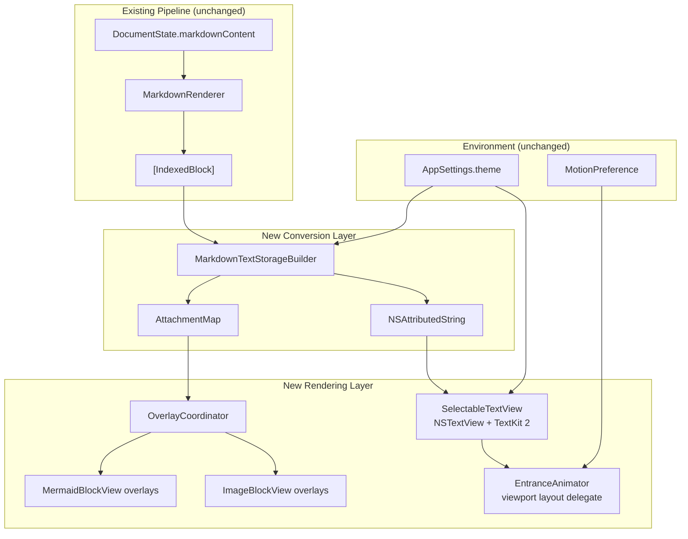
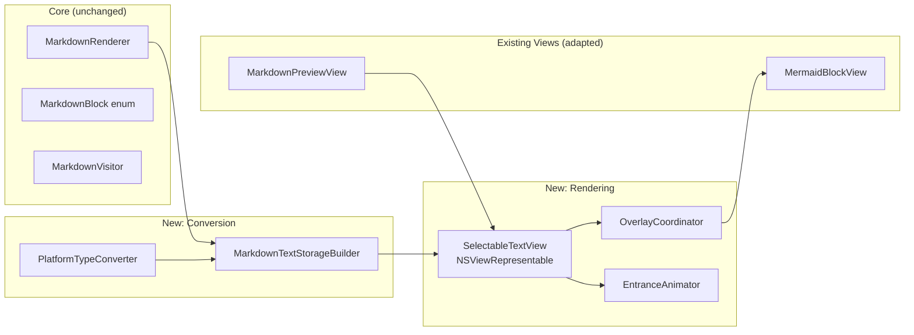
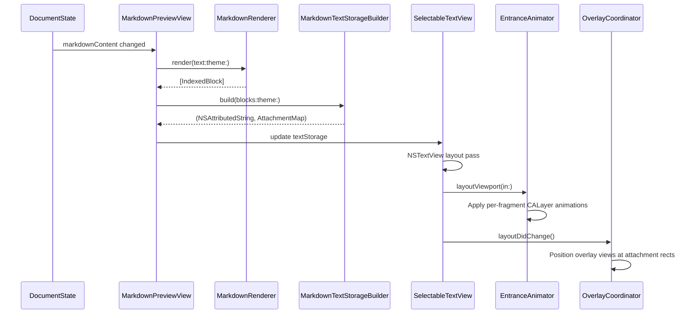
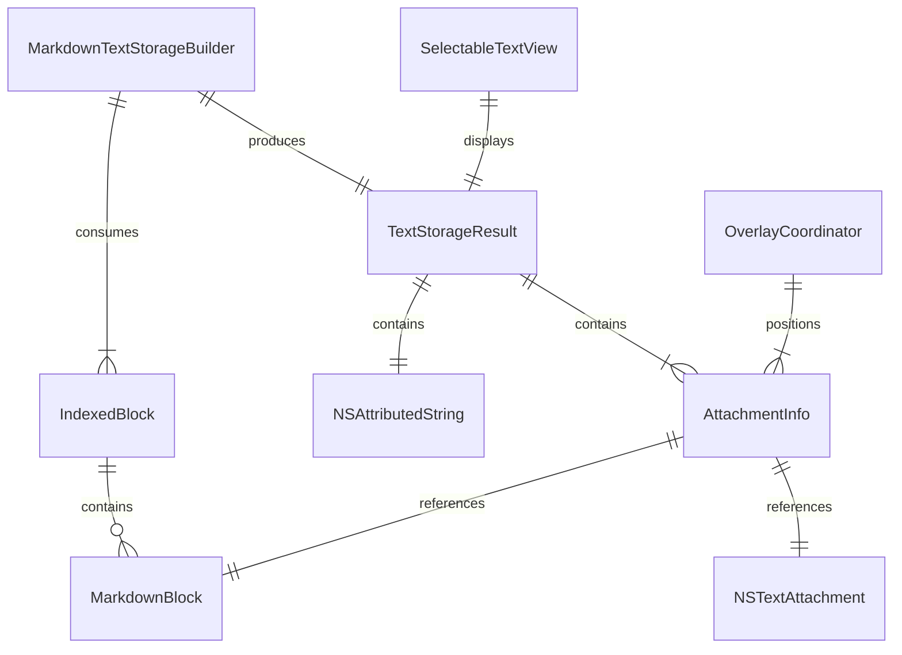

# Design: Cross-Element Selection

**Feature ID**: cross-element-selection
**Version**: 1.0.0
**Status**: Draft
**Created**: 2026-02-08

## 1. Design Overview

This feature replaces the preview pane's rendering layer from independent SwiftUI `Text` views (each with `.textSelection(.enabled)`) to a single `NSTextView` backed by TextKit 2 (`NSTextLayoutManager`). This architectural shift unifies all text blocks into one selectable text container, enabling native cross-block click-drag selection, Shift-click extension, Cmd+A select-all, and Cmd+C plain-text copy.

Non-text elements (Mermaid diagrams, images) are rendered as SwiftUI overlay views positioned at coordinates determined by `NSTextAttachment` placeholders in the text flow. The staggered entrance animation is reproduced using `NSTextViewportLayoutController`'s delegate to apply per-layout-fragment `CALayer` animations.

The existing rendering pipeline (`MarkdownRenderer` -> `[IndexedBlock]`) is preserved. A new conversion layer translates `[IndexedBlock]` into an `NSAttributedString` for the text view.



## 2. Architecture

### 2.1 Component Architecture

The new preview architecture introduces four new components layered atop the existing rendering pipeline:



### 2.2 Layer Responsibilities

| Layer | Component | Responsibility |
|-------|-----------|----------------|
| Conversion | `PlatformTypeConverter` | SwiftUI `Color` -> `NSColor`, SwiftUI Font specs -> `NSFont`, paragraph style creation |
| Conversion | `MarkdownTextStorageBuilder` | `[IndexedBlock]` -> `NSAttributedString` with attachment placeholders |
| Rendering | `SelectableTextView` | `NSViewRepresentable` wrapping `NSTextView` with TextKit 2, scroll container, selection theming |
| Rendering | `OverlayCoordinator` | Positions `NSHostingView` overlays at attachment rects from text layout |
| Rendering | `EntranceAnimator` | Per-layout-fragment `CALayer` opacity+transform animation via viewport layout delegate |
| Integration | `MarkdownPreviewView` | Orchestrates the new components, wires environment state |

### 2.3 Sequence: Document Load



## 3. Detailed Design

### 3.1 PlatformTypeConverter

A utility enum providing static methods to convert between SwiftUI types and AppKit platform types. No state, pure functions.

**Location**: `mkdn/Core/Markdown/PlatformTypeConverter.swift`

```swift
enum PlatformTypeConverter {
    // Color conversion
    static func nsColor(from color: Color) -> NSColor

    // Font conversion for each block type
    static func headingFont(level: Int) -> NSFont
    static func bodyFont() -> NSFont
    static func monospacedFont() -> NSFont
    static func captionMonospacedFont() -> NSFont

    // Paragraph style construction
    static func paragraphStyle(
        lineSpacing: CGFloat,
        paragraphSpacing: CGFloat,
        alignment: NSTextAlignment
    ) -> NSParagraphStyle
}
```

Font mapping mirrors current SwiftUI specifications exactly:

| Block Type | SwiftUI Font | NSFont Equivalent |
|------------|-------------|-------------------|
| H1 | `.system(size: 28, weight: .bold)` | `NSFont.systemFont(ofSize: 28, weight: .bold)` |
| H2 | `.system(size: 24, weight: .bold)` | `NSFont.systemFont(ofSize: 24, weight: .bold)` |
| H3 | `.system(size: 20, weight: .semibold)` | `NSFont.systemFont(ofSize: 20, weight: .semibold)` |
| H4 | `.system(size: 18, weight: .semibold)` | `NSFont.systemFont(ofSize: 18, weight: .semibold)` |
| H5 | `.system(size: 16, weight: .medium)` | `NSFont.systemFont(ofSize: 16, weight: .medium)` |
| H6 | `.system(size: 14, weight: .medium)` | `NSFont.systemFont(ofSize: 14, weight: .medium)` |
| Body | `.body` | `NSFont.preferredFont(forTextStyle: .body)` |
| Code | `.system(.body, design: .monospaced)` | `NSFont.monospacedSystemFont(ofSize: NSFont.systemFontSize, weight: .regular)` |
| Code label | `.caption.monospaced()` | `NSFont.monospacedSystemFont(ofSize: NSFont.smallSystemFontSize, weight: .regular)` |

### 3.2 MarkdownTextStorageBuilder

Converts an array of `IndexedBlock` into a single `NSAttributedString` suitable for an `NSTextView`, plus a mapping of attachment positions to their source block data.

**Location**: `mkdn/Core/Markdown/MarkdownTextStorageBuilder.swift`

```swift
struct AttachmentInfo {
    let blockIndex: Int
    let block: MarkdownBlock
    let attachment: NSTextAttachment
}

struct TextStorageResult {
    let attributedString: NSAttributedString
    let attachments: [AttachmentInfo]
}

enum MarkdownTextStorageBuilder {
    static func build(
        blocks: [IndexedBlock],
        theme: AppTheme
    ) -> TextStorageResult
}
```

**Block-to-attributed-string mapping:**

| Block Type | NSAttributedString Strategy |
|------------|----------------------------|
| `.heading` | Font from PlatformTypeConverter, heading color, paragraph spacing above |
| `.paragraph` | Body font, foreground color, standard paragraph style |
| `.codeBlock` | Monospaced font, code colors. Background via paragraph-level background attribute. Language label as a separate run above the code text. |
| `.mermaidBlock` | `NSTextAttachment` placeholder with estimated height. Actual view overlaid. |
| `.blockquote` | Indented paragraph style (`.headIndent`, `.firstLineHeadIndent`), blockquote border color as left rule (drawn by custom `NSLayoutManager` delegate or inline attachment). |
| `.orderedList` | Paragraph style with `.textLists` or manual indent + number prefix text runs |
| `.unorderedList` | Paragraph style with `.textLists` or manual indent + bullet prefix text runs |
| `.thematicBreak` | `NSTextAttachment` for horizontal rule (small height placeholder with custom drawing) |
| `.table` | Rendered as text with tab stops for column alignment, or `NSTextAttachment` overlay for complex tables |
| `.image` | `NSTextAttachment` placeholder; actual image loaded asynchronously and positioned as overlay |
| `.htmlBlock` | Monospaced font, code-style background, same as code block treatment |

**Block separation**: Each block is separated by `\n` with paragraph spacing attributes rather than multiple newlines, ensuring selection across blocks produces clean plain text.

**Inline style mapping**: The existing `AttributedString` produced by `MarkdownVisitor` for inline content (bold, italic, code, links, strikethrough) is converted to `NSAttributedString` via `NSAttributedString(attributedString)` initializer, then has font/color attributes applied as an overlay.

### 3.3 SelectableTextView

An `NSViewRepresentable` that wraps an `NSTextView` configured with TextKit 2.

**Location**: `mkdn/Features/Viewer/Views/SelectableTextView.swift`

```swift
struct SelectableTextView: NSViewRepresentable {
    let attributedText: NSAttributedString
    let attachments: [AttachmentInfo]
    let theme: AppTheme
    let isFullReload: Bool
    let reduceMotion: Bool

    func makeNSView(context: Context) -> NSScrollView
    func updateNSView(_ scrollView: NSScrollView, context: Context)
    func makeCoordinator() -> Coordinator
}
```

**NSTextView configuration:**

| Property | Value | Rationale |
|----------|-------|-----------|
| `isEditable` | `false` | Preview-only; no editing |
| `isSelectable` | `true` | Core feature |
| `drawsBackground` | `true` | Theme background color |
| `backgroundColor` | Theme `.background` as `NSColor` | Theme integration |
| `textContainerInset` | `NSSize(width: 24, height: 24)` | Match current `.padding(24)` |
| `usesFontPanel` | `false` | No font panel in preview |
| `usesRuler` | `false` | No ruler in preview |
| `allowsUndo` | `false` | Read-only |
| `isAutomaticLinkDetectionEnabled` | `false` | Links already styled by visitor |
| `selectedTextAttributes` | Themed selection color | FR-006 |

**TextKit 2 setup**: The `NSTextView` is configured with `NSTextLayoutManager` (TextKit 2 default on macOS 14+). The `textViewportLayoutController.delegate` is set to the `Coordinator` for entrance animation control.

**Selection theming**: `selectedTextAttributes` dictionary with:
- `.backgroundColor`: Theme accent color at ~30% opacity (matching Solarized palette)
- `.foregroundColor`: Theme foreground color (unchanged from unselected)

**Scroll container**: The `NSTextView` is embedded in its standard `NSScrollView` (returned by `NSTextView.scrollView`). The scroll view's content insets are configured to match the current layout. The scroll view background is set to the theme background color.

### 3.4 OverlayCoordinator

Manages the lifecycle and positioning of non-text overlay views (Mermaid diagrams, images) that appear at `NSTextAttachment` placeholder locations.

**Location**: `mkdn/Features/Viewer/Views/OverlayCoordinator.swift`

```swift
@MainActor
final class OverlayCoordinator {
    private weak var textView: NSTextView?
    private var overlayViews: [Int: NSView] = [:]  // blockIndex -> hosted view

    func updateOverlays(
        attachments: [AttachmentInfo],
        theme: AppTheme,
        in textView: NSTextView
    )

    func repositionOverlays()

    func removeAllOverlays()
}
```

**Positioning algorithm:**

1. For each `AttachmentInfo`, find the `NSTextAttachment`'s character range in the text storage.
2. Use `NSTextLayoutManager.textLayoutFragment(for:)` to get the layout fragment containing the attachment.
3. Get the fragment's frame in the text view's coordinate space.
4. Position the overlay `NSHostingView` at that frame, matching width to the text container width minus insets.
5. Register for `NSTextView.didChangeNotification` and `NSScrollView.didLiveScrollNotification` to reposition on scroll/layout changes.

**Overlay hosting**: Each Mermaid or image block is wrapped in an `NSHostingView<MermaidBlockView>` (or `NSHostingView<ImageBlockView>`) and added as a subview of the `NSTextView`. The `NSHostingView` size is constrained to match the attachment placeholder dimensions, with dynamic height updates when the Mermaid diagram finishes rendering.

**Event passthrough**: The overlay views receive click events normally (MermaidBlockView's click-to-focus works). Selection gestures that start outside overlay views are handled by the underlying `NSTextView`. The overlay views sit on top of the text view's text layer but below selection highlighting for areas outside their bounds.

### 3.5 EntranceAnimator

Controls the staggered entrance animation by operating on `CALayer` properties of text layout fragments.

**Location**: `mkdn/Features/Viewer/Views/EntranceAnimator.swift`

```swift
@MainActor
final class EntranceAnimator {
    var isAnimating = false
    private var animatedFragments: Set<ObjectIdentifier> = []

    func beginEntrance(reduceMotion: Bool)
    func animateFragment(_ fragment: NSTextLayoutFragment, at index: Int)
    func reset()
}
```

**Animation approach**: Implements `NSTextViewportLayoutControllerDelegate` methods (on the `SelectableTextView.Coordinator`):

1. `textViewportLayoutController(_:configureRenderingSurfaceFor:)`: Called for each layout fragment entering the viewport.
2. If `isAnimating` and the fragment has not been animated yet:
   - Set the fragment's `CALayer.opacity = 0` and `CALayer.transform = CATransform3DMakeTranslation(0, 8, 0)` (matching current 8pt upward drift).
   - Add a `CABasicAnimation` for opacity (0 -> 1, duration 0.5s, ease-out) and transform (drift -> identity), with a delay of `min(index * 0.03, 0.5)` (matching `AnimationConstants.staggerDelay` and `staggerCap`).
   - Mark the fragment as animated.
3. If `reduceMotion`: Skip animation; set opacity to 1 immediately (matching `MotionPreference` behavior).

**Full reload vs incremental**: `isAnimating` is set to `true` only for full document loads/reloads (same logic as current `shouldStagger` in `MarkdownPreviewView`). Incremental edits in side-by-side mode set `isAnimating = false`, causing fragments to appear immediately.

### 3.6 Updated MarkdownPreviewView

The existing `MarkdownPreviewView` is refactored to orchestrate the new components instead of using SwiftUI `ScrollView` + `ForEach`.

**Key changes:**

| Current | New |
|---------|-----|
| `ScrollView { VStack { ForEach ... } }` | `SelectableTextView(...)` |
| `@State private var renderedBlocks: [IndexedBlock]` | `@State private var renderedBlocks: [IndexedBlock]` (unchanged) |
| `@State private var blockAppeared: [String: Bool]` | Removed (animation handled by `EntranceAnimator`) |
| `MarkdownBlockView` dispatch | `MarkdownTextStorageBuilder.build()` |

The `.task(id:)` debounce pattern and `.onChange(of: theme)` re-render pattern are preserved exactly. The difference is that instead of setting `renderedBlocks` for SwiftUI `ForEach`, the view builds an `NSAttributedString` via `MarkdownTextStorageBuilder` and passes it to `SelectableTextView`.

### 3.7 Data Model

No new persistent data models. The key new data structures are transient:



## 4. Technology Stack

| Category | Choice | Rationale |
|----------|--------|-----------|
| Text rendering | NSTextView + TextKit 2 (NSTextLayoutManager) | Native macOS text selection; TextKit 2 is the modern API on macOS 14+; provides per-layout-fragment control needed for entrance animation |
| SwiftUI-AppKit bridge | NSViewRepresentable | Existing pattern used by MermaidWebView and WindowAccessor |
| Overlay hosting | NSHostingView | Existing pattern; hosts SwiftUI views (MermaidBlockView) inside AppKit view hierarchy |
| Animation | Core Animation (CABasicAnimation) | Direct layer animation for per-fragment entrance; integrates with TextKit 2 layout fragments |
| Attributed string | NSAttributedString | Required by NSTextView; Foundation.AttributedString (from MarkdownVisitor) converts via init |
| Font conversion | NSFont | Direct system font APIs mirror SwiftUI font specifications |
| Color conversion | NSColor(Color) | macOS 14+ initializer; direct conversion from SwiftUI Color |

No new third-party dependencies are introduced.

## 5. Implementation Plan

### T1: PlatformTypeConverter

Create `mkdn/Core/Markdown/PlatformTypeConverter.swift` with static methods for:
- `Color` -> `NSColor` conversion
- Font factory methods matching every heading level, body, monospaced, caption
- Paragraph style factory with configurable spacing and alignment

**Files**: New `PlatformTypeConverter.swift`
**Estimated scope**: Small (~80 lines)

### T2: MarkdownTextStorageBuilder

Create `mkdn/Core/Markdown/MarkdownTextStorageBuilder.swift`:
- Iterate `[IndexedBlock]`, appending styled `NSAttributedString` runs for each block type
- Insert `NSTextAttachment` placeholders for Mermaid blocks, images, thematic breaks
- Convert inline `AttributedString` (from `MarkdownVisitor`) to `NSAttributedString`
- Apply font, color, paragraph style attributes per block type
- Handle list indentation (ordered/unordered) with paragraph indent attributes + bullet/number prefix
- Handle blockquote indentation with head indent + border styling
- Handle code block background via paragraph-level attributes
- Return `TextStorageResult` with the full attributed string and attachment map

**Files**: New `MarkdownTextStorageBuilder.swift`
**Estimated scope**: Large (~300-400 lines)

### T3: SelectableTextView

Create `mkdn/Features/Viewer/Views/SelectableTextView.swift`:
- `NSViewRepresentable` wrapping `NSScrollView` containing `NSTextView`
- TextKit 2 configuration (`NSTextLayoutManager`)
- Read-only, selectable, non-editable
- Theme-aware background and selection highlight colors
- `textContainerInset` matching current padding
- `Coordinator` as `NSTextViewportLayoutControllerDelegate`
- `updateNSView` applies new attributed text, clears selection, triggers animation or not

**Files**: New `SelectableTextView.swift`
**Estimated scope**: Medium-Large (~200-250 lines)

### T4: OverlayCoordinator

Create `mkdn/Features/Viewer/Views/OverlayCoordinator.swift`:
- Track attachment positions via layout fragment geometry
- Create/update/remove `NSHostingView` overlays for Mermaid and image blocks
- Listen for scroll/layout change notifications to reposition
- Handle dynamic height changes (Mermaid render completion updates placeholder size)

**Files**: New `OverlayCoordinator.swift`
**Estimated scope**: Medium (~150-200 lines)

### T5: EntranceAnimator

Create `mkdn/Features/Viewer/Views/EntranceAnimator.swift`:
- `CABasicAnimation` for opacity (0->1) and transform (8pt drift->0) per layout fragment
- Stagger delay calculation using `AnimationConstants.staggerDelay` and `staggerCap`
- Reduce Motion support: instant appearance, no animation
- Fragment tracking to prevent re-animation
- Reset method for full reload

**Files**: New `EntranceAnimator.swift`
**Estimated scope**: Medium (~100-150 lines)

### T6: Preview Integration

Refactor `mkdn/Features/Viewer/Views/MarkdownPreviewView.swift`:
- Replace `ScrollView { VStack { ForEach ... } }` with `SelectableTextView`
- Build `NSAttributedString` via `MarkdownTextStorageBuilder` instead of passing blocks to `MarkdownBlockView`
- Preserve `.task(id:)` debounce pattern
- Preserve `.onChange(of: theme)` re-render
- Wire `isFullReload` flag for entrance animation vs incremental update
- Ensure selection clears on file load, reload, and mode switch
- `MarkdownBlockView` remains available but is no longer used in preview mode (retained for potential future use or can be deprecated)

**Files**: Modified `MarkdownPreviewView.swift`
**Estimated scope**: Medium (~refactor of existing ~110 lines)

### T7: Tests

Create tests for the new components:

| Test File | Coverage |
|-----------|----------|
| `PlatformTypeConverterTests.swift` | Font mapping correctness, color conversion, paragraph style properties |
| `MarkdownTextStorageBuilderTests.swift` | Block-to-attributed-string conversion for each block type, attachment placement, inline style preservation, inter-block separation |
| `SelectableTextViewTests.swift` | Integration test: selection range extraction, plain-text copy content verification (may require UI test or controlled NSTextView) |

**Files**: New test files in `mkdnTests/Unit/`
**Estimated scope**: Medium (~200-250 lines across test files)

## 6. Implementation DAG

**Parallel Groups** (tasks with no inter-dependencies):

1. [T1] - Foundation layer, no dependencies on other new components
2. [T2] - Depends on T1 for font/color conversion
3. [T3] - Depends on T2 for attributed string to display
4. [T4, T5] - Both depend on T3 (need text view), independent of each other
5. [T6] - Depends on T3, T4 (needs text view + overlays for functional preview)
6. [T7] - Depends on T1, T2 for unit tests; T6 for integration validation

**Dependencies**:

- T2 -> T1 (Interface: T2 calls PlatformTypeConverter to get NSFont/NSColor for attributes)
- T3 -> T2 (Data: T3 displays the NSAttributedString that T2 produces)
- T4 -> T3 (Interface: T4 reads layout fragment positions from T3's NSTextView)
- T5 -> T3 (Interface: T5 operates on T3's viewport layout controller delegate)
- T6 -> T3 (Build: T6 imports and instantiates SelectableTextView)
- T6 -> T4 (Build: T6 wires OverlayCoordinator for Mermaid rendering)
- T7 -> [T1, T2] (Data: tests verify T1/T2 output correctness)

**Critical Path**: T1 -> T2 -> T3 -> T4 -> T6 -> T7

## 7. Testing Strategy

### Test Value Assessment

| Test Category | Value | Rationale |
|---------------|-------|-----------|
| PlatformTypeConverter font/color mapping | HIGH | App-specific conversion; incorrect mapping causes visual regressions (FR-005) |
| MarkdownTextStorageBuilder block conversion | HIGH | Core business logic; each block type must produce correct attributes |
| MarkdownTextStorageBuilder attachment placement | HIGH | Incorrect attachment positions break Mermaid overlay (FR-004) |
| Selection produces correct plain text | HIGH | Core feature (FR-001, FR-003); verifies cross-block text extraction |
| Entrance animation timing values | LOW | Validates constants already tested in AnimationConstantsTests; avoid |
| NSTextView selection API behavior | SKIP | Framework behavior verification; do not test |
| NSAttributedString init from AttributedString | SKIP | Language primitive; do not test |

### Test Plan

**Unit Tests (T7)**:

1. **PlatformTypeConverterTests** (`mkdnTests/Unit/Core/PlatformTypeConverterTests.swift`)
   - Heading fonts: each level produces correct size and weight
   - Body font: matches system body text style
   - Monospaced font: produces monospaced design
   - Color conversion: ThemeColors values round-trip correctly
   - Paragraph styles: spacing and alignment set correctly

2. **MarkdownTextStorageBuilderTests** (`mkdnTests/Unit/Core/MarkdownTextStorageBuilderTests.swift`)
   - Heading block: correct font, heading color, paragraph spacing
   - Paragraph block: correct body font, foreground color
   - Code block: monospaced font, code colors, background attribute
   - Mermaid block: produces NSTextAttachment in attributed string
   - List blocks: correct indentation, bullet/number prefix
   - Blockquote: correct indentation, visual styling
   - Table: text content present and selectable
   - Block separation: single `\n` between blocks, no double spacing
   - Inline styles: bold, italic, code, link, strikethrough preserved in NSAttributedString
   - Plain text extraction: `.string` property of full attributed string matches expected text for copy

3. **Integration: Plain text copy verification**
   - Build attributed string from multi-block document
   - Extract `.string` from full range
   - Verify line breaks between blocks produce clean copy output

### Regression Testing

All existing features verified manually after integration:
- Mermaid diagram rendering and click-to-focus
- Theme switching (Dark <-> Light)
- File reload via outdated indicator
- Side-by-side mode editing with live preview
- Mode switching (preview-only <-> side-by-side)
- Reduce Motion behavior
- Window chrome (transparent titlebar, no traffic lights)

## 8. Deployment Design

This is a local desktop application with no server-side deployment.

**Build**: Standard `swift build` produces updated `mkdn` binary.
**Distribution**: No change to distribution mechanism.
**Rollback**: Git revert if needed; no database migrations or state changes.

**Feature flag**: Not applicable for a local desktop app. The new rendering layer fully replaces the old one. The old `MarkdownBlockView` dispatch is retained in code but no longer called from `MarkdownPreviewView`.

## 9. Documentation Impact

| Type | Target | Section | KB Source | Rationale |
|------|--------|---------|-----------|-----------|
| edit | `.rp1/context/architecture.md` | Rendering Pipeline > Markdown | architecture.md:#rendering-pipeline | Pipeline now includes NSTextView step; update diagram to show MarkdownTextStorageBuilder -> NSTextView |
| edit | `.rp1/context/modules.md` | Features Layer > Viewer | modules.md:#viewer | Add new files: SelectableTextView, OverlayCoordinator, EntranceAnimator. Add Core files: PlatformTypeConverter, MarkdownTextStorageBuilder |
| edit | `.rp1/context/modules.md` | Core Layer > Markdown | modules.md:#markdown | Add PlatformTypeConverter, MarkdownTextStorageBuilder |
| edit | `.rp1/context/patterns.md` | Anti-Patterns | patterns.md:#anti-patterns | Clarify WKWebView exception: WKWebView for Mermaid only, NSTextView for preview is the new standard pattern |
| add | `.rp1/context/patterns.md` | NSViewRepresentable Pattern | patterns.md | Document SelectableTextView as the canonical NSViewRepresentable + TextKit 2 pattern |

## 10. Design Decisions Log

| ID | Decision | Choice | Rationale | Alternatives Considered |
|----|----------|--------|-----------|------------------------|
| D1 | Text rendering technology | NSTextView + TextKit 2 | Only native macOS technology that provides continuous cross-block text selection with standard platform behaviors (Shift-click, Cmd+A, Cmd+C). TextKit 2 required for per-layout-fragment animation control. | (a) SwiftUI overlay selection tracking -- would require reimplementing all selection behaviors from scratch; (b) WebView-based rendering -- contradicts "native SwiftUI for all UI" constraint; (c) Multiple Text views with custom gesture coordinator -- brittle, can't match native selection feel |
| D2 | Non-text element positioning | NSTextAttachment placeholders + overlay NSHostingViews | Allows Mermaid WKWebViews and image views to participate in document flow while remaining interactive and separately rendered. Proven pattern (similar to RichText libraries). | (a) Render everything as text -- Mermaid diagrams cannot be text; (b) Interleave NSTextView segments with SwiftUI views -- loses continuous selection |
| D3 | Entrance animation approach | Per-layout-fragment CALayer animation via NSTextViewportLayoutControllerDelegate | Provides per-block stagger control matching current SwiftUI animation, while operating within TextKit 2's layout architecture. | (a) Animate entire NSTextView opacity -- loses per-block stagger; (b) SwiftUI animation wrapper around NSViewRepresentable -- cannot control individual block appearance; (c) Manual CALayer sublayer splitting -- fragile, fights TextKit layout |
| D4 | Code block rendering | Inline text with monospaced font + background attribute | Maximizes selectability (FR-001). Code text flows as part of the continuous text selection. Syntax highlighting via attributed string color runs. | Overlay approach (like Mermaid) -- would exclude code blocks from selection, contradicting the core feature |
| D5 | Table rendering | Inline text with tab stops / manual spacing | Keeps table content selectable as continuous text per CL-002. | NSTextAttachment overlay -- would exclude table text from selection |
| D6 | Existing pipeline preservation | Keep MarkdownRenderer, MarkdownVisitor, MarkdownBlock unchanged | Minimizes blast radius. New conversion layer is additive. Existing tests for parsing remain valid. | Rewrite visitor to produce NSAttributedString directly -- higher risk, breaks existing tests, couples parsing to rendering technology |
| D7 | SwiftUI Color to NSColor conversion | `NSColor(swiftUIColor)` initializer (macOS 14+) | Direct, no custom code needed. Accurate color space conversion. | Manual RGB extraction -- error-prone, loses color space info |
| D8 | Splash syntax highlighting integration | Convert Splash's AttributedString to NSAttributedString | Splash already produces styled AttributedString; Foundation provides direct conversion. Maintains existing syntax highlighting quality. | Re-implement syntax highlighting for NSAttributedString -- unnecessary duplication |
| D9 | Selection lifecycle management | Clear selection in SelectableTextView.updateNSView when content/theme changes | NSTextView provides `setSelectedRange()` for programmatic selection control. Triggered by same state changes that currently trigger re-render. | SwiftUI binding for selection state -- NSTextView selection is inherently imperative |
