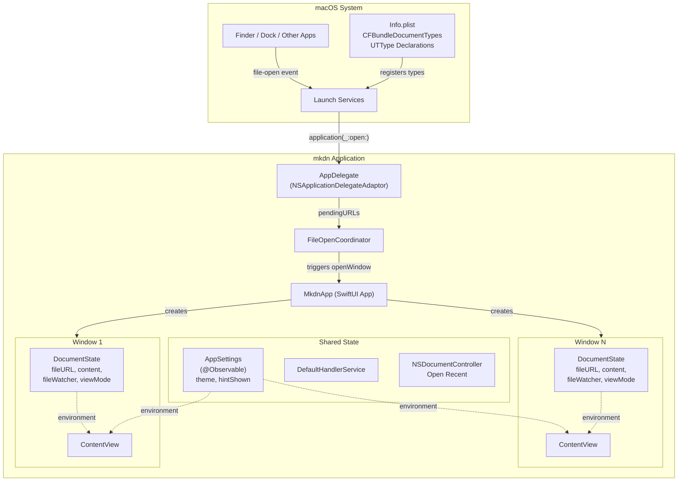
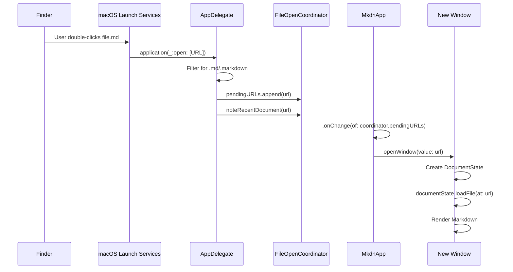

# Technical Design: Default Markdown App

**Feature ID**: default-markdown-app
**Version**: 1.0.0
**Status**: Draft
**Created**: 2026-02-06

## 1. Design Overview

This feature transforms mkdn from a CLI-only tool into a full macOS Markdown handler. The design covers six major subsystems: (1) file type declarations via Info.plist and UTType, (2) system file-open event handling via NSApplicationDelegateAdaptor, (3) multi-window support via state architecture refactoring, (4) programmatic default handler registration, (5) a first-launch hint banner, and (6) Open Recent integration via NSDocumentController.

The most significant architectural change is splitting the current single `AppState` into two classes: `DocumentState` (per-window document lifecycle) and `AppSettings` (app-wide preferences and hint state). This enables true multi-window operation where each window is an independent document viewer/editor.

### High-Level Architecture



## 2. Architecture

### 2.1 State Architecture Refactoring

The current `AppState` is split into two `@Observable` classes following the existing pattern:

**DocumentState** (per-window, created per WindowGroup instance):
- `currentFileURL: URL?`
- `markdownContent: String`
- `lastSavedContent: String`
- `hasUnsavedChanges: Bool` (computed)
- `isFileOutdated: Bool` (computed from fileWatcher)
- `fileWatcher: FileWatcher`
- `viewMode: ViewMode`
- `modeOverlayLabel: String?`
- `loadFile(at:)`, `saveFile()`, `reloadFile()`, `switchMode(to:)`

**AppSettings** (singleton, shared across all windows):
- `themeMode: ThemeMode` (persisted to UserDefaults)
- `systemColorScheme: ColorScheme`
- `theme: AppTheme` (computed)
- `hasShownDefaultHandlerHint: Bool` (persisted to UserDefaults)
- `cycleTheme()`

Both classes are `@MainActor @Observable`, consistent with the existing `AppState` pattern.

### 2.2 Multi-Window Flow



### 2.3 NSApplicationDelegateAdaptor Integration

The `AppDelegate` bridges AppKit's file-open events into SwiftUI:

```swift
// mkdn/App/AppDelegate.swift
@MainActor
final class AppDelegate: NSObject, NSApplicationDelegate {
    func application(_ application: NSApplication, open urls: [URL]) {
        let markdownURLs = urls.filter { url in
            let ext = url.pathExtension.lowercased()
            return ext == "md" || ext == "markdown"
        }
        for url in markdownURLs {
            NSDocumentController.shared.noteNewRecentDocumentURL(url)
            FileOpenCoordinator.shared.pendingURLs.append(url)
        }
    }

    func applicationShouldHandleReopen(
        _ sender: NSApplication,
        hasVisibleWindows flag: Bool
    ) -> Bool {
        true // Allow default window creation behavior
    }
}
```

This handles FR-003 (file-open events), FR-007 (dock drag-and-drop -- dock drops arrive through the same `application(_:open:)` path), and contributes to FR-008 (Open Recent tracking).

### 2.4 FileOpenCoordinator

A lightweight bridge between the AppKit delegate and SwiftUI window management:

```swift
// mkdn/App/FileOpenCoordinator.swift
@MainActor
@Observable
final class FileOpenCoordinator {
    static let shared = FileOpenCoordinator()
    var pendingURLs: [URL] = []

    func consumeAll() -> [URL] {
        let urls = pendingURLs
        pendingURLs.removeAll()
        return urls
    }
}
```

The `MkdnApp` body observes `pendingURLs` and opens new windows:

```swift
WindowGroup(for: URL.self) { $fileURL in
    DocumentWindow(fileURL: fileURL)
        .environment(appSettings)
}
.onChange(of: coordinator.pendingURLs) {
    for url in coordinator.consumeAll() {
        openWindow(value: url)
    }
}
```

### 2.5 Window Identity

Each window is identified by a `URL` value. SwiftUI's `WindowGroup(for: URL.self)` creates independent windows. A window with `nil` URL shows the WelcomeView. The `DocumentWindow` wrapper creates the per-window `DocumentState`:

```swift
// mkdn/App/DocumentWindow.swift
struct DocumentWindow: View {
    let fileURL: URL?
    @State private var documentState = DocumentState()
    @Environment(AppSettings.self) private var appSettings

    var body: some View {
        ContentView()
            .environment(documentState)
            .environment(appSettings)
            .task {
                if let fileURL {
                    try? documentState.loadFile(at: fileURL)
                    NSDocumentController.shared.noteNewRecentDocumentURL(fileURL)
                }
            }
    }
}
```

## 3. Detailed Design

### 3.1 Info.plist and UTType Declarations

Since mkdn is an SPM project, Info.plist must be embedded in the `.app` bundle during packaging. The design specifies the Info.plist content; the build/packaging step (Makefile or Homebrew formula) places it at `mkdn.app/Contents/Info.plist`.

**Info.plist content** (relevant keys):

```xml
<?xml version="1.0" encoding="UTF-8"?>
<!DOCTYPE plist PUBLIC "-//Apple//DTD PLIST 1.0//EN"
  "http://www.apple.com/DTDs/PropertyList-1.0.dtd">
<plist version="1.0">
<dict>
    <key>CFBundleIdentifier</key>
    <string>com.mkdn.app</string>
    <key>CFBundleName</key>
    <string>mkdn</string>
    <key>CFBundleDisplayName</key>
    <string>mkdn</string>
    <key>CFBundleExecutable</key>
    <string>mkdn</string>
    <key>CFBundlePackageType</key>
    <string>APPL</string>
    <key>CFBundleVersion</key>
    <string>1.0.0</string>
    <key>CFBundleShortVersionString</key>
    <string>1.0.0</string>
    <key>LSMinimumSystemVersion</key>
    <string>14.0</string>

    <key>CFBundleDocumentTypes</key>
    <array>
        <dict>
            <key>CFBundleTypeName</key>
            <string>Markdown Document</string>
            <key>CFBundleTypeRole</key>
            <string>Editor</string>
            <key>LSHandlerRank</key>
            <string>Default</string>
            <key>LSItemContentTypes</key>
            <array>
                <string>net.daringfireball.markdown</string>
            </array>
        </dict>
    </array>

    <key>UTImportedTypeDeclarations</key>
    <array>
        <dict>
            <key>UTTypeIdentifier</key>
            <string>net.daringfireball.markdown</string>
            <key>UTTypeDescription</key>
            <string>Markdown Document</string>
            <key>UTTypeConformsTo</key>
            <array>
                <string>public.plain-text</string>
            </array>
            <key>UTTypeTagSpecification</key>
            <dict>
                <key>public.filename-extension</key>
                <array>
                    <string>md</string>
                    <string>markdown</string>
                </array>
                <key>public.mime-type</key>
                <array>
                    <string>text/markdown</string>
                </array>
            </dict>
        </dict>
    </array>
</dict>
</plist>
```

Key design decisions:
- **UTImportedTypeDeclarations** (not Exported): `net.daringfireball.markdown` is defined by the system/ecosystem, not by mkdn. We import the declaration so macOS knows we understand this type even if the system already defines it.
- **LSHandlerRank = Default**: Declares mkdn as willing to be the default handler, so it appears in "Open With" and can be selected as default.
- **CFBundleTypeRole = Editor**: mkdn can both view and edit Markdown files.
- Both `.md` and `.markdown` extensions are covered under the single UTType.

### 3.2 DefaultHandlerService

Encapsulates all Launch Services interaction in a single service:

```swift
// mkdn/Core/Services/DefaultHandlerService.swift
import UniformTypeIdentifiers

@MainActor
enum DefaultHandlerService {
    private static let markdownType = UTType("net.daringfireball.markdown")
        ?? UTType(filenameExtension: "md") ?? .plainText

    /// Register mkdn as the system default handler for Markdown files.
    /// Returns true on success, false on failure (e.g., sandboxed).
    static func registerAsDefault() -> Bool {
        guard let appURL = Bundle.main.bundleURL as URL? else {
            return false
        }
        let workspace = NSWorkspace.shared
        do {
            try workspace.setDefaultApplication(
                at: appURL,
                toOpenContentType: markdownType
            )
            return true
        } catch {
            // Graceful degradation: sandbox or API restriction
            return false
        }
    }

    /// Check whether mkdn is currently the default handler.
    static func isDefault() -> Bool {
        guard let appURL = Bundle.main.bundleURL as URL?,
              let defaultApp = NSWorkspace.shared.urlForApplication(
                  toOpen: markdownType
              )
        else {
            return false
        }
        return defaultApp.path == appURL.path
    }
}
```

Notes:
- Uses `NSWorkspace.shared.setDefaultApplication(at:toOpenContentType:)` which is available on macOS 12+ and is the non-deprecated replacement for `LSSetDefaultRoleHandlerForContentType`.
- Wraps in do/catch for sandbox graceful degradation (NFR-009).
- The `isDefault()` method enables optional future UI (e.g., checkmark on menu item).

### 3.3 First-Launch Hint Banner

A non-modal banner overlaid on ContentView, themed to Solarized:

```swift
// mkdn/Features/DefaultHandler/Views/DefaultHandlerHintView.swift
struct DefaultHandlerHintView: View {
    @Environment(AppSettings.self) private var appSettings
    @State private var showConfirmation = false
    @State private var isVisible = true

    var body: some View {
        if isVisible, !showConfirmation {
            hintContent
        } else if showConfirmation {
            confirmationContent
        }
    }

    private var hintContent: some View {
        HStack(spacing: 12) {
            Image(systemName: "doc.text")
                .foregroundColor(appSettings.theme.colors.accent)
            Text("Make mkdn your default Markdown viewer?")
                .font(.callout)
                .foregroundColor(appSettings.theme.colors.foreground)
            Spacer()
            Button("Set as Default") {
                let success = DefaultHandlerService.registerAsDefault()
                if success {
                    showConfirmation = true
                    dismissAfterDelay()
                }
                markHintShown()
            }
            .buttonStyle(.borderedProminent)
            .controlSize(.small)
            Button {
                withAnimation { isVisible = false }
                markHintShown()
            } label: {
                Image(systemName: "xmark")
                    .foregroundColor(appSettings.theme.colors.foregroundSecondary)
            }
            .buttonStyle(.plain)
        }
        .padding(.horizontal, 16)
        .padding(.vertical, 10)
        .background(appSettings.theme.colors.backgroundSecondary)
        .clipShape(RoundedRectangle(cornerRadius: 8))
        .padding(.horizontal, 24)
        .padding(.top, 8)
        .transition(.move(edge: .top).combined(with: .opacity))
    }

    private var confirmationContent: some View {
        HStack(spacing: 8) {
            Image(systemName: "checkmark.circle.fill")
                .foregroundColor(.green)
            Text("Done! mkdn is now your default Markdown app.")
                .font(.callout)
                .foregroundColor(appSettings.theme.colors.foreground)
        }
        .padding(.horizontal, 16)
        .padding(.vertical, 10)
        .background(appSettings.theme.colors.backgroundSecondary)
        .clipShape(RoundedRectangle(cornerRadius: 8))
        .padding(.horizontal, 24)
        .padding(.top, 8)
        .transition(.opacity)
    }

    private func markHintShown() {
        appSettings.hasShownDefaultHandlerHint = true
    }

    private func dismissAfterDelay() {
        Task { @MainActor in
            try? await Task.sleep(for: .seconds(2))
            withAnimation { isVisible = false }
        }
    }
}
```

The hint is shown in `ContentView` conditionally:

```swift
// In ContentView.body, at the top of the ZStack:
VStack(spacing: 0) {
    if !appSettings.hasShownDefaultHandlerHint {
        DefaultHandlerHintView()
    }
    // ... existing content ...
}
```

This satisfies FR-006 (non-modal, one-time, persisted), NFR-006 (Solarized-themed), and NFR-007 (visual confirmation).

### 3.4 Menu Item: Set as Default Markdown App

Added to `MkdnCommands` in the application menu group:

```swift
// Addition to MkdnCommands
CommandGroup(after: .appInfo) {
    Button("Set as Default Markdown App") {
        let success = DefaultHandlerService.registerAsDefault()
        if success {
            showDefaultSetConfirmation()
        }
    }
}
```

This places the item in the standard app menu (mkdn > Set as Default Markdown App), satisfying FR-005 and NFR-005.

For visual confirmation (NFR-007), a brief notification-style overlay or the mode transition overlay pattern can be reused:

```swift
appSettings.confirmationOverlayLabel = "Default Markdown App Set"
```

### 3.5 Open Recent via NSDocumentController

**Tracking**: Every file-open path calls `NSDocumentController.shared.noteNewRecentDocumentURL(url)`:
- `DocumentState.loadFile(at:)` -- covers CLI launch, Open dialog, file-open events
- `AppDelegate.application(_:open:)` -- covers Finder/dock opens (redundant safety)

**Menu integration**: SwiftUI does not natively expose the NSDocumentController Open Recent menu. The design uses an AppKit bridge:

```swift
// In MkdnCommands, under the File menu:
CommandGroup(after: .newItem) {
    // Open Recent is managed by NSDocumentController.
    // We create a placeholder that triggers the NSDocumentController menu.
    Section {
        OpenRecentMenuView()
    }
}
```

The `OpenRecentMenuView` uses `NSViewRepresentable` to embed the `NSDocumentController`-managed submenu, or alternatively, we read `NSDocumentController.shared.recentDocumentURLs` and build the menu manually in SwiftUI:

```swift
// mkdn/App/OpenRecentMenu.swift
struct OpenRecentCommands: Commands {
    @Environment(\.openWindow) private var openWindow

    var body: some Commands {
        CommandGroup(after: .newItem) {
            Menu("Open Recent") {
                ForEach(
                    NSDocumentController.shared.recentDocumentURLs,
                    id: \.self
                ) { url in
                    Button(url.lastPathComponent) {
                        FileOpenCoordinator.shared.pendingURLs.append(url)
                    }
                }
                Divider()
                Button("Clear Menu") {
                    NSDocumentController.shared.clearRecentDocuments(nil)
                }
            }
        }
    }
}
```

This satisfies FR-008: system default item count (NSDocumentController manages the limit), persistence across launches (NSDocumentController persists automatically), and the Clear Menu option.

### 3.6 Data Model Changes

No new persistent data models are introduced. The only new persistence is a single UserDefaults key:

| Key | Type | Default | Purpose |
|-----|------|---------|---------|
| `hasShownDefaultHandlerHint` | Bool | false | First-launch hint suppression (BR-001) |

The existing `themeMode` UserDefaults key is unchanged but moves from `AppState` to `AppSettings`.

### 3.7 View Migration Map

Views currently reading `@Environment(AppState.self)` must be updated to read from the correct new environment object. The following table maps every affected file:

| File | Current Access | Document State | App Settings | Migration Notes |
|------|---------------|----------------|--------------|-----------------|
| `ContentView.swift` | AppState (file + theme) | DocumentState (file, viewMode, overlay) | AppSettings (theme, colorScheme, hint) | Split environment reads |
| `MarkdownPreviewView.swift` | AppState (content, theme) | DocumentState (markdownContent) | AppSettings (theme) | Both environments |
| `MarkdownBlockView.swift` | AppState (theme only) | -- | AppSettings (theme) | AppSettings only |
| `CodeBlockView.swift` | AppState (theme only) | -- | AppSettings (theme) | AppSettings only |
| `MermaidBlockView.swift` | AppState (theme only) | -- | AppSettings (theme) | AppSettings only |
| `TableBlockView.swift` | AppState (theme only) | -- | AppSettings (theme) | AppSettings only |
| `ImageBlockView.swift` | AppState (theme, currentFileURL) | DocumentState (currentFileURL) | AppSettings (theme) | Both environments |
| `SplitEditorView.swift` | AppState (content, theme) | DocumentState (markdownContent) | AppSettings (theme) | Both environments |
| `MarkdownEditorView.swift` | AppState (theme only) | -- | AppSettings (theme) | AppSettings only |
| `WelcomeView.swift` | AppState (theme only) | -- | AppSettings (theme) | AppSettings only |
| `ThemePickerView.swift` | AppState (themeMode binding) | -- | AppSettings (themeMode) | AppSettings only |
| `BreathingOrbView.swift` | AppState (theme only) | -- | AppSettings (theme) | AppSettings only |
| `UnsavedIndicator.swift` | AppState (unused env read) | -- | -- | Remove env read or keep for theme |
| `MkdnCommands.swift` | AppState (file + theme) | DocumentState (file ops) | AppSettings (theme) | Both; needs focused window's DocumentState |

### 3.8 Entry Point Restructuring

The `mkdnEntry/main.swift` must be updated to integrate the NSApplicationDelegateAdaptor. The CLI parsing flow remains, but `LaunchContext` is extended to work with the new `FileOpenCoordinator`:

```swift
// mkdnEntry/main.swift (updated)
import AppKit
import mkdnLib
import SwiftUI

struct MkdnApp: App {
    @NSApplicationDelegateAdaptor(AppDelegate.self) var appDelegate
    @State private var appSettings = AppSettings()
    @Environment(\.openWindow) private var openWindow

    init() {
        // CLI file argument: route through coordinator for first window
        if let url = LaunchContext.fileURL {
            FileOpenCoordinator.shared.pendingURLs.append(url)
        }
    }

    var body: some Scene {
        WindowGroup(for: URL.self) { $fileURL in
            DocumentWindow(fileURL: fileURL)
                .environment(appSettings)
        }
        .windowStyle(.hiddenTitleBar)
        .commands {
            CommandGroup(replacing: .newItem) {}
            MkdnCommands(appSettings: appSettings)
            OpenRecentCommands()
        }
        .onChange(of: FileOpenCoordinator.shared.pendingURLs) {
            for url in FileOpenCoordinator.shared.consumeAll() {
                openWindow(value: url)
            }
        }
    }
}

// CLI entry
do {
    let cli = try MkdnCLI.parse()
    if let filePath = cli.file {
        let url = try FileValidator.validate(path: filePath)
        LaunchContext.fileURL = url
    }
    NSApplication.shared.setActivationPolicy(.regular)
    MkdnApp.main()
} catch let error as CLIError {
    FileHandle.standardError.write(
        Data("mkdn: error: \(error.localizedDescription)\n".utf8)
    )
    Foundation.exit(error.exitCode)
} catch {
    MkdnCLI.exit(withError: error)
}
```

### 3.9 MkdnCommands Refactoring for Multi-Window

Menu commands that operate on the current document (Save, Reload, mode switching) need access to the focused window's `DocumentState`. In SwiftUI on macOS, the `@FocusedValue` mechanism provides this:

```swift
// mkdn/App/FocusedDocumentState.swift
struct FocusedDocumentStateKey: FocusedValueKey {
    typealias Value = DocumentState
}

extension FocusedValues {
    var documentState: DocumentState? {
        get { self[FocusedDocumentStateKey.self] }
        set { self[FocusedDocumentStateKey.self] = newValue }
    }
}
```

Each `DocumentWindow` publishes its DocumentState via `.focusedSceneValue(\.documentState, documentState)`.

`MkdnCommands` then uses `@FocusedValue(\.documentState)` to access the active window's document:

```swift
struct MkdnCommands: Commands {
    let appSettings: AppSettings
    @FocusedValue(\.documentState) private var documentState

    var body: some Commands {
        // Save operates on focused document
        CommandGroup(replacing: .saveItem) {
            Button("Save") {
                try? documentState?.saveFile()
            }
            .keyboardShortcut("s", modifiers: .command)
            .disabled(documentState?.currentFileURL == nil
                || documentState?.hasUnsavedChanges != true)
        }
        // ... etc
    }
}
```

## 4. Technology Stack

| Layer | Technology | Rationale |
|-------|-----------|-----------|
| State management | `@Observable` (Observation framework) | Existing pattern; per-window DocumentState + shared AppSettings |
| File-open events | `NSApplicationDelegateAdaptor` + `NSApplicationDelegate` | Required for system file-open events; standard SwiftUI-AppKit bridge |
| Multi-window | `WindowGroup(for: URL.self)` | SwiftUI-native multi-window with value binding |
| Default handler | `NSWorkspace.setDefaultApplication(at:toOpenContentType:)` | macOS 12+ non-deprecated API |
| UTType | `UniformTypeIdentifiers` framework + Info.plist declarations | System standard for file type identity |
| Open Recent | `NSDocumentController.shared` | System standard for recent document tracking |
| Persistence | `UserDefaults` (hint flag only) | Follows existing themeMode pattern |
| Menu commands | SwiftUI `Commands` + `@FocusedValue` | Follows existing MkdnCommands pattern; extends for multi-window |

## 5. Implementation Plan

### T1: Info.plist and UTType Declarations
- Create `Resources/Info.plist` with CFBundleDocumentTypes and UTImportedTypeDeclarations
- Add packaging script or Makefile target to assemble `.app` bundle with Info.plist
- Verify Launch Services indexes mkdn for `.md` and `.markdown` files
- **Files**: `Resources/Info.plist` (new), `Makefile` or `scripts/bundle.sh` (new)

### T2: State Architecture Refactoring
- Create `DocumentState` (`mkdn/App/DocumentState.swift`) by extracting file-related state from `AppState`
- Create `AppSettings` (`mkdn/App/AppSettings.swift`) with theme and hint-related state
- Create `FocusedDocumentStateKey` for `@FocusedValue` support
- Delete `AppState.swift` after migration complete
- Update all 14 view files per the migration map in section 3.7
- Update existing tests in `AppStateTests.swift` to test `DocumentState` and `AppSettings` separately
- **Files**: `mkdn/App/DocumentState.swift` (new), `mkdn/App/AppSettings.swift` (new), `mkdn/App/FocusedDocumentState.swift` (new), `mkdn/App/AppState.swift` (delete), all view files (edit), `mkdnTests/Unit/Features/AppStateTests.swift` (edit/split)

### T3: NSApplicationDelegateAdaptor and FileOpenCoordinator
- Create `AppDelegate` class with `application(_:open:)` handler
- Create `FileOpenCoordinator` singleton
- Integrate NSDocumentController.noteNewRecentDocumentURL in the open path
- **Files**: `mkdn/App/AppDelegate.swift` (new), `mkdn/App/FileOpenCoordinator.swift` (new)

### T4: Multi-Window WindowGroup Restructure
- Create `DocumentWindow` wrapper view
- Update `MkdnApp` (in `mkdnEntry/main.swift`) to use `WindowGroup(for: URL.self)`
- Add `NSApplicationDelegateAdaptor` to MkdnApp
- Wire `.onChange` on `FileOpenCoordinator.shared.pendingURLs` to `openWindow`
- Update `LaunchContext` usage to route through `FileOpenCoordinator`
- Update `WindowAccessor` for multi-window (remove `isConfigured` singleton guard)
- **Files**: `mkdn/App/DocumentWindow.swift` (new), `mkdnEntry/main.swift` (edit), `mkdn/UI/Components/WindowAccessor.swift` (edit)

### T5: DefaultHandlerService
- Create `DefaultHandlerService` with `registerAsDefault()` and `isDefault()`
- Uses `NSWorkspace.setDefaultApplication(at:toOpenContentType:)`
- Includes sandbox-safe error handling
- **Files**: `mkdn/Core/Services/DefaultHandlerService.swift` (new)

### T6: "Set as Default" Menu Item
- Add "Set as Default Markdown App" to MkdnCommands under `CommandGroup(after: .appInfo)`
- Wire to `DefaultHandlerService.registerAsDefault()`
- Add brief confirmation via overlay
- **Files**: `mkdn/App/MkdnCommands.swift` (edit)

### T7: First-Launch Hint Banner
- Create `DefaultHandlerHintView` with Set as Default button and dismiss
- Add `hasShownDefaultHandlerHint` to `AppSettings` with UserDefaults persistence
- Integrate hint into `ContentView` as conditional overlay
- **Files**: `mkdn/Features/DefaultHandler/Views/DefaultHandlerHintView.swift` (new), `mkdn/App/ContentView.swift` (edit)

### T8: Open Recent Integration
- Create `OpenRecentCommands` struct
- Read `NSDocumentController.shared.recentDocumentURLs` and build SwiftUI menu
- Route selection through `FileOpenCoordinator` for new-window opening
- Include "Clear Menu" action
- Ensure `noteNewRecentDocumentURL` is called in all file-open paths
- **Files**: `mkdn/App/OpenRecentMenu.swift` (new), `mkdn/App/MkdnCommands.swift` (edit)

## 6. Implementation DAG

**Parallel Groups** (tasks with no inter-dependencies):

1. **[T1, T2]** -- Info.plist is configuration; state refactoring is code architecture. No overlap.
2. **[T3, T5]** -- AppDelegate/Coordinator needs DocumentState model (T2); DefaultHandlerService needs UTType identifiers (T1). Both available after group 1.
3. **[T4, T6, T7]** -- WindowGroup needs state + coordinator (T2, T3); menu item needs service (T5); hint needs service + settings (T5, T2). All available after group 2.
4. **[T8]** -- Open Recent needs multi-window working (T4) and coordinator (T3).

**Dependencies**:

- T3 -> T2 (Interface: AppDelegate creates FileOpenCoordinator entries that trigger DocumentState creation)
- T4 -> [T2, T3] (Interface: WindowGroup uses DocumentState model; reacts to FileOpenCoordinator)
- T5 -> T1 (Data: DefaultHandlerService references UTType identifiers from Info.plist declarations)
- T6 -> T5 (Interface: menu item calls DefaultHandlerService.registerAsDefault())
- T7 -> [T2, T5] (Interface: hint reads AppSettings.hasShownDefaultHandlerHint; button calls DefaultHandlerService)
- T8 -> [T3, T4] (Interface: Open Recent routes through FileOpenCoordinator; opens new windows)

**Critical Path**: T2 -> T3 -> T4 -> T8

## 7. Testing Strategy

### Test Value Assessment

Tests are designed only for application-specific logic, not framework/library behavior.

| Test Category | Valuable (design for) | Avoid |
|--------------|----------------------|-------|
| State | DocumentState file load/save/reload, AppSettings persistence | UserDefaults read/write mechanics |
| Service | DefaultHandlerService.registerAsDefault() success/failure paths | NSWorkspace API behavior |
| Coordinator | FileOpenCoordinator URL queuing and consumption | SwiftUI openWindow mechanics |
| Hint | Hint visibility logic based on hasShownDefaultHandlerHint | SwiftUI animation behavior |
| File filtering | Markdown extension filtering in AppDelegate | NSApplicationDelegate event dispatch |

### Unit Tests

All tests use Swift Testing (`@Suite`, `@Test`, `#expect`). `@MainActor` on individual test functions, not on `@Suite` structs.

**DocumentStateTests** (`mkdnTests/Unit/Features/DocumentStateTests.swift`):
- Migrated from existing AppStateTests (file load, save, reload, unsaved changes)
- New: viewMode defaults and switching
- New: modeOverlayLabel management

**AppSettingsTests** (`mkdnTests/Unit/Features/AppSettingsTests.swift`):
- Migrated from existing AppStateTests (theme mode, cycle theme)
- New: `hasShownDefaultHandlerHint` defaults to false
- New: `hasShownDefaultHandlerHint` persists to UserDefaults

**DefaultHandlerServiceTests** (`mkdnTests/Unit/Core/DefaultHandlerServiceTests.swift`):
- Test `isDefault()` returns Bool without crashing
- Test `registerAsDefault()` returns Bool (success path depends on bundle context; test the interface contract)
- Note: Full integration requires `.app` bundle context; unit tests verify the code paths do not crash in test context

**FileOpenCoordinatorTests** (`mkdnTests/Unit/Core/FileOpenCoordinatorTests.swift`):
- `pendingURLs` starts empty
- Appending URLs makes them available
- `consumeAll()` returns all URLs and clears the list
- `consumeAll()` on empty list returns empty array

**MarkdownFileFilterTests** (`mkdnTests/Unit/Core/MarkdownFileFilterTests.swift`):
- `.md` extension accepted
- `.markdown` extension accepted
- `.txt`, `.html`, `.rst` rejected
- Case-insensitive extension matching (`.MD`, `.Markdown`)

### Integration Tests (Manual Verification)

These require a built `.app` bundle and cannot be automated via `swift test`:

| Scenario | Verification |
|----------|-------------|
| Double-click `.md` in Finder (mkdn is default) | mkdn launches, file renders |
| Double-click `.md` while mkdn is running | New window opens, existing window unchanged |
| Drag `.md` to dock icon | File opens in new window |
| Select multiple `.md` files, open via Finder | N windows created |
| File > Open Recent shows previously opened files | Files listed, clickable |
| "Set as Default Markdown App" menu item | Registration succeeds, confirmation shown |
| First-launch hint appears once | Hint shows, dismiss persists across restart |

## 8. Deployment Design

### App Bundle Packaging

mkdn must be distributed as a `.app` bundle for file associations to work. The design adds a build script:

```bash
#!/bin/bash
# scripts/bundle.sh -- Create mkdn.app from SPM build output

set -euo pipefail

APP_NAME="mkdn"
BUILD_DIR=".build/release"
BUNDLE_DIR="build/${APP_NAME}.app/Contents"

swift build -c release

mkdir -p "${BUNDLE_DIR}/MacOS"
mkdir -p "${BUNDLE_DIR}/Resources"

cp "${BUILD_DIR}/${APP_NAME}" "${BUNDLE_DIR}/MacOS/"
cp "Resources/Info.plist" "${BUNDLE_DIR}/"
# Copy app icon if present
# cp "Resources/AppIcon.icns" "${BUNDLE_DIR}/Resources/"

echo "Built ${APP_NAME}.app"
```

This script is called by the Homebrew formula and by developers during local testing. The existing `swift build` and `swift run mkdn` commands continue to work for CLI-only development; the `.app` bundle is required only for Finder/dock integration testing.

### Rollout Considerations

- File type registration is passive: installing the `.app` bundle causes Launch Services to index it. No user action required for mkdn to appear in "Open With."
- Setting mkdn as default requires explicit user action (menu item or first-launch hint).
- The feature has no feature flags; it is always active when the `.app` bundle is properly formed.

## 9. Documentation Impact

| Type | Target | Section | KB Source | Rationale |
|------|--------|---------|-----------|-----------|
| edit | `.rp1/context/architecture.md` | System Overview, Data Flow | architecture.md:System Overview | Add multi-window flow, DocumentState/AppSettings split, AppDelegate |
| edit | `.rp1/context/modules.md` | App Layer, Core Layer | modules.md:App Layer | Add DocumentState, AppSettings, AppDelegate, FileOpenCoordinator, DefaultHandlerService, DocumentWindow |
| edit | `.rp1/context/patterns.md` | Observation Pattern | patterns.md:Observation Pattern | Add multi-window pattern with @FocusedValue, DocumentState/AppSettings split |
| add | `.rp1/context/modules.md` | Features Layer | modules.md:Features Layer | Add Features/DefaultHandler/ section |

## 10. Design Decisions Log

| ID | Decision | Choice | Rationale | Alternatives Considered |
|----|----------|--------|-----------|------------------------|
| D1 | Multi-window state architecture | State Splitting: DocumentState + AppSettings | Incremental; follows existing @Observable pattern; minimal disruption to view layer | DocumentGroup with ReferenceFileDocument (too much document lifecycle overhead); single AppState with window-specific bindings (too complex) |
| D2 | File-open event routing | NSApplicationDelegateAdaptor + FileOpenCoordinator | Standard AppKit bridge; coordinator pattern cleanly separates AppKit delegate from SwiftUI window management | onOpenURL modifier (delivers to existing window, not new); direct NSApp manipulation from delegate (breaks SwiftUI window lifecycle) |
| D3 | Default handler API | NSWorkspace.setDefaultApplication(at:toOpenContentType:) | Non-deprecated macOS 12+ API; works on macOS 14+ target | LSSetDefaultRoleHandlerForContentType (deprecated since macOS 12); directing user to System Settings (poor UX) |
| D4 | UTType declaration strategy | UTImportedTypeDeclarations | net.daringfireball.markdown is an ecosystem type, not mkdn-owned; imported declarations avoid conflicts with other apps that may export the same type | UTExportedTypeDeclarations (inappropriate; mkdn does not own the Markdown UTType) |
| D5 | Open Recent implementation | NSDocumentController.shared + SwiftUI menu bridge | System manages persistence, item count, and Clear Menu; minimal custom code | Manual UserDefaults-based recent list (reinvents wheel); DocumentGroup (too heavy for viewer-first app) |
| D6 | First-launch hint persistence | UserDefaults boolean flag | Follows existing themeMode persistence pattern; simplest mechanism for a single boolean | Keychain (overkill); file-based (unnecessary complexity) |
| D7 | Window identity model | WindowGroup(for: URL.self) | SwiftUI-native multi-window with URL-based identity; each window is independently closeable | Window(id:) with manual management (more code, less SwiftUI-native); NSWindowController subclass (breaks SwiftUI model) |
| D8 | Menu commands for multi-window | @FocusedValue(\.documentState) | Standard SwiftUI mechanism for commands that operate on the focused window's state | Passing DocumentState directly (impossible with Commands protocol); global state lookup (breaks multi-window isolation) |
| D9 | App bundle packaging | Build script (scripts/bundle.sh) | SPM does not produce .app bundles natively; script is simple, CI-friendly, Homebrew-compatible | Xcode project (adds maintenance burden, diverges from SPM-only workflow); SwiftPM plugin (not mature enough for app bundling) |
