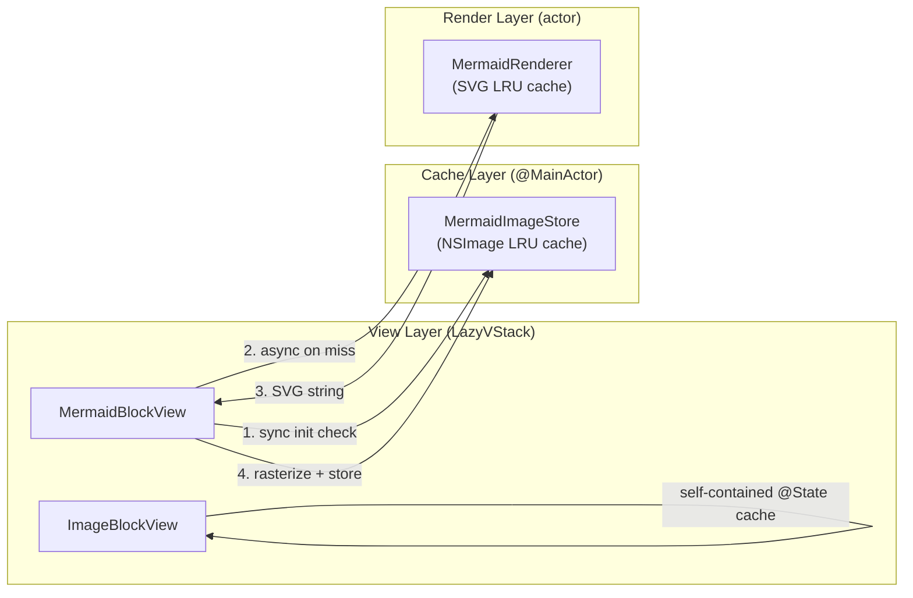
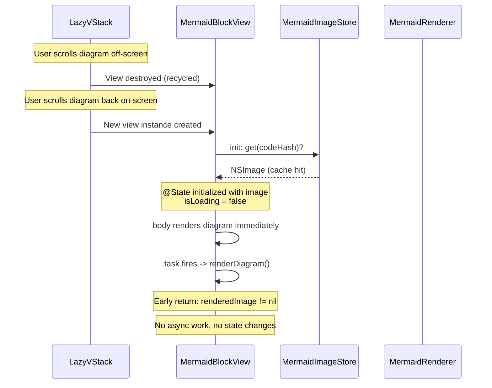
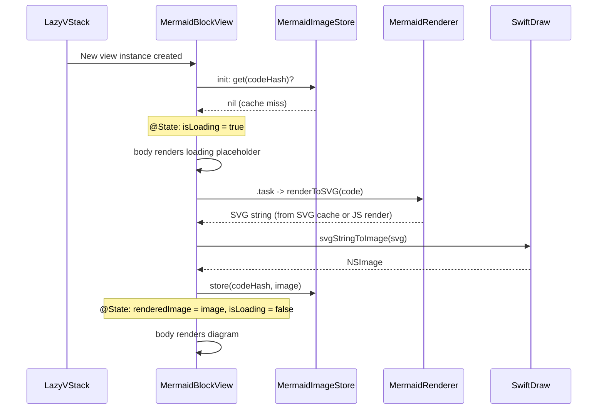

# Design: Fix Infinite Scroll Re-render Loop

**Feature ID**: fix-infinite-scroll-rerender
**Version**: 1.0.0
**Status**: Draft
**Created**: 2026-02-06

## 1. Design Overview

This design addresses a self-sustaining re-render loop triggered by scrolling through Mermaid diagram blocks in the LazyVStack-based preview. The root cause is a multi-step cycle: LazyVStack recycles views on scroll, recycled MermaidBlockView instances re-fire `.task`, the task sets `isLoading = true` (changing view height), the height change triggers LazyVStack re-layout, and the cycle repeats.

The fix introduces a `@MainActor` NSImage cache (`MermaidImageStore`) that survives view recycling, enables synchronous cache-aware initialization in MermaidBlockView to eliminate loading-state flicker on reappear, and applies the same pattern to ImageBlockView. A secondary fix stabilizes ListItem identity to prevent cascading ID instability.

### High-Level Architecture



**Key change**: MermaidBlockView now checks MermaidImageStore synchronously in `init()`. If a cached NSImage exists, the view starts in its rendered state with no loading indicator and no async work. The `.task` becomes a no-op for cache hits.

## 2. Architecture

### Component Interaction (Scroll Recycling Scenario)



### Component Interaction (First Render Scenario)



## 3. Detailed Design

### 3.1 MermaidImageStore (New)

**File**: `mkdn/Core/Mermaid/MermaidImageStore.swift`

A `@MainActor` singleton that provides an LRU cache of rasterized `NSImage` instances keyed by content hash. This layer sits between the view and the MermaidRenderer actor, holding the expensive-to-compute final output.

```swift
@MainActor
final class MermaidImageStore {
    static let shared = MermaidImageStore()

    private var storage: [UInt64: NSImage] = [:]
    private var accessOrder: [UInt64] = []
    private let capacity: Int

    init(capacity: Int = 50) {
        self.capacity = capacity
    }

    func get(_ code: String) -> NSImage? {
        let key = mermaidStableHash(code)
        guard let image = storage[key] else { return nil }
        promoteToMostRecent(key)
        return image
    }

    func store(_ code: String, image: NSImage) {
        let key = mermaidStableHash(code)
        if storage[key] != nil {
            storage[key] = image
            promoteToMostRecent(key)
            return
        }
        if accessOrder.count >= capacity {
            evictLeastRecentlyUsed()
        }
        storage[key] = image
        accessOrder.append(key)
    }

    func removeAll() {
        storage.removeAll()
        accessOrder.removeAll()
    }
}
```

**Design Decisions**:
- Capacity of 50 matches the existing MermaidCache SVG capacity.
- Keyed by `mermaidStableHash` (reuses existing DJB2 utility).
- `@MainActor` isolation because `NSImage` is not `Sendable` and view init/body runs on MainActor.
- Separate from MermaidRenderer actor to avoid cross-isolation complexity.

### 3.2 MermaidBlockView Refactor

**File**: `mkdn/Features/Viewer/Views/MermaidBlockView.swift`

Changes:
1. **Cache-aware `init`**: Check `MermaidImageStore.shared.get(code)` synchronously. If hit, initialize `@State` with the cached image and `isLoading = false`.
2. **`.task(id: code)` instead of `.task`**: Prevents `.task` from re-firing when the parent view re-evaluates body (e.g., theme change) if the mermaid code has not changed. Note: `.task(id:)` still fires on first appear, which is desired.
3. **Early return in `renderDiagram()`**: If `renderedImage` is already populated (from cache), return immediately without any state changes.
4. **Store rendered image**: After successful render, store the NSImage in `MermaidImageStore`.

**Key behavioral change**: A recycled MermaidBlockView now starts in its fully-rendered state (diagram visible, no loading indicator) for cache hits. No `.task` async work executes. No state transitions occur. No layout changes propagate to LazyVStack. The re-render cycle is broken.

```swift
struct MermaidBlockView: View {
    let code: String

    @Environment(AppState.self) private var appState
    @State private var renderedImage: NSImage?
    @State private var errorMessage: String?
    @State private var isLoading: Bool
    // ... existing zoom/activation state unchanged ...

    init(code: String) {
        self.code = code
        let cached = MermaidImageStore.shared.get(code)
        _renderedImage = State(initialValue: cached)
        _errorMessage = State(initialValue: nil)
        _isLoading = State(initialValue: cached == nil)
    }

    var body: some View {
        Group {
            if isLoading {
                loadingView
            } else if let image = renderedImage {
                diagramView(image: image)
            } else if let error = errorMessage {
                errorView(message: error)
            }
        }
        .task(id: code) {
            await renderDiagram()
        }
    }

    private func renderDiagram() async {
        // Early return: image already loaded (cache hit from init)
        guard renderedImage == nil, errorMessage == nil else { return }

        isLoading = true
        do {
            let svgString = try await MermaidRenderer.shared.renderToSVG(code)
            if let image = svgStringToImage(svgString) {
                renderedImage = image
                errorMessage = nil
                MermaidImageStore.shared.store(code, image: image)
            } else {
                // ... existing error handling ...
            }
        } catch {
            // ... existing error handling ...
        }
        isLoading = false
    }
}
```

### 3.3 ImageBlockView Refactor

**File**: `mkdn/Features/Viewer/Views/ImageBlockView.swift`

Apply the same pattern to prevent image reload flicker on view recycling.

Changes:
1. **Use `.task(id: source)` instead of `.task`**.
2. **Early return in `loadImage()`**: If `loadedImage` is already set, return immediately.
3. **No external cache needed**: Images are loaded from file/network. Since `ImageBlockView` is less expensive than Mermaid and documents typically have fewer images, the simplest fix is the early-return guard. For a more robust solution in the future, an image cache could be added, but the `.task(id:)` + early return breaks the immediate re-render cycle.

Note: Unlike Mermaid, ImageBlockView's @State will be lost on recycling. To fully address AC-6a (no loading placeholder on scroll-back), a `@MainActor` image cache keyed by resolved URL could be added. This is structurally identical to MermaidImageStore. The design includes this as a recommended enhancement but marks it as optional given the lower severity (images load much faster than Mermaid rendering).

**Optional enhancement**: Add `ImageStore` (same LRU pattern as MermaidImageStore) keyed by resolved URL string, with synchronous cache check in init. This directly parallels the Mermaid fix.

### 3.4 ListItem ID Stability Fix

**File**: `mkdn/Core/Markdown/MarkdownBlock.swift`

Current problem: `ListItem` uses `let id = UUID()`, generating a new UUID on every parse pass. This means every call to `MarkdownRenderer.render()` produces ListItem instances with new identities, causing SwiftUI to treat them as entirely new views and destroying/recreating the entire list subtree.

Fix: Replace UUID-based identity with content-based identity using the existing `stableHash` function.

```swift
struct ListItem: Identifiable {
    let blocks: [MarkdownBlock]

    var id: String {
        "li-\(blocks.map(\.id).joined(separator: "-"))"
    }
}
```

This ensures list items have stable identity across re-renders as long as their content is unchanged, preventing unnecessary view destruction in ForEach.

### 3.5 Cache Invalidation

Caches must be invalidated when content genuinely changes:

| Trigger | MermaidImageStore | MermaidRenderer SVG Cache |
|---------|-------------------|---------------------------|
| File reload | Clear all | No change (SVG cache hit avoids JS work) |
| Editor content change | `.task(id: code)` re-fires for changed blocks | SVG cache miss for new content |
| Theme change | Clear all (colors may affect SVG) | Clear all |
| App memory pressure | Future: respond to memory warnings | No change |

**Implementation**: Call `MermaidImageStore.shared.removeAll()` from:
- `AppState.loadFile(at:)` (file reload)
- The `.onChange(of: appState.theme)` handler in `MarkdownPreviewView`

Per-block invalidation is automatic: `.task(id: code)` fires when `code` changes, and the new code's hash won't match the old cache entry.

## 4. Technology Stack

No new dependencies. All changes use existing project technologies:

| Component | Technology | Existing? |
|-----------|-----------|-----------|
| MermaidImageStore | Swift @MainActor class | New class, existing patterns |
| LRU Cache | Custom (same pattern as MermaidCache) | Existing pattern |
| Stable hashing | DJB2 (`mermaidStableHash`) | Existing utility |
| View lifecycle | SwiftUI `.task(id:)` | Existing framework API |
| Image rasterization | SwiftDraw | Existing dependency |

## 5. Implementation Plan

### T1: MermaidImageStore

Create `mkdn/Core/Mermaid/MermaidImageStore.swift`:
- `@MainActor` singleton with LRU NSImage cache
- `get(_ code: String) -> NSImage?` (synchronous)
- `store(_ code: String, image: NSImage)` (synchronous)
- `removeAll()` for invalidation
- Capacity: 50 (matching SVG cache)

### T2: MermaidBlockView Refactor

Modify `mkdn/Features/Viewer/Views/MermaidBlockView.swift`:
- Add custom `init(code:)` with synchronous cache lookup from MermaidImageStore
- Initialize `@State` properties from cache (renderedImage, isLoading)
- Change `.task` to `.task(id: code)`
- Add early-return guard in `renderDiagram()` when renderedImage is already set
- Store rendered NSImage to MermaidImageStore after successful render
- All existing zoom/activation behavior unchanged

### T3: ImageBlockView Hardening

Modify `mkdn/Features/Viewer/Views/ImageBlockView.swift`:
- Change `.task` to `.task(id: source)`
- Add early-return guard in `loadImage()` when loadedImage is already set
- (Optional) Add `ImageStore` singleton for synchronous cache-aware init, paralleling MermaidImageStore

### T4: ListItem ID Stability

Modify `mkdn/Core/Markdown/MarkdownBlock.swift`:
- Replace `let id = UUID()` in ListItem with content-derived computed `id` property
- Use stable hash of child block IDs

### T5: Cache Invalidation Wiring

Modify `mkdn/App/AppState.swift` and `mkdn/Features/Viewer/Views/MarkdownPreviewView.swift`:
- Call `MermaidImageStore.shared.removeAll()` in `loadFile(at:)` (AppState)
- Call `MermaidImageStore.shared.removeAll()` in `.onChange(of: appState.theme)` (MarkdownPreviewView)
- Call `MermaidImageStore.shared.removeAll()` alongside existing `MermaidRenderer.shared.clearCache()` if present

## 6. Implementation DAG

**Parallel Groups** (tasks with no inter-dependencies):

1. [T1, T3, T4] - T1 is a new standalone class, T3 modifies ImageBlockView independently, T4 modifies MarkdownBlock independently
2. [T2, T5] - T2 consumes T1 (MermaidImageStore), T5 wires cache invalidation (uses T1)

**Dependencies**:

- T2 -> T1 (interface: MermaidBlockView calls MermaidImageStore.shared)
- T5 -> T1 (interface: AppState/MarkdownPreviewView calls MermaidImageStore.shared.removeAll())

**Critical Path**: T1 -> T2

## 7. Testing Strategy

### Test Value Assessment

| Test Target | Value | Rationale |
|-------------|-------|-----------|
| MermaidImageStore LRU behavior | HIGH | App-specific cache with bounded memory -- business logic |
| MermaidImageStore get/store cycle | HIGH | Core mechanism that breaks the re-render loop |
| ListItem stable ID generation | HIGH | App-specific identity contract affecting SwiftUI diff |
| MermaidBlockView cache-aware init | MEDIUM | Integration of cache with view lifecycle -- hard to unit test without SwiftUI hosting |
| LazyVStack recycling behavior | SKIP | SwiftUI framework behavior, not app logic |
| NSImage rasterization quality | SKIP | SwiftDraw library behavior verification |

### Unit Tests

**File**: `mkdnTests/Unit/Core/MermaidImageStoreTests.swift`

```swift
@Suite("MermaidImageStore")
struct MermaidImageStoreTests {
    @Test("Returns nil for cache miss")
    @MainActor func cacheMiss() { ... }

    @Test("Stores and retrieves an image")
    @MainActor func basicStoreAndGet() { ... }

    @Test("Evicts LRU entry at capacity")
    @MainActor func lruEviction() { ... }

    @Test("removeAll clears cache")
    @MainActor func removeAll() { ... }

    @Test("Same code returns same cached image instance")
    @MainActor func cacheHitReturnsSameInstance() { ... }

    @Test("Different code produces cache miss")
    @MainActor func differentCodeMisses() { ... }
}
```

**File**: `mkdnTests/Unit/Core/MarkdownBlockTests.swift` (extend existing or create)

```swift
@Test("ListItem ID is stable across instances with same content")
func listItemIdStability() {
    let blocks1 = [MarkdownBlock.paragraph(text: AttributedString("hello"))]
    let blocks2 = [MarkdownBlock.paragraph(text: AttributedString("hello"))]
    let item1 = ListItem(blocks: blocks1)
    let item2 = ListItem(blocks: blocks2)
    #expect(item1.id == item2.id)
}

@Test("ListItem ID differs for different content")
func listItemIdDiffers() {
    let item1 = ListItem(blocks: [.paragraph(text: AttributedString("hello"))])
    let item2 = ListItem(blocks: [.paragraph(text: AttributedString("world"))])
    #expect(item1.id != item2.id)
}
```

### Manual Verification Protocol

Since the core bug is a visual/behavioral issue tied to scroll performance:

1. Open a Markdown file with 5+ Mermaid diagram blocks
2. Wait for all diagrams to render (loading indicators resolve)
3. Scroll slowly through the document -- verify no flicker or re-render
4. Scroll rapidly (fast flick) -- verify no freeze, crash, or runaway CPU
5. Scroll back up to a previously viewed diagram -- verify instant appearance (no loading indicator)
6. Monitor Activity Monitor during scrolling -- verify CPU returns to idle
7. Test in side-by-side mode (same MarkdownPreviewView is used)
8. Test theme toggle while viewing Mermaid document -- verify diagrams re-render correctly

## 8. Deployment Design

This is a bug fix within the existing application. No deployment infrastructure changes.

- Build with `swift build`
- Run tests with `swift test`
- Lint with `DEVELOPER_DIR=/Applications/Xcode-16.3.0.app/Contents/Developer swiftlint lint`
- Format with `swiftformat .`
- The fix ships with the next application build/release

## 9. Documentation Impact

| Type | Target | Section | KB Source | Rationale |
|------|--------|---------|-----------|-----------|
| add | `.rp1/context/modules.md` | Mermaid module | `architecture.md:#mermaid-diagrams` | Document MermaidImageStore as new component in the Mermaid pipeline |
| edit | `.rp1/context/architecture.md` | Mermaid Diagrams pipeline | `architecture.md:#rendering-pipeline` | Add MermaidImageStore layer to the rendering pipeline description |
| edit | `.rp1/context/patterns.md` | Anti-Patterns | `patterns.md:#anti-patterns` | Add pattern note: "Use cache-aware init for views in LazyVStack that perform async work" |

## 10. Design Decisions Log

| ID | Decision | Choice | Rationale | Alternatives Considered |
|----|----------|--------|-----------|------------------------|
| D1 | Where to cache NSImages | Separate @MainActor MermaidImageStore singleton | NSImage is not Sendable; cannot store in MermaidRenderer actor. @MainActor matches view lifecycle. | (a) Store in MermaidRenderer actor (isolation mismatch), (b) Store in AppState (pollutes central state with rendering detail) |
| D2 | How to prevent loading flicker on recycled views | Synchronous cache check in view init, initialize @State from cache | SwiftUI @State initializers run before .task; only way to start a recycled view in rendered state | (a) Replace LazyVStack with VStack (breaks NFR-1 for large docs), (b) Use .task only and check cache there (still shows 1 frame of loading state) |
| D3 | LazyVStack vs VStack | Keep LazyVStack | LazyVStack is necessary for large documents (NFR-1). The re-render bug is in the view lifecycle, not in lazy loading itself. | VStack (simpler but degrades performance for large docs) |
| D4 | .task vs .task(id:) | Use .task(id: code) | Prevents .task from re-firing when parent re-evaluates body without content change. More precise lifecycle control. | .task (re-fires on every appear, including parent body re-evaluation) |
| D5 | ListItem identity | Content-derived stable ID | UUID regenerates on every parse, causing SwiftUI to treat all list items as new views on re-render | UUID (current, unstable), index-based (fragile on reorder) |
| D6 | Cache capacity for NSImages | 50 entries | Matches SVG cache capacity. Typical documents have fewer than 50 Mermaid blocks. NSImage memory is bounded by this limit. | Unlimited (memory risk), 10 (too small for large docs) |
| D7 | ImageBlockView cache approach | .task(id:) + early return guard, optional ImageStore | Lower priority than Mermaid fix. Images load faster. Early return guard prevents the re-render cycle. Full cache is optional enhancement. | Full ImageStore (more code, smaller benefit), no change (leaves minor issue) |
| D8 | Cache invalidation strategy | Clear on file load + theme change, per-block via .task(id:) | File load means all content may have changed. Theme change may affect SVG rendering. Per-block invalidation is automatic via .task(id: code). | Time-based expiry (unnecessary complexity), never invalidate (stale data risk) |
