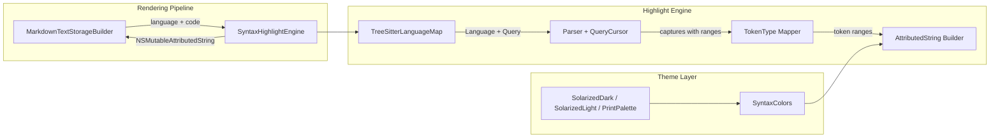
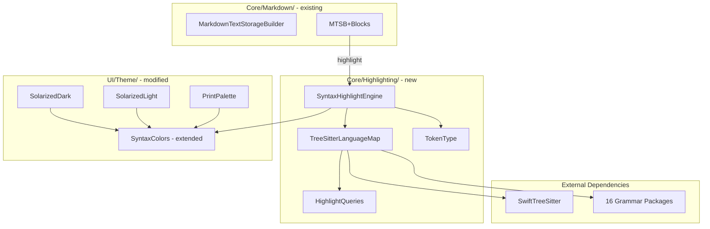
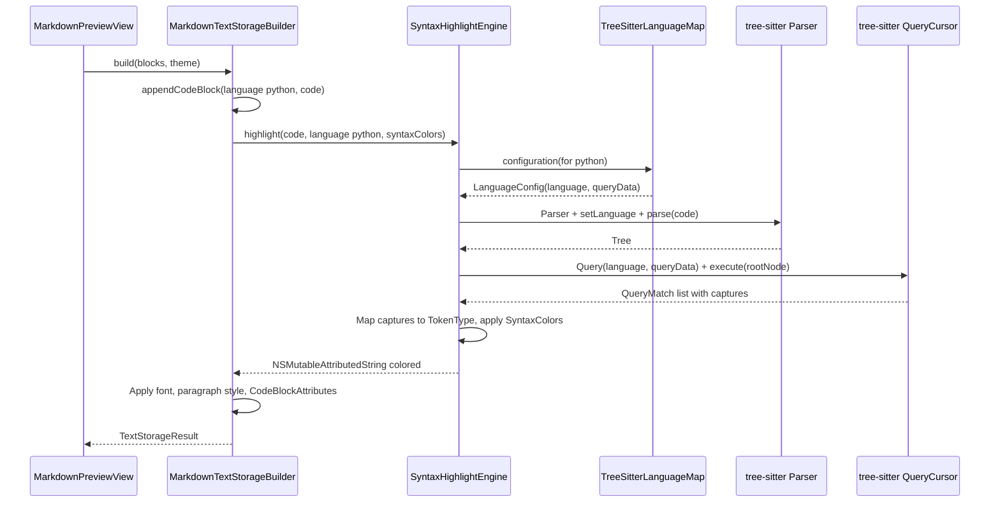
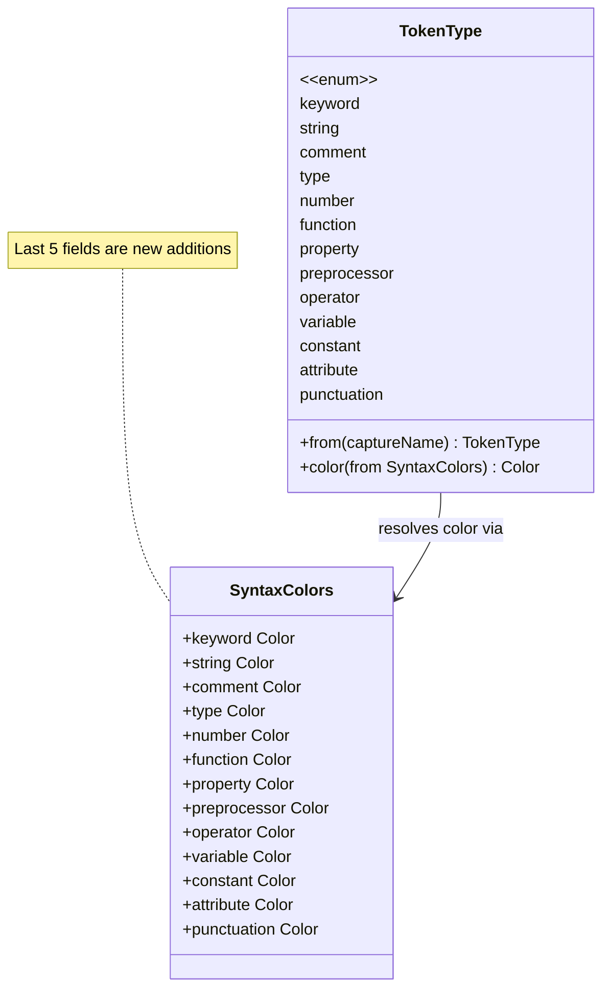

# Design: Multi-Language Syntax Highlighting

**Feature ID**: highlighting
**Version**: 1.0.0
**Created**: 2026-02-17

## 1. Design Overview

Replace the Splash-based Swift-only syntax highlighting with a tree-sitter-based engine that provides token-level coloring for 16 languages. The engine integrates synchronously into the existing `MarkdownTextStorageBuilder` pipeline, extends the `SyntaxColors` palette with 5 new token types, and maps tree-sitter highlight query captures to a universal `TokenType` enum for consistent coloring across all languages and themes.

### High-Level Architecture



## 2. Architecture

### Component Diagram



### Sequence: Code Block Highlighting



### Directory Structure

```
mkdn/Core/Highlighting/          (new directory)
    SyntaxHighlightEngine.swift   -- Public API: highlight(code:language:syntaxColors:)
    TreeSitterLanguageMap.swift   -- Language tag -> LanguageConfig resolution
    TokenType.swift               -- Universal token type enum + capture name mapping
    HighlightQueries.swift        -- Embedded highlight query strings for 16 languages
```

## 3. Detailed Design

### 3.1 TokenType Enum

A universal token type enum that all 16 languages map their tree-sitter captures to. This is the bridge between tree-sitter's capture names and `SyntaxColors` properties.

```swift
/// Universal syntax token types for cross-language highlighting.
enum TokenType: Sendable {
    case keyword        // control flow, declarations (def, class, if, fn, let)
    case string         // string literals, template strings
    case comment        // line comments, block comments, doc comments
    case type           // type names, type annotations, built-in types
    case number         // integer, float, hex literals
    case function       // function/method names at call and definition sites
    case property       // object properties, struct fields
    case preprocessor   // preprocessor directives, macros, compiler directives
    case `operator`     // arithmetic, comparison, logical, assignment operators
    case variable       // variable names, parameters (when distinctly captured)
    case constant       // boolean literals (true/false), nil/null, named constants
    case attribute      // decorators (@Observable), annotations (@override)
    case punctuation    // brackets, delimiters, semicolons

    /// Map a tree-sitter highlight capture name to a TokenType.
    /// Returns nil for captures that should use plain text color.
    static func from(captureName: String) -> TokenType? {
        // Capture names follow @category or @category.subcategory convention.
        // Match on prefix to handle subcategories.
        let base = captureName.split(separator: ".").first.map(String.init) ?? captureName
        switch base {
        case "keyword":                   return .keyword
        case "string":                    return .string
        case "comment":                   return .comment
        case "type":                      return .type
        case "number", "float":           return .number
        case "function", "method":        return .function
        case "property", "field":         return .property
        case "preproc", "include":        return .preprocessor
        case "operator":                  return .operator
        case "variable", "parameter":     return .variable
        case "constant", "boolean":       return .constant
        case "attribute", "decorator":    return .attribute
        case "punctuation":              return .punctuation
        case "constructor":              return .type
        case "label", "tag":            return .keyword
        case "namespace", "module":     return .type
        default:                         return nil
        }
    }

    /// Resolve to a Color from the given SyntaxColors palette.
    func color(from syntaxColors: SyntaxColors) -> Color {
        switch self {
        case .keyword:      return syntaxColors.keyword
        case .string:       return syntaxColors.string
        case .comment:      return syntaxColors.comment
        case .type:         return syntaxColors.type
        case .number:       return syntaxColors.number
        case .function:     return syntaxColors.function
        case .property:     return syntaxColors.property
        case .preprocessor: return syntaxColors.preprocessor
        case .operator:     return syntaxColors.operator
        case .variable:     return syntaxColors.variable
        case .constant:     return syntaxColors.constant
        case .attribute:    return syntaxColors.attribute
        case .punctuation:  return syntaxColors.punctuation
        }
    }
}
```

### 3.2 Extended SyntaxColors

Add 5 new token color fields to the existing `SyntaxColors` struct:

```swift
struct SyntaxColors: Sendable {
    // Existing (8)
    let keyword: Color
    let string: Color
    let comment: Color
    let type: Color
    let number: Color
    let function: Color
    let property: Color
    let preprocessor: Color
    // New (5)
    let `operator`: Color
    let variable: Color
    let constant: Color
    let attribute: Color
    let punctuation: Color
}
```

### 3.3 Theme Palette Assignments

Color assignments for new token types using the Solarized accent palette and base tones:

| Token Type | Solarized Dark | Solarized Light | Print |
|------------|---------------|-----------------|-------|
| `operator` | red (#dc322f) | red (#dc322f) | darkRedPink (#D73A49) |
| `variable` | base0 (#839496, foreground) | base00 (#657b83, foreground) | nearBlack (#1A1A1A) |
| `constant` | violet (#6c71c4) | violet (#6c71c4) | darkPurple (#6F42C1) |
| `attribute` | violet (#6c71c4) | violet (#6c71c4) | darkOrange (#B35900) |
| `punctuation` | base01 (#586e75, subdued) | base1 (#586e75, subdued) | commentGray (#6A737D) |

Rationale for color reuse:
- `operator` shares red with `preprocessor`: operators and preprocessor directives rarely co-occur in the same expression; both are structural elements.
- `variable` uses the standard foreground color: variables are the most common token type; a neutral color prevents visual noise.
- `constant` and `attribute` share violet: constants (true/false/nil) and attributes (@decorators) are both "special annotations" that benefit from a distinctive color without needing separate hues.
- `punctuation` uses the comment gray: brackets and delimiters are structural scaffolding that should recede visually.

### 3.4 TreeSitterLanguageMap

Maps language tag strings (case-insensitive, with aliases) to tree-sitter `Language` instances and highlight query data.

```swift
/// Configuration for a supported tree-sitter language.
struct LanguageConfig: Sendable {
    let language: Language          // tree-sitter Language from grammar package
    let highlightQuery: String      // highlight query (.scm) content
}

/// Maps Markdown fence language tags to tree-sitter language configurations.
enum TreeSitterLanguageMap {
    /// Alias table: lowercased tag -> canonical language name.
    private static let aliases: [String: String] = [
        "js": "javascript",
        "ts": "typescript",
        "py": "python",
        "rb": "ruby",
        "sh": "bash",
        "shell": "bash",
        "yml": "yaml",
        "cpp": "c++",
        // Canonical names map to themselves (handled by lookup logic)
    ]

    /// Resolve a language tag to a LanguageConfig, or nil if unsupported.
    static func configuration(for tag: String) -> LanguageConfig? {
        let normalized = tag.lowercased().trimmingCharacters(in: .whitespaces)
        let canonical = aliases[normalized] ?? normalized
        return languageConfigs[canonical]
    }

    /// All supported language configurations, keyed by canonical name.
    private static let languageConfigs: [String: LanguageConfig] = [
        "swift":      LanguageConfig(language: Language(tree_sitter_swift()),      highlightQuery: HighlightQueries.swift),
        "python":     LanguageConfig(language: Language(tree_sitter_python()),     highlightQuery: HighlightQueries.python),
        "javascript": LanguageConfig(language: Language(tree_sitter_javascript()), highlightQuery: HighlightQueries.javascript),
        "typescript": LanguageConfig(language: Language(tree_sitter_typescript()), highlightQuery: HighlightQueries.typescript),
        "rust":       LanguageConfig(language: Language(tree_sitter_rust()),       highlightQuery: HighlightQueries.rust),
        "go":         LanguageConfig(language: Language(tree_sitter_go()),         highlightQuery: HighlightQueries.go),
        "bash":       LanguageConfig(language: Language(tree_sitter_bash()),       highlightQuery: HighlightQueries.bash),
        "json":       LanguageConfig(language: Language(tree_sitter_json()),       highlightQuery: HighlightQueries.json),
        "yaml":       LanguageConfig(language: Language(tree_sitter_yaml()),       highlightQuery: HighlightQueries.yaml),
        "html":       LanguageConfig(language: Language(tree_sitter_html()),       highlightQuery: HighlightQueries.html),
        "css":        LanguageConfig(language: Language(tree_sitter_css()),        highlightQuery: HighlightQueries.css),
        "c":          LanguageConfig(language: Language(tree_sitter_c()),          highlightQuery: HighlightQueries.c),
        "c++":        LanguageConfig(language: Language(tree_sitter_cpp()),        highlightQuery: HighlightQueries.cpp),
        "ruby":       LanguageConfig(language: Language(tree_sitter_ruby()),       highlightQuery: HighlightQueries.ruby),
        "java":       LanguageConfig(language: Language(tree_sitter_java()),       highlightQuery: HighlightQueries.java),
        "kotlin":     LanguageConfig(language: Language(tree_sitter_kotlin()),     highlightQuery: HighlightQueries.kotlin),
    ]

    /// All supported canonical language names.
    static var supportedLanguages: [String] {
        Array(languageConfigs.keys).sorted()
    }
}
```

### 3.5 SyntaxHighlightEngine

The main public API. Stateless design -- parser and query are created per call. Thread-safe by construction (no shared mutable state).

```swift
/// Synchronous syntax highlighting engine using tree-sitter.
enum SyntaxHighlightEngine {
    /// Highlight code for a given language, returning a colored NSMutableAttributedString.
    /// Returns nil if the language is not supported (caller should fall back to plain text).
    static func highlight(
        code: String,
        language: String,
        syntaxColors: SyntaxColors
    ) -> NSMutableAttributedString? {
        guard let config = TreeSitterLanguageMap.configuration(for: language) else {
            return nil
        }

        let parser = Parser()
        do {
            try parser.setLanguage(config.language)
        } catch {
            return nil
        }

        guard let tree = parser.parse(code) else {
            return nil
        }

        let plainColor = PlatformTypeConverter.nsColor(from: syntaxColors.variable)

        // Start with plain-colored text
        let result = NSMutableAttributedString(
            string: code,
            attributes: [.foregroundColor: plainColor]
        )

        // Apply highlight query captures
        do {
            let queryData = Data(config.highlightQuery.utf8)
            let query = try Query(language: config.language, data: queryData)
            let cursor = QueryCursor(query: query)
            cursor.execute(node: tree.rootNode, in: tree)

            for match in cursor.matches() {
                for capture in match.captures {
                    let captureName = query.captureName(for: capture.index)
                    guard let tokenType = TokenType.from(captureName: captureName) else {
                        continue
                    }
                    let color = PlatformTypeConverter.nsColor(
                        from: tokenType.color(from: syntaxColors)
                    )
                    let nsRange = NSRange(capture.range, in: code)
                    result.addAttribute(.foregroundColor, value: color, range: nsRange)
                }
            }
        } catch {
            // Query compilation failed -- return plain text
            return result
        }

        return result
    }
}
```

### 3.6 HighlightQueries

Embedded tree-sitter highlight query strings for each language. These are the standard `highlights.scm` queries from each grammar's repository, embedded as Swift string constants.

```swift
/// Embedded tree-sitter highlight query strings for supported languages.
/// Sourced from each grammar's queries/highlights.scm file.
enum HighlightQueries {
    static let swift: String = """
    ; -- Swift highlight query (from tree-sitter-swift) --
    (import_declaration "import" @keyword)
    (function_declaration name: (simple_identifier) @function)
    ...
    """

    static let python: String = """
    ; -- Python highlight query (from tree-sitter-python) --
    ...
    """

    // ... one property per language
}
```

Each query string will be sourced from the corresponding grammar repository's `queries/highlights.scm` file during implementation, with minor adjustments if needed for capture name normalization.

### 3.7 Integration: MarkdownTextStorageBuilder Changes

**MarkdownTextStorageBuilder.swift** -- replace `highlightSwiftCode` with a generic method:

```swift
// MARK: - Syntax Highlighting

static func highlightCode(
    _ code: String,
    language: String,
    syntaxColors: SyntaxColors
) -> NSMutableAttributedString? {
    SyntaxHighlightEngine.highlight(
        code: code,
        language: language,
        syntaxColors: syntaxColors
    )
}
```

**MarkdownTextStorageBuilder+Blocks.swift** -- update `appendCodeBlock`:

```swift
let codeContent: NSMutableAttributedString
if let lang = language,
   let highlighted = highlightCode(trimmedCode, language: lang, syntaxColors: syntaxColors) {
    codeContent = highlighted
    codeContent.addAttribute(.font, value: monoFont, range: NSRange(location: 0, length: codeContent.length))
} else {
    // Fallback: plain monospace text (unsupported or no language tag)
    codeContent = NSMutableAttributedString(
        string: trimmedCode,
        attributes: [.font: monoFont, .foregroundColor: codeForeground]
    )
}
```

This replaces the current `if language == "swift"` check with a generic language lookup. Unsupported languages and untagged blocks fall through to the plain text path, preserving FR-5.

### Data Model: SyntaxColors Extension



## 4. Technology Stack

| Component | Technology | Rationale |
|-----------|-----------|-----------|
| Parser engine | SwiftTreeSitter (ChimeHQ/SwiftTreeSitter) | Industry-standard parser, synchronous API, Swift 6 compatible, SPM package |
| Grammar packages | tree-sitter-{language} SPM packages | Standard grammar distribution, compiled into binary |
| Highlight queries | Embedded .scm query strings | No runtime file loading, compile-time verifiable |
| Token mapping | `TokenType` enum with `from(captureName:)` | Type-safe, exhaustive, single source of truth |
| Color resolution | Extended `SyntaxColors` struct | Existing pattern, backward compatible |

### SPM Grammar Packages (16 Languages)

| Language | Package | C Function |
|----------|---------|------------|
| Swift | tree-sitter-grammars/tree-sitter-swift | `tree_sitter_swift` |
| Python | tree-sitter-grammars/tree-sitter-python | `tree_sitter_python` |
| JavaScript | tree-sitter-grammars/tree-sitter-javascript | `tree_sitter_javascript` |
| TypeScript | tree-sitter-grammars/tree-sitter-typescript | `tree_sitter_typescript` |
| Rust | tree-sitter-grammars/tree-sitter-rust | `tree_sitter_rust` |
| Go | tree-sitter-grammars/tree-sitter-go | `tree_sitter_go` |
| Bash | tree-sitter-grammars/tree-sitter-bash | `tree_sitter_bash` |
| JSON | tree-sitter-grammars/tree-sitter-json | `tree_sitter_json` |
| YAML | tree-sitter-grammars/tree-sitter-yaml | `tree_sitter_yaml` |
| HTML | tree-sitter-grammars/tree-sitter-html | `tree_sitter_html` |
| CSS | tree-sitter-grammars/tree-sitter-css | `tree_sitter_css` |
| C | tree-sitter-grammars/tree-sitter-c | `tree_sitter_c` |
| C++ | tree-sitter-grammars/tree-sitter-cpp | `tree_sitter_cpp` |
| Ruby | tree-sitter-grammars/tree-sitter-ruby | `tree_sitter_ruby` |
| Java | tree-sitter-grammars/tree-sitter-java | `tree_sitter_java` |
| Kotlin | fwcd/tree-sitter-kotlin | `tree_sitter_kotlin` |

## 5. Implementation Plan

### T1: Update Package.swift

Add SwiftTreeSitter and 16 grammar package dependencies. Add all grammar products to the `mkdnLib` target's dependencies list.

**Files**: `Package.swift`

### T2: Extend SyntaxColors and Update Theme Palettes

Add 5 new fields to `SyntaxColors` (operator, variable, constant, attribute, punctuation). Update all initializer call sites: `SolarizedDark.syntaxColors`, `SolarizedLight.syntaxColors`, `PrintPalette.syntaxColors`.

**Files**: `mkdn/UI/Theme/ThemeColors.swift`, `mkdn/UI/Theme/SolarizedDark.swift`, `mkdn/UI/Theme/SolarizedLight.swift`, `mkdn/UI/Theme/PrintPalette.swift`

### T3: Create TokenType Enum

Define the `TokenType` enum with `from(captureName:)` mapping and `color(from:)` resolution. Place in new `Core/Highlighting/` directory.

**Files**: `mkdn/Core/Highlighting/TokenType.swift` (new)

### T4: Create TreeSitterLanguageMap and HighlightQueries

Define `LanguageConfig` struct, `TreeSitterLanguageMap` enum with alias table and configuration lookup. Embed highlight query strings for all 16 languages sourced from grammar repositories.

**Files**: `mkdn/Core/Highlighting/TreeSitterLanguageMap.swift` (new), `mkdn/Core/Highlighting/HighlightQueries.swift` (new)

### T5: Create SyntaxHighlightEngine

Implement the stateless highlighting API: parse code with tree-sitter, execute highlight query, map captures to `TokenType`, apply colors from `SyntaxColors` to produce `NSMutableAttributedString`.

**Files**: `mkdn/Core/Highlighting/SyntaxHighlightEngine.swift` (new)

### T6: Integrate into MarkdownTextStorageBuilder

Replace `highlightSwiftCode()` with generic `highlightCode(language:code:syntaxColors:)`. Update `appendCodeBlock` to attempt highlighting for all language-tagged code blocks, falling back to plain text for unsupported languages and untagged blocks.

**Files**: `mkdn/Core/Markdown/MarkdownTextStorageBuilder.swift`, `mkdn/Core/Markdown/MarkdownTextStorageBuilder+Blocks.swift`

### T7: Remove Splash

Delete `ThemeOutputFormat.swift`. Remove `import Splash` from `MarkdownTextStorageBuilder.swift`. Remove Splash from `Package.swift` dependencies and mkdnLib target.

**Files**: `Package.swift`, `mkdn/Core/Markdown/ThemeOutputFormat.swift` (delete), `mkdn/Core/Markdown/MarkdownTextStorageBuilder.swift`

### T8: Unit Tests

Test language map resolution (canonical names, aliases, case insensitivity, unsupported languages). Test `TokenType.from(captureName:)` mapping. Test `SyntaxHighlightEngine.highlight()` produces colored output for each supported language and returns nil for unsupported languages. Test that highlighted output preserves the original text content.

**Files**: `mkdnTests/Unit/SyntaxHighlightEngineTests.swift` (new), `mkdnTests/Unit/TreeSitterLanguageMapTests.swift` (new)

## 6. Implementation DAG

**Parallel Groups** (tasks with no inter-dependencies):

1. [T1, T2, T3, T4] - T1 is package setup; T2 is palette extension; T3 and T4 are new type/data definitions. No data or interface dependencies between them.
2. [T5] - Engine implementation requires T1 (SwiftTreeSitter importable), T3 (TokenType enum), T4 (language map + queries).
3. [T6] - Integration requires T2 (extended SyntaxColors for new call sites) and T5 (highlight engine).
4. [T7, T8] - Splash removal requires T6 (replacement integrated). Tests require T5 + T6 (engine + integration to test).

**Dependencies**:

- T5 -> [T1, T3, T4] (interface: engine imports SwiftTreeSitter, uses TokenType and TreeSitterLanguageMap)
- T6 -> [T2, T5] (interface: appendCodeBlock uses extended SyntaxColors and SyntaxHighlightEngine)
- T7 -> T6 (sequential: Splash removed only after tree-sitter replacement is integrated)
- T8 -> [T5, T6] (interface: tests validate engine API and integration behavior)

**Critical Path**: T1 -> T5 -> T6 -> T7

## 7. Testing Strategy

### Test Value Assessment

| Test Category | Value | Rationale |
|---------------|-------|-----------|
| Language map resolution (aliases, case) | HIGH | App-specific business logic (BR-1, BR-2, BR-3) |
| TokenType capture name mapping | HIGH | App-specific translation layer between tree-sitter and palette |
| Engine produces colored output per language | HIGH | Core feature verification (FR-1) |
| Engine returns nil for unsupported language | HIGH | Graceful fallback behavior (FR-5) |
| Highlighted text preserves raw content | HIGH | Ensures rawCode/copy is unaffected (BR-5, NFR-5) |
| SyntaxColors has all 13 fields | LOW | Compiler enforces struct completeness -- skip |
| Tree-sitter parser creates successfully | LOW | Library behavior verification -- skip |
| Query compilation succeeds | LOW | Library behavior verification -- skip |

### Unit Tests

**TreeSitterLanguageMapTests** (`mkdnTests/Unit/TreeSitterLanguageMapTests.swift`):

| Test | Validates |
|------|-----------|
| Canonical names resolve (all 16) | FR-3, BR-3 |
| Aliases resolve: js, ts, py, rb, sh, shell, yml, cpp, c++ | AC-1.3, BR-2 |
| Case-insensitive: "Python", "PYTHON", "python" all resolve | BR-1 |
| Unsupported language returns nil | FR-5, BR-3 |
| Empty string returns nil | FR-5 |
| Whitespace-padded tags resolve | Defensive edge case |

**SyntaxHighlightEngineTests** (`mkdnTests/Unit/SyntaxHighlightEngineTests.swift`):

| Test | Validates |
|------|-----------|
| Swift code produces non-nil colored result | FR-1, FR-4 |
| Python code produces non-nil colored result | FR-1 |
| All 16 languages produce non-nil result | FR-1, FR-3 |
| Unsupported language returns nil | FR-5, AC-5.1 |
| Nil language returns nil (untagged block) | FR-5, AC-5.2 |
| Result string matches input code content | BR-5 (text preservation) |
| Result contains multiple foreground colors (not monochrome) | AC-1.2 |
| Keywords in Swift code ("func", "let") get keyword color | AC-1.2, FR-4 |

### Visual Verification

Post-implementation, use the existing mkdn-ctl visual testing workflow to verify:

1. Create a multi-language fixture file with code blocks in all 16 languages
2. Capture screenshots in both Solarized Dark and Solarized Light themes
3. Verify token coloring is visually distinguishable and theme-appropriate
4. Compare Swift highlighting before/after migration (FR-4, AC-4.4)

## 8. Deployment Design

No deployment changes. The feature is a library-level change compiled into the existing `mkdn` binary. Tree-sitter grammars are statically linked via SPM -- no runtime dependencies, no configuration, no migration.

**Binary size impact**: Estimated increase of 10-30 MB from 16 compiled grammar libraries. PRD explicitly deprioritizes binary size (NFR-2 note).

**Rollout**: Feature is always-on. No feature flag needed -- highlighting automatically applies to any language-tagged code block with a bundled grammar. No user-facing configuration.

## 9. Documentation Impact

| Type | Target | Section | KB Source | Rationale |
|------|--------|---------|-----------|-----------|
| edit | `.rp1/context/modules.md` | Dependencies table | modules.md:Dependencies | Add SwiftTreeSitter, remove Splash, add 16 grammar packages |
| edit | `.rp1/context/modules.md` | Core Layer / Markdown | modules.md:Core Layer | Update MarkdownTextStorageBuilder description (no longer "Splash syntax highlighting for Swift"), remove ThemeOutputFormat entry |
| add | `.rp1/context/modules.md` | Core Layer / Highlighting | modules.md:Core Layer | New section for Core/Highlighting/ with SyntaxHighlightEngine, TreeSitterLanguageMap, TokenType, HighlightQueries |
| edit | `.rp1/context/architecture.md` | Code Blocks rendering pipeline | architecture.md:Code Blocks | Update pipeline diagram: replace "Splash SyntaxHighlighter" with "SyntaxHighlightEngine (tree-sitter)" |
| edit | `.rp1/context/patterns.md` | Anti-Patterns | patterns.md:Anti-Patterns | Remove "NO WKWebView" note's implied Splash dependency; no action if wording is generic |
| edit | `.rp1/context/index.md` | Quick Reference | index.md:Quick Reference | Add "Syntax highlighting: mkdn/Core/Highlighting/" entry |

## 10. Design Decisions Log

| ID | Decision | Choice | Rationale | Alternatives Considered |
|----|----------|--------|-----------|------------------------|
| D1 | Highlighting engine approach | Tree-sitter highlight queries (.scm) | Industry standard, accurate context-aware capture names, maintained by grammar communities | Direct node-type walking (simpler but less accurate, requires per-language tables) |
| D2 | Engine statefulness | Stateless (parser+query created per call) | Thread-safe by construction, no shared mutable state, tree-sitter creation is sub-millisecond | Cached parsers/queries (@MainActor or nonisolated(unsafe) -- adds complexity for minimal performance gain) |
| D3 | Query embedding | String constants in Swift source | No runtime file loading, compile-time verifiable, no resource bundle complexity | Bundled .scm resource files (adds build configuration, runtime loading code) |
| D4 | Token type granularity | 13 types (8 existing + 5 new) | Balances tree-sitter richness with manageable palette; covers all AC-2.1 required types | Fewer types (less visual distinction), more types (palette exhaustion, diminishing returns) |
| D5 | Color reuse strategy | operator=red, variable=foreground, constant/attribute=violet, punctuation=gray | Stays within Solarized 8-accent palette; reuses between semantically related or low-co-occurrence types | Introducing non-Solarized colors (breaks theme consistency) |
| D6 | New file location | Core/Highlighting/ (new directory) | Separable concern from markdown parsing; own dependency (SwiftTreeSitter); follows Core/Mermaid/ pattern | Core/Markdown/ (existing location, but highlighting is not markdown-specific) |
| D7 | Splash removal timing | After tree-sitter integration is complete (T7 after T6) | Ensures Swift highlighting never regresses during development; clean switchover | Simultaneous removal (risk of broken Swift highlighting during development) |
| D8 | Fallback behavior for nil result | Return nil from engine, caller builds plain text | Clean separation of concerns; engine does not need to know about font/paragraph style | Engine returns plain-colored attributed string (couples engine to display concerns) |
