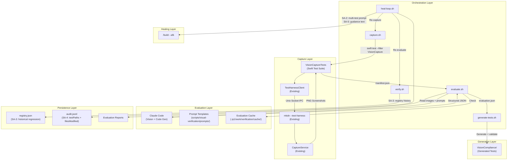
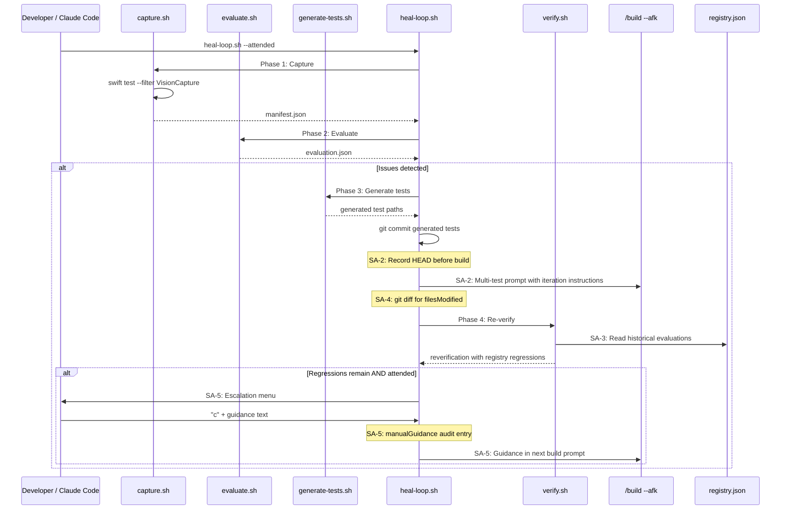

# Technical Design: LLM Visual Verification

**Feature ID**: llm-visual-verification
**Version**: 3.0.0
**Status**: Draft
**Created**: 2026-02-09
**Revised**: 2026-02-09 (v3: scope additions SA-1 through SA-5)

## 1. Design Overview

This design specifies an autonomous design compliance workflow that uses Claude Code's built-in vision capabilities to evaluate mkdn's rendered output against the project's design specifications, detect visual deviations, generate failing tests that encode those deviations, invoke `/build --afk` to fix them, and re-verify the result. The workflow operates entirely outside the mkdn application -- it is developer tooling that orchestrates existing infrastructure without modifying mkdn's source architecture.

The system has three implementation layers:

1. **Shell scripts** (in `scripts/visual-verification/`): Bash scripts that orchestrate each phase of the workflow -- capture, evaluate, generate tests, heal, and verify. These are the primary entry points, invoked directly by Claude Code or the human developer via Bash.
2. **Swift test infrastructure** (in `mkdnTests/`): A capture orchestrator test suite that uses the existing test harness to produce deterministic screenshots, and a VisionCompliance test directory where generated tests live.
3. **CLAUDE.md documentation**: Instructions added to the project's CLAUDE.md that tell Claude Code how to invoke the verification workflow.

Prompt templates live in `scripts/visual-verification/prompts/` alongside the orchestration scripts. Persistent state (cache, registry, audit trail, reports) lives in `.rp1/work/verification/`. No rp1 skill plugin infrastructure is used.

### v3 Scope Additions

This revision adds five scope additions (SA-1 through SA-5) to the existing v2 design:

| ID | Addition | Primary Artifact |
|----|----------|-----------------|
| SA-1 | Runtime verification of 8-capture suite | VisionCaptureTests.swift (validation) |
| SA-2 | Multi-test build invocation with iteration | heal-loop.sh (build prompt restructuring) |
| SA-3 | Registry-based regression detection | verify.sh (historical comparison) |
| SA-4 | Audit completeness (test paths + files modified) | heal-loop.sh (audit entry enhancement) |
| SA-5 | Attended mode "Continue with manual guidance" | heal-loop.sh (interactive guidance) |

### High-Level Architecture



## 2. Architecture

### 2.1 System Layers

| Layer | Location | Responsibility |
|-------|----------|----------------|
| Orchestration | `scripts/visual-verification/` | Bash scripts: each phase is a standalone script that can be run independently or chained |
| Capture | `mkdnTests/UITest/VisionCompliance/VisionCaptureTests.swift` | Deterministic screenshot capture using existing test harness |
| Evaluation | Claude Code + `scripts/visual-verification/prompts/` | Vision evaluation of screenshots against PRD specifications |
| Persistence | `.rp1/work/verification/` | Cache, registry, audit trail, reports |
| Documentation | `CLAUDE.md` | Instructions for invoking the workflow |

### 2.2 Script Orchestration Flow (Updated for SA-2 + SA-5)



### 2.3 Component Responsibilities

| Component | Type | Responsibility |
|-----------|------|----------------|
| `capture.sh` | Shell Script | Build mkdn, run capture test suite, validate manifest output |
| `evaluate.sh` | Shell Script | Assemble evaluation context from prompts + PRDs, check cache, invoke Claude Code for vision evaluation, write evaluation report |
| `generate-tests.sh` | Shell Script | Read evaluation report, generate Swift test files from issue data, validate compilation and failure, stage for commit |
| `heal-loop.sh` | Shell Script | Top-level orchestrator: chain capture -> evaluate -> generate -> fix -> verify with bounded iteration. **SA-2**: Multi-test build prompts. **SA-4**: Enhanced audit. **SA-5**: Interactive guidance. |
| `verify.sh` | Shell Script | Re-capture + re-evaluate after a fix, compare against previous evaluation **and registry history (SA-3)**, detect regressions |
| `VisionCaptureTests.swift` | Swift Test Suite | Capture screenshots of all fixtures across themes/modes, write manifest |
| `VisionCapturePRD.swift` | Swift Test Support | Harness singleton, fixture paths, capture helpers, manifest writing |
| `VisionCompliancePRD.swift` | Swift Test Support | Shared harness for generated tests, fixture paths, extraction helpers |
| `evaluation-prompt.md` | Prompt Template | Base prompt template for vision evaluation |
| `prd-context-*.md` | Prompt Templates | PRD excerpt templates for evaluation context |
| `output-schema.json` | Schema | Evaluation output JSON schema |
| `test-template-*.md` | Templates | Patterns for generated Swift test files |
| `manifest.json` | JSON Artifact | Manifest of captured screenshots with metadata |
| `registry.json` | JSON Artifact | Persistent regression registry **(SA-3: read for historical comparison)** |
| `audit.jsonl` | JSON Lines | Audit trail of all operations **(SA-4: enhanced entries)** |
| `{timestamp}-evaluation.json` | JSON Report | Per-run evaluation report |
| `{timestamp}-escalation.json` | JSON Report | Human escalation report (when needed) |

## 3. Detailed Design

### 3.1 Shell Script Conventions

All scripts follow the existing `scripts/` conventions established by `release.sh` and `smoke-test.sh`:

```bash
#!/usr/bin/env bash
set -euo pipefail

SCRIPT_DIR="$(cd "$(dirname "${BASH_SOURCE[0]}")" && pwd)"
PROJECT_ROOT="$(cd "${SCRIPT_DIR}/../.." && pwd)"
VERIFICATION_DIR="${PROJECT_ROOT}/.rp1/work/verification"
```

Each script:
- Uses `set -euo pipefail` for strict error handling
- Resolves `PROJECT_ROOT` from `SCRIPT_DIR` for absolute path construction
- Logs progress with `info()` and errors with `error()` helper functions
- Returns exit code 0 on success, non-zero on failure
- Accepts configuration via command-line flags (e.g., `--dry-run`, `--max-iterations 3`)
- Writes structured output to files in `.rp1/work/verification/` rather than relying on stdout parsing

### 3.2 capture.sh

**Purpose**: Build mkdn and run the capture orchestrator test suite to produce deterministic screenshots.

**Usage**:
```bash
scripts/visual-verification/capture.sh [--skip-build]
```

**Behavior**:
1. Build mkdn: `swift build --product mkdn` (skipped with `--skip-build`)
2. Run capture suite: `swift test --filter VisionCapture 2>&1`
3. Validate manifest: check `.rp1/work/verification/captures/manifest.json` exists and has entries
4. Exit 0 if manifest is valid, exit 1 on any failure

**Output**: Screenshots in `.rp1/work/verification/captures/` and a `manifest.json`.

The script itself does not interact with the test harness directly -- it delegates to the Swift test suite which has access to `TestHarnessClient` and `AppLauncher`.

### 3.3 evaluate.sh

**Purpose**: Assemble evaluation context from prompt templates and PRD files, check the cache, and invoke Claude Code for vision evaluation.

**Usage**:
```bash
scripts/visual-verification/evaluate.sh [--dry-run] [--batch-size 4] [--force-fresh]
```

**Behavior**:
1. Read `manifest.json` from captures directory
2. Compute cache key: SHA-256 of (sorted image hashes from manifest + prompt template hash + PRD file hashes)
3. Check cache: if `.rp1/work/verification/cache/{cacheKey}.json` exists, copy it as the evaluation result and exit
4. Assemble evaluation prompt:
   - Read charter design philosophy from `.rp1/context/charter.md`
   - Read relevant PRD excerpts from prompt templates in `scripts/visual-verification/prompts/`
   - Read evaluation criteria from `evaluation-prompt.md`
   - Read output schema from `output-schema.json`
   - Concatenate into a single assembled prompt file at `.rp1/work/verification/current-prompt.md`
5. Group captures into batches by fixture (same fixture, both themes = 1 batch)
6. If `--dry-run`: write dry-run report and exit
7. For each batch:
   - Write a batch-specific prompt file that includes the assembled prompt + image file paths
   - The actual vision evaluation is performed by Claude Code reading the prompt and images
   - Claude Code writes the evaluation result as JSON
8. Merge batch results into a single evaluation report at `.rp1/work/verification/reports/{timestamp}-evaluation.json`
9. Populate cache entry
10. Append audit trail entry

**How Claude Code performs the evaluation**: The `evaluate.sh` script prepares all context files and writes a structured task description to `.rp1/work/verification/current-evaluation-task.md`. This task file instructs Claude Code (via CLAUDE.md documentation) to:
- Read the assembled prompt
- Read each screenshot image in the batch
- Evaluate the images against the specifications
- Write structured JSON output to a designated path

The script then reads that JSON output and proceeds.

**Cache Key Computation**:
```bash
# Compute SHA-256 for each input file, sort, and hash the concatenation
IMAGE_HASHES=$(cat manifest.json | jq -r '.captures[].imageHash' | sort)
PROMPT_HASH=$(shasum -a 256 prompts/evaluation-prompt.md | awk '{print $1}')
PRD_HASHES=$(shasum -a 256 ${PROJECT_ROOT}/.rp1/work/prds/spatial-design-language.md \
    ${PROJECT_ROOT}/.rp1/work/prds/terminal-consistent-theming.md \
    ... | awk '{print $1}' | sort)
CACHE_KEY=$(echo "${IMAGE_HASHES}${PROMPT_HASH}${PRD_HASHES}" | shasum -a 256 | awk '{print $1}')
```

### 3.4 generate-tests.sh

**Purpose**: Read the evaluation report and generate Swift Testing test files for each medium/high confidence issue.

**Usage**:
```bash
scripts/visual-verification/generate-tests.sh [evaluation-report-path]
```

**Behavior**:
1. Read the evaluation report JSON
2. Filter issues: only `confidence: "medium"` or `confidence: "high"`
3. For each qualifying issue:
   a. Determine test type (spatial, visual, qualitative) from the issue data
   b. Read the appropriate test template from `scripts/visual-verification/prompts/test-template-{type}.md`
   c. Generate a Swift test file using Claude Code: the script writes a generation task file that includes the issue details, the test template, and the target file path. Claude Code reads this and writes the Swift file.
   d. Run `swift build` to validate compilation. If it fails, discard the file and log to audit.
   e. Run `swift test --filter {testName}` to validate the test currently fails. If it passes, discard (false positive) and log.
4. Write a generation summary to stdout listing generated test paths
5. Append audit trail entries for each generation attempt (success or failure)

**Generated Test Naming Convention**: `VisionDetected_{PRD}_{FR}_{aspect}.swift`

Example: `VisionDetected_spatialDesignLanguage_FR3_h1SpaceAbove.swift`

**Atomic Staging**: Tests are written to a staging directory first (`.rp1/work/verification/staging/`), validated, and only then moved to `mkdnTests/UITest/VisionCompliance/`. This prevents partial or broken test files from entering the codebase.

### 3.5 heal-loop.sh (Updated for SA-2, SA-4, SA-5)

**Purpose**: Top-level orchestrator that runs the full capture-evaluate-generate-fix-verify loop with bounded iteration.

**Usage**:
```bash
scripts/visual-verification/heal-loop.sh [--max-iterations 3] [--dry-run] [--attended] [--skip-build]
```

**Behavior**:
```
iteration = 0
max_iterations = $MAX_ITERATIONS (default 3)
manual_guidance = ""

# Phase 1: Initial capture + evaluate
capture.sh
evaluate.sh
issues = parse evaluation report

if no issues:
    write clean report
    exit 0

while iteration < max_iterations and issues exist:
    iteration++

    # Phase 2: Generate failing tests
    generate-tests.sh evaluation-report.json
    generated_tests = parse generation summary

    if no tests generated (all discarded):
        write escalation report (all issues low-confidence or failed validation)
        exit 0

    # Phase 3: Commit + fix
    git add mkdnTests/UITest/VisionCompliance/
    git commit -m "test: vision-detected failing tests for {PRD refs}"

    # SA-2: Record HEAD before build for diff
    pre_build_head = $(git rev-parse HEAD)

    # SA-2: Build structured multi-test prompt
    # SA-5: Include manual_guidance if set
    invoke /build --afk with multi-test context + iteration instructions

    # SA-4: Capture files modified
    files_modified = $(git diff --name-only $pre_build_head HEAD)

    # SA-4: Enhanced audit entry with testPaths + filesModified
    append buildInvocation audit with testPaths, filesModified

    # Phase 4: Re-verify (SA-3: includes registry history check)
    verify.sh
    issues = parse re-verification report

    update registry
    append audit trail

    # Clear manual guidance (SA-5: applies only to one iteration)
    manual_guidance = ""

    if all resolved:
        write success report; exit 0

    if attended and issues remain:
        handle_escalation (may set manual_guidance via SA-5)

if issues remain:
    write escalation report
    exit 1
else:
    write success report
    exit 0
```

#### 3.5.1 SA-2: Multi-Test Build Prompt Structure

The build prompt is restructured to provide complete context for all failing tests and explicit iteration instructions:

```text
/build {FEATURE_ID} AFK=true

## Task

Fix the following vision-detected design compliance test failures.
These tests encode visual deviations detected by LLM visual verification.

## Failing Tests

### Test 1: {test_file_name_1}
- **File**: {absolute_path_1}
- **PRD Reference**: {prd_ref_1}
- **Specification**: {spec_excerpt_1}
- **Issue**: {observation_1}

### Test 2: {test_file_name_2}
- **File**: {absolute_path_2}
- **PRD Reference**: {prd_ref_2}
- **Specification**: {spec_excerpt_2}
- **Issue**: {observation_2}

## Iteration Instructions

Fix all failing tests listed above. After making changes:

1. Run `swift test --filter VisionDetected` to check which tests now pass.
2. If any tests still fail, analyze the failure and make additional fixes.
3. Repeat until all listed tests pass or you determine a test cannot be fixed
   without changing the specification.
4. Report which tests you fixed and which remain failing.

## Evaluation Report

{evaluation_report_path}

{DEVELOPER_GUIDANCE_SECTION}
```

The `{DEVELOPER_GUIDANCE_SECTION}` is empty by default. When SA-5 manual guidance is provided, it becomes:

```text
## Developer Guidance

{verbatim guidance text from developer}
```

#### 3.5.2 SA-2: Build Result Detail Capture

After the `/build --afk` invocation completes:

```bash
# Record HEAD before build (already set before invoking build)
# After build:
POST_BUILD_HEAD=$(git -C "${PROJECT_ROOT}" rev-parse HEAD)

# Capture files modified
FILES_MODIFIED="[]"
if [ "${PRE_BUILD_HEAD}" != "${POST_BUILD_HEAD}" ]; then
    FILES_MODIFIED=$(git -C "${PROJECT_ROOT}" diff --name-only "${PRE_BUILD_HEAD}" HEAD | \
        jq -R . | jq -s .)
fi

# Check which tests now pass
TESTS_FIXED=()
TESTS_REMAINING=()
for test_path in ${TEST_PATHS}; do
    suite_name=$(grep -oE '@Suite\("VisionDetected_[^"]*"' "${test_path}" | \
        sed 's/@Suite("//;s/"//' | head -1) || true
    if [ -n "${suite_name}" ]; then
        if swift test --filter "${suite_name}" 2>&1 | tail -1 | grep -q "passed"; then
            TESTS_FIXED+=("${test_path}")
        else
            TESTS_REMAINING+=("${test_path}")
        fi
    fi
done
```

#### 3.5.3 SA-4: Enhanced Audit Entry

The `buildInvocation` audit entry is enhanced with `testPaths` and `filesModified`:

```json
{
  "type": "buildInvocation",
  "timestamp": "2026-02-09T18:00:00Z",
  "loopId": "loop-2026-02-09-180000",
  "iteration": 1,
  "result": "success",
  "prdRefs": "spatial-design-language FR-3, terminal-consistent-theming FR-2",
  "testPaths": [
    "mkdnTests/UITest/VisionCompliance/VisionDetected_spatialDesignLanguage_FR3_h1SpaceAbove.swift",
    "mkdnTests/UITest/VisionCompliance/VisionDetected_terminalConsistentTheming_FR2_codeBlockBg.swift"
  ],
  "filesModified": [
    "mkdn/UI/Theme/ThemeColors.swift",
    "mkdn/Core/Markdown/MarkdownBlockView.swift"
  ],
  "testsFixed": ["VisionDetected_spatialDesignLanguage_FR3_h1SpaceAbove"],
  "testsRemaining": ["VisionDetected_terminalConsistentTheming_FR2_codeBlockBg"]
}
```

Construction in shell:

```bash
# Convert space-separated TEST_PATHS to JSON array (project-relative)
TEST_PATHS_JSON=$(echo "${TEST_PATHS}" | tr ' ' '\n' | grep -v '^$' | \
    sed "s|${PROJECT_ROOT}/||" | jq -R . | jq -s .)

# FILES_MODIFIED already constructed as JSON array above

# TESTS_FIXED and TESTS_REMAINING as JSON arrays
TESTS_FIXED_JSON=$(printf '%s\n' "${TESTS_FIXED[@]+"${TESTS_FIXED[@]}"}" | \
    grep -v '^$' | jq -R . | jq -s . 2>/dev/null || echo "[]")
TESTS_REMAINING_JSON=$(printf '%s\n' "${TESTS_REMAINING[@]+"${TESTS_REMAINING[@]}"}" | \
    grep -v '^$' | jq -R . | jq -s . 2>/dev/null || echo "[]")

append_audit "$(jq -cn \
    --arg type "buildInvocation" \
    --arg ts "$(date -u +"%Y-%m-%dT%H:%M:%SZ")" \
    --arg lid "${LOOP_ID}" \
    --argjson iter "${ITERATION}" \
    --arg result "${BUILD_RESULT}" \
    --arg prds "${PRD_REFS}" \
    --argjson testPaths "${TEST_PATHS_JSON}" \
    --argjson filesModified "${FILES_MODIFIED}" \
    --argjson testsFixed "${TESTS_FIXED_JSON}" \
    --argjson testsRemaining "${TESTS_REMAINING_JSON}" \
    '{type: $type, timestamp: $ts, loopId: $lid, iteration: $iter,
     result: $result, prdRefs: $prds, testPaths: $testPaths,
     filesModified: $filesModified, testsFixed: $testsFixed,
     testsRemaining: $testsRemaining}')"
```

#### 3.5.4 SA-5: Attended Mode "Continue with Manual Guidance"

The `handle_escalation()` function is updated to support interactive continuation. When the developer selects `c`, the function:

1. Prints a clear guidance prompt explaining expected input
2. Reads multi-line text from stdin (terminated by an empty line or EOF)
3. Validates the input is non-empty (re-prompts if empty)
4. Sanitizes the text for JSON safety (escapes special characters)
5. Stores the guidance in a variable accessible to the caller
6. Appends a `manualGuidance` audit entry
7. Returns a signal indicating the loop should continue (not escalate)

```bash
# In handle_escalation(), case "c":
c|C)
    echo ""
    echo "Enter your guidance for the next fix iteration."
    echo "The text will be included verbatim in the build prompt."
    echo "Finish with an empty line or Ctrl-D."
    echo ""

    GUIDANCE_TEXT=""
    while IFS= read -r line; do
        if [ -z "${line}" ] && [ -n "${GUIDANCE_TEXT}" ]; then
            break
        fi
        if [ -n "${GUIDANCE_TEXT}" ]; then
            GUIDANCE_TEXT="${GUIDANCE_TEXT}\n${line}"
        else
            GUIDANCE_TEXT="${line}"
        fi
    done

    if [ -z "${GUIDANCE_TEXT}" ]; then
        warn "Empty guidance -- please provide guidance text"
        # Re-prompt (recursive call or loop)
        handle_escalation "${reason}" "${eval_report}" "${reverify_report}"
        return
    fi

    echo ""
    info "Guidance captured (${#GUIDANCE_TEXT} chars):"
    echo -e "${GUIDANCE_TEXT}" | head -5
    if [ "$(echo -e "${GUIDANCE_TEXT}" | wc -l)" -gt 5 ]; then
        echo "  ... (truncated in preview)"
    fi
    echo ""

    # Store for next iteration's build prompt
    MANUAL_GUIDANCE="${GUIDANCE_TEXT}"

    # Append audit entry
    # Sanitize for JSON: use jq --arg which handles escaping
    append_audit "$(jq -cn \
        --arg type "manualGuidance" \
        --arg ts "$(date -u +"%Y-%m-%dT%H:%M:%SZ")" \
        --arg lid "${LOOP_ID}" \
        --argjson iter "${ITERATION}" \
        --arg guidance "${GUIDANCE_TEXT}" \
        '{type: $type, timestamp: $ts, loopId: $lid,
         iteration: $iter, guidance: $guidance}')"

    # Signal: continue the loop (do not write escalation report)
    ESCALATION_ACTION="continue"
    ;;
```

The caller checks `ESCALATION_ACTION` after `handle_escalation()` returns:
- `"continue"`: proceed with next iteration using `MANUAL_GUIDANCE`
- `"skip"` or `"quit"`: break the loop as before

**Guidance sanitization**: The `jq --arg` flag automatically handles JSON escaping of the guidance text, preventing JSON corruption. Shell injection is not a concern because the guidance text is never passed through `eval` or used in command construction -- it is embedded directly into the Claude CLI prompt string via a heredoc or variable expansion.

### 3.6 verify.sh (Updated for SA-3)

**Purpose**: Re-capture screenshots and re-evaluate after a fix, comparing against the previous evaluation **and the full registry history** to detect regressions.

**Usage**:
```bash
scripts/visual-verification/verify.sh [previous-evaluation-path]
```

**Behavior (updated)**:
1. Run `capture.sh --skip-build` (mkdn was already rebuilt by /build --afk)
2. Run `evaluate.sh --force-fresh` (forces fresh evaluation, bypasses cache since images changed)
3. **Phase 3a**: Compare new evaluation against previous evaluation (existing behavior):
   - Issues present in previous but absent in new = resolved
   - Issues absent in previous but present in new = regression (from previous eval)
   - Issues present in both = remaining
4. **Phase 3b (SA-3)**: Registry historical regression check:
   - For each issue in the new evaluation, look up the capture's registry entry
   - Scan all historical evaluations for that captureId
   - If the issue's PRD reference was previously marked `"status": "resolved"` in any historical evaluation, classify it as a **reintroduced regression** (not a new issue)
   - Attach the original resolution timestamp for context
5. Write re-verification report (enhanced with `reintroducedRegressions` section)
6. Update registry with resolution status
7. Append audit trail

#### 3.6.1 SA-3: Registry Historical Comparison

```bash
# Phase 3b: Registry-based regression detection (SA-3)
info "Phase 3b: Checking registry for historical regressions"

REINTRODUCED_REGRESSIONS=()

# For each issue in the new evaluation, check registry history
NEW_ISSUE_COUNT=$(jq '.issues | length' "${NEW_EVAL}" 2>/dev/null || echo "0")
for i in $(seq 0 $((NEW_ISSUE_COUNT - 1))); do
    ISSUE_PRD=$(jq -r ".issues[$i].prdReference" "${NEW_EVAL}")
    ISSUE_CAPTURE=$(jq -r ".issues[$i].captureId" "${NEW_EVAL}")

    # Skip if this issue was already classified as a regression from previous-eval comparison
    if printf '%s\n' "${REGRESSION_ISSUES[@]+"${REGRESSION_ISSUES[@]}"}" | grep -qF "${ISSUE_PRD}"; then
        continue
    fi

    # Skip if this issue was already classified as remaining from previous-eval comparison
    if printf '%s\n' "${REMAINING_ISSUES[@]+"${REMAINING_ISSUES[@]}"}" | grep -qF "${ISSUE_PRD}"; then
        continue
    fi

    # Look up this captureId in the registry
    REGISTRY_ENTRY=$(jq -c --arg cid "${ISSUE_CAPTURE}" \
        '.entries[] | select(.captureId == $cid)' \
        "${REGISTRY_FILE}" 2>/dev/null) || true

    if [ -z "${REGISTRY_ENTRY}" ]; then
        continue  # No history for this capture
    fi

    # Scan all historical evaluations for this PRD reference with status "resolved"
    RESOLVED_MATCH=$(echo "${REGISTRY_ENTRY}" | jq -r \
        --arg prd "${ISSUE_PRD}" \
        '[.evaluations[].issues[] |
         select(.prdReference == $prd and .status == "resolved")] |
         sort_by(.resolvedAt) | last |
         .resolvedAt // empty')

    if [ -n "${RESOLVED_MATCH}" ]; then
        info "  Reintroduced regression: ${ISSUE_PRD} (previously resolved at ${RESOLVED_MATCH})"
        REINTRODUCED_REGRESSIONS+=("${ISSUE_PRD}|${RESOLVED_MATCH}")
    fi
done
```

The re-verification report is enhanced with a `reintroducedRegressions` section:

```json
{
  "previousEvaluationId": "eval-...",
  "newEvaluationId": "eval-...",
  "timestamp": "...",
  "summary": {
    "resolved": 2,
    "regressions": 1,
    "remaining": 1,
    "reintroducedRegressions": 1
  },
  "resolvedIssues": [...],
  "newRegressions": [...],
  "remainingIssues": [...],
  "reintroducedRegressions": [
    {
      "prdReference": "spatial-design-language FR-3",
      "previouslyResolvedAt": "2026-02-09T18:30:00Z",
      "currentObservation": "...",
      "severity": "major",
      "confidence": "high"
    }
  ]
}
```

The `verify.sh` stdout key=value output is extended:

```
REINTRODUCED_REGRESSIONS={count}
```

This allows `heal-loop.sh` to factor reintroduced regressions into its continuation decision.

### 3.7 SA-1: Runtime Verification

SA-1 is primarily a validation task, not a code change. The capture orchestrator (`VisionCaptureTests.swift`) already validates its own output within the `validateCaptureResults()` method:

1. Asserts 8 captures produced
2. Verifies manifest.json exists
3. Checks each PNG file exists with non-zero dimensions
4. Validates SHA-256 hash format

**Runtime verification procedure**:
```bash
# Run the capture suite in a macOS GUI session
swift test --filter VisionCapture

# Verify 8 entries in manifest
jq '.captures | length' .rp1/work/verification/captures/manifest.json
# Expected: 8

# Verify all expected capture IDs present
jq -r '.captures[].id' .rp1/work/verification/captures/manifest.json | sort
# Expected 8 IDs matching the 4-fixture x 2-theme matrix
```

**SA-1 Capture Stability (REQ-SA1-002)**: The capture orchestrator already produces deterministic screenshots (same fixtures, same theme settings, same render pipeline). The manifest.json from the current run shows all 8 captures with valid hashes. To verify stability, the operator runs the suite twice consecutively and compares the image hashes:

```bash
# First run
swift test --filter VisionCapture
cp .rp1/work/verification/captures/manifest.json /tmp/manifest-run1.json

# Second run
swift test --filter VisionCapture

# Compare hashes (ignoring timestamp)
diff <(jq -r '.captures[] | "\(.id) \(.imageHash)"' /tmp/manifest-run1.json | sort) \
     <(jq -r '.captures[] | "\(.id) \(.imageHash)"' .rp1/work/verification/captures/manifest.json | sort)
# Expected: no differences
```

No additional Swift code is required for SA-1. The existing test suite already performs the validation specified in REQ-SA1-001.

### 3.8 Capture Orchestrator (Swift)

**Files**: `mkdnTests/UITest/VisionCompliance/VisionCaptureTests.swift`, `mkdnTests/UITest/VisionCompliance/VisionCapturePRD.swift`

The capture orchestrator is a Swift Testing suite that uses the existing test harness to produce deterministic screenshots. It follows the same patterns as SpatialComplianceTests, VisualComplianceTests, and AnimationComplianceTests.

**Capture Matrix**:

| Dimension | Values |
|-----------|--------|
| Fixtures | `canonical.md`, `theme-tokens.md`, `mermaid-focus.md`, `geometry-calibration.md` |
| Themes | `solarizedDark`, `solarizedLight` |
| Modes | `previewOnly` |

Side-by-side mode is excluded from the initial capture matrix because it introduces editor pane variability. Preview-only mode captures the pure rendering output.

**Capture Output**: Screenshots are saved to `.rp1/work/verification/captures/` with deterministic naming:

```
{fixture}-{theme}-{mode}.png
```

Example: `canonical-solarizedDark-previewOnly.png`

**Manifest Output**: A manifest file at `.rp1/work/verification/captures/manifest.json` records metadata for each capture:

```json
{
  "captureTimestamp": "2026-02-09T18:00:00Z",
  "captures": [
    {
      "id": "canonical-solarizedDark-previewOnly",
      "imagePath": ".rp1/work/verification/captures/canonical-solarizedDark-previewOnly.png",
      "fixture": "canonical.md",
      "theme": "solarizedDark",
      "viewMode": "previewOnly",
      "width": 1600,
      "height": 1200,
      "scaleFactor": 2.0,
      "imageHash": "sha256:abcdef..."
    }
  ]
}
```

**Harness Pattern**: Follows the existing shared-harness singleton pattern:

```swift
enum VisionCaptureHarness {
    nonisolated(unsafe) static var launcher: AppLauncher?
    nonisolated(unsafe) static var client: TestHarnessClient?

    static func ensureRunning() async throws -> TestHarnessClient {
        if let existing = client {
            let pong = try await existing.ping()
            if pong.status == "ok" { return existing }
        }
        let newLauncher = AppLauncher()
        let newClient = try await newLauncher.launch(buildFirst: false)
        launcher = newLauncher
        client = newClient
        return newClient
    }
}
```

### 3.9 Evaluation Prompt Construction

The evaluation prompt is constructed deterministically from three sources:

1. **Charter design philosophy** (`.rp1/context/charter.md`, "Design Philosophy" section)
2. **PRD excerpts** (relevant PRD functional requirements from `.rp1/work/prds/`)
3. **Evaluation criteria** (structured criteria from the prompt template)

**PRD Excerpt Selection**: The prompt includes excerpts from PRDs relevant to the captures being evaluated:

| Capture Fixture | Relevant PRDs |
|-----------------|---------------|
| `canonical.md` | spatial-design-language, cross-element-selection |
| `theme-tokens.md` | terminal-consistent-theming, syntax-highlighting |
| `mermaid-focus.md` | mermaid-rendering |
| `geometry-calibration.md` | spatial-design-language |

**Determinism**: The prompt is constructed from file contents that are version-controlled. The same git state produces the same prompt. No timestamps, random values, or external state are included in the prompt.

### 3.10 Evaluation Output Schema

Each evaluation produces a structured JSON result:

```json
{
  "evaluationId": "eval-2026-02-09-180000",
  "promptHash": "sha256:...",
  "captures": [
    {
      "captureId": "canonical-solarizedDark-previewOnly",
      "imageHash": "sha256:..."
    }
  ],
  "issues": [
    {
      "issueId": "ISS-001",
      "captureId": "canonical-solarizedDark-previewOnly",
      "prdReference": "spatial-design-language FR-3",
      "specificationExcerpt": "H1 headings have 48pt space above",
      "observation": "The space above the H1 heading appears to be approximately 24pt, roughly half the specified value",
      "deviation": "Space above H1 heading is 24pt instead of the specified 48pt",
      "severity": "major",
      "confidence": "high",
      "suggestedAssertion": {
        "type": "spatial",
        "metric": "h1SpaceAbove",
        "expected": 48,
        "tolerance": 2
      }
    }
  ],
  "qualitativeFindings": [
    {
      "findingId": "QF-001",
      "captureId": "canonical-solarizedDark-previewOnly",
      "reference": "charter:design-philosophy",
      "observation": "The spacing between the code block and the following paragraph creates an uneven rhythm compared to paragraph-to-paragraph spacing",
      "assessment": "The vertical rhythm is slightly inconsistent -- code blocks create visual breaks that feel heavier than the paragraph flow",
      "severity": "minor",
      "confidence": "medium"
    }
  ],
  "summary": {
    "totalCaptures": 8,
    "issuesDetected": 3,
    "qualitativeFindings": 2,
    "bySeverity": { "critical": 0, "major": 2, "minor": 3 },
    "byConfidence": { "high": 2, "medium": 2, "low": 1 }
  }
}
```

### 3.11 Caching Layer

Evaluation results are cached to avoid redundant API calls for unchanged inputs.

**Cache Key**: SHA-256 hash of (sorted image content hashes + prompt template hash + PRD content hashes).

**Cache Location**: `.rp1/work/verification/cache/{cacheKey}.json`

**Cache Invalidation**: A cache entry is invalid when any input hash changes. The script checks the cache before invoking vision evaluation. Cache entries are never updated -- they are replaced when inputs change.

### 3.12 Batching Strategy

Screenshots are grouped into batched evaluation requests to manage API costs.

**Batch Grouping Rules**:

| Rule | Rationale |
|------|-----------|
| Group by fixture | Same fixture across themes evaluates layout consistency |
| Maximum 4 images per batch | Configurable via `--batch-size`; balances context quality vs cost |
| Same fixture, different themes = 1 batch | Enables cross-theme comparison in a single evaluation |
| Different fixtures = separate batches | Each fixture requires different PRD context |

**Default Batch Composition**:

| Batch | Images | PRD Context |
|-------|--------|-------------|
| 1 | canonical-dark, canonical-light | spatial-design-language, cross-element-selection |
| 2 | theme-tokens-dark, theme-tokens-light | terminal-consistent-theming, syntax-highlighting |
| 3 | mermaid-focus-dark, mermaid-focus-light | mermaid-rendering |
| 4 | geometry-calibration-dark, geometry-calibration-light | spatial-design-language |

### 3.13 Test Generation

For each detected issue with medium or high confidence, Claude Code generates a Swift Testing test file in `mkdnTests/UITest/VisionCompliance/`.

**Generated Test Rules**:

1. Each generated file contains exactly one `@Suite` with one or more `@Test` methods
2. The suite name follows the pattern `VisionDetected_{prdCamelCase}_{FR}`
3. Each test method name follows `{aspect}_visionDetected`
4. The doc comment includes the evaluation ID, PRD reference, specification text, and observation
5. Tests use the existing harness infrastructure (AppLauncher, TestHarnessClient)
6. Tests use the existing analysis utilities (ImageAnalyzer, SpatialMeasurement, ColorExtractor)
7. Tests record results via `JSONResultReporter` with the PRD reference
8. Tests follow SwiftLint strict mode and SwiftFormat conventions

**Shared Harness for Generated Tests** (`VisionCompliance/VisionCompliancePRD.swift`):

```swift
enum VisionComplianceHarness {
    nonisolated(unsafe) static var launcher: AppLauncher?
    nonisolated(unsafe) static var client: TestHarnessClient?

    static func ensureRunning() async throws -> TestHarnessClient {
        if let existing = client {
            let pong = try await existing.ping()
            if pong.status == "ok" { return existing }
        }
        let newLauncher = AppLauncher()
        let newClient = try await newLauncher.launch(buildFirst: false)
        launcher = newLauncher
        client = newClient
        return newClient
    }
}
```

**Compilation Validation**: `generate-tests.sh` runs `swift build` and verifies the generated tests compile. If compilation fails, the test file is discarded and logged in the audit trail.

**Failure Validation**: After compilation, the script runs `swift test --filter VisionDetected_{name}` and verifies the test actually fails. Tests that pass immediately are discarded (false positive detection).

### 3.14 Self-Healing Loop

The `heal-loop.sh` script orchestrates the full detect-generate-fix-verify cycle. After generating and validating failing tests:

1. **Commit**: `git add mkdnTests/UITest/VisionCompliance/ && git commit -m "test: vision-detected failing tests for {PRD refs}"`
2. **Record**: `PRE_BUILD_HEAD=$(git rev-parse HEAD)` (SA-4)
3. **Invoke**: `/build --afk` with structured multi-test prompt (SA-2) + optional guidance (SA-5)
4. **Capture**: `git diff --name-only ${PRE_BUILD_HEAD} HEAD` (SA-4)
5. **Assess**: Check which tests now pass vs still fail (SA-2)
6. **Audit**: Write enhanced buildInvocation entry (SA-4)
7. **Re-verify**: Run `verify.sh` with the previous evaluation as baseline (SA-3: registry check)

**Bounded Iteration**: The loop runs a maximum of 3 iterations (configurable via `--max-iterations`). Each iteration:

| Step | Action |
|------|--------|
| 1 | Re-capture screenshots |
| 2 | Re-evaluate with vision |
| 3 | Check: original issues resolved? |
| 4 | Check: new regressions introduced? |
| 5 | Check: reintroduced regressions from registry? (SA-3) |
| 6 | If issues remain + attended: offer guidance option (SA-5) |
| 7 | If regressions: generate new tests, re-invoke /build --afk |
| 8 | If clean: report success |
| 9 | If max iterations: escalate to human |

### 3.15 Regression Registry

**Location**: `.rp1/work/verification/registry.json`

**Schema**:

```json
{
  "version": 1,
  "entries": [
    {
      "imageHash": "sha256:...",
      "captureId": "canonical-solarizedDark-previewOnly",
      "evaluations": [
        {
          "evaluationId": "eval-2026-02-09-180000",
          "timestamp": "2026-02-09T18:00:00Z",
          "issues": [
            {
              "issueId": "ISS-001",
              "prdReference": "spatial-design-language FR-3",
              "severity": "major",
              "status": "resolved",
              "resolvedAt": "2026-02-09T18:30:00Z",
              "resolvedBy": "loop-2026-02-09-180000 iteration 1"
            }
          ]
        }
      ],
      "lastEvaluated": "2026-02-09T18:30:00Z",
      "lastStatus": "clean"
    }
  ]
}
```

**Regression Detection (SA-3 enhancement)**: When re-evaluating a capture, `verify.sh` now performs two levels of regression detection:

1. **Previous-evaluation comparison** (existing): Compares new evaluation against the immediately-previous evaluation.
2. **Registry history scan** (SA-3): For each issue in the new evaluation not already classified, scans the full `evaluations[]` array in the registry entry for that capture. If the same PRD reference was previously resolved, the issue is classified as a **reintroduced regression** with the resolution timestamp attached.

### 3.16 Audit Trail

**Location**: `.rp1/work/verification/audit.jsonl` (JSON Lines format -- one JSON object per line)

**Entry Types** (SA-4 enhanced entries in bold):

```json
{"type": "capture", "timestamp": "...", "captureId": "...", "imageHash": "...", "fixture": "...", "theme": "..."}
{"type": "evaluation", "timestamp": "...", "evaluationId": "...", "promptHash": "...", "captureIds": ["..."], "issueCount": 3, "cached": false}
{"type": "testGeneration", "timestamp": "...", "issueId": "...", "testFile": "...", "compiled": true, "currentlyFails": true}
```
**SA-4 enhanced buildInvocation:**
```json
{"type": "buildInvocation", "timestamp": "...", "loopId": "...", "iteration": 1, "testPaths": ["..."], "prdRefs": ["..."], "result": "success", "filesModified": ["..."], "testsFixed": ["..."], "testsRemaining": ["..."]}
```
**SA-5 manualGuidance:**
```json
{"type": "manualGuidance", "timestamp": "...", "loopId": "...", "iteration": 1, "guidance": "Focus on heading spacing, ignore code block colors"}
```
```json
{"type": "reVerification", "timestamp": "...", "loopId": "...", "iteration": 1, "resolvedIssues": ["..."], "newRegressions": ["..."], "remainingIssues": ["..."], "reintroducedRegressions": ["..."]}
{"type": "escalation", "timestamp": "...", "loopId": "...", "reason": "maxIterationsExhausted", "unresolvedIssues": ["..."]}
```

### 3.17 Human Escalation (Updated for SA-5)

**Trigger Conditions**:

| Condition | Action |
|-----------|--------|
| Low-confidence issue detected | Flag in report, do NOT generate test |
| Max iterations exhausted | Produce escalation report |
| Generated test fails to compile | Discard test, flag in report |
| Generated test passes immediately | Discard test (false positive), flag in report |
| API failure during evaluation | Abort cleanly, produce error report |

**Unattended Mode** (default): Escalation produces a report file at `.rp1/work/verification/reports/{timestamp}-escalation.json`.

**Attended Mode** (`--attended`): When set, `heal-loop.sh` presents an interactive menu:

```
============================================================
ESCALATION: maxIterationsExhausted
Loop ID: loop-2026-02-09-180000
============================================================

Unresolved issues:
  - [major/high] spatial-design-language FR-3: Space above H1 appears 24pt, specified 48pt
  - [minor/medium] charter:design-philosophy: Vertical rhythm inconsistent around code blocks

Re-verification summary:
  Resolved: 2, Regressions: 0, Remaining: 2, Reintroduced: 0

Options:
  [c] Continue with manual guidance
  [s] Skip remaining issues
  [q] Quit and write escalation report

Choice [q]:
```

When `c` is selected (SA-5):

```
Enter your guidance for the next fix iteration.
The text will be included verbatim in the build prompt.
Finish with an empty line or Ctrl-D.

> Focus on the heading top margin. The space above H1 should be 48pt.
> The code block vertical rhythm issue is acceptable for now -- skip it.
>
==> Guidance captured (128 chars):
Focus on the heading top margin. The space above H1 should be 48pt.
The code block vertical rhythm issue is acceptable for now -- skip it.
```

The guidance is incorporated into the next iteration's build prompt (section 3.5.4) and recorded in the audit trail.

### 3.18 Dry-Run Mode

When `heal-loop.sh` is invoked with `--dry-run`:

1. Runs `capture.sh` (screenshots are captured)
2. Runs `evaluate.sh --dry-run` (prompts assembled, cache checked, but no vision calls)
3. Reports what would be evaluated (batch composition, estimated API calls, cache hits)
4. Does NOT generate tests
5. Does NOT invoke /build --afk

### 3.19 Graceful Degradation

Each script must fail cleanly without leaving partial state:

| Failure Point | Behavior |
|---------------|----------|
| `capture.sh` fails | `heal-loop.sh` aborts; no evaluation attempted; error logged |
| Vision evaluation unavailable | `evaluate.sh` exits non-zero; cached results remain valid; error logged |
| Generated test fails to compile | `generate-tests.sh` discards file; logs to audit; continues with remaining issues |
| /build --afk fails | `heal-loop.sh` logs failure; does not re-invoke; escalates to human |
| Git commit fails | `heal-loop.sh` aborts; cleans up staged files; error logged |
| Registry corruption | `heal-loop.sh` reinitializes registry; warns in report |
| SA-5 guidance input fails | Falls back to writing escalation report |
| SA-4 git diff fails | Logs `filesModified: []` and continues |

**Atomic Operations**: Generated test files are written to `.rp1/work/verification/staging/` first, validated (compile + fail), and only then moved to `mkdnTests/UITest/VisionCompliance/`. This prevents partial test files from entering the codebase.

### 3.20 CLAUDE.md Integration

The CLAUDE.md already contains the visual verification workflow section with script invocations, flags, and artifact locations. No additional CLAUDE.md changes are required for SA-1 through SA-5 -- the script interfaces (flags, output format) are not changing, only internal behavior.

## 4. Technology Stack

All technologies are already in the project. No new dependencies are introduced.

| Technology | Purpose | Status |
|------------|---------|--------|
| Bash | Shell script orchestration | System (existing `scripts/` pattern) |
| Swift 6 / Swift Testing | Capture orchestrator + generated test files | Existing |
| TestHarnessClient | Screenshot capture orchestration | Existing (mkdnTests/Support/) |
| AppLauncher | App lifecycle management | Existing (mkdnTests/Support/) |
| ImageAnalyzer | Pixel-level assertions in generated tests | Existing (mkdnTests/Support/) |
| SpatialMeasurement | Spatial assertions in generated tests | Existing (mkdnTests/Support/) |
| ColorExtractor | Color assertions in generated tests | Existing (mkdnTests/Support/) |
| JSONResultReporter | Structured test reporting | Existing (mkdnTests/Support/) |
| PRDCoverageTracker | PRD coverage tracking | Existing (mkdnTests/Support/) |
| Claude Code (Vision) | Screenshot evaluation | Available to agent |
| /build --afk | Autonomous code fix pipeline | Existing rp1 workflow |
| Git | Version control + diff for SA-4 | Existing |
| shasum | SHA-256 hashing for cache keys | System utility |
| jq | JSON parsing in shell scripts | System utility (standard on macOS) |

## 5. Implementation Plan

### T1: SA-1 Runtime Verification

Validate the existing 8-capture test suite runs end-to-end. This is a verification task, not a code change:

1. Run `swift test --filter VisionCapture` in a macOS GUI session
2. Verify manifest.json contains exactly 8 entries
3. Verify all 8 expected capture IDs are present
4. Verify each capture has non-zero dimensions and valid SHA-256 hash
5. Optionally: run twice consecutively and compare hashes for stability (REQ-SA1-002)

No Swift code changes required -- the existing VisionCaptureTests.swift already validates all acceptance criteria within its `validateCaptureResults()` method.

### T2: SA-3 Registry-Based Regression Detection

Enhance `verify.sh` to consult the full registry history when classifying issues:

- After the existing Phase 3 (previous-eval comparison), add Phase 3b: registry history scan
- For each new-eval issue not already classified, look up the capture's registry entry
- Scan all historical evaluations for previously-resolved PRD references
- Classify matches as "reintroduced regression" with resolution timestamp
- Add `reintroducedRegressions` section to the re-verification report JSON
- Export `REINTRODUCED_REGRESSIONS` count in stdout key=value output
- Add `reintroducedRegressions` field to the re-verification audit entry

**Files modified**: `scripts/visual-verification/verify.sh`

### T3: SA-5 Attended Mode Continuation

Implement the "Continue with manual guidance" option in `heal-loop.sh`:

- Replace the stub in `handle_escalation()` case `c|C` with multi-line stdin reading
- Add input validation (non-empty, re-prompt if empty)
- Add `MANUAL_GUIDANCE` and `ESCALATION_ACTION` variables for caller communication
- Add `manualGuidance` audit entry via `append_audit()`
- Update the main loop to check `ESCALATION_ACTION` and continue if "continue"
- Clear `MANUAL_GUIDANCE` after each iteration (guidance applies to one iteration only)
- Add confirmation output showing captured guidance text

**Files modified**: `scripts/visual-verification/heal-loop.sh`

### T4: SA-2 Build Invocation Fidelity

Restructure the `/build --afk` invocation in `heal-loop.sh`:

- Replace the simple `BUILD_PROMPT` with a structured multi-test prompt (section 3.5.1)
- Include per-test file path, PRD reference, specification excerpt, and observation
- Add explicit iteration instructions (run tests, fix, re-run, repeat)
- Include test filter command: `swift test --filter VisionDetected`
- Incorporate `MANUAL_GUIDANCE` (from T3) into the prompt's "Developer Guidance" section
- Record `PRE_BUILD_HEAD` before build invocation
- After build: capture `FILES_MODIFIED` via `git diff --name-only`
- After build: run each test to determine `TESTS_FIXED` vs `TESTS_REMAINING`

**Files modified**: `scripts/visual-verification/heal-loop.sh`

### T5: SA-4 Audit Completeness

Enhance the `buildInvocation` audit entry in `heal-loop.sh`:

- Convert `TEST_PATHS` to JSON array of project-relative paths
- Include `testPaths` array in the audit entry
- Include `filesModified` array from `git diff --name-only` (computed in T4)
- Include `testsFixed` and `testsRemaining` arrays (computed in T4)
- Use `jq --argjson` for proper JSON array embedding

**Files modified**: `scripts/visual-verification/heal-loop.sh`

### T6: Documentation Updates

Update KB and design documentation to reflect SA-1 through SA-5:

- Update `.rp1/context/architecture.md` Vision Verification section with SA-3 registry history and SA-5 attended mode
- Update `.rp1/context/index.md` if new quick-reference entries needed

**Files modified**: `.rp1/context/architecture.md`

## 6. Implementation DAG

**Parallel Groups** (tasks with no inter-dependencies):

1. **[T1, T2, T3]** -- SA-1 runtime verification is independent (no code changes), SA-3 modifies verify.sh only, SA-5 modifies heal-loop.sh's escalation handler only (no overlap with SA-2/SA-4 changes in heal-loop.sh's build invocation section)
2. **[T4]** -- SA-2 build prompt restructuring depends on T3 (MANUAL_GUIDANCE variable must exist for guidance incorporation)
3. **[T5]** -- SA-4 audit entry depends on T4 (uses FILES_MODIFIED and TESTS_FIXED data computed in T4)
4. **[T6]** -- Documentation depends on all implementation tasks being finalized

**Dependencies**:

- T4 -> T3 (Interface: build prompt incorporates MANUAL_GUIDANCE variable defined in T3)
- T5 -> T4 (Data: audit entry uses FILES_MODIFIED and TESTS_FIXED computed in T4)
- T6 -> [T1, T2, T3, T4, T5] (Data: documentation reflects final implementation)

**Critical Path**: T3 -> T4 -> T5 -> T6

## 7. Testing Strategy

### Test Value Assessment

| Valuable (design tests for) | Avoid (do NOT test) |
|-----------------------------|---------------------|
| SA-1: Capture suite produces 8 deterministic captures | Claude vision evaluation accuracy |
| SA-2: Build prompt includes all test paths and iteration instructions | /build --afk fix success rate |
| SA-3: Registry history scan finds previously-resolved issues | LLM prompt engineering effectiveness |
| SA-4: Audit entries include testPaths and filesModified arrays | JSON serialization library behavior |
| SA-5: Guidance text captured and incorporated into build prompt | Terminal stdin reading behavior |
| SA-3: Reintroduced regression classified correctly | jq query correctness |
| SA-5: manualGuidance audit entry appended | File system append behavior |

### Test Approach

**SA-1 Verification** (self-validating):

| Test | What It Verifies |
|------|------------------|
| `swift test --filter VisionCapture` exits 0 | End-to-end capture works |
| Manifest has 8 entries | Matrix completeness |
| All 8 expected IDs present | Capture naming |
| Two consecutive runs produce identical hashes | Determinism (REQ-SA1-002) |

**SA-2 Validation** (integration):

| Validation Step | How |
|-----------------|-----|
| Build prompt contains all test paths | Inspect BUILD_PROMPT variable before `claude -p` invocation |
| Prompt contains iteration instructions | Grep for "Run.*swift test" in prompt |
| TESTS_FIXED/TESTS_REMAINING populated | Run with known-state failing tests |

**SA-3 Validation** (integration):

| Validation Step | How |
|-----------------|-----|
| Registry with resolved issue + new eval with same PRD = reintroduced | Seed registry with test data, run verify.sh with matching eval |
| No registry entry = no regression | Run with empty registry |
| Re-verification report includes reintroducedRegressions | Inspect JSON output |

**SA-4 Validation** (integration):

| Validation Step | How |
|-----------------|-----|
| Audit entry includes testPaths array | Inspect last line of audit.jsonl after build |
| Audit entry includes filesModified array | Inspect after a build that modifies files |
| Paths are project-relative | Verify no absolute paths in arrays |

**SA-5 Validation** (manual/attended):

| Validation Step | How |
|-----------------|-----|
| "c" option prompts for guidance | Run with --attended, select c |
| Empty input re-prompts | Enter empty line immediately |
| Guidance appears in build prompt | Inspect BUILD_PROMPT variable |
| manualGuidance audit entry present | Check audit.jsonl |
| Guidance cleared after iteration | Verify next iteration has no guidance |

## 8. Deployment Design

This feature introduces no changes to the mkdn application binary. All artifacts are either test infrastructure, shell scripts, or verification working files.

| Aspect | Detail |
|--------|--------|
| App target (`mkdnLib`) | No changes |
| App entry point (`mkdn`) | No changes |
| Test target (`mkdnTests`) | No changes (SA-1 validates existing tests) |
| Shell scripts | Modified: `heal-loop.sh` (SA-2, SA-4, SA-5), `verify.sh` (SA-3) |
| rp1 artifacts | Modified: `.rp1/context/architecture.md` (SA documentation) |
| New dependencies | None |
| Build verification | `swift build` (confirm no regressions) |
| Test verification | `swift test --filter VisionCapture` (SA-1 runtime verification) |
| Script verification | `heal-loop.sh --dry-run` (confirm script changes do not break dry-run) |
| Lint/format | No new Swift files |
| Git tracking | All `.rp1/` artifacts tracked per settings.toml |

**Modified Files** (SA-1 through SA-5):

| Path | Change | SA |
|------|--------|----|
| `scripts/visual-verification/heal-loop.sh` | Multi-test build prompt, enhanced audit, attended mode guidance | SA-2, SA-4, SA-5 |
| `scripts/visual-verification/verify.sh` | Registry-based regression detection | SA-3 |
| `.rp1/context/architecture.md` | Document SA-3 registry history, SA-5 attended mode | All |

**No new files** are introduced by the scope additions.

## 9. Documentation Impact

| Type | Target | Section | KB Source | Rationale |
|------|--------|---------|-----------|-----------|
| edit | `.rp1/context/architecture.md` | Vision Verification | architecture.md:Vision Verification | Document registry-based regression detection (SA-3) and attended mode continuation (SA-5) |

## 10. Design Decisions Log

See [design-decisions.md](./design-decisions.md) for the full decision log.

Key decisions summarized:

| ID | Decision | Choice |
|----|----------|--------|
| D1 | Orchestration layer | Shell scripts in `scripts/visual-verification/` + CLAUDE.md documentation |
| D2 | Capture mechanism | Swift Testing suite reusing existing test harness |
| D3 | Vision evaluation engine | Claude Code's built-in vision, coordinated by shell scripts |
| D4 | Generated test location | `mkdnTests/UITest/VisionCompliance/` (new compliance suite category) |
| D5 | Cache strategy | Content-hash-keyed JSON files in `.rp1/work/verification/cache/` |
| D6 | Registry format | Single JSON file, version-controlled |
| D7 | Audit trail format | JSON Lines (append-only, crash-resilient) |
| D8 | Batch grouping | By fixture (same fixture, both themes in one batch) |
| D9 | Generated test harness | Separate VisionComplianceHarness (own app instance) |
| D10 | Prompt determinism | Constructed from version-controlled files only, no external state |
| D11 | Script conventions | Follow existing `scripts/` patterns (set -euo pipefail, PROJECT_ROOT, info/error helpers) |
| D12 | SA-2: Build prompt structure | Structured multi-test prompt with per-test details and iteration instructions |
| D13 | SA-3: Regression detection scope | Additive to existing previous-eval comparison, not a replacement |
| D14 | SA-4: Pre-build HEAD recording | Record HEAD before build, diff after, to capture exact changes |
| D15 | SA-5: Guidance input method | Multi-line stdin terminated by empty line, sanitized via jq --arg |
| D16 | SA-5: Guidance scope | Single iteration only; cleared after use; not persisted across iterations |
