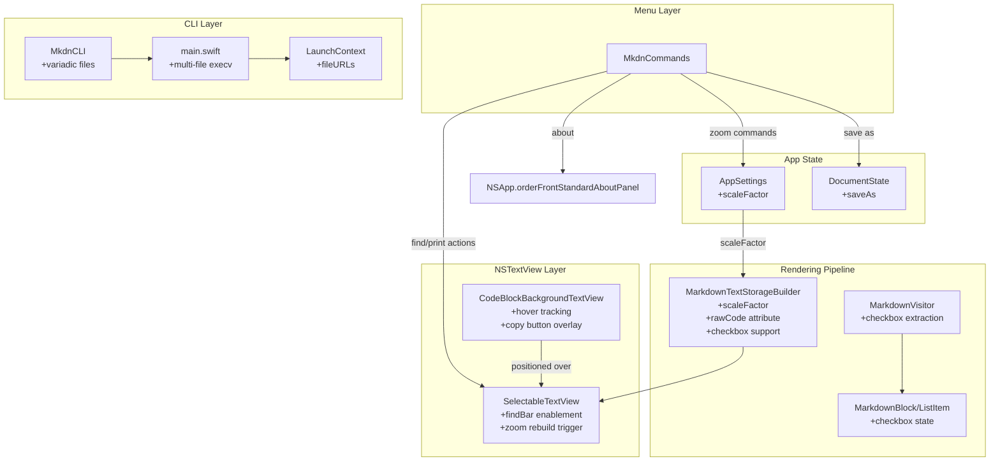
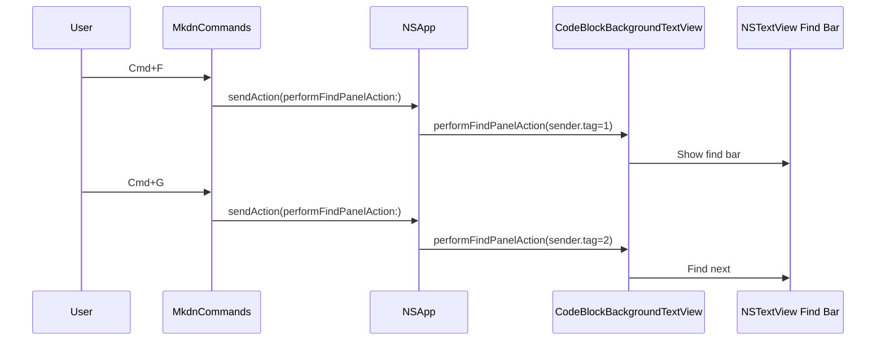
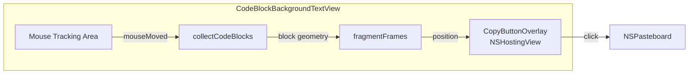
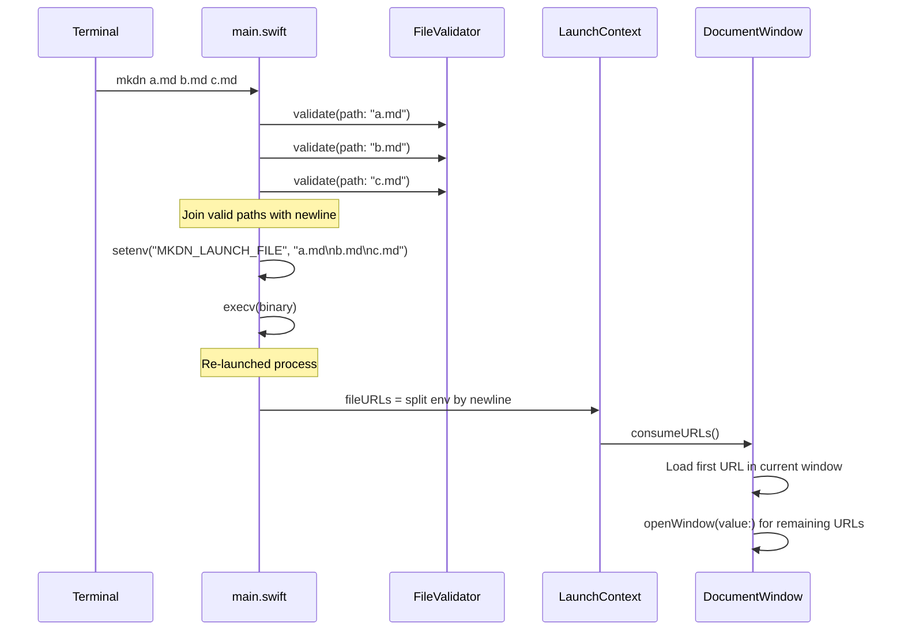

# Technical Design: Mac App Essentials

**Feature ID**: mac-app-essentials
**Version**: 1.0.0
**Created**: 2026-02-13

## 1. Design Overview

Eight standard macOS application features implemented atop the existing Feature-Based MVVM architecture. Each feature integrates with existing patterns: `@Observable` state, SwiftUI `Commands`, `NSViewRepresentable`-wrapped NSTextView, and the MarkdownTextStorageBuilder rendering pipeline. No new SPM dependencies are required.

### High-Level Architecture



## 2. Architecture

### 2.1 Menu Command Architecture

All eight features surface through `MkdnCommands`. The existing pattern uses `CommandGroup` sections with `@FocusedValue(\.documentState)` for per-window state. New menu items follow the same pattern.

Find, Print, and Page Setup use the NSResponder chain: `NSApp.sendAction(_:to:from:)` dispatches to the first responder (the NSTextView), which handles these natively. This avoids any custom plumbing between SwiftUI Commands and the NSTextView.

Zoom and Save As dispatch through `AppSettings` and `DocumentState` respectively, consistent with existing menu commands (theme cycling, save, reload).

### 2.2 Find in Document Architecture



The find bar is NSTextView's built-in find interface. It requires two configuration changes in `SelectableTextView.configureTextView()`:

```swift
textView.usesFindBar = true
textView.isIncrementalSearchingEnabled = true
```

Menu commands dispatch via `NSApp.sendAction` with a tagged sender object to distinguish the find action type (show panel, find next, find previous, use selection for find). The tag values are from `NSFindPanelAction`: `showFindPanel = 1`, `next = 2`, `previous = 3`, `setFindString = 7`.

### 2.3 Zoom Architecture

Zoom is implemented as font-size scaling rather than view magnification, ensuring crisp text at all scale factors (REQ-ZOOM-006).

```
AppSettings.scaleFactor (persisted, 0.5...3.0, default 1.0)
  |
  v
MarkdownPreviewView detects change via .onChange(of: appSettings.scaleFactor)
  |
  v
MarkdownTextStorageBuilder.build(blocks:theme:scaleFactor:)
  |
  v
PlatformTypeConverter.bodyFont(scaleFactor:) -> NSFont at scaled point size
  |
  v
NSAttributedString with scaled fonts -> SelectableTextView renders crisp text
```

The `scaleFactor` is stored in `AppSettings` (persisted via UserDefaults, consistent with `themeMode` and `autoReloadEnabled`). All font-producing methods in `PlatformTypeConverter` accept an optional `scaleFactor` parameter. The `textContainerInset` remains fixed (32pt) -- only the content scales.

Overlay views (tables, Mermaid, images) are not scaled by font size changes. Mermaid diagrams render to images at fixed resolution. Tables use `PlatformTypeConverter.bodyFont()` -- the scaleFactor will be passed through the overlay creation path in `OverlayCoordinator` as well, so table text scales consistently.

A brief `ModeTransitionOverlay` displays the current zoom percentage (e.g., "125%") on each zoom change, using the existing ephemeral overlay mechanism in `ContentView`.

### 2.4 Code Block Copy Button Architecture

Code blocks are inline attributed text in the NSTextView (not overlay views). The copy button must operate at the NSTextView level.



**Implementation approach**:

1. **Raw code storage**: Add `CodeBlockAttributes.rawCode` (`NSAttributedString.Key`) to store the unformatted code string on each code block range in the attributed string, set during `MarkdownTextStorageBuilder.appendCodeBlock`.

2. **Hover tracking**: Override `updateTrackingAreas()` in `CodeBlockBackgroundTextView` to install a tracking area for `mouseMoved` events. On mouse move, hit-test against code block geometries (reusing `collectCodeBlocks` + `fragmentFrames`).

3. **Copy button overlay**: A single `NSHostingView` containing a SwiftUI copy button. Created lazily, shown/hidden and repositioned on hover. Positioned at the top-right corner of the hovered code block's bounding rect.

4. **Copy action**: On click, read the `CodeBlockAttributes.rawCode` value from the code block's range in textStorage. Place on `NSPasteboard.general` as `.string`.

5. **Visual feedback**: The SwiftUI button toggles between `doc.on.doc` and `checkmark` SF Symbols with a brief `quickShift` animation on copy.

6. **Theme awareness**: The button reads the current theme colors from the code block's `CodeBlockColorInfo` for consistent styling.

### 2.5 Task List Checkbox Architecture

Extends the Markdown rendering pipeline at three layers:

```
swift-markdown ListItem.checkbox (.checked/.unchecked)
  |
  v
MarkdownVisitor: reads checkbox, passes to ListItem model
  |
  v
ListItem.checkbox: CheckboxState? (.checked/.unchecked/nil)
  |
  v
MarkdownTextStorageBuilder: replaces bullet prefix with SF Symbol NSImage attachment
MarkdownBlockView: replaces bullet Text with Image(systemName:) for SwiftUI path
```

SF Symbols used: `square` (unchecked), `checkmark.square.fill` (checked). Tinted with `colors.foregroundSecondary` for theme awareness.

### 2.6 Multiple File CLI Architecture



Changes:
- `MkdnCLI.file: String?` becomes `MkdnCLI.files: [String]` (variadic `@Argument`)
- `LaunchContext.fileURL: URL?` becomes `LaunchContext.fileURLs: [URL]`
- `MKDN_LAUNCH_FILE` env var holds newline-delimited paths (file paths cannot contain newlines)
- `main.swift` validates each file independently, prints errors to stderr, continues with valid files
- `DocumentWindow.onAppear` consumes first URL for self, opens remaining via `openWindow(value:)`
- Exit code: 0 if at least one file valid, 1 if all fail

### 2.7 Save As Architecture

Extends `DocumentState` with a `saveAs()` method that:
1. Presents `NSSavePanel` pre-filled with current filename and directory
2. Writes content to the selected URL
3. Updates `currentFileURL` to the new path
4. Restarts `fileWatcher` on the new path
5. Updates `lastSavedContent` baseline
6. Records in Open Recent via `NSDocumentController`

The menu command dispatches through `@FocusedValue(\.documentState)`, consistent with the existing Save command.

### 2.8 About Window Architecture

Uses `NSApp.orderFrontStandardAboutPanel(options:)` with the app icon passed explicitly (since the app sets a custom masked icon in `AppDelegate.applicationWillFinishLaunching`). The standard panel reads `CFBundleName` and `CFBundleShortVersionString` from `Info.plist`.

Ensure `Info.plist` version matches `MkdnCLI.configuration.version` (currently mismatched: plist says 0.0.0, CLI says 1.0.0). Align both to the same version string.

## 3. Detailed Design

### 3.1 Data Model Changes

#### AppSettings (new property)

```swift
private let scaleFactorKey = "scaleFactor"

@MainActor
@Observable
public final class AppSettings {
    // ... existing properties ...

    /// Zoom scale factor for preview text rendering.
    /// Range: 0.5...3.0, default 1.0. Persisted to UserDefaults.
    public var scaleFactor: CGFloat {
        didSet {
            UserDefaults.standard.set(Double(scaleFactor), forKey: scaleFactorKey)
        }
    }

    // In init():
    // scaleFactor = CGFloat(UserDefaults.standard.double(forKey: scaleFactorKey))
    // if scaleFactor == 0 { scaleFactor = 1.0 }

    public func zoomIn() {
        scaleFactor = min(scaleFactor + 0.1, 3.0)
    }

    public func zoomOut() {
        scaleFactor = max(scaleFactor - 0.1, 0.5)
    }

    public func zoomReset() {
        scaleFactor = 1.0
    }
}
```

#### ListItem (new field)

```swift
enum CheckboxState: Sendable {
    case checked
    case unchecked
}

struct ListItem: Identifiable {
    let blocks: [MarkdownBlock]
    let checkbox: CheckboxState?  // nil for non-task-list items

    var id: String {
        let checkboxSuffix = checkbox.map { "-\($0)" } ?? ""
        return "li-\(blocks.map(\.id).joined(separator: "-"))\(checkboxSuffix)"
    }
}
```

#### DocumentState (new method)

```swift
public func saveAs() {
    guard let content = markdownContent.data(using: .utf8) else { return }

    let panel = NSSavePanel()
    panel.allowedContentTypes = [UTType(filenameExtension: "md")].compactMap { $0 }
    panel.canCreateDirectories = true

    if let currentURL = currentFileURL {
        panel.directoryURL = currentURL.deletingLastPathComponent()
        panel.nameFieldStringValue = currentURL.lastPathComponent
    }

    guard panel.runModal() == .OK, let url = panel.url else { return }

    fileWatcher.pauseForSave()
    defer { fileWatcher.resumeAfterSave() }

    try? markdownContent.write(to: url, atomically: true, encoding: .utf8)
    currentFileURL = url
    lastSavedContent = markdownContent
    fileWatcher.watch(url: url)
    NSDocumentController.shared.noteNewRecentDocumentURL(url)
}
```

#### CodeBlockAttributes (new key)

```swift
extension CodeBlockAttributes {
    /// Stores the raw code string (without language label, trimmed) for clipboard copy.
    static let rawCode = NSAttributedString.Key("mkdn.codeBlock.rawCode")
}
```

### 3.2 MarkdownVisitor Changes

In the unordered list conversion, extract the checkbox state:

```swift
case let unorderedList as UnorderedList:
    let items = unorderedList.children.compactMap { child -> ListItem? in
        guard let listItem = child as? Markdown.ListItem else { return nil }
        let itemBlocks = listItem.children.compactMap { convertBlock($0) }
        let checkboxState: CheckboxState? = switch listItem.checkbox {
        case .checked: .checked
        case .unchecked: .unchecked
        case nil: nil
        }
        return ListItem(blocks: itemBlocks, checkbox: checkboxState)
    }
    return .unorderedList(items: items)
```

### 3.3 MarkdownTextStorageBuilder Changes

**Font scaling**: Add `scaleFactor` parameter to `build()` and pass through to all font-producing calls. `PlatformTypeConverter` methods accept `scaleFactor` and multiply point sizes.

**Checkbox rendering**: In `appendListItem`, when `item.checkbox != nil`, replace the bullet prefix with an SF Symbol image:

```swift
if let checkbox = item.checkbox {
    let symbolName = checkbox == .checked ? "checkmark.square.fill" : "square"
    let image = NSImage(systemSymbolName: symbolName, accessibilityDescription: nil)!
    // Tint with foregroundSecondary color, create NSTextAttachment
    let attachment = NSTextAttachment()
    attachment.image = tintedImage
    content.append(NSAttributedString(attachment: attachment))
    content.append(NSAttributedString(string: "\t"))
} else {
    content.append(listPrefix(prefix, color: resolved.secondaryColor))
}
```

**Raw code attribute**: In `appendCodeBlock`, after building the code content, add the raw code string:

```swift
let rawCode = code.trimmingCharacters(in: .whitespacesAndNewlines)
codeContent.addAttribute(CodeBlockAttributes.rawCode, value: rawCode, range: fullRange)
```

### 3.4 MkdnCommands Changes

New command groups added to the `body`:

```swift
// Edit menu: Find items
CommandGroup(after: .pasteboard) {
    Button("Find...") { sendFindAction(tag: 1) }
        .keyboardShortcut("f", modifiers: .command)
    Button("Find Next") { sendFindAction(tag: 2) }
        .keyboardShortcut("g", modifiers: .command)
    Button("Find Previous") { sendFindAction(tag: 3) }
        .keyboardShortcut("g", modifiers: [.command, .shift])
    Button("Use Selection for Find") { sendFindAction(tag: 7) }
        .keyboardShortcut("e", modifiers: .command)
}

// File menu: Print, Page Setup, Save As
CommandGroup(after: .saveItem) {  // or appropriate placement
    Button("Save As...") { documentState?.saveAs() }
        .keyboardShortcut("s", modifiers: [.command, .shift])
        .disabled(documentState?.currentFileURL == nil)
}

CommandGroup(replacing: .printItem) {
    Button("Page Setup...") {
        NSApp.sendAction(#selector(NSDocument.runPageLayout(_:)), to: nil, from: nil)
    }
    Button("Print...") {
        NSApp.sendAction(#selector(NSView.printView(_:)), to: nil, from: nil)
    }
    .keyboardShortcut("p", modifiers: .command)
}

// View menu: Zoom items
CommandGroup(after: .toolbar) {
    Section {
        Button("Zoom In") {
            appSettings.zoomIn()
            documentState?.modeOverlayLabel = zoomLabel
        }
        .keyboardShortcut("+", modifiers: .command)

        Button("Zoom Out") {
            appSettings.zoomOut()
            documentState?.modeOverlayLabel = zoomLabel
        }
        .keyboardShortcut("-", modifiers: .command)

        Button("Actual Size") {
            appSettings.zoomReset()
            documentState?.modeOverlayLabel = zoomLabel
        }
        .keyboardShortcut("0", modifiers: .command)
    }
}
```

### 3.5 CodeBlockBackgroundTextView Changes

**New responsibilities**:
- `updateTrackingAreas()`: Install tracking area with `.mouseMoved`, `.mouseEnteredAndExited`, `.activeInActiveApp`
- `mouseMoved(with:)`: Hit-test mouse position against code block geometries. Show/hide/reposition copy button.
- `copyButtonOverlay`: Lazily created `NSHostingView` with a SwiftUI `CodeBlockCopyButton` view.
- `hoveredBlockID`: Tracks which code block (by blockID) the mouse is over.

**CodeBlockCopyButton** (new SwiftUI view):

```swift
struct CodeBlockCopyButton: View {
    let onCopy: () -> Void
    @State private var isCopied = false

    var body: some View {
        Button(action: {
            onCopy()
            isCopied = true
            Task {
                try? await Task.sleep(for: .seconds(1.5))
                isCopied = false
            }
        }) {
            Image(systemName: isCopied ? "checkmark" : "doc.on.doc")
                .font(.system(size: 12))
                .contentTransition(.symbolEffect(.replace))
        }
        .buttonStyle(.plain)
        .padding(6)
        .background(.ultraThinMaterial)
        .clipShape(RoundedRectangle(cornerRadius: 4))
        .opacity(0.8)
    }
}
```

### 3.6 SelectableTextView Changes

In `configureTextView()`, enable the find bar:

```swift
textView.usesFindBar = true
textView.isIncrementalSearchingEnabled = true
```

In `MarkdownPreviewView`, add zoom change detection:

```swift
.onChange(of: appSettings.scaleFactor) {
    // Rebuild text storage with new scale factor
    let newBlocks = MarkdownRenderer.render(
        text: documentState.markdownContent,
        theme: appSettings.theme
    )
    renderedBlocks = newBlocks
    isFullReload = false
    textStorageResult = MarkdownTextStorageBuilder.build(
        blocks: newBlocks,
        theme: appSettings.theme,
        scaleFactor: appSettings.scaleFactor
    )
}
```

### 3.7 CLI Changes

**MkdnCLI**:

```swift
public struct MkdnCLI: ParsableCommand {
    public static let configuration = CommandConfiguration(
        commandName: "mkdn",
        abstract: "A Mac-native Markdown viewer.",
        version: "1.0.0"
    )

    @Argument(help: "Path(s) to Markdown file(s) (.md or .markdown).")
    public var files: [String] = []

    public init() {}
}
```

**LaunchContext**:

```swift
public enum LaunchContext {
    public nonisolated(unsafe) static var fileURLs: [URL] = []

    public static func consumeURLs() -> [URL] {
        let urls = fileURLs
        fileURLs = []
        return urls
    }
}
```

**main.swift** multi-file flow:

```swift
} else {
    do {
        let cli = try MkdnCLI.parse()

        if !cli.files.isEmpty {
            var validURLs: [URL] = []
            for filePath in cli.files {
                do {
                    let url = try FileValidator.validate(path: filePath)
                    validURLs.append(url)
                } catch let error as CLIError {
                    FileHandle.standardError.write(
                        Data("mkdn: error: \(error.localizedDescription)\n".utf8)
                    )
                }
            }

            guard !validURLs.isEmpty else {
                Foundation.exit(1)
            }

            let pathString = validURLs.map(\.path).joined(separator: "\n")
            setenv("MKDN_LAUNCH_FILE", pathString, 1)
            // execv without file arguments...
        }

        MkdnApp.main()
    } catch ...
}
```

**DocumentWindow.onAppear** multi-URL consumption:

```swift
} else if !LaunchContext.fileURLs.isEmpty {
    let urls = LaunchContext.consumeURLs()
    if let first = urls.first {
        try? documentState.loadFile(at: first)
        NSDocumentController.shared.noteNewRecentDocumentURL(first)
    }
    for url in urls.dropFirst() {
        openWindow(value: url)
    }
}
```

### 3.8 About Window

In `MkdnCommands`, replace the default about menu or use `CommandGroup(replacing: .appInfo)`:

```swift
CommandGroup(replacing: .appInfo) {
    Button("About mkdn") {
        NSApp.orderFrontStandardAboutPanel(options: [
            .applicationIcon: NSApp.applicationIconImage as Any
        ])
    }
}
```

Align `Info.plist` `CFBundleShortVersionString` with the version in `MkdnCLI.configuration.version`.

## 4. Technology Stack

| Layer | Technology | Rationale |
|-------|-----------|-----------|
| UI Framework | SwiftUI + AppKit interop | Existing pattern |
| Text Rendering | NSTextView + TextKit 2 | Existing pattern; Find bar is built-in |
| State Management | @Observable + @MainActor | Existing pattern |
| Menu System | SwiftUI Commands | Existing pattern |
| CLI Parsing | swift-argument-parser | Existing dependency |
| Clipboard | NSPasteboard | Standard macOS API |
| File Dialogs | NSSavePanel | Standard macOS API |
| Persistence | UserDefaults | Existing pattern for AppSettings |
| Icons | SF Symbols | Available macOS 11+; native feel |
| Print | NSTextView.printView | Built-in NSTextView capability |

No new SPM dependencies required.

## 5. Implementation Plan

| Task | Description | Files Modified | Estimated Complexity |
|------|-------------|----------------|---------------------|
| T1 | Find in Document | `SelectableTextView.swift`, `MkdnCommands.swift` | Low |
| T2 | Print Support | `MkdnCommands.swift` | Low |
| T3 | Zoom In/Out | `AppSettings.swift`, `MkdnCommands.swift`, `MarkdownPreviewView.swift`, `MarkdownTextStorageBuilder.swift`, `MarkdownTextStorageBuilder+Blocks.swift`, `MarkdownTextStorageBuilder+Complex.swift`, `PlatformTypeConverter.swift`, `OverlayCoordinator.swift`, `ContentView.swift` | High |
| T4 | Save As | `DocumentState.swift`, `MkdnCommands.swift` | Low |
| T5 | Code Block Copy Button | `CodeBlockBackgroundTextView.swift`, `MarkdownTextStorageBuilder+Blocks.swift`, new `CodeBlockCopyButton.swift` | Medium |
| T6 | Task List Checkboxes | `MarkdownBlock.swift`, `MarkdownVisitor.swift`, `MarkdownTextStorageBuilder+Complex.swift`, `MarkdownBlockView.swift` | Medium |
| T7 | Multiple File CLI Opening | `MkdnCLI.swift`, `LaunchContext.swift`, `main.swift`, `DocumentWindow.swift` | Medium |
| T8 | About Window | `MkdnCommands.swift`, `Info.plist` | Low |

## 6. Implementation DAG

**Parallel Groups** (tasks with no inter-dependencies):

1. [T1, T2, T4, T7, T8] - Independent features touching mostly distinct code paths; menu additions to MkdnCommands are in separate CommandGroup sections
2. [T3, T5, T6] - Features that modify the MarkdownTextStorageBuilder pipeline; parallel because they change different methods/sections

**Dependencies**:

- T3 -> none (self-contained: AppSettings + font scaling + menu)
- T5 -> none (self-contained: hover tracking + raw code attribute + copy button)
- T6 -> none (self-contained: model + visitor + builder list rendering + view)

All 8 tasks are technically parallel (no task defines an interface consumed by another). The grouping above reflects a practical ordering to minimize merge conflicts in shared files (MkdnCommands.swift, MarkdownTextStorageBuilder).

**Critical Path**: T3 (Zoom) is the highest-complexity task spanning the most files. T5 (Code Block Copy Button) is the highest-risk task due to NSTextView hover tracking complexity.

**Recommended implementation order** (to minimize conflict):
1. T8 (About) + T7 (Multi-file CLI) -- smallest/most isolated
2. T1 (Find) + T2 (Print) + T4 (Save As) -- menu additions + responder chain
3. T6 (Task List Checkboxes) -- rendering pipeline extension
4. T3 (Zoom) -- cross-cutting font scaling
5. T5 (Code Block Copy Button) -- highest risk, benefits from stable base

## 7. Testing Strategy

### Test Value Assessment

| Test Category | Value | Rationale |
|--------------|-------|-----------|
| Zoom scale persistence (round-trip) | HIGH | App-specific state management via UserDefaults |
| Zoom scale clamping (min/max bounds) | HIGH | Business rule BR-003/BR-004 enforcement |
| Task list checkbox extraction from Markdown AST | HIGH | Data transformation correctness |
| Multi-file CLI validation (mixed valid/invalid) | HIGH | Error handling logic for partial-success scenario |
| ListItem.checkbox model correctness | HIGH | Domain model accuracy |
| Save As DocumentState update | HIGH | State transition correctness |
| LaunchContext multi-URL consumption | MEDIUM | Consume-once pattern correctness |
| Code block rawCode attribute presence | MEDIUM | Attribute pipeline verification |
| NSTextView find bar activation | SKIP | Framework behavior verification |
| NSTextView print support | SKIP | Framework behavior verification |
| NSApp.orderFrontStandardAboutPanel | SKIP | Framework behavior verification |
| SF Symbol rendering | SKIP | System library behavior |

### Unit Tests

```
mkdnTests/Unit/
  Features/AppSettingsTests.swift        -- extend with zoom scale tests
  Core/MarkdownVisitorTests.swift        -- new: checkbox extraction tests
  Core/MarkdownTextStorageBuilderTests.swift -- extend with checkbox + rawCode tests
  Core/CLITests.swift                    -- new or extend: multi-file parsing tests
  Core/FileOpenCoordinatorTests.swift    -- extend if needed
  Features/DocumentStateTests.swift      -- extend with saveAs tests
```

Each test maps to a functional requirement:

| Test | Requirement | Assertion |
|------|-------------|-----------|
| `test_zoomIn_incrementsBy10Percent` | REQ-ZOOM-001 | scaleFactor goes from 1.0 to 1.1 |
| `test_zoomOut_decrementsBy10Percent` | REQ-ZOOM-002 | scaleFactor goes from 1.5 to 1.4 |
| `test_zoomReset_setsTo1` | REQ-ZOOM-003 | scaleFactor resets to 1.0 |
| `test_zoomIn_clampsAtMax` | BR-003 | scaleFactor does not exceed 3.0 |
| `test_zoomOut_clampsAtMin` | BR-003 | scaleFactor does not go below 0.5 |
| `test_zoomPersistence_roundTrip` | REQ-ZOOM-004 | UserDefaults stores and retrieves scaleFactor |
| `test_checkboxExtraction_unchecked` | REQ-TASK-001 | `- [ ]` produces `.unchecked` |
| `test_checkboxExtraction_checked` | REQ-TASK-002 | `- [x]` produces `.checked` |
| `test_checkboxExtraction_nonTask` | REQ-TASK-001 | `- normal` produces `nil` checkbox |
| `test_multiFile_allValid` | REQ-MULTI-001 | 3 valid files produce 3 URLs |
| `test_multiFile_mixedValidity` | REQ-MULTI-002 | 1 invalid among 3 produces 2 URLs + error |
| `test_multiFile_allInvalid` | REQ-MULTI-002 | All invalid produces empty + errors |
| `test_codeBlockRawCode_stored` | REQ-COPY-002 | Raw code attribute present on code block ranges |
| `test_saveAs_updatesURL` | REQ-SAVEAS-002 | DocumentState.currentFileURL changes after saveAs |

### UI Compliance Tests (Optional Enhancement)

The existing vision verification pipeline could capture screenshots with task list checkboxes and code block copy buttons for visual compliance. This is an optional post-implementation enhancement, not part of the core design.

## 8. Deployment Design

No deployment infrastructure changes. All features are compile-time additions to the existing `mkdnLib` target. The `Info.plist` version update should be coordinated with the CLI version string.

**Feature flags**: None required. All features are standard macOS capabilities that should be unconditionally available.

**Rollout**: All eight features ship together as they collectively constitute "Mac app completeness." No phased rollout needed.

## 9. Documentation Impact

| Type | Target | Section | KB Source | Rationale |
|------|--------|---------|-----------|-----------|
| edit | `.rp1/context/modules.md` | App Layer | `modules.md` | Add scaleFactor to AppSettings, saveAs to DocumentState, checkbox to ListItem |
| edit | `.rp1/context/modules.md` | Core/CLI | `modules.md` | Update MkdnCLI description (variadic files) |
| edit | `.rp1/context/modules.md` | Features/Viewer | `modules.md` | Add CodeBlockCopyButton, note copy button on CodeBlockBackgroundTextView |
| edit | `.rp1/context/architecture.md` | Data Flow | `architecture.md` | Add zoom scale flow, multi-file launch flow |
| edit | `.rp1/context/patterns.md` | Anti-Patterns | `patterns.md` | Note: code block copy uses rawCode attribute, not re-parsing |

## 10. Design Decisions Log

See `design-decisions.md` for full decision log.

Key decisions:
- **D1**: Font-size scaling for zoom (not view magnification) -- crisp text at all scales
- **D2**: NSResponder chain for Find/Print -- zero custom plumbing
- **D3**: Code block copy via NSTextView hover tracking (not overlay) -- because code blocks are inline text
- **D4**: Newline-delimited env var for multi-file -- simplest extension of existing execv pattern
- **D5**: SF Symbols for task list checkboxes -- native macOS feel
- **D6**: Standard About panel -- minimal code, native appearance
