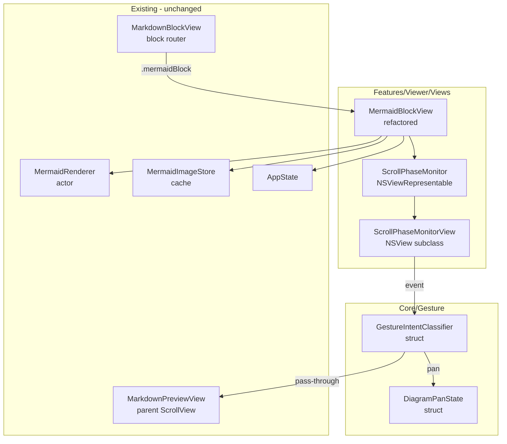

# Design: Mermaid Gesture Interaction

**Feature ID**: mermaid-gesture-interaction
**Version**: 1.0.0
**Status**: Draft
**Created**: 2026-02-06

## 1. Design Overview

Replace the click-to-activate / Escape-to-deactivate interaction model on `MermaidBlockView` with a momentum-aware gesture system that uses NSEvent scroll wheel phases to classify user intent per-event. Each Mermaid diagram gets an invisible `NSView` overlay (via `NSViewRepresentable`) that intercepts `scrollWheel` events, classifies them as diagram-pan or document-scroll, and either consumes or forwards them accordingly. No visible mode switching, no activation borders, no scroll traps.

### High-Level Architecture


## 2. Architecture

### Component Diagram



### Event Flow Sequence


## 3. Detailed Design

### 3.1 GestureIntentClassifier

A lightweight, synchronous, pure struct that examines a single `NSEvent` and the current gesture-tracking state to produce one of two verdicts: `.panDiagram` or `.passThrough`.

**Decision Rules (mapped directly from Business Rules):**

| NSEvent State | Verdict | Business Rule |
|--------------|---------|---------------|
| `momentumPhase != []` (any momentum) | `.passThrough` | BR-03 |
| `phase == .began` and `gestureOrigin == .outside` | `.passThrough` | BR-01 |
| `phase == .began` and `gestureOrigin == .diagram` | `.panDiagram` | BR-02 |
| `phase == .changed` and current gesture is pass-through | `.passThrough` | BR-01 continuity |
| `phase == .changed` and current gesture is pan | `.panDiagram` | BR-02 continuity |
| Content smaller than frame | `.passThrough` | BR-05 |
| `phase == .ended` or `phase == .cancelled` | Reset tracking state | -- |

**Gesture Origin Detection:**

The classifier tracks whether the current gesture sequence originated while the cursor was over the diagram. A gesture sequence begins with `phase == .began` and ends with `phase == .ended` or `phase == .cancelled`. Between those bookends, the verdict is sticky (a gesture that started as pass-through stays pass-through for its entire duration, and vice versa).

The key insight: `phase == .began` means the user just placed fingers on the trackpad. If the cursor is over the diagram and no momentum is active, this is a fresh gesture with intent to pan. If the event has `momentumPhase != []`, it is coasting from a prior gesture and passes through.

**Interface:**

```swift
struct GestureIntentClassifier {
    enum Verdict {
        case panDiagram
        case passThrough
    }

    enum GestureState {
        case idle
        case panning
        case passingThrough
    }

    private(set) var gestureState: GestureState = .idle

    mutating func classify(_ event: NSEvent, contentFitsInFrame: Bool) -> Verdict
}
```

**Properties:**
- No allocations, no async, no side effects.
- Executes in nanoseconds (single switch statement over event phase enums).
- Meets the single-frame budget constraint trivially.

### 3.2 DiagramPanState

Tracks the pan offset for a single diagram and enforces content boundary clamping. Returns overflow deltas when the boundary is hit.

**Interface:**

```swift
struct DiagramPanState {
    struct ApplyResult {
        let consumedDelta: CGSize
        let overflowDelta: CGSize
    }

    var offset: CGSize = .zero

    mutating func applyDelta(
        dx: CGFloat,
        dy: CGFloat,
        contentSize: CGSize,
        frameSize: CGSize,
        zoomScale: CGFloat
    ) -> ApplyResult
}
```

**Boundary Calculation:**

The pannable range is determined by the scaled content size minus the visible frame size:

```
maxOffsetX = max(0, (contentSize.width * zoomScale - frameSize.width) / 2)
maxOffsetY = max(0, (contentSize.height * zoomScale - frameSize.height) / 2)
```

If the content fits within the frame at the current zoom, `maxOffset` is zero in that axis, meaning all scroll events pass through (BR-05 satisfied structurally).

When a delta would push the offset beyond a boundary, the excess is returned as `overflowDelta` for forwarding to the parent ScrollView (FR-03).

### 3.3 ScrollPhaseMonitor (NSViewRepresentable)

An `NSViewRepresentable` wrapping a custom `NSView` subclass (`ScrollPhaseMonitorView`) that:

1. Overrides `scrollWheel(with:)` to intercept every scroll event.
2. Delegates to `GestureIntentClassifier` for verdict.
3. On `.panDiagram`: computes delta, applies to `DiagramPanState`, publishes updated offset via a callback closure.
4. On `.passThrough`: calls `nextResponder?.scrollWheel(with: event)` to forward to the parent.
5. On overflow: forwards the overflow portion of the event to the parent.

**Pattern alignment:** Follows the same `NSViewRepresentable` + `NSView` subclass pattern as `WindowAccessor` / `WindowAccessorView`.

**Coordinator:** The `NSViewRepresentable.Coordinator` holds the `GestureIntentClassifier` state and the callback closures. It is set as a delegate/target on the `NSView` so the view can invoke it from `scrollWheel(with:)`.

**NSView configuration:**

```swift
final class ScrollPhaseMonitorView: NSView {
    var onScrollEvent: ((NSEvent) -> Void)?

    override func scrollWheel(with event: NSEvent) {
        onScrollEvent?(event)
        // Do NOT call super -- we handle forwarding explicitly
    }
}
```

The `onScrollEvent` closure is set by the Coordinator, which performs classification and either updates pan state or forwards via `nextResponder`.

**Event forwarding for pass-through:**

When the classifier says `.passThrough`, the Coordinator calls:

```swift
view.nextResponder?.scrollWheel(with: event)
```

This sends the event up the responder chain to the parent `NSScrollView` (backing the SwiftUI `ScrollView`).

**Magnify gesture:** Not handled by this NSView. The `MagnifyGesture` remains on the SwiftUI `Image` layer as it is today. `NSView.magnify(with:)` is not overridden, so magnify events pass through the responder chain to SwiftUI naturally.

### 3.4 MermaidBlockView Refactor

The refactored `MermaidBlockView` has a single code path (no `isActivated` branching):

**Removed:**
- `isActivated` state
- `isFocused` FocusState
- `activatedDiagramView` (the ScrollView wrapper)
- `inactiveDiagramView` (merged into single `diagramView`)
- `onTapGesture` activation
- `onKeyPress(.escape)` deactivation
- Accent border overlay
- `panGesture` (DragGesture -- replaced by scroll-event-based panning)

**Retained:**
- `renderedImage`, `errorMessage`, `isLoading` states
- `zoomScale`, `baseZoomScale` states
- `renderDiagram()` async method (unchanged)
- `svgStringToImage()` (unchanged)
- `zoomGesture` (MagnifyGesture, unchanged)
- Loading/error views (unchanged)
- MermaidImageStore cache lookup in init (unchanged)

**Added:**
- `panOffset: CGSize` state (replaces `dragOffset` + `baseDragOffset`)
- `ScrollPhaseMonitor` overlay on the diagram image
- Pan offset callback from monitor updates `panOffset` state
- `GeometryReader` to measure frame size for boundary calculations

**Resulting view structure:**

```swift
func diagramView(image: NSImage) -> some View {
    GeometryReader { geometry in
        Image(nsImage: image)
            .resizable()
            .aspectRatio(contentMode: .fit)
            .scaleEffect(zoomScale)
            .offset(x: panOffset.width, y: panOffset.height)
            .frame(maxWidth: .infinity, maxHeight: .infinity)
    }
    .frame(maxWidth: .infinity, maxHeight: 400)
    .clipped()
    .contentShape(Rectangle())
    .overlay(
        ScrollPhaseMonitor(
            contentSize: image.size,
            zoomScale: zoomScale,
            panOffset: $panOffset
        )
    )
    .gesture(zoomGesture)
    .background(appState.theme.colors.backgroundSecondary)
    .clipShape(RoundedRectangle(cornerRadius: 6))
}
```

### Data Model

No persistent data model changes. All state is per-view-instance `@State`:


## 4. Technology Stack

| Layer | Technology | Rationale |
|-------|-----------|-----------|
| Intent detection | `NSEvent.phase`, `NSEvent.momentumPhase` | Only API that exposes scroll gesture phase info on macOS |
| Event interception | `NSViewRepresentable` + `NSView.scrollWheel(with:)` | Matches existing `WindowAccessor` pattern; per-diagram encapsulation |
| Panning | Manual offset via `NSEvent.scrollingDeltaX/Y` | Smooth, system-scaled deltas; no additional physics needed |
| Zoom | SwiftUI `MagnifyGesture` | Already working; no change needed |
| State management | `@State` on `MermaidBlockView` | Existing pattern; per-diagram isolation (FR-07) |

No new dependencies. No new frameworks beyond what is already imported (`AppKit`, `SwiftUI`).

## 5. Implementation Plan

### T1: GestureIntentClassifier

**Location:** `mkdn/Core/Gesture/GestureIntentClassifier.swift` (new directory)

A pure struct with no dependencies. Implements the decision table from section 3.1. Takes an `NSEvent` and a `contentFitsInFrame` boolean, returns `.panDiagram` or `.passThrough`. Tracks gesture sequence state internally (`idle` / `panning` / `passingThrough`).

**Estimated complexity:** ~60 lines. Single file.

### T2: DiagramPanState

**Location:** `mkdn/Core/Gesture/DiagramPanState.swift`

A value-type struct that tracks pan offset and computes boundary-clamped deltas. Returns an `ApplyResult` with consumed and overflow portions. Pure arithmetic, no dependencies.

**Estimated complexity:** ~50 lines. Single file.

### T3: ScrollPhaseMonitor

**Location:** `mkdn/UI/Components/ScrollPhaseMonitor.swift`

`NSViewRepresentable` + `NSView` subclass. The Coordinator owns a `GestureIntentClassifier` and `DiagramPanState`. Binds `panOffset` back to the parent view. Forwards pass-through events via `nextResponder`.

**Estimated complexity:** ~100 lines. Single file.

### T4: MermaidBlockView Refactor

**Location:** `mkdn/Features/Viewer/Views/MermaidBlockView.swift` (existing file, modified)

Remove dual-mode architecture. Remove activation state, focus handling, DragGesture, accent border. Add `ScrollPhaseMonitor` overlay and `panOffset` state. Add `GeometryReader` for frame measurement. Keep everything else (rendering, caching, zoom, loading/error views).

**Estimated complexity:** Net reduction in lines. Remove ~50 lines (activated view, activation logic), add ~20 lines (overlay, state).

### T5: Unit Tests

**Location:** `mkdnTests/Unit/Core/GestureIntentClassifierTests.swift`, `mkdnTests/Unit/Core/DiagramPanStateTests.swift`

Test the classifier decision table and pan state boundary clamping. These are pure structs with no UI dependencies, making them highly testable.

## 6. Implementation DAG

**Parallel Groups** (tasks with no inter-dependencies):

1. [T1, T2, T3] - T1 (classifier), T2 (pan state), and T3 (monitor view) have no data or interface dependencies on each other. T3 will use T1 and T2 internally, but can be built with stub types initially since the interfaces are defined upfront.
2. [T4, T5] - T4 (view refactor) integrates all three components; T5 (tests) validates T1 and T2 logic.

**Dependencies:**

- T4 -> [T1, T2, T3] (integration: T4 composes all three components into MermaidBlockView)
- T5 -> [T1, T2] (test target: T5 tests the classifier and pan state structs)

**Critical Path:** T1 -> T4

## 7. Testing Strategy

### Test Value Assessment

| Test Target | Value | Rationale |
|-------------|-------|-----------|
| GestureIntentClassifier decision table | HIGH | App-specific business logic (BR-01 through BR-05). Core correctness requirement. |
| DiagramPanState boundary clamping | HIGH | App-specific math: boundary detection, overflow calculation. Directly implements FR-03. |
| DiagramPanState content-fits-in-frame | HIGH | Implements BR-05 (no pannable content = all pass-through). Edge case. |
| ScrollPhaseMonitor NSView lifecycle | AVOID | Framework behavior verification. Trust NSViewRepresentable works. |
| MagnifyGesture zoom clamping | AVOID | Already tested implicitly; SwiftUI gesture behavior. |
| NSEvent phase values | AVOID | Platform API behavior verification. |

### Test Plan

**GestureIntentClassifierTests** (`mkdnTests/Unit/Core/GestureIntentClassifierTests.swift`):

| Test | Maps To | Description |
|------|---------|-------------|
| Fresh gesture over diagram produces pan | BR-02, AC-01a | `phase == .began`, no momentum -> `.panDiagram` |
| Momentum event produces pass-through | BR-03, AC-01c | `momentumPhase == .changed` -> `.passThrough` |
| Gesture started outside stays pass-through | BR-01, AC-01b | `.began` outside, `.changed` over diagram -> `.passThrough` |
| Content fits in frame always pass-through | BR-05, AC-03f | `contentFitsInFrame == true` -> `.passThrough` regardless |
| Gesture sequence resets on `.ended` | -- | After `.ended`, next `.began` is classified fresh |
| Pan gesture stays pan through `.changed` | BR-02 | Sticky verdict within a gesture sequence |
| Pass-through stays pass-through through `.changed` | BR-01 | Sticky verdict within a gesture sequence |

**DiagramPanStateTests** (`mkdnTests/Unit/Core/DiagramPanStateTests.swift`):

| Test | Maps To | Description |
|------|---------|-------------|
| Delta within bounds consumed fully | FR-02, AC-02a | Offset updates, overflow is zero |
| Delta at boundary produces overflow | FR-03, AC-03a/b | Excess delta returned as overflow |
| Content smaller than frame: all overflow | BR-05 | Zero consumed, full overflow |
| Negative and positive boundary clamping | FR-03, AC-03c/d | Both directions tested |
| Zoom scale affects boundary | FR-04, AC-04d | Larger zoom = larger pannable area |

**Testing approach:** Use Swift Testing (`@Test`, `#expect`, `@Suite`). Tests create classifier/state structs directly and invoke methods with synthetic inputs. No NSEvent mocking needed for classifier tests -- the classifier interface accepts the relevant fields (phase, momentumPhase, contentFitsInFrame) rather than a raw NSEvent, keeping the test boundary clean. The Coordinator adapter translates NSEvent fields to classifier inputs.

## 8. Deployment Design

No special deployment requirements. This is a view-layer change shipped with the application binary. No feature flags, no staged rollout, no server-side components.

**Rollback:** Revert the MermaidBlockView changes to restore the click-to-activate model. The new files (classifier, pan state, monitor) can be removed or left inert.

**macOS version compatibility:** All APIs used (`NSEvent.phase`, `NSEvent.momentumPhase`, `NSEvent.scrollingDeltaX/Y`, `NSViewRepresentable`) are available on macOS 14.0+ (and much earlier). No compatibility risk.

## 9. Documentation Impact

| Type | Target | Section | KB Source | Rationale |
|------|--------|---------|-----------|-----------|
| edit | `.rp1/context/architecture.md` | Mermaid Diagrams rendering pipeline | architecture.md:Mermaid Diagrams | Update to reflect removal of click-to-activate and addition of momentum-based gesture system |
| edit | `.rp1/context/modules.md` | Core Layer, Features Layer | modules.md:Core Layer | Add `Core/Gesture/` module with GestureIntentClassifier and DiagramPanState; add ScrollPhaseMonitor to UI/Components |
| edit | `.rp1/context/patterns.md` | (new section) | patterns.md | Add NSViewRepresentable event interception pattern |

## 10. Design Decisions Log

See `design-decisions.md` for full decision log with rationale and alternatives.

Key decisions:
- **D1:** NSViewRepresentable overlay per diagram (vs. global event monitor)
- **D2:** Pure struct classifier (vs. class/actor with observation)
- **D3:** Scroll event deltas for panning (vs. DragGesture or ScrollView)
- **D4:** Classifier accepts extracted fields, not raw NSEvent (testability boundary)
- **D5:** Single diagram view path (vs. current dual-mode branching)
