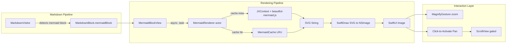
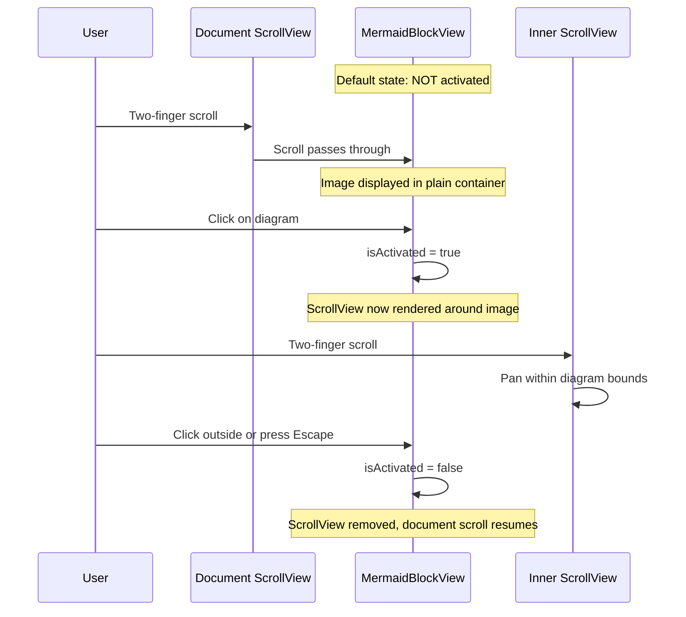

# Design: Mermaid Diagram Rendering

**Feature ID**: mermaid-rendering
**Version**: 1.0.0
**Status**: Draft
**Created**: 2026-02-06

## 1. Design Overview

This feature completes the Mermaid rendering pipeline in mkdn, transforming the existing partial implementation into a production-quality, gesture-rich, scroll-safe diagram rendering system. The pipeline converts Mermaid code blocks detected by the Markdown parser through an in-process JavaScriptCore evaluation (using beautiful-mermaid.js) to SVG strings, then rasterizes them to native `NSImage` via SwiftDraw, and displays them as interactive SwiftUI `Image` views with pinch-to-zoom, click-to-activate panning, and strict scroll isolation.

The existing codebase already contains scaffolding for this feature: `MermaidRenderer` (actor), `MermaidBlockView` (SwiftUI view), `MarkdownBlock.mermaidBlock` (block enum case), and `MarkdownVisitor` routing. This design focuses on the gaps: bounded LRU caching, robust error handling, scroll isolation, activation-gated pan/zoom, JXContext reuse, and stable cache keys.

### High-Level Architecture



## 2. Architecture

### Component Architecture

The feature spans three architectural layers with clear boundaries:

**Core Layer** (`mkdn/Core/Mermaid/`):
- `MermaidRenderer` -- Actor singleton managing JS evaluation, caching, and SVG production
- `MermaidCache` -- LRU cache with bounded capacity and stable hashing
- `MermaidError` -- Typed error enum with all failure modes

**Features Layer** (`mkdn/Features/Viewer/Views/`):
- `MermaidBlockView` -- SwiftUI view handling all rendering states, gestures, and scroll isolation

**Integration Points** (no changes needed):
- `MarkdownVisitor` -- Already routes `mermaid` language blocks correctly
- `MarkdownBlockView` -- Already delegates `.mermaidBlock` to `MermaidBlockView`
- `MarkdownPreviewView` -- Document-level `ScrollView` with `LazyVStack`

### Scroll Isolation Sequence



## 3. Detailed Design

### 3.1 MermaidCache

A bounded LRU cache internal to `MermaidRenderer`. Replaces the current unbounded `[Int: String]` dictionary.

```swift
// Internal to MermaidRenderer actor -- no Sendable requirement
struct MermaidCache {
    private var storage: [UInt64: String] = [:]
    private var accessOrder: [UInt64] = []
    private let capacity: Int

    init(capacity: Int = 50)

    func get(_ key: UInt64) -> String?
    mutating func set(_ key: UInt64, value: String)
    mutating func removeAll()
    var count: Int { get }
}
```

**Key design decisions:**
- **UInt64 keys** via DJB2 stable hash (same algorithm already used in `MarkdownBlock.id`), replacing `hashValue` which is non-deterministic across process launches
- **Capacity of 50**: Typical documents have 1-10 diagrams; 50 covers documents with many diagrams plus recently closed documents
- **LRU eviction**: When at capacity, evict least-recently-accessed entry on insert
- **Internal to actor**: No `Sendable` requirement since it lives inside the `MermaidRenderer` actor's isolated state

### 3.2 MermaidRenderer Enhancements

```swift
actor MermaidRenderer {
    static let shared = MermaidRenderer()

    private var cache = MermaidCache(capacity: 50)
    private var context: JXContext?

    // Public API (unchanged signatures)
    func renderToSVG(_ mermaidCode: String) throws -> String
    func renderToImage(_ mermaidCode: String) throws -> NSImage
    func clearCache()

    // Internal enhancements
    private func getOrCreateContext() throws -> JXContext
    private func stableHash(_ string: String) -> UInt64
    private func validateDiagramType(_ code: String) throws
}
```

**Changes from current implementation:**

| Aspect | Current | New |
|--------|---------|-----|
| Cache | `[Int: String]` unbounded | `MermaidCache` with LRU, capacity 50 |
| Hash key | `hashValue` (non-deterministic) | DJB2 `UInt64` (stable) |
| JXContext | Created fresh per call | Lazy-initialized, reused across calls |
| Error handling | Basic catch | Validates diagram type, wraps JS errors with context |
| Empty input | Not handled | Throws `MermaidError.emptyInput` |
| Unsupported types | Not detected | Detects and throws `MermaidError.unsupportedDiagramType` |

**JXContext reuse strategy**: The context is lazily created on first render and reused for subsequent renders. If a JS error indicates context corruption, the context is discarded and recreated on next call. This avoids the ~50-100ms overhead of loading beautiful-mermaid.js on each render.

**Diagram type validation**: Before passing code to JS, parse the first non-empty line to detect the diagram type keyword. Supported: `graph`, `flowchart`, `sequenceDiagram`, `stateDiagram`, `classDiagram`, `erDiagram`. If the keyword is a known-but-unsupported Mermaid type (e.g., `gantt`, `pie`, `journey`, `gitGraph`, `mindmap`), throw `MermaidError.unsupportedDiagramType(typeName)`. If no known keyword is found, let the JS engine attempt rendering (it may be valid syntax we do not enumerate).

### 3.3 MermaidError Enhancements

```swift
enum MermaidError: LocalizedError {
    case invalidSVGData
    case svgRenderingFailed
    case javaScriptError(String)
    case emptyInput
    case unsupportedDiagramType(String)
    case contextCreationFailed(String)

    var errorDescription: String? { ... }
}
```

### 3.4 MermaidBlockView Redesign

The view manages three concerns: async rendering, gesture interaction, and scroll isolation.

**State management:**

```swift
struct MermaidBlockView: View {
    let code: String

    @Environment(AppState.self) private var appState
    @State private var renderedImage: NSImage?
    @State private var errorMessage: String?
    @State private var isLoading = true
    @State private var zoomScale: CGFloat = 1.0
    @State private var baseZoomScale: CGFloat = 1.0
    @State private var isActivated = false
}
```

**Zoom fix**: The current implementation uses `value.magnification` directly, which resets on each gesture. The fix uses a base+delta pattern:

```swift
MagnifyGesture()
    .onChanged { value in
        let newScale = baseZoomScale * value.magnification
        zoomScale = max(0.5, min(newScale, 4.0))
    }
    .onEnded { _ in
        baseZoomScale = zoomScale
    }
```

**Scroll isolation via conditional rendering**: The key insight is that scroll capture only happens when a `ScrollView` exists in the view hierarchy. By conditionally rendering the `ScrollView` only when the diagram is activated, document scroll passes through unimpeded.

```
Not activated: Image in clipped container (no ScrollView)
    -> Document scroll passes through naturally
    -> MagnifyGesture still works for zoom

Activated: Image in ScrollView([.horizontal, .vertical])
    -> Two-finger scroll pans within diagram
    -> Visual border indicates active state
```

**Activation/deactivation:**
- **Activate**: `.onTapGesture` on the diagram container sets `isActivated = true`
- **Deactivate**: `.onTapGesture` outside (handled by parent via focus/overlay), or `.onKeyPress(.escape)` sets `isActivated = false`
- **Visual indicator**: Active state shows a highlighted border (theme accent color) to provide clear feedback

**Container structure (not activated):**

```
RoundedRectangle container (backgroundSecondary)
  Image(nsImage:)
    .resizable()
    .aspectRatio(contentMode: .fit)
    .scaleEffect(zoomScale)
    .gesture(MagnifyGesture)
    .onTapGesture { isActivated = true }
  .frame(maxWidth: .infinity, maxHeight: 400)
  .clipped()
```

**Container structure (activated):**

```
RoundedRectangle container (backgroundSecondary + accent border)
  ScrollView([.horizontal, .vertical])
    Image(nsImage:)
      .resizable()
      .aspectRatio(contentMode: .fit)
      .scaleEffect(zoomScale)
      .gesture(MagnifyGesture)
  .frame(maxWidth: .infinity, maxHeight: 400)
  .onKeyPress(.escape) { isActivated = false }
  .focusable()
  .focused()
```

### Data Model

No new data models beyond what exists. The `MarkdownBlock.mermaidBlock(code: String)` case is sufficient. The `MermaidCache` is an internal implementation detail of `MermaidRenderer`, not a domain model.

## 4. Technology Stack

All technologies are already present in the project. No new dependencies are introduced.

| Component | Technology | Status |
|-----------|-----------|--------|
| JS Evaluation | JXKit (JavaScriptCore wrapper) | Already in Package.swift |
| Mermaid Library | beautiful-mermaid.js (bundled) | Already in Resources/ |
| SVG Rasterization | SwiftDraw | Already in Package.swift |
| Markdown Parsing | apple/swift-markdown | Already in Package.swift |
| UI Framework | SwiftUI | Already used |
| Concurrency | Swift Actors | Already used |
| Testing | Swift Testing | Already used |

## 5. Implementation Plan

### T1: MermaidCache Implementation

**Location**: `mkdn/Core/Mermaid/MermaidCache.swift` (new file)

**Work**:
- Implement `MermaidCache` struct with LRU eviction
- DJB2 stable hash function (extract from `MarkdownBlock.swift` or duplicate as private utility)
- Methods: `get`, `set`, `removeAll`, `count`
- Capacity configurable via init, default 50

**Acceptance**: Cache correctly evicts LRU entries when at capacity; stable hash produces consistent keys.

### T2: MermaidRenderer Enhancements

**Location**: `mkdn/Core/Mermaid/MermaidRenderer.swift` (modify existing)

**Work**:
- Replace `svgCache: [Int: String]` with `MermaidCache`
- Replace `hashValue` usage with DJB2 stable hash
- Add lazy JXContext reuse with error-triggered recreation
- Add `validateDiagramType()` that checks first line for supported/unsupported type keywords
- Wrap all JS errors with `MermaidError.javaScriptError` including the JS error message
- Handle empty input with `MermaidError.emptyInput`
- Use `Bundle.module` instead of `Bundle.main` for SPM resource access (current code uses `Bundle.main` which may not find the resource in library target)

**Acceptance**: Cache bounded and evicts; context reused; empty/unsupported inputs produce clear errors; JS errors include original message.

### T3: MermaidBlockView Redesign

**Location**: `mkdn/Features/Viewer/Views/MermaidBlockView.swift` (modify existing)

**Work**:
- Add `isActivated` state and `baseZoomScale` state
- Fix zoom gesture to use base+delta pattern
- Implement conditional ScrollView rendering (scroll isolation)
- Add tap-to-activate gesture
- Add Escape key handler for deactivation
- Add visual activation indicator (accent-colored border)
- Add max height constraint (400pt) with clipping for non-activated state
- Ensure theme colors update container without re-render

**Acceptance**: Document scroll passes through non-activated diagrams; click activates internal pan; Escape deactivates; zoom is cumulative and clamped 0.5x-4.0x.

### T4: MermaidError Enhancements

**Location**: `mkdn/Core/Mermaid/MermaidRenderer.swift` (modify existing, `MermaidError` enum)

**Work**:
- Add `emptyInput` case
- Add `unsupportedDiagramType(String)` case
- Add `contextCreationFailed(String)` case
- Update `errorDescription` for all cases with user-friendly messages

**Acceptance**: All error cases produce human-readable messages; `unsupportedDiagramType` includes the type name.

### T5: Unit Tests

**Location**: `mkdnTests/Unit/Core/MermaidCacheTests.swift` (new file), `mkdnTests/Unit/Core/MermaidRendererTests.swift` (new file)

**Work**:

MermaidCacheTests:
- Test basic get/set
- Test cache miss returns nil
- Test LRU eviction at capacity
- Test `removeAll` clears everything
- Test stable hash consistency

MermaidRendererTests:
- Test empty input produces `MermaidError.emptyInput`
- Test unsupported diagram type produces `MermaidError.unsupportedDiagramType`
- Test cache clearing via `clearCache()`
- Test that valid Mermaid code calls through without throwing (requires beautiful-mermaid.js in test bundle -- may need `Bundle.module` resource access)

**Note**: Tests requiring actual JS execution (beautiful-mermaid.js loading) depend on the JS bundle being accessible in the test target. If `Bundle.module` resolution fails in tests, those tests should be marked with `@Test(.disabled("Requires JS bundle in test resources"))` and verified via integration testing.

**Acceptance**: All cache behaviors verified; error cases verified; rendering tests pass or are explicitly marked as requiring integration test.

## 6. Implementation DAG

**Parallel Groups** (tasks with no inter-dependencies):

1. [T1, T4] - MermaidCache and MermaidError are independent data structures with no shared dependencies
2. [T2, T3] - MermaidRenderer uses T1 (cache) and T4 (errors); MermaidBlockView uses T4 (error display) but not T2 at the interface level
3. [T5] - Tests depend on all implementation components being complete

**Dependencies**:

- T2 -> T1 (data dependency: MermaidRenderer stores MermaidCache instance)
- T2 -> T4 (interface dependency: MermaidRenderer throws new MermaidError cases)
- T3 -> T4 (interface dependency: MermaidBlockView displays new error messages)
- T5 -> [T1, T2, T4] (test dependency: tests exercise cache, renderer, and error types)

**Critical Path**: T1 -> T2 -> T5

## 7. Testing Strategy

### Test Value Assessment

| Test Category | Value | Rationale |
|---------------|-------|-----------|
| LRU cache eviction logic | HIGH | App-specific data structure with business rules (bounded capacity) |
| Stable hash consistency | HIGH | Cache correctness depends on deterministic hashing |
| Empty/unsupported input error mapping | HIGH | App-specific error handling that prevents crashes (FR-MER-010) |
| Diagram type validation logic | MEDIUM | Business rule enforcement (BR-001, supported types) |
| MermaidRenderer.renderToSVG integration | MEDIUM | Exercises the full pipeline; depends on JS bundle availability |
| SwiftDraw SVG parsing | SKIP | Tests SwiftDraw library behavior, not app logic |
| JXKit context creation | SKIP | Tests JXKit library behavior, not app logic |
| MagnifyGesture behavior | SKIP | Tests SwiftUI framework, not app logic |

### Test Plan

**Unit Tests** (fast, no UI, no external dependencies):

| Suite | Tests | File |
|-------|-------|------|
| MermaidCacheTests | get/set, miss, LRU eviction, capacity, removeAll, hash stability | `mkdnTests/Unit/Core/MermaidCacheTests.swift` |
| MermaidRendererTests | empty input error, unsupported type error, cache clear, type validation | `mkdnTests/Unit/Core/MermaidRendererTests.swift` |

**Integration Tests** (slower, requires JS bundle):

| Suite | Tests | Notes |
|-------|-------|-------|
| MermaidRendererIntegrationTests | Render flowchart to SVG, render sequence diagram to SVG, cache hit verification | Requires beautiful-mermaid.js accessible via Bundle.module. Run if hypothesis HYP-001 is confirmed. |

### Test Patterns (following existing codebase):

```swift
@Suite("MermaidCache")
struct MermaidCacheTests {
    @Test("Returns nil for cache miss")
    func cacheMiss() { ... }

    @Test("Evicts LRU entry when at capacity")
    func lruEviction() { ... }
}
```

Tests use `@MainActor` on individual test functions when testing `@MainActor`-isolated types (per project memory).

## 8. Deployment Design

No special deployment considerations. This feature modifies existing files and adds new files within the existing SPM structure.

**Resource bundling**: `mermaid.min.js` is already declared in `Package.swift` under `mkdnLib` resources with `.copy("Resources/mermaid.min.js")`. No changes needed.

**Bundle access**: The current `MermaidRenderer` uses `Bundle.main` to locate the JS file. In the library target context, this should be `Bundle.module` to correctly resolve SPM-bundled resources. This is a bug fix included in T2.

## 9. Documentation Impact

| Type | Target | Section | KB Source | Rationale |
|------|--------|---------|-----------|-----------|
| edit | `.rp1/context/modules.md` | Core Layer > Mermaid | modules.md:Core/Mermaid | Add MermaidCache.swift to module inventory |
| edit | `.rp1/context/architecture.md` | Mermaid Diagrams pipeline | architecture.md:Mermaid Diagrams | Document LRU caching, context reuse, scroll isolation |
| edit | `.rp1/context/patterns.md` | Actor Pattern (Mermaid) | patterns.md:Actor Pattern | Add LRU cache pattern, scroll isolation pattern |

## 10. Design Decisions Log

| ID | Decision | Choice | Rationale | Alternatives Considered |
|----|----------|--------|-----------|------------------------|
| D1 | Cache eviction strategy | LRU (Least Recently Used) | Most predictable for diagram viewing: recently viewed diagrams stay cached; old ones evict naturally as user navigates | Count-limited FIFO (simpler but evicts frequently-used entries), time-based TTL (unnecessary for in-memory cache) |
| D2 | Cache capacity | 50 entries | Covers 5-10x typical document diagram count; SVG strings average 5-20KB each so ~1MB max cache | 20 (too small for multi-doc workflows), 100 (unnecessarily large), unlimited (original, rejected per FR-MER-005) |
| D3 | Cache key hashing | DJB2 stable hash (UInt64) | Deterministic across process launches; already used in MarkdownBlock.id for the same purpose | Swift hashValue (non-deterministic per-launch), SHA256 (overkill for in-memory cache keys) |
| D4 | JXContext lifecycle | Lazy singleton with error-triggered recreation | Avoids ~50-100ms cost of loading JS bundle per render; recreation on error prevents corruption accumulation | Fresh per call (current, too slow), permanent singleton (risk of accumulated memory) |
| D5 | Scroll isolation approach | Conditional ScrollView rendering | When not activated, no ScrollView exists in hierarchy so scroll events cannot be captured; simplest and most reliable approach | allowsHitTesting toggle (still captures in some cases), AppKit NSScrollView subclass (breaks SwiftUI-only constraint), gesture precedence manipulation (fragile) |
| D6 | Diagram activation mechanism | Click-to-activate, Escape/click-outside to deactivate | Most conservative approach per PRD; prevents accidental scroll capture; familiar macOS pattern | Hover-to-activate (too easy to trigger accidentally), modifier-key (non-discoverable) |
| D7 | Zoom gesture pattern | Base + delta cumulative | Fixes current bug where zoom resets; standard pattern for MagnifyGesture in SwiftUI | Direct magnification (current, buggy), state-only tracking (same issue) |
| D8 | Bundle resource access | Bundle.module (SPM) | Correct API for accessing resources in SPM library targets; Bundle.main only works for executable target | Bundle.main (current, incorrect for lib target context) |
| D9 | New file vs inline for MermaidCache | Separate file `MermaidCache.swift` | Follows project pattern of single-purpose files; testable independently | Inline in MermaidRenderer.swift (harder to test, violates SRP) |
| D10 | Diagram container max height | 400pt with clipping | Prevents oversized diagrams from dominating the document; user can zoom/pan for detail | No max height (diagrams can push content off-screen), 200pt (too small for readability) |
