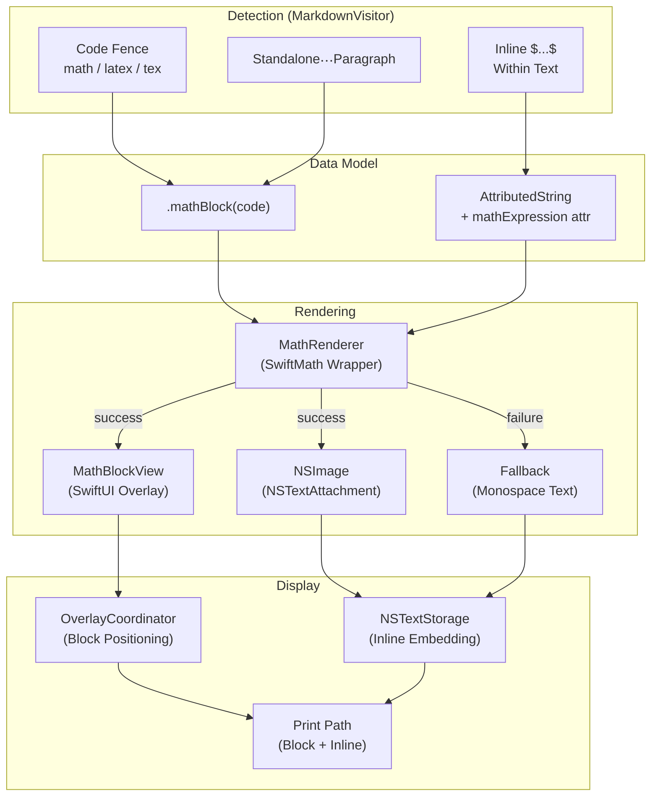
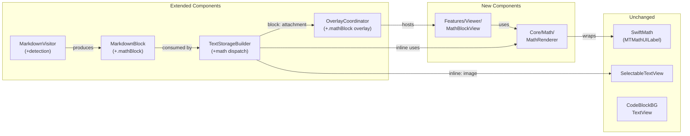
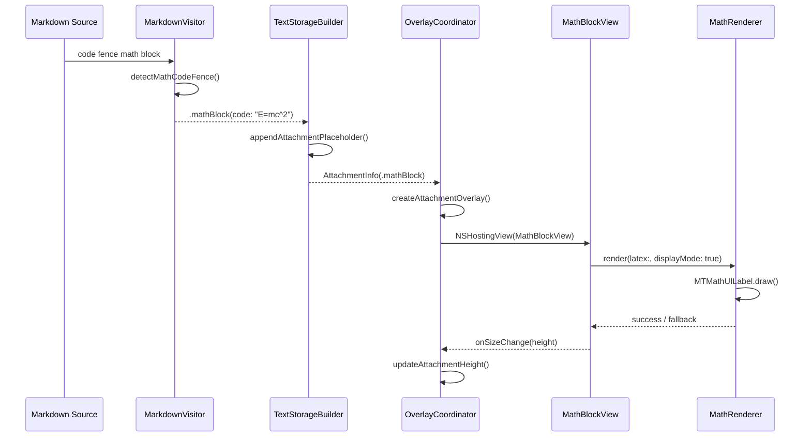
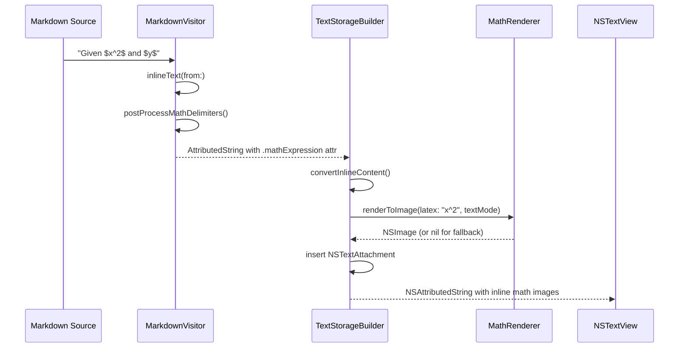
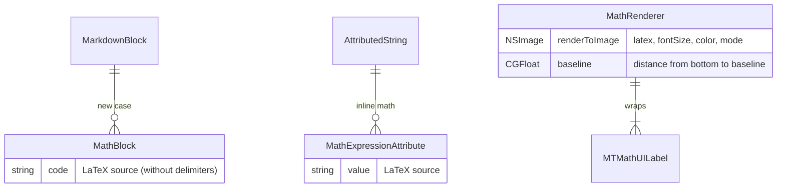

# Technical Design: Native LaTeX Math Rendering

**Feature ID**: native-latex-math
**Version**: 1.0.0
**Created**: 2026-02-24
**Status**: Draft

## 1. Design Overview

This design adds native LaTeX math rendering to mkdn's Markdown viewer, extending the existing rendering pipeline with three detection paths (code fences, standalone `$$`, inline `$`) and two rendering modes (block overlay, inline attachment). SwiftMath provides the typesetting engine. Expressions that fail to parse degrade to styled monospace. The design follows existing patterns: block math uses the attachment-overlay pattern (like Mermaid/images), inline math embeds as `NSTextAttachment` images within the `NSAttributedString`.

### High-Level Architecture



## 2. Architecture

### Component Architecture

The feature adds a new `Core/Math/` module and extends four existing modules:



### Block Math Data Flow (Sequence)



### Inline Math Data Flow (Sequence)



## 3. Detailed Design

### 3.1 Data Model Changes

#### MarkdownBlock Enum Extension

```swift
// MarkdownBlock.swift - new case
enum MarkdownBlock: Identifiable {
    // ... existing cases ...
    case mathBlock(code: String)

    var id: String {
        // ... existing cases ...
        case let .mathBlock(code):
            "math-\(stableHash(code))"
    }
}
```

#### Inline Math Attribute

A custom `AttributedString.Key` to mark inline math expressions detected during visitor post-processing:

```swift
// New: MathAttributes.swift in Core/Math/
extension AttributeScopes {
    struct MathAttributes: AttributeScope {
        let mathExpression: MathExpressionAttribute
    }
}

extension AttributeDynamicLookup {
    subscript<T>(
        dynamicMember keyPath: KeyPath<AttributeScopes.MathAttributes, T>
    ) -> T where T: AttributedStringKey {
        self[T.self]
    }
}

struct MathExpressionAttribute: CodableAttributedStringKey, MarkdownDecodableAttributedStringKey {
    typealias Value = String  // The LaTeX source
    static let name = "mathExpression"
}
```

### 3.2 Detection Logic (MarkdownVisitor)

#### Code Fence Detection

In `convertBlock`, extend the CodeBlock handler:

```swift
case let codeBlock as CodeBlock:
    let language = codeBlock.language?.lowercased()
    let code = codeBlock.code

    if language == "mermaid" {
        return .mermaidBlock(code: code)
    }
    if language == "math" || language == "latex" || language == "tex" {
        return .mathBlock(code: code.trimmingCharacters(in: .whitespacesAndNewlines))
    }
    return .codeBlock(language: language, code: code)
```

#### Standalone `$$` Detection

In `convertParagraph`, before the inline text path:

```swift
private func convertParagraph(_ paragraph: Paragraph) -> MarkdownBlock {
    let children = Array(paragraph.children)

    // Standalone image promotion (existing)
    if children.count == 1, let image = children.first as? Markdown.Image {
        let source = image.source ?? ""
        let alt = plainText(from: image)
        return .image(source: source, alt: alt)
    }

    // Standalone $$ block math detection (new)
    let rawText = plainText(from: paragraph)
    let trimmed = rawText.trimmingCharacters(in: .whitespacesAndNewlines)
    if trimmed.hasPrefix("$$"), trimmed.hasSuffix("$$"),
       trimmed.count > 4  // not just "$$$$"
    {
        let latex = String(trimmed.dropFirst(2).dropLast(2))
            .trimmingCharacters(in: .whitespacesAndNewlines)
        if !latex.isEmpty {
            return .mathBlock(code: latex)
        }
    }

    let text = inlineText(from: paragraph)
    return .paragraph(text: text)
}
```

#### Inline `$...$` Detection

After building the `AttributedString` from inline children, post-process to find `$...$` patterns:

```swift
private func inlineText(from markup: any Markup) -> AttributedString {
    var result = AttributedString()
    for child in markup.children {
        result.append(convertInline(child))
    }
    return postProcessMathDelimiters(result)
}

/// Scans the AttributedString for $...$ patterns and marks them
/// with the mathExpression attribute containing the LaTeX source.
private func postProcessMathDelimiters(
    _ input: AttributedString
) -> AttributedString {
    let fullString = String(input.characters)
    guard fullString.contains("$") else { return input }

    var result = input
    let mathRanges = findInlineMathRanges(in: fullString)

    // Apply in reverse order to preserve range validity
    for (range, latex) in mathRanges.reversed() {
        guard let attrRange = attributedStringRange(
            for: range, in: result
        ) else { continue }
        var mathSegment = AttributedString(latex)
        mathSegment.mathExpression = latex
        result.replaceSubrange(attrRange, with: mathSegment)
    }

    return result
}
```

The `findInlineMathRanges` function implements the dollar-sign detection rules:

```swift
/// Finds valid $...$ math delimiters following business rules:
/// - BR-2: $ followed by whitespace is not a delimiter
/// - REQ-IDET-2: \$ is a literal dollar sign
/// - REQ-IDET-3: $$ is not an inline delimiter
/// - REQ-IDET-5: Unclosed $ is literal text
private func findInlineMathRanges(
    in text: String
) -> [(Range<String.Index>, String)] {
    // Implementation: character-by-character scan with state machine
    // Returns array of (range-including-delimiters, latex-content) pairs
    // ...
}
```

### 3.3 MathRenderer (Core/Math/)

A stateless enum that wraps SwiftMath's `MTMathUILabel` for rendering LaTeX to images:

```swift
// Core/Math/MathRenderer.swift
import AppKit
import SwiftMath

/// Renders LaTeX math expressions to NSImage using SwiftMath.
///
/// All rendering happens synchronously on @MainActor (MTMathUILabel
/// is an NSView and requires AppKit main thread access).
@MainActor
enum MathRenderer {
    /// Renders a LaTeX expression to an NSImage.
    ///
    /// - Parameters:
    ///   - latex: The LaTeX math expression (without delimiters)
    ///   - fontSize: Point size for rendering
    ///   - textColor: Foreground color for the math glyphs
    ///   - displayMode: true for display equations (larger, centered operators),
    ///                  false for inline (text-sized operators)
    /// - Returns: A tuple of (image, baseline) on success, nil on parse failure.
    ///   The baseline is the distance from the bottom of the image to the
    ///   mathematical baseline, used for NSTextAttachment alignment.
    static func renderToImage(
        latex: String,
        fontSize: CGFloat,
        textColor: NSColor,
        displayMode: Bool = false
    ) -> (image: NSImage, baseline: CGFloat)? {
        let label = MTMathUILabel()
        label.latex = latex
        label.fontSize = fontSize
        label.textColor = textColor
        label.labelMode = displayMode ? .display : .text

        // Check for parse failure
        guard label.hasError == false else { return nil }

        let size = label.sizeThatFits(.zero)
        guard size.width > 0, size.height > 0 else { return nil }

        // Render to image at screen scale for crispness
        let scale = NSScreen.main?.backingScaleFactor ?? 2.0
        let pixelSize = NSSize(
            width: ceil(size.width * scale),
            height: ceil(size.height * scale)
        )

        let image = NSImage(size: size)
        image.addRepresentation(
            NSBitmapImageRep(
                bitmapDataPlanes: nil,
                pixelsWide: Int(pixelSize.width),
                pixelsHigh: Int(pixelSize.height),
                bitsPerSample: 8,
                samplesPerPixel: 4,
                hasAlpha: true,
                isPlanar: false,
                colorSpaceName: .deviceRGB,
                bytesPerRow: 0,
                bitsPerPixel: 0
            )!
        )
        image.lockFocus()
        label.draw(CGRect(origin: .zero, size: size))
        image.unlockFocus()

        // MTMathUILabel reports descent as the baseline offset
        let baseline = label.descent
        return (image: image, baseline: baseline)
    }
}
```

### 3.4 Block Math Rendering

Block math follows the existing Mermaid/image overlay pattern:

1. `MarkdownTextStorageBuilder` dispatches `.mathBlock` to `appendAttachmentPlaceholder` (same as `.mermaidBlock` and `.image`)
2. `OverlayCoordinator` creates an `NSHostingView<MathBlockView>` for the overlay
3. `MathBlockView` renders the expression and reports its size back

#### MathBlockView (SwiftUI)

```swift
// Features/Viewer/Views/MathBlockView.swift
import SwiftUI

/// Renders a block-level math expression as a centered display equation.
/// Uses SwiftMath's MTMathUILabel wrapped in a native SwiftUI view.
struct MathBlockView: View {
    let code: String
    var onSizeChange: ((CGFloat) -> Void)?

    @Environment(AppSettings.self) private var appSettings

    @State private var renderedImage: NSImage?
    @State private var hasFailed = false
    @State private var renderedHeight: CGFloat = 40

    private var colors: ThemeColors {
        appSettings.theme.colors
    }

    var body: some View {
        Group {
            if let image = renderedImage {
                Image(nsImage: image)
                    .interpolation(.high)
                    .frame(maxWidth: .infinity, alignment: .center)
                    .padding(.vertical, 8)
            } else if hasFailed {
                fallbackView
            } else {
                Color.clear.frame(height: 40)
            }
        }
        .onAppear { renderMath() }
        .onChange(of: appSettings.theme) { _, _ in renderMath() }
        .onChange(of: appSettings.scaleFactor) { _, _ in renderMath() }
    }

    private var fallbackView: some View {
        Text(code)
            .font(.system(.body, design: .monospaced))
            .foregroundColor(colors.foregroundSecondary)
            .frame(maxWidth: .infinity, alignment: .center)
            .padding(.vertical, 8)
    }

    private func renderMath() {
        let foreground = PlatformTypeConverter.nsColor(from: colors.foreground)
        let baseFontSize = PlatformTypeConverter.bodyFont(
            scaleFactor: appSettings.scaleFactor
        ).pointSize
        let displayFontSize = baseFontSize * 1.2  // Display mode slightly larger

        if let result = MathRenderer.renderToImage(
            latex: code,
            fontSize: displayFontSize,
            textColor: foreground,
            displayMode: true
        ) {
            renderedImage = result.image
            hasFailed = false
            let totalHeight = result.image.size.height + 16  // +padding
            renderedHeight = totalHeight
            onSizeChange?(totalHeight)
        } else {
            renderedImage = nil
            hasFailed = true
            let estimatedHeight: CGFloat = 40
            renderedHeight = estimatedHeight
            onSizeChange?(estimatedHeight)
        }
    }
}
```

#### OverlayCoordinator Extensions

In `OverlayCoordinator.swift`:

```swift
// needsOverlay - add .mathBlock
private func needsOverlay(_ block: MarkdownBlock) -> Bool {
    switch block {
    case .mermaidBlock, .image, .thematicBreak, .mathBlock:
        true
    default:
        false
    }
}

// createAttachmentOverlay - add .mathBlock case
case let .mathBlock(code):
    overlayView = makeMathBlockOverlay(
        code: code,
        blockIndex: info.blockIndex,
        appSettings: appSettings
    )

// blocksMatch - add .mathBlock case
case let (.mathBlock(code1), .mathBlock(code2)):
    code1 == code2

// New factory method
func makeMathBlockOverlay(
    code: String,
    blockIndex: Int,
    appSettings: AppSettings
) -> NSView {
    let rootView = MathBlockView(code: code) { [weak self] newHeight in
        self?.updateAttachmentHeight(
            blockIndex: blockIndex,
            newHeight: newHeight
        )
    }
    .environment(appSettings)
    return NSHostingView(rootView: rootView)
}
```

### 3.5 Inline Math Rendering

In `MarkdownTextStorageBuilder.convertInlineContent`, detect the `mathExpression` attribute on runs and render to `NSTextAttachment`:

```swift
// New file: MarkdownTextStorageBuilder+MathInline.swift
extension MarkdownTextStorageBuilder {
    /// Checks if an AttributedString run contains a math expression and
    /// renders it to an NSTextAttachment image. Returns nil if the run
    /// is not a math expression.
    static func renderInlineMath(
        from run: AttributedString.Runs.Run,
        content: AttributedString,
        baseFont: NSFont,
        baseForegroundColor: NSColor,
        scaleFactor: CGFloat
    ) -> NSAttributedString? {
        guard let latex = content[run.range].mathExpression else {
            return nil
        }

        // Attempt SwiftMath rendering
        if let result = MathRenderer.renderToImage(
            latex: latex,
            fontSize: baseFont.pointSize,
            textColor: baseForegroundColor,
            displayMode: false
        ) {
            let attachment = NSTextAttachment()
            attachment.image = result.image

            // Baseline alignment: set bounds with negative y origin
            // so the attachment baseline aligns with surrounding text
            let height = result.image.size.height
            let width = result.image.size.width
            let yOffset = -(result.baseline)
            attachment.bounds = CGRect(
                x: 0, y: yOffset,
                width: width, height: height
            )

            return NSAttributedString(attachment: attachment)
        }

        // Fallback: monospace styled text
        let monoFont = PlatformTypeConverter.monospacedFont(scaleFactor: scaleFactor)
        let secondaryColor = baseForegroundColor.withAlphaComponent(0.6)
        return NSAttributedString(
            string: latex,
            attributes: [
                .font: monoFont,
                .foregroundColor: secondaryColor,
            ]
        )
    }
}
```

In `convertInlineContent`, add math detection before the existing run processing:

```swift
static func convertInlineContent(
    _ content: AttributedString,
    baseFont: NSFont,
    baseForegroundColor: NSColor,
    linkColor: NSColor,
    scaleFactor: CGFloat = 1.0
) -> NSMutableAttributedString {
    let result = NSMutableAttributedString()

    for run in content.runs {
        // Check for inline math first
        if let mathResult = renderInlineMath(
            from: run,
            content: content,
            baseFont: baseFont,
            baseForegroundColor: baseForegroundColor,
            scaleFactor: scaleFactor
        ) {
            result.append(mathResult)
            continue
        }

        // ... existing run processing (font, color, link, etc.) ...
    }

    return result
}
```

### 3.6 Print Support

#### Inline Math Print

Inline math rendered as `NSTextAttachment` images prints naturally through the standard `NSPrintOperation` path. The `NSTextAttachment.image` is drawn by TextKit during print layout. The image must be re-rendered with print palette colors.

In `MarkdownTextStorageBuilder.build()`, when `isPrint: true`, the `convertInlineContent` call already receives `PrintPalette.colors.foreground` (black). The `MathRenderer.renderToImage` call within `renderInlineMath` uses `baseForegroundColor`, which will be the print palette's black foreground. This ensures inline math prints in black automatically.

#### Block Math Print

Block math uses the overlay pattern, so overlays are not present during print. A print-time rendering path is needed. The preferred approach renders block math directly into the text storage during the print build pass (when `isPrint: true`), inserting the rendered image as an `NSTextAttachment` rather than a placeholder. This avoids the need for a separate drawBackground extension and reuses the existing print pipeline:

```swift
// In appendBlock, for .mathBlock when isPrint:
case let .mathBlock(code):
    if isPrint {
        appendMathBlockInline(
            to: result, code: code, colors: colors, scaleFactor: sf
        )
    } else {
        appendAttachmentPlaceholder(
            indexedBlock, to: result, attachments: &attachments
        )
    }
```

The `appendMathBlockInline` method renders the math expression using `MathRenderer` and inserts it as a centered `NSTextAttachment` with the appropriate paragraph style.

### 3.7 Theme Integration

Block math re-renders on theme change via `MathBlockView.onChange(of: appSettings.theme)`. The `MathRenderer` receives the new foreground color and produces a new image. This satisfies REQ-BRND-4 (instant theme update).

Inline math is re-rendered when the full `TextStorageResult` is rebuilt on theme change (in `MarkdownPreviewView.onChange(of: appSettings.theme)`). The `convertInlineContent` call receives the new theme colors, and `renderInlineMath` uses the new `baseForegroundColor`. This produces new attachment images with the correct color.

### 3.8 Inline Math Detection Rules

The dollar-sign scanner implements these rules as a character-by-character state machine:

| Rule | Implementation |
|------|----------------|
| `\$` is literal | Skip `$` preceded by unescaped `\` |
| `$$` is not inline | Skip when next char is also `$` |
| Opening `$` + whitespace is not math | Require non-whitespace after opening `$` |
| Whitespace + closing `$` is not math | Require non-whitespace before closing `$` |
| Unclosed `$` is literal | If no matching closer found, treat as text |
| Empty `$$` is literal | Zero-length content between delimiters is rejected |

### Data Model



## 4. Technology Stack

| Layer | Technology | Existing/New |
|-------|-----------|-------------|
| LaTeX parsing + rendering | SwiftMath (mgriebling/SwiftMath >= 3.3.0) | New dependency |
| Block math overlay | NSHostingView + SwiftUI (MathBlockView) | Existing pattern |
| Inline math embedding | NSTextAttachment + NSImage | Existing pattern |
| Math detection | Custom scanner (MarkdownVisitor) | New code |
| Print rendering | MarkdownTextStorageBuilder (isPrint path) | Existing pattern |

## 5. Implementation Plan

### T1: Foundation - Package.swift + Data Model

**Files modified:**
- `Package.swift` -- add SwiftMath dependency to dependencies and mkdnLib target
- `mkdn/Core/Markdown/MarkdownBlock.swift` -- add `.mathBlock(code:)` case with `id` and `Identifiable` conformance
- New: `mkdn/Core/Math/MathAttributes.swift` -- inline math `AttributedString.Key`

**Scope:** Add the SwiftMath package dependency. Extend `MarkdownBlock` with the new `.mathBlock` case. Define the inline math attribute key. Update `plainText(from:)` in the builder for the new case.

### T2: MathRenderer - SwiftMath Wrapper

**Files created:**
- `mkdn/Core/Math/MathRenderer.swift` -- `@MainActor enum MathRenderer` with `renderToImage(latex:fontSize:textColor:displayMode:)` returning `(image: NSImage, baseline: CGFloat)?`

**Scope:** Wrap SwiftMath's `MTMathUILabel` in a stateless rendering API. Handle error detection (parse failure -> nil return). Render at screen backing scale factor for crisp output. Report baseline offset for inline alignment.

### T3: MarkdownVisitor - Math Detection

**Files modified:**
- `mkdn/Core/Markdown/MarkdownVisitor.swift` -- three detection paths:
  1. Code fence: extend `convertBlock` CodeBlock handler for `math`/`latex`/`tex` languages
  2. Standalone `$$`: extend `convertParagraph` with `$$` prefix/suffix check before inline path
  3. Inline `$`: add `postProcessMathDelimiters()` in `inlineText(from:)` with character-by-character scanner

**Scope:** Detection only. No rendering logic. Produces `.mathBlock` for block math and `mathExpression` attribute for inline math.

### T4: TextStorageBuilder - Math Rendering Integration

**Files modified:**
- `mkdn/Core/Markdown/MarkdownTextStorageBuilder.swift` -- update `appendBlock` dispatch for `.mathBlock`, update `plainText(from:)`, update `convertInlineContent` to check for math attribute
- `mkdn/Core/Markdown/MarkdownTextStorageBuilder+Blocks.swift` -- add `appendMathBlockInline` for print path

**Files created:**
- `mkdn/Core/Markdown/MarkdownTextStorageBuilder+MathInline.swift` -- `renderInlineMath` static method for inline math attachment rendering with fallback

**Scope:** Wire math blocks to attachment placeholders (screen) or inline images (print). Wire inline math to NSTextAttachment images with baseline alignment. Implement monospace fallback for parse failures.

### T5: MathBlockView + OverlayCoordinator Integration

**Files created:**
- `mkdn/Features/Viewer/Views/MathBlockView.swift` -- SwiftUI view rendering display-mode math with theme-reactive re-rendering and fallback

**Files modified:**
- `mkdn/Features/Viewer/Views/OverlayCoordinator.swift` -- extend `needsOverlay`, `blocksMatch`, `createAttachmentOverlay` for `.mathBlock`; add `makeMathBlockOverlay` factory
- `mkdn/Features/Viewer/Views/MarkdownBlockView.swift` -- add `.mathBlock` case (for completeness)

**Scope:** Block math overlay lifecycle. SwiftUI view with theme change handling. OverlayCoordinator creates and positions math overlays identically to Mermaid/image overlays.

### T6: Print Support

**Files modified:**
- `mkdn/Core/Markdown/MarkdownTextStorageBuilder+Blocks.swift` -- `appendMathBlockInline` renders math to centered NSTextAttachment for print, or centered monospace fallback

**Scope:** When `isPrint: true`, block math is rendered directly into the attributed string as a centered NSTextAttachment image using PrintPalette colors. Inline math already prints correctly because `convertInlineContent` receives print palette colors.

### T7: Tests + Fixture

**Files created:**
- `fixtures/math-test.md` -- comprehensive test fixture covering all math syntaxes, edge cases, fallback scenarios
- `mkdnTests/Unit/Core/MathRendererTests.swift` -- unit tests for MathRenderer (valid expressions, invalid expressions, baseline reporting)
- `mkdnTests/Unit/Core/MarkdownVisitorMathTests.swift` -- unit tests for math detection (code fences, $$, inline $, escaped \$, edge cases)
- `mkdnTests/Unit/Core/MarkdownTextStorageBuilderMathTests.swift` -- unit tests for math block dispatch and inline math rendering

**Scope:** Test fixture for visual verification. Unit tests for detection logic and rendering integration.

## 6. Implementation DAG

**Parallel Groups** (tasks with no inter-dependencies):

1. [T1] - Foundation (no dependencies)
2. [T2, T3] - MathRenderer and MarkdownVisitor detection (both depend only on T1)
3. [T4] - TextStorageBuilder integration (depends on T2 + T3)
4. [T5] - MathBlockView + OverlayCoordinator (depends on T2 + T4)
5. [T6] - Print support (depends on T4)
6. [T7] - Tests + fixture (depends on T3 + T4 + T5 + T6)

**Dependencies**:

- T2 -> T1 (build: SwiftMath dependency must be available)
- T3 -> T1 (data: needs .mathBlock case + math attribute definition)
- T4 -> [T2, T3] (interface: needs MathRenderer API + visitor detection output)
- T5 -> [T2, T4] (interface: needs MathRenderer + block dispatch in builder)
- T6 -> T4 (data: extends builder's isPrint path for .mathBlock)
- T7 -> [T3, T4, T5, T6] (sequential: tests require all feature code)

**Critical Path**: T1 -> T2 -> T4 -> T5 -> T7

## 7. Testing Strategy

### Test Value Assessment

| Test Category | Value | Rationale |
|---------------|-------|-----------|
| Inline math delimiter detection | HIGH | App-specific parser with complex business rules |
| Block math detection (code fences) | MEDIUM | Simple pattern match but regression-critical |
| Block math detection ($$) | MEDIUM | Edge cases around false positives |
| MathRenderer error handling | HIGH | Fallback behavior is core UX promise |
| Inline math baseline calculation | MEDIUM | App-specific integration logic |
| Theme color propagation | LOW | Framework behavior; verify via visual testing |
| Print path rendering | LOW | Verify via visual testing |

### Unit Tests

**MathRendererTests** (`@Suite`):
- `@Test("Renders simple expression")` -- `x^2` produces non-nil image
- `@Test("Returns nil for invalid LaTeX")` -- `\invalidcommand` returns nil
- `@Test("Reports positive baseline")` -- baseline > 0 for expressions with descenders
- `@Test("Respects display mode")` -- display mode produces different size than text mode
- `@Test("Uses specified color")` -- rendered image uses provided color (pixel sampling)

**MarkdownVisitorMathTests** (`@Suite`):
- `@Test("Detects math code fence")` -- ` ```math ` produces `.mathBlock`
- `@Test("Detects latex code fence")` -- ` ```latex ` produces `.mathBlock`
- `@Test("Detects tex code fence")` -- ` ```tex ` produces `.mathBlock`
- `@Test("Detects standalone $$")` -- paragraph of `$$E=mc^2$$` produces `.mathBlock`
- `@Test("Does not detect $$ in mixed paragraph")` -- `"Cost is $$5"` stays as `.paragraph`
- `@Test("Detects inline $")` -- `"Given $x^2$"` has `mathExpression` attribute
- `@Test("Escaped $ is literal")` -- `"Cost is \$5"` has no math attribute
- `@Test("Adjacent $$ not treated as inline")` -- `$$` in text is not inline math
- `@Test("Unclosed $ is literal")` -- `"Price is $5"` (no closer) has no math attribute
- `@Test("Multiple inline math in one paragraph")` -- `"$x$ and $y$"` has two math ranges
- `@Test("Empty delimiters produce no math")` -- `"$$"` with nothing between is literal

**MarkdownTextStorageBuilderMathTests** (`@Suite`):
- `@Test("Math block produces attachment")` -- `.mathBlock` generates AttachmentInfo
- `@Test("Math block print produces inline image")` -- isPrint=true generates NSTextAttachment in attributed string
- `@Test("Inline math produces attachment in text")` -- NSTextAttachment appears in attributed string at math position
- `@Test("Inline math fallback produces monospace text")` -- invalid math produces styled text, not attachment

### Visual Testing

Create `fixtures/math-test.md` with comprehensive coverage:

```markdown
# Math Rendering Test

## Block Math (Code Fence)

```math
\int_0^\infty e^{-x^2} dx = \frac{\sqrt{\pi}}{2}
```

## Block Math ($$)

$$E = mc^2$$

## Inline Math

The quadratic formula is $x = \frac{-b \pm \sqrt{b^2 - 4ac}}{2a}$ for any $ax^2 + bx + c = 0$.

## Multiple Inline

Given $x = 1$ and $y = 2$, then $x + y = 3$.

## Escaped Dollars

The price is \$42.00 and \$100.

## Fallback (Unsupported)

$$\begin{align} x &= 1 \\ y &= 2 \end{align}$$

## Math in Headings

### The $\pi$ constant

## Mixed Content

Regular text with $\alpha + \beta = \gamma$ inline and a block:

$$\sum_{i=1}^{n} i = \frac{n(n+1)}{2}$$

More text follows.
```

Visual verification workflow: load fixture, capture screenshots in both themes at multiple zoom levels, evaluate rendering quality.

## 8. Deployment Design

### Dependency Addition

Add to `Package.swift`:

```swift
// In dependencies array:
.package(url: "https://github.com/mgriebling/SwiftMath.git", from: "3.3.0"),

// In mkdnLib target dependencies:
.product(name: "SwiftMath", package: "SwiftMath"),
```

### Feature Flag

No feature flag needed. Math rendering activates automatically when math syntax is detected (NFR-USE-1). Documents without math are unaffected (BR-5, NFR-USE-2).

### Rollback

If SwiftMath causes issues, the dependency can be removed and the `.mathBlock` case can be changed to fall through to `.codeBlock(language: "math", code:)`, restoring pre-feature behavior.

## 9. Documentation Impact

| Type | Target | Section | KB Source | Rationale |
|------|--------|---------|-----------|-----------|
| edit | `.rp1/context/index.md` | Quick Reference | index.md:Quick Reference | Add `mkdn/Core/Math/` entry |
| edit | `.rp1/context/modules.md` | Core Layer | modules.md:Core Layer | Add Math module inventory |
| edit | `.rp1/context/modules.md` | Dependencies | modules.md:Dependencies | Add SwiftMath dependency |
| edit | `.rp1/context/architecture.md` | Rendering Pipeline | architecture.md:Markdown | Add Math pipeline diagram |
| edit | `.rp1/context/patterns.md` | (new section) | patterns.md | Add inline math rendering pattern |

## 10. Design Decisions Log

| ID | Decision | Choice | Rationale | Alternatives Considered |
|----|----------|--------|-----------|------------------------|
| D1 | Math rendering library | SwiftMath (mgriebling/SwiftMath) | Requirements specify it; native CoreGraphics rendering, no WebView, MIT license, active maintenance | LaTeXSwiftUI (uses WKWebView, violates constraints), MathJax via JSC (complex, JS dependency) |
| D2 | Block math rendering approach | Overlay pattern (NSTextAttachment placeholder + NSHostingView) | Identical to existing Mermaid/image pattern; consistent architecture, theme-reactive | Inline rendering in NSTextStorage (would work but loses overlay positioning and dynamic sizing) |
| D3 | Inline math rendering approach | NSImage via NSTextAttachment in NSAttributedString | Natural fit for TextKit 2 text flow; baseline alignment via attachment bounds; prints naturally | SwiftUI overlay per inline expression (positioning nightmare), attributed string font manipulation (SwiftMath uses its own rendering) |
| D4 | Inline math detection location | Post-processing in MarkdownVisitor after AttributedString construction | swift-markdown does not parse $ delimiters; post-processing the final string is cleanest | Pre-processing raw Markdown text (fragile, loses AST context), custom swift-markdown plugin (complex, undocumented API) |
| D5 | Block math print strategy | Render inline in TextStorageBuilder when isPrint=true | Simplest approach; reuses existing print pipeline; no new drawBackground extension needed | drawBackground extension like tables (more complex, tables needed it because of invisible text pattern) |
| D6 | Inline math attribute definition | Custom AttributedString.Key (MathExpressionAttribute) | Clean separation between detection (MarkdownVisitor) and rendering (TextStorageBuilder); follows pattern of other custom attributes in the codebase | Sentinel characters in text (fragile), separate data structure alongside AttributedString (complex) |
| D7 | Theme change handling for block math | Re-render in MathBlockView.onChange(of: theme) | SwiftMath renders color into the image; must re-render to change color. Lightweight operation (< 1ms per expression) | CALayer color manipulation (not possible with bitmap), separate color overlay (quality loss) |
| D8 | Inline math theme change handling | Full TextStorageResult rebuild on theme change | Already happens in MarkdownPreviewView.onChange(of: appSettings.theme); inline math re-renders as part of the full rebuild | Selective attachment replacement (complex, unnecessary given full rebuild is already the pattern) |
| D9 | MathRenderer concurrency model | @MainActor stateless enum | MTMathUILabel is an NSView requiring main thread; stateless enum avoids actor overhead; synchronous rendering is fast (< 1ms per expression) | Actor like MermaidRenderer (unnecessary overhead, MermaidRenderer is an actor because JSC access needs serialization) |
| D10 | Inline math baseline alignment | NSTextAttachment.bounds with negative y origin | Standard NSTextAttachment technique for baseline alignment; MTMathUILabel reports descent for precise positioning | Manual font metric calculation (less accurate), fixed offset (does not adapt to expression shape) |
