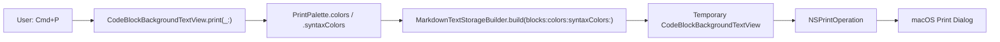
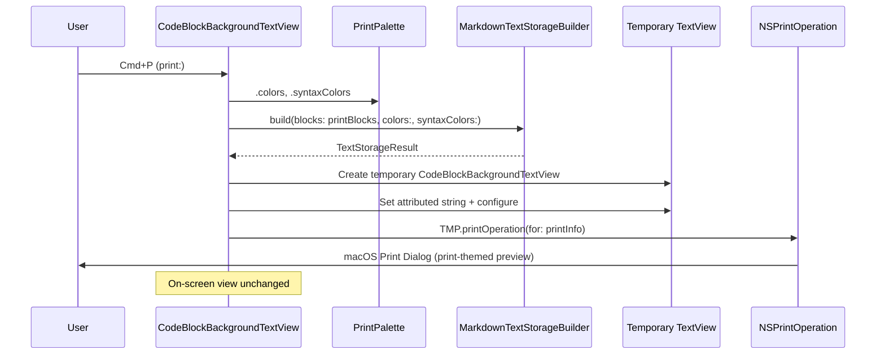

# Design: Print-Friendly Theme

**Feature ID**: print-theme
**Version**: 1.0.0
**Status**: Draft
**Created**: 2026-02-15

## 1. Design Overview

When the user presses Cmd+P, the `CodeBlockBackgroundTextView` (NSTextView subclass) intercepts the print action, rebuilds the `NSAttributedString` using a dedicated print color palette via the existing `MarkdownTextStorageBuilder` pipeline, creates a temporary off-screen text view with the print-themed content, and runs the print operation on that temporary view. The on-screen view is never modified, eliminating any flicker or theme flash.

### High-Level Architecture



## 2. Architecture

### Component Interaction

The print feature introduces three new components and one refactored interface:

**New components:**
1. `PrintPalette` -- static print color definitions (follows `SolarizedDark`/`SolarizedLight` pattern)
2. `CodeBlockBackgroundTextView.print(_:)` override -- print interception and temporary view creation
3. Stored `printBlocks` property on `CodeBlockBackgroundTextView` -- retains current `[IndexedBlock]` for print-time rebuild

**Refactored interface:**
4. `MarkdownTextStorageBuilder.build(blocks:colors:syntaxColors:)` -- new overload accepting `ThemeColors` + `SyntaxColors` directly, enabling print palette usage without adding a new `AppTheme` case

### Sequence Diagram



## 3. Detailed Design

### 3.1 PrintPalette

New file: `mkdn/UI/Theme/PrintPalette.swift`

Follows the exact pattern of `SolarizedDark.swift` / `SolarizedLight.swift`: a caseless enum with static `colors: ThemeColors` and `syntaxColors: SyntaxColors` properties.

**Print ThemeColors:**

| Field | Value | Rationale |
|-------|-------|-----------|
| `background` | `#FFFFFF` (white) | Standard print background |
| `backgroundSecondary` | `#F5F5F5` | Subtle distinction for secondary areas |
| `foreground` | `#000000` (black) | Maximum contrast on white paper |
| `foregroundSecondary` | `#555555` | De-emphasized secondary text |
| `accent` | `#003399` | Dark blue, ink-efficient accent |
| `border` | `#CCCCCC` | Light gray border, subtle on paper |
| `codeBackground` | `#F5F5F5` | Very light gray, ink-efficient, distinguishable |
| `codeForeground` | `#1A1A1A` | Near-black for code text |
| `linkColor` | `#003399` | Dark blue, standard print convention |
| `headingColor` | `#000000` | Black headings for maximum prominence |
| `blockquoteBorder` | `#999999` | Medium gray left border |
| `blockquoteBackground` | `#FAFAFA` | Near-white, barely visible |

**Print SyntaxColors:**

All colors chosen to meet WCAG AA (4.5:1 contrast ratio against `#FFFFFF`):

| Token | Value | Contrast vs White | Rationale |
|-------|-------|-------------------|-----------|
| `keyword` | `#1A6B00` (dark green) | ~7:1 | Distinct from types/functions |
| `string` | `#A31515` (dark red) | ~5.5:1 | Standard print convention for strings |
| `comment` | `#6A737D` (gray) | ~4.6:1 | Visually de-emphasized per FR-4 AC-4.2 |
| `type` | `#7B4D00` (dark amber) | ~5.5:1 | Warm tone, distinct from keywords |
| `number` | `#6F42C1` (dark purple) | ~5:1 | Distinct from all others |
| `function` | `#005CC5` (dark blue) | ~5.5:1 | Distinct from keywords (green) |
| `property` | `#B35900` (dark orange) | ~4.6:1 | Warm, distinct from types |
| `preprocessor` | `#D73A49` (dark red-pink) | ~5:1 | Distinct from strings |

### 3.2 MarkdownTextStorageBuilder Refactor

Add a new public overload:

```swift
static func build(
    blocks: [IndexedBlock],
    colors: ThemeColors,
    syntaxColors: SyntaxColors
) -> TextStorageResult
```

The existing `build(blocks:theme:)` delegates to this:

```swift
static func build(
    blocks: [IndexedBlock],
    theme: AppTheme
) -> TextStorageResult {
    build(blocks: blocks, colors: theme.colors, syntaxColors: theme.syntaxColors)
}
```

**Internal changes:** Replace `theme: AppTheme` parameter with `syntaxColors: SyntaxColors` in:
- `appendBlock` -- passes `syntaxColors` instead of `theme`
- `appendCodeBlock` -- receives `syntaxColors` instead of `theme`
- `highlightSwiftCode` -- receives `SyntaxColors` instead of `AppTheme`
- `appendBlockquote`, `appendOrderedList`, `appendUnorderedList` -- replace `theme: AppTheme` with `syntaxColors: SyntaxColors` (only used for recursive threading)
- `BlockBuildContext` -- stores `syntaxColors: SyntaxColors` instead of `theme: AppTheme`

This is a focused, mechanical refactor. All call sites within the builder are internal (private/static). The only external call site is `MarkdownPreviewView`, which continues using `build(blocks:theme:)`.

### 3.3 CodeBlockBackgroundTextView Print Override

Add to `CodeBlockBackgroundTextView`:

```swift
// MARK: - Print Support

/// Current indexed blocks for print-time rebuild.
var printBlocks: [IndexedBlock] = []

override func print(_ sender: Any?) {
    let printColors = PrintPalette.colors
    let printSyntax = PrintPalette.syntaxColors

    let result = MarkdownTextStorageBuilder.build(
        blocks: printBlocks,
        colors: printColors,
        syntaxColors: printSyntax
    )

    let printView = Self.makePrintTextView(
        attributedString: result.attributedString,
        size: self.bounds.size
    )

    let printInfo = NSPrintInfo.shared.copy() as! NSPrintInfo
    guard let printOp = printView.printOperation(for: printInfo) else {
        super.print(sender)
        return
    }
    printOp.showsPrintPanel = true
    printOp.showsProgressPanel = true
    printOp.run()
}

private static func makePrintTextView(
    attributedString: NSAttributedString,
    size: NSSize
) -> CodeBlockBackgroundTextView {
    // Create with TextKit 1 for reliable print layout
    let textView = CodeBlockBackgroundTextView(
        frame: NSRect(origin: .zero, size: size)
    )
    textView.isEditable = false
    textView.isSelectable = false
    textView.drawsBackground = true
    textView.backgroundColor = PlatformTypeConverter.nsColor(
        from: PrintPalette.colors.background
    )
    textView.textContainerInset = NSSize(width: 32, height: 32)
    textView.textContainer?.widthTracksTextView = true
    textView.textStorage?.setAttributedString(attributedString)
    textView.sizeToFit()
    return textView
}
```

**Key design choices:**
- Uses TextKit 1 (default NSTextView initializer) for the temporary print view. TextKit 1 has synchronous layout, ensuring all content is laid out before the print operation starts. The on-screen view uses TextKit 2 for performance, but print does not need incremental layout.
- The temporary view is a `CodeBlockBackgroundTextView` subclass instance so `drawBackground(in:)` runs during print, drawing code block containers with the print palette colors embedded in the attributed string's `CodeBlockColorInfo`.
- `printBlocks` is set as an empty array by default and populated by `SelectableTextView` whenever content changes.

### 3.4 SelectableTextView Plumbing

Pass blocks to the text view for print support:

**Add `blocks` parameter:**

```swift
struct SelectableTextView: NSViewRepresentable {
    let attributedText: NSAttributedString
    let attachments: [AttachmentInfo]
    let blocks: [IndexedBlock]  // NEW: for print rebuild
    let theme: AppTheme
    // ... rest unchanged
}
```

**In `makeNSView` and `updateNSView`, add:**

```swift
textView.printBlocks = blocks  // where blocks is self.blocks
```

**In `MarkdownPreviewView`, pass blocks:**

```swift
SelectableTextView(
    attributedText: textStorageResult.attributedString,
    attachments: textStorageResult.attachments,
    blocks: renderedBlocks,  // NEW
    theme: appSettings.theme,
    // ... rest unchanged
)
```

### 3.5 Data Model

No new data models or persistence. `PrintPalette` is static constants. The `ThemeColors` and `SyntaxColors` structs are unchanged.

### 3.6 Print-Friendly Code Block Colors

The `CodeBlockColorInfo` for print is automatically set by the builder when called with `PrintPalette.colors`:
- `background`: `NSColor` from `PrintPalette.colors.codeBackground` (#F5F5F5)
- `border`: `NSColor` from `PrintPalette.colors.border` (#CCCCCC)

The `CodeBlockBackgroundTextView.drawRoundedContainer` reads these from the attributed string attribute, so no changes needed to the drawing code.

## 4. Technology Stack

No new dependencies. Uses existing:

| Layer | Technology | Purpose |
|-------|-----------|---------|
| Theme | `ThemeColors` + `SyntaxColors` structs | Print palette definition |
| Builder | `MarkdownTextStorageBuilder` | NSAttributedString generation with print colors |
| Drawing | `CodeBlockBackgroundTextView` | Code block backgrounds + print interception |
| Print | AppKit `NSPrintOperation` | macOS print infrastructure |
| Syntax | Splash `SyntaxHighlighter` | Code highlighting with print syntax colors |

## 5. Implementation Plan

| # | Component | Description | Files Changed |
|---|-----------|-------------|---------------|
| T1 | PrintPalette definition | Create print color palette following SolarizedDark pattern | `mkdn/UI/Theme/PrintPalette.swift` (new) |
| T2 | Builder refactor | Add `build(blocks:colors:syntaxColors:)` overload; refactor internal methods to thread `syntaxColors` instead of `theme` | `mkdn/Core/Markdown/MarkdownTextStorageBuilder.swift`, `mkdn/Core/Markdown/MarkdownTextStorageBuilder+Blocks.swift`, `mkdn/Core/Markdown/MarkdownTextStorageBuilder+Complex.swift` |
| T3 | Print interception | Add `printBlocks` property and `print(_:)` override to `CodeBlockBackgroundTextView` | `mkdn/Features/Viewer/Views/CodeBlockBackgroundTextView.swift` |
| T4 | View plumbing | Add `blocks` parameter to `SelectableTextView`; pass from `MarkdownPreviewView` | `mkdn/Features/Viewer/Views/SelectableTextView.swift`, `mkdn/Features/Viewer/Views/MarkdownPreviewView.swift` |
| T5 | Unit tests | Print palette completeness, WCAG contrast, builder with print colors | `mkdnTests/Unit/Core/PrintPaletteTests.swift` (new), `mkdnTests/Unit/Core/MarkdownTextStorageBuilderTests.swift` (extend) |

## 6. Implementation DAG

**Parallel Groups** (tasks with no inter-dependencies):

1. [T1, T2] - T1 is pure color data; T2 is builder API refactor. No shared code changes.
2. [T3, T5] - T3 uses T1 palette + T2 builder API; T5 tests T1 palette + T2 builder API.
3. [T4] - View plumbing that depends on T3's `printBlocks` property existing.

**Dependencies**:

- T3 -> T1 (data: print override references `PrintPalette.colors` / `.syntaxColors`)
- T3 -> T2 (interface: print override calls `MarkdownTextStorageBuilder.build(blocks:colors:syntaxColors:)`)
- T4 -> T3 (interface: `SelectableTextView` sets `textView.printBlocks` which T3 adds)
- T5 -> T1 (data: tests verify `PrintPalette` color values and contrast)
- T5 -> T2 (interface: tests call `build(blocks:colors:syntaxColors:)`)

**Critical Path**: T2 -> T3 -> T4

## 7. Testing Strategy

### Test Value Assessment

| Valuable (design for) | Avoid |
|-----------------------|-------|
| Print palette completeness (all fields populated, distinct from screen themes) | Testing NSPrintOperation behavior |
| WCAG AA contrast ratio verification for all print syntax colors | Testing AppKit print dialog rendering |
| Builder produces valid attributed string with print palette colors | Testing NSTextView layout engine |
| Code block color info embeds print palette colors correctly | Testing Splash library highlighting |
| Builder refactor preserves existing behavior (regression) | Testing NSBezierPath drawing |

### Unit Tests

**PrintPaletteTests (new file)**:

| Test | Validates | Traces to |
|------|-----------|-----------|
| Print palette background is white | `PrintPalette.colors.background` | FR-1 AC-1.1 |
| Print palette foreground is black | `PrintPalette.colors.foreground` | FR-1 AC-1.2 |
| Print palette headings are black | `PrintPalette.colors.headingColor` | FR-1 AC-1.3 |
| All ThemeColors fields populated | `PrintPalette.colors` completeness | FR-1 AC-1.4 |
| All SyntaxColors fields populated | `PrintPalette.syntaxColors` completeness | FR-1 AC-1.4 |
| Print palette differs from SolarizedDark | Theme independence | FR-2 AC-2.2 |
| Print palette differs from SolarizedLight | Theme independence | FR-2 AC-2.2 |
| Link color is dark blue | `PrintPalette.colors.linkColor` | FR-5 AC-5.1 |
| Code background is light gray | `PrintPalette.colors.codeBackground` | FR-3 AC-3.1 |
| WCAG AA contrast for each syntax color | Contrast ratio >= 4.5:1 vs white | FR-4 AC-4.3, NFR-5 |
| Comments visually de-emphasized | Comment lightness > keyword lightness | FR-4 AC-4.2 |

**MarkdownTextStorageBuilderTests (extend)**:

| Test | Validates | Traces to |
|------|-----------|-----------|
| Build with explicit colors produces valid attributed string | New overload works | FR-6 AC-6.3 |
| Build with AppTheme matches build with explicit colors from same theme | Refactor regression | Regression |
| Code block ColorInfo uses provided palette colors | Print code block bg/border | FR-7 AC-7.1, AC-7.2 |

## 8. Deployment Design

No deployment-specific concerns. This is a compile-time feature that ships with the next app build. No feature flags, no runtime configuration, no server-side dependencies.

- Build: `swift build`
- Test: `swift test`
- Lint: `DEVELOPER_DIR=/Applications/Xcode-16.3.0.app/Contents/Developer swiftlint lint`
- Format: `swiftformat .`

## 9. Documentation Impact

| Type | Target | Section | KB Source | Rationale |
|------|--------|---------|-----------|-----------|
| add | `.rp1/context/modules.md` | UI Layer > Theme | `modules.md` | Add `PrintPalette.swift` to module inventory |
| edit | `.rp1/context/patterns.md` | Theme Access | `patterns.md` | Document print palette access pattern (`PrintPalette.colors`, not via `AppTheme`) |
| edit | `.rp1/context/architecture.md` | Rendering Pipeline | `architecture.md` | Add Print pipeline subsection documenting the print interception flow |

## 10. Design Decisions Log

| ID | Decision | Choice | Rationale |
|----|----------|--------|-----------|
| D1 | Print palette location | Separate `PrintPalette` enum, not an `AppTheme` case | Print is not a user-selectable theme. Adding it to `AppTheme` would expose it in the theme picker and cycle. Separate enum follows `SolarizedDark`/`SolarizedLight` pattern without polluting the screen theme system. |
| D2 | Print interception mechanism | Override `print(_:)` on `CodeBlockBackgroundTextView` with temporary view | Avoids modifying the on-screen attributed string (no flicker per NFR-2). Temporary view is self-contained and discarded after print. |
| D3 | Builder API | Add `build(blocks:colors:syntaxColors:)` overload; refactor internal threading | Minimal API surface change. Existing `build(blocks:theme:)` delegates to new overload. Print code calls new overload directly. No protocol/generics complexity. |
| D4 | Temporary print view layout engine | TextKit 1 (default NSTextView init) | TextKit 1 has synchronous layout. Print needs all content laid out before generating pages. TextKit 2 uses asynchronous viewport-based layout which is inappropriate for print. |
| D5 | Block storage for print | `printBlocks` property on `CodeBlockBackgroundTextView` | Simplest path: the view that handles `print:` has direct access to the data it needs. Avoids complex delegation or coordinator lookups. |
| D6 | Table/Mermaid/image print handling | Out of scope (noted in requirements) | These are overlay views, not part of the attributed string. Separate feature needed. |
| D7 | Syntax color values | Dark, high-contrast colors meeting WCAG AA 4.5:1 | Print readability on white paper requires higher contrast than screen themes designed for colored backgrounds. Industry standard print color conventions (dark green keywords, dark red strings, gray comments). |
