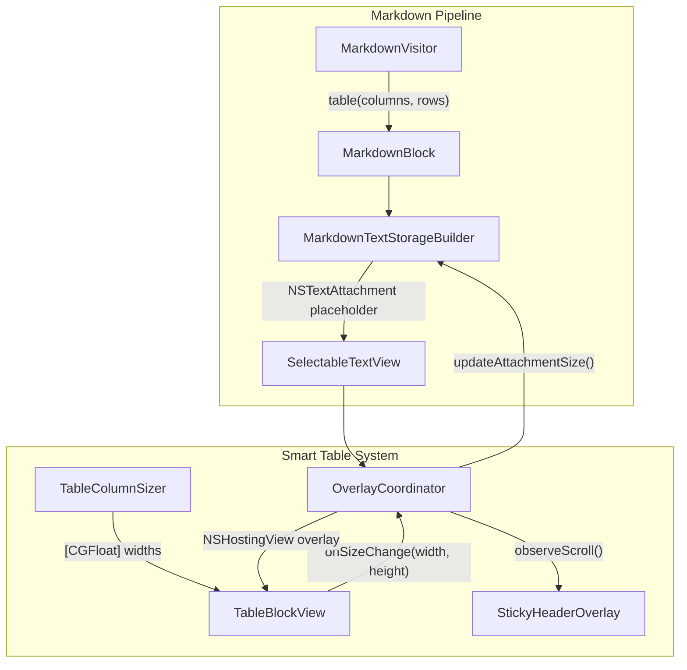
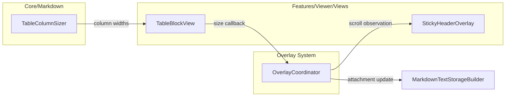
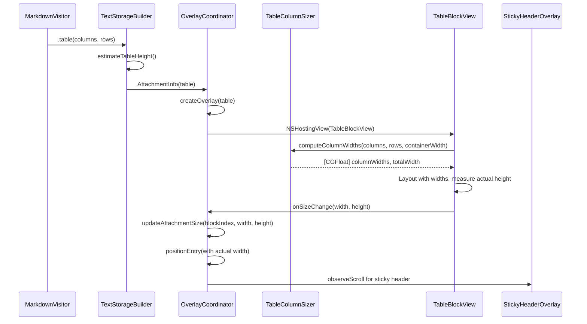

# Design: Smart Tables

**Feature ID**: smart-tables
**Version**: 1.0.0
**Status**: Draft
**Created**: 2026-02-11

## 1. Design Overview

Smart Tables replaces the current equal-width, non-wrapping table renderer with a content-aware layout engine. The design introduces a column measurement pass that computes intrinsic widths from cell content, a new SwiftUI table view with text wrapping and horizontal scroll support, variable-width overlay positioning in the OverlayCoordinator, and scroll-offset-based sticky headers for long tables.

The implementation follows the established overlay pattern: tables remain as NSHostingView overlays positioned over NSTextAttachment placeholders within the NSTextView, with height and width communicated back to the attachment system via callbacks.

### High-Level Architecture



## 2. Architecture

### Component Architecture



### Sequence: Table Render Flow



## 3. Detailed Design

### 3.1 TableColumnSizer

A new pure-computation enum in `mkdn/Core/Markdown/TableColumnSizer.swift` that measures column widths from table data.

**Algorithm**:

1. For each column, measure the intrinsic single-line width of every cell (header + all data rows) using `NSAttributedString.size()` with the body font.
2. Take the maximum intrinsic width per column.
3. Add horizontal cell padding (13pt x 2 = 26pt) to each column.
4. Apply a maximum column width cap: `min(intrinsicWidth + padding, maxColumnWidth)` where `maxColumnWidth = containerWidth * 0.6` (ensures at least two columns can be visible without scrolling).
5. Sum all column widths to get `totalContentWidth`.
6. Determine table width: `tableWidth = min(totalContentWidth, containerWidth)`.
7. If `totalContentWidth <= containerWidth`: use computed widths as-is. Table does not stretch.
8. If `totalContentWidth > containerWidth`: keep computed widths, enable horizontal scroll. The table scrolls rather than compressing columns.

**Interface**:

```swift
enum TableColumnSizer {
    struct Result {
        let columnWidths: [CGFloat]
        let totalWidth: CGFloat
        let needsHorizontalScroll: Bool
    }

    static func computeWidths(
        columns: [TableColumn],
        rows: [[AttributedString]],
        containerWidth: CGFloat,
        font: NSFont
    ) -> Result
}
```

**Width measurement**: Uses `NSAttributedString` initialized from the `AttributedString` cell content with the appropriate font, then calls `.size().width`. For header cells, uses the bold variant of the font. This matches the font metrics used by SwiftUI `Text` because both ultimately resolve through Core Text.

### 3.2 TableBlockView (Rewrite)

Replace the current equal-width HStack layout with an explicit-width layout that respects computed column widths.

**Structure**:

```swift
struct TableBlockView: View {
    let columns: [TableColumn]
    let rows: [[AttributedString]]
    let containerWidth: CGFloat
    var onSizeChange: ((CGFloat, CGFloat) -> Void)?

    @Environment(AppSettings.self) private var appSettings

    var body: some View {
        // 1. Compute column widths
        // 2. Determine if h-scroll needed
        // 3. Layout: optional ScrollView(.horizontal) wrapping table content
        // 4. Report actual size via GeometryReader + onSizeChange
    }
}
```

**Layout structure** (pseudocode):

```
GeometryReader (size reporting)
  ScrollView(.horizontal, showsIndicators: true/false)  // only when needed
    VStack(spacing: 0)
      HeaderRow (HStack of fixed-width cells)
      Divider
      ForEach rows
        DataRow (HStack of fixed-width cells)
    .clipShape(RoundedRectangle(cornerRadius: 6))
    .overlay(border)
```

**Cell rendering**:

Each cell is a `Text(attributedString)` view with:
- `.frame(width: columnWidths[colIndex], alignment: column.alignment)` -- explicit width, not `.infinity`
- `.lineLimit(nil)` -- allows unlimited wrapping
- `.fixedSize(horizontal: false, vertical: true)` -- wraps horizontally, grows vertically
- `.padding(.horizontal, 13)` / `.padding(.vertical, 6)` -- per REQ-ST-008

**Horizontal scroll**:

When `TableColumnSizer.Result.needsHorizontalScroll` is true, the table content is wrapped in `ScrollView(.horizontal, showsIndicators: true)`. The outer view clips to `containerWidth`. The `ScrollView` axes parameter ensures only horizontal scrolling is captured, keeping vertical document scrolling unaffected.

**Size reporting**:

A `GeometryReader` or `.onGeometryChange()` modifier on the table's root VStack captures the actual rendered size. The `onSizeChange(width, height)` callback fires when size changes, reporting the actual table width and height to the overlay coordinator.

### 3.3 OverlayCoordinator Updates

Three changes to the existing `OverlayCoordinator`:

#### 3.3.1 Variable-Width Overlay Positioning

Currently, `positionEntry` forces all overlays to `context.containerWidth`. For tables, the overlay should be positioned at the actual computed table width.

Add an optional `preferredWidth` to `OverlayEntry`:

```swift
private struct OverlayEntry {
    let view: NSView
    let attachment: NSTextAttachment
    let block: MarkdownBlock
    var preferredWidth: CGFloat?  // nil = use containerWidth (existing behavior)
}
```

Update `positionEntry` to use `preferredWidth` when available:

```swift
let overlayWidth = entry.preferredWidth ?? context.containerWidth
entry.view.frame = CGRect(
    x: context.origin.x,
    y: fragmentFrame.origin.y + context.origin.y,
    width: overlayWidth,
    height: fragmentFrame.height
)
```

#### 3.3.2 Size Callback for Tables

Update `makeTableOverlay` to pass `containerWidth` and an `onSizeChange` callback that:
1. Updates the entry's `preferredWidth`
2. Calls `updateAttachmentHeight(blockIndex:newHeight:)` for height
3. Calls `repositionOverlays()` to apply width change

```swift
private func makeTableOverlay(
    columns: [TableColumn],
    rows: [[AttributedString]],
    blockIndex: Int,
    appSettings: AppSettings
) -> NSView {
    let containerWidth = textView.map { textContainerWidth(in: $0) } ?? 600
    let rootView = TableBlockView(
        columns: columns,
        rows: rows,
        containerWidth: containerWidth
    ) { [weak self] width, height in
        guard let self else { return }
        self.updateTableSize(
            blockIndex: blockIndex,
            width: width,
            height: height
        )
    }
    .environment(appSettings)
    return NSHostingView(rootView: rootView)
}
```

#### 3.3.3 Attachment Width Update

Add a method to update attachment width (not just height):

```swift
func updateAttachmentSize(
    blockIndex: Int,
    newWidth: CGFloat?,
    newHeight: CGFloat
) {
    guard let entry = entries[blockIndex],
          let textView,
          let textStorage = textView.textStorage
    else { return }

    // Update preferred width on entry
    if let newWidth {
        entries[blockIndex] = OverlayEntry(
            view: entry.view,
            attachment: entry.attachment,
            block: entry.block,
            preferredWidth: newWidth
        )
    }

    // Update attachment height (existing logic)
    let attachment = entry.attachment
    guard abs(attachment.bounds.height - newHeight) > 1 else {
        repositionOverlays()
        return
    }

    let containerWidth = textContainerWidth(in: textView)
    attachment.bounds = CGRect(
        x: 0, y: 0,
        width: containerWidth,
        height: newHeight
    )

    // Invalidate and re-layout (existing logic)
    ...
}
```

#### 3.3.4 Sticky Header via Scroll Observation

Add scroll observation to the OverlayCoordinator for table entries.

**Mechanism**:

1. When a table overlay is created, register a `boundsDidChangeNotification` observer on the NSScrollView's `contentView` (the clip view).
2. On each scroll event, for each table entry, calculate whether the table's header region has scrolled above the visible viewport.
3. If so, add (or reposition) a separate `NSHostingView` containing just the header row, positioned at the top of the visible table region within the NSScrollView's clip view coordinates.
4. When the table scrolls back into full view, remove the sticky header overlay.

**Data flow**:

```swift
private struct StickyHeaderEntry {
    let view: NSView
    let blockIndex: Int
    let headerHeight: CGFloat
}

private var stickyHeaders: [Int: StickyHeaderEntry] = [:]
private var scrollObserver: NSObjectProtocol?
```

The scroll observer callback:

```
for each table entry:
  tableFrame = entry.view.frame
  visibleRect = scrollView.contentView.bounds
  headerBottom = tableFrame.origin.y + headerHeight
  tableBottom = tableFrame.origin.y + tableFrame.height

  if visibleRect.origin.y > headerBottom AND visibleRect.origin.y < tableBottom:
    show/reposition sticky header at visibleRect.origin.y
  else:
    hide sticky header
```

The sticky header view is a `TableHeaderView` -- a lightweight SwiftUI view that renders just the header row with the same column widths, bold text, background, and bottom divider. It uses the same `TableColumnSizer.Result` data as the main table to ensure column alignment.

### 3.4 MarkdownTextStorageBuilder Updates

Improve table height estimation to account for text wrapping. Currently uses a fixed `rowHeight: 32`.

**New estimation**:

```swift
case let .table(columns, rows):
    let sizer = TableColumnSizer.computeWidths(
        columns: columns,
        rows: rows,
        containerWidth: containerWidth,
        font: PlatformTypeConverter.bodyFont()
    )
    let estimatedHeight = TableColumnSizer.estimateTableHeight(
        columns: columns,
        rows: rows,
        columnWidths: sizer.columnWidths,
        font: PlatformTypeConverter.bodyFont()
    )
    appendAttachmentBlock(
        to: result,
        blockIndex: indexedBlock.index,
        block: indexedBlock.block,
        height: estimatedHeight,
        attachments: &attachments
    )
```

The `estimateTableHeight` method calculates per-row height by checking if any cell's content width exceeds its column width, and if so, estimates the number of wrapped lines. This produces a closer initial estimate, reducing the magnitude of the height update callback.

**Note**: The builder currently does not have access to `containerWidth`. This value must be threaded through from the caller or a reasonable default (e.g., 600pt) can be used for estimation purposes only, since the dynamic height callback corrects it.

### 3.5 Data Model

No data model changes. The existing `MarkdownBlock.table(columns: [TableColumn], rows: [[AttributedString]])` and `TableColumn` / `TableColumnAlignment` types are sufficient.

### 3.6 Theme Integration

All colors are sourced from `ThemeColors` via `@Environment(AppSettings.self)`:

| UI Element | Color Source |
|------------|-------------|
| Header text | `colors.headingColor` |
| Header background | `colors.backgroundSecondary` |
| Data cell text | `colors.foreground` |
| Even row background | `colors.background` |
| Odd row background | `colors.backgroundSecondary.opacity(0.5)` |
| Border | `colors.border.opacity(0.3)` |
| Header divider | `colors.border` |
| Link text | `colors.linkColor` |

These are identical to the current TableBlockView color mappings, preserved for consistency.

## 4. Technology Stack

| Layer | Technology | Rationale |
|-------|-----------|-----------|
| Column measurement | `NSAttributedString.size()` | Synchronous, deterministic, same Core Text font metrics as SwiftUI Text |
| Table layout | SwiftUI VStack + HStack with explicit `.frame(width:)` | Native, follows existing pattern |
| Horizontal scroll | SwiftUI `ScrollView(.horizontal)` | Single-axis scroll, does not capture vertical events |
| Overlay hosting | `NSHostingView` (existing pattern) | Proven pattern from Mermaid/image overlays |
| Sticky headers | AppKit scroll observation + separate NSHostingView | Required by NSTextView overlay architecture |
| Size reporting | SwiftUI `.onGeometryChange()` modifier | macOS 14.0+ API, replaces GeometryReader for size observation |

No new dependencies introduced.

## 5. Implementation Plan

| ID | Component | Files | Description |
|----|-----------|-------|-------------|
| T1 | TableColumnSizer | `mkdn/Core/Markdown/TableColumnSizer.swift` (new) | Pure measurement logic: compute column widths from cell content, determine total width, flag horizontal scroll need, estimate heights |
| T2 | TableBlockView rewrite | `mkdn/Features/Viewer/Views/TableBlockView.swift` (modify) | Replace equal-width layout with content-aware widths, text wrapping, horizontal scroll, size reporting callback |
| T3 | OverlayCoordinator variable width | `mkdn/Features/Viewer/Views/OverlayCoordinator.swift` (modify) | Add preferredWidth to OverlayEntry, update positionEntry for variable widths, add table size callback plumbing |
| T4 | Height estimation | `mkdn/Core/Markdown/MarkdownTextStorageBuilder.swift` (modify) | Improve table attachment height estimation using TableColumnSizer |
| T5 | Sticky headers | `mkdn/Features/Viewer/Views/OverlayCoordinator.swift` (modify), `mkdn/Features/Viewer/Views/TableHeaderView.swift` (new) | Scroll observation on parent NSScrollView, separate header overlay management |
| T6 | Unit tests | `mkdnTests/Unit/Core/TableColumnSizerTests.swift` (new), `mkdnTests/Unit/Core/MarkdownTextStorageBuilderTests.swift` (modify) | Column sizing logic tests, height estimation tests |

## 6. Implementation DAG

**Parallel Groups** (tasks with no inter-dependencies):

1. [T1, T3, T4] - T1 is pure computation with no overlay dependency; T3 modifies overlay system with no table logic dependency; T4 modifies builder estimation independently
2. [T2, T6] - T2 reads column widths from T1; T6 tests T1
3. [T5] - requires working table (T2) and overlay variable width (T3) for scroll observation context

**Dependencies**:

- T2 -> T1 (data: TableBlockView reads column widths computed by TableColumnSizer)
- T6 -> T1 (data: tests exercise TableColumnSizer API)
- T5 -> [T2, T3] (interface: sticky header needs working table view and variable-width overlay positioning)

**Critical Path**: T1 -> T2 -> T5

## 7. Testing Strategy

### Test Value Assessment

| Test Category | Valuable (design for) | Avoid |
|--------------|----------------------|-------|
| Column sizing | Width computation for varied content shapes, cap behavior, padding inclusion | Testing NSAttributedString.size() itself |
| Text wrapping | Rows grow when content wraps, no truncation | Testing SwiftUI Text line-break behavior |
| Horizontal scroll | Scroll triggers when total width > container | Testing ScrollView mechanics |
| Theme colors | Colors change on theme switch | Testing Color struct equality |
| Height estimation | Estimate accuracy for various table shapes | Testing NSTextAttachment layout internals |

### Unit Tests (T6)

**TableColumnSizerTests** (`mkdnTests/Unit/Core/TableColumnSizerTests.swift`):

| Test | Requirement | Description |
|------|-------------|-------------|
| `narrowTableFitsContent` | REQ-ST-001, REQ-ST-003 | Two-column table with short content produces widths < containerWidth |
| `widestCellSetsColumnWidth` | REQ-ST-001 | Column width equals widest cell's measured width + padding |
| `equalContentProducesEqualWidths` | REQ-ST-001 AC-2 | Similar content across columns produces approximately equal widths |
| `wideTableFlagsHorizontalScroll` | REQ-ST-004 | 12-column table with wide content sets `needsHorizontalScroll = true` |
| `columnWidthCapped` | REQ-ST-001 | Single very wide column does not exceed `containerWidth * 0.6` |
| `paddingIncludedInWidth` | REQ-ST-008 | Each column width includes 26pt horizontal padding |
| `headerBoldFontUsedForMeasurement` | REQ-ST-007 | Bold header text is measured, not regular weight |
| `emptyRowsProduceMinimumWidths` | Edge case | Empty cells still produce minimum padding-based width |
| `heightEstimateAccountsForWrapping` | NFR-ST-002 | Long cells produce taller row height estimates than short cells |

**MarkdownTextStorageBuilderTests** additions:

| Test | Description |
|------|-------------|
| `tableHeightEstimateGrowsWithContent` | Table with long cell content produces larger attachment height than short content |

### Integration Testing (Manual)

| Scenario | Requirements Covered |
|----------|---------------------|
| Open narrow 2-column key-value table | REQ-ST-001, REQ-ST-003, REQ-ST-010 |
| Open wide 12-column data table | REQ-ST-004 |
| Open table with 200-char cell content | REQ-ST-002 |
| Open table with alignment syntax | REQ-ST-005 |
| Switch themes with table visible | REQ-ST-006, NFR-ST-003 |
| Scroll through 50-row table | REQ-ST-012, NFR-ST-001 |
| Select and copy table text | REQ-ST-011 |
| Resize window with table visible | NFR-ST-002 |

## 8. Deployment Design

No special deployment considerations. This is a replacement of an existing feature component with no new dependencies, no data migration, and no configuration changes.

- Ship as a single release containing all components (T1-T6)
- No feature flag needed -- tables already render, this improves their layout
- Backward compatible -- same MarkdownBlock.table data model, same overlay architecture

## 9. Documentation Impact

| Type | Target | Section | KB Source | Rationale |
|------|--------|---------|-----------|-----------|
| add | `.rp1/context/modules.md` | Core/Markdown | modules.md:Core/Markdown | Add TableColumnSizer to module inventory |
| add | `.rp1/context/modules.md` | Features/Viewer/Views | modules.md:Features/Viewer | Add TableHeaderView to module inventory |
| edit | `.rp1/context/architecture.md` | Rendering Pipeline | architecture.md:Rendering Pipeline | Document table rendering pipeline (column measurement -> layout -> overlay) |
| edit | `.rp1/context/patterns.md` | Feature-Based MVVM | patterns.md:Feature-Based MVVM | Add note about variable-width overlay pattern for tables |

## 10. Design Decisions Log

| ID | Decision | Choice | Rationale | Alternatives Considered |
|----|----------|--------|-----------|------------------------|
| D1 | Column width measurement | NSAttributedString.size() | Synchronous, deterministic, same Core Text metrics as SwiftUI Text. No layout thrashing from async measurement. | GeometryReader (async, causes layout passes), SwiftUI intrinsic sizing with fixedSize() (unpredictable widths) |
| D2 | Maximum column width cap | containerWidth * 0.6 | Ensures at least two columns visible without scroll. Prevents single wide column from dominating. | Fixed 400pt cap (doesn't adapt to window size), no cap (single column could consume entire width) |
| D3 | Horizontal scroll trigger | Keep computed widths, scroll rather than compress | Preserves readability. Compressing columns would force more wrapping and reduce readability. Matches GitHub behavior. | Proportionally shrink columns to fit container (causes dense wrapping), two-stage: compress then scroll (complex logic) |
| D4 | Overlay width strategy | preferredWidth field on OverlayEntry | Minimal change to existing overlay system. Other overlay types (mermaid, images) continue using containerWidth via nil default. | Separate overlay coordinator for tables (duplicated code), width callback protocol (over-engineered) |
| D5 | Sticky header approach | AppKit scroll observation + separate NSHostingView | Table is an overlay in NSTextView with no internal vertical ScrollView. LazyVStack pinnedViews requires a ScrollView parent. Scroll observation is the only viable approach. | LazyVStack pinnedViews (requires ScrollView parent that does not exist), manual offset tracking in SwiftUI (no access to parent scroll position) |
| D6 | Size reporting mechanism | .onGeometryChange() modifier | macOS 14.0+ API (within deployment target). Cleaner than GeometryReader, does not affect layout. | GeometryReader (affects layout, creates sizing issues), intrinsicContentSize override on NSHostingView (fragile, undocumented behavior) |
| D7 | Table body rendering | VStack (not LazyVStack) for up to 100 rows | 100 rows of Text views is lightweight. VStack avoids LazyVStack's deferred loading which complicates height measurement and sticky header calculation. | LazyVStack (deferred loading, harder to measure total height), List (opinionated styling, not suitable) |
| D8 | Height estimation improvement | Use TableColumnSizer in builder for wrapping-aware estimates | Reduces initial height mismatch, smoother visual transition when callback corrects the height. | Keep fixed 32pt rowHeight (large jumps when callback fires), pre-render in background (complex, slow) |
