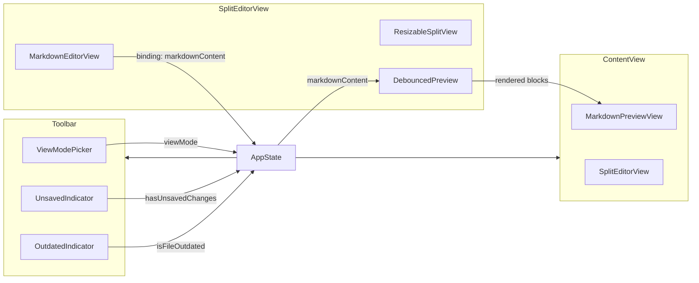
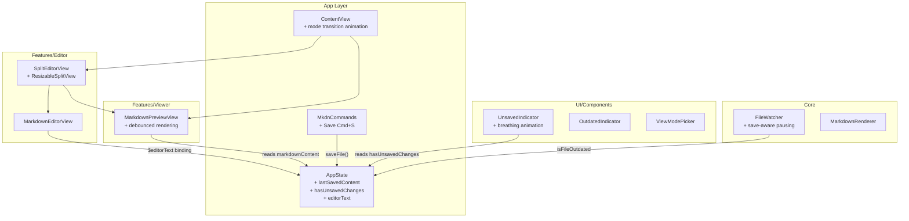
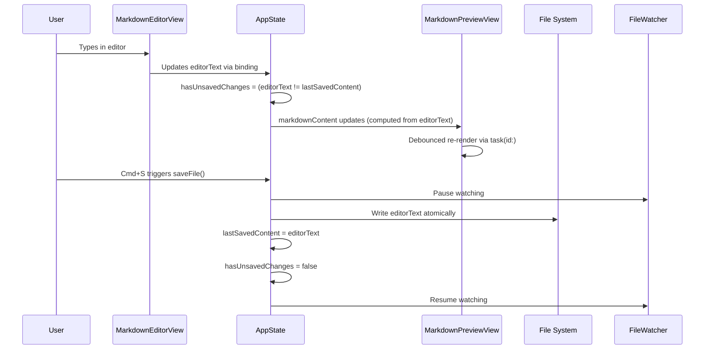

# Design: Split-Screen Editor

**Feature ID**: split-screen-editor
**Version**: 1.0.0
**Created**: 2026-02-06

## 1. Design Overview

The Split-Screen Editor transforms mkdn from a read-only viewer into a view-and-edit tool. It builds on extensive existing scaffolding -- `ViewMode`, `ViewModePicker`, `SplitEditorView`, `MarkdownEditorView`, `EditorViewModel`, `ContentView` mode switching, and `AppState` save/reload methods -- and fills the gaps needed for a production-quality editing experience: unsaved-changes tracking, debounced live preview, Cmd+S save, polished mode transitions, custom resizable divider with snap points, and a breathing unsaved indicator.

### High-Level Architecture



## 2. Architecture

### Component Architecture

The design follows the existing Feature-Based MVVM pattern. All state flows through `AppState` as the single source of truth.



### Data Flow: Edit-Preview-Save Cycle



## 3. Detailed Design

### 3.1 AppState Changes

`AppState` gains editing-related state. The key design decision is to use `editorText` as a separate property from `markdownContent`, where `markdownContent` becomes a computed property that reflects `editorText` in edit mode and loaded content in preview mode. However, for simplicity and to avoid breaking the existing MarkdownPreviewView contract, a simpler approach is preferred:

- Rename the binding target: `editorText` is stored alongside a `lastSavedContent` baseline.
- `markdownContent` continues to be the single mutable property that both editor and preview read from (maintaining the existing contract).
- `hasUnsavedChanges` is computed as `markdownContent != lastSavedContent`.

**New/modified properties on AppState**:

| Property | Type | Purpose |
|----------|------|---------|
| `lastSavedContent` | `String` | Baseline text for unsaved detection; set on load and save |
| `hasUnsavedChanges` | `Bool` (computed) | `markdownContent != lastSavedContent` |

**Modified methods on AppState**:

| Method | Change |
|--------|--------|
| `loadFile(at:)` | Also sets `lastSavedContent = content` |
| `saveFile()` | Pauses FileWatcher, writes file, sets `lastSavedContent = markdownContent`, resumes FileWatcher |
| `reloadFile()` | Calls `loadFile(at:)` which resets both `markdownContent` and `lastSavedContent` |

**FileWatcher integration**: `AppState` needs a reference to the `FileWatcher` to pause/resume during save. Currently `FileWatcher` is not referenced in `AppState`. Two options:
1. Pass FileWatcher to AppState (dependency injection)
2. Have AppState own a FileWatcher instance

Looking at the current code, `FileWatcher` is not connected to `AppState` at all in the codebase. The architecture.md mentions the data flow but the actual wiring appears to be scaffolding-level. The design will have `AppState` own a `FileWatcher` instance, which aligns with the architecture diagram showing AppState as the hub.

**New property on AppState**:

| Property | Type | Purpose |
|----------|------|---------|
| `fileWatcher` | `FileWatcher` | Owned instance; started on loadFile, paused on save |

### 3.2 EditorViewModel Disposition

`EditorViewModel` currently duplicates `AppState` functionality (text, hasUnsavedChanges, fileURL, load, save). With unsaved tracking moving into `AppState`, `EditorViewModel` becomes dead code. It will be **removed** to avoid confusion and maintain a single source of truth.

### 3.3 UnsavedIndicator Component

New file: `mkdn/UI/Components/UnsavedIndicator.swift`

A toolbar component displaying a breathing dot + "Unsaved" label when `appState.hasUnsavedChanges` is true.

**Breathing animation**: Uses `Animation.easeInOut(duration: 2.5).repeatForever(autoreverses: true)` for approximately 12 cycles per minute (each full cycle = ~5 seconds: 2.5s in + 2.5s out). The dot's opacity oscillates between ~0.4 and 1.0.

### 3.4 ResizableSplitView

New file: `mkdn/Features/Editor/Views/ResizableSplitView.swift`

Replaces the bare `HSplitView` in `SplitEditorView` with a custom implementation that provides:

- **Drag-to-resize**: GeometryReader + DragGesture on a divider bar
- **Snap points**: 30/70, 50/50, 70/30 with a snap threshold (~20pt)
- **Hover feedback**: Divider widens and highlights on hover (`.onHover`)
- **Minimum pane widths**: 200pt per side (neither pane collapses)

The component is generic and takes two content closures (left and right panes).

### 3.5 Mode Transition Animation

`ContentView` wraps the mode switch in `withAnimation(.spring(response: 0.4, dampingFraction: 0.85))`. The editor pane uses `.transition(.move(edge: .leading).combined(with: .opacity))` so it slides in from the left when entering side-by-side mode and slides out to the left when returning to preview-only.

### 3.6 Debounced Preview Rendering

The current `MarkdownPreviewView` calls `MarkdownRenderer.render()` synchronously in the view body. For the editing use case with rapid typing, this needs debouncing.

**Approach**: Wrap the rendering in a `.task(id: appState.markdownContent)` modifier with a short sleep (~150ms). If the task is cancelled (because content changed again within 150ms), the re-render is skipped. Only the final stabilized content triggers rendering.

A `@State private var renderedBlocks: [MarkdownBlock]` holds the debounced result. The view body displays `renderedBlocks` instead of computing blocks inline.

### 3.7 Cmd+S Save Command

Add to `MkdnCommands`:

```swift
CommandGroup(replacing: .saveItem) {
    Button("Save") {
        try? appState.saveFile()
    }
    .keyboardShortcut("s", modifiers: .command)
    .disabled(appState.currentFileURL == nil || !appState.hasUnsavedChanges)
}
```

### 3.8 Focus Transition Polish

`MarkdownEditorView` and the preview pane use a subtle border or background shift to indicate focus. On focus change, a `@FocusState` variable drives a thin accent-colored border with `.animation(.easeInOut(duration: 0.2))`.

### 3.9 FileWatcher Save-Conflict Handling

When the app saves a file, the FileWatcher's DispatchSource fires a `.write` event, which would incorrectly set `isFileOutdated = true`. To prevent this:

1. Before writing, set a flag: `fileWatcher.pauseForSave()`
2. After writing and updating `lastSavedContent`, resume: `fileWatcher.resumeAfterSave()`

`FileWatcher` gains:

| Method | Purpose |
|--------|---------|
| `pauseForSave()` | Sets `isSavePaused = true`; event handler ignores events while paused |
| `resumeAfterSave()` | After a short delay (~200ms), sets `isSavePaused = false` |

The delay accounts for the async nature of DispatchSource event delivery.

### Data Model

No persistent data model changes. All state is in-memory via `AppState`. The only disk interaction is reading/writing the Markdown file itself.

## 4. Technology Stack

| Category | Technology | Rationale |
|----------|-----------|-----------|
| UI Framework | SwiftUI (macOS 14.0+) | Existing stack; no change |
| Text Editing | SwiftUI `TextEditor` | Already used in scaffolding; provides monospaced text, undo/redo, standard macOS editing |
| State Management | `@Observable` / `@Environment` | Existing pattern; AppState as single source of truth |
| Layout | Custom `GeometryReader` + `DragGesture` split view | Replaces `HSplitView` for snap points and divider polish |
| Animation | SwiftUI `Animation` / `withAnimation` | Spring for mode transitions; easeInOut for breathing indicator |
| File I/O | Foundation `String(contentsOf:)` / `String.write(to:)` | Already used in AppState |
| File Watching | `DispatchSource` | Already used in FileWatcher |
| Markdown Rendering | `MarkdownRenderer` (swift-markdown) | Existing pipeline; no change |
| Testing | Swift Testing (`@Test`, `#expect`, `@Suite`) | Existing pattern |

No new external dependencies introduced.

## 5. Implementation Plan

### T1: AppState Unsaved Changes Tracking
**Files**: `mkdn/App/AppState.swift`
**Changes**:
- Add `lastSavedContent: String` property
- Add `hasUnsavedChanges: Bool` computed property
- Add `fileWatcher: FileWatcher` owned property
- Update `loadFile(at:)` to set `lastSavedContent` and start FileWatcher
- Update `saveFile()` to pause FileWatcher, write, set `lastSavedContent`, resume FileWatcher
- Update `reloadFile()` (inherits from loadFile changes)

### T2: UnsavedIndicator Component
**Files**: `mkdn/UI/Components/UnsavedIndicator.swift` (new)
**Changes**:
- Create breathing-dot indicator component
- Reads `appState.hasUnsavedChanges` from environment
- Breathing animation: opacity oscillation at ~12 cycles/min
- Style: capsule with dot + "Unsaved" text, matching OutdatedIndicator design language

### T3: Cmd+S Save Command
**Files**: `mkdn/App/MkdnCommands.swift`
**Changes**:
- Add `CommandGroup(replacing: .saveItem)` with Save button
- Keyboard shortcut: Cmd+S
- Disabled when no file or no unsaved changes
- Calls `appState.saveFile()`

### T4: Custom ResizableSplitView
**Files**: `mkdn/Features/Editor/Views/ResizableSplitView.swift` (new)
**Changes**:
- Generic split view with left/right content closures
- GeometryReader + DragGesture for divider
- Snap points at 0.3, 0.5, 0.7 ratios (20pt threshold)
- Divider hover feedback: width expansion + accent color highlight
- Minimum pane width: 200pt
- Cursor change on hover (NSCursor.resizeLeftRight)

### T5: Mode Transition Animation
**Files**: `mkdn/App/ContentView.swift`
**Changes**:
- Wrap mode switch with `.animation(.spring(response: 0.4, dampingFraction: 0.85), value: appState.viewMode)`
- Add `.transition(.move(edge: .leading).combined(with: .opacity))` to SplitEditorView
- Add `.transition(.opacity)` to MarkdownPreviewView (full-width)
- Add UnsavedIndicator to toolbar (alongside OutdatedIndicator)

### T6: Debounced Preview Rendering
**Files**: `mkdn/Features/Viewer/Views/MarkdownPreviewView.swift`
**Changes**:
- Add `@State private var renderedBlocks: [MarkdownBlock] = []`
- Replace inline `MarkdownRenderer.render()` call with `.task(id: appState.markdownContent)` that sleeps 150ms then renders
- Initial render on appear (no delay)
- Display `renderedBlocks` in the LazyVStack

### T7: SplitEditorView Integration
**Files**: `mkdn/Features/Editor/Views/SplitEditorView.swift`
**Changes**:
- Replace `HSplitView` with `ResizableSplitView`
- Editor pane on left with MarkdownEditorView bound to `appState.markdownContent`
- Preview pane on right with `MarkdownPreviewView`
- Remove dependency on EditorViewModel

### T8: Focus Transition Polish
**Files**: `mkdn/Features/Editor/Views/MarkdownEditorView.swift`, `mkdn/Features/Editor/Views/SplitEditorView.swift`
**Changes**:
- Add `@FocusState` tracking for editor pane
- Subtle border overlay (theme accent color, low opacity) on focus
- Animated transition on focus change

### T9: Unit Tests
**Files**: `mkdnTests/Unit/Features/AppStateTests.swift`, `mkdnTests/Unit/Features/EditorViewModelTests.swift` (remove or repurpose)
**Changes**:
- Test `hasUnsavedChanges` is false after load
- Test `hasUnsavedChanges` becomes true after editing markdownContent
- Test `hasUnsavedChanges` becomes false after save
- Test `lastSavedContent` updates on load and save
- Test reload resets both `markdownContent` and `lastSavedContent`
- Remove or update EditorViewModelTests (EditorViewModel removed)

### T10: FileWatcher Save-Conflict Handling
**Files**: `mkdn/Core/FileWatcher/FileWatcher.swift`
**Changes**:
- Add `isSavePaused: Bool` flag
- Add `pauseForSave()` method
- Add `resumeAfterSave()` method (with ~200ms delay before re-enabling)
- Event handler checks `isSavePaused` before setting `isOutdated`

## 6. Implementation DAG

**Parallel Groups** (tasks with no inter-dependencies):

1. [T1, T4, T5, T6, T8] - Foundation work: AppState changes, custom split view, animation, debounced preview, and focus polish are independent of each other
2. [T2, T3, T9, T10] - Depend on T1: unsaved indicator reads hasUnsavedChanges, save command calls saveFile, tests verify new state, FileWatcher integration wired through AppState
3. [T7] - Integration: wires together T1 (AppState), T4 (ResizableSplitView), and T6 (debounced preview)

**Dependencies**:

- T2 -> T1 (data: reads `hasUnsavedChanges` from AppState)
- T3 -> T1 (interface: calls updated `saveFile()` on AppState)
- T7 -> [T1, T4, T6] (build: composes AppState binding, ResizableSplitView, debounced MarkdownPreviewView)
- T9 -> T1 (data: tests verify new AppState properties)
- T10 -> T1 (interface: AppState.saveFile calls FileWatcher.pauseForSave)

**Critical Path**: T1 -> T7

## 7. Testing Strategy

### Test Value Assessment

| Test Category | Value | Rationale |
|---------------|-------|-----------|
| AppState unsaved tracking logic | HIGH | Core business logic: hasUnsavedChanges computation, lastSavedContent lifecycle |
| AppState save/load/reload flow | HIGH | Data integrity: file content round-trips correctly |
| FileWatcher save-pause logic | HIGH | App-specific error prevention: false outdated signals |
| ResizableSplitView snap logic | MEDIUM | App-specific layout math: snap threshold calculation |
| Breathing animation timing | AVOID | Framework animation behavior; verified visually |
| TextEditor rendering | AVOID | SwiftUI framework feature validation |
| Spring animation physics | AVOID | Framework animation behavior |

### Unit Tests

**AppState Editing Tests** (`mkdnTests/Unit/Features/AppStateTests.swift`):

| Test | Requirement |
|------|-------------|
| `hasUnsavedChanges` is false after `loadFile` | REQ-SSE-006 AC4 |
| `hasUnsavedChanges` becomes true when `markdownContent` changes | REQ-SSE-006 AC1, AC3 |
| `hasUnsavedChanges` becomes false after `saveFile` | REQ-SSE-005 AC2, REQ-SSE-006 AC2 |
| `saveFile` writes correct content to disk | REQ-SSE-005 AC1 |
| `saveFile` with no file URL is a no-op | REQ-SSE-005 edge case |
| `reloadFile` resets `markdownContent` and `lastSavedContent` | REQ-SSE-008 AC3, AC4 |
| `loadFile` populates `markdownContent` | REQ-SSE-007 AC1-AC5 |
| `lastSavedContent` updates after save | BR-005 |

**FileWatcher Save-Pause Tests** (`mkdnTests/Unit/Core/FileWatcherTests.swift`):

| Test | Requirement |
|------|-------------|
| `pauseForSave` prevents `isOutdated` from being set | Internal: save-conflict prevention |
| `resumeAfterSave` re-enables outdated detection | Internal: save-conflict prevention |

**ResizableSplitView Snap Logic Tests** (if extracted to a pure function):

| Test | Requirement |
|------|-------------|
| Ratio near 0.5 snaps to 0.5 | REQ-SSE-011 AC2 |
| Ratio near 0.3 snaps to 0.3 | REQ-SSE-011 AC2 |
| Ratio outside snap range stays at dragged value | REQ-SSE-011 AC1 |
| Ratio respects minimum pane widths | REQ-SSE-011 AC4 |

### Manual / Visual Testing

| Scenario | Requirements Covered |
|----------|---------------------|
| Toggle mode and verify animation | REQ-SSE-010 |
| Type in editor and verify live preview updates | REQ-SSE-004 |
| Drag divider and verify snap behavior | REQ-SSE-011 |
| Verify breathing animation on unsaved indicator | REQ-SSE-012 |
| Switch themes and verify editor colors | REQ-SSE-009 |
| Verify focus indicators between panes | REQ-SSE-013 |
| Edit and Cmd+S, verify indicator clears | REQ-SSE-005, REQ-SSE-006 |
| External file change during editing, verify outdated indicator | REQ-SSE-008 |

## 8. Deployment Design

No special deployment considerations. This feature is a pure in-app enhancement:

- All code resides in the `mkdnLib` library target
- No new SPM dependencies
- No configuration files or environment variables
- No migration or data conversion needed
- Feature is available immediately when the app is built and run
- Backward compatible: default mode remains preview-only (BR-001)

## 9. Documentation Impact

| Type | Target | Section | KB Source | Rationale |
|------|--------|---------|-----------|-----------|
| edit | `.rp1/context/architecture.md` | System Overview, Data Flow | architecture.md:System Overview | Add editorText flow, save cycle, unsaved tracking to data flow diagram |
| edit | `.rp1/context/modules.md` | Features/Editor, UI/Components | modules.md:Features Layer | Add UnsavedIndicator, ResizableSplitView; remove EditorViewModel; update SplitEditorView description |
| edit | `.rp1/context/modules.md` | App Layer | modules.md:App Layer | Update AppState description with new properties |
| edit | `.rp1/context/patterns.md` | Feature-Based MVVM | patterns.md:Feature-Based MVVM | Add note about debounced rendering pattern with task(id:) |

## 10. Design Decisions Log

| ID | Decision | Choice | Rationale | Alternatives Considered |
|----|----------|--------|-----------|------------------------|
| D1 | State ownership for editor text | AppState.markdownContent (single source of truth) | Simplest approach; MarkdownPreviewView already reads from it; avoids state duplication | Separate EditorViewModel with its own text (rejected: duplicates AppState) |
| D2 | Unsaved changes detection | Computed property comparing markdownContent to lastSavedContent | Automatically reactive via @Observable; no manual flag toggling | Manual hasUnsavedChanges flag (rejected: error-prone, must be set/cleared in every code path) |
| D3 | EditorViewModel disposition | Remove (fold into AppState) | Avoids duplication; AppState already has loadFile/saveFile/markdownContent | Keep and use as intermediary (rejected: adds complexity with no benefit) |
| D4 | Split view implementation | Custom ResizableSplitView (GeometryReader + DragGesture) | Enables snap points, hover feedback, minimum widths; HSplitView lacks these | HSplitView (rejected: insufficient customization for REQ-SSE-011) |
| D5 | Live preview debounce | .task(id: markdownContent) with 150ms sleep | Built-in SwiftUI cancellation handles rapid typing; no external timer management | Combine debounce publisher (rejected: pattern mismatch with @Observable); Timer (rejected: more complex lifecycle) |
| D6 | FileWatcher save-conflict | Pause/resume pattern with short delay | Prevents false outdated signals from app's own saves | Ignore FileWatcher entirely during edit mode (rejected: loses external change detection); Compare file content hash (rejected: adds I/O on every event) |
| D7 | Mode transition animation | Spring animation with .move(edge: .leading) transition | Organic, physical-feeling per charter design philosophy | Linear animation (rejected: mechanical feel); No animation (rejected: violates REQ-SSE-010) |
| D8 | Breathing animation rate | easeInOut(duration: 2.5) repeating = 5s cycle = 12 cycles/min | Matches requirement specification of ~12 cycles/min | Faster pulse (rejected: too distracting); Static indicator (rejected: violates REQ-SSE-012) |

## AFK Mode: Auto-Selected Technology Decisions

| Decision | Choice | Source | Rationale |
|----------|--------|--------|-----------|
| Split view approach | Custom GeometryReader + DragGesture | Codebase analysis | HSplitView in scaffolding insufficient for snap points / hover feedback requirements |
| Debounce mechanism | SwiftUI .task(id:) with sleep | KB patterns.md (SwiftUI-first) | Follows existing SwiftUI-native patterns; avoids Combine |
| State architecture | Extend AppState (no separate EditorViewModel) | KB architecture.md, codebase | AppState is the established single source of truth; EditorViewModel duplicates it |
| Animation style | Spring (response: 0.4, dampingFraction: 0.85) | Conservative default | Standard SwiftUI spring; organic feel without being bouncy |
| Unsaved indicator design | Capsule with breathing dot, matching OutdatedIndicator | Codebase (OutdatedIndicator.swift) | Consistent design language with existing indicator |
| Save-conflict strategy | FileWatcher pause/resume | Codebase analysis | Simplest approach that avoids false positives without losing monitoring capability |
