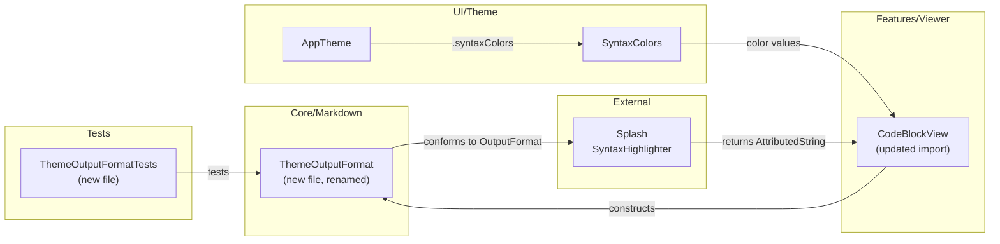
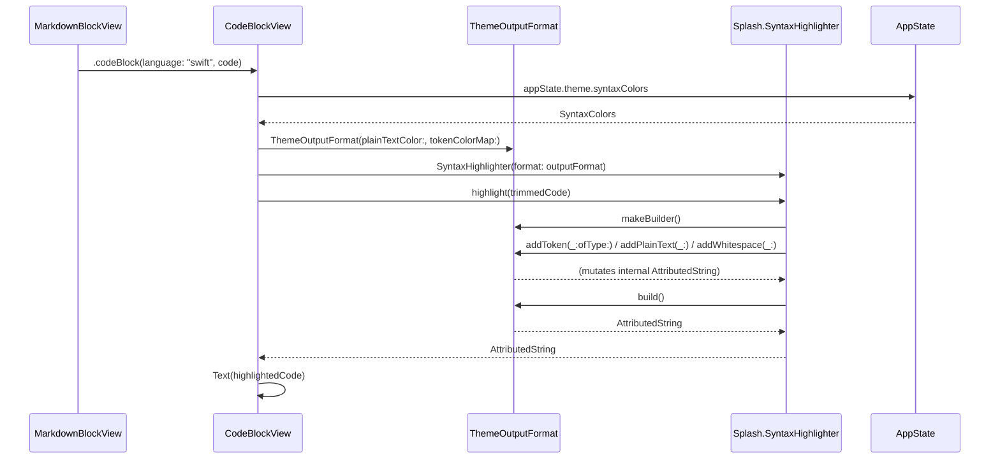

# Design: Syntax Highlighting for Code Blocks

**Feature ID**: syntax-highlighting
**Version**: 1.0.0
**Created**: 2026-02-06

## 1. Design Overview

This feature is largely already implemented. The existing `CodeBlockView.swift` provides Swift syntax highlighting via Splash, non-Swift fallback rendering, language labels, horizontal scrolling, theme-reactive re-highlighting, and complete TokenType mapping. The remaining work is a targeted refactor: rename `SolarizedOutputFormat` to `ThemeOutputFormat`, extract it to its own file for separation of concerns, and add the unit tests that are currently missing.

### High-Level Architecture



## 2. Architecture

### Component Responsibilities

| Component | Role | Change Type |
|-----------|------|-------------|
| `ThemeOutputFormat` | Splash `OutputFormat` adapter producing `AttributedString` with SwiftUI Colors | **New file** (extracted + renamed from `SolarizedOutputFormat` in `CodeBlockView.swift`) |
| `ThemeOutputFormat.Builder` | Splash `OutputBuilder` -- builds colored `AttributedString` token by token | **New file** (extracted + renamed, nested struct) |
| `CodeBlockView` | SwiftUI view rendering fenced code blocks | **Modified** (remove inline type, update reference) |
| `ThemeOutputFormatTests` | Unit tests for Builder token coloring, plain text, whitespace | **New file** |

### Sequence: Swift Code Block Rendering



## 3. Detailed Design

### 3.1 ThemeOutputFormat (new file)

**File**: `mkdn/Core/Markdown/ThemeOutputFormat.swift`

Extracted from `CodeBlockView.swift` lines 84-117 with the following changes:

1. **Rename**: `SolarizedOutputFormat` becomes `ThemeOutputFormat`
2. **Sendable**: Add explicit `Sendable` conformance to both `ThemeOutputFormat` and `ThemeOutputFormat.Builder`
3. **No logic changes**: The implementation is identical -- accepts `plainTextColor` and `tokenColorMap`, builder accumulates `AttributedString`

```swift
// ThemeOutputFormat.swift
import Splash
import SwiftUI

/// Splash OutputFormat producing AttributedString with SwiftUI Colors.
/// Theme-agnostic: accepts any token-to-color mapping.
struct ThemeOutputFormat: OutputFormat, Sendable {
    let plainTextColor: SwiftUI.Color
    let tokenColorMap: [TokenType: SwiftUI.Color]

    func makeBuilder() -> Builder {
        Builder(plainTextColor: plainTextColor, tokenColorMap: tokenColorMap)
    }

    struct Builder: OutputBuilder, Sendable {
        let plainTextColor: SwiftUI.Color
        let tokenColorMap: [TokenType: SwiftUI.Color]
        var result = AttributedString()

        mutating func addToken(_ token: String, ofType type: TokenType) {
            var attributed = AttributedString(token)
            attributed.foregroundColor = tokenColorMap[type] ?? plainTextColor
            result.append(attributed)
        }

        mutating func addPlainText(_ text: String) {
            var attributed = AttributedString(text)
            attributed.foregroundColor = plainTextColor
            result.append(attributed)
        }

        mutating func addWhitespace(_ whitespace: String) {
            result.append(AttributedString(whitespace))
        }

        func build() -> AttributedString {
            result
        }
    }
}
```

### 3.2 CodeBlockView (modified)

**File**: `mkdn/Features/Viewer/Views/CodeBlockView.swift`

Changes:
- Remove the `SolarizedOutputFormat` struct and `Builder` nested struct (lines 80-117)
- Update `highlightedCode` computed property: replace `SolarizedOutputFormat(` with `ThemeOutputFormat(`
- No other changes -- the view logic, language label, scroll, container styling all remain identical

The single line change in `highlightedCode`:
```swift
// Before:
let outputFormat = SolarizedOutputFormat(
// After:
let outputFormat = ThemeOutputFormat(
```

### 3.3 No Data Model Changes

No new data structures, no schema changes, no persistence changes. `ThemeColors`, `SyntaxColors`, `AppTheme`, `MarkdownBlock` are all unchanged.

## 4. Technology Stack

| Layer | Technology | Rationale |
|-------|-----------|-----------|
| Syntax Tokenization | Splash 0.9.x | Already in use; Swift-only grammar is sufficient for v1 |
| Output Format | AttributedString + SwiftUI.Color | Already in use; native, Sendable, supports foreground color per run |
| View Layer | SwiftUI Text + ScrollView | Already in use; text selection, horizontal scroll built in |
| Testing | Swift Testing (@Test, #expect, @Suite) | Project standard |

No new dependencies introduced. No technology changes.

## 5. Implementation Plan

### T1: Extract and Rename ThemeOutputFormat

**File**: `mkdn/Core/Markdown/ThemeOutputFormat.swift` (new)

- Create new file in `Core/Markdown/`
- Move `SolarizedOutputFormat` and its `Builder` from `CodeBlockView.swift`
- Rename to `ThemeOutputFormat` / `ThemeOutputFormat.Builder`
- Add explicit `Sendable` conformance
- Verify compilation

**Estimated effort**: Minimal (extract + rename)

### T2: Update CodeBlockView

**File**: `mkdn/Features/Viewer/Views/CodeBlockView.swift` (modified)

- Remove the `SolarizedOutputFormat` type definition (lines 80-117)
- Update `highlightedCode` to reference `ThemeOutputFormat`
- Verify compilation and visual correctness

**Estimated effort**: Minimal (one-line reference change + deletion)

### T3: Add ThemeOutputFormat Unit Tests

**File**: `mkdnTests/Unit/Core/ThemeOutputFormatTests.swift` (new)

Test cases (all trace to app requirements, not library behavior):

| Test | Requirement Trace | What It Validates |
|------|------------------|-------------------|
| Token coloring applies correct color from map | FR-002, FR-008 | Different TokenTypes get their mapped colors |
| Unmapped token falls back to plainTextColor | FR-002 | The `?? plainTextColor` fallback works |
| Plain text uses plainTextColor | FR-004 | Non-token text colored correctly |
| Whitespace preserved without color | FR-003 | Whitespace appended as-is |
| Build produces non-empty result | FR-003 | Builder accumulates and returns content |
| Different color maps produce different output | FR-002, FR-007 | Theme switch produces different colors |

**Estimated effort**: Small (6 focused test functions)

## 6. Implementation DAG

**Parallel Groups** (tasks with no inter-dependencies):

1. [T1] - defines ThemeOutputFormat; no dependencies
2. [T2, T3] - both consume T1 but are independent of each other

**Dependencies**:

- T2 -> T1 (interface: CodeBlockView references ThemeOutputFormat which T1 defines)
- T3 -> T1 (interface: tests import ThemeOutputFormat which T1 defines)

**Critical Path**: T1 -> T2

## 7. Testing Strategy

### Test Value Assessment

| Valuable (design for) | Avoid (do NOT design for) |
|-----------------------|--------------------------|
| Builder applies correct color per TokenType (app-specific mapping logic) | Splash tokenizes Swift correctly (library behavior) |
| Unmapped token fallback to plainTextColor (app error handling) | AttributedString append works (framework behavior) |
| Plain text coloring (app-specific behavior for non-Swift blocks) | SwiftUI.Color equality (language primitive) |
| Different theme color maps produce different output (app-specific theme reactivity) | Splash OutputFormat protocol conformance (library contract) |
| Whitespace preservation (app rendering correctness) | |

### Test Plan

**File**: `mkdnTests/Unit/Core/ThemeOutputFormatTests.swift`
**Framework**: Swift Testing (`@Suite`, `@Test`, `#expect`)
**Import**: `@testable import mkdnLib`

```swift
@Suite("ThemeOutputFormat")
struct ThemeOutputFormatTests {
    // Test: addToken applies mapped color
    // Test: addToken with unmapped type falls back to plainTextColor
    // Test: addPlainText applies plainTextColor
    // Test: addWhitespace preserves content without explicit color
    // Test: build returns accumulated content
    // Test: different color maps produce different AttributedString output
}
```

**Note on @MainActor**: `ThemeOutputFormat` and `Builder` are plain value types with no actor isolation. Tests do NOT need `@MainActor` annotation. The test struct does NOT need `@MainActor` on `@Suite`.

### Manual Verification

The following should be verified visually (not automatable as unit tests):

- Swift code blocks display at least 3 distinct colors (FR-003 AC-1)
- Non-Swift code blocks display in monospaced codeForeground (FR-004)
- Language label appears for tagged blocks, absent for untagged (FR-005)
- Horizontal scroll on long lines (FR-006)
- Theme switch immediately updates all code block colors (FR-007)

## 8. Deployment Design

No deployment considerations. This is a rename refactor with test addition. No new dependencies, no configuration changes, no migration needed.

The change is fully backward-compatible: the renamed type is internal to the library target and not part of any public API.

## 9. Documentation Impact

| Type | Target | Section | KB Source | Rationale |
|------|--------|---------|-----------|-----------|
| edit | `.rp1/context/modules.md` | Core Layer - Markdown | modules.md:Core/Markdown | Add `ThemeOutputFormat.swift` to the file inventory |
| edit | `.rp1/context/architecture.md` | Code Blocks pipeline | architecture.md:Code Blocks | Update to mention ThemeOutputFormat (currently not mentioned by name) |

## 10. Design Decisions Log

See `design-decisions.md` for the complete log.

Summary of key decisions:

| ID | Decision | Choice |
|----|----------|--------|
| D1 | File placement for ThemeOutputFormat | Extract to `Core/Markdown/ThemeOutputFormat.swift` |
| D2 | plainTextColor default | Keep `syntaxColors.comment` (existing behavior) |
| D3 | Sendable conformance | Explicit on both struct and Builder |
