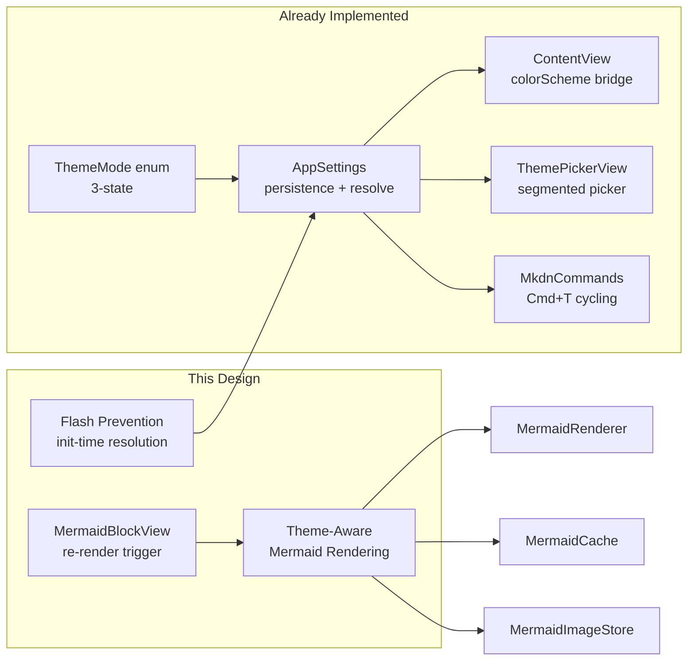
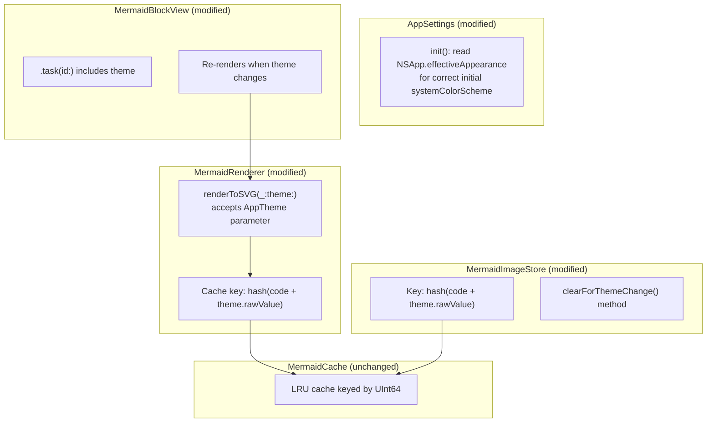
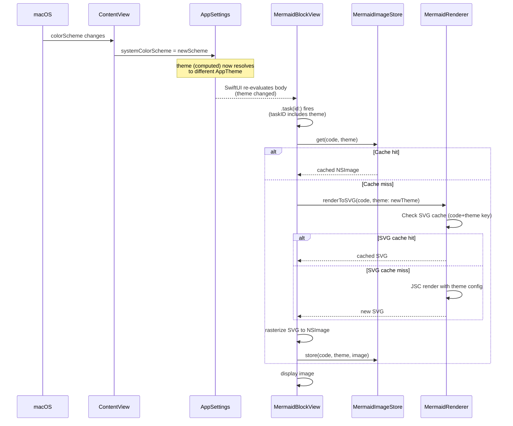

# Design: Terminal-Consistent Theming

**Feature ID**: terminal-consistent-theming
**Version**: 1.0.0
**Status**: Draft
**Created**: 2026-02-07

## 1. Design Overview

The codebase already implements the majority of the terminal-consistent theming requirements. The three-state `ThemeMode` enum, `AppSettings` persistence, `ContentView` colorScheme bridge, `ThemePickerView`, and keyboard cycling are all in place with comprehensive test coverage.

This design addresses the **two remaining gaps**:

1. **Mermaid diagram theme consistency (REQ-008)**: The Mermaid rendering pipeline is theme-unaware. The `MermaidCache` and `MermaidImageStore` key only on source code hash, not theme variant. The `MermaidBlockView` does not re-render when the theme changes.

2. **Flash prevention at launch (REQ-009)**: `AppSettings.systemColorScheme` initializes to `.dark` regardless of actual OS appearance, creating a potential one-frame flash for users in light mode before the `ContentView.onAppear` bridge corrects it.



## 2. Architecture

### 2.1 Component Changes

The changes are localized to four files plus one new view concern, with no new types introduced.



### 2.2 Theme Change Data Flow (Mermaid Path)



## 3. Detailed Design

### 3.1 Flash Prevention (T1)

**File**: `mkdn/App/AppSettings.swift`

**Change**: In `AppSettings.init()`, read the system appearance before the SwiftUI environment bridge fires, so the very first `theme` resolution is correct.

```swift
public init() {
    // Resolve system appearance at init time to prevent flash
    // of wrong theme before the SwiftUI colorScheme bridge fires.
    let appearance = NSApp?.effectiveAppearance ?? NSAppearance.currentDrawing()
    let isDark = appearance.bestMatch(from: [.darkAqua, .aqua]) == .darkAqua
    systemColorScheme = isDark ? .dark : .light

    if let raw = UserDefaults.standard.string(forKey: themeModeKey),
       let mode = ThemeMode(rawValue: raw)
    {
        themeMode = mode
    } else {
        themeMode = .auto
    }

    hasShownDefaultHandlerHint = UserDefaults.standard.bool(
        forKey: hasShownDefaultHandlerHintKey
    )
}
```

**Rationale**: `NSApp.effectiveAppearance` is available by the time the SwiftUI `App.init()` runs on macOS 14+. The fallback to `NSAppearance.currentDrawing()` handles edge cases where `NSApp` is not yet set. The `ContentView.onAppear` / `.onChange` bridge continues to operate as before, keeping the value in sync for subsequent changes.

### 3.2 Theme-Aware Mermaid Cache Keys (T2)

**Hashing change**: The stable hash function already exists (`mermaidStableHash`). To make cache keys theme-aware, concatenate the theme's raw value to the source code before hashing.

**File**: `mkdn/Core/Mermaid/MermaidCache.swift` -- No structural changes needed. The cache stores `UInt64 -> String` and is agnostic to what the key represents. Callers produce theme-aware keys.

**File**: `mkdn/Core/Mermaid/MermaidRenderer.swift`

Change the public API signature to accept a theme parameter:

```swift
func renderToSVG(_ mermaidCode: String, theme: AppTheme) async throws -> String {
    let trimmed = mermaidCode.trimmingCharacters(in: .whitespacesAndNewlines)
    guard !trimmed.isEmpty else { throw MermaidError.emptyInput }
    try validateDiagramType(trimmed)

    let cacheKey = mermaidStableHash(mermaidCode + theme.rawValue)

    if let cached = cache.get(cacheKey) {
        return cached
    }

    let jsContext = try getOrCreateContext()
    let escaped = escapeForJS(mermaidCode)
    let mermaidTheme = theme == .solarizedDark ? "dark" : "default"

    let svg: String
    do {
        let js = "beautifulMermaid.renderMermaid(\"\(escaped)\", {theme: \"\(mermaidTheme)\"})"
        let promise = try jsContext.eval(js)
        let result = try await promise.awaitPromise()
        svg = try result.string
    } catch { ... }

    let sanitized = SVGSanitizer.sanitize(svg)
    cache.set(cacheKey, value: sanitized)
    return sanitized
}
```

The `renderToImage` method similarly gains a `theme` parameter and forwards it.

**Note**: The exact JavaScript API for passing a theme to `beautifulMermaid.renderMermaid()` depends on what the library supports. This is flagged as hypothesis HYP-001. If the library does not accept an options object, the fallback is to render theme-agnostic SVGs (same as today) but still key the cache by theme so that if theme-specific rendering is added later, the cache is already structured correctly.

**File**: `mkdn/Core/Mermaid/MermaidImageStore.swift`

Change `get` and `store` to accept a theme parameter:

```swift
func get(_ code: String, theme: AppTheme) -> NSImage? {
    let key = mermaidStableHash(code + theme.rawValue)
    // ... rest unchanged
}

func store(_ code: String, theme: AppTheme, image: NSImage) {
    let key = mermaidStableHash(code + theme.rawValue)
    // ... rest unchanged
}
```

### 3.3 MermaidBlockView Re-Render on Theme Change (T3)

**File**: `mkdn/Features/Viewer/Views/MermaidBlockView.swift`

Two changes:

1. **Init**: Pass theme to `MermaidImageStore.get`:

```swift
@MainActor
init(code: String, theme: AppTheme) {
    self.code = code
    let cached = MermaidImageStore.shared.get(code, theme: theme)
    _renderedImage = State(initialValue: cached)
    _errorMessage = State(initialValue: nil)
    _isLoading = State(initialValue: cached == nil)
}
```

2. **Task trigger**: Change `.task(id:)` to include the theme so re-render fires on theme change:

```swift
.task(id: TaskID(code: code, theme: appSettings.theme)) {
    await renderDiagram()
}
```

Where `TaskID` is a private `Hashable` struct:

```swift
private struct TaskID: Hashable {
    let code: String
    let theme: AppTheme
}
```

3. **renderDiagram**: Remove the `guard renderedImage == nil` early return (which prevented re-renders), and pass theme to the renderer:

```swift
private func renderDiagram() async {
    isLoading = renderedImage == nil
    let currentTheme = appSettings.theme
    do {
        let svgString = try await MermaidRenderer.shared.renderToSVG(code, theme: currentTheme)
        if let image = svgStringToImage(svgString) {
            renderedImage = image
            errorMessage = nil
            MermaidImageStore.shared.store(code, theme: currentTheme, image: image)
        } else { ... }
    } catch { ... }
    isLoading = false
}
```

4. **Caller update**: `MarkdownBlockView` (or wherever `MermaidBlockView` is constructed) must pass the current theme. Since `MermaidBlockView` already reads `appSettings` from the environment, the theme is available internally. The `init` parameter can remain `code`-only if we read from `appSettings` at init time. However, SwiftUI init runs before `@Environment` is populated, so the theme must be passed explicitly or the init-time cache lookup deferred.

**Recommended approach**: Keep `init(code:)`, remove the init-time cache lookup (it was an optimization for view recycling), and let `.task(id:)` handle all rendering. This simplifies the code and eliminates the init-time environment availability problem:

```swift
@MainActor
init(code: String) {
    self.code = code
    _renderedImage = State(initialValue: nil)
    _errorMessage = State(initialValue: nil)
    _isLoading = State(initialValue: true)
}
```

The `.task(id:)` will fire immediately, check MermaidImageStore (with theme), and either return a cached image or render. The perceived performance difference is negligible since the task fires synchronously within the first layout pass.

### 3.4 DocumentState.loadFile Cleanup

**File**: `mkdn/App/DocumentState.swift`

Currently `loadFile` calls `MermaidImageStore.shared.removeAll()`. This remains correct -- when a new file is loaded, all cached images are for the old file and should be cleared regardless of theme.

No changes needed.

## 4. Technology Stack

All existing. No new dependencies.

| Component | Technology | Status |
|-----------|-----------|--------|
| Theme state | `@Observable` AppSettings | Existing |
| Persistence | UserDefaults | Existing |
| OS appearance bridge | SwiftUI `@Environment(\.colorScheme)` | Existing |
| Init-time appearance | `NSApp.effectiveAppearance` / `NSAppearance` | macOS 14+ built-in |
| Mermaid rendering | JXKit + beautiful-mermaid.js | Existing |
| SVG rasterization | SwiftDraw | Existing |
| Caching | MermaidCache (LRU) + MermaidImageStore (LRU) | Existing, keys modified |

## 5. Implementation Plan

### T1: Flash Prevention -- AppSettings Init

**Files modified**:
- `mkdn/App/AppSettings.swift` -- read NSApp.effectiveAppearance in init
- `mkdnTests/Unit/Features/AppSettingsTests.swift` -- add test for init-time appearance resolution

**Scope**: Small. ~10 lines of production code, ~1 test.

### T2: Theme-Aware Mermaid Rendering

**Files modified**:
- `mkdn/Core/Mermaid/MermaidRenderer.swift` -- add `theme` parameter to `renderToSVG` and `renderToImage`, pass theme to JS, include theme in cache key
- `mkdn/Core/Mermaid/MermaidImageStore.swift` -- add `theme` parameter to `get` and `store`, include theme in cache key
- `mkdnTests/Unit/Core/MermaidRendererTests.swift` -- update tests for new signature
- `mkdnTests/Unit/Core/MermaidImageStoreTests.swift` -- add tests for theme-keyed caching

**Scope**: Medium. ~30 lines of production changes, ~4-6 new/updated tests.

### T3: MermaidBlockView Re-Render on Theme Change

**Files modified**:
- `mkdn/Features/Viewer/Views/MermaidBlockView.swift` -- change `.task(id:)` to include theme, pass theme to renderer/store, remove init-time cache lookup guard
- Parent views that construct `MermaidBlockView` (verify no signature changes needed)

**Scope**: Small-medium. ~20 lines of production changes. No new unit tests (view behavior; covered by the renderer/store tests and manual verification).

## 6. Implementation DAG

**Parallel Groups** (tasks with no inter-dependencies):

1. [T1, T2] - T1 modifies AppSettings init; T2 modifies MermaidRenderer/MermaidImageStore. No shared code paths.
2. [T3] - MermaidBlockView consumes the theme-aware API that T2 defines.

**Dependencies**:

- T3 -> T2 (Interface: T3 calls the new `renderToSVG(_:theme:)` and `get(_:theme:)` APIs that T2 introduces)

**Critical Path**: T2 -> T3

## 7. Testing Strategy

### Test Value Assessment

| Test | Traces To | Value |
|------|-----------|-------|
| AppSettings init resolves correct systemColorScheme from OS | REQ-009 (no flash) | HIGH -- app-specific init-time behavior |
| MermaidRenderer returns different cache entries per theme | REQ-008 (Mermaid consistency) | HIGH -- app-specific caching logic |
| MermaidImageStore keys by code+theme | REQ-008 (Mermaid consistency) | HIGH -- app-specific caching logic |
| ThemeMode resolution (existing) | REQ-001, REQ-002 | Already covered |
| cycleTheme cycling order (existing) | REQ-007 | Already covered |
| Persistence round-trip (existing) | REQ-004 | Already covered |

### New Tests

**T1 Tests** (`AppSettingsTests.swift`):

```swift
@Test("Init resolves systemColorScheme from OS appearance, not hardcoded default")
@MainActor func initResolvesSystemAppearance() {
    defer { UserDefaults.standard.removeObject(forKey: "themeMode") }
    let settings = AppSettings()
    // In the test process, NSApp.effectiveAppearance reflects the test
    // runner's appearance. Verify it's not always .dark.
    let appearance = NSApp?.effectiveAppearance ?? NSAppearance.currentDrawing()
    let expectedDark = appearance.bestMatch(from: [.darkAqua, .aqua]) == .darkAqua
    let expectedScheme: ColorScheme = expectedDark ? .dark : .light
    #expect(settings.systemColorScheme == expectedScheme)
}
```

**T2 Tests** (`MermaidImageStoreTests.swift`):

```swift
@Test("Same code, different themes, stored as separate entries")
@MainActor func themeAwareCaching() {
    let store = MermaidImageStore()
    let code = "graph TD; A-->B"
    let darkImage = NSImage(size: NSSize(width: 10, height: 10))
    let lightImage = NSImage(size: NSSize(width: 20, height: 20))

    store.store(code, theme: .solarizedDark, image: darkImage)
    store.store(code, theme: .solarizedLight, image: lightImage)

    #expect(store.get(code, theme: .solarizedDark) === darkImage)
    #expect(store.get(code, theme: .solarizedLight) === lightImage)
}
```

**T2 Tests** (`MermaidRendererTests.swift`):

Update existing tests to pass a theme parameter. Add a test verifying that the same code with different themes produces different cache keys (unit test on the hashing logic).

### Tests NOT Written

- No tests for SwiftUI `@Environment(\.colorScheme)` behavior (framework feature)
- No tests for UserDefaults serialization (Foundation behavior, already covered by existing round-trip tests)
- No tests for `NSApp.effectiveAppearance` returning correct values (macOS system behavior)
- No UI/snapshot tests for visual correctness of theme colors (manual verification)

## 8. Deployment Design

No deployment changes. This is a standard code update:

- No new build targets, schemes, or configurations
- No new dependencies or package changes
- No migration of stored data (UserDefaults key `"themeMode"` is unchanged; existing persisted values remain valid)
- No feature flags needed (changes are backward-compatible)

Existing users with a persisted `themeMode` of `"auto"`, `"solarizedDark"`, or `"solarizedLight"` will see identical behavior after the update. The only observable difference is that Mermaid diagrams now re-render correctly on theme change.

## 9. Documentation Impact

| Type | Target | Section | KB Source | Rationale |
|------|--------|---------|-----------|-----------|
| edit | `.rp1/context/modules.md` | Core/Mermaid table | `modules.md:Core/Mermaid` | MermaidRenderer and MermaidImageStore API signatures gain a `theme` parameter |
| edit | `.rp1/context/architecture.md` | Mermaid Diagrams pipeline | `architecture.md:Mermaid Diagrams` | Note that Mermaid rendering is theme-aware; cache keys include theme variant |

## 10. Design Decisions Log

| ID | Decision | Choice | Rationale | Alternatives Considered |
|----|----------|--------|-----------|------------------------|
| D1 | Cache key strategy for theme-aware Mermaid | Include theme.rawValue in hash input | Simple, requires no structural cache changes. Both MermaidCache and MermaidImageStore key on UInt64; the hash input just becomes `code + theme.rawValue`. | (a) Separate caches per theme -- wasteful, doubles memory structures. (b) Clear cache on theme change -- loses valid cached entries, causes unnecessary re-renders. |
| D2 | Flash prevention approach | Read NSApp.effectiveAppearance in AppSettings.init() | Resolves correct appearance before any SwiftUI body evaluation. Fallback to NSAppearance.currentDrawing() if NSApp is nil. | (a) Accept the potential flash and rely on onAppear -- unacceptable per REQ-009. (b) Use NSAppearance.currentDrawing() only -- less reliable than NSApp.effectiveAppearance. |
| D3 | MermaidBlockView init-time cache lookup | Remove init-time lookup; rely solely on .task(id:) | Avoids the problem of @Environment not being populated at init time. The .task fires within the same layout pass, so perceived latency is negligible. The original optimization addressed LazyVStack recycling flicker, but with theme-aware keys the init would need the theme which is not available at init. | (a) Pass theme explicitly to init -- requires parent view changes and still runs before environment is ready. |
| D4 | Mermaid JS theme parameter | Pass Mermaid's built-in "dark"/"default" theme names | Mermaid has built-in dark/default themes that approximate the Solarized feel. Custom Solarized-exact colors in Mermaid would require themeVariables configuration, adding complexity for marginal benefit. | (a) Pass full Solarized color palette as themeVariables -- higher complexity, needs HYP-001 validation. (b) No theme parameter at all -- diagrams look wrong in one mode. |
