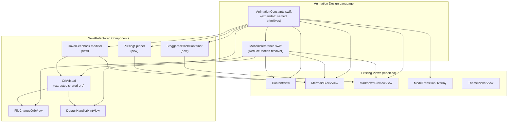
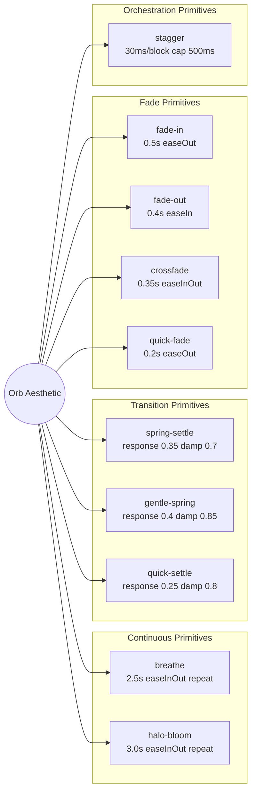
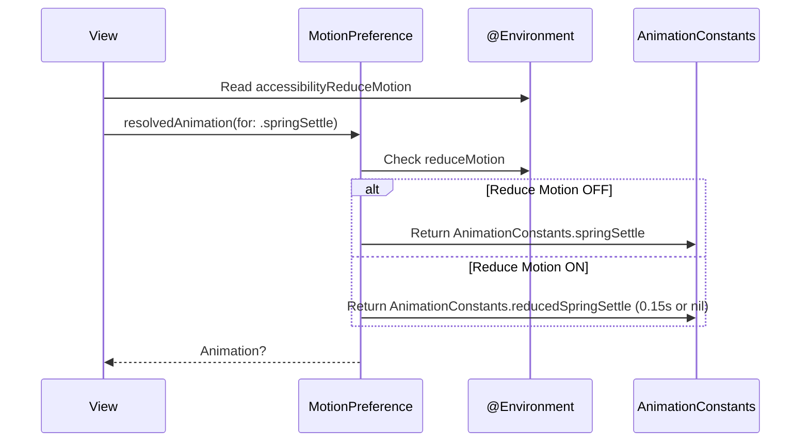

# Design: Animation Design Language

**Feature ID**: animation-design-language
**Version**: 1.0.0
**Created**: 2026-02-07
**Status**: Draft

## 1. Design Overview

This feature establishes a unified animation design language for mkdn by expanding the existing `AnimationConstants.swift` into a comprehensive, documented vocabulary of named motion primitives derived from the orb's aesthetic. It adds animated transitions to currently hard-cut UI elements (Mermaid focus border, loading states), introduces staggered content appearance, hover feedback, and popover spring entrances, and implements full Reduce Motion compliance -- all while maintaining the existing architecture patterns and staying within GPU performance budgets.

The design is intentionally conservative: it extends existing patterns rather than introducing new architectural concepts. The primary structural change is expanding `AnimationConstants` with documented primitive groups and adding a `MotionPreference` utility for centralized Reduce Motion resolution.

### High-Level Architecture



## 2. Architecture

### 2.1 Component Architecture

The design follows the existing Feature-Based MVVM pattern with no new architectural layers. Changes are localized to the UI layer (`mkdn/UI/`) and specific feature views.

**New files (4):**

| File | Location | Purpose |
|------|----------|---------|
| `MotionPreference.swift` | `mkdn/UI/Theme/` | Reads `accessibilityReduceMotion`, resolves animation-or-nil for each primitive |
| `OrbVisual.swift` | `mkdn/UI/Components/` | Extracted shared 3-layer orb visual (outerHalo, midGlow, innerCore) |
| `PulsingSpinner.swift` | `mkdn/UI/Components/` | Mermaid loading spinner pulsing at orb breathing rhythm |
| `HoverFeedbackModifier.swift` | `mkdn/UI/Components/` | ViewModifier for consistent hover scale/brightness feedback |

**Modified files (7):**

| File | Changes |
|------|---------|
| `AnimationConstants.swift` | Restructured into named primitive groups with documentation |
| `MermaidBlockView.swift` | Animated focus border, crossfade states, hover feedback, pulsing spinner |
| `MarkdownPreviewView.swift` | Staggered content load animation |
| `FileChangeOrbView.swift` | Adopt `OrbVisual`, add hover scale feedback |
| `DefaultHandlerHintView.swift` | Adopt `OrbVisual`, add hover scale feedback |
| `ContentView.swift` | Theme crossfade scoping, Reduce Motion integration |
| `ModeTransitionOverlay.swift` | Reduce Motion integration |

### 2.2 Animation Primitive Taxonomy

The expanded `AnimationConstants` is organized into primitive groups, each traced back to the orb aesthetic:



### 2.3 Reduce Motion Architecture



`MotionPreference` is a lightweight struct that views instantiate with the environment value. It provides a `resolved(_:)` method that returns the full animation or its Reduce Motion alternative. This keeps Reduce Motion logic in one place rather than scattered across views.

```
// Usage pattern in views:
@Environment(\.accessibilityReduceMotion) private var reduceMotion

private var motion: MotionPreference { MotionPreference(reduceMotion: reduceMotion) }

// Then:
withAnimation(motion.resolved(.springSettle)) { ... }
```

### 2.4 Theme Crossfade Isolation Strategy

Theme crossfade must not interfere with concurrent animations (orb breathing, focus borders). The strategy is **explicit `withAnimation` scoping on the theme state change**, not broad `.animation()` modifiers.

Current state: `ContentView` uses `.animation(AnimationConstants.viewModeTransition, value: documentState.viewMode)` which is already scoped to `viewMode`. Theme changes in `AppSettings` update `themeMode` which resolves to a new `theme`. The `.onChange(of: appSettings.theme)` in `MarkdownPreviewView` re-renders blocks but has no animation.

Design: Wrap the theme change in `AppSettings.cycleTheme()` (and the `ThemePickerView` binding) with `withAnimation(AnimationConstants.themeCrossfade)` at the call site. Because `withAnimation` scopes to state changes within its closure, only theme-dependent properties will animate -- orb pulse/bloom state variables are driven by their own separate `withAnimation` calls and will not be captured.

## 3. Detailed Design

### 3.1 AnimationConstants Expansion

The existing `AnimationConstants.swift` is restructured into documented groups. Each entry gets a doc comment covering: (1) visual intent, (2) design rationale, (3) primitive derivation.

```swift
enum AnimationConstants {
    // MARK: - Primitive: Breathe
    // Continuous sinusoidal rhythm timed to human breathing (~12 cycles/min).
    // Derived from: orb core pulse. The foundational continuous animation.

    /// Core breathing rhythm. 2.5s half-cycle = ~5s full = ~12/min.
    /// Visual intent: gentle, living pulse. Rationale: matches human resting breath rate.
    static let breathe: Animation = .easeInOut(duration: 2.5)
        .repeatForever(autoreverses: true)

    /// Halo breathing: slightly slower for dimensional offset from core.
    /// Visual intent: outer glow expands/contracts behind core pulse.
    static let haloBloom: Animation = .easeInOut(duration: 3.0)
        .repeatForever(autoreverses: true)

    // MARK: - Primitive: Spring-Settle
    // Physical spring entrance with noticeable bounce. Used for prominent UI surfaces.
    // Derived from: orb appear. The orb "bounces into existence."

    /// Standard spring-settle for prominent entrances (overlays, focus borders).
    static let springSettle: Animation = .spring(response: 0.35, dampingFraction: 0.7)

    // MARK: - Primitive: Gentle-Spring
    // Softer spring with higher damping. Layout transitions that should feel physical but not bouncy.
    // Derived from: orb appear, dampened for subtlety.

    /// Gentle spring for layout transitions (view mode switch, split pane).
    static let gentleSpring: Animation = .spring(response: 0.4, dampingFraction: 0.85)

    // MARK: - Primitive: Quick-Settle
    // Fast, crisp spring for micro-interactions. Minimal overshoot.
    // Derived from: orb spring, compressed for hover/feedback responsiveness.

    /// Quick spring for hover feedback and micro-interactions.
    static let quickSettle: Animation = .spring(response: 0.25, dampingFraction: 0.8)

    // MARK: - Primitive: Fade-In
    // Smooth appearance. Ease-out curve (decelerates into rest).
    // Derived from: orb appear timing.

    /// Standard fade-in for element appearance.
    static let fadeIn: Animation = .easeOut(duration: 0.5)

    // MARK: - Primitive: Fade-Out
    // Smooth disappearance. Ease-in curve (accelerates away).
    // Derived from: orb dissolve timing.

    /// Standard fade-out for element removal.
    static let fadeOut: Animation = .easeIn(duration: 0.4)

    // MARK: - Primitive: Crossfade
    // Symmetric blend between two states. Ease-in-out for balanced feel.
    // Derived from: theme transition aesthetic.

    /// Crossfade for state transitions (theme, loading -> rendered).
    static let crossfade: Animation = .easeInOut(duration: 0.35)

    // MARK: - Primitive: Quick-Fade
    // Fast fade for popover exit, transient feedback.
    // Derived from: crossfade, shortened for responsiveness.

    /// Quick fade for responsive exits (popover dismiss, hover exit).
    static let quickFade: Animation = .easeOut(duration: 0.2)

    // MARK: - Orchestration: Stagger

    /// Per-block stagger delay for content load entrance.
    static let staggerDelay: Double = 0.03  // 30ms

    /// Maximum total stagger duration to prevent long entrance on large docs.
    static let staggerCap: Double = 0.5  // 500ms

    // MARK: - Orb Colors (unchanged)

    static let orbGlowColor = Color(red: 0.424, green: 0.443, blue: 0.769)
    static let fileChangeOrbColor = Color(red: 0.165, green: 0.631, blue: 0.596)

    // MARK: - Overlay Timing (unchanged)

    static let overlayDisplayDuration: Duration = .milliseconds(1_500)
    static let overlayFadeOutDuration: Duration = .milliseconds(300)

    // MARK: - Hover Feedback

    /// Orb hover scale factor. Subtle enough to register subconsciously.
    static let hoverScaleFactor: CGFloat = 1.06

    /// Toolbar button hover scale factor.
    static let toolbarHoverScale: CGFloat = 1.05

    /// Mermaid hover brightness overlay opacity.
    static let mermaidHoverBrightness: Double = 0.03

    // MARK: - Focus Border

    /// Focus border stroke width at full visibility.
    static let focusBorderWidth: CGFloat = 2.0

    /// Focus border glow radius.
    static let focusGlowRadius: CGFloat = 6.0

    // MARK: - Reduce Motion Alternatives

    /// Short crossfade for Reduce Motion (preserves continuity without full motion).
    static let reducedCrossfade: Animation = .easeInOut(duration: 0.15)

    /// Instant transition (nil animation equivalent, but explicit for documentation).
    static let reducedInstant: Animation = .linear(duration: 0.01)
}
```

Legacy aliases are preserved initially (e.g., `orbPulse` becomes a computed property pointing to `breathe`) and deprecated with a migration path.

### 3.2 MotionPreference Utility

```swift
// mkdn/UI/Theme/MotionPreference.swift

struct MotionPreference {
    let reduceMotion: Bool

    /// Resolve a standard animation to its Reduce Motion alternative.
    /// Continuous animations return nil (disabled).
    /// Transition animations return the reduced-duration alternative.
    /// Theme crossfade returns shortened but non-nil (hard cut is jarring even with RM).
    func resolved(_ animation: Animation) -> Animation? {
        guard reduceMotion else { return animation }
        // Map known animations to their reduced alternatives
        // Implementation uses identity comparison via static references
    }

    /// Whether continuous animations (orb breathing) should run.
    var allowsContinuousAnimation: Bool { !reduceMotion }

    /// Stagger delay (0 when Reduce Motion is on).
    var staggerDelay: Double {
        reduceMotion ? 0 : AnimationConstants.staggerDelay
    }
}
```

### 3.3 OrbVisual Extraction

The identical 3-layer orb visual in `FileChangeOrbView` and `DefaultHandlerHintView` is extracted into a reusable component:

```swift
// mkdn/UI/Components/OrbVisual.swift

struct OrbVisual: View {
    let color: Color
    let isPulsing: Bool
    let isHaloExpanded: Bool

    var body: some View {
        ZStack {
            outerHalo
            midGlow
            innerCore
        }
        .opacity(isPulsing ? 1.0 : 0.4)
    }
    // outerHalo, midGlow, innerCore extracted unchanged
}
```

Both orb views then become thin wrappers: animation state + interaction + popover, delegating visuals to `OrbVisual`.

### 3.4 Mermaid Focus Border Animation

Current implementation (hard cut):
```swift
@ViewBuilder
private var focusBorder: some View {
    if isFocused {
        RoundedRectangle(cornerRadius: 6)
            .stroke(colors.border, lineWidth: 2)
    }
}
```

New implementation (bloom in / dissolve out):
```swift
private var focusBorder: some View {
    RoundedRectangle(cornerRadius: 6)
        .stroke(colors.accent, lineWidth: isFocused ? AnimationConstants.focusBorderWidth : 0)
        .opacity(isFocused ? 1.0 : 0)
        .shadow(
            color: colors.accent.opacity(isFocused ? 0.4 : 0),
            radius: isFocused ? AnimationConstants.focusGlowRadius : 0
        )
        .animation(motion.resolved(.springSettle) ?? .default, value: isFocused)
}
```

The border is always present in the view hierarchy but animates opacity, stroke width, and shadow radius simultaneously. The spring-settle primitive gives it the "breathing into existence" quality traced to the orb halo bloom.

### 3.5 Mermaid State Crossfade

Current implementation (hard opacity cut):
```swift
.opacity(renderState == .rendered ? 1 : 0)
```

New implementation: Use SwiftUI's `.transition(.opacity)` with an explicit animation on `renderState` changes. The overlay views (loading, error) and the web view content crossfade simultaneously.

```swift
// In diagramContent:
MermaidWebView(...)
    .opacity(renderState == .rendered ? 1 : 0)
    .animation(motion.resolved(.crossfade), value: renderState)

overlay
    .animation(motion.resolved(.crossfade), value: renderState)
```

The `loadingView` replaces the standard `ProgressView` with a `PulsingSpinner` that uses the `breathe` primitive.

### 3.6 PulsingSpinner

A custom spinner view that pulses at the orb breathing rhythm:

```swift
struct PulsingSpinner: View {
    @State private var isPulsing = false
    @Environment(\.accessibilityReduceMotion) private var reduceMotion

    var body: some View {
        Circle()
            .fill(AnimationConstants.orbGlowColor.opacity(0.6))
            .frame(width: 12, height: 12)
            .scaleEffect(isPulsing ? 1.0 : 0.6)
            .opacity(isPulsing ? 1.0 : 0.4)
            .onAppear {
                guard !reduceMotion else { return }
                withAnimation(AnimationConstants.breathe) {
                    isPulsing = true
                }
            }
    }
}
```

When Reduce Motion is enabled, the spinner displays at its static full-opacity state (like the orb).

### 3.7 Staggered Content Load

In `MarkdownPreviewView`, after `renderedBlocks` is set, each block gets an index-based delay for its entrance animation:

```swift
ForEach(Array(renderedBlocks.enumerated()), id: \.element.id) { index, block in
    MarkdownBlockView(block: block)
        .opacity(blockAppeared[block.id] ?? false ? 1.0 : 0)
        .offset(y: blockAppeared[block.id] ?? false ? 0 : 8)
        .animation(
            motion.resolved(.fadeIn)?
                .delay(min(
                    Double(index) * motion.staggerDelay,
                    AnimationConstants.staggerCap
                )),
            value: blockAppeared[block.id] ?? false
        )
}
```

A `@State private var blockAppeared: [String: Bool] = [:]` dictionary tracks per-block appearance. After `renderedBlocks` is set, a follow-up state change sets all blocks to appeared, triggering the staggered animation. On reload, the dictionary is reset first.

With Reduce Motion, `staggerDelay` is 0 and animation is nil, so all blocks appear instantly.

### 3.8 Hover Feedback

A reusable `ViewModifier`:

```swift
struct HoverFeedbackModifier: ViewModifier {
    let scaleFactor: CGFloat
    @State private var isHovering = false
    @Environment(\.accessibilityReduceMotion) private var reduceMotion

    func body(content: Content) -> some View {
        content
            .scaleEffect(isHovering ? scaleFactor : 1.0)
            .animation(
                reduceMotion ? nil : AnimationConstants.quickSettle,
                value: isHovering
            )
            .onHover { hovering in
                isHovering = hovering
            }
    }
}

// Brightness variant for Mermaid:
struct BrightnessHoverModifier: ViewModifier {
    @State private var isHovering = false
    @Environment(\.accessibilityReduceMotion) private var reduceMotion

    func body(content: Content) -> some View {
        content
            .overlay(
                Color.white
                    .opacity(isHovering ? AnimationConstants.mermaidHoverBrightness : 0)
                    .allowsHitTesting(false)
            )
            .animation(
                reduceMotion ? nil : AnimationConstants.quickSettle,
                value: isHovering
            )
            .onHover { hovering in
                isHovering = hovering
            }
    }
}

extension View {
    func hoverScale(_ factor: CGFloat = AnimationConstants.hoverScaleFactor) -> some View {
        modifier(HoverFeedbackModifier(scaleFactor: factor))
    }

    func hoverBrightness() -> some View {
        modifier(BrightnessHoverModifier())
    }
}
```

### 3.9 Popover Spring Entrance

SwiftUI's `.popover()` modifier does not expose entrance animation customization. Two approaches are available:

**Approach A (preferred):** Use `.popover()` as-is for platform consistency and apply an internal content animation. The popover content view animates its own entrance (scale from 0.95 + opacity from 0) using `springSettle` on appear. This gives a spring feel within the system popover frame.

**Approach B (fallback):** If internal animation within `.popover()` is visually insufficient, replace `.popover()` with a custom overlay positioned relative to the anchor. This gives full animation control but loses system popover behavior (arrow, auto-repositioning).

Design selects Approach A as default: it preserves system popover behavior while adding the spring-settle aesthetic within.

### 3.10 Reduce Motion Integration Points

| Element | Standard Behavior | Reduce Motion Behavior |
|---------|-------------------|------------------------|
| Orb breathing | `breathe` continuous | Static, full opacity |
| Orb halo bloom | `haloBloom` continuous | Static, expanded |
| Focus border | `springSettle` bloom | Instant appear/disappear |
| Mode overlay | `springSettle` in, `fadeOut` out | `reducedCrossfade` in/out |
| View mode switch | `gentleSpring` | `reducedInstant` |
| Theme crossfade | `crossfade` (0.35s) | `reducedCrossfade` (0.15s) |
| Content stagger | Staggered `fadeIn` | Instant, no stagger |
| Mermaid state | `crossfade` | `reducedCrossfade` |
| Hover feedback | `quickSettle` scale/brightness | No animation (instant) |
| Popover entrance | `springSettle` | `reducedCrossfade` |
| Mermaid pulsing spinner | `breathe` | Static circle |

## 4. Technology Stack

| Category | Choice | Rationale |
|----------|--------|-----------|
| Animation framework | SwiftUI Animation API | Existing pattern. Requirements explicitly prohibit external libraries. |
| Reduce Motion detection | `@Environment(\.accessibilityReduceMotion)` | Standard SwiftUI environment value for macOS Reduce Motion preference. |
| Spring physics | `Animation.spring(response:dampingFraction:)` | macOS 14.0+ API already in use. Provides physical feel. |
| State management | `@Observable` + `@State` | Existing pattern. Animation state is local to views (`@State`). |
| Component structure | ViewModifier | Standard SwiftUI pattern for reusable hover/animation behaviors. |

No new dependencies. No new frameworks. Pure SwiftUI.

## 5. Implementation Plan

| ID | Component | Description | Files | Effort |
|----|-----------|-------------|-------|--------|
| T1 | AnimationConstants Expansion | Restructure into named primitive groups. Add new primitives (quick-settle, quick-fade, stagger, hover, focus border, Reduce Motion alternatives). Document each entry with visual intent, rationale, and derivation. Preserve legacy aliases as deprecated computed properties. | `AnimationConstants.swift` | Medium |
| T2 | MotionPreference Utility | Create `MotionPreference` struct that resolves animation primitives to their Reduce Motion alternatives. Reads `accessibilityReduceMotion`. Provides `allowsContinuousAnimation`, `staggerDelay`, `resolved(_:)`. | `MotionPreference.swift` (new) | Small |
| T3 | OrbVisual Extraction | Extract shared 3-layer orb visual (outerHalo, midGlow, innerCore) into reusable `OrbVisual` component. Refactor `FileChangeOrbView` and `DefaultHandlerHintView` to use it. | `OrbVisual.swift` (new), `FileChangeOrbView.swift`, `DefaultHandlerHintView.swift` | Small |
| T4 | Mermaid Focus Border Animation | Replace hard-cut focus border with always-present border that animates opacity, stroke width, and glow shadow via `springSettle`. Dissolve out on blur via `fadeOut`. | `MermaidBlockView.swift` | Small |
| T5 | Mermaid State Crossfade + Pulsing Spinner | Replace hard opacity cuts between loading/rendered/error with `crossfade` animation. Create `PulsingSpinner` synced to orb breathing rhythm. | `MermaidBlockView.swift`, `PulsingSpinner.swift` (new) | Medium |
| T6 | Staggered Content Load | Implement index-based stagger animation in `MarkdownPreviewView`. Track per-block appearance state. Stagger delay 30ms/block, capped at 500ms. Replay on reload. | `MarkdownPreviewView.swift` | Medium |
| T7 | Hover Feedback | Create `HoverFeedbackModifier` and `BrightnessHoverModifier` as reusable ViewModifiers. Apply `hoverScale()` to orbs and toolbar buttons. Apply `hoverBrightness()` to unfocused Mermaid diagrams. | `HoverFeedbackModifier.swift` (new), `FileChangeOrbView.swift`, `DefaultHandlerHintView.swift`, `MermaidBlockView.swift`, `ViewModePicker.swift` | Medium |
| T8 | Popover Spring Entrance | Add internal spring-settle animation to popover content views (scale from 0.95 + opacity from 0 on appear). Apply to orb popovers. | `FileChangeOrbView.swift`, `DefaultHandlerHintView.swift` | Small |
| T9 | Mode Transition + View Mode Consistency | Verify overlay spring matches new `springSettle` primitive. Verify view mode transition uses `gentleSpring`. Update constants to use new primitive names. Integrate Reduce Motion. | `ModeTransitionOverlay.swift`, `ContentView.swift` | Small |
| T10 | Theme Crossfade Isolation | Scope theme crossfade via explicit `withAnimation` on theme state changes. Verify no interference with concurrent orb/focus animations. Integrate Reduce Motion shortened crossfade. | `ContentView.swift`, `AppSettings.swift` | Small |
| T11 | Unit Tests | Test `AnimationConstants` values (primitives exist, stagger cap logic). Test `MotionPreference` resolution (Reduce Motion on/off). Test stagger delay computation. | `AnimationConstantsTests.swift` (new), `MotionPreferenceTests.swift` (new) | Small |

## 6. Implementation DAG

**Parallel Groups** (tasks with no inter-dependencies):

1. [T1] - Foundation: all other tasks reference AnimationConstants primitives
2. [T2, T3, T4, T5, T6, T8, T9, T10] - All depend only on T1; no inter-dependencies
3. [T7, T11] - T7 depends on T1 + T3 (hover on extracted orb); T11 depends on T1 + T2 (tests cover both)

**Dependencies**:

- T2 -> T1 (interface: MotionPreference references AnimationConstants primitives)
- T3 -> T1 (interface: OrbVisual uses expanded primitive names)
- T4 -> T1 (interface: uses springSettle, focusBorderWidth, focusGlowRadius)
- T5 -> T1 (interface: uses crossfade, breathe primitives)
- T6 -> T1 (interface: uses fadeIn, staggerDelay, staggerCap)
- T7 -> [T1, T3] (interface: hover modifier uses quickSettle; applies to extracted OrbVisual)
- T8 -> T1 (interface: uses springSettle, quickFade)
- T9 -> T1 (interface: verifies overlay/view mode constants match primitives)
- T10 -> T1 (interface: uses crossfade, reducedCrossfade)
- T11 -> [T1, T2] (data: tests validate AnimationConstants and MotionPreference)

**Critical Path**: T1 -> T3 -> T7 (longest dependency chain for UI-facing work) and T1 -> T2 -> T11 (for test coverage)

## 7. Testing Strategy

### 7.1 Test Value Assessment

| Worth Testing | NOT Worth Testing |
|---------------|-------------------|
| AnimationConstants values are non-nil and correctly typed | SwiftUI `.animation()` modifier behavior |
| MotionPreference resolves correctly for reduceMotion on/off | SwiftUI spring physics math |
| Stagger delay computation (30ms * index, capped at 500ms) | SwiftUI `@Environment` propagation |
| Legacy aliases point to correct new primitives | `.easeInOut` curve shape |
| MotionPreference.allowsContinuousAnimation flag | `.onHover` callback timing |
| MermaidRenderState transitions (existing enum, no change) | ViewModifier application order |

### 7.2 Test Plan

**New test file: `mkdnTests/Unit/UI/AnimationConstantsTests.swift`**

```swift
@Suite("AnimationConstants")
struct AnimationConstantsTests {
    @Test("Stagger delay is 30ms")
    func staggerDelay() {
        #expect(AnimationConstants.staggerDelay == 0.03)
    }

    @Test("Stagger cap is 500ms")
    func staggerCap() {
        #expect(AnimationConstants.staggerCap == 0.5)
    }

    @Test("Hover scale factor is within subtle range")
    func hoverScale() {
        #expect(AnimationConstants.hoverScaleFactor > 1.0)
        #expect(AnimationConstants.hoverScaleFactor < 1.15)
    }

    @Test("Focus border width is 2pt")
    func focusBorderWidth() {
        #expect(AnimationConstants.focusBorderWidth == 2.0)
    }
}
```

**New test file: `mkdnTests/Unit/UI/MotionPreferenceTests.swift`**

```swift
@Suite("MotionPreference")
struct MotionPreferenceTests {
    @Test("Allows continuous animation when reduceMotion is false")
    func continuousAllowed() {
        let pref = MotionPreference(reduceMotion: false)
        #expect(pref.allowsContinuousAnimation)
    }

    @Test("Disables continuous animation when reduceMotion is true")
    func continuousDisabled() {
        let pref = MotionPreference(reduceMotion: true)
        #expect(!pref.allowsContinuousAnimation)
    }

    @Test("Stagger delay is zero with reduceMotion")
    func staggerZero() {
        let pref = MotionPreference(reduceMotion: true)
        #expect(pref.staggerDelay == 0)
    }

    @Test("Stagger delay is standard without reduceMotion")
    func staggerStandard() {
        let pref = MotionPreference(reduceMotion: false)
        #expect(pref.staggerDelay == AnimationConstants.staggerDelay)
    }
}
```

Visual animation behavior (spring feel, crossfade smoothness, GPU utilization) is validated via manual testing with Instruments, not unit tests.

## 8. Deployment Design

No deployment-specific concerns. This is a pure UI change with no data migration, network dependencies, or feature flags. All changes ship together in a single build.

**Verification checklist:**
- Run `swift build` -- no compilation errors
- Run `swift test` -- all tests pass including new animation/motion tests
- Run SwiftLint -- no new violations
- Manual test: orb breathing, focus border bloom, content stagger, theme crossfade
- Manual test: enable macOS Reduce Motion, verify all animations disabled/shortened
- Instruments GPU profiling: idle <= 5%, peak <= 15% on M1

## 9. Documentation Impact

| Type | Target | Section | KB Source | Rationale |
|------|--------|---------|-----------|-----------|
| edit | `.rp1/context/modules.md` | UI Layer / Theme | modules.md:UI Layer | Add MotionPreference.swift, list OrbVisual.swift, PulsingSpinner.swift, HoverFeedbackModifier.swift |
| edit | `.rp1/context/modules.md` | UI Layer / Components | modules.md:UI Layer | Add OrbVisual.swift |
| edit | `.rp1/context/patterns.md` | (new section) Animation Pattern | patterns.md | Document MotionPreference usage pattern, named primitive pattern, hover modifier pattern |
| edit | `.rp1/context/architecture.md` | System Overview | architecture.md | Add animation layer reference; note MotionPreference in concurrency model |
| edit | `.rp1/context/index.md` | Quick Reference | index.md | Add animation constants and motion preference to quick reference |

## 10. Design Decisions Log

| ID | Decision | Choice | Rationale | Alternatives Considered |
|----|----------|--------|-----------|------------------------|
| D1 | Reduce Motion architecture | Central `MotionPreference` struct read from environment | Single source of truth; views resolve animations through one API instead of scattered `if reduceMotion` checks | Per-view conditional checks (scattered logic); Global observable state (over-engineered for a read-only system preference) |
| D2 | Orb visual deduplication | Extract `OrbVisual` as reusable component | Two identical 40-line visual implementations; DRY principle; easier to apply hover feedback once | Leave duplicated (simpler change, but adds maintenance burden for hover/animation changes) |
| D3 | Theme crossfade isolation | Explicit `withAnimation` scoping at call sites | SwiftUI's `withAnimation` captures only state changes within closure; cleanly isolates theme from concurrent animations | Broad `.animation()` modifier on root view (risks catching unrelated state changes); Transaction-based animation (more complex, less idiomatic) |
| D4 | Popover entrance approach | Internal content animation within system `.popover()` | Preserves system popover behavior (arrow, auto-positioning, accessibility) while adding spring feel | Custom overlay replacing `.popover()` (loses system behavior); Accept system default (misses design language goal) |
| D5 | Stagger implementation | Per-block `@State` dictionary with delayed animation | Avoids layout shifts (space is reserved via opacity/offset); works with existing `ForEach` pattern; respects Reduce Motion via `staggerDelay` | Timer-based progressive insertion (causes layout shifts as blocks appear); GeometryReader-based scroll-into-view (out of scope per requirements) |
| D6 | Hover modifier approach | Reusable ViewModifier with `.onHover` | Consistent application across all interactive elements; encapsulates Reduce Motion logic; standard SwiftUI pattern | Inline `.onHover` in each view (duplicated logic); Custom gesture recognizer (over-engineered) |
| D7 | AnimationConstants restructure | Keep as `enum` with static properties, add primitive grouping via MARK comments | Matches existing pattern; no architectural change; backward-compatible with deprecated aliases | Separate types per primitive group (over-engineered for static constants); Protocol-based (unnecessary abstraction) |
| D8 | Pulsing spinner approach | Custom `PulsingSpinner` using `breathe` animation | Visually connects loading state to orb aesthetic (shared rhythm); lightweight (single circle with opacity/scale) | Animated ProgressView (no rhythm control); Lottie animation (external dependency prohibited) |
