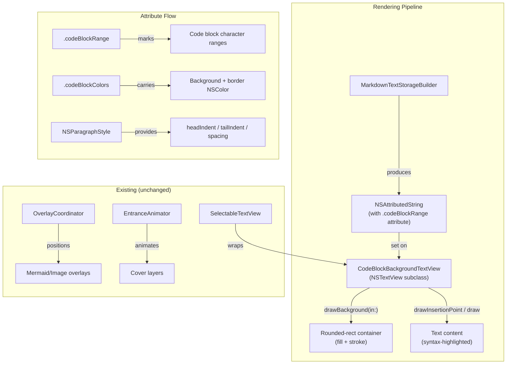
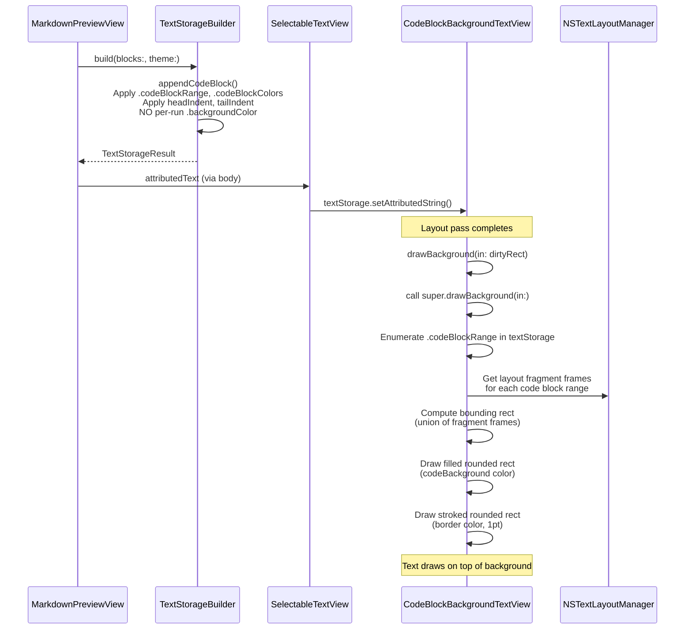

# Design: Code Block Styling

**Feature ID**: code-block-styling
**Version**: 1.0.0
**Created**: 2026-02-09

## 1. Design Overview

This feature replaces the current per-run `NSAttributedString.Key.backgroundColor` approach for code blocks with a custom background drawing system that renders a continuous rounded-rectangle container with padding, border, and proper spacing. The implementation stays entirely within the TextKit 2 rendering pipeline (`MarkdownTextStorageBuilder` + `SelectableTextView`) to preserve cross-block text selection.

The core mechanism is an `NSTextView` subclass (`CodeBlockBackgroundTextView`) that overrides `drawBackground(in:)` to draw rounded-rectangle containers behind code block text ranges, identified via a custom `NSAttributedString.Key`. The existing attributed-string-based text flow is preserved -- code block text remains part of the NSTextView's text storage, maintaining selectability and scroll behavior.

### High-Level Architecture



## 2. Architecture

### Component Interaction

The design introduces two new types and modifies two existing types:

| Component | Type | Action |
|-----------|------|--------|
| `CodeBlockBackgroundTextView` | New | `NSTextView` subclass with custom `drawBackground(in:)` |
| `CodeBlockAttributes` | New | Custom `NSAttributedString.Key` definitions + color carrier struct |
| `MarkdownTextStorageBuilder+Blocks` | Modified | Apply custom attributes, paragraph indents, remove per-run `.backgroundColor` |
| `SelectableTextView` | Modified | Use `CodeBlockBackgroundTextView` instead of default `NSTextView` |

### Sequence: Code Block Rendering



## 3. Detailed Design

### 3.1 Custom Attribute Keys (`CodeBlockAttributes`)

A new file `mkdn/Core/Markdown/CodeBlockAttributes.swift` defines:

```swift
/// Custom NSAttributedString keys and types for code block container rendering.
enum CodeBlockAttributes {
    /// Applied to all characters within a code block (including language label).
    /// Value: a unique String identifier per code block instance.
    static let range = NSAttributedString.Key("mkdn.codeBlockRange")

    /// Carries the resolved NSColor values for the code block container.
    /// Value: a `CodeBlockColorInfo` instance.
    static let colors = NSAttributedString.Key("mkdn.codeBlockColors")
}

/// Resolved color values for drawing a code block container.
/// Stored as an attributed string attribute value so the drawing code
/// can access theme colors without external state.
final class CodeBlockColorInfo: NSObject {
    let background: NSColor
    let border: NSColor

    init(background: NSColor, border: NSColor) {
        self.background = background
        self.border = border
    }
}
```

The `CodeBlockColorInfo` is a class (not struct) because `NSAttributedString` attribute values must be `NSObject` subclasses or bridged types for reliable attribute enumeration.

### 3.2 CodeBlockBackgroundTextView

A new file `mkdn/Features/Viewer/Views/CodeBlockBackgroundTextView.swift`:

**Responsibilities:**
- Override `drawBackground(in:)` to draw rounded-rectangle containers
- Enumerate `.codeBlockRange` attribute to find contiguous code block regions
- For each region, compute the visual bounding rect from layout fragment frames
- Draw filled + stroked rounded rect, accounting for `textContainerOrigin` offset

**Key drawing logic:**

1. Call `super.drawBackground(in:)` to draw the main document background
2. Enumerate `CodeBlockAttributes.range` in the text storage
3. Group contiguous ranges with the same code block ID
4. For each group, retrieve the `CodeBlockColorInfo` from `CodeBlockAttributes.colors`
5. Use `NSTextLayoutManager.enumerateTextLayoutFragments` over the code block's text range to collect `layoutFragmentFrame` rects
6. Compute the union bounding rect of all fragment frames
7. Expand the bounding rect by the container padding (to enclose the indented text)
8. Offset by `textContainerOrigin`
9. Draw with `NSBezierPath(roundedRect:xRadius:yRadius:)` -- fill, then stroke

**Constants:**
- Corner radius: 6pt (matches existing `CodeBlockView`)
- Border width: 1pt (matches FR-3)
- Border opacity: 0.3 (matches existing `CodeBlockView`)
- Container padding: 12pt (matches `CodeBlockView` and componentPadding convention)

### 3.3 MarkdownTextStorageBuilder Changes

In `appendCodeBlock`:

**Current behavior:**
- Applies `.backgroundColor: codeBackground` per-run to all code characters
- No paragraph indentation for padding
- Language label has `.backgroundColor: codeBackground` per-run

**New behavior:**
- Remove all per-run `.backgroundColor` from code block content
- Apply `CodeBlockAttributes.range` with a unique ID string to all code block characters (label + body + trailing newline)
- Apply `CodeBlockAttributes.colors` with resolved `CodeBlockColorInfo(background:, border:)` to all code block characters
- Set paragraph style `headIndent` and `firstLineHeadIndent` to container padding (12pt) for left padding
- Set paragraph style `tailIndent` to negative container padding (-12pt) for right padding
- Set `paragraphSpacingBefore` on the first code paragraph to add top padding (8pt -- half of container padding, since the label has its own spacing)
- For code blocks without a language label, set `paragraphSpacingBefore` on the first paragraph to container padding (12pt) for top padding
- Keep `paragraphSpacing` on the last code paragraph for bottom padding within the container, plus `blockSpacing` after for external margin

**Language label changes:**
- Remove per-run `.backgroundColor`
- Apply the same `.codeBlockRange` and `.codeBlockColors` attributes (label is inside the container)
- Apply `headIndent` / `firstLineHeadIndent` matching the code content

### 3.4 SelectableTextView Changes

In `makeNSView`:
- Replace `NSTextView.scrollableTextView()` with a custom construction that uses `CodeBlockBackgroundTextView` instead of the default `NSTextView`
- The `NSTextView.scrollableTextView()` convenience creates a standard NSTextView. We need to create the scroll view + text view manually, or use the convenience and swap the document view.

Recommended approach: Create `CodeBlockBackgroundTextView` and embed it in an `NSScrollView` manually, applying the same configuration as the current `configureTextView` and `configureScrollView` static methods.

### 3.5 Bounding Rect Calculation

The background drawing needs to compute the visual rectangle for each code block:

1. Find the `NSTextRange` corresponding to the code block's character range in the text storage
2. Call `textLayoutManager.enumerateTextLayoutFragments(from:options:using:)` for fragments overlapping this range
3. Collect each fragment's `layoutFragmentFrame`
4. Compute the union rect: `minX` of all frames, `minY` of first frame, `maxX` (use text container width for full-width), `maxY` of last frame
5. The full-width extension means the rounded rect spans the content area width, not just the text width -- this matches FR-1 ("extends the full width of the content area")

The left and right edges of the rounded rect extend to the text container edges (minus a small inset to keep the border visually within the content area). This is calculated as:

```
x = textContainerOrigin.x + smallInset
width = textContainer.size.width - 2 * smallInset
```

The vertical extent comes from the fragment frames:
```
y = firstFragment.minY + textContainerOrigin.y
height = lastFragment.maxY - firstFragment.minY
```

## 4. Technology Stack

| Category | Choice | Rationale |
|----------|--------|-----------|
| Drawing API | AppKit Core Graphics (`NSBezierPath`, `NSColor.set/setFill/setStroke`) | Standard AppKit drawing in `NSTextView.drawBackground(in:)`. No external dependencies. |
| Text layout | TextKit 2 (`NSTextLayoutManager`, `NSTextLayoutFragment`) | Already the active rendering engine. Fragment frame enumeration provides accurate geometry. |
| Attributes | Custom `NSAttributedString.Key` | Standard mechanism for tagging text ranges with metadata. Survives copy/paste, serialization. |
| Syntax highlighting | Splash (existing) | No change. Swift-only grammar, already integrated. |

No new dependencies introduced.

## 5. Implementation Plan

### T1: Custom Attribute Keys and CodeBlockBackgroundTextView

**New file**: `mkdn/Core/Markdown/CodeBlockAttributes.swift`
- Define `CodeBlockAttributes.range` and `CodeBlockAttributes.colors` keys
- Define `CodeBlockColorInfo` class

**New file**: `mkdn/Features/Viewer/Views/CodeBlockBackgroundTextView.swift`
- `CodeBlockBackgroundTextView: NSTextView` subclass
- Override `drawBackground(in:)`:
  - Call super
  - Enumerate `CodeBlockAttributes.range` to find code block regions
  - Group consecutive ranges by block ID
  - For each block: compute visual rect from layout fragments, draw rounded rect (fill + stroke)
- Constants: `cornerRadius = 6`, `borderWidth = 1`, `borderOpacity = 0.3`

### T2: Update MarkdownTextStorageBuilder for Code Block Attributes

**Modified file**: `mkdn/Core/Markdown/MarkdownTextStorageBuilder+Blocks.swift`
- `appendCodeBlock`: Remove per-run `.backgroundColor`, apply `.codeBlockRange`, `.codeBlockColors`, paragraph indents (headIndent: 12, firstLineHeadIndent: 12, tailIndent: -12)
- `appendCodeLabel`: Remove per-run `.backgroundColor`, apply same custom attributes, same paragraph indents
- Generate unique code block ID per call (e.g., UUID string or incrementing counter)
- Adjust `paragraphSpacingBefore` for top padding within the container

**Modified file**: `mkdn/Core/Markdown/MarkdownTextStorageBuilder.swift` (minor)
- Add new constant for code block container padding (12pt) if not already covered by existing constants

### T3: Wire Up SelectableTextView

**Modified file**: `mkdn/Features/Viewer/Views/SelectableTextView.swift`
- Replace `NSTextView.scrollableTextView()` with manual `NSScrollView` + `CodeBlockBackgroundTextView` construction
- Apply the same configuration (editable: false, selectable: true, textContainerInset, etc.)
- All other coordinator/animator/overlay logic unchanged

### T4: Unit Tests

**Modified/new files** in `mkdnTests/Unit/`:
- Test that `MarkdownTextStorageBuilder.build` with a code block produces attributed string containing `CodeBlockAttributes.range` attribute
- Test that `CodeBlockAttributes.colors` carries correct background and border colors for both themes
- Test that paragraph style has correct `headIndent`, `tailIndent` values
- Test that per-run `.backgroundColor` is NOT present on code block content
- Test that Swift syntax highlighting still applies correct foreground colors
- Test that non-Swift code blocks get `codeForeground` color

### T5: Integration Verification

- Build and run the app with a document containing code blocks
- Run `scripts/visual-verification/verify-visual.sh` to validate visual output
- Verify text selection works within and across code blocks
- Verify both Solarized Dark and Solarized Light render correctly
- Verify entrance animation still works (cover layers should still cover the code block area)

## 6. Implementation DAG

**Parallel Groups** (tasks with no inter-dependencies):

1. [T1, T2] - T1 defines the NSTextView subclass and attribute keys; T2 updates the text storage builder to produce the new attributes. Neither depends on the other during development (T2 uses the attribute keys defined in T1, but they are simple constants that can be defined independently).
2. [T3, T4] - T3 wires the subclass into SelectableTextView; T4 writes unit tests for the builder changes. T3 requires T1 (subclass) and T2 (attributes in text storage). T4 requires T2 (builder changes to test).
3. [T5] - Integration verification requires the full pipeline wired up.

**Dependencies**:

- T3 -> [T1, T2] (interface: T3 instantiates CodeBlockBackgroundTextView from T1, and the attributed strings produced by T2 must contain the custom attributes that T1's drawing code enumerates)
- T4 -> T2 (data: T4 tests the attributed string output produced by T2)
- T5 -> [T3, T4] (sequential workflow: integration verification requires the pipeline wired up via T3, and unit tests passing via T4)

**Critical Path**: T2 -> T3 -> T5

## 7. Testing Strategy

### Test Value Assessment

| Test Category | Value | Rationale |
|---------------|-------|-----------|
| Builder produces custom attributes | HIGH | App-specific behavior: code block ranges must be tagged correctly for drawing |
| Paragraph indent values | HIGH | App-specific layout: incorrect indents break the visual padding |
| No per-run .backgroundColor on code blocks | HIGH | App-specific regression: leftover per-run backgrounds would double-draw |
| Syntax highlighting token colors | MEDIUM | Already tested in VisualComplianceTests; incremental value from unit coverage |
| CodeBlockBackgroundTextView draws rects | LOW | Would require AppKit rendering context; better verified visually |
| ScrollView configuration | SKIP | Framework behavior, not app logic |

### Unit Tests (T4)

```swift
@Suite("CodeBlockStyling")
struct CodeBlockStylingTests {
    @Test("Code block text carries codeBlockRange attribute")
    func codeBlockRangeAttribute() { ... }

    @Test("Code block carries codeBlockColors with correct theme colors")
    func codeBlockColorsAttribute() { ... }

    @Test("Code block paragraph style has headIndent for padding")
    func codeBlockParagraphIndent() { ... }

    @Test("Code block has no per-run backgroundColor")
    func noPerRunBackgroundColor() { ... }

    @Test("Swift code block has syntax highlighting foreground colors")
    func swiftSyntaxHighlighting() { ... }

    @Test("Non-Swift code block uses codeForeground color")
    func nonSwiftCodeForeground() { ... }

    @Test("Language label carries same codeBlockRange as code body")
    func languageLabelSharesBlockRange() { ... }
}
```

### Visual Verification (T5)

The existing `canonical.md` fixture contains code blocks. Running `scripts/visual-verification/verify-visual.sh` will capture the rendered output and evaluate it for:
- Visible rounded-rectangle container
- Background color distinct from document background
- Border visibility
- Internal padding
- Syntax highlighting legibility
- Theme consistency (both Solarized variants)

No new fixtures needed. The existing `theme-tokens.md` fixture specifically isolates syntax highlighting tokens and will also benefit from the container styling.

## 8. Deployment Design

No deployment considerations beyond the standard development workflow:

1. All changes are in-process (no new services, no configuration changes)
2. Build with `swift build`
3. Run `swift test` for unit tests
4. Run `swiftformat .` and SwiftLint before commit
5. Run `scripts/visual-verification/verify-visual.sh` for visual compliance
6. Commit all source changes and `.rp1/` artifacts

## 9. Documentation Impact

| Type | Target | Section | KB Source | Rationale |
|------|--------|---------|-----------|-----------|
| edit | `.rp1/context/modules.md` | Core Layer > Markdown | modules.md | Add `CodeBlockAttributes.swift` to module inventory |
| edit | `.rp1/context/modules.md` | Features Layer > Viewer | modules.md | Add `CodeBlockBackgroundTextView.swift` to module inventory |
| edit | `.rp1/context/architecture.md` | Rendering Pipeline > Code Blocks | architecture.md | Update code block pipeline to reflect custom background drawing |

## 10. Design Decisions Log

| ID | Decision | Choice | Rationale | Alternatives Considered |
|----|----------|--------|-----------|------------------------|
| D1 | Background drawing mechanism | Custom `NSTextView.drawBackground(in:)` override | Preserves text selection (FR-10), integrates with TextKit 2 layout, no overlay complexity | NSTextAttachment overlay (breaks selection), NSTextLayoutFragment subclass (fragile API), per-run .backgroundColor (current -- no rounded corners) |
| D2 | Code block range marking | Custom `NSAttributedString.Key` | Standard AppKit mechanism, survives text storage operations, enumerable in drawing code | External range tracking array (fragile, out-of-sync risk), custom NSTextStorage subclass (overkill) |
| D3 | Color passing to drawing code | `CodeBlockColorInfo` stored as attribute value | Drawing code needs colors without external state; attributes travel with the text | Global theme lookup (couples drawing to AppState), hardcoded colors (violates BR-1) |
| D4 | Container padding mechanism | `NSParagraphStyle` headIndent / tailIndent | Native TextKit paragraph-level indentation; creates real whitespace between text and container edge | Manual offset in drawing code (fragile), text container inset (affects all text) |
| D5 | Horizontal scrolling (FR-8) | Deferred -- code wraps within container | FR-10 (text selection, Must Have) conflicts with per-block horizontal scrolling in a single NSTextView. Soft wrapping is acceptable for initial delivery. | NSHostingView overlay per code block (breaks selection), horizontally resizable text container (affects all content) |
| D6 | Container full-width extent | Extends to text container edges | FR-1 specifies "full width of the content area"; consistent with how other renderers (GitHub, VS Code) display code blocks | Shrink-to-fit text width (inconsistent widths across code blocks, looks unpolished) |
| D7 | Corner radius value | 6pt | Matches existing `CodeBlockView` SwiftUI implementation and `htmlBlock` rendering; established convention in the codebase | 8pt (larger, less established), 4pt (too tight) |
| D8 | SpacingConstants reference | Use existing `MarkdownTextStorageBuilder` static constants | SpacingConstants does not exist in the codebase despite being mentioned in requirements. The builder already defines spacing as static CGFloat constants (blockSpacing, codeLabelSpacing, etc.). Follow existing pattern. | Create new SpacingConstants file (scope creep, no existing pattern) |
