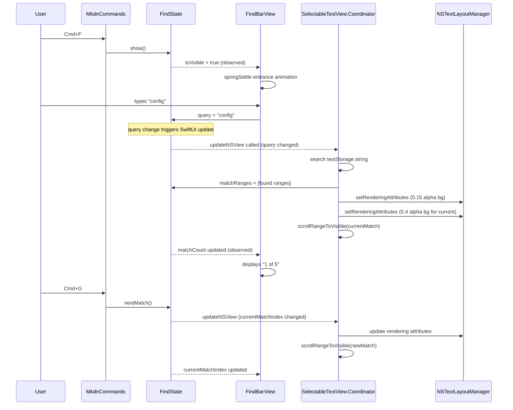

# Design: Custom Find Bar

**Feature ID**: custom-find-bar
**Version**: 1.0.0
**Created**: 2026-02-15

## 1. Design Overview

Replace the stock NSTextFinder find bar with a custom SwiftUI pill-shaped find bar that floats in the top-right corner of the preview viewport. The find bar is a SwiftUI overlay in the ContentView ZStack (highest z-order), backed by a per-window `FindState` observable that bridges search state between the SwiftUI find bar UI, the NSTextView Coordinator (for highlight rendering and scroll), and the menu command system (for keyboard shortcuts).

### High-Level Architecture

```mermaid
graph TB
    subgraph SwiftUI Layer
        DW[DocumentWindow]
        CV[ContentView]
        FBV[FindBarView]
        MPV[MarkdownPreviewView]
    end

    subgraph State Layer
        FS[FindState]
        DS[DocumentState]
        AS[AppSettings]
    end

    subgraph AppKit Layer
        STV[SelectableTextView Coordinator]
        CBTV[CodeBlockBackgroundTextView]
        TLM[NSTextLayoutManager]
    end

    subgraph Menu Layer
        MC[MkdnCommands]
        FVK[FocusedFindStateKey]
    end

    DW -->|creates & injects| FS
    DW -->|creates & injects| DS
    CV -->|overlays| FBV
    CV -->|contains| MPV
    FBV -->|reads/writes| FS
    MPV -->|passes find params| STV
    STV -->|applies rendering attributes| TLM
    STV -->|scrollRangeToVisible| CBTV
    STV -->|writes matchRanges| FS
    MC -->|@FocusedValue| FVK
    FVK -->|accesses| FS
    MC -->|show/next/prev/useSelection| FS
```

## 2. Architecture

### Component Responsibilities

| Component | Responsibility |
|-----------|---------------|
| `FindState` | Per-window observable holding query, visibility, match ranges, current index. Performs case-insensitive text search. Provides navigation methods (next/prev with wrap-around). |
| `FindBarView` | SwiftUI pill UI. Text input, match count label ("N of M"), prev/next chevron buttons, close button. Animation entrance/exit via MotionPreference. |
| `FocusedFindStateKey` | FocusedValueKey enabling MkdnCommands to access the active window's FindState. |
| `SelectableTextView` (modified) | Accepts find-related parameters. Coordinator applies TextKit 2 rendering attributes for match highlights and calls `scrollRangeToVisible` for match navigation. |
| `ContentView` (modified) | Adds FindBarView overlay at highest z-order in existing ZStack. |
| `MkdnCommands` (modified) | Dispatches find commands to FindState instead of NSTextFinder. |
| `DocumentWindow` (modified) | Creates FindState instance, injects via `.environment()` and `.focusedSceneValue()`. |

### Data Flow Sequence



## 3. Detailed Design

### 3.1 FindState Model

**File**: `mkdn/Features/Viewer/ViewModels/FindState.swift`

```swift
@MainActor
@Observable
final class FindState {
    // MARK: - Input State (written by FindBarView and MkdnCommands)
    var query: String = ""
    var isVisible: Bool = false
    var currentMatchIndex: Int = 0

    // MARK: - Output State (written by Coordinator, read by FindBarView)
    private(set) var matchRanges: [NSRange] = []
    var matchCount: Int { matchRanges.count }

    // MARK: - Navigation
    func nextMatch() { ... }       // wraps around: (currentMatchIndex + 1) % matchCount
    func previousMatch() { ... }   // wraps around: (currentMatchIndex - 1 + matchCount) % matchCount

    // MARK: - Lifecycle
    func show() { isVisible = true }
    func dismiss() { query = ""; matchRanges = []; currentMatchIndex = 0; isVisible = false }
    func useSelection(_ text: String) { isVisible = true; query = text }

    // MARK: - Search (called by Coordinator)
    func performSearch(in text: String) {
        // Case-insensitive NSString.range(of:options:range:) loop
        // Updates matchRanges and clamps currentMatchIndex
    }
}
```

**Key design decisions:**
- Search logic lives in `performSearch(in:)`, called explicitly by the Coordinator. This avoids `didSet` chains and gives the Coordinator control over when search runs.
- `matchRanges` is `private(set)` -- only the Coordinator writes it after performing the search, keeping the search tightly coupled to the actual text storage content.
- The Coordinator calls `performSearch` in `updateNSView` when it detects the query or content has changed, ensuring matches always reflect the current text storage.

### 3.2 FindBarView

**File**: `mkdn/Features/Viewer/Views/FindBarView.swift`

Layout (left to right within the pill):
```
[ magnifyingglass | [text field] | "3 of 17" | chevron.left | chevron.right | xmark ]
```

| Element | Spec |
|---------|------|
| Container | ~300pt fixed width, pill shape (Capsule clip), `.ultraThinMaterial` background |
| Search icon | SF Symbol `magnifyingglass`, `.secondary` foreground |
| Text field | SwiftUI `TextField`, bound to `findState.query` |
| Match count | `Text("\(currentMatchIndex + 1) of \(matchCount)")`, `.caption` font, `.secondary` foreground. Hidden when query is empty. Shows "No matches" when matchCount == 0 and query is non-empty. |
| Prev/Next buttons | SF Symbols `chevron.left` / `chevron.right`, `.secondary` foreground, call `findState.previousMatch()` / `findState.nextMatch()` |
| Close button | SF Symbol `xmark`, `.secondary` foreground, calls `findState.dismiss()` |
| Position | `.frame(maxWidth: .infinity, maxHeight: .infinity, alignment: .topTrailing)` with `.padding()` |

**Animation contract:**
- Entrance: scale from 0.95 + opacity from 0.0, using `springSettle` (or `reducedInstant` under RM)
- Exit: `quickFade` (or `reducedInstant` under RM)
- Pattern matches `ModeTransitionOverlay` exactly

**Keyboard handling within FindBarView:**
- Return -> `findState.nextMatch()`
- Shift+Return -> `findState.previousMatch()`
- Escape -> `findState.dismiss()` + return focus to text view
- These are handled via `.onSubmit` and `.onKeyPress` modifiers on the TextField.

### 3.3 FocusedFindStateKey

**File**: `mkdn/App/FocusedFindStateKey.swift` (new file, parallel to `FocusedDocumentStateKey.swift`)

```swift
struct FocusedFindStateKey: FocusedValueKey {
    typealias Value = FindState
}

extension FocusedValues {
    var findState: FindState? {
        get { self[FocusedFindStateKey.self] }
        set { self[FocusedFindStateKey.self] = newValue }
    }
}
```

### 3.4 SelectableTextView Modifications

**New parameters:**
```swift
struct SelectableTextView: NSViewRepresentable {
    // ... existing parameters ...
    let findQuery: String
    let findCurrentIndex: Int
    let findIsVisible: Bool
    let findState: FindState  // for Coordinator to write matchRanges
}
```

Passing specific find properties (`findQuery`, `findCurrentIndex`, `findIsVisible`) as value parameters ensures SwiftUI tracks their changes and calls `updateNSView` when they change. The `findState` reference is passed for the Coordinator to write back search results.

**Coordinator changes:**

New tracked state:
```swift
var lastFindQuery: String = ""
var lastFindIndex: Int = 0
var lastFindVisible: Bool = false
var lastHighlightedRanges: [NSRange] = []
```

New methods:
- `applyFindHighlights(findState:textView:theme:)` -- performs search if query/content changed, applies rendering attributes via TextKit 2, scrolls to current match
- `clearFindHighlights(textView:)` -- removes all rendering attributes for previous match ranges

**Highlight application via TextKit 2:**
```swift
// Clear previous highlights
for range in lastHighlightedRanges {
    if let textRange = textRange(from: range, contentManager: contentManager) {
        layoutManager.setRenderingAttributes([:], for: textRange)
    }
}

// Apply new highlights
let accentNSColor = PlatformTypeConverter.nsColor(from: theme.colors.accent)
for (index, range) in findState.matchRanges.enumerated() {
    let alpha: CGFloat = (index == findState.currentMatchIndex) ? 0.4 : 0.15
    if let textRange = textRange(from: range, contentManager: contentManager) {
        layoutManager.setRenderingAttributes(
            [.backgroundColor: accentNSColor.withAlphaComponent(alpha)],
            for: textRange
        )
    }
}

// Scroll to current match
if let currentRange = findState.matchRanges[safe: findState.currentMatchIndex] {
    textView.scrollRangeToVisible(currentRange)
}
```

**Configuration change:**
Remove `textView.usesFindBar = true` and `textView.isIncrementalSearchingEnabled = true` from `configureTextView()` to disable the stock NSTextFinder.

### 3.5 ContentView Modifications

Add FindBarView as the highest-z element in the existing ZStack:

```swift
ZStack {
    // ... existing content (Group, TheOrbView, ModeTransitionOverlay) ...

    if findState.isVisible {
        FindBarView()
            .transition(
                .asymmetric(
                    insertion: .scale(scale: 0.95).combined(with: .opacity),
                    removal: .opacity
                )
            )
    }
}
```

The find bar reads `findState.isVisible` to conditionally render. The `if` statement with `.transition` enables SwiftUI to apply the entrance/exit animations using `withAnimation` called from FindState's `show()`/`dismiss()` methods (or from MkdnCommands).

### 3.6 MkdnCommands Modifications

Replace the current `sendFindAction` method and find menu items:

```swift
@FocusedValue(\.findState) private var findState

// Find... (Cmd+F)
Button("Find...") {
    withAnimation(motionAnimation(.springSettle)) {
        findState?.show()
    }
}

// Find Next (Cmd+G)
Button("Find Next") {
    findState?.nextMatch()
}

// Find Previous (Cmd+Shift+G)
Button("Find Previous") {
    findState?.previousMatch()
}

// Use Selection for Find (Cmd+E)
Button("Use Selection for Find") {
    guard let textView = Self.findTextView(),
          let selectedText = selectedText(from: textView),
          !selectedText.isEmpty
    else { return }
    withAnimation(motionAnimation(.springSettle)) {
        findState?.useSelection(selectedText)
    }
}
```

The `sendFindAction` method and its `performFindPanelAction` calls are removed entirely.

**Motion resolution helper** (private in MkdnCommands):
```swift
private func motionAnimation(_ primitive: MotionPreference.Primitive) -> Animation? {
    let reduceMotion = NSWorkspace.shared.accessibilityDisplayShouldReduceMotion
    return MotionPreference(reduceMotion: reduceMotion).resolved(primitive)
}
```

### 3.7 DocumentWindow Modifications

Create and inject FindState alongside DocumentState:

```swift
@State private var findState = FindState()

// In body:
ContentView()
    .environment(documentState)
    .environment(findState)
    .environment(appSettings)
    .focusedSceneValue(\.documentState, documentState)
    .focusedSceneValue(\.findState, findState)
```

### 3.8 MarkdownPreviewView Modifications

Read FindState from environment and pass find parameters to SelectableTextView:

```swift
@Environment(FindState.self) private var findState

// In body:
SelectableTextView(
    // ... existing parameters ...
    findQuery: findState.query,
    findCurrentIndex: findState.currentMatchIndex,
    findIsVisible: findState.isVisible,
    findState: findState
)
```

### 3.9 SplitEditorView Modifications

The SplitEditorView contains its own MarkdownPreviewView for the preview pane. Since FindState is injected into the environment at the DocumentWindow level, the MarkdownPreviewView inside SplitEditorView will automatically receive it. No modifications needed to SplitEditorView itself.

### 3.10 Focus Management

**On show (Cmd+F):** The FindBarView's TextField receives focus automatically via `@FocusState` within FindBarView, toggled when `isVisible` becomes true.

**On dismiss (Escape/close):** After dismissal, keyboard focus must return to the text view. The FindBarView's dismiss action calls `findState.dismiss()`, and then the Coordinator (detecting `findIsVisible` changed to false in `updateNSView`) calls `textView.window?.makeFirstResponder(textView)`.

**On Cmd+F when already visible:** FindState.show() is a no-op on isVisible (already true), but the FindBarView re-focuses the TextField via the FocusState binding.

### 3.11 Theme Reactivity

Match highlights use rendering attributes derived from `appSettings.theme.colors.accent`. When the theme changes:
1. SwiftUI triggers `updateNSView` (because theme is already a parameter to SelectableTextView).
2. The Coordinator detects the theme change and reapplies rendering attributes with the new accent color.
3. The FindBarView automatically adapts because `.ultraThinMaterial` and `.secondary` foreground colors are theme-adaptive.

### 3.12 Document Content Change Handling

When the document reloads while the find bar is open:
1. New content flows to `updateNSView` via the existing `attributedText` parameter.
2. The Coordinator detects the content change (`lastAppliedText` comparison) and calls `findState.performSearch(in: textStorage.string)` to recompute matches against the new content.
3. If the match count changes, `currentMatchIndex` is clamped within bounds.
4. Highlights are reapplied to the new text storage.

## 4. Technology Stack

| Concern | Technology | Rationale |
|---------|-----------|-----------|
| Find bar UI | SwiftUI | Consistent with all existing UI components |
| State management | `@Observable` | Project standard (not ObservableObject) |
| Text search | `NSString.range(of:options:range:)` | Optimized, case-insensitive, handles Unicode correctly |
| Match highlighting | TextKit 2 `setRenderingAttributes` | Visual-only attributes that don't modify text storage |
| Scroll to match | `NSTextView.scrollRangeToVisible` | Standard API, per requirement assumption |
| Frosted glass | `.ultraThinMaterial` | Matches existing overlays (CodeBlockCopyButton, ModeTransitionOverlay) |
| Animations | `AnimationConstants.springSettle` / `.quickFade` | Named primitives per animation design language |
| Reduce Motion | `MotionPreference` | Standard resolver per accessibility pattern |
| Menu integration | `@FocusedValue` | Existing pattern for per-window state access from Commands |

## 5. Implementation Plan

| Task | Component | Files | Description |
|------|-----------|-------|-------------|
| T1 | FindState model | `mkdn/Features/Viewer/ViewModels/FindState.swift` (new) | @Observable class with query, visibility, match state, search, and navigation logic |
| T2 | FindBarView UI | `mkdn/Features/Viewer/Views/FindBarView.swift` (new) | SwiftUI pill view with text field, match count, nav buttons, close button, animations |
| T3 | FocusedFindStateKey | `mkdn/App/FocusedFindStateKey.swift` (new) | FocusedValueKey for menu command access to FindState |
| T4 | SelectableTextView highlight integration | `mkdn/Features/Viewer/Views/SelectableTextView.swift` (modify) | Add find parameters, Coordinator highlight/scroll logic, disable NSTextFinder |
| T5 | ContentView overlay | `mkdn/App/ContentView.swift` (modify) | Add FindBarView at highest z-order in ZStack |
| T6 | MkdnCommands dispatch | `mkdn/App/MkdnCommands.swift` (modify) | Replace sendFindAction with FindState dispatch via FocusedValue |
| T7 | DocumentWindow injection | `mkdn/App/DocumentWindow.swift` (modify) | Create FindState, inject via environment and focusedSceneValue |

## 6. Implementation DAG

**Parallel Groups** (tasks with no inter-dependencies):

1. [T1] - Foundation model with no external dependencies
2. [T2, T3, T4] - All depend only on T1: FindBarView uses FindState API; FocusedKey wraps FindState type; SelectableTextView reads FindState
3. [T5, T6, T7] - Integration tasks that wire everything together

**Dependencies**:

- T2 -> T1 (interface: FindBarView reads/writes FindState properties and calls its methods)
- T3 -> T1 (interface: FocusedValueKey wraps the FindState type)
- T4 -> T1 (interface: Coordinator reads FindState and calls performSearch)
- T5 -> [T1, T2] (build: ContentView imports FindBarView and reads FindState.isVisible)
- T6 -> [T1, T3] (build: MkdnCommands uses FocusedFindStateKey to access FindState)
- T7 -> [T1, T3] (build: DocumentWindow creates FindState and publishes via FocusedFindStateKey)

**Critical Path**: T1 -> T2 -> T5 (or equivalently T1 -> T4 -> T5)

## 7. Testing Strategy

### Test Value Assessment

| Valuable (design for) | Avoid |
|-----------------------|-------|
| FindState search correctness (case-insensitive, boundary, Unicode) | SwiftUI TextField binding behavior |
| FindState navigation wrap-around logic | NSTextLayoutManager setRenderingAttributes API |
| FindState dismiss clears all state | SwiftUI .transition animation mechanics |
| Match count accuracy for edge cases (empty query, no matches, single char) | .ultraThinMaterial rendering |
| Theme accent color derivation for highlights | FocusedValueKey plumbing |

### Unit Tests

**File**: `mkdnTests/Unit/FindStateTests.swift`

```swift
@Suite("FindState")
struct FindStateTests {
    @Test("Empty query produces no matches")
    @MainActor func emptyQuery() { ... }

    @Test("Case-insensitive search")
    @MainActor func caseInsensitive() { ... }

    @Test("Multiple matches found")
    @MainActor func multipleMatches() { ... }

    @Test("Navigation wraps forward")
    @MainActor func wrapForward() { ... }

    @Test("Navigation wraps backward")
    @MainActor func wrapBackward() { ... }

    @Test("Dismiss clears all state")
    @MainActor func dismissClearsState() { ... }

    @Test("useSelection sets query and shows bar")
    @MainActor func useSelection() { ... }

    @Test("Content change recomputes matches")
    @MainActor func contentChangeRecomputes() { ... }

    @Test("Current index clamped when matches decrease")
    @MainActor func indexClampedOnDecrease() { ... }
}
```

All tests operate on the `FindState` model directly, calling `performSearch(in:)` with known text and asserting `matchRanges`, `matchCount`, and `currentMatchIndex`. No UI, no AppKit dependencies.

### Integration Considerations

The highlight rendering and scroll-to-match behavior are best verified through the existing visual verification workflow or manual testing, since they involve TextKit 2 rendering attributes and NSTextView scroll state -- both are AppKit-internal behaviors that unit tests cannot meaningfully assert.

## 8. Deployment Design

No special deployment considerations. The feature is a pure in-app UI change:

- No new dependencies or packages
- No data migration
- No configuration changes
- No infrastructure changes
- Ships as part of the standard `swift build` binary

**Rollout**: The feature replaces the stock NSTextFinder. There is no feature flag -- the custom find bar is the sole find mechanism once merged. The stock NSTextFinder configuration (`usesFindBar`, `isIncrementalSearchingEnabled`) is removed.

## 9. Documentation Impact

| Type | Target | Section | KB Source | Rationale |
|------|--------|---------|-----------|-----------|
| edit | `.rp1/context/modules.md` | Features Layer > Viewer | modules.md:Features Layer | Add FindState.swift and FindBarView.swift to module inventory |
| edit | `.rp1/context/modules.md` | App Layer | modules.md:App Layer | Add FocusedFindStateKey.swift; update MkdnCommands description |
| edit | `.rp1/context/architecture.md` | System Overview | architecture.md:System Overview | Add FindState to the per-window state tree |
| edit | `.rp1/context/architecture.md` | Data Flow | architecture.md:Data Flow | Add find bar data flow description |
| edit | `.rp1/context/index.md` | Quick Reference | index.md:Quick Reference | No change needed -- existing paths cover the feature directories |

## 10. Design Decisions Log

See `design-decisions.md` for the full decision log. Key decisions:

| ID | Decision | Choice |
|----|----------|--------|
| D1 | Find bar hosting layer | SwiftUI overlay in ContentView ZStack (not AppKit NSView overlay) |
| D2 | State architecture | Dedicated FindState @Observable (not embedded in DocumentState) |
| D3 | Search execution location | Coordinator in updateNSView (not FindState didSet) |
| D4 | Highlight mechanism | TextKit 2 rendering attributes (not text storage modification) |
| D5 | Menu integration | FocusedValueKey (parallel to existing DocumentState pattern) |
| D6 | NSTextFinder removal | Full removal (not coexistence) |
