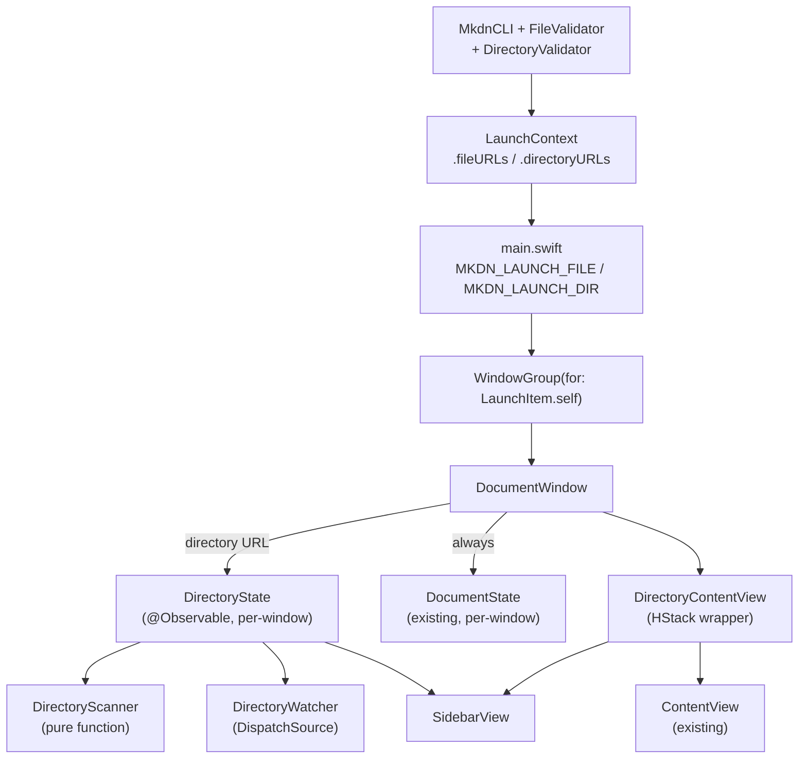
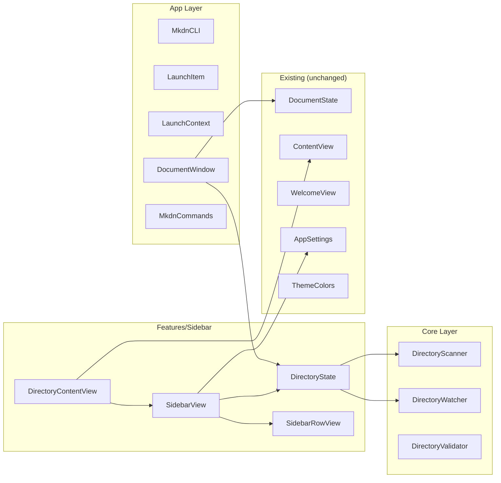
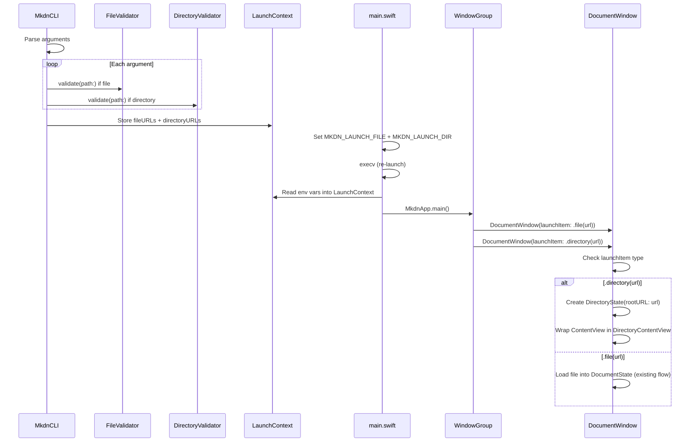
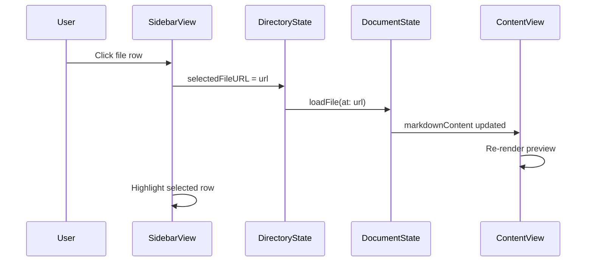
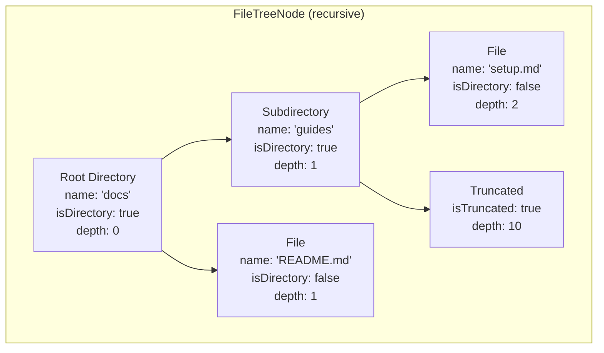

# Design Specification: Directory Sidebar Navigation

**Feature ID**: directory-sidebar
**Version**: 1.0.0
**Status**: Draft
**Created**: 2026-02-16

## 1. Design Overview

This feature extends mkdn from a single-file viewer into a folder-browsable navigation experience. When invoked with a directory path, mkdn opens a window containing a Solarized-themed sidebar panel showing a filtered tree of Markdown files. Users click files in the sidebar to load them in the content area. The sidebar is toggleable, resizable, and updates via directory watching.

The design introduces a `LaunchItem` enum to distinguish file vs directory arguments at the WindowGroup routing level, a new `DirectoryState` observable for per-window directory lifecycle, a `DirectoryScanner` for building the file tree model, a `DirectoryWatcher` for live filesystem monitoring, and a `Features/Sidebar/` feature module containing the sidebar views.

### High-Level Architecture



## 2. Architecture

### 2.1 Component Architecture

The feature integrates into the existing Feature-Based MVVM architecture as a new `Features/Sidebar/` module with supporting additions to the CLI, App, and Core layers.



### 2.2 Window Routing Sequence



### 2.3 File Navigation Sequence



## 3. Detailed Design

### 3.1 Data Model

#### LaunchItem

A new enum distinguishing file vs directory arguments for WindowGroup routing.

```swift
// mkdn/App/LaunchItem.swift

/// Discriminates file and directory arguments for WindowGroup routing.
///
/// Conforms to Hashable and Codable as required by SwiftUI's
/// WindowGroup(for:) scene value mechanism.
public enum LaunchItem: Hashable, Codable, Sendable {
    case file(URL)
    case directory(URL)

    /// The underlying URL regardless of type.
    public var url: URL {
        switch self {
        case .file(let url), .directory(let url):
            return url
        }
    }
}
```

#### FileTreeNode

A recursive value type representing the directory tree model. Designed as a struct tree for SwiftUI diffing efficiency.

```swift
// mkdn/Core/DirectoryScanner/FileTreeNode.swift

/// A node in the Markdown file tree.
///
/// Value type for efficient SwiftUI diffing. Each node represents
/// either a directory (with children) or a Markdown file (leaf).
public struct FileTreeNode: Identifiable, Hashable, Sendable {
    public let id: URL
    public let name: String
    public let url: URL
    public let isDirectory: Bool
    public let children: [FileTreeNode]
    public let depth: Int

    /// Whether this node is a truncation indicator (depth limit reached).
    public let isTruncated: Bool
}
```

#### Data Model Diagram



### 3.2 State Management

#### DirectoryState

New `@Observable` class following the established pattern of `DocumentState` and `FindState`. Owns the directory tree, selection, sidebar visibility/width, expansion state, and the directory watcher.

```swift
// mkdn/Features/Sidebar/ViewModels/DirectoryState.swift

@MainActor
@Observable
public final class DirectoryState {
    // MARK: - Tree State

    /// Root directory URL.
    public let rootURL: URL

    /// The file tree model, rebuilt on scan/refresh.
    public private(set) var tree: FileTreeNode?

    /// URLs of directories currently expanded in the sidebar.
    public var expandedDirectories: Set<URL> = []

    // MARK: - Selection State

    /// The currently selected file URL in the sidebar.
    public var selectedFileURL: URL?

    // MARK: - Sidebar Layout State

    /// Whether the sidebar panel is visible.
    public var isSidebarVisible: Bool = true

    /// Current sidebar width in points.
    public var sidebarWidth: CGFloat = 240

    // MARK: - Scanning Configuration

    /// Maximum depth for recursive directory scanning.
    static let maxScanDepth = 10

    /// Sidebar width constraints.
    static let minSidebarWidth: CGFloat = 160
    static let maxSidebarWidth: CGFloat = 400

    // MARK: - Directory Watcher

    let directoryWatcher = DirectoryWatcher()

    // MARK: - Init

    public init(rootURL: URL) { ... }

    // MARK: - Methods

    /// Perform initial directory scan and start watching.
    public func scan() { ... }

    /// Refresh the tree from disk, preserving expansion and selection state.
    public func refresh() { ... }

    /// Toggle sidebar visibility.
    public func toggleSidebar() { ... }

    /// Select a file and notify for loading.
    public func selectFile(at url: URL) { ... }
}
```

**Environment injection** follows the established pattern:

```swift
// In DirectoryContentView or DocumentWindow:
@Environment(DirectoryState.self) private var directoryState

// Focused value for menu commands:
.focusedSceneValue(\.directoryState, directoryState)
```

**FocusedValueKey** for menu commands (follows FocusedDocumentStateKey pattern):

```swift
// mkdn/App/FocusedDirectoryStateKey.swift

public struct FocusedDirectoryStateKey: FocusedValueKey {
    public typealias Value = DirectoryState
}

public extension FocusedValues {
    var directoryState: DirectoryState? {
        get { self[FocusedDirectoryStateKey.self] }
        set { self[FocusedDirectoryStateKey.self] = newValue }
    }
}
```

### 3.3 CLI Layer Changes

#### DirectoryValidator

New validator following `FileValidator` patterns. Validates that a path is a readable directory.

```swift
// mkdn/Core/CLI/DirectoryValidator.swift

public enum DirectoryValidator {
    /// Resolve a raw path string to a validated directory URL.
    /// Performs: tilde expansion, path resolution, symlink resolution,
    /// directory check, existence check.
    public static func validate(path: String) throws -> URL { ... }
}
```

#### CLIError Extension

Add a new case for directory-specific errors:

```swift
case directoryNotFound(resolvedPath: String)
case directoryNotReadable(resolvedPath: String, reason: String)
```

#### MkdnCLI Changes

The existing `@Argument` stays as `[String]`. The `main.swift` entry point differentiates file vs directory paths:

```swift
// In main.swift validation loop:
for path in cli.files {
    let resolved = FileValidator.resolvePath(path)
    var isDir: ObjCBool = false
    FileManager.default.fileExists(atPath: resolved.path, isDirectory: &isDir)
    if isDir.boolValue {
        let url = try DirectoryValidator.validate(path: path)
        validDirURLs.append(url)
    } else {
        let url = try FileValidator.validate(path: path)
        validFileURLs.append(url)
    }
}
```

#### LaunchContext Extension

Add directory URL storage alongside existing file URLs:

```swift
public enum LaunchContext {
    public nonisolated(unsafe) static var fileURLs: [URL] = []
    public nonisolated(unsafe) static var directoryURLs: [URL] = []

    public static func consumeURLs() -> [URL] { ... }       // existing
    public static func consumeDirectoryURLs() -> [URL] { ... } // new
}
```

Environment variable: `MKDN_LAUNCH_DIR` (newline-separated, parallel to `MKDN_LAUNCH_FILE`).

### 3.4 Window Layer Changes

#### WindowGroup

Change from `WindowGroup(for: URL.self)` to `WindowGroup(for: LaunchItem.self)`:

```swift
// mkdnEntry/main.swift

WindowGroup(for: LaunchItem.self) { $launchItem in
    DocumentWindow(launchItem: launchItem)
        .environment(appSettings)
}
.handlesExternalEvents(matching: [])
.windowStyle(.hiddenTitleBar)
.commands {
    MkdnCommands(appSettings: appSettings)
    OpenRecentCommands()
}
```

#### DocumentWindow Changes

Accept `LaunchItem?` instead of `URL?`. Create `DirectoryState` conditionally:

```swift
public struct DocumentWindow: View {
    public let launchItem: LaunchItem?
    @State private var documentState = DocumentState()
    @State private var findState = FindState()
    @State private var directoryState: DirectoryState?
    @State private var isReady = false
    @Environment(AppSettings.self) private var appSettings
    @Environment(\.openWindow) private var openWindow

    public var body: some View {
        Group {
            if let directoryState {
                DirectoryContentView()
                    .environment(directoryState)
            } else {
                ContentView()
            }
        }
        .environment(documentState)
        .environment(findState)
        .environment(appSettings)
        .focusedSceneValue(\.documentState, documentState)
        .focusedSceneValue(\.findState, findState)
        .focusedSceneValue(\.directoryState, directoryState)
        .opacity(isReady ? 1 : 0)
        .onAppear {
            handleLaunch()
            isReady = true
        }
    }

    private func handleLaunch() {
        switch launchItem {
        case .file(let url):
            try? documentState.loadFile(at: url)
            NSDocumentController.shared.noteNewRecentDocumentURL(url)

        case .directory(let url):
            let dirState = DirectoryState(rootURL: url)
            directoryState = dirState
            dirState.scan()

        case nil:
            consumeLaunchContext()
        }
    }
}
```

The `consumeLaunchContext()` method handles the no-argument launch case, consuming from `LaunchContext.fileURLs` and `LaunchContext.directoryURLs`, opening additional windows via `openWindow(value: LaunchItem.file(url))` or `openWindow(value: LaunchItem.directory(url))`.

#### FileOpenCoordinator Changes

Extend to handle directory URLs from Finder/dock if needed. For v1, only CLI invocation opens directories, so changes are minimal.

### 3.5 View Layer

#### DirectoryContentView

The top-level wrapper that places the sidebar alongside the existing `ContentView` using an HStack-based layout (per CON-3: no NavigationSplitView).

```swift
// mkdn/Features/Sidebar/Views/DirectoryContentView.swift

public struct DirectoryContentView: View {
    @Environment(DirectoryState.self) private var directoryState
    @Environment(AppSettings.self) private var appSettings
    @Environment(\.accessibilityReduceMotion) private var reduceMotion

    private var motion: MotionPreference {
        MotionPreference(reduceMotion: reduceMotion)
    }

    public var body: some View {
        HStack(spacing: 0) {
            if directoryState.isSidebarVisible {
                SidebarView()
                    .frame(width: directoryState.sidebarWidth)
                    .transition(.move(edge: .leading).combined(with: .opacity))

                SidebarDivider()
            }

            ContentView()
        }
        .animation(motion.resolved(.gentleSpring), value: directoryState.isSidebarVisible)
        .frame(minWidth: 600, minHeight: 400)
    }
}
```

#### SidebarView

The sidebar panel containing the header, tree list, and empty state.

```swift
// mkdn/Features/Sidebar/Views/SidebarView.swift

struct SidebarView: View {
    @Environment(DirectoryState.self) private var directoryState
    @Environment(AppSettings.self) private var appSettings

    var body: some View {
        VStack(alignment: .leading, spacing: 0) {
            // Header: root directory name
            SidebarHeaderView()

            Divider()
                .foregroundStyle(appSettings.theme.colors.border)

            // Tree or empty state
            if let tree = directoryState.tree, !tree.children.isEmpty {
                ScrollView {
                    LazyVStack(alignment: .leading, spacing: 0) {
                        ForEach(flattenVisibleNodes(tree)) { node in
                            SidebarRowView(node: node)
                        }
                    }
                    .padding(.vertical, 4)
                }
            } else {
                SidebarEmptyView()
            }
        }
        .background(appSettings.theme.colors.backgroundSecondary)
    }
}
```

#### SidebarRowView

Individual row for a file or directory entry. Handles selection highlight, disclosure chevron, indentation, and icons.

```swift
// mkdn/Features/Sidebar/Views/SidebarRowView.swift

struct SidebarRowView: View {
    let node: FileTreeNode
    @Environment(DirectoryState.self) private var directoryState
    @Environment(AppSettings.self) private var appSettings

    private var isSelected: Bool {
        !node.isDirectory && directoryState.selectedFileURL == node.url
    }

    private var isExpanded: Bool {
        directoryState.expandedDirectories.contains(node.url)
    }

    var body: some View {
        HStack(spacing: 6) {
            if node.isDirectory {
                Image(systemName: isExpanded ? "chevron.down" : "chevron.right")
                    .font(.caption2)
                    .foregroundStyle(appSettings.theme.colors.foregroundSecondary)
                    .frame(width: 12)

                Image(systemName: "folder")
                    .foregroundStyle(appSettings.theme.colors.accent)
            } else {
                Spacer()
                    .frame(width: 12)

                Image(systemName: "doc.text")
                    .foregroundStyle(appSettings.theme.colors.foregroundSecondary)
            }

            Text(node.name)
                .font(.callout)
                .foregroundStyle(appSettings.theme.colors.foreground)
                .lineLimit(1)
                .truncationMode(.middle)
        }
        .padding(.leading, CGFloat(node.depth) * 16 + 8)
        .padding(.trailing, 8)
        .padding(.vertical, 4)
        .frame(maxWidth: .infinity, alignment: .leading)
        .background(isSelected ? appSettings.theme.colors.accent.opacity(0.2) : .clear)
        .contentShape(Rectangle())
        .onTapGesture {
            handleTap()
        }
    }

    private func handleTap() {
        if node.isDirectory {
            // Toggle expansion
            if isExpanded {
                directoryState.expandedDirectories.remove(node.url)
            } else {
                directoryState.expandedDirectories.insert(node.url)
            }
        } else if !node.isTruncated {
            // Select file
            directoryState.selectFile(at: node.url)
        }
    }
}
```

#### SidebarDivider

A draggable divider with resize cursor handling.

```swift
// mkdn/Features/Sidebar/Views/SidebarDivider.swift

struct SidebarDivider: View {
    @Environment(DirectoryState.self) private var directoryState
    @Environment(AppSettings.self) private var appSettings

    var body: some View {
        Rectangle()
            .fill(appSettings.theme.colors.border)
            .frame(width: 1)
            .contentShape(Rectangle().inset(by: -3)) // 7pt hit target
            .gesture(
                DragGesture(minimumDistance: 1)
                    .onChanged { value in
                        let newWidth = directoryState.sidebarWidth + value.translation.width
                        directoryState.sidebarWidth = min(
                            max(newWidth, DirectoryState.minSidebarWidth),
                            DirectoryState.maxSidebarWidth
                        )
                    }
            )
            .onHover { hovering in
                if hovering {
                    NSCursor.resizeLeftRight.push()
                } else {
                    NSCursor.pop()
                }
            }
    }
}
```

#### SidebarHeaderView

Displays the root directory name at the top of the sidebar.

```swift
// mkdn/Features/Sidebar/Views/SidebarHeaderView.swift

struct SidebarHeaderView: View {
    @Environment(DirectoryState.self) private var directoryState
    @Environment(AppSettings.self) private var appSettings

    var body: some View {
        HStack(spacing: 8) {
            Image(systemName: "folder")
                .foregroundStyle(appSettings.theme.colors.accent)
            Text(directoryState.rootURL.lastPathComponent)
                .font(.headline)
                .foregroundStyle(appSettings.theme.colors.headingColor)
                .lineLimit(1)
                .truncationMode(.middle)
        }
        .padding(.horizontal, 12)
        .padding(.vertical, 10)
    }
}
```

#### SidebarEmptyView

Displayed when the directory contains no Markdown files.

```swift
// mkdn/Features/Sidebar/Views/SidebarEmptyView.swift

struct SidebarEmptyView: View {
    @Environment(AppSettings.self) private var appSettings

    var body: some View {
        VStack(spacing: 8) {
            Image(systemName: "doc.text.magnifyingglass")
                .font(.title2)
                .foregroundStyle(appSettings.theme.colors.foregroundSecondary)
            Text("No Markdown files found")
                .font(.callout)
                .foregroundStyle(appSettings.theme.colors.foregroundSecondary)
        }
        .frame(maxWidth: .infinity, maxHeight: .infinity)
    }
}
```

#### WelcomeView Adaptation

Add a `mode` parameter to differentiate single-file vs directory welcome messages:

```swift
// Modification to mkdn/UI/Components/WelcomeView.swift

struct WelcomeView: View {
    @Environment(AppSettings.self) private var appSettings
    var isDirectoryMode: Bool = false

    var body: some View {
        VStack(spacing: 20) {
            Image(systemName: isDirectoryMode ? "sidebar.left" : "doc.richtext")
                .font(.system(size: 64))
                .foregroundColor(appSettings.theme.colors.foregroundSecondary)

            Text("mkdn")
                .font(.system(size: 36, weight: .bold, design: .monospaced))
                .foregroundColor(appSettings.theme.colors.headingColor)

            Text(isDirectoryMode
                ? "Select a file from the sidebar to begin reading"
                : "Open a Markdown file to get started")
                .font(.body)
                .foregroundColor(appSettings.theme.colors.foregroundSecondary)

            if !isDirectoryMode {
                // Existing instruction rows (unchanged)
                ...
            }
        }
        .frame(maxWidth: .infinity, maxHeight: .infinity)
        .background(appSettings.theme.colors.background)
    }
}
```

In `ContentView`, pass the directory mode flag:

```swift
if documentState.currentFileURL == nil {
    WelcomeView(isDirectoryMode: directoryState != nil)
}
```

This requires `DirectoryState` to be optionally available in the environment. Use `@Environment(DirectoryState?.self)` or a simpler approach: have `DirectoryContentView` set a boolean environment key.

Preferred approach -- a lightweight environment key:

```swift
// mkdn/App/DirectoryModeKey.swift

private struct DirectoryModeKey: EnvironmentKey {
    static let defaultValue = false
}

extension EnvironmentValues {
    var isDirectoryMode: Bool {
        get { self[DirectoryModeKey.self] }
        set { self[DirectoryModeKey.self] = newValue }
    }
}
```

Then `DirectoryContentView` sets `.environment(\.isDirectoryMode, true)` and `WelcomeView` reads `@Environment(\.isDirectoryMode) private var isDirectoryMode`.

### 3.6 Core Layer: DirectoryScanner

Pure function that recursively scans a directory and builds a `FileTreeNode` tree.

```swift
// mkdn/Core/DirectoryScanner/DirectoryScanner.swift

public enum DirectoryScanner {
    private static let markdownExtensions: Set<String> = ["md", "markdown"]

    /// Scan a directory and return a FileTreeNode tree containing
    /// only Markdown files and directories that contain them.
    ///
    /// - Parameters:
    ///   - url: Root directory URL.
    ///   - maxDepth: Maximum recursion depth (default: 10).
    /// - Returns: The root FileTreeNode, or nil if the directory is unreadable.
    public static func scan(url: URL, maxDepth: Int = 10) -> FileTreeNode? { ... }
}
```

**Algorithm**:
1. List directory contents (non-recursive) using `FileManager.contentsOfDirectory(at:includingPropertiesForKeys:options:)`.
2. Filter out hidden entries (names starting with `.`).
3. For each entry, check if file (with .md/.markdown extension) or directory.
4. Recurse into directories up to `maxDepth`. At depth limit, create a truncation indicator node.
5. Prune empty directories (directories whose recursive children contain no Markdown files).
6. Sort: directories first, then files, alphabetically case-insensitive within each group.
7. Return the root node.

### 3.7 Core Layer: DirectoryWatcher

Watches the root directory and first-level subdirectories for structural changes using `DispatchSource.makeFileSystemObjectSource`, following the `FileWatcher` pattern.

```swift
// mkdn/Core/DirectoryWatcher/DirectoryWatcher.swift

@MainActor
@Observable
final class DirectoryWatcher {
    /// Whether the watched directory structure has changed.
    private(set) var hasChanges = false

    /// Start watching a directory and its first-level subdirectories.
    func watch(rootURL: URL, subdirectories: [URL]) { ... }

    /// Stop all watching.
    func stopWatching() { ... }

    /// Acknowledge the change (caller has refreshed the tree).
    func acknowledge() { ... }
}
```

**Implementation details**:
- Opens file descriptors with `O_EVTONLY` for root directory and each first-level subdirectory.
- Creates a `DispatchSource` per watched directory with event mask `[.write, .rename, .delete, .link]`.
- All sources share a single serial `DispatchQueue`.
- Events are funneled through `AsyncStream` to the `@MainActor` task (same pattern as `FileWatcher`).
- `nonisolated static func installHandlers` pattern copied from `FileWatcher` for Swift 6 concurrency compliance.
- On change detection, sets `hasChanges = true`. The owning `DirectoryState` observes this and triggers `refresh()`.
- File descriptor cleanup in cancel handlers. `deinit` cancels all sources.

**Watching scope**: Root directory + all first-level subdirectories (as enumerated at scan time). When the tree refreshes, the watcher is restarted with the updated subdirectory list to handle newly created subdirectories.

### 3.8 Menu Commands

Add a "Toggle Sidebar" command to `MkdnCommands`:

```swift
// Addition to MkdnCommands body, in the CommandGroup(after: .sidebar) section:

Section {
    Button("Toggle Sidebar") {
        withAnimation(motionAnimation(.gentleSpring)) {
            directoryState?.toggleSidebar()
        }
    }
    .keyboardShortcut("l", modifiers: [.command, .shift])
    .disabled(directoryState == nil)
}
```

This requires adding `@FocusedValue(\.directoryState) private var directoryState` to `MkdnCommands`.

### 3.9 DirectoryState <-> DocumentState Integration

When a file is selected in the sidebar, `DirectoryState.selectFile(at:)` calls through to `DocumentState.loadFile(at:)`. This requires `DirectoryState` to hold a reference to the per-window `DocumentState`:

```swift
// In DirectoryState:
public weak var documentState: DocumentState?

public func selectFile(at url: URL) {
    selectedFileURL = url
    try? documentState?.loadFile(at: url)
}
```

The reference is set in `DocumentWindow.handleLaunch()`:

```swift
dirState.documentState = documentState
```

When the selected file is deleted (detected via directory watching + refresh), if the deleted file was selected, clear selection and reset `DocumentState`:

```swift
// In DirectoryState.refresh():
if let selected = selectedFileURL,
   !FileManager.default.fileExists(atPath: selected.path) {
    selectedFileURL = nil
    documentState?.currentFileURL = nil
    documentState?.markdownContent = ""
}
```

## 4. Technology Stack

| Category | Choice | Rationale |
|----------|--------|-----------|
| Language | Swift 6 | Existing project stack |
| UI Framework | SwiftUI | Existing project stack |
| Observation | `@Observable` + `@MainActor` | Established pattern (AppSettings, DocumentState, FindState) |
| File System Watching | `DispatchSource.makeFileSystemObjectSource` | Established pattern (FileWatcher) |
| CLI Parsing | swift-argument-parser | Existing dependency |
| Layout | Custom HStack (not NavigationSplitView) | CON-3 requirement, hidden title bar compatibility |
| Animation | AnimationConstants named primitives + MotionPreference | Established pattern |
| Testing | Swift Testing (`@Suite`, `@Test`, `#expect`) | Established pattern |

No new dependencies are introduced. All technology choices follow existing codebase patterns.

## 5. Implementation Plan

### T1: CLI Layer -- Argument Routing

**Files**: `mkdn/Core/CLI/DirectoryValidator.swift` (new), `mkdn/Core/CLI/CLIError.swift` (edit), `mkdn/Core/CLI/LaunchContext.swift` (edit), `mkdnEntry/main.swift` (edit)

- Create `DirectoryValidator` with `validate(path:)` for directory paths.
- Add `directoryNotFound` and `directoryNotReadable` cases to `CLIError`.
- Add `directoryURLs` and `consumeDirectoryURLs()` to `LaunchContext`.
- Modify `main.swift` to detect file vs directory arguments, validate each appropriately, set `MKDN_LAUNCH_DIR` env var alongside `MKDN_LAUNCH_FILE`, and read both on re-launch.
- Rename the `files` argument help text to "Path(s) to Markdown file(s) or director(ies)."

### T2: Data Model -- FileTreeNode + DirectoryScanner

**Files**: `mkdn/Core/DirectoryScanner/FileTreeNode.swift` (new), `mkdn/Core/DirectoryScanner/DirectoryScanner.swift` (new)

- Define `FileTreeNode` struct (Identifiable, Hashable, Sendable).
- Implement `DirectoryScanner.scan(url:maxDepth:)` as a pure function.
- Filtering: .md/.markdown only, exclude hidden, exclude empty directories.
- Sorting: directories first, then files, alphabetical case-insensitive.
- Depth limiting with truncation indicator nodes.

### T3: DirectoryWatcher

**Files**: `mkdn/Core/DirectoryWatcher/DirectoryWatcher.swift` (new)

- Implement `DirectoryWatcher` following `FileWatcher` patterns.
- Watch root directory + first-level subdirectories.
- `DispatchSource` with `O_EVTONLY` file descriptors.
- `AsyncStream` bridge to `@MainActor`.
- `nonisolated static func installHandlers` for Swift 6 concurrency.
- `hasChanges` observable property.

### T4: LaunchItem + Window Routing

**Files**: `mkdn/App/LaunchItem.swift` (new), `mkdnEntry/main.swift` (edit), `mkdn/App/DocumentWindow.swift` (edit)

- Define `LaunchItem` enum with Hashable/Codable/Sendable conformance.
- Change `WindowGroup(for: URL.self)` to `WindowGroup(for: LaunchItem.self)` in main.swift.
- Change `DocumentWindow` to accept `LaunchItem?` instead of `URL?`.
- Wire `LaunchContext` consumption to create appropriate `LaunchItem` values.
- Handle mixed file + directory arguments opening separate windows.

### T5: DirectoryState

**Files**: `mkdn/Features/Sidebar/ViewModels/DirectoryState.swift` (new), `mkdn/App/FocusedDirectoryStateKey.swift` (new), `mkdn/App/DirectoryModeKey.swift` (new)

- Implement `DirectoryState` (`@Observable`, `@MainActor`).
- Own `DirectoryWatcher`, trigger scan/refresh.
- Manage expansion state (Set<URL>), default first-level expanded.
- Manage selection state, sidebar visibility, sidebar width.
- Weak reference to `DocumentState` for file loading.
- Observe `directoryWatcher.hasChanges` to trigger refresh.
- Create `FocusedDirectoryStateKey` for menu command access.
- Create `DirectoryModeKey` environment key.

### T6: Sidebar Views

**Files**: `mkdn/Features/Sidebar/Views/SidebarView.swift` (new), `mkdn/Features/Sidebar/Views/SidebarRowView.swift` (new), `mkdn/Features/Sidebar/Views/SidebarDivider.swift` (new), `mkdn/Features/Sidebar/Views/SidebarHeaderView.swift` (new), `mkdn/Features/Sidebar/Views/SidebarEmptyView.swift` (new)

- Implement all sidebar views per the detailed design in Section 3.5.
- Solarized theming via `appSettings.theme.colors`.
- Tree flattening for visible nodes (respect expansion state).
- Selection highlight with accent color.
- Disclosure chevrons for directories.
- Depth-based indentation.
- Truncation indicator rows.

### T7: DirectoryContentView + Layout Integration

**Files**: `mkdn/Features/Sidebar/Views/DirectoryContentView.swift` (new), `mkdn/App/DocumentWindow.swift` (edit)

- Implement `DirectoryContentView` as HStack wrapper with sidebar + content.
- Animated sidebar show/hide using `gentleSpring`.
- Integrate into `DocumentWindow` body: conditionally use `DirectoryContentView` when `directoryState` is non-nil.
- Pass `.environment(\.isDirectoryMode, true)` through to child views.

### T8: WelcomeView + Menu Commands

**Files**: `mkdn/UI/Components/WelcomeView.swift` (edit), `mkdn/App/MkdnCommands.swift` (edit)

- Add `isDirectoryMode` parameter to `WelcomeView` (default `false`).
- Change icon and message text based on mode.
- Read `@Environment(\.isDirectoryMode)` in `WelcomeView`.
- Add `@FocusedValue(\.directoryState)` to `MkdnCommands`.
- Add "Toggle Sidebar" button with `Cmd+Shift+L` in the View menu (after .sidebar).
- Disable when `directoryState == nil`.

### T9: Unit Tests

**Files**: `mkdnTests/Unit/DirectoryScannerTests.swift` (new), `mkdnTests/Unit/FileTreeNodeTests.swift` (new), `mkdnTests/Unit/DirectoryStateTests.swift` (new), `mkdnTests/Unit/DirectoryValidatorTests.swift` (new), `mkdnTests/Unit/LaunchItemTests.swift` (new)

- `DirectoryScannerTests`: scan with mixed file types, hidden files, empty directories, depth limits, sorting.
- `FileTreeNodeTests`: identity, equality, truncation indicator.
- `DirectoryStateTests`: selection, expansion toggle, sidebar toggle, width clamping, refresh preserves state.
- `DirectoryValidatorTests`: valid directory, nonexistent path, file path (should fail), permissions.
- `LaunchItemTests`: Hashable conformance, Codable round-trip, url accessor.

## 6. Implementation DAG

**Parallel Groups** (tasks with no inter-dependencies):

1. [T1, T2, T3] - CLI changes, data model, and directory watcher are independent of each other
2. [T4, T5] - Window routing needs no prior tasks but T5 needs T2 (FileTreeNode) and T3 (DirectoryWatcher); T4 needs T1 (LaunchContext changes) for full integration but the LaunchItem type itself is independent
3. [T6, T8] - Sidebar views need T5 (DirectoryState) and T2 (FileTreeNode); menu commands need T5
4. [T7] - Layout integration needs T6 (SidebarView) and T4 (DocumentWindow changes)
5. [T9] - Tests need T2, T3, T5

**Dependencies**:

- T4 -> T1 (data: main.swift consumes LaunchContext changes from T1)
- T5 -> T2 (data: DirectoryState holds FileTreeNode tree from T2)
- T5 -> T3 (data: DirectoryState owns DirectoryWatcher from T3)
- T6 -> T2 (data: SidebarView renders FileTreeNode)
- T6 -> T5 (interface: SidebarView reads DirectoryState)
- T8 -> T5 (interface: MkdnCommands uses FocusedValue for DirectoryState)
- T7 -> T4 (build: DirectoryContentView integrates into DocumentWindow from T4)
- T7 -> T6 (build: DirectoryContentView embeds SidebarView from T6)
- T9 -> [T2, T3, T5] (build: tests import types from these tasks)

**Critical Path**: T2 -> T5 -> T6 -> T7

## 7. Testing Strategy

### Test Value Assessment

| Valuable (design for) | Avoid (do NOT design for) |
|-----------------------|--------------------------|
| DirectoryScanner filtering logic | FileManager API behavior |
| DirectoryScanner sort order | Swift sort stability |
| DirectoryScanner depth limiting | DispatchSource event delivery timing |
| FileTreeNode identity and equality | URL Hashable conformance |
| DirectoryState selection/expansion state management | SwiftUI environment propagation |
| DirectoryState sidebar width clamping | SwiftUI animation rendering |
| DirectoryValidator path validation | NSFileManager permission internals |
| LaunchItem Codable round-trip | JSONEncoder/Decoder behavior |
| Tree pruning (empty directory exclusion) | FileManager directory enumeration |

### Unit Test Coverage

**DirectoryScannerTests** (`@Suite("DirectoryScanner")`):

| Test | Requirement Trace |
|------|-------------------|
| Scans only .md and .markdown files | FR-4, AC-4.1 |
| Excludes hidden files and directories | FR-4, AC-4.3 |
| Excludes directories with no Markdown files | FR-4, AC-4.2 |
| Sorts directories first, then files, alphabetically | FR-4, AC-4.4, BR-8 |
| Respects depth limit | FR-11, AC-11.1 |
| Creates truncation indicator at depth limit | FR-11, AC-11.2 |
| Returns nil for nonexistent directory | Error handling |
| Handles empty directory | FR-12 |

**DirectoryStateTests** (`@Suite("DirectoryState")`):

| Test | Requirement Trace |
|------|-------------------|
| First-level directories expanded by default after scan | FR-6, AC-6.3, BR-6 |
| Deeper directories collapsed by default | FR-6, AC-6.4, BR-6 |
| Toggle expansion state | FR-6, AC-6.1 |
| Expansion state preserved on refresh | FR-6, AC-6.5 |
| Select file updates selectedFileURL | FR-5, AC-5.3 |
| Selecting new file deselects previous | FR-5, AC-5.3 |
| Sidebar toggle flips visibility | FR-7 |
| Sidebar width clamped to min/max | FR-8, AC-8.2, AC-8.3 |
| Deleted selected file clears selection on refresh | FR-10, AC-10.6 |

**DirectoryValidatorTests** (`@Suite("DirectoryValidator")`):

| Test | Requirement Trace |
|------|-------------------|
| Validates existing directory | FR-1 |
| Resolves relative paths | FR-1, AC-1.2 |
| Resolves tilde paths | FR-1 |
| Rejects nonexistent path | FR-1, AC-1.3 |
| Rejects file path (not directory) | FR-1 |
| Handles trailing slash | FR-1, AC-1.4 |

**LaunchItemTests** (`@Suite("LaunchItem")`):

| Test | Requirement Trace |
|------|-------------------|
| File case url accessor | FR-2 |
| Directory case url accessor | FR-1 |
| Codable round-trip for file | WindowGroup routing |
| Codable round-trip for directory | WindowGroup routing |
| Hashable equality | WindowGroup identity |

### Tests NOT designed (intentionally excluded)

- SwiftUI view rendering tests (SidebarView layout) -- visual verification workflow handles this
- DispatchSource event delivery timing -- platform behavior, not app logic
- FileManager directory enumeration completeness -- platform behavior
- Animation timing of sidebar show/hide -- covered by animation compliance suite pattern if needed

## 8. Deployment Design

No special deployment considerations. This is a pure application feature addition with no infrastructure, migration, or data schema changes.

**Build impact**: New source files added to the `mkdnLib` target. No new dependencies. No changes to `Package.swift`.

**Feature flag**: None needed. The feature activates based on input (directory argument). Single-file behavior is unchanged (FR-2).

**Rollback**: Not applicable for a desktop application. The feature is additive and does not modify existing data paths.

## 9. Documentation Impact

| Type | Target | Section | KB Source | Rationale |
|------|--------|---------|-----------|-----------|
| edit | `.rp1/context/index.md` | Quick Reference | index.md | Add DirectoryScanner, DirectoryWatcher, Features/Sidebar paths |
| edit | `.rp1/context/architecture.md` | System Overview | architecture.md | Add DirectoryState, sidebar, LaunchItem to system diagram |
| edit | `.rp1/context/architecture.md` | Data Flow | architecture.md | Add directory invocation flow |
| edit | `.rp1/context/modules.md` | App Layer | modules.md | Add LaunchItem, FocusedDirectoryStateKey, DirectoryModeKey |
| edit | `.rp1/context/modules.md` | Features Layer | modules.md | Add Features/Sidebar section |
| edit | `.rp1/context/modules.md` | Core Layer | modules.md | Add DirectoryScanner, DirectoryWatcher, DirectoryValidator |
| edit | `.rp1/context/modules.md` | Test Layer | modules.md | Add new test suites |
| edit | `.rp1/context/patterns.md` | Feature-Based MVVM | patterns.md | Reference sidebar as pattern example |

## 10. Design Decisions Log

| ID | Decision | Choice | Rationale | Alternatives Considered |
|----|----------|--------|-----------|------------------------|
| D1 | Window routing type | `LaunchItem` enum with `.file(URL)` / `.directory(URL)` | Explicit intent at the type level; clean WindowGroup routing; avoids runtime URL inspection heuristics | Single `WindowGroup(for: URL.self)` with `hasDirectoryPath` check; separate WindowGroup per type |
| D2 | Sidebar layout approach | Custom HStack-based layout | CON-3 requirement; compatible with `.hiddenTitleBar` window style; full control over divider and animation | `NavigationSplitView` (rejected per CON-3) |
| D3 | Directory state location | New `DirectoryState` class, separate from `DocumentState` | Clean separation of concerns; DocumentState stays unchanged for single-file mode; DirectoryState is nil when not in directory mode | Extend DocumentState with optional directory fields; single combined state class |
| D4 | File tree data model | `FileTreeNode` struct (value type, recursive) | Efficient SwiftUI diffing; Sendable; immutable once built; simple equality for change detection | Class-based tree with reference semantics; flat list with depth field |
| D5 | Directory scanning | Pure static function in `DirectoryScanner` enum | Testable without side effects; can be called from any context; separation from state management | Instance method on DirectoryState; async actor |
| D6 | Directory watching scope | Root + first-level subdirectories | Matches v1 requirements (CON-1); bounded resource usage; covers common use cases | Full recursive watching (resource-heavy); root only (misses subdirectory changes) |
| D7 | Sidebar width persistence | Not persisted in v1 (resets to default 240pt per window) | Simplicity; per-window state does not need persistence for v1; can add UserDefaults persistence later | Persist in UserDefaults; persist in DirectoryState |
| D8 | Tree flattening approach | Flatten visible nodes based on expansion state for LazyVStack | Better performance than recursive SwiftUI views; LazyVStack provides virtualization for large trees | Recursive ForEach with DisclosureGroup; List with children parameter |
| D9 | Welcome view adaptation | `isDirectoryMode` environment key read by existing WelcomeView | Minimal change to existing view; backward-compatible default of `false` | Separate DirectoryWelcomeView; parameter on WelcomeView init |
| D10 | DirectoryState to DocumentState communication | Weak reference from DirectoryState to DocumentState | Simple, direct; matches the per-window lifecycle where both exist together; avoids notification overhead | NotificationCenter; Combine publisher; callback closure |
| D11 | Sidebar show/hide animation | `gentleSpring` via MotionPreference | Follows established animation pattern; sidebar is a layout transition (same category as view mode switch); respects Reduce Motion | `crossfade` (too subtle for spatial change); `springSettle` (too bouncy for layout) |
| D12 | Selection highlight style | Accent color at 0.2 opacity background | Finder-like sidebar highlight; uses existing theme accent color; subtle enough for Solarized palette | Full accent color (too strong); underline (non-standard); border (heavy) |
