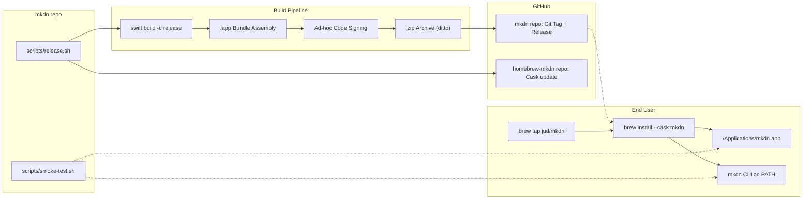
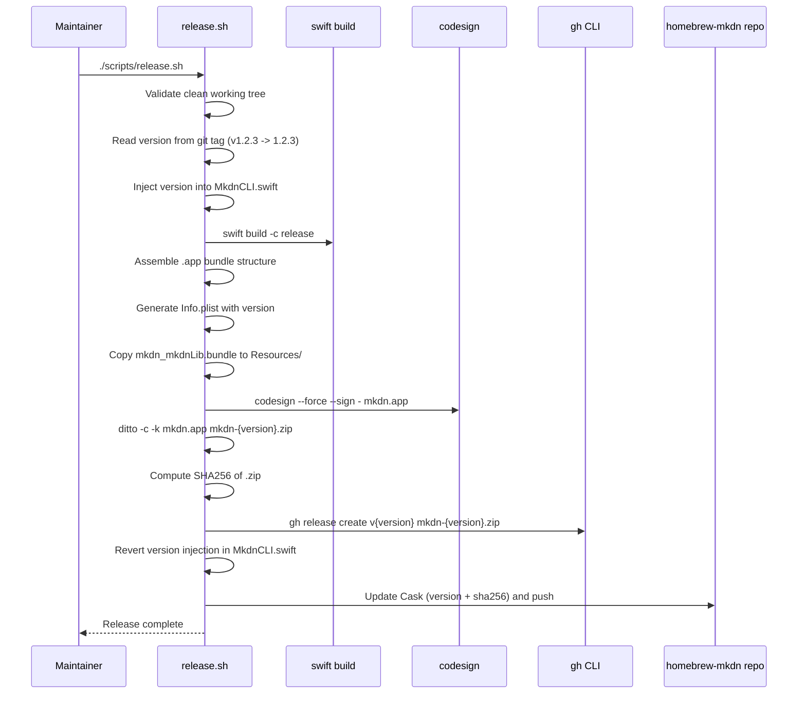

# Technical Design: Homebrew Distribution

**Feature ID**: homebrew-distribution
**Version**: 1.0.0
**Created**: 2026-02-06
**Status**: Draft

## 1. Design Overview

This feature introduces a release pipeline and Homebrew distribution mechanism for mkdn. It consists of four deliverables: (1) a release shell script that builds a .app bundle from SPM output, signs it, archives it, and publishes a GitHub Release; (2) a Homebrew tap repository (`jud/homebrew-mkdn`) with a Cask definition; (3) a version injection mechanism so the build embeds the Git tag version; and (4) a smoke test script for post-release verification.

All artifacts are shell scripts and Ruby DSL (Cask definition) -- no Swift code changes are needed beyond a minor version string update in `MkdnCLI.swift`.

### High-Level Architecture



## 2. Architecture

### 2.1 .app Bundle Structure

The release script assembles the following directory structure from `swift build -c release` output:

```
mkdn.app/
  Contents/
    Info.plist                    (generated by release script)
    MacOS/
      mkdn                       (binary from .build/arm64-apple-macosx/release/mkdn)
    Resources/
      mkdn_mkdnLib.bundle/       (SPM resource bundle, contains mermaid.min.js)
```

**Critical detail**: The MermaidRenderer uses `Bundle.module` (SPM's generated accessor), NOT `Bundle.main`. SPM's `Bundle.module` implementation searches for the `mkdn_mkdnLib.bundle` directory relative to the main executable and the main bundle's `Resources/` directory. By placing the entire SPM resource bundle at `Contents/Resources/mkdn_mkdnLib.bundle/`, the existing `Bundle.module` accessor resolves correctly without any Swift code changes.

### 2.2 Release Pipeline Sequence



### 2.3 Homebrew Tap Structure

```
jud/homebrew-mkdn/           (GitHub repository)
  Casks/
    mkdn.rb                   (Cask definition)
  README.md                   (tap description)
```

## 3. Detailed Design

### 3.1 Release Script (`scripts/release.sh`)

A single Bash script that orchestrates the entire release process. The script is designed to be idempotent -- if a release for the same tag already exists, it exits cleanly without creating duplicates.

**Pre-flight checks:**
1. Verify `gh` CLI is installed and authenticated
2. Verify working tree is clean (`git diff --quiet && git diff --cached --quiet`)
3. Verify current commit has a tag matching `v*` pattern
4. Extract version string (strip `v` prefix)

**Build phase:**
1. Inject version into `mkdn/Core/CLI/MkdnCLI.swift` (replace the hardcoded version string using `sed`)
2. Run `swift build -c release --arch arm64`
3. Revert the version injection (`git checkout -- mkdn/Core/CLI/MkdnCLI.swift`)

**Bundle assembly phase:**
1. Create directory structure: `build/mkdn.app/Contents/{MacOS,Resources}`
2. Copy binary: `.build/arm64-apple-macosx/release/mkdn` to `Contents/MacOS/mkdn`
3. Copy SPM resource bundle: `.build/arm64-apple-macosx/release/mkdn_mkdnLib.bundle` to `Contents/Resources/mkdn_mkdnLib.bundle`
4. Generate `Contents/Info.plist` with version from git tag

**Signing phase:**
1. `codesign --force --sign - --deep mkdn.app`
2. Verify: `codesign --verify --deep --strict mkdn.app`

**Archive phase:**
1. `ditto -c -k --keepParent mkdn.app mkdn-{version}.zip`
2. Compute SHA256: `shasum -a 256 mkdn-{version}.zip`

**Publish phase:**
1. Check if release already exists: `gh release view v{version}` (idempotency)
2. Create release: `gh release create v{version} mkdn-{version}.zip --title "mkdn v{version}" --generate-notes`
3. Clone/update tap repo, update Cask definition with new version and SHA256
4. Commit and push tap repo

**Error handling:**
- Each phase checks exit codes and prints clear error messages
- `set -euo pipefail` at script top
- Cleanup function via `trap` removes temporary build artifacts on failure
- Version injection in MkdnCLI.swift is reverted even on failure (via trap)

### 3.2 Info.plist Generation

The release script generates Info.plist as a heredoc. No template file is needed -- the script writes it directly.

Required keys:

| Key | Value | Source |
|-----|-------|--------|
| `CFBundleIdentifier` | `com.jud.mkdn` | Hardcoded |
| `CFBundleName` | `mkdn` | Hardcoded |
| `CFBundleDisplayName` | `mkdn` | Hardcoded |
| `CFBundleExecutable` | `mkdn` | Hardcoded |
| `CFBundlePackageType` | `APPL` | Hardcoded |
| `CFBundleShortVersionString` | `{version}` | Git tag |
| `CFBundleVersion` | `{version}` | Git tag |
| `LSMinimumSystemVersion` | `14.0` | Package.swift platform |
| `NSHighResolutionCapable` | `true` | macOS best practice |
| `NSPrincipalClass` | `NSApplication` | Required for SwiftUI apps |

### 3.3 Version Injection

The current `MkdnCLI.swift` has a hardcoded version:

```swift
public static let configuration = CommandConfiguration(
    commandName: "mkdn",
    abstract: "A Mac-native Markdown viewer.",
    version: "1.0.0"
)
```

**Approach**: The release script uses `sed` to replace the version string before building, then reverts it after the build completes. The replacement targets the specific pattern `version: "X.Y.Z"` in MkdnCLI.swift.

```bash
sed -i '' "s/version: \"[0-9]*\.[0-9]*\.[0-9]*\"/version: \"${VERSION}\"/" \
    mkdn/Core/CLI/MkdnCLI.swift
```

The revert happens via `git checkout -- mkdn/Core/CLI/MkdnCLI.swift` and is registered as a trap handler to ensure it runs even on script failure.

### 3.4 Cask Definition (`Casks/mkdn.rb`)

```ruby
cask "mkdn" do
  version "1.0.0"
  sha256 "PLACEHOLDER_SHA256"

  url "https://github.com/jud/mkdn/releases/download/v#{version}/mkdn-#{version}.zip"
  name "mkdn"
  desc "Mac-native Markdown viewer with Mermaid diagram support"
  homepage "https://github.com/jud/mkdn"

  depends_on macos: ">= :sonoma"

  app "mkdn.app"
  binary "#{appdir}/mkdn.app/Contents/MacOS/mkdn"

  zap trash: []
end
```

Key design decisions:
- `binary` stanza creates a symlink in `/opt/homebrew/bin/` (or `/usr/local/bin/`) pointing to the binary inside the .app. This is the standard Homebrew mechanism and handles PATH availability.
- `depends_on macos: ">= :sonoma"` maps to macOS 14.0+ (the project's minimum deployment target).
- No `zap` entries needed -- mkdn does not write preferences files or caches outside the .app bundle.

### 3.5 Smoke Test Script (`scripts/smoke-test.sh`)

A simple script that runs the FR-10 verification checklist and reports pass/fail for each step:

```
1. brew tap jud/mkdn
2. brew install --cask mkdn
3. which mkdn (verify PATH)
4. mkdn --help (verify output)
5. open -a mkdn (verify GUI launch)
6. brew uninstall --cask mkdn (verify clean removal)
7. which mkdn (verify symlink removed)
```

Each step prints a clear PASS/FAIL and the script exits with a non-zero code if any step fails.

### 3.6 Bundle.module Resolution Path

SPM generates a `resource_bundle_accessor.swift` file for the `mkdnLib` target that implements `Bundle.module`. The generated code searches for `mkdn_mkdnLib.bundle` in these locations (in order):

1. `Bundle.main.resourceURL` (i.e., `mkdn.app/Contents/Resources/`)
2. The directory containing the executable
3. The current working directory

By placing `mkdn_mkdnLib.bundle` at `mkdn.app/Contents/Resources/mkdn_mkdnLib.bundle/`, the first search path succeeds. The `mermaid.min.js` file lives inside this bundle at its root, exactly as SPM placed it during build.

**No Swift code changes are needed** for resource resolution.

## 4. Technology Stack

| Component | Technology | Rationale |
|-----------|-----------|-----------|
| Release script | Bash | Standard macOS shell; all tools (swift, codesign, ditto, gh, sed) are CLI commands |
| Build system | SPM (`swift build`) | Existing build system; no xcodebuild needed |
| Code signing | `codesign` (ad-hoc) | macOS built-in; minimum viable for personal use |
| Archive format | .zip via `ditto` | Preserves macOS extended attributes and code signatures |
| GitHub operations | `gh` CLI | Standard GitHub CLI; handles auth, releases, uploads |
| Package manager | Homebrew Cask | Target distribution channel per project charter |
| Cask definition | Ruby DSL | Homebrew's native DSL; no alternatives exist |

## 5. Implementation Plan

### T1: Version Injection Mechanism

**Scope**: Modify the release workflow to inject the Git tag version into `MkdnCLI.swift` at build time.

**Details**:
- The `sed` command in the release script handles this
- No new files; this is logic within `scripts/release.sh`
- Includes revert-on-failure via `trap`

**Files**: Part of `scripts/release.sh`

### T2: Cask Definition Template

**Scope**: Create the initial Cask definition file for the homebrew-mkdn tap repository.

**Details**:
- Create `Casks/mkdn.rb` with placeholder version and SHA256
- The release script will update these values on each release
- Verify with `brew audit --cask mkdn` after tap is set up

**Files**: `Casks/mkdn.rb` (in `homebrew-mkdn` repo)

### T3: Smoke Test Script

**Scope**: Create a post-release verification script.

**Details**:
- Bash script with sequential checks
- Each check prints status and continues
- Summary at end with overall pass/fail

**Files**: `scripts/smoke-test.sh`

### T4: Release Script

**Scope**: The main orchestrator that builds, bundles, signs, archives, and publishes.

**Details**:
- Pre-flight validation (clean tree, git tag, gh auth)
- Version injection (T1 logic embedded here)
- SPM release build
- .app bundle assembly (directory structure, binary copy, resource bundle copy, Info.plist generation)
- Ad-hoc code signing with verification
- Archive via ditto
- GitHub Release creation with asset upload
- Tap repository Cask update (version + SHA256)
- Cleanup and revert

**Files**: `scripts/release.sh`

### T5: Tap Repository Setup

**Scope**: Create the `jud/homebrew-mkdn` GitHub repository with the correct structure.

**Details**:
- Manual one-time setup (documented in release script comments)
- `gh repo create jud/homebrew-mkdn --public`
- Initialize with `Casks/` directory containing `mkdn.rb` from T2

**Files**: External repository (one-time manual setup, documented in release script)

## 6. Implementation DAG

**Parallel Groups** (tasks with no inter-dependencies):

1. [T2, T3] - Cask template and smoke test script are independent; neither reads from or writes to the other
2. [T4] - Release script integrates version injection (T1) logic and references the Cask format from T2
3. [T5] - Tap repo setup depends on the Cask definition from T2

Note: T1 (version injection) is not a separate task -- it is embedded logic within T4 (the release script). The sed replacement is a dozen lines of bash, not a standalone component.

**Dependencies**:

- T4 -> T2 (interface: release script must update the Cask file in the format defined by T2)
- T5 -> T2 (data: tap repository must contain the Cask file created in T2)

**Critical Path**: T2 -> T4

## 7. Testing Strategy

### Test Value Assessment

This feature is primarily infrastructure (shell scripts, configuration files). Traditional unit tests provide little value here. Testing focuses on integration verification.

| Test | Type | Value | Rationale |
|------|------|-------|-----------|
| .app bundle structure validation | Integration (manual/script) | HIGH | Verifies the bundle assembly produces a valid macOS app |
| Bundle.module resource resolution | Integration (manual) | HIGH | App-specific: confirms mermaid.min.js loads from installed .app |
| Cask audit | Linting (`brew audit --cask`) | HIGH | Verifies Cask definition follows Homebrew conventions |
| Full install/launch/uninstall cycle | End-to-end (smoke-test.sh) | HIGH | The only test that confirms the entire distribution pipeline works |
| Release script idempotency | Manual | MEDIUM | Verifies re-running for same tag does not create duplicates |

**Tests NOT designed** (low value):
- Unit tests for the bash release script (testing bash with bash is fragile and low-signal)
- Testing `codesign`, `ditto`, `gh` behaviors (external tool verification)
- Testing Homebrew Cask install mechanics (framework behavior)

### Verification Approach

1. **Pre-release**: After implementing T4, run the release script with a test tag (e.g., `v0.0.1-test`) on a non-main branch. Verify .app launches, Mermaid works, CLI works.
2. **Post-release**: Run `scripts/smoke-test.sh` to confirm the full Homebrew install cycle.
3. **Cask validation**: Run `brew audit --cask mkdn` against the tap to catch DSL issues.

## 8. Deployment Design

This feature IS the deployment mechanism. There is no separate deployment concern.

**Release flow**:
1. Maintainer commits changes, runs tests locally
2. Maintainer creates a Git tag: `git tag v1.2.3`
3. Maintainer runs: `./scripts/release.sh`
4. Script produces GitHub Release with .zip asset and updates tap
5. Users install/upgrade: `brew upgrade --cask mkdn`

**Rollback**: Delete the GitHub Release and tag. The previous Cask version remains functional since old release assets are still available.

## 9. Documentation Impact

| Type | Target | Section | KB Source | Rationale |
|------|--------|---------|-----------|-----------|
| add | `.rp1/context/modules.md` | Scripts section | `modules.md` | Document new scripts/release.sh and scripts/smoke-test.sh |
| edit | `.rp1/context/index.md` | Quick Reference | `index.md` | Add scripts/ directory to quick reference |
| edit | `CLAUDE.md` | Build/Test Commands | N/A | Add release command documentation |

## 10. Design Decisions Log

| ID | Decision | Choice | Rationale | Alternatives Considered |
|----|----------|--------|-----------|------------------------|
| D1 | Build method | `swift build -c release` + manual .app assembly | Avoids xcodebuild dependency; SPM is the existing build system; .app is just a directory structure | xcodebuild (heavier, requires .xcodeproj generation) |
| D2 | Resource embedding | Copy entire `mkdn_mkdnLib.bundle` into .app Resources/ | Preserves SPM's Bundle.module resolution without Swift code changes | Copy mermaid.min.js directly (breaks Bundle.module accessor) |
| D3 | Version injection | sed replacement in MkdnCLI.swift at build time | Simple, no new dependencies, works with existing ArgumentParser version display | Build-time environment variable (SPM doesn't support well), separate version file (adds complexity) |
| D4 | Release script language | Bash | All required tools (swift, codesign, ditto, gh, sed) are CLI commands; Bash is the natural glue | Python (overkill), Swift script (adds compilation step), Makefile (less readable for this workflow) |
| D5 | CLI symlink mechanism | Homebrew Cask `binary` stanza | Standard Homebrew pattern; many casks use this for .app-bundled CLIs | Wrapper shell script (unnecessary indirection), post-install hook (non-standard) |
| D6 | Archive tool | ditto -c -k | Apple's recommended tool for preserving macOS extended attributes and code signatures in .zip | zip command (strips extended attributes, can break code signatures) |
| D7 | Tap repo update | Release script clones/pulls tap repo, updates Cask, commits, pushes | Fully automated single-command release; no manual Cask editing | Manual Cask update (error-prone), GitHub Actions (out of scope) |
| D8 | Version in MkdnCLI.swift | Keep hardcoded default, replace at build time | Minimal codebase change; version string is only used by ArgumentParser --version flag | Dynamic version from Bundle.main.infoDictionary (would require Swift code changes and .app-only runtime resolution) |
