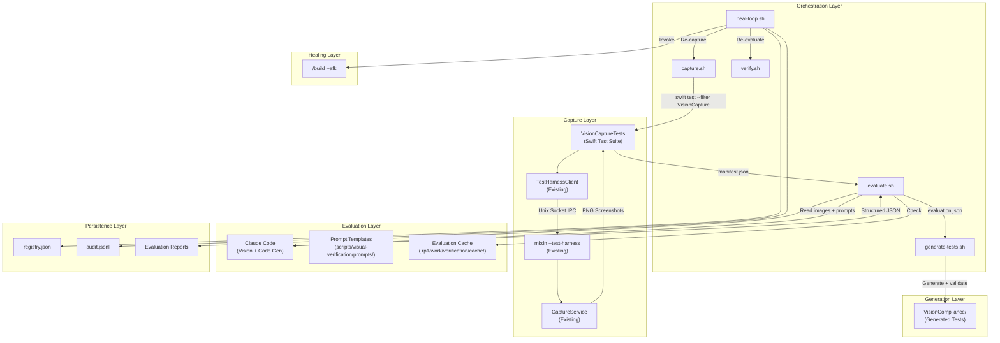
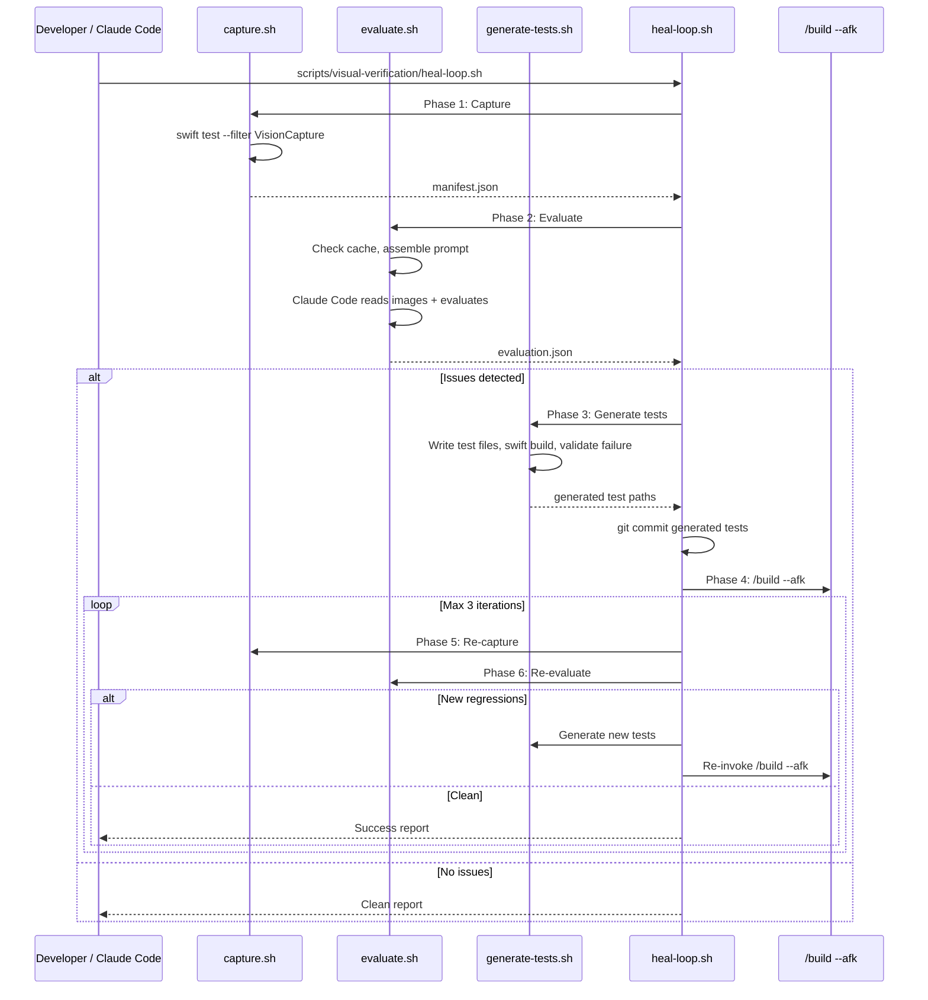

# Technical Design: LLM Visual Verification

**Feature ID**: llm-visual-verification
**Version**: 2.0.0
**Status**: Draft
**Created**: 2026-02-09
**Revised**: 2026-02-09 (v2: shell script orchestration replaces rp1 skill file)

## 1. Design Overview

This design specifies an autonomous design compliance workflow that uses Claude Code's built-in vision capabilities to evaluate mkdn's rendered output against the project's design specifications, detect visual deviations, generate failing tests that encode those deviations, invoke `/build --afk` to fix them, and re-verify the result. The workflow operates entirely outside the mkdn application -- it is developer tooling that orchestrates existing infrastructure without modifying mkdn's source architecture.

The system has three implementation layers:

1. **Shell scripts** (in `scripts/visual-verification/`): Bash scripts that orchestrate each phase of the workflow -- capture, evaluate, generate tests, heal, and verify. These are the primary entry points, invoked directly by Claude Code or the human developer via Bash.
2. **Swift test infrastructure** (in `mkdnTests/`): A capture orchestrator test suite that uses the existing test harness to produce deterministic screenshots, and a VisionCompliance test directory where generated tests live.
3. **CLAUDE.md documentation**: Instructions added to the project's CLAUDE.md that tell Claude Code how to invoke the verification workflow.

Prompt templates live in `scripts/visual-verification/prompts/` alongside the orchestration scripts. Persistent state (cache, registry, audit trail, reports) lives in `.rp1/work/verification/`. No rp1 skill plugin infrastructure is used.

### High-Level Architecture



## 2. Architecture

### 2.1 System Layers

| Layer | Location | Responsibility |
|-------|----------|----------------|
| Orchestration | `scripts/visual-verification/` | Bash scripts: each phase is a standalone script that can be run independently or chained |
| Capture | `mkdnTests/UITest/VisionCompliance/VisionCaptureTests.swift` | Deterministic screenshot capture using existing test harness |
| Evaluation | Claude Code + `scripts/visual-verification/prompts/` | Vision evaluation of screenshots against PRD specifications |
| Persistence | `.rp1/work/verification/` | Cache, registry, audit trail, reports |
| Documentation | `CLAUDE.md` | Instructions for invoking the workflow |

### 2.2 Script Orchestration Flow

Each script is a self-contained phase. The scripts can be run individually for debugging or chained by `heal-loop.sh` for the full autonomous loop.



### 2.3 Component Responsibilities

| Component | Type | Responsibility |
|-----------|------|----------------|
| `capture.sh` | Shell Script | Build mkdn, run capture test suite, validate manifest output |
| `evaluate.sh` | Shell Script | Assemble evaluation context from prompts + PRDs, check cache, invoke Claude Code for vision evaluation, write evaluation report |
| `generate-tests.sh` | Shell Script | Read evaluation report, generate Swift test files from issue data, validate compilation and failure, stage for commit |
| `heal-loop.sh` | Shell Script | Top-level orchestrator: chain capture -> evaluate -> generate -> fix -> verify with bounded iteration |
| `verify.sh` | Shell Script | Re-capture + re-evaluate after a fix, compare against previous evaluation, detect regressions |
| `VisionCaptureTests.swift` | Swift Test Suite | Capture screenshots of all fixtures across themes/modes, write manifest |
| `VisionCapturePRD.swift` | Swift Test Support | Harness singleton, fixture paths, capture helpers, manifest writing |
| `VisionCompliancePRD.swift` | Swift Test Support | Shared harness for generated tests, fixture paths, extraction helpers |
| `evaluation-prompt.md` | Prompt Template | Base prompt template for vision evaluation |
| `prd-context-*.md` | Prompt Templates | PRD excerpt templates for evaluation context |
| `output-schema.json` | Schema | Evaluation output JSON schema |
| `test-template-*.md` | Templates | Patterns for generated Swift test files |
| `manifest.json` | JSON Artifact | Manifest of captured screenshots with metadata |
| `registry.json` | JSON Artifact | Persistent regression registry |
| `audit.jsonl` | JSON Lines | Audit trail of all operations |
| `{timestamp}-evaluation.json` | JSON Report | Per-run evaluation report |
| `{timestamp}-escalation.json` | JSON Report | Human escalation report (when needed) |

## 3. Detailed Design

### 3.1 Shell Script Conventions

All scripts follow the existing `scripts/` conventions established by `release.sh` and `smoke-test.sh`:

```bash
#!/usr/bin/env bash
set -euo pipefail

SCRIPT_DIR="$(cd "$(dirname "${BASH_SOURCE[0]}")" && pwd)"
PROJECT_ROOT="$(cd "${SCRIPT_DIR}/../.." && pwd)"
VERIFICATION_DIR="${PROJECT_ROOT}/.rp1/work/verification"
```

Each script:
- Uses `set -euo pipefail` for strict error handling
- Resolves `PROJECT_ROOT` from `SCRIPT_DIR` for absolute path construction
- Logs progress with `info()` and errors with `error()` helper functions
- Returns exit code 0 on success, non-zero on failure
- Accepts configuration via command-line flags (e.g., `--dry-run`, `--max-iterations 3`)
- Writes structured output to files in `.rp1/work/verification/` rather than relying on stdout parsing

### 3.2 capture.sh

**Purpose**: Build mkdn and run the capture orchestrator test suite to produce deterministic screenshots.

**Usage**:
```bash
scripts/visual-verification/capture.sh [--skip-build]
```

**Behavior**:
1. Build mkdn: `swift build --product mkdn` (skipped with `--skip-build`)
2. Run capture suite: `swift test --filter VisionCapture 2>&1`
3. Validate manifest: check `.rp1/work/verification/captures/manifest.json` exists and has entries
4. Exit 0 if manifest is valid, exit 1 on any failure

**Output**: Screenshots in `.rp1/work/verification/captures/` and a `manifest.json`.

The script itself does not interact with the test harness directly -- it delegates to the Swift test suite which has access to `TestHarnessClient` and `AppLauncher`.

### 3.3 evaluate.sh

**Purpose**: Assemble evaluation context from prompt templates and PRD files, check the cache, and invoke Claude Code for vision evaluation.

**Usage**:
```bash
scripts/visual-verification/evaluate.sh [--dry-run] [--batch-size 4]
```

**Behavior**:
1. Read `manifest.json` from captures directory
2. Compute cache key: SHA-256 of (sorted image hashes from manifest + prompt template hash + PRD file hashes)
3. Check cache: if `.rp1/work/verification/cache/{cacheKey}.json` exists, copy it as the evaluation result and exit
4. Assemble evaluation prompt:
   - Read charter design philosophy from `.rp1/context/charter.md`
   - Read relevant PRD excerpts from prompt templates in `scripts/visual-verification/prompts/`
   - Read evaluation criteria from `evaluation-prompt.md`
   - Read output schema from `output-schema.json`
   - Concatenate into a single assembled prompt file at `.rp1/work/verification/current-prompt.md`
5. Group captures into batches by fixture (same fixture, both themes = 1 batch)
6. If `--dry-run`: write dry-run report and exit
7. For each batch:
   - Write a batch-specific prompt file that includes the assembled prompt + image file paths
   - The actual vision evaluation is performed by Claude Code reading the prompt and images
   - Claude Code writes the evaluation result as JSON
8. Merge batch results into a single evaluation report at `.rp1/work/verification/reports/{timestamp}-evaluation.json`
9. Populate cache entry
10. Append audit trail entry

**How Claude Code performs the evaluation**: The `evaluate.sh` script prepares all context files and writes a structured task description to `.rp1/work/verification/current-evaluation-task.md`. This task file instructs Claude Code (via CLAUDE.md documentation) to:
- Read the assembled prompt
- Read each screenshot image in the batch
- Evaluate the images against the specifications
- Write structured JSON output to a designated path

The script then reads that JSON output and proceeds.

**Cache Key Computation**:
```bash
# Compute SHA-256 for each input file, sort, and hash the concatenation
IMAGE_HASHES=$(cat manifest.json | jq -r '.captures[].imageHash' | sort)
PROMPT_HASH=$(shasum -a 256 prompts/evaluation-prompt.md | awk '{print $1}')
PRD_HASHES=$(shasum -a 256 ${PROJECT_ROOT}/.rp1/work/prds/spatial-design-language.md \
    ${PROJECT_ROOT}/.rp1/work/prds/terminal-consistent-theming.md \
    ... | awk '{print $1}' | sort)
CACHE_KEY=$(echo "${IMAGE_HASHES}${PROMPT_HASH}${PRD_HASHES}" | shasum -a 256 | awk '{print $1}')
```

### 3.4 generate-tests.sh

**Purpose**: Read the evaluation report and generate Swift Testing test files for each medium/high confidence issue.

**Usage**:
```bash
scripts/visual-verification/generate-tests.sh [evaluation-report-path]
```

**Behavior**:
1. Read the evaluation report JSON
2. Filter issues: only `confidence: "medium"` or `confidence: "high"`
3. For each qualifying issue:
   a. Determine test type (spatial, visual, qualitative) from the issue data
   b. Read the appropriate test template from `scripts/visual-verification/prompts/test-template-{type}.md`
   c. Generate a Swift test file using Claude Code: the script writes a generation task file that includes the issue details, the test template, and the target file path. Claude Code reads this and writes the Swift file.
   d. Run `swift build` to validate compilation. If it fails, discard the file and log to audit.
   e. Run `swift test --filter {testName}` to validate the test currently fails. If it passes, discard (false positive) and log.
4. Write a generation summary to stdout listing generated test paths
5. Append audit trail entries for each generation attempt (success or failure)

**Generated Test Naming Convention**: `VisionDetected_{PRD}_{FR}_{aspect}.swift`

Example: `VisionDetected_spatialDesignLanguage_FR3_h1SpaceAbove.swift`

**Atomic Staging**: Tests are written to a staging directory first (`.rp1/work/verification/staging/`), validated, and only then moved to `mkdnTests/UITest/VisionCompliance/`. This prevents partial or broken test files from entering the codebase.

### 3.5 heal-loop.sh

**Purpose**: Top-level orchestrator that runs the full capture-evaluate-generate-fix-verify loop with bounded iteration.

**Usage**:
```bash
scripts/visual-verification/heal-loop.sh [--max-iterations 3] [--dry-run] [--attended] [--skip-build]
```

**Behavior**:
```
iteration = 0
max_iterations = $MAX_ITERATIONS (default 3)

# Phase 1: Initial capture + evaluate
capture.sh
evaluate.sh
issues = parse evaluation report

if no issues:
    write clean report
    exit 0

while iteration < max_iterations and issues exist:
    iteration++

    # Phase 2: Generate failing tests
    generate-tests.sh evaluation-report.json
    generated_tests = parse generation summary

    if no tests generated (all discarded):
        write escalation report (all issues low-confidence or failed validation)
        exit 0

    # Phase 3: Commit + fix
    git add mkdnTests/UITest/VisionCompliance/
    git commit -m "test: vision-detected failing tests for {PRD refs}"
    invoke /build --afk with test paths and PRD context

    # Phase 4: Re-verify
    verify.sh
    issues = parse re-verification report

    update registry
    append audit trail

if issues remain:
    write escalation report
    exit 1
else:
    write success report
    exit 0
```

**Attended Mode** (`--attended`): When set, escalation points prompt Claude Code interactively (via stdout/stdin) rather than writing a report file. The script outputs the escalation context and waits for input.

**Iteration State**: Tracked in `.rp1/work/verification/current-loop.json`:

```json
{
  "loopId": "loop-2026-02-09-180000",
  "maxIterations": 3,
  "currentIteration": 1,
  "startedAt": "2026-02-09T18:00:00Z",
  "iterations": [
    {
      "iteration": 1,
      "evaluationId": "eval-2026-02-09-180000",
      "issuesDetected": 3,
      "testsGenerated": 2,
      "buildResult": "success",
      "reVerification": {
        "resolvedIssues": ["ISS-001", "ISS-002"],
        "newRegressions": ["ISS-004"],
        "remainingIssues": ["ISS-003"]
      }
    }
  ]
}
```

### 3.6 verify.sh

**Purpose**: Re-capture screenshots and re-evaluate after a fix, comparing against the previous evaluation to detect regressions.

**Usage**:
```bash
scripts/visual-verification/verify.sh [previous-evaluation-path]
```

**Behavior**:
1. Run `capture.sh --skip-build` (mkdn was already rebuilt by /build --afk)
2. Run `evaluate.sh` (forces fresh evaluation, bypasses cache since images changed)
3. Compare new evaluation against previous evaluation:
   - Issues present in previous but absent in new = resolved
   - Issues absent in previous but present in new = regression
   - Issues present in both = remaining
4. Write re-verification report
5. Update registry with resolution status

### 3.7 Capture Orchestrator (Swift)

**Files**: `mkdnTests/UITest/VisionCompliance/VisionCaptureTests.swift`, `mkdnTests/UITest/VisionCompliance/VisionCapturePRD.swift`

The capture orchestrator is a Swift Testing suite that uses the existing test harness to produce deterministic screenshots. It follows the same patterns as SpatialComplianceTests, VisualComplianceTests, and AnimationComplianceTests.

**Capture Matrix**:

| Dimension | Values |
|-----------|--------|
| Fixtures | `canonical.md`, `theme-tokens.md`, `mermaid-focus.md`, `geometry-calibration.md` |
| Themes | `solarizedDark`, `solarizedLight` |
| Modes | `previewOnly` |

Side-by-side mode is excluded from the initial capture matrix because it introduces editor pane variability. Preview-only mode captures the pure rendering output.

**Capture Output**: Screenshots are saved to `.rp1/work/verification/captures/` with deterministic naming:

```
{fixture}-{theme}-{mode}.png
```

Example: `canonical-solarizedDark-previewOnly.png`

**Manifest Output**: A manifest file at `.rp1/work/verification/captures/manifest.json` records metadata for each capture:

```json
{
  "captureTimestamp": "2026-02-09T18:00:00Z",
  "captures": [
    {
      "id": "canonical-solarizedDark-previewOnly",
      "imagePath": ".rp1/work/verification/captures/canonical-solarizedDark-previewOnly.png",
      "fixture": "canonical.md",
      "theme": "solarizedDark",
      "viewMode": "previewOnly",
      "width": 1600,
      "height": 1200,
      "scaleFactor": 2.0,
      "imageHash": "sha256:abcdef..."
    }
  ]
}
```

**Harness Pattern**: Follows the existing shared-harness singleton pattern:

```swift
enum VisionCaptureHarness {
    nonisolated(unsafe) static var launcher: AppLauncher?
    nonisolated(unsafe) static var client: TestHarnessClient?

    static func ensureRunning() async throws -> TestHarnessClient {
        if let existing = client {
            let pong = try await existing.ping()
            if pong.status == "ok" { return existing }
        }
        let newLauncher = AppLauncher()
        let newClient = try await newLauncher.launch(buildFirst: false)
        launcher = newLauncher
        client = newClient
        return newClient
    }
}
```

**Suite Structure**:

```swift
@Suite("VisionCapture", .serialized)
struct VisionCaptureTests {
    @Test("Capture all fixtures for vision verification")
    func captureAllFixtures() async throws {
        let client = try await VisionCaptureHarness.ensureRunning()
        let outputDir = visionCaptureOutputDir()
        var captures: [CaptureManifestEntry] = []

        for fixture in VisionCaptureConfig.fixtures {
            for theme in VisionCaptureConfig.themes {
                _ = try await client.setTheme(theme)
                let loadResp = try await client.loadFile(
                    path: visionFixturePath(fixture)
                )
                guard loadResp.status == "ok" else { continue }
                try await Task.sleep(for: .milliseconds(1_500))

                let captureId = "\(fixture.stem)-\(theme)-previewOnly"
                let outputPath = "\(outputDir)/\(captureId).png"
                let captureResp = try await client.captureWindow(
                    outputPath: outputPath
                )
                // Extract result, compute hash, append to manifest
            }
        }
        // Write manifest.json
    }
}
```

The 1500ms sleep after loadFile matches the existing VisualComplianceTests pattern, accounting for the entrance animation (staggerCap 0.5s + fadeIn 0.5s + cleanup 0.1s = 1.1s, rounded up to 1.5s).

### 3.8 Evaluation Prompt Construction

The evaluation prompt is constructed deterministically from three sources:

1. **Charter design philosophy** (`.rp1/context/charter.md`, "Design Philosophy" section)
2. **PRD excerpts** (relevant PRD functional requirements from `.rp1/work/prds/`)
3. **Evaluation criteria** (structured criteria from the prompt template)

**Prompt Template** (`scripts/visual-verification/prompts/evaluation-prompt.md`):

```markdown
## Design Evaluation Context

### Design Philosophy (from Project Charter)

{charter_design_philosophy}

### Design Specifications

{prd_excerpts}

### Evaluation Criteria

Evaluate each screenshot against the following criteria:

1. **Concrete PRD Compliance**: Does the rendering match the specific functional
   requirements listed in the PRD excerpts? Check spacing, colors, layout,
   typography, and component rendering against the documented specifications.

2. **Spatial Rhythm and Balance**: Is the vertical spacing between elements
   consistent and rhythmic? Do the margins, padding, and inter-element gaps
   create a balanced visual hierarchy?

3. **Theme Coherence**: Are all colors consistent with the active theme? Is
   there sufficient contrast between text and background? Do code blocks,
   headings, and body text use the correct theme colors?

4. **Visual Consistency**: Are similar elements rendered consistently? Do all
   headings of the same level look the same? Are code blocks uniform?

5. **Overall Rendering Quality**: Does the rendering "look right" according
   to the design philosophy of obsessive sensory attention? Would this be
   acceptable for daily-driver use?

### Output Format

For each detected issue, respond with this JSON structure:

{output_schema}
```

**PRD Excerpt Selection**: The prompt includes excerpts from PRDs relevant to the captures being evaluated:

| Capture Fixture | Relevant PRDs |
|-----------------|---------------|
| `canonical.md` | spatial-design-language, cross-element-selection |
| `theme-tokens.md` | terminal-consistent-theming, syntax-highlighting |
| `mermaid-focus.md` | mermaid-rendering |
| `geometry-calibration.md` | spatial-design-language |

**Determinism**: The prompt is constructed from file contents that are version-controlled. The same git state produces the same prompt. No timestamps, random values, or external state are included in the prompt.

### 3.9 Evaluation Output Schema

Each evaluation produces a structured JSON result:

```json
{
  "evaluationId": "eval-2026-02-09-180000",
  "promptHash": "sha256:...",
  "captures": [
    {
      "captureId": "canonical-solarizedDark-previewOnly",
      "imageHash": "sha256:..."
    }
  ],
  "issues": [
    {
      "issueId": "ISS-001",
      "captureId": "canonical-solarizedDark-previewOnly",
      "prdReference": "spatial-design-language FR-3",
      "specificationExcerpt": "H1 headings have 48pt space above",
      "observation": "The space above the H1 heading appears to be approximately 24pt, roughly half the specified value",
      "deviation": "Space above H1 heading is 24pt instead of the specified 48pt",
      "severity": "major",
      "confidence": "high",
      "suggestedAssertion": {
        "type": "spatial",
        "metric": "h1SpaceAbove",
        "expected": 48,
        "tolerance": 2
      }
    }
  ],
  "qualitativeFindings": [
    {
      "findingId": "QF-001",
      "captureId": "canonical-solarizedDark-previewOnly",
      "reference": "charter:design-philosophy",
      "observation": "The spacing between the code block and the following paragraph creates an uneven rhythm compared to paragraph-to-paragraph spacing",
      "assessment": "The vertical rhythm is slightly inconsistent -- code blocks create visual breaks that feel heavier than the paragraph flow",
      "severity": "minor",
      "confidence": "medium"
    }
  ],
  "summary": {
    "totalCaptures": 8,
    "issuesDetected": 3,
    "qualitativeFindings": 2,
    "bySeverity": { "critical": 0, "major": 2, "minor": 3 },
    "byConfidence": { "high": 2, "medium": 2, "low": 1 }
  }
}
```

### 3.10 Caching Layer

Evaluation results are cached to avoid redundant API calls for unchanged inputs.

**Cache Key**: SHA-256 hash of (sorted image content hashes + prompt template hash + PRD content hashes).

**Cache Location**: `.rp1/work/verification/cache/{cacheKey}.json`

**Cache Entry Schema**:

```json
{
  "cacheKey": "sha256:...",
  "createdAt": "2026-02-09T18:00:00Z",
  "inputHashes": {
    "images": ["sha256:...", "sha256:..."],
    "promptTemplate": "sha256:...",
    "prdContents": ["sha256:...", "sha256:..."]
  },
  "evaluation": { "...": "full evaluation result" }
}
```

**Cache Invalidation**: A cache entry is invalid when any input hash changes. The script checks the cache before invoking vision evaluation. Cache entries are never updated -- they are replaced when inputs change.

### 3.11 Batching Strategy

Screenshots are grouped into batched evaluation requests to manage API costs.

**Batch Grouping Rules**:

| Rule | Rationale |
|------|-----------|
| Group by fixture | Same fixture across themes evaluates layout consistency |
| Maximum 4 images per batch | Configurable via `--batch-size`; balances context quality vs cost |
| Same fixture, different themes = 1 batch | Enables cross-theme comparison in a single evaluation |
| Different fixtures = separate batches | Each fixture requires different PRD context |

**Default Batch Composition**:

| Batch | Images | PRD Context |
|-------|--------|-------------|
| 1 | canonical-dark, canonical-light | spatial-design-language, cross-element-selection |
| 2 | theme-tokens-dark, theme-tokens-light | terminal-consistent-theming, syntax-highlighting |
| 3 | mermaid-focus-dark, mermaid-focus-light | mermaid-rendering |
| 4 | geometry-calibration-dark, geometry-calibration-light | spatial-design-language |

### 3.12 Test Generation

For each detected issue with medium or high confidence, Claude Code generates a Swift Testing test file in `mkdnTests/UITest/VisionCompliance/`.

**Naming Convention**: `VisionDetected_{PRD}_{FR}_{aspect}.swift`

Example: `VisionDetected_spatialDesignLanguage_FR3_h1SpaceAbove.swift`

**Generated Test Template** (representative pattern from `scripts/visual-verification/prompts/test-template-spatial.md`):

```swift
import CoreGraphics
import Foundation
import Testing

@testable import mkdnLib

/// Vision-detected design compliance test.
///
/// **Source**: LLM visual verification ({evaluationId}, {issueId})
/// **PRD**: {prdReference}
/// **Specification**: "{specificationExcerpt}"
/// **Observation**: {observation}
/// **Generated**: {date}
@Suite("VisionDetected_{prdCamelCase}_{FR}", .serialized)
struct VisionDetected_{prdCamelCase}_{FR}_{aspect} {
    @Test("{prdReference}_{aspect}_visionDetected")
    func {aspect}() async throws {
        let client = try await VisionComplianceHarness.ensureRunning()
        _ = try await client.setTheme("{theme}")

        let loadResp = try await client.loadFile(
            path: visionFixturePath("{fixture}")
        )
        try #require(loadResp.status == "ok", "File load must succeed")
        try await Task.sleep(for: .milliseconds(1_500))

        let captureResp = try await client.captureWindow()
        let capture = try visionExtractCapture(from: captureResp)
        let analyzer = try visionLoadAnalyzer(from: capture)

        // {assertion_logic_specific_to_issue}

        JSONResultReporter.record(TestResult(
            name: "{prdReference}: {aspect} (vision-detected)",
            status: {pass_condition} ? .pass : .fail,
            prdReference: "{prdReference}",
            expected: "{expected}",
            actual: "{actual_expr}",
            imagePaths: [capture.imagePath],
            duration: 0,
            message: nil
        ))
    }
}
```

**Generated Test Rules**:

1. Each generated file contains exactly one `@Suite` with one or more `@Test` methods
2. The suite name follows the pattern `VisionDetected_{prdCamelCase}_{FR}`
3. Each test method name follows `{aspect}_visionDetected`
4. The doc comment includes the evaluation ID, PRD reference, specification text, and observation
5. Tests use the existing harness infrastructure (AppLauncher, TestHarnessClient)
6. Tests use the existing analysis utilities (ImageAnalyzer, SpatialMeasurement, ColorExtractor)
7. Tests record results via `JSONResultReporter` with the PRD reference
8. Tests follow SwiftLint strict mode and SwiftFormat conventions

**Shared Harness for Generated Tests** (`VisionCompliance/VisionCompliancePRD.swift`):

```swift
enum VisionComplianceHarness {
    nonisolated(unsafe) static var launcher: AppLauncher?
    nonisolated(unsafe) static var client: TestHarnessClient?

    static func ensureRunning() async throws -> TestHarnessClient {
        if let existing = client {
            let pong = try await existing.ping()
            if pong.status == "ok" { return existing }
        }
        let newLauncher = AppLauncher()
        let newClient = try await newLauncher.launch(buildFirst: false)
        launcher = newLauncher
        client = newClient
        return newClient
    }
}
```

**Compilation Validation**: `generate-tests.sh` runs `swift build` and verifies the generated tests compile. If compilation fails, the test file is discarded and logged in the audit trail.

**Failure Validation**: After compilation, the script runs `swift test --filter VisionDetected_{name}` and verifies the test actually fails. Tests that pass immediately are discarded (false positive detection).

### 3.13 Self-Healing Loop

The `heal-loop.sh` script orchestrates the full detect-generate-fix-verify cycle. After generating and validating failing tests:

1. **Commit**: `git add mkdnTests/UITest/VisionCompliance/ && git commit -m "test: vision-detected failing tests for {PRD refs}"`
2. **Invoke**: `/build --afk` with context including failing test file paths, PRD references and specification text, vision evaluation observations
3. **Monitor**: Capture `/build --afk` exit status
4. **Re-verify**: If fix succeeded, run `verify.sh` with the previous evaluation as baseline

**Bounded Iteration**: The loop runs a maximum of 3 iterations (configurable via `--max-iterations`). Each iteration:

| Step | Action |
|------|--------|
| 1 | Re-capture screenshots |
| 2 | Re-evaluate with vision |
| 3 | Check: original issues resolved? |
| 4 | Check: new regressions introduced? |
| 5 | If regressions: generate new tests, re-invoke /build --afk |
| 6 | If clean: report success |
| 7 | If max iterations: escalate to human |

### 3.14 Regression Registry

**Location**: `.rp1/work/verification/registry.json`

**Schema**:

```json
{
  "version": 1,
  "entries": [
    {
      "imageHash": "sha256:...",
      "captureId": "canonical-solarizedDark-previewOnly",
      "evaluations": [
        {
          "evaluationId": "eval-2026-02-09-180000",
          "timestamp": "2026-02-09T18:00:00Z",
          "issues": [
            {
              "issueId": "ISS-001",
              "prdReference": "spatial-design-language FR-3",
              "severity": "major",
              "status": "resolved",
              "resolvedAt": "2026-02-09T18:30:00Z",
              "resolvedBy": "loop-2026-02-09-180000 iteration 1"
            }
          ]
        }
      ],
      "lastEvaluated": "2026-02-09T18:30:00Z",
      "lastStatus": "clean"
    }
  ]
}
```

**Regression Detection**: When re-evaluating a capture whose `imageHash` has a registry entry, `verify.sh` compares detected issues against previously-resolved issues. A previously-resolved issue detected again is flagged as a regression with `"status": "regressed"`.

### 3.15 Audit Trail

**Location**: `.rp1/work/verification/audit.jsonl` (JSON Lines format -- one JSON object per line)

**Entry Types**:

```json
{"type": "capture", "timestamp": "...", "captureId": "...", "imageHash": "...", "fixture": "...", "theme": "..."}
{"type": "evaluation", "timestamp": "...", "evaluationId": "...", "promptHash": "...", "captureIds": ["..."], "issueCount": 3, "cached": false}
{"type": "testGeneration", "timestamp": "...", "issueId": "...", "testFile": "...", "compiled": true, "currentlyFails": true}
{"type": "buildInvocation", "timestamp": "...", "loopId": "...", "iteration": 1, "testPaths": ["..."], "prdRefs": ["..."], "result": "success", "filesModified": ["..."]}
{"type": "reVerification", "timestamp": "...", "loopId": "...", "iteration": 1, "resolvedIssues": ["..."], "newRegressions": ["..."], "remainingIssues": ["..."]}
{"type": "escalation", "timestamp": "...", "loopId": "...", "reason": "maxIterationsExhausted", "unresolvedIssues": ["..."]}
```

JSON Lines format is chosen over a single JSON array because it supports append-only writes without read-modify-write cycles, which is important for crash resilience (partial writes do not corrupt the entire log).

### 3.16 Human Escalation

**Trigger Conditions**:

| Condition | Action |
|-----------|--------|
| Low-confidence issue detected | Flag in report, do NOT generate test |
| Max iterations exhausted | Produce escalation report |
| Generated test fails to compile | Discard test, flag in report |
| Generated test passes immediately | Discard test (false positive), flag in report |
| API failure during evaluation | Abort cleanly, produce error report |

**Unattended Mode** (default): Escalation produces a report file at `.rp1/work/verification/reports/{timestamp}-escalation.json`:

```json
{
  "escalationType": "maxIterationsExhausted",
  "loopId": "loop-2026-02-09-180000",
  "iterations": 3,
  "unresolvedIssues": [
    {
      "issueId": "ISS-003",
      "prdReference": "spatial-design-language FR-3",
      "observation": "...",
      "allAttempts": [
        {
          "iteration": 1,
          "testFile": "...",
          "buildResult": "success",
          "stillPresent": true
        }
      ],
      "suggestedNextSteps": [
        "Review the spatial-design-language FR-3 specification for ambiguity",
        "Check if the rendering approach fundamentally conflicts with the 48pt requirement",
        "Consider whether the PRD value needs updating based on implementation constraints"
      ]
    }
  ],
  "lowConfidenceIssues": [
    {
      "issueId": "ISS-005",
      "prdReference": "charter:design-philosophy",
      "observation": "...",
      "reason": "Qualitative judgment with low certainty"
    }
  ]
}
```

**Attended Mode** (`--attended`): When set, `heal-loop.sh` outputs the escalation context to stdout and waits for user input rather than writing a report file. This allows Claude Code (or a human) to provide real-time guidance on ambiguous issues.

### 3.17 Dry-Run Mode

When `heal-loop.sh` is invoked with `--dry-run`:

1. Runs `capture.sh` (screenshots are captured)
2. Runs `evaluate.sh --dry-run` (prompts assembled, cache checked, but no vision calls)
3. Reports what would be evaluated (batch composition, estimated API calls, cache hits)
4. Does NOT generate tests
5. Does NOT invoke /build --afk

**Dry-run output** (written to `.rp1/work/verification/reports/{timestamp}-dryrun.json`):

```json
{
  "dryRun": true,
  "capturesProduced": 8,
  "batchComposition": [
    {"batchId": 1, "captures": ["canonical-dark", "canonical-light"], "cached": false},
    {"batchId": 2, "captures": ["theme-tokens-dark", "theme-tokens-light"], "cached": true}
  ],
  "estimatedApiCalls": 3,
  "cachedBatches": 1,
  "promptPreview": "... first 500 chars of prompt ..."
}
```

### 3.18 Cost Estimation

Before execution, `evaluate.sh` estimates API cost:

| Factor | Estimate |
|--------|----------|
| Images per batch | 2 (same fixture, both themes) |
| Batches per evaluation | 4 (one per fixture) |
| Tokens per evaluation prompt | ~3000 (charter + PRD excerpts + criteria) |
| Vision tokens per image | ~1000 (estimated for screenshot resolution) |
| Re-verification iterations | 0-3 (bounded) |
| Total API calls (full loop, worst case) | 4 batches x 4 iterations = 16 |
| Total API calls (typical, no regressions) | 4 batches x 1 = 4 |

### 3.19 Graceful Degradation

Each script must fail cleanly without leaving partial state:

| Failure Point | Behavior |
|---------------|----------|
| `capture.sh` fails | `heal-loop.sh` aborts; no evaluation attempted; error logged |
| Vision evaluation unavailable | `evaluate.sh` exits non-zero; cached results remain valid; error logged |
| Generated test fails to compile | `generate-tests.sh` discards file; logs to audit; continues with remaining issues |
| /build --afk fails | `heal-loop.sh` logs failure; does not re-invoke; escalates to human |
| Git commit fails | `heal-loop.sh` aborts; cleans up staged files; error logged |
| Registry corruption | `heal-loop.sh` reinitializes registry; warns in report |

**Atomic Operations**: Generated test files are written to `.rp1/work/verification/staging/` first, validated (compile + fail), and only then moved to `mkdnTests/UITest/VisionCompliance/`. This prevents partial test files from entering the codebase.

### 3.20 CLAUDE.md Integration

The following section is added to `CLAUDE.md` to document the visual verification workflow:

```markdown
### Visual Verification Workflow

Scripts in `scripts/visual-verification/` implement an LLM vision-based design compliance workflow.

#### Quick Reference

```bash
# Full autonomous loop (capture, evaluate, generate tests, fix, verify)
scripts/visual-verification/heal-loop.sh

# Dry run (capture + show what would be evaluated, no API calls)
scripts/visual-verification/heal-loop.sh --dry-run

# Individual phases
scripts/visual-verification/capture.sh          # Capture screenshots
scripts/visual-verification/evaluate.sh         # Vision evaluation
scripts/visual-verification/generate-tests.sh   # Generate failing tests
scripts/visual-verification/verify.sh           # Re-verify after fix
```

#### Artifacts

- Captures: `.rp1/work/verification/captures/`
- Reports: `.rp1/work/verification/reports/`
- Registry: `.rp1/work/verification/registry.json`
- Audit: `.rp1/work/verification/audit.jsonl`
- Generated tests: `mkdnTests/UITest/VisionCompliance/`
- Prompt templates: `scripts/visual-verification/prompts/`
```

## 4. Technology Stack

All technologies are already in the project. No new dependencies are introduced.

| Technology | Purpose | Status |
|------------|---------|--------|
| Bash | Shell script orchestration | System (existing `scripts/` pattern) |
| Swift 6 / Swift Testing | Capture orchestrator + generated test files | Existing |
| TestHarnessClient | Screenshot capture orchestration | Existing (mkdnTests/Support/) |
| AppLauncher | App lifecycle management | Existing (mkdnTests/Support/) |
| ImageAnalyzer | Pixel-level assertions in generated tests | Existing (mkdnTests/Support/) |
| SpatialMeasurement | Spatial assertions in generated tests | Existing (mkdnTests/Support/) |
| ColorExtractor | Color assertions in generated tests | Existing (mkdnTests/Support/) |
| JSONResultReporter | Structured test reporting | Existing (mkdnTests/Support/) |
| PRDCoverageTracker | PRD coverage tracking | Existing (mkdnTests/Support/) |
| Claude Code (Vision) | Screenshot evaluation | Available to agent |
| /build --afk | Autonomous code fix pipeline | Existing rp1 workflow |
| Git | Version control for artifacts | Existing |
| shasum | SHA-256 hashing for cache keys | System utility |
| jq | JSON parsing in shell scripts | System utility (standard on macOS) |

## 5. Implementation Plan

### T1: Verification Directory Structure

Create the directory structure and initial files:

- `.rp1/work/verification/` (working directory)
- `.rp1/work/verification/captures/` (screenshot staging)
- `.rp1/work/verification/cache/` (evaluation cache)
- `.rp1/work/verification/reports/` (evaluation reports)
- `.rp1/work/verification/staging/` (test generation staging)
- `.rp1/work/verification/registry.json` (initial empty registry: `{"version": 1, "entries": []}`)
- `scripts/visual-verification/` (orchestration scripts directory)
- `scripts/visual-verification/prompts/` (prompt templates directory)
- `mkdnTests/UITest/VisionCompliance/` (generated test directory)

### T2: Capture Orchestrator (Swift)

Implement the Swift test suite for deterministic screenshot capture:

- `mkdnTests/UITest/VisionCompliance/VisionCaptureTests.swift` -- capture orchestrator test suite
- `mkdnTests/UITest/VisionCompliance/VisionCapturePRD.swift` -- harness singleton, fixture paths, capture helpers, manifest writing, SHA-256 hash computation

Uses existing `AppLauncher`, `TestHarnessClient`, and `CaptureService`. Follows the existing `SpatialHarness`/`VisualHarness`/`AnimationHarness` singleton pattern.

### T3: Prompt Templates

Create the evaluation prompt templates:

- `scripts/visual-verification/prompts/evaluation-prompt.md` -- base evaluation prompt template with placeholders
- `scripts/visual-verification/prompts/prd-context-spatial.md` -- spatial-design-language PRD excerpts for evaluation context
- `scripts/visual-verification/prompts/prd-context-visual.md` -- terminal-consistent-theming + syntax-highlighting PRD excerpts
- `scripts/visual-verification/prompts/prd-context-mermaid.md` -- mermaid-rendering PRD excerpts
- `scripts/visual-verification/prompts/output-schema.json` -- evaluation output JSON schema definition
- `scripts/visual-verification/prompts/test-template-spatial.md` -- template pattern for spatial assertion tests
- `scripts/visual-verification/prompts/test-template-visual.md` -- template pattern for color/theme assertion tests
- `scripts/visual-verification/prompts/test-template-qualitative.md` -- template pattern for qualitative assessment tests

### T4: Shell Scripts -- Capture and Evaluate

Implement the first two orchestration scripts:

- `scripts/visual-verification/capture.sh` -- build mkdn, run capture test suite, validate manifest
- `scripts/visual-verification/evaluate.sh` -- assemble prompt, check cache, coordinate vision evaluation, write report

These two scripts can be tested independently: `capture.sh` produces screenshots, `evaluate.sh` evaluates them.

### T5: Shell Scripts -- Generate and Verify

Implement test generation and re-verification scripts:

- `scripts/visual-verification/generate-tests.sh` -- read evaluation, generate Swift tests, validate compilation + failure
- `scripts/visual-verification/verify.sh` -- re-capture, re-evaluate, compare with previous evaluation

### T6: Shell Script -- Heal Loop

Implement the top-level orchestrator:

- `scripts/visual-verification/heal-loop.sh` -- chain all phases with bounded iteration, handle escalation, manage registry + audit

### T7: Shared Test Harness (Swift)

Implement the shared harness for generated tests:

- `mkdnTests/UITest/VisionCompliance/VisionCompliancePRD.swift` -- shared harness singleton, fixture path resolution, capture extraction helpers (same pattern as SpatialPRD.swift, VisualPRD.swift)

### T8: CLAUDE.md + Documentation

Add visual verification workflow documentation:

- Append the visual verification section to `CLAUDE.md`
- Ensure all script invocations are documented with examples

## 6. Implementation DAG

**Parallel Groups** (tasks with no inter-dependencies):

1. **[T1, T3]** -- Directory structure and prompt templates are independent
2. **[T2, T7]** -- Capture orchestrator and shared test harness depend on T1 (directories) but not on each other
3. **[T4, T5]** -- Shell scripts depend on T2 (capture.sh needs capture suite), T3 (evaluate.sh needs prompts), and T7 (generate-tests.sh references VisionCompliancePRD)
4. **[T6]** -- Heal loop depends on T4 + T5 (chains all phase scripts)
5. **[T8]** -- CLAUDE.md docs depend on T6 (needs final script interfaces)

**Dependencies**:

- T2 -> T1 (Data: capture orchestrator writes to verification directory created in T1)
- T7 -> T1 (Data: shared harness file lives in VisionCompliance/ created in T1)
- T4 -> T2 (Interface: capture.sh invokes `swift test --filter VisionCapture` from T2)
- T4 -> T3 (Interface: evaluate.sh reads prompt templates from T3)
- T5 -> T3 (Interface: generate-tests.sh reads test templates from T3)
- T5 -> T7 (Interface: generated tests reference VisionComplianceHarness from T7)
- T6 -> [T4, T5] (Interface: heal-loop.sh chains capture.sh, evaluate.sh, generate-tests.sh, verify.sh)
- T8 -> T6 (Data: CLAUDE.md documents final script interfaces from T6)

**Critical Path**: T1 -> T2 + T3 (parallel) -> T4 + T5 (parallel) -> T6 -> T8

## 7. Testing Strategy

### Test Value Assessment

| Valuable (design tests for) | Avoid (do NOT test) |
|-----------------------------|---------------------|
| Capture orchestrator produces deterministic screenshots | Claude vision evaluation accuracy |
| Manifest JSON is well-formed and complete | LLM prompt engineering effectiveness |
| Generated test files compile | /build --afk fix success rate |
| Generated test files currently fail on known-bad state | Claude Code file reading behavior |
| Shell scripts exit non-zero on failure | SHA-256 hash function correctness |
| Cache hits prevent redundant evaluation | JSON serialization/deserialization |
| Audit trail entries are appended (not overwritten) | File system write behavior |
| Shell scripts handle missing directories gracefully | jq parsing correctness |

### Test Approach

The testable components span two layers: Swift test infrastructure (T2, T7) and shell scripts (T4, T5, T6).

**Capture Orchestrator Tests** (self-validating):

| Test | What It Verifies |
|------|------------------|
| Capture orchestrator produces one PNG per fixture-theme combination | Matrix completeness |
| Manifest contains all captures with required metadata fields | Schema compliance |
| Image hashes are deterministic for identical content | Cache reliability |
| Capture file naming follows the convention | Naming consistency |

The capture orchestrator test suite validates its own output as part of execution.

**Shell Script Validation** (integration-level):

| Validation Step | How |
|-----------------|-----|
| `capture.sh` produces manifest | Run script, check exit code and manifest existence |
| `evaluate.sh --dry-run` produces dry-run report | Run script, check exit code and report content |
| `generate-tests.sh` produces compilable tests | Run script with a known evaluation report, check `swift build` |
| `heal-loop.sh --dry-run` completes without error | Run script, check exit code |
| Cache hit on second `evaluate.sh` run | Run twice with same inputs, verify second is cached |

**End-to-End Validation** (manual/calibration):

| Step | Purpose |
|------|---------|
| Run with known-good screenshots | Verify zero issues detected (calibrate false positive rate) |
| Run with known-bad screenshots | Verify issues detected and correctly referenced (calibrate detection rate) |
| Run with `--dry-run` | Verify no API calls or tests generated |
| Run full loop on a trivial issue | Verify end-to-end: detect -> generate -> fix -> verify |

## 8. Deployment Design

This feature introduces no changes to the mkdn application binary. All artifacts are either test infrastructure, shell scripts, or verification working files.

| Aspect | Detail |
|--------|--------|
| App target (`mkdnLib`) | No changes |
| App entry point (`mkdn`) | No changes |
| Test target (`mkdnTests`) | New files in `mkdnTests/UITest/VisionCompliance/` |
| Shell scripts | New directory `scripts/visual-verification/` |
| rp1 artifacts | New files in `.rp1/work/verification/` |
| New dependencies | None (jq is standard on macOS) |
| Build verification | `swift build` (ensure capture orchestrator + shared harness compile) |
| Test verification | `swift test --filter VisionCapture` (ensure capture orchestrator works) |
| Script verification | `scripts/visual-verification/capture.sh` (ensure shell scripts run) |
| Lint/format | `swiftlint lint` + `swiftformat .` on new Swift files |
| Git tracking | All `.rp1/` artifacts tracked per settings.toml (`GIT_COMMIT=true`); scripts tracked normally |

**New Files**:

| Path | Type |
|------|------|
| `scripts/visual-verification/capture.sh` | Shell script |
| `scripts/visual-verification/evaluate.sh` | Shell script |
| `scripts/visual-verification/generate-tests.sh` | Shell script |
| `scripts/visual-verification/heal-loop.sh` | Shell script |
| `scripts/visual-verification/verify.sh` | Shell script |
| `scripts/visual-verification/prompts/evaluation-prompt.md` | Prompt template |
| `scripts/visual-verification/prompts/prd-context-spatial.md` | PRD excerpt template |
| `scripts/visual-verification/prompts/prd-context-visual.md` | PRD excerpt template |
| `scripts/visual-verification/prompts/prd-context-mermaid.md` | PRD excerpt template |
| `scripts/visual-verification/prompts/output-schema.json` | Output schema |
| `scripts/visual-verification/prompts/test-template-spatial.md` | Test template |
| `scripts/visual-verification/prompts/test-template-visual.md` | Test template |
| `scripts/visual-verification/prompts/test-template-qualitative.md` | Test template |
| `.rp1/work/verification/registry.json` | Regression registry |
| `mkdnTests/UITest/VisionCompliance/VisionCaptureTests.swift` | Capture orchestrator |
| `mkdnTests/UITest/VisionCompliance/VisionCapturePRD.swift` | Capture harness + helpers |
| `mkdnTests/UITest/VisionCompliance/VisionCompliancePRD.swift` | Generated test shared harness |

**Modified Files**:

| Path | Change |
|------|--------|
| `CLAUDE.md` | Add Visual Verification Workflow section |

## 9. Documentation Impact

| Type | Target | Section | KB Source | Rationale |
|------|--------|---------|-----------|-----------|
| edit | `CLAUDE.md` | Visual Verification Workflow | N/A | Add script invocation instructions, artifact locations, quick reference |
| edit | `.rp1/context/modules.md` | Test Layer | modules.md:Test Layer | Add VisionCompliance suite and VisionCapture orchestrator to module inventory |
| edit | `.rp1/context/architecture.md` | Test Harness Mode | architecture.md:Test Harness Mode | Add vision verification as a consumer of the test harness infrastructure |
| edit | `.rp1/context/index.md` | Quick Reference | index.md:Quick Reference | Add entries for `scripts/visual-verification/` and `.rp1/work/verification/` |
| add | `docs/visual-verification.md` | (new) | N/A | Usage guide for the visual verification workflow (invocation, configuration, interpreting results) |

## 10. Design Decisions Log

See [design-decisions.md](./design-decisions.md) for the full decision log.

Key decisions summarized:

| ID | Decision | Choice |
|----|----------|--------|
| D1 | Orchestration layer | Shell scripts in `scripts/visual-verification/` + CLAUDE.md documentation |
| D2 | Capture mechanism | Swift Testing suite reusing existing test harness |
| D3 | Vision evaluation engine | Claude Code's built-in vision, coordinated by shell scripts |
| D4 | Generated test location | `mkdnTests/UITest/VisionCompliance/` (new compliance suite category) |
| D5 | Cache strategy | Content-hash-keyed JSON files in `.rp1/work/verification/cache/` |
| D6 | Registry format | Single JSON file, version-controlled |
| D7 | Audit trail format | JSON Lines (append-only, crash-resilient) |
| D8 | Batch grouping | By fixture (same fixture, both themes in one batch) |
| D9 | Generated test harness | Separate VisionComplianceHarness (own app instance) |
| D10 | Prompt determinism | Constructed from version-controlled files only, no external state |
| D11 | Script conventions | Follow existing `scripts/` patterns (set -euo pipefail, PROJECT_ROOT, info/error helpers) |
