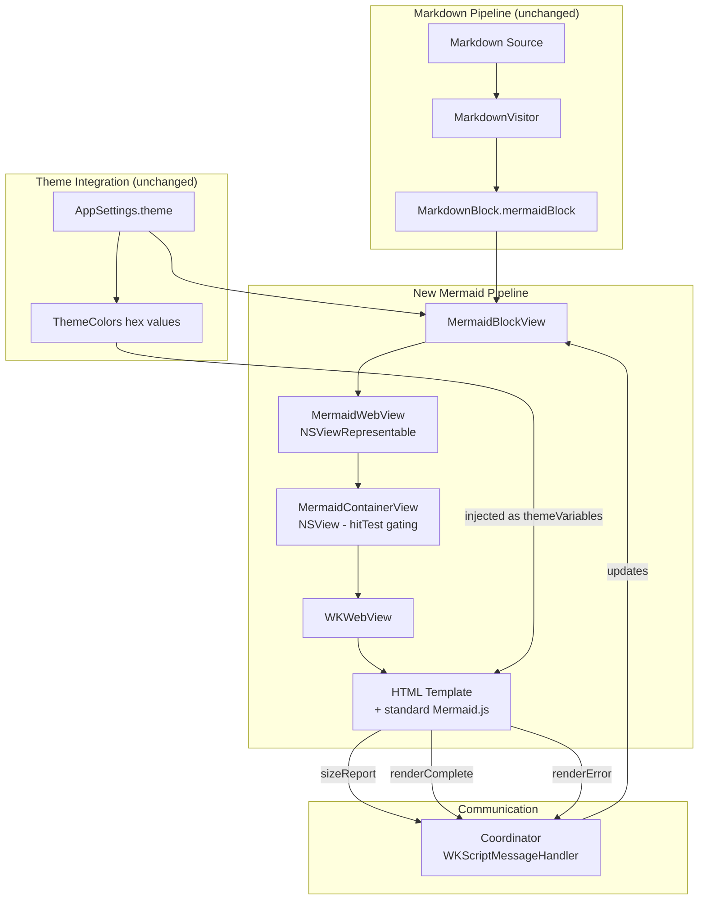
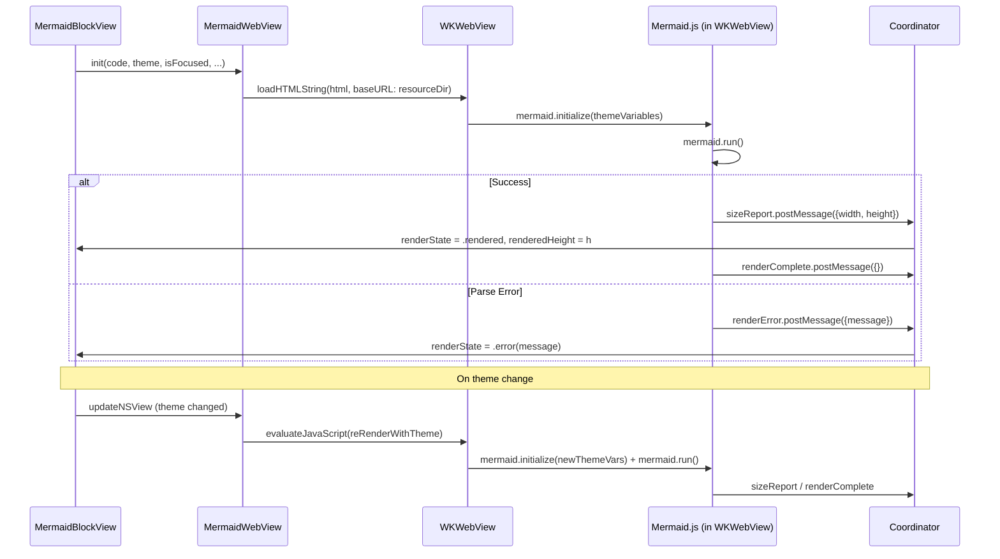
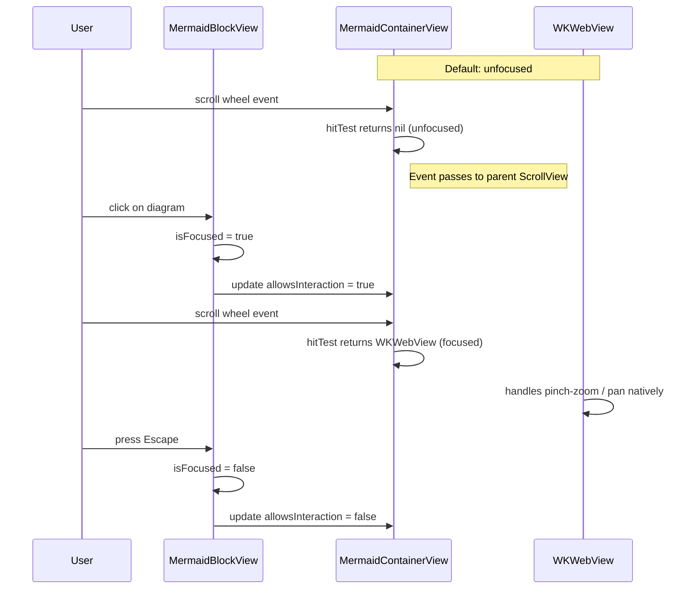

# Design: Mermaid Diagram Rendering Re-Architecture

**Feature ID**: mermaid-rearchitect
**Version**: 1.0.0
**Created**: 2026-02-07

## 1. Design Overview

Replace the existing four-stage Mermaid rendering pipeline (JavaScriptCore + beautiful-mermaid.js + SVGSanitizer + SwiftDraw rasterization + custom gesture system) with a WKWebView-per-diagram approach. Each Mermaid code block gets its own WKWebView that loads standard Mermaid.js in its native rendering environment. A click-to-focus interaction model provides scroll pass-through by default and zoom/pan when activated.

### High-Level Architecture



## 2. Architecture

### Component Architecture

The new Mermaid subsystem consists of four components replacing the previous seven:

| Component | Type | Responsibility |
|-----------|------|----------------|
| `MermaidBlockView` | SwiftUI View | Focus state, loading/error UI, sizing, theme observation |
| `MermaidWebView` | NSViewRepresentable | WKWebView lifecycle, template loading, message handling |
| `MermaidContainerView` | NSView | hitTest gating for scroll pass-through |
| `mermaid-template.html` | Bundled resource | Mermaid.js initialization, rendering, size reporting |

### Sequence: Diagram Rendering



### Sequence: Focus Interaction



## 3. Detailed Design

### 3.1 MermaidContainerView (NSView)

Custom NSView subclass that gates `hitTest(_:)` based on focus state. This is the mechanism for scroll pass-through (FR-005) without any custom gesture classification.

```swift
final class MermaidContainerView: NSView {
    var allowsInteraction: Bool = false

    override func hitTest(_ point: NSPoint) -> NSView? {
        guard allowsInteraction else { return nil }
        return super.hitTest(point)
    }
}
```

When `allowsInteraction` is false, all events (scroll, click, gesture) pass through to the parent responder chain. When true, the contained WKWebView receives events normally, providing native pinch-to-zoom and two-finger pan.

### 3.2 MermaidWebView (NSViewRepresentable)

Wraps `MermaidContainerView` containing a `WKWebView`. Follows the existing `NSViewRepresentable` + `NSView` + `Coordinator` pattern established by `WindowAccessor` and `ScrollPhaseMonitor`.

**Properties:**

| Property | Type | Purpose |
|----------|------|---------|
| `code` | `String` | Mermaid diagram source |
| `theme` | `AppTheme` | Current theme for color mapping |
| `isFocused` | `Binding<Bool>` | Controls hitTest gating |
| `renderedHeight` | `Binding<CGFloat>` | Reported by JS after render |
| `renderState` | `Binding<MermaidRenderState>` | Loading/rendered/error |

**WKWebView Configuration:**

- Shared `WKProcessPool` (static, all diagrams share one web process)
- `WKUserContentController` with three message handlers: `sizeReport`, `renderComplete`, `renderError`
- `WKNavigationDelegate` that blocks all navigation except initial load
- `isOpaque = false` and transparent background to prevent white flash
- `underPageBackgroundColor = .clear` (macOS 12+ public API)

**Coordinator** implements `WKScriptMessageHandler` and `WKNavigationDelegate`:

- `userContentController(_:didReceive:)` routes messages by handler name
- `sizeReport`: Parses `{width, height}` from message body, updates `renderedHeight` binding
- `renderComplete`: Sets `renderState = .rendered`
- `renderError`: Sets `renderState = .error(message)`
- Navigation delegate cancels all non-initial navigation actions (NFR-005)

**Template Loading:**

On `makeNSView`, the coordinator:
1. Reads `mermaid-template.html` from `Bundle.module`
2. Performs token substitution: `__MERMAID_CODE__` with escaped diagram code, `__THEME_VARIABLES__` with JSON themeVariables
3. Calls `webView.loadHTMLString(html, baseURL: resourceDirectoryURL)` so `<script src="mermaid.min.js">` resolves locally

**Theme Re-rendering:**

On `updateNSView` when theme changes, the coordinator calls `webView.evaluateJavaScript()` with a script that:
1. Re-initializes Mermaid with new themeVariables
2. Clears the existing SVG
3. Re-runs `mermaid.run()` to re-render with new colors

**Click-outside Detection:**

The Coordinator installs an `NSEvent.addLocalMonitorForEvents(matching: .leftMouseDown)` that checks whether the click is inside the container view's bounds. If outside and the diagram is focused, it sets `isFocused = false`. The monitor is installed when focus activates and removed when focus deactivates or the view is torn down.

### 3.3 MermaidBlockView (SwiftUI View)

Orchestrates the diagram display, managing focus state, loading/error UI, and frame sizing. Retains the existing patterns for loading and error views established in the current `MermaidBlockView`.

**State:**

| State | Type | Purpose |
|-------|------|---------|
| `isFocused` | `Bool` | Focus gating |
| `renderedHeight` | `CGFloat` | From JS size report, default 200 |
| `renderState` | `MermaidRenderState` | `.loading` / `.rendered` / `.error(String)` |

**Layout:**

- ZStack: Loading/error overlay on top of MermaidWebView
- MermaidWebView opacity 0 until `.rendered`, then 1 (prevents flash of blank WebView)
- Frame: `maxWidth: .infinity`, `height: min(renderedHeight, maxDiagramHeight)` where `maxDiagramHeight = 600`
- Clipped with `RoundedRectangle(cornerRadius: 6)`
- When focused: 2pt accent-colored border overlay (theme.colors.accent)
- Background: `theme.colors.backgroundSecondary`

**Interactions:**

- `.onTapGesture { isFocused = true }` on the container (unfocused click activates focus)
- `.onKeyPress(.escape)` unfocuses (macOS 14+ API)
- Click-outside handled by Coordinator's NSEvent monitor

**Re-render Trigger:**

Uses `.task(id: TaskID(code: code, theme: appSettings.theme))` pattern (matching existing codebase pattern) but the actual rendering happens inside WKWebView. The task ID change triggers MermaidWebView recreation via SwiftUI's diff.

Alternatively, since WKWebView is expensive to recreate, `updateNSView` detects theme changes and re-renders in-place via JavaScript. Code changes trigger full WKWebView replacement (new diagram).

### 3.4 MermaidRenderState

```swift
enum MermaidRenderState: Equatable {
    case loading
    case rendered
    case error(String)
}
```

### 3.5 MermaidError

Simplified error enum for the new pipeline (replaces the existing 6-case enum):

```swift
enum MermaidError: LocalizedError {
    case templateNotFound
    case renderFailed(String)

    var errorDescription: String? {
        switch self {
        case .templateNotFound:
            "Could not locate Mermaid HTML template in bundle resources."
        case let .renderFailed(message):
            "Mermaid rendering failed: \(message)"
        }
    }
}
```

### 3.6 HTML Template (mermaid-template.html)

Self-contained HTML document bundled as a resource.

**Structure:**

```html
<!DOCTYPE html>
<html>
<head>
    <meta charset="utf-8">
    <meta name="viewport" content="width=device-width, initial-scale=1.0">
    <style>
        * { margin: 0; padding: 0; }
        body { background: transparent; overflow: hidden; }
        #diagram { display: inline-block; }
    </style>
    <script src="mermaid.min.js"></script>
</head>
<body>
    <div id="diagram">
        <pre class="mermaid">__MERMAID_CODE__</pre>
    </div>
    <script>
        mermaid.initialize({
            startOnLoad: false,
            theme: 'base',
            themeVariables: __THEME_VARIABLES__,
            securityLevel: 'strict',
            flowchart: { htmlLabels: true },
        });

        async function render() {
            try {
                await mermaid.run({ querySelector: '.mermaid' });
                const svg = document.querySelector('#diagram svg');
                if (svg) {
                    const bbox = svg.getBoundingClientRect();
                    window.webkit.messageHandlers.sizeReport.postMessage({
                        width: bbox.width,
                        height: bbox.height
                    });
                    window.webkit.messageHandlers.renderComplete.postMessage({});
                }
            } catch (error) {
                window.webkit.messageHandlers.renderError.postMessage({
                    message: error.message || String(error)
                });
            }
        }

        render();
    </script>
</body>
</html>
```

**Token Substitution (performed in Swift before loading):**

| Token | Replaced With | Escaping |
|-------|---------------|----------|
| `__MERMAID_CODE__` | Diagram source text | HTML entity escaping (`<`, `>`, `&`, `"`) |
| `__THEME_VARIABLES__` | JSON object of Mermaid themeVariables | JSON serialization |

**Re-render Function (called from Swift via evaluateJavaScript):**

```javascript
function reRenderWithTheme(themeVarsJSON) {
    mermaid.initialize({
        startOnLoad: false,
        theme: 'base',
        themeVariables: themeVarsJSON,
        securityLevel: 'strict',
    });
    const container = document.getElementById('diagram');
    const svg = container.querySelector('svg');
    if (svg) svg.remove();
    const pre = document.createElement('pre');
    pre.className = 'mermaid';
    pre.textContent = __ORIGINAL_CODE__;
    container.appendChild(pre);
    render();
}
```

The `__ORIGINAL_CODE__` is stored as a JS variable during initial template generation so re-renders do not need another token substitution.

### 3.7 Theme-to-Mermaid Variable Mapping

Maps `ThemeColors` hex values to Mermaid `themeVariables` for the `base` theme:

| Mermaid Variable | Solarized Dark | Solarized Light | Source |
|------------------|----------------|-----------------|--------|
| `primaryColor` | `#073642` | `#eee8d5` | backgroundSecondary (node fill) |
| `primaryTextColor` | `#839496` | `#657b83` | foreground |
| `primaryBorderColor` | `#586e75` | `#586e75` | border |
| `lineColor` | `#586e75` | `#586e75` | foregroundSecondary (edges) |
| `secondaryColor` | `#002b36` | `#fdf6e3` | background |
| `tertiaryColor` | `#073642` | `#eee8d5` | backgroundSecondary |
| `background` | `#002b36` | `#fdf6e3` | background |
| `mainBkg` | `#073642` | `#eee8d5` | backgroundSecondary |
| `nodeBorder` | `#586e75` | `#586e75` | border |
| `clusterBkg` | `#073642` | `#eee8d5` | backgroundSecondary |
| `titleColor` | `#93a1a1` | `#586e75` | headingColor |
| `edgeLabelBackground` | `#002b36` | `#fdf6e3` | background |
| `textColor` | `#839496` | `#657b83` | foreground |
| `labelTextColor` | `#839496` | `#657b83` | foreground |
| `actorBkg` | `#073642` | `#eee8d5` | backgroundSecondary |
| `actorBorder` | `#586e75` | `#586e75` | border |
| `actorTextColor` | `#839496` | `#657b83` | foreground |
| `actorLineColor` | `#586e75` | `#586e75` | foregroundSecondary |
| `signalColor` | `#839496` | `#657b83` | foreground |
| `signalTextColor` | `#002b36` | `#fdf6e3` | background (on accent) |
| `noteBkgColor` | `#073642` | `#eee8d5` | backgroundSecondary |
| `noteTextColor` | `#839496` | `#657b83` | foreground |
| `noteBorderColor` | `#586e75` | `#586e75` | border |
| `activationBorderColor` | `#268bd2` | `#268bd2` | accent |
| `labelBoxBkgColor` | `#073642` | `#eee8d5` | backgroundSecondary |
| `labelBoxBorderColor` | `#586e75` | `#586e75` | border |

This mapping is implemented as a static method on a `MermaidThemeMapper` utility enum:

```swift
enum MermaidThemeMapper {
    static func themeVariablesJSON(for theme: AppTheme) -> String {
        // Returns a JSON string of the themeVariables dict
    }
}
```

Using hex color strings derived from `ThemeColors`. Since `ThemeColors` uses `Color` (SwiftUI), and we need hex strings for JS, the mapper will use a hardcoded hex lookup keyed by `AppTheme` case (matching the comments in `SolarizedDark.swift` / `SolarizedLight.swift`). This avoids runtime `Color`-to-hex conversion.

### 3.8 Data Model Changes

**No data model changes.** The `MarkdownBlock.mermaidBlock(code:)` enum case and the `MarkdownVisitor` Mermaid detection logic remain unchanged.

### 3.9 Files Deleted

| File | Reason |
|------|--------|
| `mkdn/Core/Mermaid/MermaidRenderer.swift` | Replaced by WKWebView |
| `mkdn/Core/Mermaid/SVGSanitizer.swift` | No longer needed (no SVG post-processing) |
| `mkdn/Core/Mermaid/MermaidCache.swift` | No longer needed (WKWebView manages its own state) |
| `mkdn/Core/Mermaid/MermaidImageStore.swift` | No longer needed (no NSImage rasterization) |
| `mkdn/UI/Components/ScrollPhaseMonitor.swift` | Replaced by hitTest gating |
| `mkdn/Core/Gesture/GestureIntentClassifier.swift` | No longer needed |
| `mkdn/Core/Gesture/DiagramPanState.swift` | No longer needed |
| `mkdnTests/Unit/Core/SVGSanitizerTests.swift` | Tests deleted code |
| `mkdnTests/Unit/Core/MermaidCacheTests.swift` | Tests deleted code |
| `mkdnTests/Unit/Core/MermaidImageStoreTests.swift` | Tests deleted code |
| `mkdnTests/Unit/Core/MermaidRendererTests.swift` | Tests deleted code |
| `mkdnTests/Unit/Core/GestureIntentClassifierTests.swift` | Tests deleted code |
| `mkdnTests/Unit/Core/DiagramPanStateTests.swift` | Tests deleted code |
| `mkdn/Resources/mermaid.min.js` | beautiful-mermaid replaced by standard Mermaid.js |

### 3.10 Files Created

| File | Purpose |
|------|---------|
| `mkdn/Core/Mermaid/MermaidWebView.swift` | NSViewRepresentable + MermaidContainerView + Coordinator |
| `mkdn/Core/Mermaid/MermaidRenderState.swift` | Render state enum |
| `mkdn/Core/Mermaid/MermaidError.swift` | Simplified error enum |
| `mkdn/Core/Mermaid/MermaidThemeMapper.swift` | Theme-to-Mermaid themeVariables mapping |
| `mkdn/Resources/mermaid-template.html` | HTML rendering template |
| `mkdn/Resources/mermaid.min.js` | Standard Mermaid.js library (new file, same name) |

### 3.11 Files Modified

| File | Change |
|------|--------|
| `mkdn/Features/Viewer/Views/MermaidBlockView.swift` | Full rewrite: WKWebView-based rendering with focus model |
| `mkdn/Features/Viewer/Views/MarkdownPreviewView.swift` | Remove `MermaidImageStore.shared.removeAll()` on theme change |
| `Package.swift` | Remove SwiftDraw dependency; update resource rules |
| `CLAUDE.md` | Note WKWebView exception for Mermaid diagrams |

## 4. Technology Stack

| Category | Choice | Rationale |
|----------|--------|-----------|
| Diagram rendering | WKWebView + standard Mermaid.js | Canonical rendering environment; eliminates fragile JSC pipeline |
| SwiftUI integration | NSViewRepresentable | Existing codebase pattern (WindowAccessor, ScrollPhaseMonitor) |
| Scroll isolation | hitTest gating on NSView | Simple, no custom gesture heuristics, no scroll phase monitoring |
| Theme integration | Mermaid `base` theme + themeVariables | Mermaid's documented approach for custom colors |
| JS-Swift messaging | WKScriptMessageHandler | Standard WebKit pattern for bidirectional communication |
| Focus interaction | SwiftUI onTapGesture + onKeyPress + NSEvent monitor | macOS 14+ APIs, no custom gesture classifiers |

### Dependencies Changed

| Dependency | Action | Notes |
|------------|--------|-------|
| SwiftDraw | **Remove** | Only used for SVG rasterization in old pipeline |
| WebKit (system framework) | **Add** | WKWebView, WKScriptMessageHandler, etc. |
| Mermaid.js (standard) | **Replace** | Replaces beautiful-mermaid.js as bundled resource |
| JXKit | **None** | Not present in Package.swift (was never added) |

Note: JXKit was referenced in KB documentation but the actual codebase uses `import JavaScriptCore` (system framework) directly. No JXKit dependency exists in Package.swift. Only SwiftDraw needs removal.

## 5. Implementation Plan

| # | Task | Scope | Key Files |
|---|------|-------|-----------|
| T1 | Teardown: delete old Mermaid files, gesture files, test files, and update Package.swift | Delete 14 files; remove SwiftDraw from Package.swift; remove old resource rule | See Section 3.9 + Package.swift |
| T2 | Add resources: bundle standard Mermaid.js and create HTML template | Download standard mermaid.min.js; create mermaid-template.html; add resource copy rules to Package.swift | Resources/mermaid.min.js, Resources/mermaid-template.html, Package.swift |
| T3 | Create MermaidRenderState + MermaidError | Two small files with enums | Core/Mermaid/MermaidRenderState.swift, Core/Mermaid/MermaidError.swift |
| T4 | Create MermaidThemeMapper | Static hex-to-themeVariables mapping | Core/Mermaid/MermaidThemeMapper.swift |
| T5 | Create MermaidWebView | NSViewRepresentable + MermaidContainerView + Coordinator with WKScriptMessageHandler | Core/Mermaid/MermaidWebView.swift |
| T6 | Rewrite MermaidBlockView | Focus model, sizing, loading/error UI, WKWebView integration | Features/Viewer/Views/MermaidBlockView.swift |
| T7 | Update MarkdownPreviewView | Remove MermaidImageStore.shared.removeAll() reference | Features/Viewer/Views/MarkdownPreviewView.swift |
| T8 | Update documentation | CLAUDE.md WKWebView exception; KB architecture.md, modules.md, patterns.md updates | CLAUDE.md, .rp1/context/*.md |
| T9 | Write tests | MermaidThemeMapper unit tests; MermaidRenderState tests; integration verification | mkdnTests/Unit/Core/ |

## 6. Implementation DAG

**Parallel Groups** (tasks with no inter-dependencies):

1. [T1, T2, T3, T4, T8] - Teardown, resources, enums, theme mapper, and docs are all independent
2. [T5, T7] - MermaidWebView depends on T2 (template), T3 (state enum), T4 (theme mapper); MarkdownPreviewView update depends on T1 (MermaidImageStore deleted)
3. [T6] - MermaidBlockView rewrite depends on T5 (MermaidWebView)
4. [T9] - Tests depend on T5, T6

**Dependencies:**

- T5 -> [T2, T3, T4] (interface: MermaidWebView loads the HTML template and uses MermaidRenderState + MermaidThemeMapper)
- T6 -> T5 (interface: MermaidBlockView uses MermaidWebView)
- T7 -> T1 (data: MermaidImageStore reference deleted in T1)
- T9 -> [T5, T6] (build: tests import and exercise new components)

**Critical Path**: T2 -> T5 -> T6 -> T9

## 7. Testing Strategy

### Test Value Assessment

| Test | Value | Rationale |
|------|-------|-----------|
| MermaidThemeMapper output correctness | **High** | App-specific business logic mapping theme to Mermaid variables |
| MermaidRenderState enum coverage | **Low** | Trivial enum, verified implicitly by view tests |
| HTML template token substitution | **High** | App-specific logic, escaping bugs could break rendering |
| MermaidError descriptions | **Low** | Simple string formatting |
| WKWebView pinch-to-zoom behavior | **Avoid** | Tests WebKit framework behavior, not app logic |
| Mermaid.js rendering output | **Avoid** | Tests third-party library behavior |
| WKScriptMessageHandler routing | **Medium** | Integration point, but mostly WebKit plumbing |

### Test Plan

| Test | Type | What It Validates | Traces To |
|------|------|-------------------|-----------|
| `MermaidThemeMapperTests` | Unit | Correct hex values in JSON output for both themes; valid JSON structure | FR-003, AC-003.1 |
| `MermaidHTMLTemplateTests` | Unit | Token substitution produces valid HTML; special characters escaped; no `__` tokens remain | FR-009, AC-009.3 |
| `MermaidThemeMapper_allVariablesPresent` | Unit | All required Mermaid themeVariables keys present in output | FR-003 |
| `MermaidThemeMapper_darkVsLight` | Unit | Dark and light themes produce different variable values | FR-003, AC-003.2, AC-003.3 |
| `MermaidRenderState_equatable` | Unit | Enum equality works correctly for state transitions | FR-007 |
| `PackageBuildVerification` | Build | Project compiles without SwiftDraw; no dead imports | FR-001, FR-010 |

**Tests NOT written (per Test Value Assessment):**

- No tests for WKWebView creation/lifecycle (framework behavior)
- No tests for Mermaid.js rendering correctness (third-party library)
- No tests for pinch-to-zoom, scroll pass-through (AppKit/WebKit gesture system)
- No tests for WKScriptMessageHandler message delivery (WebKit plumbing)

## 8. Deployment Design

No special deployment considerations. Changes are bundled into the app binary:

- Standard Mermaid.js and HTML template are SPM bundle resources (`.copy()` rule)
- WebKit is a system framework, no additional linking configuration needed
- No server-side components, no network dependencies
- No migration path needed (stateless rendering pipeline)

**Resource bundling in Package.swift:**

```swift
resources: [
    .copy("Resources/mermaid.min.js"),
    .copy("Resources/mermaid-template.html"),
]
```

## 9. Documentation Impact

| Type | Target | Section | KB Source | Rationale |
|------|--------|---------|-----------|-----------|
| edit | CLAUDE.md | Critical Rules | - | Note WKWebView exception for Mermaid diagrams |
| edit | .rp1/context/architecture.md | Mermaid Diagrams | architecture.md:Mermaid Diagrams | Update pipeline description to WKWebView approach |
| edit | .rp1/context/architecture.md | Concurrency Model | architecture.md:Concurrency Model | Remove MermaidRenderer actor reference, note WKWebView @MainActor |
| edit | .rp1/context/modules.md | Core/Mermaid | modules.md:Mermaid | Update file inventory and descriptions |
| edit | .rp1/context/modules.md | Dependencies | modules.md:Dependencies | Remove SwiftDraw/JXKit rows, add WebKit |
| edit | .rp1/context/patterns.md | Actor Pattern (Mermaid) | patterns.md:Actor Pattern | Replace with NSViewRepresentable + WKWebView pattern |
| edit | .rp1/context/concept_map.md | User Workflows | concept_map.md:User Workflows | Update diagram review workflow description |

## 10. Design Decisions Log

See [design-decisions.md](design-decisions.md) for the full decision log.

Key decisions:
- **D1**: hitTest gating for scroll pass-through (vs. disabling user interaction, vs. event monitors)
- **D2**: Template string substitution for HTML (vs. loadFileURL, vs. JS postMessage for code injection)
- **D3**: Shared WKProcessPool (vs. one process per diagram)
- **D4**: Hardcoded hex lookup in MermaidThemeMapper (vs. runtime Color-to-hex conversion)
- **D5**: In-place JS re-render on theme change (vs. full WKWebView recreation)
