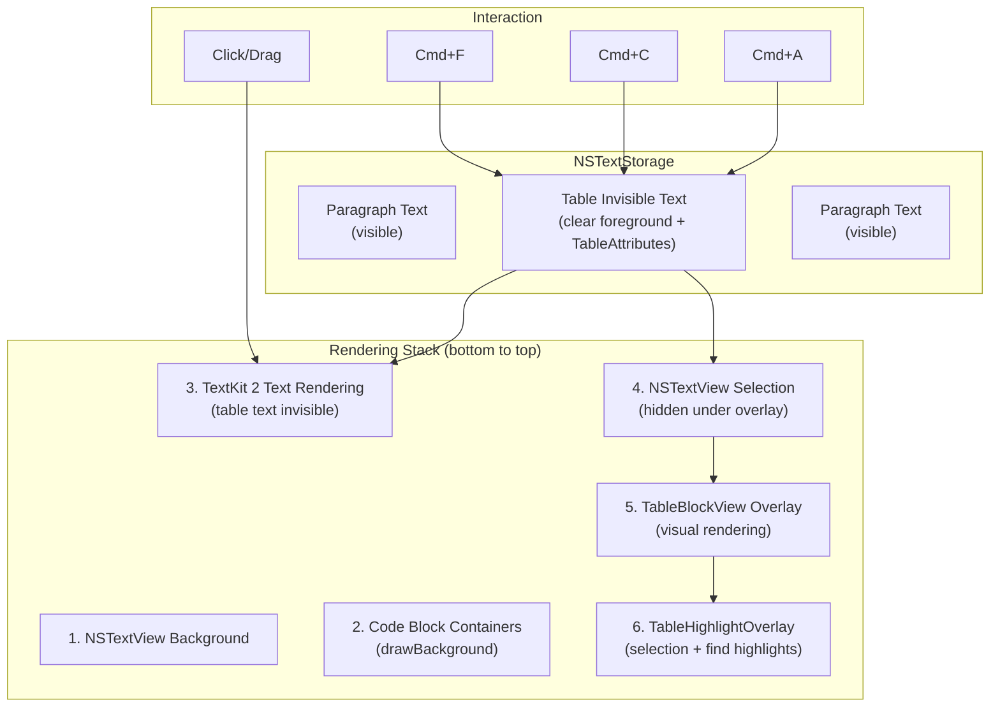
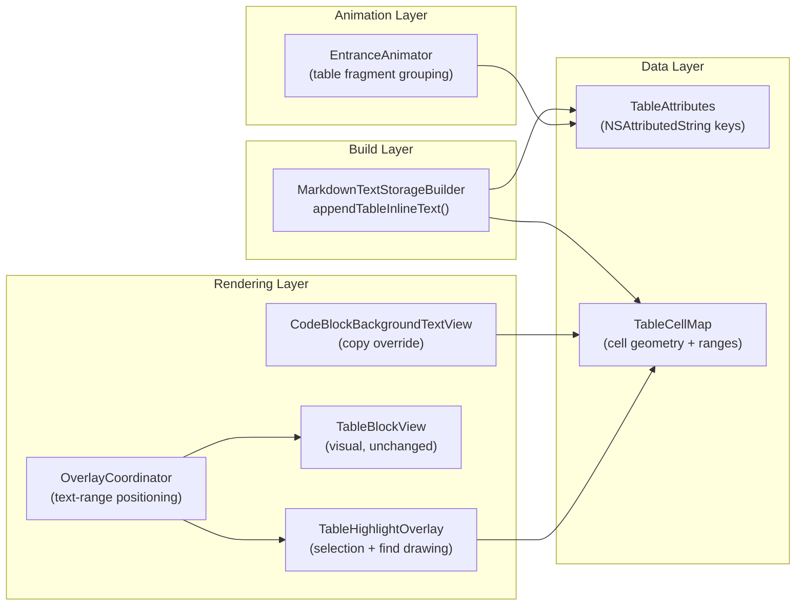
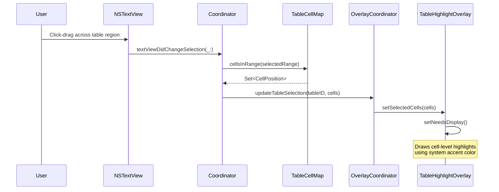
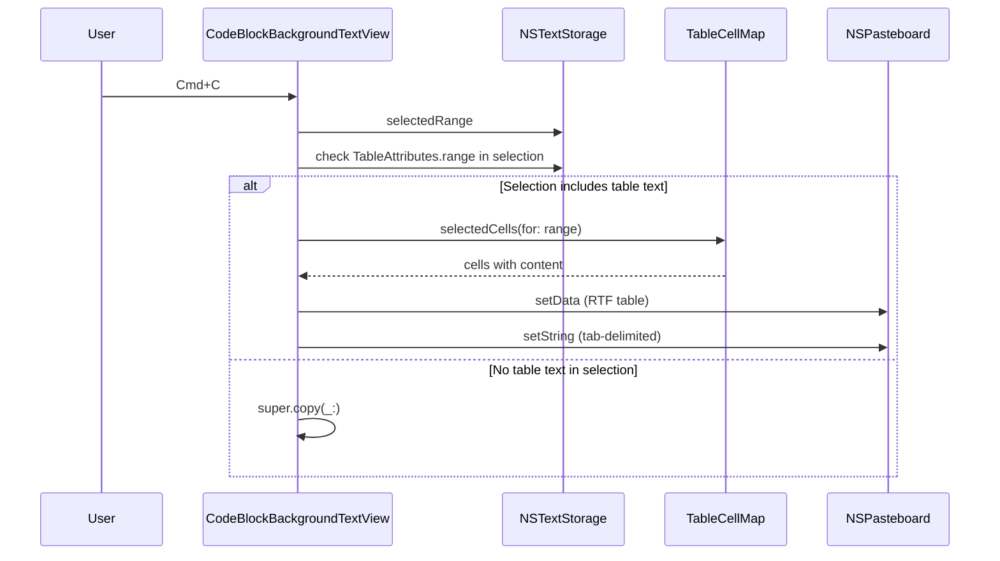
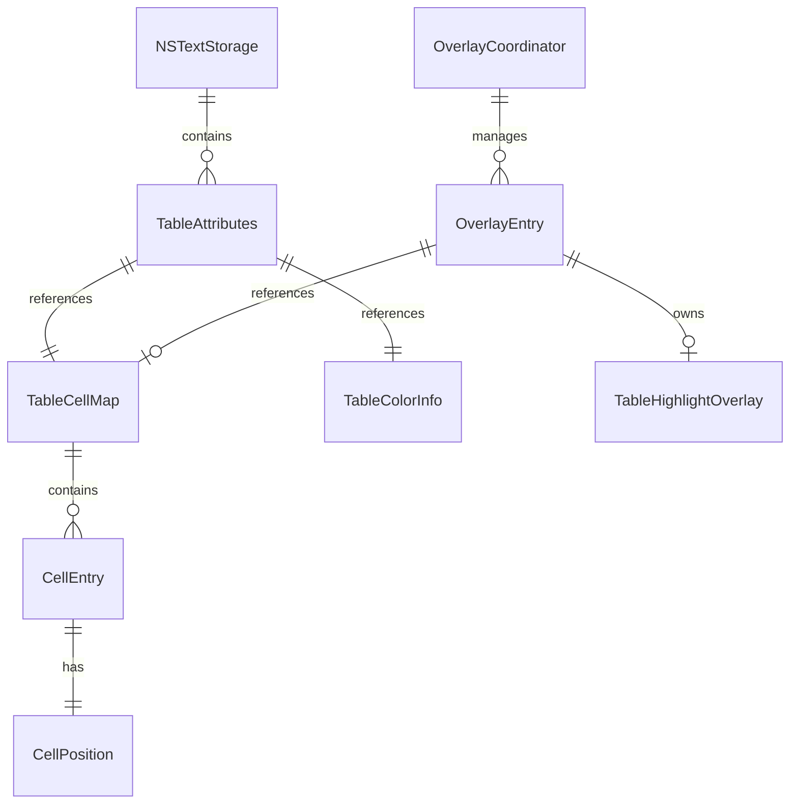

# Design: Table Cross-Cell Selection

**Feature ID**: table-cross-cell-selection
**Version**: 1.0.0
**Created**: 2026-02-23

## 1. Design Overview

This feature makes table cell content part of the document's NSTextStorage so that selection, find, and clipboard operations work natively across table cells and across block boundaries. The visual rendering of tables remains unchanged -- the existing SwiftUI TableBlockView overlay continues to provide the visual appearance. A transparent selection/find overlay draws cell-level highlights on top of the visual overlay.

### High-Level Architecture



**Core principle**: Dual-layer rendering. The invisible text layer in NSTextStorage provides selection, find, and clipboard semantics. The visual overlay layer (TableBlockView) provides pixel-identical table rendering. A third highlight overlay layer draws cell-level selection and find feedback on top.

## 2. Architecture

### 2.1 Component Architecture



### 2.2 Sequence: Selection Flow



### 2.3 Sequence: Copy Flow



## 3. Detailed Design

### 3.1 TableAttributes

New file: `mkdn/Core/Markdown/TableAttributes.swift`

Mirrors the established `CodeBlockAttributes` pattern.

```swift
enum TableAttributes {
    /// Marks all characters within a table's invisible text.
    /// Value: unique String identifier per table instance.
    static let range = NSAttributedString.Key("mkdn.tableRange")

    /// Carries the cell map for character-to-cell position mapping.
    /// Value: a TableCellMap instance.
    static let cellMap = NSAttributedString.Key("mkdn.tableCellMap")

    /// Carries resolved NSColor values for the table container.
    /// Value: a TableColorInfo instance.
    static let colors = NSAttributedString.Key("mkdn.tableColors")

    /// Marks header row characters (for differentiated selection highlight).
    /// Value: NSNumber(booleanLiteral: true)
    static let isHeader = NSAttributedString.Key("mkdn.tableIsHeader")
}
```

### 3.2 TableCellMap

New file: `mkdn/Core/Markdown/TableCellMap.swift`

NSObject subclass (required for NSAttributedString attribute storage). Provides O(log n) cell lookup via binary search on sorted cell start positions.

```swift
final class TableCellMap: NSObject {
    struct CellPosition: Hashable {
        let row: Int      // -1 for header row, 0+ for data rows
        let column: Int
    }

    struct CellEntry {
        let position: CellPosition
        let range: NSRange       // character range relative to table text start
        let content: String      // plain text content of the cell
    }

    let cells: [CellEntry]             // sorted by range.location
    let columnCount: Int
    let rowCount: Int                   // data rows only (header excluded)
    let columnWidths: [CGFloat]
    let rowHeights: [CGFloat]           // index 0 = header, 1+ = data rows
    let columns: [TableColumn]          // column definitions for alignment

    /// Binary search: character offset -> CellPosition
    func cellAt(offset: Int) -> CellPosition? { ... }

    /// Range intersection: selected range -> set of selected cells
    func cellsInRange(_ range: NSRange) -> Set<CellPosition> { ... }

    /// Cell position -> character range (relative to table start)
    func rangeFor(cell: CellPosition) -> NSRange? { ... }

    /// All selected cells' content as tab-delimited rows
    func tabDelimitedText(for cells: Set<CellPosition>) -> String { ... }

    /// All selected cells as RTF attributed string
    func rtfData(for cells: Set<CellPosition>, colors: ThemeColors) -> Data? { ... }
}
```

### 3.3 TableColorInfo

New class in `TableAttributes.swift`:

```swift
final class TableColorInfo: NSObject {
    let background: NSColor
    let backgroundSecondary: NSColor
    let border: NSColor
    let headerBackground: NSColor
    let foreground: NSColor
    let headingColor: NSColor
}
```

### 3.4 TableOverlayInfo

New struct added to `MarkdownTextStorageBuilder.swift`:

```swift
struct TableOverlayInfo {
    let blockIndex: Int
    let block: MarkdownBlock
    let tableRangeID: String
    let cellMap: TableCellMap
}
```

`TextStorageResult` extended:

```swift
struct TextStorageResult {
    let attributedString: NSAttributedString
    let attachments: [AttachmentInfo]
    let tableOverlays: [TableOverlayInfo]   // NEW
}
```

### 3.5 MarkdownTextStorageBuilder Changes

In `appendBlock()`, the `.table` case changes from `appendAttachmentBlock` to `appendTableInlineText`:

```swift
case let .table(columns, rows):
    appendTableInlineText(
        to: result,
        blockIndex: idx,
        columns: columns,
        rows: rows,
        colors: colors,
        scaleFactor: sf,
        tableOverlays: &tableOverlays
    )
```

New method `appendTableInlineText`:

1. Compute column widths via `TableColumnSizer.computeWidths`
2. Compute row heights via per-row height estimation
3. Build `TableCellMap` with character ranges as text is appended
4. Generate unique table ID (`UUID().uuidString`)
5. For each row (header first, then data rows):
   - Append each cell's plain text separated by tab characters
   - Append newline at end of row
   - Set paragraph style with:
     - Tab stops matching cumulative column widths
     - Fixed minimum line height matching the visual row height
     - `paragraphSpacing: 0` (tight rows)
   - Set `.foregroundColor: NSColor.clear` (invisible)
   - Set `TableAttributes.range: tableID`
   - Set `TableAttributes.cellMap: cellMap` (same instance on every character)
   - Set `TableAttributes.colors: colorInfo`
   - Set `TableAttributes.isHeader: true` for header row characters
6. Set paragraph spacing after last row for block separation
7. Append `TableOverlayInfo` to the output array

### 3.6 OverlayCoordinator Extensions

**New entry variant for text-range overlays**:

The `OverlayEntry` struct gains optional fields to support text-range-based positioning alongside attachment-based positioning:

```swift
private struct OverlayEntry {
    let view: NSView
    let attachment: NSTextAttachment?       // nil for text-range overlays
    let block: MarkdownBlock
    var preferredWidth: CGFloat?
    var tableRangeID: String?               // non-nil for table overlays
    var highlightOverlay: TableHighlightOverlay?  // selection/find overlay
    var cellMap: TableCellMap?
}
```

**New methods**:

- `updateTableOverlays(tableOverlays:appSettings:documentState:in:)`: Creates/updates table visual overlays and their highlight overlay siblings
- `positionTextRangeEntry(_:context:)`: Positions overlay by finding the bounding rect of all layout fragments within the table's text range (found by scanning for `TableAttributes.range` matching the entry's `tableRangeID`)
- `updateTableSelections(selectedRange:)`: Called by coordinator on selection change; maps selection to cells per table, updates each table's `TableHighlightOverlay`
- `updateTableFindHighlights(matchRanges:currentIndex:theme:)`: Called by coordinator during find updates; maps find matches to table cells, updates highlights

**Positioning algorithm for text-range overlays**:

```
1. Scan textStorage for TableAttributes.range == tableRangeID
2. Get the NSRange of all characters with this range ID
3. Convert to NSTextRange via contentManager
4. Enumerate layout fragments in this range
5. Compute bounding rect (union of all fragment frames)
6. Position visual overlay at bounding rect
7. Position highlight overlay at same rect (on top)
```

### 3.7 TableHighlightOverlay

New file: `mkdn/Features/Viewer/Views/TableHighlightOverlay.swift`

Lightweight `NSView` subclass. Draws cell-level selection and find highlights. All mouse events pass through.

```swift
@MainActor
final class TableHighlightOverlay: NSView {
    var selectedCells: Set<TableCellMap.CellPosition> = []
    var findHighlightCells: Set<TableCellMap.CellPosition> = []
    var currentFindCell: TableCellMap.CellPosition?
    var cellMap: TableCellMap?
    var accentColor: NSColor = .controlAccentColor
    var findHighlightColor: NSColor = .yellow

    override func hitTest(_ point: NSPoint) -> NSView? { nil }

    override func draw(_ dirtyRect: NSRect) {
        guard let cellMap else { return }
        drawSelectionHighlights(cellMap: cellMap, in: dirtyRect)
        drawFindHighlights(cellMap: cellMap, in: dirtyRect)
    }
}
```

**Cell rectangle computation**: Given the overlay's frame covers the entire table, cell rectangles are computed from:
- X: cumulative column widths from `cellMap.columnWidths`
- Y: cumulative row heights from `cellMap.rowHeights`
- Width: `cellMap.columnWidths[column]`
- Height: `cellMap.rowHeights[row + 1]` (row 0 = header)

**Selection highlight**: System accent color at 0.3 opacity (matching `selectedTextAttributes` in `SelectableTextView.applyTheme`). Header cells get 0.4 opacity for subtle differentiation (FR-012).

**Find highlight**: Theme's `findHighlight` color at 0.15 opacity for passive matches, 0.4 opacity for the current match. This mirrors the existing find highlight logic in `SelectableTextView.Coordinator.applyFindHighlights`.

### 3.8 CodeBlockBackgroundTextView Copy Override

Override `copy(_:)` to handle table text in the selection:

```swift
override func copy(_ sender: Any?) {
    guard let textStorage,
          let selectedRange = selectedRanges.first as? NSValue
    else {
        super.copy(sender)
        return
    }

    let range = selectedRange.rangeValue
    guard range.length > 0 else { return }

    // Check if selection includes any table text
    var tableSegments: [(range: NSRange, cellMap: TableCellMap)] = []
    textStorage.enumerateAttribute(
        TableAttributes.cellMap,
        in: range,
        options: []
    ) { value, subRange, _ in
        if let cellMap = value as? TableCellMap {
            tableSegments.append((range: subRange, cellMap: cellMap))
        }
    }

    guard !tableSegments.isEmpty else {
        super.copy(sender)
        return
    }

    // Build mixed content clipboard (paragraph text + table data)
    let pasteboard = NSPasteboard.general
    pasteboard.clearContents()

    let (rtfData, plainText) = buildMixedClipboard(
        selectedRange: range,
        tableSegments: tableSegments,
        textStorage: textStorage
    )

    if let rtfData {
        pasteboard.setData(rtfData, forType: .rtf)
    }
    pasteboard.setString(plainText, forType: .string)
}
```

The `buildMixedClipboard` method walks the selected range in document order:
1. Non-table segments: extract plain text (and RTF) as-is from the text storage
2. Table segments: use the `TableCellMap` to identify selected cells and generate tab-delimited plain text and RTF table output
3. Concatenate all segments in order

### 3.9 Selection Change Handler

In `SelectableTextView.Coordinator`, implement `textViewDidChangeSelection(_:)`:

```swift
func textViewDidChangeSelection(_ notification: Notification) {
    guard let textView = notification.object as? NSTextView,
          let selectedRange = textView.selectedRanges.first as? NSValue
    else { return }

    let range = selectedRange.rangeValue
    overlayCoordinator.updateTableSelections(selectedRange: range)
}
```

This delegates to `OverlayCoordinator` which iterates over table entries, intersects the selection with each table's cell map, and updates the corresponding `TableHighlightOverlay`.

### 3.10 EntranceAnimator Table Grouping

Extend the fragment grouping logic in `animateVisibleFragments()`:

```swift
private func blockGroupID(
    for fragment: NSTextLayoutFragment,
    contentManager: NSTextContentManager,
    textStorage: NSTextStorage
) -> String? {
    let docStart = contentManager.documentRange.location
    let fragStart = fragment.rangeInElement.location
    let charOffset = contentManager.offset(from: docStart, to: fragStart)
    guard charOffset >= 0, charOffset < textStorage.length else { return nil }

    // Check code block first (existing)
    if let codeBlockID = textStorage.attribute(
        CodeBlockAttributes.range, at: charOffset, effectiveRange: nil
    ) as? String {
        return "code-\(codeBlockID)"
    }

    // Check table (new)
    if let tableID = textStorage.attribute(
        TableAttributes.range, at: charOffset, effectiveRange: nil
    ) as? String {
        return "table-\(tableID)"
    }

    return nil
}
```

Rename the existing `codeBlockID(for:...)` method to `blockGroupID(for:...)` to handle both code blocks and tables. All fragments sharing the same group ID get a single cover layer and shared stagger timing.

### 3.11 Sticky Header Update

The sticky header logic in `OverlayCoordinator.handleScrollBoundsChange()` currently relies on `entry.view.frame` to determine the table's position. This continues to work because the visual overlay frame is derived from the same bounding rect computation.

The column widths passed to `TableHeaderView` now come from the `TableCellMap` stored on the entry, rather than the separate `tableColumnWidths` dictionary (which can be removed).

### 3.12 Find Integration

In `SelectableTextView.Coordinator.handleFindUpdate`:

After `applyFindHighlights` sets `.backgroundColor` on match ranges in the text storage (which works for non-table text), add a call to update table find highlights:

```swift
overlayCoordinator.updateTableFindHighlights(
    matchRanges: findState.matchRanges,
    currentIndex: findState.currentMatchIndex,
    theme: theme
)
```

This method iterates over table entries, finds matches that fall within each table's text range, maps them to cell positions via the cell map, and updates the `TableHighlightOverlay` find state.

When Find Next navigates to a match inside a table, `textView.scrollRangeToVisible(matchRange)` works because the match is in the text storage and TextKit 2 will scroll to the layout fragment containing it.

### 3.13 Print Path

In `CodeBlockBackgroundTextView.printView(_:)`:

The print-time `MarkdownTextStorageBuilder.build` call already rebuilds the full attributed string. For print, the table text must be **visible** (not clear foreground). Add a `isPrint: Bool` parameter to the builder:

```swift
let result = MarkdownTextStorageBuilder.build(
    blocks: printBlocks,
    colors: PrintPalette.colors,
    syntaxColors: PrintPalette.syntaxColors,
    isPrint: true   // tables get visible foreground
)
```

When `isPrint` is true, `appendTableInlineText` uses the provided foreground color instead of `.clear`. The table container backgrounds (rounded rect, header background, alternating rows) are drawn in `CodeBlockBackgroundTextView.drawBackground` by detecting `TableAttributes` ranges and using `TableColorInfo` -- similar to how code block containers are drawn.

New method in `CodeBlockBackgroundTextView`:

```swift
private func drawTableContainers(in dirtyRect: NSRect) {
    // Only for print rendering -- screen rendering uses the SwiftUI overlay
    guard isPrinting else { return }
    // Enumerate TableAttributes.range in textStorage
    // Compute bounding rects from layout fragments
    // Draw rounded-rect border, header background, alternating row fills
}
```

### 3.14 Data Model



## 4. Technology Stack

No new external dependencies. All implementation uses existing frameworks:

| Component | Technology | Rationale |
|-----------|-----------|-----------|
| Invisible text layer | NSAttributedString + TextKit 2 | Existing text storage infrastructure |
| Visual overlay | SwiftUI TableBlockView (unchanged) | Existing visual rendering |
| Selection/find highlight | AppKit NSView (custom drawing) | Direct, lightweight, no SwiftUI state plumbing |
| Cell geometry mapping | TableCellMap (pure Swift) | O(log n) binary search, O(rows*cols) memory |
| Clipboard generation | NSPasteboard + RTF builder | Standard macOS clipboard API |
| Print table containers | NSBezierPath drawing | Matches CodeBlockBackgroundTextView pattern |

## 5. Implementation Plan

### T1: TableAttributes + TableCellMap + TableColorInfo
**Files**: New `mkdn/Core/Markdown/TableAttributes.swift`, new `mkdn/Core/Markdown/TableCellMap.swift`
**Scope**: Define custom NSAttributedString.Key constants, TableCellMap class with cell lookup, range intersection, and content extraction. TableColorInfo for resolved colors. Unit tests for cell lookup and range intersection.

### T2: MarkdownTextStorageBuilder Table Text Generation
**Files**: Modified `mkdn/Core/Markdown/MarkdownTextStorageBuilder.swift`, modified `mkdn/Core/Markdown/MarkdownTextStorageBuilder+Complex.swift`
**Scope**: New `appendTableInlineText` method. Update `appendBlock` to call it. Extend `TextStorageResult` with `tableOverlays`. Add `TableOverlayInfo` struct. Add `isPrint` parameter for visible-foreground print mode. Unit tests for generated text structure and attributes.

### T3: OverlayCoordinator Text-Range Positioning
**Files**: Modified `mkdn/Features/Viewer/Views/OverlayCoordinator.swift`
**Scope**: Extend `OverlayEntry` for text-range overlays. Add `updateTableOverlays` method. Implement `positionTextRangeEntry` for layout-fragment-based positioning. Add table selection and find highlight update methods. Wire up `TableHighlightOverlay` creation and management.

### T4: TableHighlightOverlay
**Files**: New `mkdn/Features/Viewer/Views/TableHighlightOverlay.swift`
**Scope**: NSView subclass drawing cell selection highlights and find highlights. Hit-test passthrough. Cell rectangle computation from TableCellMap geometry. System accent color integration.

### T5: Copy Handler (RTF + Tab-Delimited)
**Files**: Modified `mkdn/Features/Viewer/Views/CodeBlockBackgroundTextView.swift`
**Scope**: Override `copy(_:)`. Implement `buildMixedClipboard` for selections spanning table and non-table content. RTF table generation. Tab-delimited plain text generation.

### T6: EntranceAnimator Table Fragment Grouping
**Files**: Modified `mkdn/Features/Viewer/Views/EntranceAnimator.swift`
**Scope**: Rename `codeBlockID` to `blockGroupID`. Add TableAttributes.range detection. Table fragments share a single cover layer per table.

### T7: Print Path Table Rendering
**Files**: Modified `mkdn/Features/Viewer/Views/CodeBlockBackgroundTextView.swift`, modified `mkdn/Core/Markdown/MarkdownTextStorageBuilder+Complex.swift`
**Scope**: `drawTableContainers(in:)` for print-time background rendering (rounded rect, header fill, alternating rows). Builder's `isPrint` flag for visible foreground.

### T8: Selection Change + Find Integration
**Files**: Modified `mkdn/Features/Viewer/Views/SelectableTextView.swift`
**Scope**: Implement `textViewDidChangeSelection` in Coordinator. Wire `overlayCoordinator.updateTableSelections`. Add find highlight pass to `handleFindUpdate`. Pass `tableOverlays` through SelectableTextView to OverlayCoordinator.

## 6. Implementation DAG

**Parallel Groups** (tasks with no inter-dependencies):

1. [T1] - Foundation data types, no dependencies on other tasks
2. [T2, T5, T6] - All depend only on T1; T2 builds invisible text, T5 implements clipboard, T6 extends entrance animation
3. [T3, T7] - T3 depends on T2 (needs table overlay info from builder); T7 depends on T2 (needs isPrint flag and visible text mode)
4. [T4, T8] - T4 depends on T1 and T3 (needs cell map and overlay position); T8 depends on T3 (needs overlay coordinator table methods)

**Dependencies**:

- T2 -> T1 (Data: builder consumes TableAttributes, TableCellMap, TableOverlayInfo)
- T3 -> T2 (Interface: overlay coordinator consumes TableOverlayInfo from builder output)
- T4 -> T1 (Data: highlight overlay reads TableCellMap for cell geometry)
- T4 -> T3 (Interface: highlight overlay is managed by overlay coordinator)
- T5 -> T1 (Data: copy handler reads TableCellMap for content extraction)
- T6 -> T1 (Interface: animator reads TableAttributes.range)
- T7 -> T2 (Data: print path uses builder's isPrint flag)
- T8 -> T3 (Interface: coordinator delegates selection/find updates to overlay coordinator)

**Critical Path**: T1 -> T2 -> T3 -> T4

## 7. Testing Strategy

### Test Value Assessment

| Category | Tests to Write | Rationale |
|----------|---------------|-----------|
| TableCellMap cell lookup | Binary search correctness, edge cases | Core business logic for selection mapping |
| TableCellMap range intersection | Multi-cell selection, partial overlap, empty | Core business logic for selection |
| Tab-delimited clipboard output | Row/column structure, header inclusion | App-specific data transform |
| RTF clipboard output | Table structure in RTF | App-specific data transform |
| Builder invisible text | Correct attributes, clear foreground, cell map | Component integration |
| Mixed copy (paragraph + table) | Content ordering, format preservation | App-specific integration |

| Category | Tests NOT to Write | Rationale |
|----------|-------------------|-----------|
| NSTextView selection behavior | Framework behavior verification |
| NSPasteboard write/read | Library behavior verification |
| TextKit 2 layout fragment enumeration | Framework feature validation |
| NSBezierPath drawing correctness | Library behavior verification |

### Unit Tests

**New test file**: `mkdnTests/Unit/Core/TableCellMapTests.swift`
- `@Test("Binary search finds correct cell for offset")`
- `@Test("Range intersection returns all overlapping cells")`
- `@Test("Header cells distinguished from data cells")`
- `@Test("Tab-delimited output preserves row/column structure")`
- `@Test("RTF output generates valid table data")`
- `@Test("Empty selection returns no cells")`
- `@Test("Full table selection returns all cells")`

**New test file**: `mkdnTests/Unit/Core/TableAttributesTests.swift`
- `@Test("Table attributes are distinct from code block attributes")`
- `@Test("TableColorInfo stores resolved colors")`

**Modified test file**: `mkdnTests/Unit/Core/MarkdownTextStorageBuilderTests.swift`
- `@Test("Table block generates invisible text with clear foreground")`
- `@Test("Table block text contains tab-separated cell content")`
- `@Test("Table block text has TableAttributes.range on all characters")`
- `@Test("Table block text has TableAttributes.cellMap on all characters")`
- `@Test("Print mode table text has visible foreground")`
- `@Test("TextStorageResult includes tableOverlays for table blocks")`

### Visual Testing

Use the existing test harness workflow:

1. Create a fixture file (`fixtures/table-selection-test.md`) with:
   - Paragraph text above a table
   - A 4-column, 5-row table with varied content
   - Paragraph text below the table
   - A second table for multi-table testing

2. Load fixture, capture screenshots at both themes to verify visual parity (FR-007)

3. Manual verification for selection, copy, and find behavior (FR-001 through FR-006)

## 8. Deployment Design

No deployment changes. This is a library-level change within the `mkdnLib` target. The feature ships with the next app build. No feature flags, no staged rollout -- it replaces the current table rendering path entirely.

Build verification:
1. `swift build` -- compile check
2. `swift test` -- unit tests pass
3. `DEVELOPER_DIR=/Applications/Xcode-16.3.0.app/Contents/Developer swiftlint lint` -- lint clean
4. `swiftformat .` -- format clean
5. Visual test harness comparison -- screenshot parity

## 9. Documentation Impact

| Type | Target | Section | KB Source | Rationale |
|------|--------|---------|-----------|-----------|
| edit | `.rp1/context/architecture.md` | Tables rendering pipeline | architecture.md:Tables | Pipeline changes from attachment to invisible text + overlay |
| edit | `.rp1/context/modules.md` | Core/Markdown | modules.md:Markdown | New files: TableAttributes.swift, TableCellMap.swift |
| edit | `.rp1/context/modules.md` | Features/Viewer/Views | modules.md:Viewer | New file: TableHighlightOverlay.swift; modified: OverlayCoordinator, EntranceAnimator, CodeBlockBackgroundTextView, SelectableTextView |
| edit | `.rp1/context/patterns.md` | (new section) | patterns.md | Document the dual-layer table rendering pattern and TableAttributes pattern |

## 10. Design Decisions Log

| ID | Decision | Choice | Rationale | Alternatives Considered |
|----|----------|--------|-----------|------------------------|
| D1 | Table text representation | Invisible text in NSTextStorage (clear foreground) | Enables native selection, find, and clipboard via existing TextKit 2 infrastructure without changing visual rendering | (a) Keep attachment, add separate selection tracking -- breaks cross-block continuity; (b) Make table text visible and remove overlay -- would require rebuilding all visual styling in attributed string |
| D2 | Visual rendering approach | Keep existing TableBlockView overlay unchanged | Zero visual regression risk; overlay provides pixel-identical rendering | (a) Rebuild table visuals in drawBackground -- high effort, fragile alignment; (b) Use attributed string table styles -- NSAttributedString has no native table support |
| D3 | Selection highlight layer | Separate NSView (TableHighlightOverlay) on top of visual overlay | Direct AppKit drawing, no SwiftUI state plumbing, lightweight per-frame redraw | (a) SwiftUI overlay within TableBlockView -- requires reactive state bridge, complex plumbing; (b) CALayer -- less control over drawing, harder to integrate with scroll |
| D4 | Cell geometry source | TableCellMap stored as attributed string attribute | Single source of truth, available everywhere the text storage is available, follows CodeBlockAttributes pattern | (a) OverlayCoordinator computes geometry on demand -- duplicates computation; (b) Global state -- violates per-document isolation |
| D5 | Copy format | RTF primary + tab-delimited plain text fallback | Covers rich text editors (RTF) and spreadsheets (tab-delimited) per requirements | (a) Markdown pipe format -- not specified in requirements, less useful for paste targets; (b) HTML -- heavier, less universal |
| D6 | Find highlight mechanism | Draw in TableHighlightOverlay, not in text storage | Text storage background highlights are hidden under the visual overlay; overlay-level drawing ensures visibility | (a) Adjust overlay z-order to show storage highlights -- would make table text visible; (b) Use rendering attributes -- TextKit 2 rendering attributes don't trigger redraw |
| D7 | Entrance animation grouping | Extend blockGroupID to handle both CodeBlockAttributes and TableAttributes | Minimal change, follows existing pattern, ensures tables animate as units | (a) Separate table-specific animation -- unnecessary divergence from code block pattern |
| D8 | Print table rendering | Visible foreground + drawBackground containers | Matches code block print pattern; uses same builder with isPrint flag | (a) Separate print builder -- unnecessary duplication |
