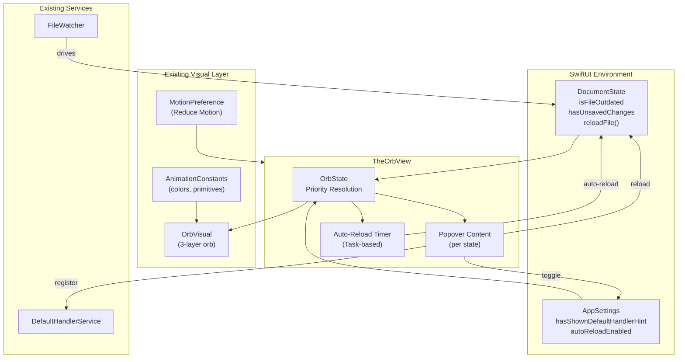
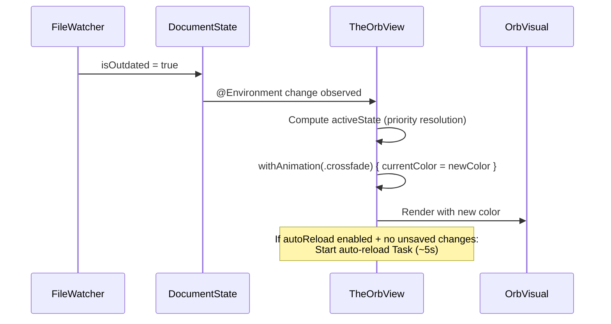
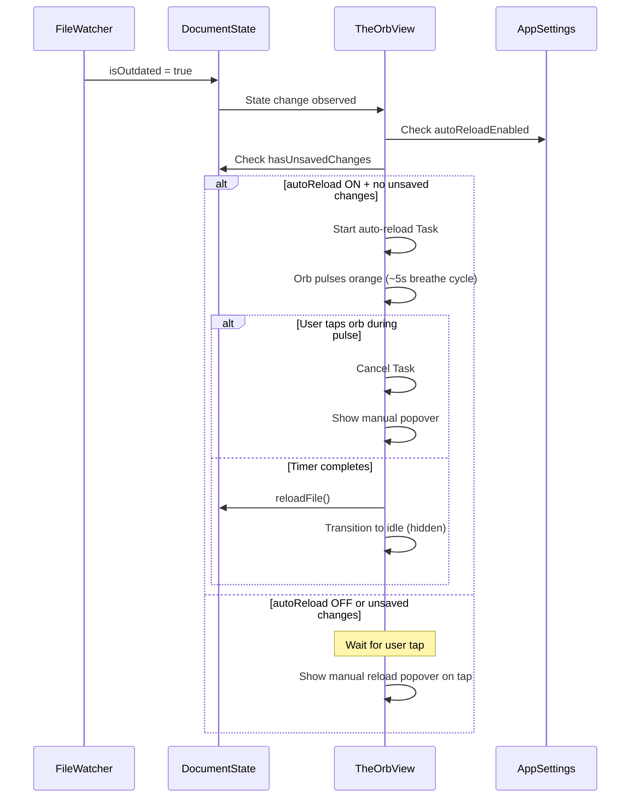

# Design: The Orb

**Feature ID**: the-orb
**Version**: 1.0.0
**Created**: 2026-02-10

## 1. Design Overview

The Orb consolidates two existing separate indicator views (`FileChangeOrbView` and `DefaultHandlerHintView`) into a single unified `TheOrbView` driven by an enum state machine (`OrbState`). The view reads state from the existing `DocumentState` and `AppSettings` environment objects, computes the highest-priority active state, and renders the existing `OrbVisual` component with a state-specific color. Each state provides a tap-to-popover interaction with contextual actions. A new `autoReloadEnabled` preference in `AppSettings` enables a Task-based auto-reload timer for the file-changed state.

### High-Level Architecture



## 2. Architecture

### 2.1 Component Design

The feature follows the existing pattern where orb views are self-contained SwiftUI views in `UI/Components/` that read state from the environment. No separate ViewModel is introduced -- this matches the pattern of `FileChangeOrbView` and `DefaultHandlerHintView`, which manage their own `@State` for animation and popover without a ViewModel layer.

**New Types:**

| Type | Location | Role |
|------|----------|------|
| `OrbState` | `mkdn/UI/Components/OrbState.swift` | Enum with cases + priority + color mapping |
| `TheOrbView` | `mkdn/UI/Components/TheOrbView.swift` | Unified orb view: state resolution, popover dispatch, auto-reload timer |

**Modified Types:**

| Type | Location | Change |
|------|----------|--------|
| `AppSettings` | `mkdn/App/AppSettings.swift` | Add `autoReloadEnabled` Bool property (UserDefaults-backed) |
| `AnimationConstants` | `mkdn/UI/Theme/AnimationConstants.swift` | Add `orbFileChangedColor` and `orbUpdateAvailableColor` constants |
| `ContentView` | `mkdn/App/ContentView.swift` | Replace `FileChangeOrbView` + `DefaultHandlerHintView` blocks with single `TheOrbView` overlay |

**Removed Types:**

| Type | Location | Reason |
|------|----------|--------|
| `FileChangeOrbView` | `mkdn/UI/Components/FileChangeOrbView.swift` | Replaced by TheOrbView |
| `DefaultHandlerHintView` | `mkdn/Features/DefaultHandler/Views/DefaultHandlerHintView.swift` | Replaced by TheOrbView |

### 2.2 State Resolution Sequence



### 2.3 Auto-Reload Sequence



## 3. Detailed Design

### 3.1 OrbState Enum

```swift
/// Represents the possible states of the unified orb indicator.
/// Cases are ordered by display priority (highest first).
enum OrbState: Comparable {
    case idle
    case updateAvailable
    case defaultHandler
    case fileChanged

    /// Whether the orb should be visible in this state.
    var isVisible: Bool {
        self != .idle
    }

    /// The color associated with this state.
    var color: Color {
        switch self {
        case .idle: AnimationConstants.orbDefaultHandlerColor // unused, fallback
        case .defaultHandler: AnimationConstants.orbDefaultHandlerColor
        case .fileChanged: AnimationConstants.orbFileChangedColor
        case .updateAvailable: AnimationConstants.orbUpdateAvailableColor
        }
    }
}
```

Priority is encoded via `Comparable` conformance through raw case ordering. `fileChanged` (last case) has the highest natural ordering. The `activeState` computed property uses `max()` across all active states.

### 3.2 State Resolution Logic

The `TheOrbView` computes the active state as a derived value from the environment:

```swift
/// Computes the highest-priority active orb state.
private var activeState: OrbState {
    var states: [OrbState] = []

    if documentState.isFileOutdated {
        states.append(.fileChanged)
    }
    if !appSettings.hasShownDefaultHandlerHint {
        states.append(.defaultHandler)
    }
    // Placeholder: updateAvailable would be appended from a future flag

    return states.max() ?? .idle
}
```

### 3.3 Auto-Reload Timer

The auto-reload timer uses structured concurrency (`Task.sleep`). The Task reference is stored in `@State` for cancellation:

```swift
@State private var autoReloadTask: Task<Void, Never>?
```

**Timer lifecycle:**
- **Start**: When `activeState == .fileChanged` AND `appSettings.autoReloadEnabled` AND `!documentState.hasUnsavedChanges`
- **Cancel on**: user tap (show manual popover), view disappear, state change away from fileChanged
- **Reset on**: new file-change event during active countdown (re-observed via `onChange(of: documentState.isFileOutdated)`)
- **Complete**: calls `documentState.reloadFile()`, which clears `isFileOutdated` via re-watch, transitioning state to idle

**Duration**: One full `breathe` cycle = ~5 seconds (2.5s half-cycle x 2). The timer uses `Task.sleep(for: .seconds(5))` with a tolerance matching NFR-3 (500ms acceptable).

### 3.4 AppSettings Extension

```swift
// New UserDefaults key
private let autoReloadEnabledKey = "autoReloadEnabled"

// New property in AppSettings
public var autoReloadEnabled: Bool {
    didSet {
        UserDefaults.standard.set(autoReloadEnabled, forKey: autoReloadEnabledKey)
    }
}

// In init():
autoReloadEnabled = UserDefaults.standard.bool(forKey: autoReloadEnabledKey)
```

This follows the exact pattern of `hasShownDefaultHandlerHint`.

### 3.5 New Color Constants

Added to `AnimationConstants`:

```swift
// MARK: - Orb Colors

/// Solarized violet (#6c71c4) -- default handler prompt.
static let orbDefaultHandlerColor = Color(red: 0.424, green: 0.443, blue: 0.769)

/// Solarized orange (#cb4b16) -- file changed on disk.
static let orbFileChangedColor = Color(red: 0.796, green: 0.294, blue: 0.086)

/// Solarized green (#859900) -- update available (placeholder).
static let orbUpdateAvailableColor = Color(red: 0.522, green: 0.600, blue: 0.000)
```

The existing `orbGlowColor` is renamed to `orbDefaultHandlerColor`. The existing `fileChangeOrbColor` (cyan) is replaced with the orange color per requirements. Deprecated aliases are added for the old names.

### 3.6 Color Crossfade Mechanism

When the `activeState` changes, the color transitions via `withAnimation`:

```swift
.onChange(of: activeState) { oldState, newState in
    let newColor = newState.color
    withAnimation(motion.resolved(.crossfade)) {
        currentColor = newColor
    }
}
```

The `currentColor` is a `@State var currentColor: Color` that drives OrbVisual's `color` parameter. SwiftUI interpolates Color values within `withAnimation`, producing a smooth crossfade in the RadialGradient fills.

### 3.7 Popover Content Per State

Each state has its own popover content, switched within a single `.popover` modifier:

- **defaultHandler**: "Would you like to make mkdn your default Markdown reader?" + Yes/No buttons. Same content as current `DefaultHandlerHintView`.
- **fileChanged**: "There are changes to this file. Would you like to reload?" + Yes/No buttons + Toggle for auto-reload. Extends current `FileChangeOrbView` popover.
- **updateAvailable**: "An update is available." + informational text only. Placeholder.

All popovers use the existing entrance animation pattern (scaleEffect + opacity with `springSettle` or `reducedCrossfade`).

### 3.8 ContentView Integration

The ContentView ZStack overlay section is simplified from three conditional overlays (FileChangeOrbView, ModeTransitionOverlay, DefaultHandlerHintView) to two (TheOrbView, ModeTransitionOverlay):

```swift
// Before: two separate orb overlays with manual priority
if documentState.isFileOutdated {
    FileChangeOrbView() ...
}
if !appSettings.hasShownDefaultHandlerHint, !documentState.isFileOutdated {
    DefaultHandlerHintView() ...
}

// After: single unified orb with internal priority
TheOrbView()
```

The `TheOrbView` handles its own visibility (hidden when idle), positioning (bottom-right with padding), and transition animations internally.

## 4. Technology Stack

| Category | Choice | Rationale |
|----------|--------|-----------|
| Language | Swift 6 | Existing project language |
| UI Framework | SwiftUI | Existing project framework |
| State Management | `@Observable` + `@Environment` | Existing pattern (AppSettings, DocumentState) |
| Persistence | UserDefaults | Existing pattern for AppSettings preferences |
| Concurrency | Swift structured concurrency (Task/async) | Matches existing FileWatcher/concurrency model |
| Animation | AnimationConstants + MotionPreference | Existing animation design language |
| Testing | Swift Testing (@Test, @Suite) | Existing test framework |

No new external dependencies.

## 5. Implementation Plan

| Task | Component | Description | Files |
|------|-----------|-------------|-------|
| T1 | OrbState Enum | Create `OrbState` enum with cases, Comparable conformance, color mapping, visibility | `mkdn/UI/Components/OrbState.swift` (new) |
| T2 | AppSettings Extension | Add `autoReloadEnabled` Bool property with UserDefaults persistence | `mkdn/App/AppSettings.swift` (modify) |
| T3 | Color Constants | Add `orbFileChangedColor`, `orbUpdateAvailableColor` to AnimationConstants. Rename `orbGlowColor` to `orbDefaultHandlerColor` with deprecated alias. Deprecate `fileChangeOrbColor`. | `mkdn/UI/Theme/AnimationConstants.swift` (modify) |
| T4 | TheOrbView | Create unified orb view with: state resolution, OrbVisual delegation, per-state popovers, auto-reload Task timer, color crossfade, hover/cursor feedback, MotionPreference integration, appear/disappear transitions | `mkdn/UI/Components/TheOrbView.swift` (new) |
| T5 | ContentView Update | Remove `FileChangeOrbView` and `DefaultHandlerHintView` overlay blocks. Add single `TheOrbView` overlay. Remove conditional visibility logic (TheOrbView handles internally). | `mkdn/App/ContentView.swift` (modify) |
| T6 | Remove Old Views | Delete `FileChangeOrbView.swift` and `DefaultHandlerHintView.swift` | `mkdn/UI/Components/FileChangeOrbView.swift` (delete), `mkdn/Features/DefaultHandler/Views/DefaultHandlerHintView.swift` (delete) |
| T7 | Unit Tests | Test OrbState priority ordering, OrbState color mapping, AppSettings autoReloadEnabled default and persistence | `mkdnTests/Unit/UI/OrbStateTests.swift` (new), `mkdnTests/Unit/App/AppSettingsTests.swift` (new or modify) |

## 6. Implementation DAG

**Parallel Groups** (tasks with no inter-dependencies):

1. [T1, T2, T3] - Independent data model / constants with no shared dependencies
2. [T4, T7] - T4 assembles the view using T1/T2/T3; T7 tests T1/T2 logic. T7 does not depend on T4.
3. [T5] - ContentView integration requires TheOrbView from T4
4. [T6] - Deletion safe only after ContentView no longer references old views

**Dependencies**:

- T4 -> [T1, T2, T3] (interface: TheOrbView uses OrbState enum, reads autoReloadEnabled, uses color constants)
- T5 -> T4 (interface: ContentView references TheOrbView)
- T6 -> T5 (sequential: old views must not be referenced before deletion)
- T7 -> [T1, T2] (interface: tests OrbState and AppSettings types)

**Critical Path**: T1 -> T4 -> T5 -> T6

## 7. Testing Strategy

### 7.1 Test Value Assessment

| Test | Value | Traces To |
|------|-------|-----------|
| OrbState priority ordering (fileChanged > defaultHandler > updateAvailable > idle) | HIGH - business logic | REQ-02 |
| OrbState color mapping returns correct color per state | MEDIUM - data mapping | REQ-01 |
| OrbState.idle.isVisible returns false, others return true | MEDIUM - business logic | REQ-01 |
| AppSettings.autoReloadEnabled defaults to false | HIGH - business rule | REQ-06, BR-01 |
| AppSettings.autoReloadEnabled persists across init cycles | MEDIUM - integration | REQ-06 |
| State resolution returns highest-priority active state | HIGH - business logic | REQ-02, BR-04 |
| Auto-reload guard: hasUnsavedChanges prevents auto-reload | HIGH - data safety | REQ-07 |

### 7.2 Tests NOT Designed

| Skipped Test | Reason |
|---|---|
| SwiftUI popover presentation | Framework behavior verification |
| withAnimation Color interpolation | Framework feature validation |
| UserDefaults.standard.bool(forKey:) | Library behavior verification |
| Task.sleep cancellation mechanics | Language primitive testing |

### 7.3 Unit Tests

```swift
@Suite("OrbState")
struct OrbStateTests {
    @Test("Priority ordering: fileChanged is highest")
    func priorityOrdering() {
        #expect(OrbState.fileChanged > .defaultHandler)
        #expect(OrbState.defaultHandler > .updateAvailable)
        #expect(OrbState.updateAvailable > .idle)
    }

    @Test("Only idle is not visible")
    func visibility() {
        #expect(!OrbState.idle.isVisible)
        #expect(OrbState.defaultHandler.isVisible)
        #expect(OrbState.fileChanged.isVisible)
        #expect(OrbState.updateAvailable.isVisible)
    }

    @Test("Max of multiple active states returns highest priority")
    func maxResolution() {
        let states: [OrbState] = [.defaultHandler, .fileChanged]
        #expect(states.max() == .fileChanged)
    }
}
```

### 7.4 Existing Test Impact

- **AnimationComplianceTests**: Tests that reference orb pulse animations may need updating if they reference `FileChangeOrbView` by name. The orb visual (`OrbVisual`) is unchanged, so pixel-level animation tests should remain valid.
- **DefaultHandlerServiceTests**: Tests `DefaultHandlerService` in isolation -- unaffected by view changes.

## 8. Deployment Design

No special deployment considerations. This is a UI refactor within the existing app binary:

- No new SPM dependencies to resolve
- No new entitlements or capabilities required
- No data migration needed (new UserDefaults key; absence = false = correct default)
- Feature is immediately active after build; no feature flags needed
- The green "update available" state is a code-level placeholder with no runtime trigger outside of testing

## 9. Documentation Impact

| Type | Target | Section | KB Source | Rationale |
|------|--------|---------|-----------|-----------|
| edit | `.rp1/context/modules.md` | UI Components | modules.md:UI Components | Replace FileChangeOrbView and DefaultHandlerHintView entries with TheOrbView and OrbState entries |
| edit | `.rp1/context/modules.md` | App Layer | modules.md:App Layer | Document new autoReloadEnabled property on AppSettings |
| edit | `.rp1/context/patterns.md` | Animation Pattern | patterns.md:Animation Pattern | Add orbFileChangedColor and orbUpdateAvailableColor to orb colors documentation |
| edit | `.rp1/context/architecture.md` | System Overview | architecture.md:System Overview | Update ASCII diagram to show TheOrbView instead of separate indicator views |

## 10. Design Decisions Log

| ID | Decision | Choice | Rationale | Alternatives Considered |
|----|----------|--------|-----------|------------------------|
| D1 | State machine host | Computed property in TheOrbView (no separate ViewModel) | Matches existing FileChangeOrbView/DefaultHandlerHintView pattern where views compute state from environment directly. Avoids over-engineering for a simple priority computation. | Separate OrbViewModel @Observable class -- rejected as the state derivation is a pure function of existing environment objects. |
| D2 | OrbState priority encoding | Comparable via enum case ordering | Zero-cost, compiler-enforced, requires no raw values or manual comparison. Cases ordered low-to-high so `.max()` returns the highest priority. | Raw Int values -- rejected as redundant given Comparable synthesis. Dictionary lookup -- rejected as less type-safe. |
| D3 | Auto-reload timer mechanism | Task.sleep (structured concurrency) | Matches the project's concurrency model (FileWatcher uses Task, DocumentState is @MainActor). Cancellation is built into Task. | Timer.scheduledTimer -- rejected as Combine/imperative, inconsistent with async patterns. DispatchQueue.asyncAfter -- rejected for same reason. |
| D4 | File-changed orb color | Solarized orange (#cb4b16) | Requirements specify "orange." Solarized orange is the canonical warm alert color in the palette. Provides strong contrast against both dark and light Solarized backgrounds. | Solarized yellow (#b58900) -- rejected, less distinct from green. Keep existing cyan -- rejected, requirements explicitly say "orange." |
| D5 | Update-available orb color | Solarized green (#859900) | Requirements specify "green." Solarized green conveys positive/available status. Harmonizes with palette. | Solarized cyan -- rejected, too close to the old file-change color; could confuse returning users. |
| D6 | Popover auto-reload toggle widget | SwiftUI Toggle | Native macOS control, self-explanatory, compact. Fits within the existing popover layout pattern (VStack with padding). | Checkbox -- rejected, Toggle is more idiomatic SwiftUI. Text button -- rejected, less discoverable for a persistent preference. |
| D7 | Color crossfade mechanism | withAnimation(.crossfade) on @State color change | Leverages SwiftUI's built-in Color interpolation. OrbVisual already accepts color as a parameter; no visual component changes needed. | Overlay two OrbVisuals and crossfade opacity -- rejected as more complex, only needed if gradient interpolation fails (see HYP-001). |
| D8 | TheOrbView position | Anchored bottom-right via `.frame(maxWidth:maxHeight:alignment:.bottomTrailing).padding(16)` | Matches existing FileChangeOrbView positioning in ContentView. Consistent with REQ-11. | Top-right (current DefaultHandlerHintView position) -- rejected per REQ-11 which specifies bottom-right for all states. |
