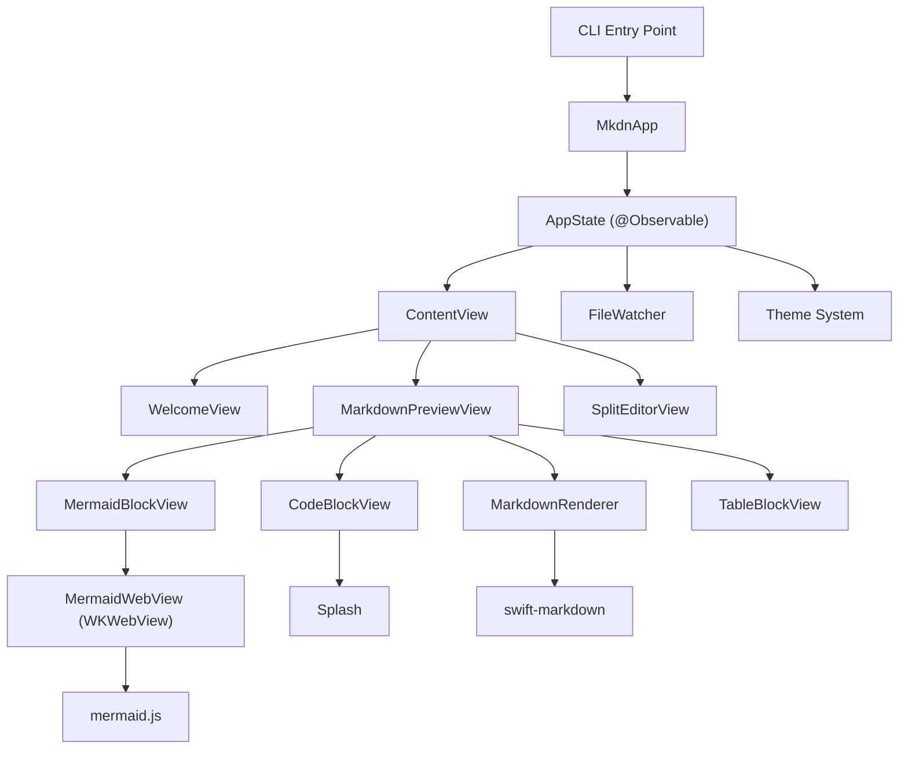
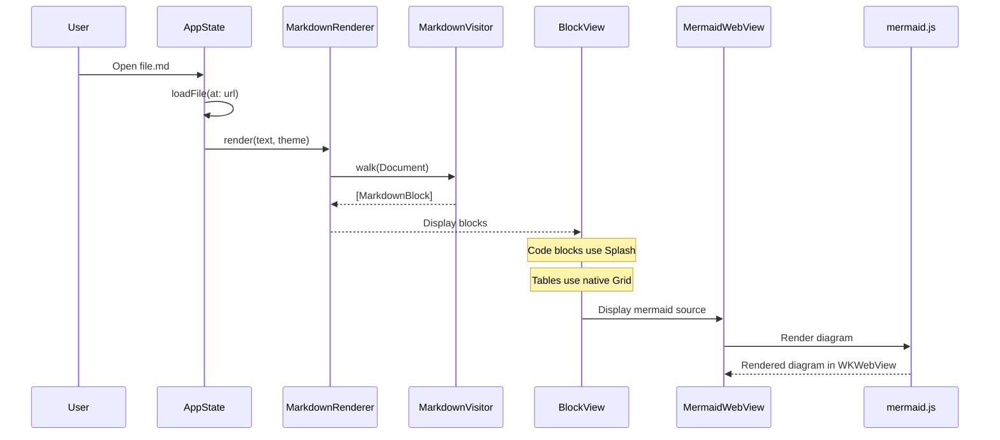

# mkdn

**A Mac-native Markdown viewer built entirely in SwiftUI.**

No Electron. No compromise. Native SwiftUI rendering for all Markdown -- headings, code blocks, tables, and more -- with lightweight embedded web views only for Mermaid diagrams. macOS 14+.

Open this file in mkdn to see every feature in action.

---

## Why mkdn?

Most Markdown previewers are web browsers in disguise. mkdn takes a different path: every Markdown element is rendered by SwiftUI. Mermaid diagrams render in lightweight embedded web views -- one per diagram, shared process pool, no network requests. The result is a viewer that launches instantly, scrolls at 120fps, and feels like it belongs on your Mac.

---

## Features

### Native Rendering

Every Markdown element -- headings, paragraphs, lists, blockquotes, tables, thematic breaks, images, and inline formatting -- is parsed by Apple's [swift-markdown](https://github.com/apple/swift-markdown) library and rendered as native SwiftUI views. No HTML. No CSS. No DOM.

### Mermaid Diagrams

Flowcharts, sequence diagrams, state machines, class diagrams, and ER diagrams render in lightweight embedded web views:

1. Each diagram gets its own `WKWebView` with bundled `mermaid.js` -- no network requests
2. All diagram web views share a single `WKProcessPool` for efficiency
3. Click a diagram to activate pinch-to-zoom and pan
4. Press Escape to deactivate

### Syntax Highlighting

Fenced code blocks display with language-aware highlighting powered by [Splash](https://github.com/JohnSundell/Splash). Swift code gets full token-level coloring (keywords, types, strings, numbers, comments, properties). Other languages render as clean monospace text with theme-appropriate colors.

```swift
@Observable
final class AppState {
    var currentFileURL: URL?
    var markdownContent = ""
    var viewMode: ViewMode = .previewOnly

    func loadFile(at url: URL) throws {
        let content = try String(contentsOf: url, encoding: .utf8)
        currentFileURL = url
        markdownContent = content
        fileWatcher.watch(url: url)
    }
}
```

### Solarized Theming

Two carefully tuned themes -- Solarized Dark and Solarized Light -- with an Auto mode that follows macOS system appearance. Theme changes crossfade smoothly. Every color in the app, from heading tints to code block backgrounds to table row stripes, is defined in a single `ThemeColors` struct.

| Mode | Behavior |
|:-----|:---------|
| Auto | Follows macOS light/dark appearance in real time |
| Dark | Solarized Dark, always |
| Light | Solarized Light, always |

### Chrome-less Window

mkdn hides the traffic lights, title bar, and all standard window chrome. The window is draggable by its background and fully resizable. What remains is just your content -- clean, focused, distraction-free.

### Breathing Orb

When the file changes on disk (edited in Vim, saved by a script, updated by git), a small orb pulses gently in the bottom-right corner. No modal dialogs. No alerts. Just a calm, breathing indicator that something changed. Press Cmd+R to reload.

### Mode Overlay

Switching between Preview and Edit modes triggers an ephemeral overlay that springs in, displays the mode name briefly, then fades away. Subtle feedback without interruption.

### Side-by-Side Editing

Toggle between a full-width preview for reading and a split view with a live editor alongside the rendered output. Edits are reflected immediately. Unsaved changes are tracked; Cmd+S writes back to disk.

### File Watching

A kernel-level `DispatchSource` monitors the open file for changes. When another process writes to it, the breathing orb appears. Watching is paused during saves to avoid false triggers, then resumed automatically.

### CLI Integration

Launch from any terminal:

```bash
mkdn path/to/file.md
```

Built with Swift Argument Parser. Invalid paths produce clear error messages to stderr with appropriate exit codes.

### Drag and Drop

Drop any `.md` or `.markdown` file onto the window to open it. No file picker required.

---

## Architecture

mkdn follows **Feature-Based MVVM** with a two-target SPM layout:

- **mkdnLib** -- library target containing all source code
- **mkdn** -- thin executable target with the entry point

This split avoids the `@main` crash that occurs when running Swift Testing against executable targets.



### Rendering Pipeline



---

## Keyboard Shortcuts

| Shortcut | Action |
|:---------|:-------|
| Cmd+O | Open a Markdown file |
| Cmd+S | Save current edits |
| Cmd+R | Reload file from disk |
| Cmd+1 | Switch to Preview mode |
| Cmd+2 | Switch to Edit mode |
| Cmd+T | Cycle theme (Auto / Dark / Light) |
| Escape | Deactivate Mermaid diagram zoom |

---

## Supported Markdown Elements

mkdn renders the full CommonMark spec natively:

- **Headings** (levels 1-6)
- **Paragraphs** with inline formatting (**bold**, *italic*, `code`, ~~strikethrough~~, [links](https://example.com))
- **Fenced code blocks** with language tags and syntax highlighting
- **Mermaid diagrams** (flowchart, sequence, state, class, ER)
- **Blockquotes**
- **Ordered and unordered lists**
- **Tables** with column alignment
- **Thematic breaks**
- **Images**

> mkdn is built for developers who live in the terminal and want their Markdown to look beautiful without leaving the native Mac experience.

---

## Supported Mermaid Diagrams

| Type | Keyword |
|:-----|:--------|
| Flowchart | `flowchart` or `graph` |
| Sequence Diagram | `sequenceDiagram` |
| State Diagram | `stateDiagram` or `stateDiagram-v2` |
| Class Diagram | `classDiagram` |
| ER Diagram | `erDiagram` |

---

## Install

### Homebrew

```bash
brew install --cask mkdn
```

### Build from Source

Requires macOS 14.0+ (Sonoma) and Xcode 16+ / Swift 6.

```bash
git clone https://github.com/jud/mkdn.git
cd mkdn
swift build
```

### Run

```bash
swift run mkdn path/to/file.md
```

Or open the Xcode project and run the mkdn scheme.

### Test

```bash
swift test
```

### Lint and Format

```bash
swiftlint lint
swiftformat .
```

---

## Project Structure

```
mkdn/
  App/                  Entry point, AppState, commands
  Features/
    Viewer/             Markdown preview (Views/, ViewModels/)
    Editor/             Side-by-side editing (Views/, ViewModels/)
    Theming/            Theme picker
  Core/
    Markdown/           swift-markdown parsing + SwiftUI rendering
    Mermaid/            WKWebView + mermaid.js diagram rendering
    FileWatcher/        Kernel-level file change detection
    CLI/                Argument parsing and validation
  UI/
    Components/         WelcomeView, BreathingOrb, ModeOverlay, WindowAccessor
    Theme/              Solarized color palettes, ThemeMode, AnimationConstants
  Resources/            mermaid.min.js bundle

mkdnEntry/
  main.swift            Thin executable entry point

mkdnTests/
  Unit/                 Swift Testing suites
```

---

## Dependencies

| Package | Purpose |
|:--------|:--------|
| [swift-markdown](https://github.com/apple/swift-markdown) | Markdown AST parsing |
| [Splash](https://github.com/JohnSundell/Splash) | Swift syntax highlighting |
| [swift-argument-parser](https://github.com/apple/swift-argument-parser) | CLI argument handling |

---

## Design Philosophy

1. **Native over web.** Every Markdown element is rendered in SwiftUI. WKWebView is used only for Mermaid diagrams -- one per diagram, no network requests.
2. **Keyboard-first.** Every action has a shortcut. The mouse is optional.
3. **Calm feedback.** No modal alerts. A breathing orb for file changes. An ephemeral overlay for mode switches. Animations that feel physical, not decorative.
4. **Terminal-friendly.** Launch from the command line, edit in your terminal editor, preview in mkdn. The file watcher keeps everything in sync.
5. **Honest rendering.** What you see in mkdn is what swift-markdown parses. No custom extensions, no magic transformations.

---

## License

Private project.
