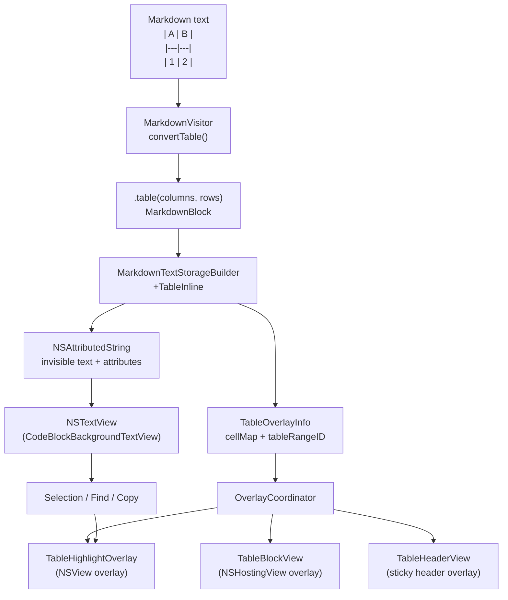

# Table Rendering Pipeline

## What This Is

mkdn renders Markdown tables as interactive, selectable, copyable visual elements inside a single continuous `NSTextView`. The fundamental challenge: tables are inherently two-dimensional structures, but `NSTextView` is a linear text container. You can't put a grid inside a text view and still have native text selection flow continuously from a paragraph, through table cells, into the next paragraph.

The solution is a dual-layer architecture. The table exists as *invisible text* inside the `NSTextStorage` -- real characters with `.foregroundColor: .clear` that participate in native TextKit 2 selection, find, and clipboard operations. On top of that invisible text, a SwiftUI overlay (`TableBlockView` in an `NSHostingView`) provides the visual rendering: rounded borders, alternating row backgrounds, bold headers, and content-aware column widths. A third layer (`TableHighlightOverlay`) draws cell-level selection and find highlights on top of everything.

This three-layer stack gives you the best of both worlds: native macOS text behaviors (Cmd+A, Cmd+C, Cmd+F, click-drag selection, shift-click range extension) work exactly as users expect, while the visual presentation looks like a proper table. The trade-off is complexity -- you're maintaining three synchronized representations of the same data, and the height of the invisible text region must match the height of the visual overlay pixel-for-pixel, or content below the table drifts out of position.

## How It Works

### The Pipeline at a Glance

A table starts as Markdown syntax, gets parsed into a domain model, rendered as invisible inline text with metadata attributes, overlaid with a SwiftUI visual view, and finally wired up for selection, find, copy, and print through five separate code paths.

*The table goes from markdown text to three synchronized visual layers: invisible inline text for text operations, a SwiftUI overlay for visual rendering, and an NSView overlay for selection/find highlights.*

### Stage 1: Parsing (MarkdownVisitor)

`MarkdownVisitor.convertTable()` (line 102 of `MarkdownVisitor.swift`) walks the swift-markdown `Table` AST node and produces a `MarkdownBlock.table(columns:rows:)` value. Each column carries an `AttributedString` header and a `TableColumnAlignment` (left/center/right, derived from the Markdown colon syntax). Each row is an array of `AttributedString` cells. Inline formatting (bold, italic, links, code) is preserved in the `AttributedString` runs -- the visitor calls `inlineText(from:)` recursively for each cell, so a cell containing `**bold** text` produces a properly attributed string.

The result is a flat, framework-agnostic data model: `[TableColumn]` and `[[AttributedString]]`. No rendering decisions have been made yet.

### Stage 2: Invisible Text Generation (MarkdownTextStorageBuilder+TableInline)

This is where the core trick happens. `appendTableInlineText(to:...)` takes the parsed table data and appends it to the `NSMutableAttributedString` as real text -- but with the foreground color set to `.clear`. The text is tab-separated within rows and newline-separated between rows, structured so that TextKit 2's paragraph layout engine lays out each row as one paragraph.

The method does several things in sequence:

1. **Column width computation**: Calls `TableColumnSizer.computeWidths()` at a default estimation width of 600pt. This gives initial column widths that will be corrected later when the actual container width is known.

2. **Row height estimation**: For each row, measures cell content against column widths using `NSAttributedString.boundingRect(with:options:)` to predict text wrapping. Each row's paragraph style gets `minimumLineHeight = maximumLineHeight = estimatedHeight`, which forces TextKit 2 to allocate exactly that much vertical space per row.

3. **Cell entry recording**: As each cell is appended, its character offset (relative to the table's start in the text storage) is recorded as a `TableCellMap.CellEntry`. This is how the system later maps a character offset from a click or selection range back to a specific cell position.

4. **Attribute tagging**: Every character in the table's invisible text gets four custom attributes:
   - `TableAttributes.range` -- a UUID string identifying this table instance
   - `TableAttributes.cellMap` -- a `TableCellMap` object (same instance on every character)
   - `TableAttributes.colors` -- a `TableColorInfo` with resolved theme colors
   - `TableAttributes.isHeader` -- an `NSNumber(true)` on header row characters only

5. **Tab stop construction**: `buildTableTabStops()` creates `NSTextTab` objects at cumulative column positions with the correct alignment (left/center/right). These tab stops control how TextKit 2 positions the tab-separated cell content horizontally -- even though the text is invisible, its layout determines the text storage geometry that the overlay must match.

6. **TableOverlayInfo emission**: A `TableOverlayInfo` struct is appended to the builder's output, carrying the block index, the table range UUID, and the `TableCellMap`. This is what the `OverlayCoordinator` uses to create and position the visual overlay.

The `TableCellMap` is the key data structure here. It's an `NSObject` subclass (required for `NSAttributedString` attribute storage) containing all cells sorted by character offset, with O(log n) binary search for point-to-cell lookup and O(n) range intersection for selection-to-cell mapping. It also carries the column widths, row heights, column definitions, and methods for generating clipboard content (tab-delimited text and RTF table markup).

### Stage 3: Visual Overlay (TableBlockView + OverlayCoordinator)

When `SelectableTextView.refreshOverlays()` fires, it passes the `TextStorageResult.tableOverlays` array to `OverlayCoordinator.updateTableOverlays()`. For each table:

1. **Overlay creation**: `makeTableOverlayView()` wraps a `TableBlockView` (SwiftUI) in a `PassthroughHostingView` (an `NSHostingView` subclass that returns `nil` from `hitTest()` so all mouse events pass through to the text view). The `TableBlockView` receives the `OverlayContainerState` through SwiftUI's environment, which provides the actual container width for column sizing.

2. **Height precomputation**: Before the overlay is added to the text view, `precomputeVisualHeight()` forces SwiftUI layout by temporarily giving the hosting view a large frame offscreen, calling `layoutSubtreeIfNeeded()`, and reading `fittingSize.height`. This precomputed height is stored in `pendingVisualHeights` and applied to the invisible text's paragraph styles *before* the overlay enters the viewport, preventing the flash-of-wrong-height that would otherwise occur.

3. **Highlight overlay creation**: A `TableHighlightOverlay` (a plain `NSView` with `hitTest() -> nil`) is created as a sibling of the visual overlay, positioned `.above` it. This draws the selection and find highlights.

4. **Position index building**: `buildPositionIndex(from:)` scans the entire text storage once, building a `tableRangeIndex: [String: NSRange]` dictionary that maps table range UUIDs to their character ranges. This avoids O(n) enumeration on every reposition.

5. **Text-range positioning**: `positionTextRangeEntry()` calculates the overlay frame by enumerating TextKit 2 layout fragments for the table's character range and unioning their frames. The overlay is positioned at `(textContainerOrigin.x, fragmentRect.y + textContainerOrigin.y)` with width from the SwiftUI view's preferred width.

### Stage 4: Height Negotiation (OverlayCoordinator+TableHeights)

This is the trickiest part of the system. The invisible text and the visual overlay must have exactly the same height. If they don't, everything below the table shifts vertically.

The problem: the text storage builder estimates row heights at a fixed 600pt width. The actual container might be wider (less text wrapping, shorter rows) or narrower (more wrapping, taller rows). And SwiftUI's `Text` view, which renders the visual table cells, may compute slightly different line heights than `NSAttributedString.boundingRect()`.

The solution is a multi-stage correction:

1. **Initial correction** (`adjustTableRowHeights`): When `updateTableOverlays()` runs, it recomputes column widths and row heights using the *actual* container width via `correctedGeometry()`. Then `applyRowHeights()` walks the text storage paragraph-by-paragraph within the table range and updates `minimumLineHeight`/`maximumLineHeight` on each paragraph style to match the corrected heights. It also updates the tab stops for the new column widths.

2. **Visual height feedback** (`applyVisualHeight`): When `TableBlockView` reports its SwiftUI-measured size via `onGeometryChange`, `updateTablePreferredSize()` calls `applyVisualHeight()`. This takes the SwiftUI-reported total height and *distributes it proportionally* across all rows using `distributeHeights()`. The floor-based distribution ensures the sum exactly matches the target, with any rounding remainder added to the last row. This writes the distributed heights back to the paragraph styles.

3. **Convergence guard**: `applyVisualHeight` checks `lastAppliedVisualHeight` and skips the update if the new height is within 2pt of the last applied height. Without this, you get a feedback loop: height change triggers layout invalidation, which triggers the SwiftUI view to re-measure, which reports a slightly different height, which triggers another layout invalidation, and so on.

4. **Layout invalidation**: After modifying paragraph styles, `invalidateTableLayout()` invalidates the TextKit 2 layout from the table's position through the end of the document, then forces a viewport layout pass. This ensures content below the table repositions correctly.

### Stage 5: Selection and Interaction

**Selection tracking**: `CodeBlockBackgroundTextView` overrides `setSelectedRanges()` to call the `selectionDragHandler` closure, which is wired to `OverlayCoordinator.updateTableSelections()`. This method takes the NSTextView's selection range, intersects it with each table's character range, converts the intersection to a relative offset, and calls `cellMap.cellsInRange()` to get the set of selected cell positions. These are assigned to `TableHighlightOverlay.selectedCells`, and `needsDisplay = true` triggers a redraw.

**Selection highlight suppression**: NSTextView draws its native selection background (accent color at 0.3 alpha) for ALL selected text, including the invisible table text. This creates a colored rectangle where the invisible text lives, bleeding beyond the table overlay. `eraseTableSelectionHighlights(in:)` -- called from `draw(_:)` after `super.draw()` -- fills the table text regions with the document background color, erasing the native highlight. Only the cell-level highlights from `TableHighlightOverlay` remain visible.

**Table range caching**: `resolveTableRanges()` caches the `[String: NSRange]` mapping of table IDs to their character ranges, invalidated on `didChangeText()` and `setFrameSize()`. This avoids re-enumerating attributes on every draw cycle.

**Find integration**: When find is active, `SelectableTextView.Coordinator.handleFindUpdate()` calls `overlayCoordinator.updateTableFindHighlights(matchRanges:currentIndex:)`. This intersects each find match range with each table's character range and maps matches to cell positions. `TableHighlightOverlay` draws passive matches in a light find color and the current match in a stronger find color.

**Sticky headers**: `OverlayCoordinator.handleScrollBoundsChange()` observes the scroll view's clip view bounds. For tables taller than the visible viewport, when the header row has scrolled above the viewport but the table body is still visible, a separate `TableHeaderView` NSHostingView is created and positioned at the viewport top. It uses the same `columns` and `columnWidths` to render an identical header. When the user scrolls past the table or back to where the real header is visible, the sticky header hides.

### Stage 6: Copy and Print

**Copy** (`CodeBlockBackgroundTextView+TableCopy`): When `copy(_:)` fires, `handleTableCopy()` checks whether the selection intersects any table text (via `TableAttributes.cellMap` attribute enumeration). If it does, it builds a *mixed clipboard* that handles the general case where a selection spans paragraph text, a table, and more paragraph text:

- Collects `TableSegment` objects for each table in the selection
- Walks the selection range, alternating between plain text spans and table spans
- For plain text: appends verbatim to the string, wraps in `\pard` RTF paragraphs
- For table spans: converts to tab-delimited text for the string, and `\trowd`/`\cell`/`\row` RTF markup for rich text
- Places both `.rtf` and `.string` types on the pasteboard

This means pasting into a rich text editor gives you a formatted table, while pasting into a terminal or spreadsheet gives you tab-delimited data.

**Print** (`CodeBlockBackgroundTextView+TablePrint`): During Cmd+P, the text storage is rebuilt with `isPrint: true`, which makes the table text *visible* (foreground color from the PrintPalette instead of `.clear`). Since the SwiftUI overlay isn't present in the print rendering pipeline, `drawTableContainers(in:)` draws the visual table structure (rounded border, header background, alternating row fills, header-body divider) directly using `NSBezierPath`. This method is guarded by `NSPrintOperation.current != nil`, so it's a no-op during normal screen rendering.

## Why It's Like This

The invisible-text-with-overlay approach was not the first attempt. The git history tells the story:

The initial implementation (`8734b88`, the `smart-tables` feature) created `TableBlockView` as a pure SwiftUI view positioned over an `NSTextAttachment` placeholder -- the same pattern used for Mermaid diagrams and images. This worked for visual rendering but tables were dead zones for selection and search. You could click-drag a selection from a paragraph above a table to a paragraph below it, but the table content was unreachable.

The `table-cross-cell-selection` feature (`34f641d` through `876333e`) introduced the dual-layer architecture. The key commits:
- `T1` (`34f641d`): Created `TableAttributes`, `TableCellMap`, and `TableColorInfo` -- the metadata infrastructure
- `T2` (`c0891a0`): Rewrote the builder to emit invisible inline text instead of attachment placeholders
- `T3` (`ecfbff0`): Extended `OverlayCoordinator` for text-range-based positioning (tables can't use attachment positioning since they're not attachments anymore)
- `T4` (`031a4ac`): Added `TableHighlightOverlay` for cell-level selection drawing
- `T5` (`0dbce8d`): Built the table-aware copy handler with RTF + TSV output
- `T7` (`876333e`): Added print-time table container rendering

After the initial implementation, a series of fixes addressed real-world issues:
- **The gap fix** (`1ee3a52`): Tables following headings had a vertical gap because the builder didn't account for paragraph spacing at the boundary between non-table and table content
- **Selection highlight suppression** (`fbf0dc1`): The native NSTextView selection background bled through the invisible text, creating visible colored rectangles that didn't correspond to the table's visual boundaries
- **Real-time drag highlighting** (`a242efd`): Selection highlights initially only updated when the mouse was released; wiring `setSelectedRanges()` to the overlay coordinator enabled real-time updates during drag
- **Click-through** (`90fe400`): The `NSHostingView` was intercepting mouse events, so you couldn't click on table text to position the insertion point; switching to `PassthroughHostingView` with `hitTest() -> nil` fixed this
- **Height drift in dense sections** (`b390ee6`, `3dba10c`, `e3097c0`): Tables whose estimated heights didn't match their visual heights caused cumulative y-offset drift in documents with many tables. The fix was multi-pronged: precomputing visual heights before adding overlays, the convergence guard on `applyVisualHeight`, and forced layout reconciliation through the viewport
- **Beach ball on selection** (`0dd127c`): Selecting large amounts of text in table-heavy documents caused a hang because table range resolution was re-enumerating the entire text storage on every draw. Caching (`cachedTableRanges`, `isTableRangeCacheValid`) eliminated the repeated enumeration
- **Sticky header + resize** (`4476a06`): Resizing the window invalidated column widths but didn't rebuild sticky headers or tab stops, causing misaligned headers and visual drift

## Where the Complexity Lives

**Height negotiation is the hardest part.** The invisible text's paragraph heights must match the SwiftUI overlay's actual rendered height, but the two systems measure text differently. `NSAttributedString.boundingRect()` and SwiftUI `Text.fixedSize(horizontal: false, vertical: true)` can disagree by a few points on wrapped text. The `distributeHeights` + convergence guard mechanism handles this, but it's fundamentally an approximation-then-correction loop. If you change anything about font metrics, padding constants, or the way heights are estimated, you risk re-introducing drift.

**The convergence guard (2pt threshold) is load-bearing.** Without it, `applyVisualHeight` and the SwiftUI layout system enter a feedback loop: height change -> layout invalidation -> SwiftUI re-measure -> new height report -> height change -> ... The 2pt threshold was determined empirically. If you lower it, you may see oscillation. If you raise it, you may see a visible gap between tables and the content below them.

**The position index must stay in sync.** `buildPositionIndex` scans the text storage for `TableAttributes.range` and `.attachment` attributes and builds dictionaries for O(1) lookup. If the text storage changes and `buildPositionIndex` isn't called before `repositionOverlays`, overlays will be positioned using stale character offsets. The index is rebuilt at the start of `updateTableOverlays` and whenever attachment heights change. Missing a rebuild path causes tables to appear at wrong positions.

**Tab stops and column widths are dual-tracked.** The invisible text uses `NSTextTab` objects for horizontal cell positioning; the visual overlay uses `TableColumnSizer.Result.columnWidths` for `frame(width:)`. Both must agree. When the container width changes (window resize), `adjustTableRowHeights` recalculates column widths and writes new tab stops. If only one side updates, the invisible text geometry and the visual overlay geometry diverge, which breaks selection-to-cell mapping.

**The `ObjectIdentifier` trick in copy.** `collectTableSegments()` uses `ObjectIdentifier` on `TableCellMap` instances to deduplicate. Since the same `TableCellMap` object is stored as an attribute on every character in the table, enumerating `TableAttributes.cellMap` yields it once per attribute run, not once per table. The `ObjectIdentifier` set ensures each physical table appears exactly once in the segments list.

**Print requires a completely separate code path.** The print pipeline rebuilds the `NSAttributedString` with `isPrint: true`, which switches table text from clear to visible foreground. But the SwiftUI overlay isn't present during print -- AppKit's print rendering pipeline doesn't preserve overlay subviews. So `drawTableContainers` in `CodeBlockBackgroundTextView+TablePrint` replicates the entire visual appearance using `NSBezierPath`. If you change the visual style in `TableBlockView`, you must mirror the change in the print drawing code. There's no shared abstraction between them.

## The Grain of the Wood

**Adding a new table visual feature** (new border style, column highlight, hover effect): Start in `TableBlockView.swift` for the visual rendering, then check whether the feature needs a corresponding change in `TableHighlightOverlay` (if it's selection/interaction related) or `CodeBlockBackgroundTextView+TablePrint` (if it should appear in print output).

**Adding a new clipboard format**: Work in `TableCellMap.swift` for the data extraction method, then wire it into `CodeBlockBackgroundTextView+TableCopy.swift` to place it on the pasteboard. The `TableCellMap` has all the content and position data; the copy handler has the pasteboard interaction.

**Changing column sizing behavior**: `TableColumnSizer` is a pure-computation enum with static methods. It's the right place for any changes to how columns are measured or compressed. But be aware that column widths flow into three consumers: the invisible text (tab stops), the visual overlay (cell frames), and the highlight overlay (cell rect calculation). All three reference `cellMap.columnWidths`, which is mutated by `adjustTableRowHeights` and `applyVisualHeight`. Changes to the sizer's algorithm will propagate correctly as long as you don't break the invariant that tab stops, overlay widths, and cellMap widths all reflect the same computation.

**Adding a new table attribute**: Follow the pattern in `TableAttributes.swift` -- add a new `NSAttributedString.Key` with a `mkdn.` prefix. Apply it in `appendTableInlineRow` in the `+TableInline` extension. Consume it wherever needed. The attribute key uniqueness is tested in `TableAttributesTests`.

**iOS tables are a completely different code path.** `TableBlockViewiOS.swift` in `Platform/iOS/` renders tables as a native SwiftUI grid. It shares `TableColumnSizer` for column width computation but doesn't use the invisible text layer, `TableCellMap`, or any of the overlay machinery. This is intentional -- iOS doesn't have the NSTextView/TextKit 2 infrastructure that the dual-layer approach depends on. If you're adding a feature to the macOS table pipeline, check whether the iOS view needs a corresponding (but architecturally different) change.

## Watch Out For

**Don't touch `defaultEstimationContainerWidth` without understanding the cascade.** The builder estimates heights at 600pt. If you change this, the initial estimates diverge further from the actual layout, making the height correction loop work harder. The 600pt value was chosen because it's close to the typical document width, minimizing correction magnitude.

**The `lineBreakMode: .byClipping` on table paragraph styles is intentional.** Without it, TextKit 2 tries to wrap the tab-separated text at word boundaries, which produces completely wrong line heights. Clipping means the invisible text is never word-wrapped -- each row is one line, exactly `rowHeight` tall. Don't change this to `.byWordWrapping` or you'll break the entire height system.

**`cellMap.columnWidths` and `cellMap.rowHeights` are mutable** (`public internal(set) var`). They're updated by `adjustTableRowHeights` and `applyVisualHeight` after the `TableCellMap` is created. This is unusual for a class that's stored as an attributed string value -- normally attribute values are immutable. The mutability is necessary because the actual widths and heights aren't known at build time (they depend on the actual container width and SwiftUI's layout), but the same `TableCellMap` instance must be used throughout the overlay, highlight, and copy systems. If you replace the instance, you'll need to update it everywhere it's referenced.

**The `PassthroughHostingView.layer?.masksToBounds = true` is load-bearing.** Without it, during the height negotiation window (before SwiftUI and the invisible text agree on heights), SwiftUI content can overflow the hosting view's frame and visually bleed into adjacent table regions. The clipping mask hides this transient overflow.

**Table ranges in the position index are unions, not individual runs.** `buildPositionIndex` unions all attribute runs with the same table range UUID into a single `NSRange`. If a table's attribute runs are somehow discontiguous (shouldn't happen, but defensive), the union range will include non-table characters in the middle. The system is designed around the invariant that table attributes are always contiguous.

**Find highlights in tables work at cell granularity, not character granularity.** When Cmd+F matches "Ali" inside an "Alice" cell, the entire cell highlights -- not just the three matching characters. This is a deliberate UX decision documented in the feature blueprint, and `updateFindHighlightsForTable` implements it by mapping match ranges to cell positions rather than drawing character-level highlight rectangles.

## Key Files

| File | What It Is |
|------|------------|
| `mkdn/Core/Markdown/MarkdownVisitor.swift` | AST walking: converts swift-markdown `Table` nodes into `MarkdownBlock.table(columns:rows:)` |
| `mkdn/Core/Markdown/MarkdownBlock.swift` | Domain model: `MarkdownBlock.table`, `TableColumn`, `TableColumnAlignment` |
| `mkdn/Core/Markdown/MarkdownTextStorageBuilder.swift` | Build orchestrator: dispatches `.table` blocks to the `+TableInline` extension |
| `mkdn/Core/Markdown/MarkdownTextStorageBuilder+TableInline.swift` | The invisible text generator: tab-separated cells, paragraph height fixup, `TableCellMap` construction, attribute tagging |
| `mkdn/Core/Markdown/TableCellMap.swift` | The central data structure: binary search cell lookup, range intersection, RTF/TSV export, column/row geometry |
| `mkdn/Core/Markdown/TableColumnSizer.swift` | Pure computation: column width measurement, proportional compression, height estimation |
| `mkdn/Core/Markdown/TableAttributes.swift` | Custom `NSAttributedString.Key` definitions and `TableColorInfo` carrier class |
| `mkdn/Features/Viewer/Views/TableBlockView.swift` | SwiftUI visual rendering: headers, data rows, borders, zebra striping, size reporting |
| `mkdn/Features/Viewer/Views/TableHeaderView.swift` | SwiftUI clone of the header row for sticky header overlays |
| `mkdn/Features/Viewer/Views/TableHighlightOverlay.swift` | NSView for cell-level selection and find highlight drawing with event pass-through |
| `mkdn/Features/Viewer/Views/OverlayCoordinator.swift` | Overlay lifecycle manager: entry tracking, reposition scheduling, layout context |
| `mkdn/Features/Viewer/Views/OverlayCoordinator+TableOverlays.swift` | Table overlay creation, text-range positioning, selection/find highlight routing |
| `mkdn/Features/Viewer/Views/OverlayCoordinator+TableHeights.swift` | Height correction: recomputes row heights at actual container width, distributes SwiftUI visual height |
| `mkdn/Features/Viewer/Views/OverlayCoordinator+Observation.swift` | Scroll/layout observation, sticky header show/hide logic |
| `mkdn/Features/Viewer/Views/OverlayCoordinator+PositionIndex.swift` | Pre-built lookup indices for attachment and table range positions |
| `mkdn/Features/Viewer/Views/OverlayCoordinator+BlockMatching.swift` | Deep content comparison for table overlay recycling |
| `mkdn/Features/Viewer/Views/CodeBlockBackgroundTextView.swift` | NSTextView subclass: `copy()` override, `draw()` for selection erasure, `drawBackground()` for print containers |
| `mkdn/Features/Viewer/Views/CodeBlockBackgroundTextView+TableCopy.swift` | Mixed clipboard builder: RTF table markup + tab-delimited plain text |
| `mkdn/Features/Viewer/Views/CodeBlockBackgroundTextView+TablePrint.swift` | Print-time table container drawing via `NSBezierPath` |
| `mkdn/Features/Viewer/Views/CodeBlockBackgroundTextView+TableSelection.swift` | Native selection highlight suppression in table regions |
| `mkdn/Features/Viewer/Views/SelectableTextView.swift` | NSViewRepresentable wrapper: wires overlay coordinator, selection drag handler, entrance animation |
| `mkdn/Features/Viewer/Views/SelectableTextView+Coordinator.swift` | Coordinator: delegates find highlight updates to overlay coordinator |
| `mkdn/Features/Viewer/Views/EntranceAnimator.swift` | Groups table fragments by `TableAttributes.range` for unified entrance fade-in |
| `mkdn/Platform/iOS/TableBlockViewiOS.swift` | iOS table rendering: native SwiftUI grid, shares `TableColumnSizer` but no invisible text layer |
| `mkdnTests/Unit/Core/TableCellMapTests.swift` | Binary search, range intersection, tab-delimited output, RTF generation, edge cases |
| `mkdnTests/Unit/Core/TableColumnSizerTests.swift` | Column width computation, compression, padding, bold header measurement, height estimation |
| `mkdnTests/Unit/Core/TableAttributesTests.swift` | Attribute key uniqueness, `TableColorInfo` storage |
| `mkdnTests/Unit/Core/MarkdownTextStorageBuilderTableTests.swift` | Invisible text structure, clear foreground, tab separation, attribute presence, print-mode |
| `fixtures/table-test.md` | Test fixture with 7 table variants: simple, wide, minimal, alignment, wrapping, dense, long (sticky header) |
