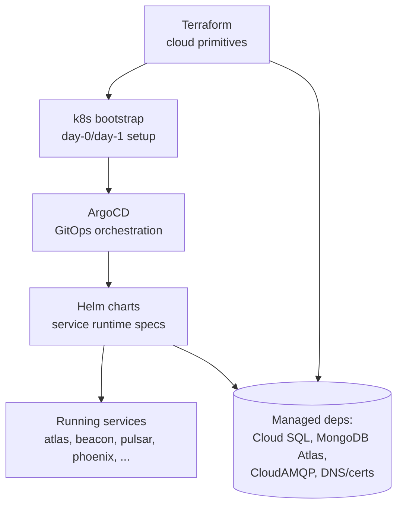

# Diagrams

```mermaid
flowchart TB
    T[Terraform<br/>cloud primitives] --> K[k8s bootstrap<br/>day-0/day-1 setup]
    K --> A[ArgoCD<br/>GitOps orchestration]
    A --> H[Helm charts<br/>service runtime specs]
    H --> S[Running services<br/>atlas, beacon, pulsar, phoenix, ...]
    T --> D[(Managed deps:<br/>Cloud SQL, MongoDB Atlas,<br/>CloudAMQP, DNS/certs)]
    H --> D
```
