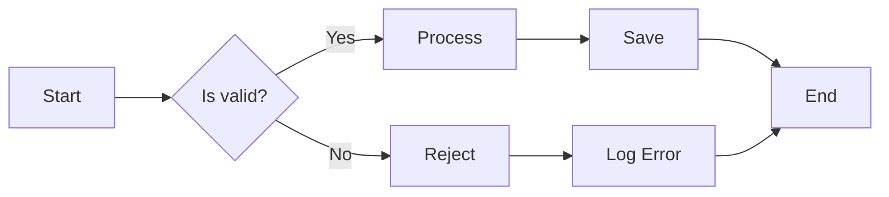
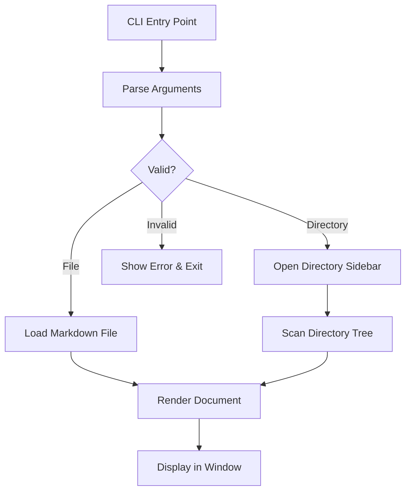
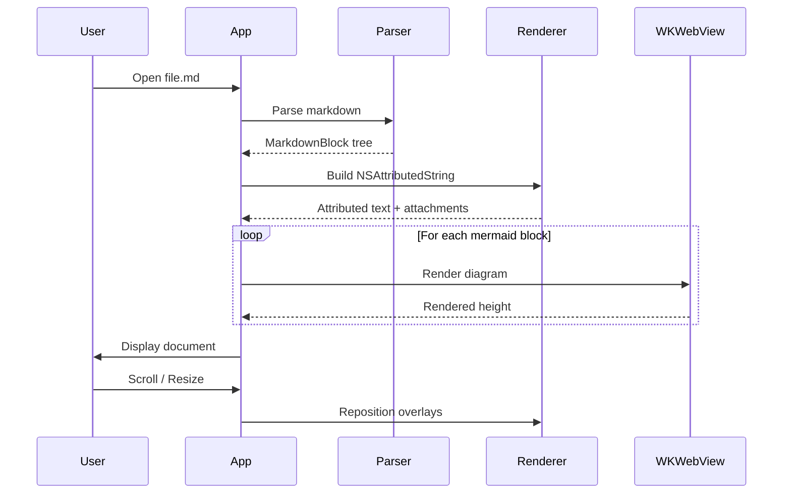
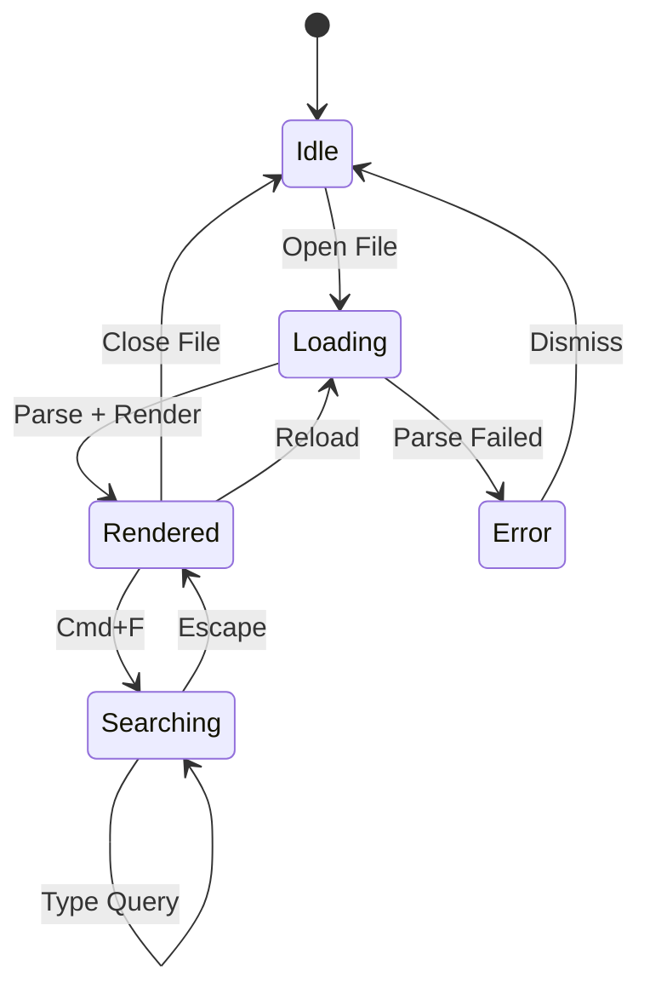
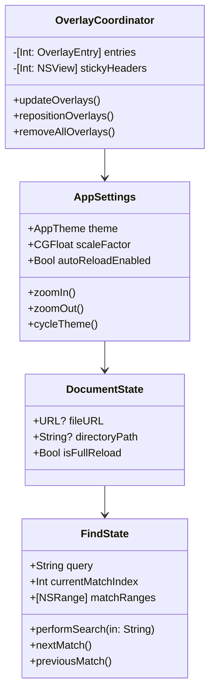
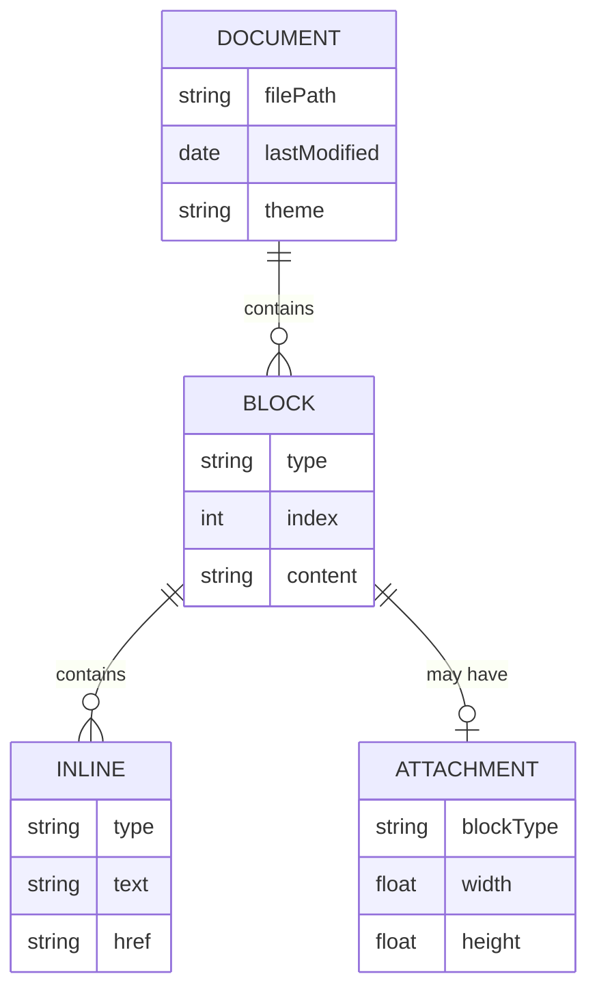
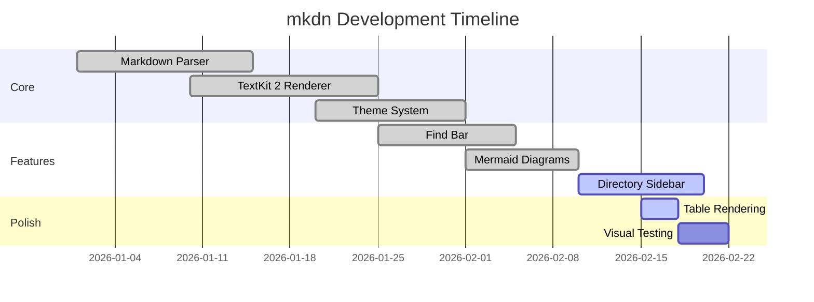
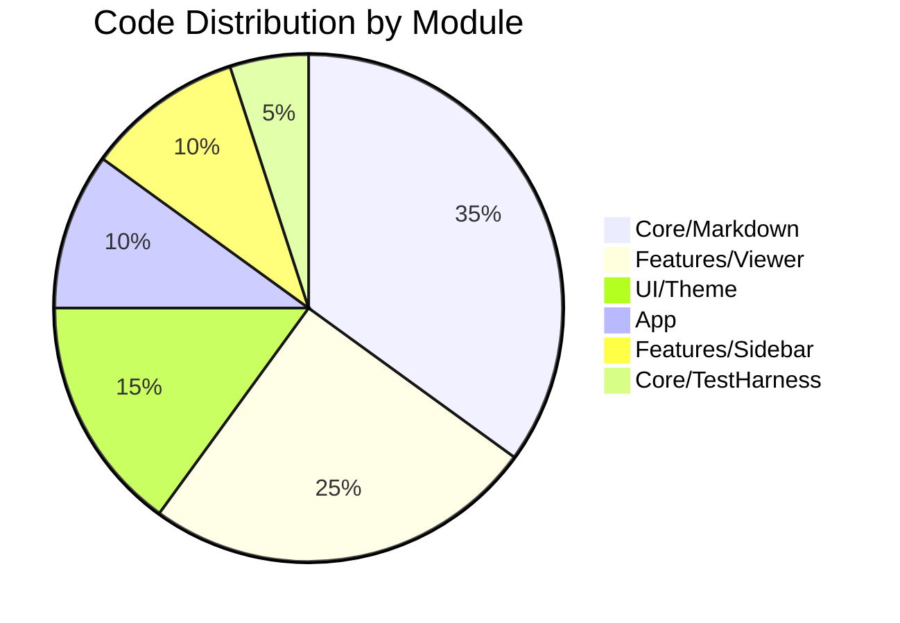
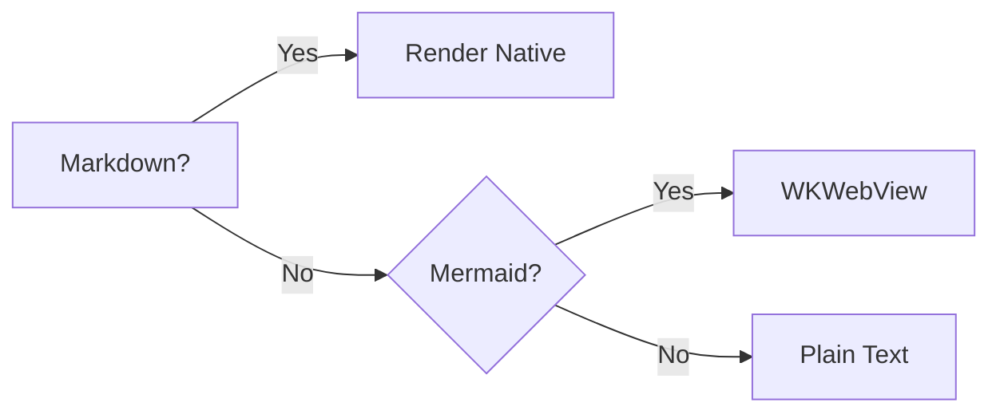

# Mermaid Diagram Rendering Test

## Flowchart (LR)

## Flowchart (TD)

## Sequence Diagram

## State Diagram

## Class Diagram

## Entity Relationship

## Gantt Chart

## Pie Chart

## Text Between Diagrams

This paragraph sits between two Mermaid diagrams to verify spacing and that each diagram gets its own WKWebView instance without interference.

## Simple Decision Flow

End of mermaid test. Text after the last diagram should render normally.
