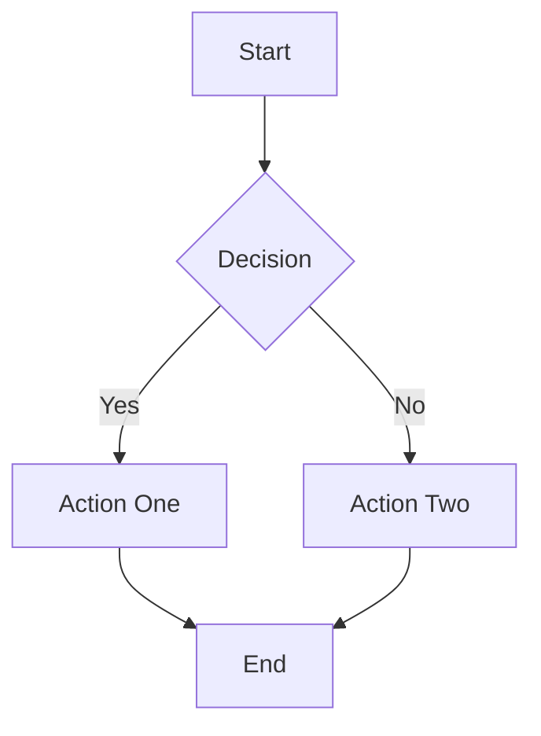

# Resize Test Fixture

This fixture contains one of each overlay type for verifying resize behavior when the window width changes.

## Image

A sample image overlay. When the window narrows, the image should scale down proportionally.

Some text after the image to verify spacing is maintained.

## Table

A table overlay with enough columns to exercise width recomputation on resize.

| Language | Typing | Concurrency Model | Primary Use |
|----------|--------|--------------------|-------------|
| Swift | Static | Actor-based | iOS/macOS apps |
| Python | Dynamic | GIL + asyncio | Scripting, ML |
| Rust | Static | Ownership + Send/Sync | Systems programming |
| Go | Static | Goroutines + channels | Network services |

Text following the table to confirm layout continuity.

## Mermaid Diagram

A flowchart diagram rendered via WKWebView. Should maintain its aspect ratio during resize.

Prose after the diagram to check overlay positioning.

## Math Block

A display math block rendered via SwiftMath.

$$
\int_{0}^{\infty} e^{-x^2} \, dx = \frac{\sqrt{\pi}}{2}
$$

Additional text following the math block.

## Thematic Break

A horizontal rule rendered as a themed divider overlay.

---

Final paragraph after the thematic break to verify all overlays coexist correctly.
