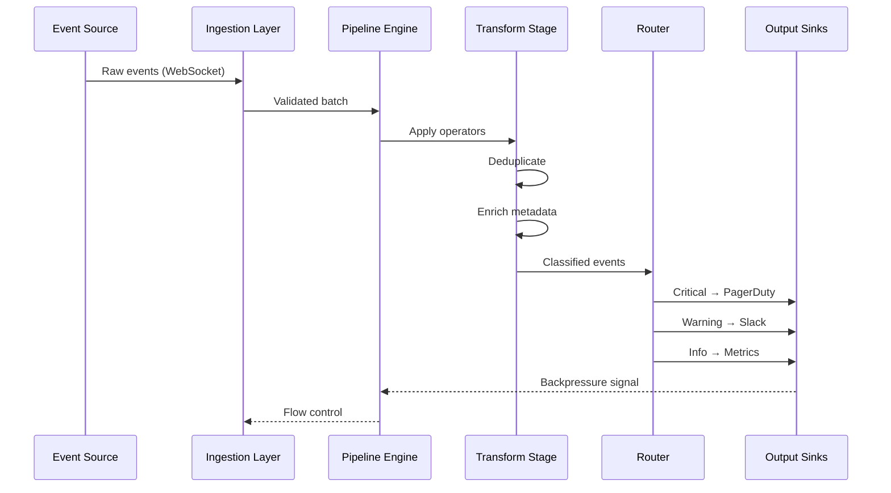
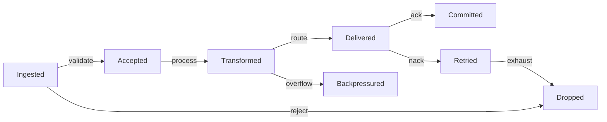

# Pulse

A real-time event processing framework for Swift.

## Overview

Pulse provides a declarative pipeline API for filtering, transforming, and routing events with backpressure support. Built for Swift concurrency from day one.

```swift
let pipeline = Pipeline<RawEvent, ProcessedEvent> {
    Deduplicate(by: \.eventID, window: .seconds(30))
    Transform { event in
        ProcessedEvent(
            id: event.eventID,
            severity: event.classify(),
            timestamp: event.occurredAt,
            payload: try await event.enriched()
        )
    }
    Filter { $0.severity >= .warning }
    Route { event in
        switch event.severity {
        case .critical: PagerDutyHandler()
        case .warning:  SlackChannel("#ops-alerts")
        default:        MetricsCollector()
        }
    }
}

await pipeline.process(eventStream)
```

## Architecture



## Configuration

| Parameter | Default | Description |
|-----------|---------|-------------|
| `batchSize` | 100 | Events per processing batch |
| `flushInterval` | 5s | Maximum time before batch flush |
| `maxRetries` | 3 | Retry count for failed deliveries |
| `backpressureStrategy` | `.drop(.oldest)` | Behavior when sinks are slow |
| `deduplicationWindow` | 30s | Time window for duplicate detection |
| `concurrencyLimit` | 8 | Maximum parallel sink operations |

## Pipeline Stages

> **Design principle:** Each stage is a pure function over an async sequence. Stages compose through operator chaining — no inheritance, no delegates, no callbacks.

### Operators

- **Deduplicate** — Suppress duplicate events within a sliding window
- **Transform** — Map events to a new shape with async enrichment
- **Filter** — Drop events that don't match a predicate
- **Route** — Fan out events to different sinks based on content
- **Buffer** — Absorb bursts with configurable overflow strategies
- **Throttle** — Rate-limit output to protect downstream services

## Metrics



## Getting Started

```swift
import Pulse

@main
struct EventProcessor {
    static func main() async throws {
        let config = PipelineConfig(
            batchSize: 200,
            flushInterval: .seconds(2),
            backpressure: .drop(.oldest)
        )

        let pipeline = Pipeline<IncomingEvent, Alert>(config: config) {
            Deduplicate(by: \.id)
            Transform(enrich)
            Filter { $0.priority >= .high }
            Route(byPriority)
        }

        try await pipeline.connect(to: WebSocketSource(url: endpoint))
    }
}
```
