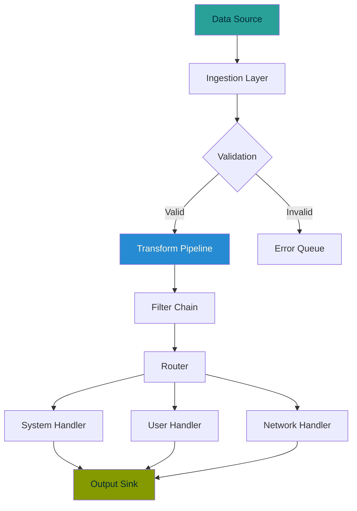

# Lumen

A Swift framework for building composable data pipelines.

---

## Overview

Lumen provides a declarative API for transforming, filtering, and routing data through type-safe pipelines. Built for Swift concurrency from day one.

```swift
let pipeline = Pipeline {
    Transform<RawEvent, ValidatedEvent> { event in
        try event.validated()
    }
    Filter { $0.severity >= .warning }
    Route { event in
        switch event.category {
        case .system:  SystemHandler()
        case .user:    UserHandler()
        case .network: NetworkHandler()
        }
    }
}

await pipeline.process(stream)
```

## Architecture



## Pipeline Stages

| Stage | Input | Output | Async | Throws |
|-------|-------|--------|-------|--------|
| `Transform` | `T` | `U` | Yes | Yes |
| `Filter` | `T` | `T?` | No | No |
| `Route` | `T` | `Handler` | No | No |
| `Batch` | `T` | `[T]` | Yes | No |
| `Throttle` | `T` | `T` | Yes | No |
| `Merge` | `[T]` | `T` | Yes | Yes |

## Installation

Add Lumen to your `Package.swift`:

```swift
dependencies: [
    .package(url: "https://github.com/lumen/lumen.git", from: "2.0.0")
]
```

## Quick Start

### Basic Pipeline

```swift
import Lumen

struct LogEntry: Sendable {
    let timestamp: Date
    let message: String
    let level: Level

    enum Level: Int, Comparable {
        case debug, info, warning, error, critical

        static func < (lhs: Level, rhs: Level) -> Bool {
            lhs.rawValue < rhs.rawValue
        }
    }
}

let logPipeline = Pipeline {
    Filter<LogEntry> { $0.level >= .warning }
    Transform { entry in
        "[\(entry.level)] \(entry.timestamp): \(entry.message)"
    }
    Batch(size: 100, timeout: .seconds(5))
}
```

### Error Handling

> **Note:** All pipeline errors are captured and routed through the error handler. Pipelines never throw — they redirect.

```swift
pipeline.onError { error, context in
    logger.error("Pipeline failed at \(context.stage): \(error)")
    metrics.increment("pipeline.errors", tags: [
        "stage": context.stage.name,
        "type": "\(type(of: error))"
    ])
}
```

## Performance

Benchmarks on M3 Pro, 100K events:

| Pipeline | Throughput | Latency (p99) | Memory |
|----------|-----------|---------------|--------|
| Transform only | 2.1M events/s | 0.4ms | 12 MB |
| Full pipeline | 890K events/s | 1.2ms | 48 MB |
| With persistence | 340K events/s | 3.8ms | 64 MB |

---

*Lumen is MIT licensed. Contributions welcome.*
