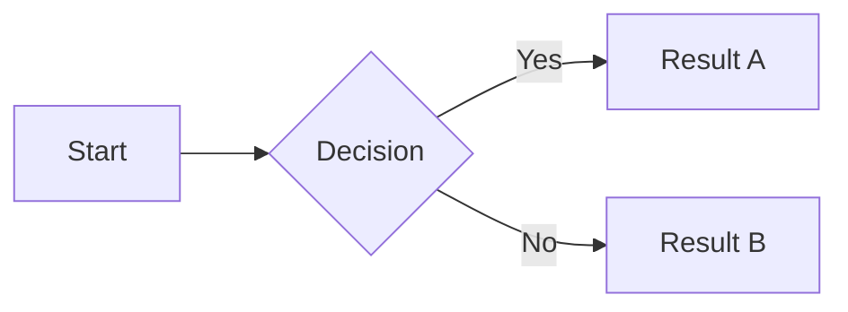

# Heading One

Some body text with **bold**, *italic*, and `inline code`. Here's a [link](https://example.com).

## Code Block

```swift
func greet(name: String) -> String {
    return "Hello, \(name)!"
}
```

## Table

| Feature | Status | Notes |
|---------|--------|-------|
| Markdown rendering | Done | SwiftUI native |
| Mermaid diagrams | Done | WKWebView per diagram |
| Find bar | Done | Custom overlay |

## Blockquote

> This is a blockquote. It should have a colored left border and a subtle background.

## Mermaid Diagram



## Lists

1. First ordered item
2. Second ordered item
   - Nested unordered
   - Another nested

- Unordered item
- Another item

---

### Smaller Heading

Final paragraph with some trailing text to test scroll behavior.
