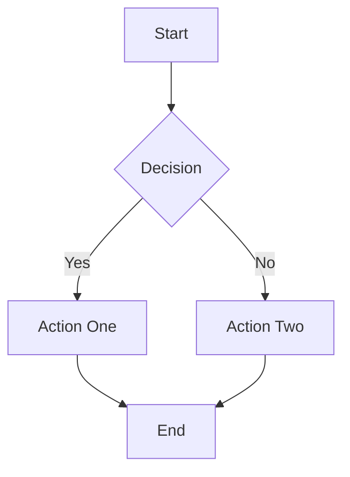
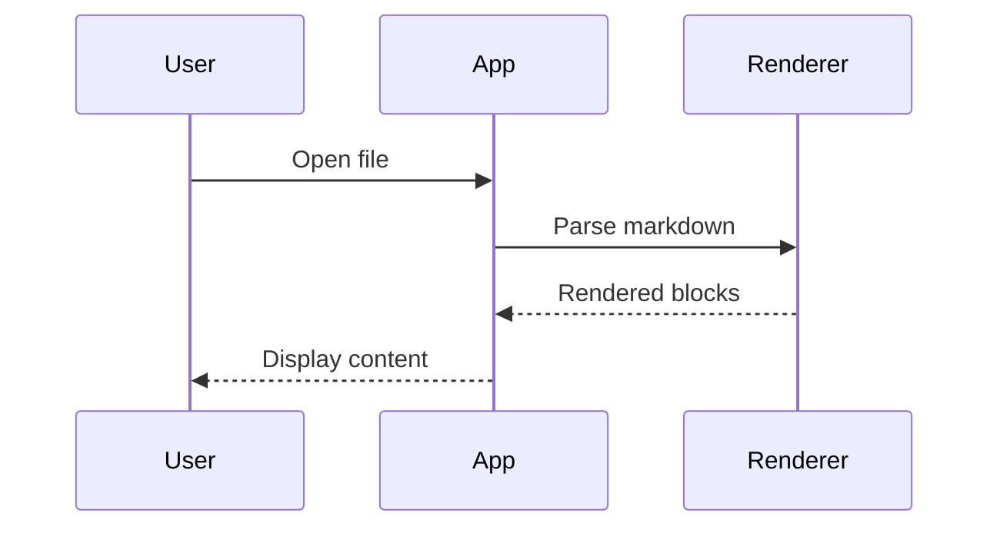

# Heading Level 1

## Heading Level 2

### Heading Level 3

#### Heading Level 4

##### Heading Level 5

###### Heading Level 6

This is a body paragraph with **bold text**, *italic text*, `inline code`, and a [link to example](https://example.com). It also has ~~strikethrough text~~ for completeness.

This is a second paragraph to verify block-to-block spacing between consecutive paragraphs. The distance between this paragraph and the one above should match the block spacing constant.

```swift
import Foundation

/// A sample struct for syntax highlighting verification.
struct TokenSample {
    let name: String = "hello"
    var count: Int = 42
    private var ratio: Double = 3.14

    func greet() -> String {
        return "Hello, \(name)!"
    }
}

// Single-line comment
let result = TokenSample()
```

- First unordered item
- Second unordered item
- Third unordered item

1. First ordered item
2. Second ordered item
3. Third ordered item

> This is a blockquote. It should render with the blockquote border color on the
> left edge and the blockquote background color behind the text.

| Feature | Status | Priority |
|:--------|:------:|--------:|
| Rendering | Complete | High |
| Animation | In Progress | Medium |
| Testing | Planned | High |

---






