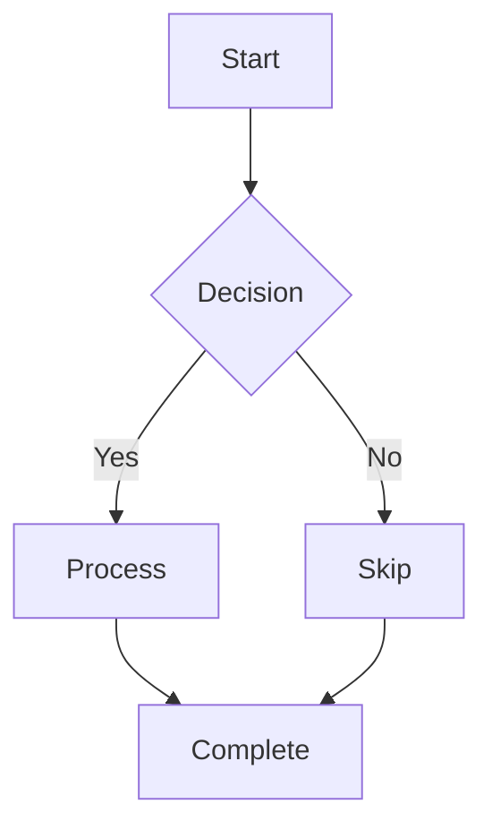

<!--
  Fixture: mermaid-fadein.md
  Purpose: Minimal single-flowchart Mermaid diagram to isolate the fade-in
           rendering artifact without noise from surrounding content.
  Used by: MermaidFadeInCaptureTests -- captures entrance animation frames
           across both themes and motion modes (normal vs reduce-motion) to
           reproduce and diagnose a fade-in artifact on Mermaid renders.

  Expected rendering characteristics:
  - One Mermaid flowchart rendered in a single WKWebView instance
  - Entrance animation: fadeIn + stagger on initial load
  - Reduce-motion captures serve as A/B control (artifact should vanish)
-->

# Mermaid Fade-In Test

