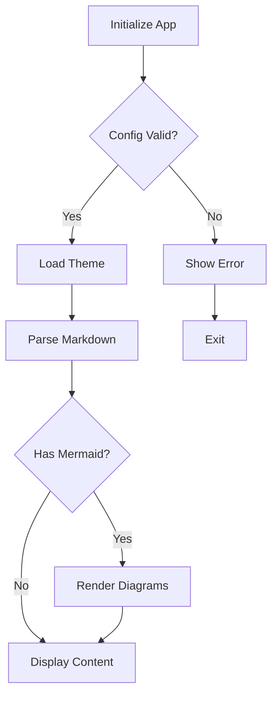
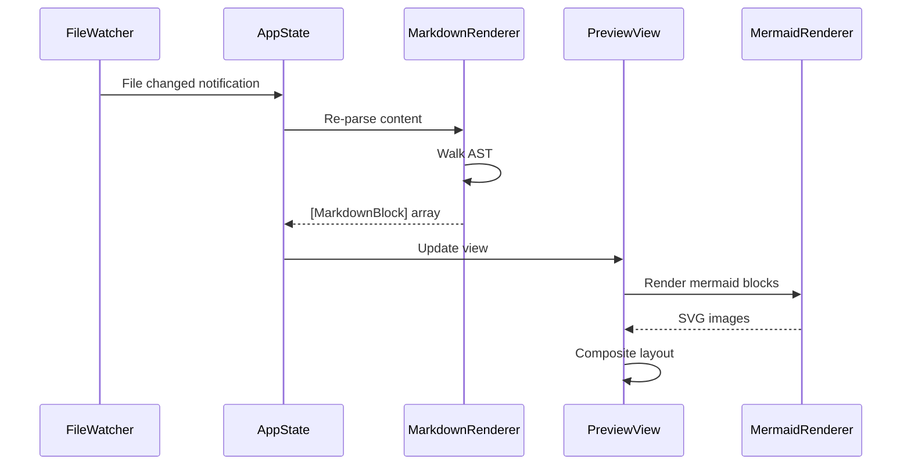
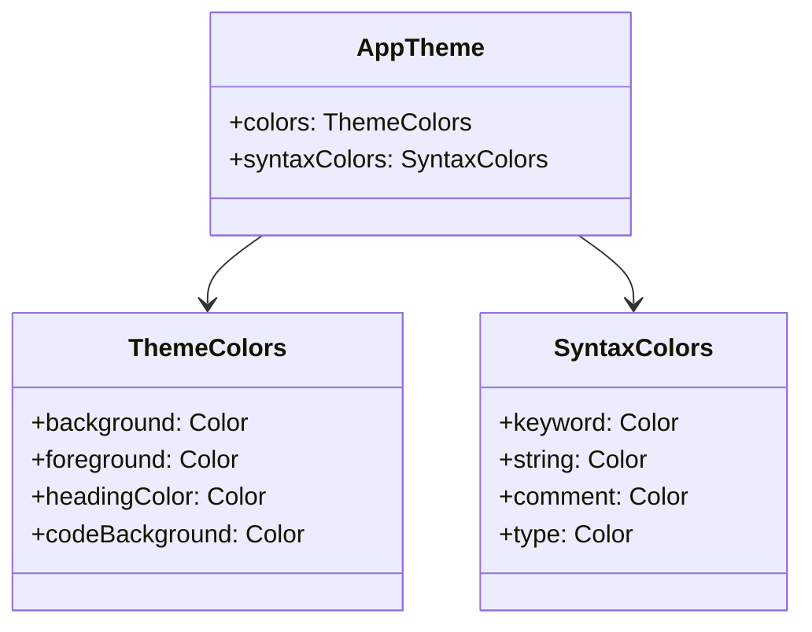
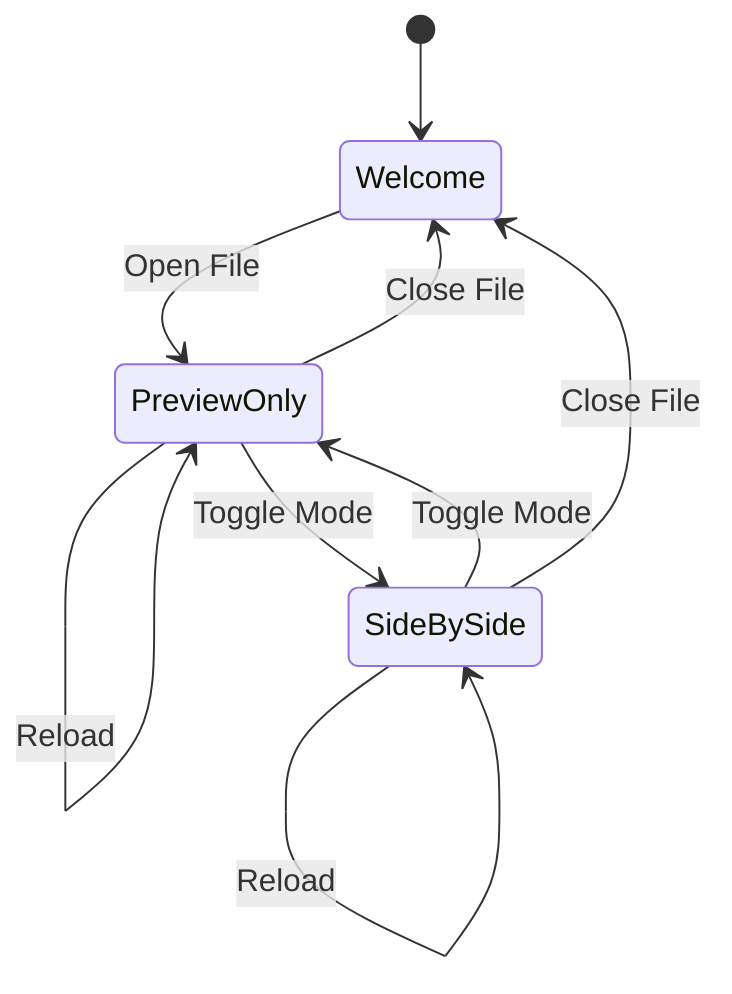

<!--
  Fixture: mermaid-focus.md
  Purpose: Contains multiple Mermaid diagrams for focus interaction testing.
  Used by: Mermaid focus activation/deactivation tests, WKWebView capture
           timing tests, visual compliance tests for diagram rendering.

  Expected rendering characteristics:
  - Four Mermaid diagrams of different types (flowchart, sequence, class, state)
  - Each diagram renders in its own WKWebView instance
  - Click-to-focus interaction model: clicking a diagram activates focus border
  - Focus border uses springSettle animation with focusBorderWidth (2pt)
  - Focus glow uses focusGlowRadius (6pt) with orbGlowColor
  - Unfocused diagrams show hoverBrightness (0.03 white overlay) on hover
  - Render completion must wait for all WKWebView instances to finish
  - Paragraphs between diagrams provide spacing context for spatial tests
-->

# Mermaid Diagram Gallery

This document contains multiple Mermaid diagrams for testing focus interaction, render timing, and visual compliance.

## Flowchart

A standard flowchart with decision nodes and multiple paths.

## Sequence Diagram

A sequence diagram showing component interactions.

## Class Diagram

A class diagram showing the data model relationships.

## State Diagram

A state diagram showing view mode transitions.

This paragraph follows the final diagram to verify spacing between a Mermaid block and subsequent content.
